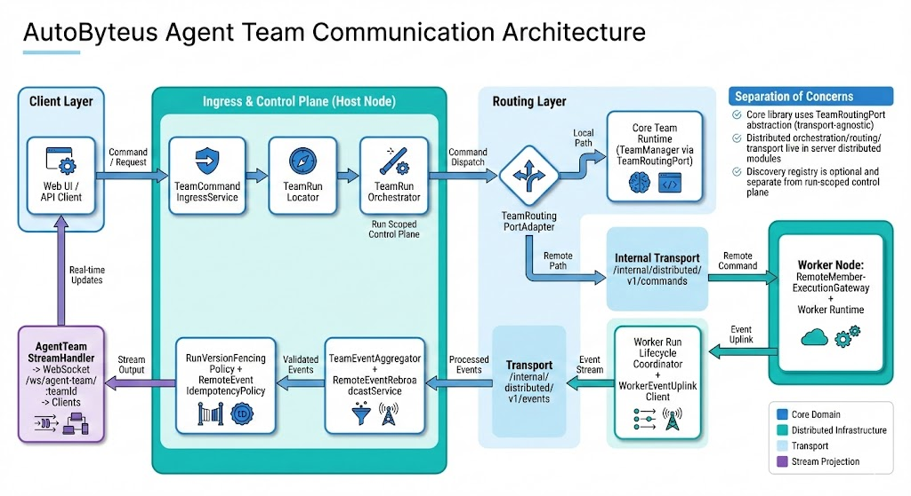

# AutoByteus Server (Node.js / TypeScript)

Fastify-based server with GraphQL, REST, and WebSocket endpoints. This is the Node.js/TypeScript port of the original FastAPI server.

## Agent Team Communication Architecture

This infographic shows the current local + distributed team communication flow, including run-scoped control-plane ingress, routing, worker uplink, and host rebroadcast.



Detailed design notes: `docs/design/agent_team_communication_local_and_distributed.md`

## Prerequisites

- Node.js 18+ (20+ recommended)
- pnpm

## Install

From the monorepo root:

```bash
pnpm install
```

## Environment setup

Create `.env` in `autobyteus-server-ts` (or use `--data-dir` to point to a folder containing a `.env`).

Minimal example:

```env
APP_ENV=production
AUTOBYTEUS_SERVER_HOST=http://localhost:8000
PERSISTENCE_PROVIDER=sqlite
DB_TYPE=sqlite
LOG_LEVEL=INFO
AUTOBYTEUS_HTTP_ACCESS_LOG_MODE=errors
AUTOBYTEUS_HTTP_ACCESS_LOG_INCLUDE_NOISY=false
```

Notes:
- `AUTOBYTEUS_SERVER_HOST` is required (used for URL generation).
- SQLite DB defaults to `db/production.db` (or `db/test.db` when `APP_ENV=test`).
- `DATABASE_URL` is optional for SQLite; when missing, it is derived from the runtime SQLite DB path.
- The app will create `db/`, `logs/`, `download/`, `media/`, `skills/`, `temp_workspace/` as needed under the app data dir.
- HTTP access logging is policy-driven:
  - `AUTOBYTEUS_HTTP_ACCESS_LOG_MODE=off|errors|all` (default: `errors`)
  - `AUTOBYTEUS_HTTP_ACCESS_LOG_INCLUDE_NOISY=true|false` (default: `false`)
  - Noisy routes include discovery heartbeat/peers, health checks, and GraphQL preflight traffic.

Node discovery environment variables:
- `AUTOBYTEUS_NODE_DISCOVERY_ENABLED` (`true|false`)
- `AUTOBYTEUS_NODE_DISCOVERY_ROLE` (`registry|client`)
- `AUTOBYTEUS_NODE_DISCOVERY_REGISTRY_URL` (required when enabled and role is `client`)

## Build and run

From the `autobyteus-server-ts` directory:

```bash
pnpm build
node dist/app.js --host 0.0.0.0 --port 8000
```

From the monorepo root:

```bash
pnpm -C autobyteus-server-ts build
node autobyteus-server-ts/dist/app.js --host 0.0.0.0 --port 8000
```

Canonical enterprise startup for frontend + host backend + docker node is documented in:
- `/Users/normy/autobyteus_org/autobyteus-workspace/README.md` (`Enterprise local startup (canonical)`).

Data-dir policy:
- Do not pass `--data-dir ~/.autobyteus/server-data` unless explicitly required.
- Default host data-dir should remain project-local (under `autobyteus-server-ts/`).

Notes:
- `pnpm -C autobyteus-server-ts build` also builds the `autobyteus-ts` workspace package.
- `repository_prisma` is consumed as a normal npm dependency (no local sibling clone required).

### Run with Node Discovery Locally

Run this node as a discovery registry:

```bash
AUTOBYTEUS_SERVER_HOST=http://localhost:8000 \
AUTOBYTEUS_NODE_DISCOVERY_ENABLED=true \
AUTOBYTEUS_NODE_DISCOVERY_ROLE=registry \
node dist/app.js --host 0.0.0.0 --port 8000
```

Run another node as a discovery client (example uses local registry at `http://localhost:8000`):

```bash
AUTOBYTEUS_SERVER_HOST=http://localhost:8001 \
AUTOBYTEUS_NODE_DISCOVERY_ENABLED=true \
AUTOBYTEUS_NODE_DISCOVERY_ROLE=client \
AUTOBYTEUS_NODE_DISCOVERY_REGISTRY_URL=http://localhost:8000 \
node dist/app.js --host 0.0.0.0 --port 8001
```

Example: run two local servers (registry on `8000`, client on `8001`)

Terminal 1 (registry):

```bash
AUTOBYTEUS_SERVER_HOST=http://localhost:8000 \
AUTOBYTEUS_NODE_DISCOVERY_ENABLED=true \
AUTOBYTEUS_NODE_DISCOVERY_ROLE=registry \
node dist/app.js --host 0.0.0.0 --port 8000
```

Terminal 2 (client):

```bash
AUTOBYTEUS_SERVER_HOST=http://localhost:8001 \
AUTOBYTEUS_NODE_DISCOVERY_ENABLED=true \
AUTOBYTEUS_NODE_DISCOVERY_ROLE=client \
AUTOBYTEUS_NODE_DISCOVERY_REGISTRY_URL=http://localhost:8000 \
node dist/app.js --host 0.0.0.0 --port 8001
```

### Canonical Hybrid Two-Node Restart (Host `8000` + Docker `8001`)

Use this exact sequence when you need one non-Docker registry node and one Docker client node.

1. Stop existing sessions:

```bash
# stop local host node (if running)
HOST_PIDS="$(lsof -tiTCP:8000 -sTCP:LISTEN)"
if [ -n "$HOST_PIDS" ]; then
  kill $HOST_PIDS
fi

# stop docker node
cd autobyteus-server-ts/docker
docker compose down
```

2. Rebuild server artifacts and Docker image:

```bash
# from monorepo root
pnpm -C autobyteus-server-ts build

# rebuild docker image used by compose
cd autobyteus-server-ts/docker
./build.sh
```

3. Start Docker client node on `8001`:

```bash
cd autobyteus-server-ts/docker
./start.sh
```

4. Start host registry node on `8000` (same command every time):

```bash
cd autobyteus-server-ts
AUTOBYTEUS_SERVER_HOST=http://localhost:8000 \
AUTOBYTEUS_NODE_DISCOVERY_ENABLED=true \
AUTOBYTEUS_NODE_DISCOVERY_ROLE=registry \
node dist/app.js --host 0.0.0.0 --port 8000
```

5. Verify both nodes:

```bash
curl -fsS http://127.0.0.1:8000/rest/health
curl -fsS http://127.0.0.1:8001/rest/health
```

Notes:
- Docker `8001` client discovery target is configured in `autobyteus-server-ts/docker/.env`:
  `AUTOBYTEUS_NODE_DISCOVERY_REGISTRY_URL=http://host.docker.internal:8000`.
- Keep the host `8000` terminal open while testing, or run it under your preferred process supervisor.

Inline env vars are supported and recommended for quick local runs. They override `.env` for that process invocation.

Equivalent `.env` values for registry mode:

```env
AUTOBYTEUS_NODE_DISCOVERY_ENABLED=true
AUTOBYTEUS_NODE_DISCOVERY_ROLE=registry
AUTOBYTEUS_NODE_DISCOVERY_REGISTRY_URL=
```

Optional custom data directory:

```bash
node autobyteus-server-ts/dist/app.js --data-dir /path/to/data --host 0.0.0.0 --port 8000
```

## Database migrations

Migrations are executed on startup via:

```bash
pnpm -C autobyteus-server-ts exec prisma migrate deploy
```

You can also run it manually.

## Docker

Build from repo root (required so workspace packages are available):

```bash
docker build -f autobyteus-server-ts/docker/Dockerfile.monorepo -t autobyteus-server-ts .
```

Run:

```bash
docker run --rm -p 8000:8000 autobyteus-server-ts
```

Server-only development stack (compose + bootstrap scripts) is in:

```bash
autobyteus-server-ts/docker
```

Quick start:

```bash
cd autobyteus-server-ts/docker
cp .env.example .env
./build.sh
./start.sh
```

## Android quick bootstrap (Termux + proot)

If you want to run this server on an Android phone with minimal manual steps, use:

```bash
bash autobyteus-server-ts/scripts/android/host_prepare_android_payload.sh
```

Then on the phone in Termux:

```bash
bash /sdcard/Download/autobyteus_termux_bootstrap.sh
```

Verify from your computer:

```bash
adb shell 'run-as com.termux /data/data/com.termux/files/usr/bin/proot-distro login debian --shared-tmp -- /bin/bash -lc "curl -sS http://127.0.0.1:8000/rest/health"'
```

Startup can take ~20-40 seconds before health returns 200.

Details are in:

```bash
autobyteus-server-ts/scripts/android/README.md
```

## Tests

```bash
pnpm -C autobyteus-server-ts exec vitest
```

Notes:
- Tests use `.env.test` and a temporary SQLite DB at `tests/.tmp/`.
- Some integration tests are env-gated (e.g., `AUTOBYTEUS_DOWNLOAD_TEST_URL`).

Run a single test file:

```bash
pnpm -C autobyteus-server-ts exec vitest run tests/unit/config/app-config.test.ts --no-watch
```

## Documentation

TypeScript server documentation is available under `autobyteus-server-ts/docs`.

Recommended starting points:

- `docs/README.md`
- `docs/ARCHITECTURE.md`
- `docs/PROJECT_OVERVIEW.md`
- `docs/URL_GENERATION_AND_ENV_STRATEGY.md`
- `docs/modules/README.md`
- `docs/design/startup_initialization_and_lazy_services.md`

## Endpoints

- REST: `/rest/*`
- GraphQL: `/graphql` (subscriptions enabled)
- WebSocket:
  - `/ws/agent/:agentId`
  - `/ws/agent-team/:teamId`
  - `/ws/terminal/:workspaceId/:sessionId`
  - `/ws/file-explorer/:workspaceId`
