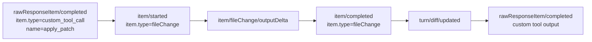

# Codex Raw Event Mapping

## Purpose

This document is the canonical audit table for how raw Codex App Server thread events are interpreted inside `autobyteus-server-ts`, applied to Codex thread state, and converted into normalized `AgentRunEvent`s.

Use this document when:
- debugging a runtime behavior mismatch,
- reviewing Codex event-conversion changes,
- deciding whether a raw event should drive lifecycle, artifact, activity, or thread-state readiness,
- checking whether an older raw-event name is still part of the active protocol.

## Authoritative Boundary

The authoritative raw-event interpretation boundaries live under:

- `src/agent-execution/backends/codex/thread/`
- `src/agent-execution/backends/codex/events/`

The most important owners are:

- `codex-thread-notification-handler.ts` — authoritative owner for applying raw notification side effects to `CodexThread` state (`threadId`, status, active turn, token-usage readiness)
- `codex-thread-event-converter.ts` — top-level Codex raw-message dispatcher
- `codex-item-event-converter.ts` — authoritative owner for `item/*` event fan-out
- `codex-turn-event-converter.ts` — authoritative owner for `turn/*` events
- `codex-thread-lifecycle-event-converter.ts` — authoritative owner for `thread/*` and `error`
- `codex-raw-response-event-converter.ts` — raw-response sidecar normalization
- `codex-thread-server-request-handler.ts` — server-request handling for approval requests and dynamic tool calls

Higher layers should depend on `CodexThread` state and normalized `AgentRunEvent`s exposed by these owners. They should not infer Codex raw protocol details themselves.

## Apply-Patch / Edit-File Spine

For Codex `apply_patch`, the authoritative mutation spine is the raw `fileChange` item lifecycle, not the `custom_tool_call` completion.

Normalized result:

- `item/started(fileChange)` -> `SEGMENT_START(edit_file)` + `TOOL_EXECUTION_STARTED(edit_file)`
- `item/fileChange/outputDelta` -> `TOOL_LOG(edit_file)`
- `item/completed(fileChange)` -> terminal lifecycle (`TOOL_DENIED` / `TOOL_EXECUTION_FAILED` / `TOOL_EXECUTION_SUCCEEDED`) + `SEGMENT_END(edit_file)`
- `turn/diff/updated` -> intentionally ignored for normalized state because it is supplemental diff data, not the owner of lifecycle or changed-file availability

## Dynamic Tool Lifecycle Spine

For Codex dynamic tools, including team `send_message_to`, the raw
`dynamicToolCall` item lifecycle is the authoritative execution lifecycle.
Display/conversation segments and tool execution lifecycle remain separate
normalized surfaces.

Normalized result:

- `item/started(dynamicToolCall)` -> `SEGMENT_START(tool_call)` + `TOOL_EXECUTION_STARTED`
- `item/completed(dynamicToolCall)` -> exactly one terminal lifecycle event (`TOOL_EXECUTION_SUCCEEDED` or `TOOL_EXECUTION_FAILED`) + `SEGMENT_END(tool_call)`
- `rawResponseItem/completed(functionCallOutput)` -> `TOOL_LOG` diagnostic output only

`SEGMENT_START` / `SEGMENT_END` tell the UI that a tool-call segment exists and
has finished display parsing. They are not execution success/failure authority.
`TOOL_EXECUTION_*` events drive Activity terminal state and storage-only memory
tool-call/tool-result traces. Browser dynamic tools use this same generalized
dynamic-tool mapping rather than a browser-specific terminal lifecycle branch.

## Web Search Lifecycle Spine

For Codex built-in web search, the raw `webSearch` item lifecycle is the
authoritative execution lifecycle for the visible `search_web` tool. The
converter keeps the transcript segment lane and Activity lifecycle lane separate
so the middle transcript and right-side Activity panel agree while lifecycle
events remain the authority for execution and terminal state.

Normalized result:

- `item/started(webSearch)` -> `SEGMENT_START(tool_call, tool_name=search_web)` + `TOOL_EXECUTION_STARTED(search_web)`
- `item/completed(webSearch)` -> exactly one terminal lifecycle event (`TOOL_EXECUTION_SUCCEEDED` or `TOOL_EXECUTION_FAILED`) + `SEGMENT_END(tool_call)`

`SEGMENT_START` / `SEGMENT_END` continue to own transcript structure and may
seed or hydrate pending Activity display facts through the shared frontend
Activity projection. `TOOL_EXECUTION_*` events own executing/terminal state,
result/error, logs, and storage-only memory tool traces for `search_web`.

## Provider Compaction Boundary Guardrail

Codex provider/session compaction signals are provider-owned context management, not AutoByteus semantic compaction. The installed Codex protocol may expose names or payloads such as `thread/compacted`, `ContextCompactedEvent`, or Responses `type = "compaction"` items. This server integration may normalize those signals into `COMPACTION_STATUS` events carrying a `provider_compaction_boundary` payload.

Allowed downstream effect:

- append one provenance raw-trace marker for one deduplicated provider boundary;
- for rotation-eligible boundaries, move settled active raw traces before the marker into one complete segmented archive entry;
- keep active plus complete archive segments as the complete local raw-trace corpus.

Forbidden downstream effect:

- semantic/episodic memory creation for Codex;
- local trace content rewrite or trace history loss;
- runtime memory retrieval or injection;
- archive compression, total-retention policy, or snapshot-windowing policy hidden inside the converter/recorder path.

## Raw Event Audit Table

| Raw Method | Raw Shape / Guard | Normalized Output | Owner | Decision |
| --- | --- | --- | --- | --- |
| `turn/started` | turn lifecycle start | `TURN_STARTED(turnId)` and `AGENT_STATUS(new_status=RUNNING)` | `codex-turn-event-converter.ts` | Keep |
| `turn/completed` | turn lifecycle end | `TURN_COMPLETED(turnId)` and `AGENT_STATUS(new_status=IDLE)` and reasoning tracker reset | `codex-turn-event-converter.ts` | Keep |
| `turn/diff/updated` | supplemental unified diff for a turn | none | `codex-turn-event-converter.ts` | Keep as explicit no-op |
| `turn/taskProgressUpdated` | task progress payload | `TODO_LIST_UPDATE` | `codex-turn-event-converter.ts` | Keep |
| `item/started` | `item.type = commandExecution` | `TOOL_EXECUTION_STARTED` | `codex-item-event-converter.ts` | Keep |
| `item/completed` | `item.type = commandExecution` | `TOOL_DENIED` or `TOOL_EXECUTION_FAILED` or `TOOL_EXECUTION_SUCCEEDED` | `codex-item-event-converter.ts` | Keep |
| `item/started` | `item.type = dynamicToolCall` | `SEGMENT_START(tool_call)`, `TOOL_EXECUTION_STARTED` | `codex-item-event-converter.ts` | Keep |
| `item/completed` | `item.type = dynamicToolCall` | `TOOL_EXECUTION_FAILED` when `success === false` or status is failure-like; otherwise `TOOL_EXECUTION_SUCCEEDED`; always ends with `SEGMENT_END(tool_call)` | `codex-item-event-converter.ts` | Keep |
| `item/started` | `item.type = webSearch` | `SEGMENT_START(tool_call, tool_name=search_web)`, `TOOL_EXECUTION_STARTED(search_web)` | `codex-item-event-converter.ts` | Keep |
| `item/completed` | `item.type = webSearch` | `TOOL_EXECUTION_FAILED` when status is failure-like; otherwise `TOOL_EXECUTION_SUCCEEDED(search_web)`; always ends with `SEGMENT_END(tool_call)` | `codex-item-event-converter.ts` | Keep |
| `item/started` | `item.type = fileChange` | `SEGMENT_START(edit_file)`, `TOOL_EXECUTION_STARTED(edit_file)` | `codex-item-event-converter.ts` | Keep |
| `item/completed` | `item.type = fileChange` | `TOOL_DENIED` or `TOOL_EXECUTION_FAILED` or `TOOL_EXECUTION_SUCCEEDED(edit_file)`; always ends with `SEGMENT_END(edit_file)` | `codex-item-event-converter.ts` | Keep |
| `item/agentMessage/delta` | agent visible text delta | `SEGMENT_CONTENT(text)` | `codex-item-event-converter.ts` | Keep |
| `item/reasoning/delta` | reasoning delta | `SEGMENT_CONTENT(reasoning)` | `codex-item-event-converter.ts` | Keep |
| `item/reasoning/summaryPartAdded` | reasoning summary delta | `SEGMENT_CONTENT(reasoning)` | `codex-item-event-converter.ts` | Keep |
| `item/reasoning/completed` | reasoning snapshot completion | `SEGMENT_CONTENT(reasoning)` | `codex-item-event-converter.ts` | Keep |
| `item/plan/delta` | plan/todo delta | `TODO_LIST_UPDATE` | `codex-item-event-converter.ts` | Keep |
| `item/commandExecution/requestApproval` | command approval request | `TOOL_APPROVAL_REQUESTED` | `codex-item-event-converter.ts` | Keep |
| `item/fileChange/requestApproval` | file-change approval request | `TOOL_APPROVAL_REQUESTED(edit_file)` | `codex-item-event-converter.ts` | Keep |
| `codex/local/toolApproved` | local approval acknowledgement | `TOOL_APPROVED` | `codex-item-event-converter.ts` | Keep |
| `item/fileChange/outputDelta` | file-change status/log text | `TOOL_LOG(edit_file)` | `codex-item-event-converter.ts` | Keep |
| `item/tool/call` | dynamic tool call server request | no `AgentRunEvent`; handled as request/response control flow | `codex-thread-server-request-handler.ts` | Keep outside normalized runtime-event spine |
| `rawResponseItem/completed` | `item.type = functionCallOutput` | `TOOL_LOG` | `codex-raw-response-event-converter.ts` | Keep |
| `rawResponseItem/completed` | `item.type = custom_tool_call` or custom tool output | none in the normalized runtime-event spine | `codex-raw-response-event-converter.ts` | Keep ignored; file mutation state comes from `fileChange` events |
| `rawResponseItem/completed` | `item.type = compaction` | `COMPACTION_STATUS(kind=provider_compaction_boundary, source_surface=codex.raw_response_compaction_item, rotation_eligible=true)` | `codex-raw-response-event-converter.ts`, `ProviderCompactionBoundaryRecorder` | Keep as storage-only duplicate-window fallback/provenance; de-dupe with `thread/compacted` |
| `thread/started` | thread lifecycle start | none | `codex-thread-lifecycle-event-converter.ts` | Keep as explicit no-op |
| `thread/status/changed` | runtime status payload | `AGENT_STATUS` | `codex-thread-lifecycle-event-converter.ts` | Keep |
| `thread/tokenUsage/updated` | token accounting update | none in normalized stream; records per-turn token usage readiness on `CodexThread` | `codex-thread-notification-handler.ts`, `codex-thread-lifecycle-event-converter.ts` | Keep as thread-state side effect plus explicit normalized no-op |
| `thread/compacted` | provider-owned context compaction boundary | `COMPACTION_STATUS(kind=provider_compaction_boundary, source_surface=codex.thread_compacted, rotation_eligible=true)` | `codex-thread-lifecycle-event-converter.ts`, `ProviderCompactionBoundaryRecorder` | Keep as storage-only marker/rotation boundary; not semantic compaction |
| `error` | runtime error payload | `ERROR` | `codex-thread-lifecycle-event-converter.ts` | Keep |

## Legacy / Removed Raw-Name Assumptions

These names are not part of the active Codex App Server contract in this codebase and should not be reintroduced as parallel mappings:

- `turn/diffUpdated`
- `item/fileChange/delta`
- `item/fileChange/completed`

The active names and shapes are instead:

- `turn/diff/updated`
- `item/fileChange/outputDelta`
- generic `item/started` / `item/completed` with `item.type = fileChange`

## Raw Debug Logging

To capture raw Codex events before normalization, configure:

- `CODEX_THREAD_RAW_EVENT_LOG_DIR=/absolute/path`

Optional console debug flags:

- `CODEX_THREAD_EVENT_DEBUG=1`
- `CODEX_THREAD_RAW_EVENT_DEBUG=1`
- `CODEX_THREAD_RAW_EVENT_MAX_CHARS=<number>`

Output shape:

- JSONL file name: `codex-run-<runId>.jsonl`
- one line per raw event with:
  - timestamp
  - backend / scope / scopeId
  - raw `eventName`
  - selected metadata (`itemId`, `itemType`, `callId`, `turnId`, payload keys)
  - full raw payload

## Operational Rules

- Treat `fileChange` item lifecycle as the authoritative owner for Codex `edit_file` lifecycle and changed-file availability.
- Treat `dynamicToolCall` item lifecycle as the authoritative owner for Codex dynamic-tool execution lifecycle. Use its lifecycle events, not display-only `SEGMENT_*` events or diagnostic `TOOL_LOG`, for Activity success/error status and storage-only memory tool traces.
- Treat `webSearch` item lifecycle as the authoritative owner for Codex `search_web` execution status and storage-only memory tool traces. Segment events may seed pending Activity visibility, but lifecycle events own Activity executing/success/error status.
- Treat `thread/tokenUsage/updated` as a `CodexThread` state update. Persist ready per-turn usage from the thread boundary instead of parsing raw token payloads in higher runtime layers.
- Treat provider/session compaction signals as storage-only boundary metadata: marker append plus eligible segmented archive rotation only. Never treat them as permission for semantic compaction, trace-content rewrite, trace loss, runtime memory retrieval, or runtime memory injection.
- Do not infer `edit_file` success from published-artifact transport on the frontend.
- Do not promote `turn/diff/updated` into lifecycle or artifact ownership without a new explicit design decision.
- When new raw Codex event names appear, update this audit table before extending the converter boundary.
