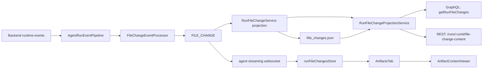

# Agent Artifacts

## Overview

The Artifacts tab is now backed by one run-scoped file-change model.

That model covers:

- `write_file`
- `edit_file`
- generated outputs from known output-producing tools (`generate_image`, `edit_image`, `generate_speech`, including the AutoByteus image/audio MCP forms)

The backend owns path identity, live status, and historical replay. The frontend renders one unified list from `runFileChangesStore`.

## Canonical Runtime Shape

```ts
interface RunFileChangeEntry {
  id: string; // runId:path
  runId: string;
  path: string; // canonical relative-in-workspace or absolute outside-workspace
  type: 'file' | 'image' | 'audio' | 'video' | 'pdf' | 'csv' | 'excel' | 'other';
  status: 'streaming' | 'pending' | 'available' | 'failed';
  sourceTool: 'write_file' | 'edit_file' | 'generated_output';
  sourceInvocationId: string | null;
  content?: string | null; // transient live write buffer only
  createdAt: string;
  updatedAt: string;
}
```

Key rules:

- one row per `runId + canonical path`
- current filesystem content is the source of truth for committed previews
- `content` is transient and only used for live buffered `write_file` rendering
- generated outputs are represented as `sourceTool = 'generated_output'`
- generic `file_path`/`filePath` fields are not artifact evidence unless they are returned by a known generated-output tool or paired with explicit output/destination semantics
- `FILE_CHANGE` is a state-update stream, not an exact-one occurrence guarantee; pre-available status sequences are runtime-shaped, so a row can move `streaming -> available`, `pending -> available`, or receive idempotent duplicate interim `streaming`/`pending` updates before terminal state

## High-Level Data Flow



## Backend Owners

| Owner | Path | Responsibility |
| --- | --- | --- |
| Event pipeline | `autobyteus-server-ts/src/agent-execution/events/agent-run-event-pipeline.ts` | runs post-normalization event processors once per backend batch before subscriber fan-out |
| File-change derivation | `autobyteus-server-ts/src/agent-execution/events/processors/file-change/file-change-event-processor.ts` | derives `FILE_CHANGE` from explicit mutation tools and known generated-output tools; read-only and unknown generic `file_path` events stay out of Artifacts |
| Live projection | `autobyteus-server-ts/src/services/run-file-changes/run-file-change-service.ts` | consumes `FILE_CHANGE` only, projects one row per canonical path, and persists metadata |
| Path identity | `autobyteus-server-ts/src/services/run-file-changes/run-file-change-path-identity.ts` | canonicalizes workspace-local paths and resolves absolute preview paths |
| Projection persistence | `autobyteus-server-ts/src/services/run-file-changes/run-file-change-projection-store.ts` | reads and writes the canonical `file_changes.json` metadata file and strips transient `content` before persistence |
| Historical read boundary | `autobyteus-server-ts/src/run-history/services/run-file-change-projection-service.ts` | reads the active in-memory owner for live runs and normalized persisted projections for inactive runs |
| Preview route | `autobyteus-server-ts/src/api/rest/run-file-changes.ts` | streams the current file bytes for text and media previews by `runId + path` |

## Durable Storage

Canonical persistence lives at:

```text
<run-memory-dir>/file_changes.json
```

That is the only supported persisted source for this feature. Legacy `run-file-changes/projection.json` is intentionally ignored, so legacy-only runs hydrate no rows.

Only metadata is persisted. Transient `content` is stripped before writing.

## Frontend Owners

| Owner | Path | Responsibility |
| --- | --- | --- |
| Unified store | `autobyteus-web/stores/runFileChangesStore.ts` | owns hydrated and live rows for touched files plus generated outputs |
| Stream ingestion | `autobyteus-web/services/agentStreaming/handlers/fileChangeHandler.ts` | applies `FILE_CHANGE` payloads into the unified store |
| Hydration | `autobyteus-web/services/runHydration/runContextHydrationService.ts` | loads `getRunFileChanges(runId)` during reopen/recovery |
| Artifacts list | `autobyteus-web/components/workspace/agent/ArtifactsTab.vue` | renders one sorted list directly from `runFileChangesStore` |
| Viewer | `autobyteus-web/components/workspace/agent/ArtifactContentViewer.vue` | renders buffered text or fetches current server-backed bytes from the run-scoped preview route |

The legacy secondary artifacts store is no longer part of the runtime path.

## Viewer Resolution Rules

`ArtifactContentViewer` resolves content in this order:

1. live `write_file` row with `streaming` or `pending` status -> render buffered inline `content`
2. `failed` row -> render explicit failure state
3. non-`available` row -> render pending state
4. `available` row -> fetch `/runs/:runId/file-change-content?path=...`
5. text response -> render text content
6. non-text response -> create an object URL and hand it to the file viewer
7. `404` -> deleted state
8. `409` -> pending server-capture state

## Reopen / Historical Behavior

When reopening a run:

1. the frontend requests `getRunFileChanges(runId)`
2. active runs are served from the live in-memory owner
3. inactive runs are served from normalized persisted metadata
4. the frontend hydrates `runFileChangesStore`
5. committed content is still fetched from the preview route on demand

This keeps historical replay lightweight while still using current filesystem bytes when a preview is requested.

## Testing

Primary coverage for the unified model lives in:

- `autobyteus-server-ts/tests/unit/agent-execution/events/agent-run-event-pipeline.test.ts`
- `autobyteus-server-ts/tests/unit/agent-execution/events/file-change-event-processor.test.ts`
- `autobyteus-server-ts/tests/unit/services/run-file-changes/run-file-change-service.test.ts`
- `autobyteus-server-ts/tests/unit/services/run-file-changes/run-file-change-projection-store.test.ts`
- `autobyteus-server-ts/tests/unit/services/run-file-changes/run-file-change-path-identity.test.ts`
- `autobyteus-server-ts/tests/unit/run-history/services/run-file-change-projection-service.test.ts`
- `autobyteus-server-ts/tests/unit/api/rest/run-file-changes.test.ts`
- `autobyteus-web/stores/__tests__/runFileChangesStore.spec.ts`
- `autobyteus-web/services/agentStreaming/handlers/__tests__/fileChangeHandler.spec.ts`
- `autobyteus-web/components/workspace/agent/__tests__/ArtifactContentViewer.spec.ts`
- `autobyteus-web/components/workspace/agent/__tests__/ArtifactsTab.spec.ts`
- `autobyteus-web/components/layout/__tests__/RightSideTabs.spec.ts`

## Related Docs

- [File Explorer](./file_explorer.md)
- [Content Rendering](./content_rendering.md)
- [Agent Execution Architecture](./agent_execution_architecture.md)
