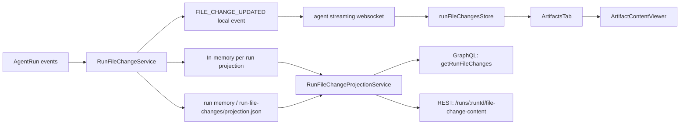

# Agent Artifacts

## Overview

The Artifacts tab now combines two different runtime sources:

- **run-scoped file changes** for `write_file` and `edit_file`
- **generated outputs** such as image/audio/video/pdf artifacts

The important architectural split is:

- file changes are now **backend-owned**
- generated outputs still follow the existing artifact event path

For file changes, the backend is the source of truth for both live runs and reopened history. The frontend no longer tries to infer content from Electron-local paths.

## File-Change Runtime Model

Each file-change row is keyed by:

- `runId`
- normalized `path`

Backend type shape:

```ts
interface RunFileChangeEntry {
  id: string; // runId:path
  runId: string;
  path: string;
  type: 'file';
  status: 'streaming' | 'pending' | 'available' | 'failed';
  sourceTool: 'write_file' | 'edit_file';
  sourceInvocationId: string | null;
  backendArtifactId: string | null;
  content: string | null;
  createdAt: string;
  updatedAt: string;
}
```

Status meanings:

| Status | Meaning |
| --- | --- |
| `streaming` | `write_file` is actively buffering streamed text deltas. |
| `pending` | The file change is known, but final committed content is not available yet. |
| `available` | Final text content was captured successfully by the server. |
| `failed` | The file change failed or final committed content could not be captured. |

## High-Level Data Flow



## Backend Owners

| Owner | Path | Responsibility |
| --- | --- | --- |
| Live file-change owner | `autobyteus-server-ts/src/services/run-file-changes/run-file-change-service.ts` | normalizes run events into one row per `runId + path`, keeps the live projection in memory, captures committed content, emits `FILE_CHANGE_UPDATED`, and persists the projection into run memory |
| Projection persistence | `autobyteus-server-ts/src/services/run-file-changes/run-file-change-projection-store.ts` | stores historical file-change projection at `run-file-changes/projection.json` under the run memory dir |
| Projection read boundary | `autobyteus-server-ts/src/run-history/services/run-file-change-projection-service.ts` | reads from the active in-memory owner for active runs and from run memory for inactive/history runs |
| GraphQL projection read | `autobyteus-server-ts/src/api/graphql/types/run-file-changes.ts` | exposes `getRunFileChanges(runId)` for run hydration |
| REST content read | `autobyteus-server-ts/src/api/rest/run-file-changes.ts` | serves final server-backed text content by `runId + path` |

## Frontend Owners

| Owner | Path | Responsibility |
| --- | --- | --- |
| Live file-change store | `autobyteus-web/stores/runFileChangesStore.ts` | stores file-change rows by run, merges projection hydration with live updates, and tracks latest-visible file-change selection |
| Live stream ingestion | `autobyteus-web/services/agentStreaming/handlers/fileChangeHandler.ts` | applies `FILE_CHANGE_UPDATED` payloads into the file-change store |
| Run hydration | `autobyteus-web/services/runHydration/runContextHydrationService.ts` | loads `getRunProjection`, `getAgentRunResumeConfig`, and `getRunFileChanges` together when opening or recovering a run |
| File-change hydration helpers | `autobyteus-web/services/runHydration/runFileChangeHydrationService.ts` | replace/merge hydrated projection rows into the frontend store |
| Artifacts list | `autobyteus-web/components/workspace/agent/ArtifactsTab.vue` | merges file-change rows with generated-output artifacts into one sorted UI list |
| Viewer | `autobyteus-web/components/workspace/agent/ArtifactContentViewer.vue` | renders buffered `write_file` text, server-backed committed text, or unsupported/pending/failed states |

## Live `write_file` Flow

1. `RunFileChangeService` attaches to every active run through `AgentRunManager`.
2. `SEGMENT_START(write_file)` creates or updates one file-change row and sets:
   - `status = streaming`
   - `content = ""`
3. Each `SEGMENT_CONTENT` delta appends text into `entry.content`.
4. Each update emits `FILE_CHANGE_UPDATED`.
5. The frontend websocket receives that event and stores it in `runFileChangesStore`.
6. The Artifacts tab shows the row immediately.
7. While the row is `streaming` or `pending`, the viewer uses the buffered inline `content` directly.

This is why live `write_file` can render before the final file is committed.

## Live `edit_file` Flow

1. `SEGMENT_START(edit_file)` creates or updates one file-change row.
2. `edit_file` rows are not rendered as diffs.
3. The row stays `pending` until the server captures the final committed file content.
4. Once the edit succeeds or the artifact persistence signal arrives, the server captures the final text and marks the row `available`.
5. The viewer fetches the final text from the backend REST route using `runId + path`.

So `edit_file` uses the same model as `write_file`, but without streamed text deltas.

## Commit / Capture Behavior

When a file-change tool succeeds:

- the backend resolves the absolute path on the **server**
- it reads the final file content there
- it writes that content into the run-scoped projection
- it marks the row `available`
- it persists the projection into run memory

For unsupported binary-style previews such as image/audio/video/pdf/zip/excel paths, the backend does **not** snapshot text-decoded bytes into `content`.

## History / Reopen Behavior

When reopening a run:

1. the frontend loads `getRunFileChanges(runId)`
2. the backend reads file changes through `RunFileChangeProjectionService`
3. if the run is still active, the service reads from the live in-memory owner
4. if the run is historical, the service reads `run-file-changes/projection.json` from the run memory dir
5. the frontend hydrates or merges those rows into `runFileChangesStore`

This prevents reopen from depending only on future live websocket events.

## Viewer Resolution Rules

For file-change rows, the viewer follows this order:

1. `write_file` with `streaming` or `pending` -> show buffered inline text
2. `failed` file change -> show explicit failure state, not stale buffered draft content
3. `pending` `edit_file` -> show pending state until content is ready
4. `available` text file change -> fetch server-backed text from `/runs/:runId/file-change-content?path=...`
5. unsupported non-text file change -> show "preview unavailable"

Generated outputs still use the existing artifact URL/content path and are rendered separately from the file-change subsystem.

## Relationship To `agentArtifactsStore`

`agentArtifactsStore` is no longer the owner of `write_file` and `edit_file` rows.

Current split:

- `runFileChangesStore`
  - owns run-scoped `write_file` / `edit_file` rows
  - owns live file-change hydration and merge behavior
- `agentArtifactsStore`
  - still owns generated outputs and other non-file-change artifact rows

The Artifacts tab merges both stores into one list for the user.

## Durable Storage

File-change projection storage lives under the run memory directory:

```text
<run-memory-dir>/run-file-changes/projection.json
```

This is the durable source for historical re-rendering of file-change rows.

## Testing

Primary coverage for this architecture lives in:

- `autobyteus-server-ts/tests/unit/services/run-file-changes/`
- `autobyteus-server-ts/tests/unit/run-history/services/run-file-change-projection-service.test.ts`
- `autobyteus-server-ts/tests/unit/api/rest/run-file-changes.test.ts`
- `autobyteus-web/stores/__tests__/runFileChangesStore.spec.ts`
- `autobyteus-web/services/runOpen/__tests__/agentRunOpenCoordinator.spec.ts`
- `autobyteus-web/components/workspace/agent/__tests__/ArtifactContentViewer.spec.ts`
- `autobyteus-web/components/workspace/agent/__tests__/ArtifactsTab.spec.ts`
- `autobyteus-web/components/layout/__tests__/RightSideTabs.spec.ts`

Notable regressions cover:

- active-run reopen merging authoritative projection data into partial live browser state
- live buffered `write_file` content hydration
- failed `write_file` rows not rendering buffered draft text as committed output
- pending `edit_file` rows not rendering as deleted
- non-text file-change preview failing closed
- server-backed file-change content fetch by `runId + path`

## Related Docs

- [File Explorer](./file_explorer.md)
- [Content Rendering](./content_rendering.md)
- [Agent Execution Architecture](./agent_execution_architecture.md)
