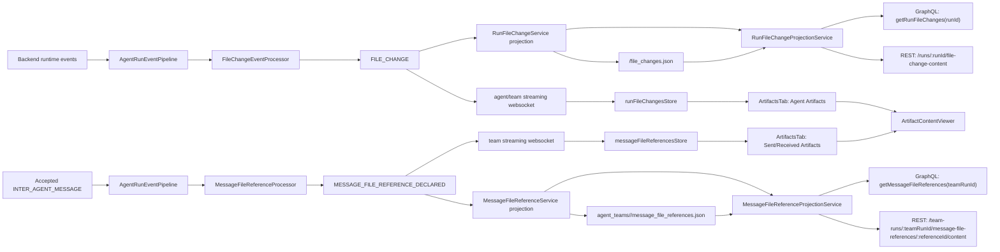

# Agent Artifacts

## Overview

The Artifacts tab is backed by two deliberately separate models:

- **Agent Artifacts** are files produced or touched by the active agent run.
- **Message-reference artifacts** are explicit absolute local files declared by
  accepted inter-agent/team messages through `reference_files`. The focused
  member sees these as:
  - **Sent Artifacts** when the focused member sent the reference, grouped by receiver/counterpart.
    The group heading renders `To <agent>` once; rows under the group show filenames only.
  - **Received Artifacts** when the focused member received the reference, grouped by sender/counterpart.
    The group heading renders `From <agent>` once; rows under the group show filenames only.

Agent Artifacts cover:

- `write_file`
- `edit_file`
- generated outputs from known output-producing tools (`generate_image`, `edit_image`, `generate_speech`, including the AutoByteus image/audio MCP forms)

The backend owns path identity, live status, and historical replay for Agent
Artifacts. The frontend renders those rows from `runFileChangesStore` under the
**Agent Artifacts** heading.

Message-reference artifacts are additive and do not make raw paths inside chat
messages clickable. The backend derives `MESSAGE_FILE_REFERENCE_DECLARED`
metadata from accepted `INTER_AGENT_MESSAGE.payload.reference_files`, persists
one canonical team-level projection, and the frontend renders focused-member
sent/received perspectives from `messageFileReferencesStore`.

## Canonical Runtime Shapes

```ts
interface RunFileChangeEntry {
  id: string; // runId:path
  runId: string;
  path: string; // canonical relative-in-workspace or absolute outside-workspace
  type: 'file' | 'image' | 'audio' | 'video' | 'pdf' | 'csv' | 'excel' | 'other';
  status: 'streaming' | 'pending' | 'available' | 'failed';
  sourceTool: 'write_file' | 'edit_file' | 'generated_output';
  sourceInvocationId: string | null;
  content?: string | null; // transient live write buffer only
  createdAt: string;
  updatedAt: string;
}
```

```ts
interface MessageFileReferenceArtifact {
  referenceId: string; // deterministic team+sender+receiver+path id
  teamRunId: string;
  senderRunId: string;
  senderMemberName?: string | null;
  receiverRunId: string;
  receiverMemberName?: string | null;
  path: string; // normalized absolute local path declared via reference_files
  type: 'file' | 'image' | 'audio' | 'video' | 'pdf' | 'csv' | 'excel' | 'other';
  messageType: string;
  createdAt: string;
  updatedAt: string;
}
```

Key rules:

- Agent Artifacts have one row per `runId + canonical path`.
- In team contexts, produced Agent Artifacts stay scoped to the producing member
  run id. Live AutoByteus team `write_file` events populate
  `runFileChangesStore` under that member run id; they are not team-level
  message-reference rows.
- Message-reference artifacts have one canonical team-level row per
  `teamRunId + senderRunId + receiverRunId + normalized path`.
- Message-reference extraction reads only explicit `reference_files`; paths
  mentioned only in message prose remain ordinary non-clickable text and do not
  create rows.
- Repeated message references with the same canonical identity dedupe to one row,
  preserve `createdAt`, and update `updatedAt`.
- Current filesystem content is the source of truth for committed previews.
- `content` is transient and only used for live buffered `write_file` rendering.
- Generated outputs are represented as `sourceTool = 'generated_output'`.
- Generic `file_path`/`filePath` fields are not Agent Artifact evidence unless
  they are returned by a known generated-output tool or paired with explicit
  output/destination semantics.
- `FILE_CHANGE` is a state-update stream, not an exact-one occurrence guarantee;
  pre-available status sequences are runtime-shaped, so a row can move
  `streaming -> available`, `pending -> available`, or receive idempotent
  duplicate interim `streaming`/`pending` updates before terminal state.
- Message-reference content is opened by persisted identity
  (`teamRunId + referenceId`), not by a raw-path-only URL and not through the
  Agent Artifact file-change route.
- `InterAgentMessageSegment` continues to render raw path text as normal message
  text; it is not a linkification or reference-extraction owner.

## High-Level Data Flow



## Backend Owners

| Owner | Path | Responsibility |
| --- | --- | --- |
| Event pipeline | `autobyteus-server-ts/src/agent-execution/events/agent-run-event-pipeline.ts` | Runs post-normalization event processors once per backend batch before subscriber fan-out. |
| File-change derivation | `autobyteus-server-ts/src/agent-execution/events/processors/file-change/file-change-event-processor.ts` | Derives `FILE_CHANGE` from explicit mutation tools and known generated-output tools; read-only and unknown generic `file_path` events stay out of Agent Artifacts. |
| Message-reference derivation | `autobyteus-server-ts/src/agent-execution/events/processors/message-file-reference/message-file-reference-processor.ts` | Derives `MESSAGE_FILE_REFERENCE_DECLARED` from accepted inter-agent messages that carry explicit `payload.reference_files`; content prose is not scanned. |
| Team synthetic-event seam | `autobyteus-server-ts/src/agent-team-execution/services/publish-processed-team-agent-events.ts` | Processes accepted synthetic team-manager `INTER_AGENT_MESSAGE` events through the event pipeline before team fan-out. |
| Agent Artifact projection | `autobyteus-server-ts/src/services/run-file-changes/run-file-change-service.ts` | Consumes `FILE_CHANGE` only, projects one row per canonical path, and persists metadata. |
| Message-reference projection | `autobyteus-server-ts/src/services/message-file-references/message-file-reference-service.ts` | Consumes `MESSAGE_FILE_REFERENCE_DECLARED`, projects canonical team-level rows, waits for pending same-team updates before active reads, and persists metadata. |
| Path identity | `autobyteus-server-ts/src/services/run-file-changes/run-file-change-path-identity.ts` | Canonicalizes workspace-local paths and resolves absolute preview paths. |
| Reference identity | `autobyteus-server-ts/src/services/message-file-references/message-file-reference-identity.ts` | Normalizes message-reference paths and builds deterministic reference ids from team/sender/receiver/path. |
| Agent Artifact persistence | `autobyteus-server-ts/src/services/run-file-changes/run-file-change-projection-store.ts` | Reads and writes `file_changes.json` and strips transient `content` before persistence. |
| Message-reference persistence | `autobyteus-server-ts/src/services/message-file-references/message-file-reference-projection-store.ts` | Reads and atomically writes `message_file_references.json` under the team run directory. |
| Agent Artifact historical read boundary | `autobyteus-server-ts/src/run-history/services/run-file-change-projection-service.ts` | Reads the active in-memory owner for live runs and normalized persisted projections for inactive runs, including AutoByteus/native team-member run ids. |
| Message-reference historical read boundary | `autobyteus-server-ts/src/services/message-file-references/message-file-reference-projection-service.ts` | Reads active or persisted message-reference metadata by `teamRunId`. |
| Agent Artifact preview route | `autobyteus-server-ts/src/api/rest/run-file-changes.ts` | Streams current file bytes for text and media previews by `runId + path`. |
| Message-reference content route | `autobyteus-server-ts/src/api/rest/message-file-references.ts` | Streams referenced file bytes only after resolving persisted `teamRunId + referenceId` identity. |

## Durable Storage

Agent Artifact persistence lives at:

```text
<run-memory-dir>/file_changes.json
```

That is the only supported persisted source for produced/touched Agent
Artifacts. Legacy `run-file-changes/projection.json` is intentionally ignored,
so legacy-only runs hydrate no Agent Artifact rows.

Message-reference artifact persistence lives at:

```text
agent_teams/<teamRunId>/message_file_references.json
```

This is a single canonical team-level metadata file. It is not duplicated under
member directories. It stores metadata only; referenced file bytes are read from
the current local filesystem only when the user opens a row.

## Frontend Owners

| Owner | Path | Responsibility |
| --- | --- | --- |
| Agent Artifact store | `autobyteus-web/stores/runFileChangesStore.ts` | Owns hydrated and live rows for touched files plus generated outputs. |
| Message-reference store | `autobyteus-web/stores/messageFileReferencesStore.ts` | Owns hydrated and live team-level reference rows and exposes focused-member **Sent Artifacts** / **Received Artifacts** perspectives. |
| Agent Artifact stream ingestion | `autobyteus-web/services/agentStreaming/handlers/fileChangeHandler.ts` | Applies `FILE_CHANGE` payloads into the Agent Artifact store. |
| Message-reference stream ingestion | `autobyteus-web/services/agentStreaming/handlers/messageFileReferenceHandler.ts` | Applies `MESSAGE_FILE_REFERENCE_DECLARED` payloads into the message-reference store. |
| Agent Artifact hydration | `autobyteus-web/services/runHydration/runContextHydrationService.ts` | Loads `getRunFileChanges(runId)` during reopen/recovery. |
| Message-reference hydration | `autobyteus-web/services/runHydration/messageFileReferenceHydrationService.ts` | Loads `getMessageFileReferences(teamRunId)` for reopened team runs. |
| Artifacts composition | `autobyteus-web/components/workspace/agent/ArtifactsTab.vue` | Combines **Agent Artifacts** from `runFileChangesStore` with focused-member **Sent Artifacts** and **Received Artifacts** from `messageFileReferencesStore`. |
| Artifacts list | `autobyteus-web/components/workspace/agent/ArtifactList.vue` | Renders Agent, Sent, and Received sections, grouping sent/received references by counterpart with `To` / `From` direction shown once per group. |
| Viewer item adapter | `autobyteus-web/components/workspace/agent/artifactViewerItem.ts` | Normalizes produced and message-reference rows into the viewer's discriminated item shape. |
| Viewer | `autobyteus-web/components/workspace/agent/ArtifactContentViewer.vue` | Renders buffered produced-file text or fetches current server-backed bytes from the correct produced/reference content route. |

## Runtime Diagnostics

Backend message-reference diagnostics use the stable
`[message-file-reference]` prefix. They record event-level facts such as team id,
sender/receiver ids or names, content length, reference count, extracted paths
when references exist, projection insert/update ids, and content failure reason
codes. They must stay concise and must not log full inter-agent message content
by default.

## Viewer Resolution Rules

`ArtifactContentViewer` resolves content in this order:

1. Live Agent Artifact `write_file` row with `streaming` or `pending` status -> render buffered inline `content`.
2. Failed Agent Artifact row -> render explicit failure state.
3. Non-`available` Agent Artifact row -> render pending state.
4. Available Agent Artifact row -> fetch `/runs/:runId/file-change-content?path=...`.
5. Message-reference Artifact row -> fetch `/team-runs/:teamRunId/message-file-references/:referenceId/content`.
6. Text response -> render text content.
7. Non-text response -> create an object URL and hand it to the file viewer.
8. `404` -> deleted/unavailable state.
9. `409` -> pending server-capture state for Agent Artifacts.

## Reopen / Historical Behavior

When reopening a single run:

1. The frontend requests `getRunFileChanges(runId)`.
2. Active runs are served from the live in-memory owner.
3. Inactive runs are served from normalized persisted metadata.
4. The frontend hydrates `runFileChangesStore`.
5. Committed content is still fetched from the preview route on demand.

For team-member produced Agent Artifacts, the same run-file authority applies:
the `runId` is the member run id, `getRunFileChanges(runId)` returns active or
historical member projections when requested, and the viewer continues to use
`/runs/:runId/file-change-content?path=...`. This is intentionally separate from
team-level Sent/Received message references.

When reopening a team run:

1. The frontend requests `getMessageFileReferences(teamRunId)`.
2. Active teams are served from the live in-memory message-reference owner.
3. Inactive teams are served from normalized `agent_teams/<teamRunId>/message_file_references.json` metadata.
4. The frontend hydrates `messageFileReferencesStore` by team id.
5. The focused member's current run id determines **Sent Artifacts** and **Received Artifacts** perspectives.
6. Referenced content is fetched on demand from the team-level reference route.

This keeps historical replay lightweight while still using current filesystem
bytes when a preview is requested.

## List Grouping / Keyboard Behavior

`ArtifactList` keeps the visible and keyboard traversal order as:

1. **Agent Artifacts**
2. **Sent Artifacts**
3. **Received Artifacts**

Sent and Received rows are grouped by counterpart. The direction belongs to the
counterpart group heading, not every row:

- sent group heading: `To <counterpart>`
- received group heading: `From <counterpart>`
- grouped rows: filename only, with repeated `Sent to ...` / `Received from ...`
  provenance hidden to reduce noise during multi-file handoffs

Long counterpart labels truncate within the Artifacts pane so multiple files
remain scanable. Arrow-key navigation still walks the flattened Agent -> Sent ->
Received item sequence.

## Testing

Primary coverage lives in:

- `autobyteus-server-ts/tests/unit/agent-execution/events/agent-run-event-pipeline.test.ts`
- `autobyteus-server-ts/tests/unit/agent-execution/events/file-change-event-processor.test.ts`
- `autobyteus-server-ts/tests/unit/agent-execution/events/message-file-reference-processor.test.ts`
- `autobyteus-server-ts/tests/unit/services/run-file-changes/run-file-change-service.test.ts`
- `autobyteus-server-ts/tests/unit/services/run-file-changes/run-file-change-projection-store.test.ts`
- `autobyteus-server-ts/tests/unit/services/run-file-changes/run-file-change-path-identity.test.ts`
- `autobyteus-server-ts/tests/unit/services/message-file-references/message-file-reference-content-service.test.ts`
- `autobyteus-server-ts/tests/unit/services/message-file-references/message-file-reference-identity.test.ts`
- `autobyteus-server-ts/tests/unit/services/message-file-references/message-file-reference-service.test.ts`
- `autobyteus-server-ts/tests/unit/run-history/services/run-file-change-projection-service.test.ts`
- `autobyteus-server-ts/tests/unit/api/rest/run-file-changes.test.ts`
- `autobyteus-server-ts/tests/integration/api/message-file-references-api.integration.test.ts`
- `autobyteus-web/stores/__tests__/runFileChangesStore.spec.ts`
- `autobyteus-web/stores/__tests__/messageFileReferencesStore.spec.ts`
- `autobyteus-web/services/agentStreaming/handlers/__tests__/fileChangeHandler.spec.ts`
- `autobyteus-web/services/agentStreaming/__tests__/TeamStreamingService.spec.ts`
- `autobyteus-web/services/runHydration/__tests__/messageFileReferenceHydrationService.spec.ts`
- `autobyteus-web/components/workspace/agent/__tests__/ArtifactContentViewer.spec.ts`
- `autobyteus-web/components/workspace/agent/__tests__/ArtifactList.spec.ts`
- `autobyteus-web/components/workspace/agent/__tests__/ArtifactsTab.spec.ts`
- `autobyteus-web/components/conversation/segments/__tests__/InterAgentMessageSegment.spec.ts`
- `autobyteus-web/components/layout/__tests__/RightSideTabs.spec.ts`

## Related Docs

- [File Explorer](./file_explorer.md)
- [Content Rendering](./content_rendering.md)
- [Agent Execution Architecture](./agent_execution_architecture.md)
