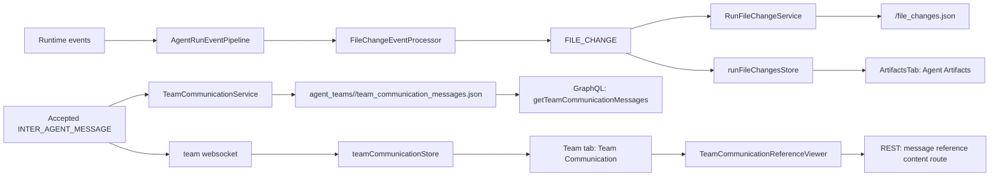

# Agent Artifacts and Team Communication References

## Overview

The Artifacts tab is intentionally run-file-change only. It lists files that the
focused agent run produced or touched through explicit mutation/generated-output
runtime events.

Inter-agent `send_message_to.reference_files` are no longer owned by the
Artifacts tab. They are child rows of Team Communication messages in the Team
tab. The message body stays natural and self-contained; `reference_files` is the
structured attachment/reference list used to register previewable files under the
message that carried them.

## Agent Artifacts

Agent Artifacts cover:

- `write_file`
- `edit_file`
- generated outputs from known output-producing tools (`generate_image`,
  `edit_image`, `generate_speech`, including the AutoByteus image/audio MCP
  forms)

Canonical runtime shape:

```ts
interface RunFileChangeEntry {
  id: string; // runId:path
  runId: string;
  path: string; // canonical relative-in-workspace or absolute outside-workspace
  type: 'file' | 'image' | 'audio' | 'video' | 'pdf' | 'csv' | 'excel' | 'other';
  status: 'streaming' | 'pending' | 'available' | 'failed';
  sourceTool: 'write_file' | 'edit_file' | 'generated_output';
  sourceInvocationId: string | null;
  content?: string | null; // transient live write buffer only
  createdAt: string;
  updatedAt: string;
}
```

Rules:

- One row per `runId + canonical path`.
- Team-member produced artifacts remain scoped to the producing member run id.
- Current filesystem content is the source of truth for committed previews.
- `content` is transient and only used for live buffered `write_file` rendering.
- Generic `file_path`/`filePath` fields are not Agent Artifact evidence unless
  returned by a known generated-output tool or paired with explicit
  output/destination semantics.
- `FILE_CHANGE` is a state-update stream, not an exact-one occurrence guarantee.

## Team Communication References

Team Communication owns message references:

```ts
interface TeamCommunicationMessage {
  messageId: string;
  teamRunId: string;
  senderRunId: string;
  senderMemberName?: string | null;
  receiverRunId: string;
  receiverMemberName?: string | null;
  content: string;
  messageType: string;
  createdAt: string;
  updatedAt: string;
  referenceFiles: TeamCommunicationReferenceFile[];
}

interface TeamCommunicationReferenceFile {
  referenceId: string;
  path: string;
  type: 'file' | 'image' | 'audio' | 'video' | 'pdf' | 'csv' | 'excel' | 'other';
  createdAt: string;
  updatedAt: string;
}
```

Rules:

- Accepted `INTER_AGENT_MESSAGE` payloads are the source of Team Communication
  messages.
- Reference rows come only from explicit `payload.reference_files` /
  `payload.reference_file_entries`; message prose is not scanned and raw paths
  are not linkified.
- One durable team-level projection is stored at
  `agent_teams/<teamRunId>/team_communication_messages.json`.
- Reference content opens by message-owned identity:
  `/team-runs/:teamRunId/team-communication/messages/:messageId/references/:referenceId/content`.
- The focused member sees sent/received message perspectives in the Team tab,
  grouped by counterpart with compact `To <agent>` / `From <agent>` headings.

## Data Flow



## Frontend Owners

| Owner | Path | Responsibility |
| --- | --- | --- |
| Agent Artifact store | `autobyteus-web/stores/runFileChangesStore.ts` | Owns hydrated/live rows for touched files and generated outputs. |
| Agent Artifact stream ingestion | `autobyteus-web/services/agentStreaming/handlers/fileChangeHandler.ts` | Applies `FILE_CHANGE` payloads into the Agent Artifact store. |
| Agent Artifact hydration | `autobyteus-web/services/runHydration/runContextHydrationService.ts` | Loads `getRunFileChanges(runId)`. |
| Artifacts tab | `autobyteus-web/components/workspace/agent/ArtifactsTab.vue` | Displays only run-scoped Agent Artifacts. |
| Team Communication store | `autobyteus-web/stores/teamCommunicationStore.ts` | Owns hydrated/live inter-agent messages and focused sent/received message perspectives. |
| Team Communication hydration | `autobyteus-web/services/runHydration/teamCommunicationHydrationService.ts` | Loads `getTeamCommunicationMessages(teamRunId)`. |
| Team Communication panel | `autobyteus-web/components/workspace/team/TeamCommunicationPanel.vue` | Renders sent/received message groups and reference-file children. |
| Team reference viewer | `autobyteus-web/components/workspace/team/TeamCommunicationReferenceViewer.vue` | Opens a reference through the message-owned content route. |

## Viewer Resolution

`ArtifactContentViewer` resolves only Agent Artifact rows:

1. Live `write_file` row with `streaming` or `pending` status -> buffered inline
   `content`.
2. Failed row -> explicit failure state.
3. Non-`available` row -> pending state.
4. Available row -> `/runs/:runId/file-change-content?path=...`.

Team Communication reference previews use `TeamCommunicationReferenceViewer` and
never use the run-file-change route.
