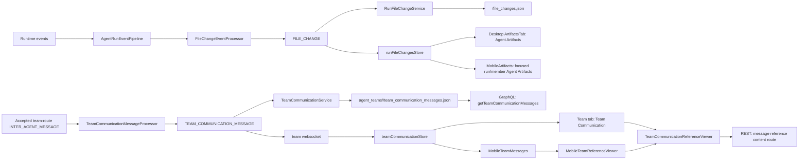

# Agent Artifacts and Team Communication References

## Overview

The desktop and mobile Artifacts surfaces are intentionally run-file-change only.
They list files that the focused agent run produced or touched through explicit
mutation/generated-output runtime events.

Team-route `send_message_to.reference_files` are no longer owned by the
Artifacts tab. They are child rows of Team Communication messages in the Team
tab. The message body stays natural and self-contained; `reference_files` is the
structured attachment/reference list used to register previewable files under the
accepted `recipient_name` message that carried them. Direct exact-run
`send_message_to(target_agent_run_id=...)` messages carry their references in
the target runtime input/event metadata but intentionally do not create Team
Communication reference rows.

## Agent Artifacts

Agent Artifacts cover:

- `write_file`
- `edit_file`
- generated outputs from known output-producing tools (`generate_image`,
  `edit_image`, `generate_speech`, including the AutoByteus image/audio MCP
  forms)

Canonical runtime shape:

```ts
interface RunFileChangeEntry {
  id: string; // runId:path
  runId: string;
  path: string; // canonical relative-in-workspace or absolute outside-workspace
  type: 'file' | 'image' | 'audio' | 'video' | 'pdf' | 'csv' | 'excel' | 'other';
  status: 'streaming' | 'pending' | 'available' | 'failed';
  sourceTool: 'write_file' | 'edit_file' | 'generated_output';
  sourceInvocationId: string | null;
  content?: string | null; // transient live write buffer only
  createdAt: string;
  updatedAt: string;
}
```

Rules:

- One row per `runId + canonical path`.
- Team-member produced artifacts remain scoped to the producing member run id.
- Current filesystem content is the source of truth for committed previews.
- `content` is transient and only used for live buffered `write_file` rendering.
- Generic `file_path`/`filePath` fields are not Agent Artifact evidence unless
  returned by a known generated-output tool or paired with explicit
  output/destination semantics.
- `FILE_CHANGE` is a state-update stream, not an exact-one occurrence guarantee.

## Team Communication References

Team Communication owns message references for accepted `recipient_name`
deliveries:

```ts
interface TeamCommunicationMessage {
  messageId: string;
  teamRunId: string;
  senderRunId: string;
  senderMemberName?: string | null;
  receiverRunId: string;
  receiverMemberName?: string | null;
  content: string;
  messageType: string;
  createdAt: string;
  updatedAt: string;
  referenceFiles: TeamCommunicationReferenceFile[];
}

interface TeamCommunicationReferenceFile {
  referenceId: string;
  path: string;
  type: 'file' | 'image' | 'audio' | 'video' | 'pdf' | 'csv' | 'excel' | 'other';
  createdAt: string;
  updatedAt: string;
}
```

Rules:

- Accepted team-route `INTER_AGENT_MESSAGE` payloads are processor input for Team
  Communication messages. The live/store authority is the derived
  `TEAM_COMMUNICATION_MESSAGE`; direct exact-run messages without team projection
  fields are ignored by this store.
- Reference rows come only from explicit `payload.reference_files` /
  `payload.reference_file_entries`; message prose is not scanned and raw paths
  are not linkified.
- One durable team-level projection is stored at
  `agent_teams/<teamRunId>/team_communication_messages.json`.
- Reference content opens by message-owned identity:
  `/team-runs/:teamRunId/team-communication/messages/:messageId/references/:referenceId/content`.
- The focused member sees sent/received message perspectives in the Team tab.
  The left list hierarchy is `Sent` / `Received` -> counterpart member name ->
  message -> reference file, without repeated `To` / `From` group prefixes.
- Team Communication rows are compact, email-like rows. The row shell is a
  non-interactive container; message summaries and reference-file rows are
  sibling buttons so reference controls are never nested inside a message
  summary button.
- Selecting a message shows its content in the detail pane through the shared
  Markdown renderer while keeping raw absolute paths as plain text. Selecting a
  reference switches that same pane to the message-owned reference viewer.
- Mobile Team Communication renders the same structured `referenceFiles` as
  tappable phone rows instead of collapsing them to an inert count. Mobile uses
  the same message-owned identity (`teamRunId`, `messageId`, `referenceId`) in a
  full-screen wrapper and returns to the same message list/focused-member
  context on close. Mobile does not scan message prose for paths.

## Data Flow


```mermaid
flowchart LR
  A[Runtime events] --> B[AgentRunEventPipeline]
  B --> C[FileChangeEventProcessor]
  C --> D[FILE_CHANGE]
  D --> E[RunFileChangeService]
  E --> F[<run-memory-dir>/file_changes.json]
  D --> G[runFileChangesStore]
  G --> H[Desktop ArtifactsTab: Agent Artifacts]
  G --> U[MobileArtifacts: focused run/member Agent Artifacts]

  I[Accepted team-route INTER_AGENT_MESSAGE] --> J[TeamCommunicationMessageProcessor]
  J --> K[TEAM_COMMUNICATION_MESSAGE]
  K --> L[TeamCommunicationService]
  L --> N[agent_teams/<teamRunId>/team_communication_messages.json]
  K --> M[team websocket]
  M --> P[teamCommunicationStore]
  N --> O[GraphQL: getTeamCommunicationMessages]
  P --> R[Team tab: Team Communication]
  R --> S[TeamCommunicationReferenceViewer]
  S --> T[REST: message reference content route]
  P --> V[MobileTeamMessages]
  V --> W[MobileTeamReferenceViewer]
  W --> S
```

## Frontend Owners

| Owner | Path | Responsibility |
| --- | --- | --- |
| Agent Artifact store | `autobyteus-web/stores/runFileChangesStore.ts` | Owns hydrated/live rows for touched files and generated outputs. |
| Agent Artifact stream ingestion | `autobyteus-web/services/agentStreaming/handlers/fileChangeHandler.ts` | Applies `FILE_CHANGE` payloads into the Agent Artifact store. |
| Agent Artifact hydration | `autobyteus-web/services/runHydration/runContextHydrationService.ts` | Loads `getRunFileChanges(runId)`. |
| Desktop Artifacts tab | `autobyteus-web/components/workspace/agent/ArtifactsTab.vue` | Displays only run-scoped Agent Artifacts in the desktop right-side panel. |
| Mobile Artifacts view | `autobyteus-web/components/mobile/MobileArtifacts.vue` | Displays only run-scoped Agent Artifacts for the mobile-selected agent run or focused team member run, using the same run artifact store and `ArtifactContentViewer` rather than the desktop right-panel layout. |
| Mobile focused-run identity | `autobyteus-web/composables/mobile/useMobileFocusedRunIdentity.ts` | Centralizes the mobile agent/team focused run-id guard shared by Activity and Artifacts so stale mobile selections do not leak artifacts or activity from another run. |
| Team Communication store | `autobyteus-web/stores/teamCommunicationStore.ts` | Owns hydrated/live inter-agent messages and focused sent/received message perspectives. |
| Team Communication hydration | `autobyteus-web/services/runHydration/teamCommunicationHydrationService.ts` | Loads `getTeamCommunicationMessages(teamRunId)`. |
| Team Communication panel | `autobyteus-web/components/workspace/team/TeamCommunicationPanel.vue` | Renders compact sent/received message rows, sibling reference-file controls, and Markdown message detail. |
| Team reference viewer | `autobyteus-web/components/workspace/team/TeamCommunicationReferenceViewer.vue` | Opens a reference through the message-owned content route and owns local inline/maximized preview state. |
| Mobile Team messages | `autobyteus-web/components/mobile/MobileTeamMessages.vue` | Renders the focused member's Team Communication messages in the mobile shell and exposes each structured reference file as a tappable phone row. |
| Mobile Team reference wrapper | `autobyteus-web/components/mobile/MobileTeamReferenceViewer.vue` | Wraps `TeamCommunicationReferenceViewer` in a full-screen mobile surface, passes message-owned identity through, and disables rich HTML preview for mobile. |
| Team reference presentation helper | `autobyteus-web/utils/teamCommunication/referenceFilePresentation.ts` | Centralizes reference display-name and icon selection so desktop and mobile Team Communication rows do not duplicate file-type presentation policy. |

## Viewer Resolution

`ArtifactContentViewer` resolves only Agent Artifact rows. Desktop and mobile
Artifacts surfaces both delegate preview/content loading to this viewer; mobile
remote access therefore keeps using the authorized run content route instead of
opening workspace files directly.

1. Live `write_file` row with `streaming` or `pending` status -> buffered inline
   `content`.
2. Failed row -> explicit failure state.
3. Non-`available` row -> pending state.
4. Available row -> `/runs/:runId/file-change-content?path=...`.

Team Communication reference previews use `TeamCommunicationReferenceViewer` and
never use the run-file-change route. The Team reference viewer owns its local
maximize/restore state independently of Agent Artifact display-mode controls:
users can open the preview inline, maximize it to a viewport shell, restore with
the control or `Escape`, and keep switching between Raw and Preview while
maximized. The mobile wrapper uses the same viewer/content route in a
phone-sized full-screen surface, but disables rich HTML preview so mobile
reference files stay on authorized raw/Markdown/media/PDF/CSV/Excel loading
paths rather than an unauthenticated static HTML preview path.
