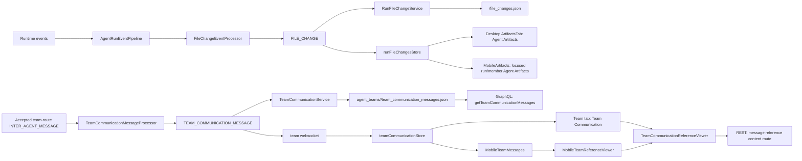

# Agent Artifacts and Team Communication References

## Overview

The desktop and mobile Artifacts surfaces are intentionally run-file-change only.
They list files that the focused agent run produced or touched through explicit
mutation/generated-output runtime events.

Team-route `send_message_to.reference_files` are no longer owned by the
Artifacts tab. They are child rows of Team Communication messages in the Team
tab. The message body stays natural and self-contained; `reference_files` is the
structured attachment/reference list used to register previewable files under the
accepted `recipient_address` message that carried them. An exact-run
`send_message_to(target_agent_run_id=...)` to an AgentRun in the sender's own
root (for example a delegated child) is recorded the same way. An exact-run
message to an active run outside the sender's root carries its references only
in the target runtime input/event metadata and creates no Team Communication
reference rows.

`delegate_task` `reference_files` are listed only in the delegated child's first
message (the work packet). There is no task-owned reference storage, Tasks
section, or task reference route.

## Agent Artifacts

Agent Artifacts cover:

- `write_file`
- `edit_file`
- generated outputs from known output-producing tools (`generate_image`,
  `edit_image`, `generate_speech`, including Agent Tools MCP route-backed
  forms)

Canonical runtime shape:

```ts
interface RunFileChangeEntry {
  id: string; // runId:path
  runId: string;
  path: string; // canonical relative-in-workspace or absolute outside-workspace
  type: 'file' | 'image' | 'audio' | 'video' | 'pdf' | 'csv' | 'excel' | 'other';
  status: 'streaming' | 'pending' | 'available' | 'failed';
  sourceTool: 'write_file' | 'edit_file' | 'generated_output';
  sourceInvocationId: string | null;
  content?: string | null; // transient live write buffer only
  createdAt: string;
  updatedAt: string;
}
```

Rules:

- One row per `runId + canonical path`.
- Team-member produced artifacts remain scoped to the producing member run id.
- Current filesystem content is the source of truth for committed previews.
- `content` is transient and only used for live buffered `write_file` rendering.
- Generic `file_path`/`filePath` fields are not Agent Artifact evidence unless
  returned by a known generated-output tool or paired with explicit
  output/destination semantics.
- `FILE_CHANGE` is a state-update stream, not an exact-one occurrence guarantee.

## Team Communication References

Team Communication owns message references for accepted `recipient_address`
deliveries:

```ts
interface TeamCommunicationProjection {
  teamRunId: string;
  messages: TeamCommunicationMessage[];
}

interface TeamExecutionAddress {
  rootTeamRunId: string;
  taskTeamRunIds: readonly string[];
  memberAddress: string; // rooted AgentTeam address, for example /BuildSquad/review_lead
  taskAgentRunId: string | null;
}

interface TeamCommunicationMessage {
  messageId: string;
  senderAddress: TeamExecutionAddress;
  receiverAddress: TeamExecutionAddress;
  content: string;
  messageType: string;
  createdAt: string;
  referenceFiles: TeamCommunicationReferenceFile[];
}

interface TeamCommunicationReferenceFile {
  referenceId: string;
  path: string;
  type: 'file' | 'image' | 'audio' | 'video' | 'pdf' | 'csv' | 'excel' | 'other';
  createdAt: string;
  updatedAt: string;
}
```

Rules:

- Accepted team-route `INTER_AGENT_MESSAGE` payloads are processor input for Team
  Communication messages. The live/store authority is the derived
  `TEAM_COMMUNICATION_MESSAGE`; direct exact-run messages without team projection
  fields are ignored by this store.
- The durable projection stores `teamRunId` once at
  `agent_teams/<teamRunId>/team_communication_messages.json`; each message uses
  `senderAddress` and `receiverAddress` instead of duplicating sender/receiver
  generated instance ids, legacy member paths/route keys, or compatibility
  wrappers.
- Focused Team Messages compare the focused member's normalized
  `TeamExecutionAddress` with each message's `senderAddress` and
  `receiverAddress`. Task-Agent and task-Team execution identity is carried by
  `taskAgentRunId` and the ordered `taskTeamRunIds`; logical topology remains
  the rooted `memberAddress`.
- Old flat Team Communication projection files are converted by the registered
  app-data migration before normal runtime reads. Runtime, GraphQL hydration,
  WebSocket payloads, and the frontend store do not keep a read-time legacy
  compatibility path for old flat sender/receiver fields.
- Reference rows come only from explicit `payload.reference_files` /
  `payload.reference_file_entries`; message prose is not scanned and raw paths
  are not linkified.
- One durable team-level projection is stored at
  `agent_teams/<teamRunId>/team_communication_messages.json`.
- Reference content opens by message-owned identity:
  `/team-runs/:teamRunId/team-communication/messages/:messageId/references/:referenceId/content`.
- The focused member sees sent/received message perspectives in the Team tab.
  The left list hierarchy is `Sent` / `Received` -> counterpart address label ->
  message -> reference file, without repeated `To` / `From` group prefixes.
- Reference rows are bounded. Every message with references shows a paperclip
  file count (`reference_count_label`, formatted with the app locale), but only
  the selected message lists its reference rows: the first 20
  (`REFERENCE_PREVIEW_LIMIT` in `CollaborationMessagesPanel.vue`), then a
  `Show all N files` control (`show_all_references`). The expanded state resets
  when the selected message, focused member, or root changes, and survives
  live updates to the same selected message. Agents can re-attach cumulative
  file lists (thousands of references per message), so rendering every
  reference for every message made member switches take seconds.
- The Messages section computes the message rows once per view
  (`CollaborationMessagesSection` passes the required `rows` prop to
  `CollaborationMessagesPanel`); the panel does not call `listMessages()`
  itself.
- Team Communication rows are compact, email-like rows. The row shell is a
  non-interactive container; message summaries and reference-file rows are
  sibling buttons so reference controls are never nested inside a message
  summary button.
- Selecting a message shows its content in the detail pane through the shared
  Markdown renderer while keeping raw absolute paths as plain text. Selecting a
  reference switches that same pane to the message-owned reference viewer.
- Mobile Team Communication renders the same structured `referenceFiles` as
  tappable phone rows instead of collapsing them to an inert count. Mobile uses
  the same message-owned identity (`teamRunId`, `messageId`, `referenceId`) in a
  full-screen wrapper and returns to the same message list/focused-member
  context on close. Mobile does not scan message prose for paths.

## Data Flow


```mermaid
flowchart LR
  A[Runtime events] --> B[AgentRunEventPipeline]
  B --> C[FileChangeEventProcessor]
  C --> D[FILE_CHANGE]
  D --> E[RunFileChangeService]
  E --> F[<run-memory-dir>/file_changes.json]
  D --> G[runFileChangesStore]
  G --> H[Desktop ArtifactsTab: Agent Artifacts]
  G --> U[MobileArtifacts: focused run/member Agent Artifacts]

  I[Accepted team-route INTER_AGENT_MESSAGE] --> J[TeamCommunicationMessageProcessor]
  J --> K[TEAM_COMMUNICATION_MESSAGE]
  K --> L[TeamCommunicationService]
  L --> N[agent_teams/<teamRunId>/team_communication_messages.json]
  K --> M[team websocket]
  M --> P[teamCommunicationStore]
  N --> O[GraphQL: getTeamCommunicationMessages]
  P --> R[Team tab: Team Communication]
  R --> S[TeamCommunicationReferenceViewer]
  S --> T[REST: message reference content route]
  P --> V[MobileTeamMessages]
  V --> W[MobileTeamReferenceViewer]
  W --> S
```

## Frontend Owners

| Owner | Path | Responsibility |
| --- | --- | --- |
| Agent Artifact store | `autobyteus-web/stores/runFileChangesStore.ts` | Owns hydrated/live rows for touched files and generated outputs. |
| Agent Artifact stream ingestion | `autobyteus-web/services/agentStreaming/handlers/fileChangeHandler.ts` | Applies `FILE_CHANGE` payloads into the Agent Artifact store. |
| Agent Artifact fetch/commit | `autobyteus-web/services/runHydration/runFileChangeHydrationService.ts` | Fetches `getRunFileChanges(runId)` (`fetchRunFileChanges`) and writes rows into the store, by replacing them (`hydrateRunFileChanges`) or by merging them so live entries with a newer `updatedAt` are kept (`mergeHydratedRunFileChanges`). |
| Standalone Agent Artifact hydration | `autobyteus-web/services/runHydration/runContextHydrationService.ts` | Loads a standalone run's artifacts with its run context. |
| Collaboration member run-state hydration | `autobyteus-web/services/runHydration/memberRunStateHydration.ts` | Shared owner for Team members, Agent Org members and the collaborators of a standalone run (`services/agentCollaboration/agentRunCollaborationHydration.ts`). `fetchMemberRunState` fetches a member's projection and its artifacts in parallel. `commitMemberRunStates` commits all member Activity in one revision-guarded replacement, then merges each member's artifacts. On a revision conflict nothing is written, artifacts included. |
| Desktop Artifacts tab | `autobyteus-web/components/workspace/agent/ArtifactsTab.vue` | Displays only run-scoped Agent Artifacts in the desktop right-side panel. |
| Mobile Artifacts view | `autobyteus-web/components/mobile/MobileArtifacts.vue` | Displays only run-scoped Agent Artifacts for the mobile-selected agent run or focused team member run, using the same run artifact store and `ArtifactContentViewer` rather than the desktop right-panel layout. |
| Mobile focused-run identity | `autobyteus-web/composables/mobile/useMobileFocusedRunIdentity.ts` | Centralizes the mobile agent/team focused run-id guard shared by Activity and Artifacts so stale mobile selections do not leak artifacts or activity from another run. |
| Team Communication store | `autobyteus-web/stores/teamCommunicationStore.ts` | Owns hydrated/live inter-agent messages and focused sent/received message perspectives. |
| Team Communication hydration | `autobyteus-web/services/runHydration/teamCommunicationHydrationService.ts` | Loads `getTeamCommunicationMessages(teamRunId)`. |
| Collaboration Messages section | `autobyteus-web/components/workspace/collaboration/CollaborationMessagesSection.vue` | Computes the focused member's message rows once per view and passes them to the panel. Shared by Team, AgentOrg, and standalone Messages. |
| Collaboration Messages panel | `autobyteus-web/components/workspace/collaboration/CollaborationMessagesPanel.vue` | Renders compact sent/received message rows with a reference count, the bounded reference list (first 20 + Show all) under the selected message only, and Markdown message detail. |
| Team reference viewer | `autobyteus-web/components/workspace/team/TeamCommunicationReferenceViewer.vue` | Opens a reference through the message-owned content route and owns local inline/maximized preview state. |
| Mobile Team messages | `autobyteus-web/components/mobile/MobileTeamMessages.vue` | Renders the focused member's Team Communication messages in the mobile shell and exposes each structured reference file as a tappable phone row. |
| Mobile Team reference wrapper | `autobyteus-web/components/mobile/MobileTeamReferenceViewer.vue` | Wraps `TeamCommunicationReferenceViewer` in a full-screen mobile surface, passes message-owned identity through, and disables rich HTML preview for mobile. |
| Team reference presentation helper | `autobyteus-web/utils/teamCommunication/referenceFilePresentation.ts` | Centralizes reference display-name and icon selection so desktop and mobile Team Communication rows do not duplicate file-type presentation policy. |

## Viewer Resolution

`ArtifactContentViewer` resolves only Agent Artifact rows. Desktop and mobile
Artifacts surfaces both delegate preview/content loading to this viewer; mobile
remote access therefore keeps using the authorized run content route instead of
opening workspace files directly.

1. Live `write_file` row with `streaming` or `pending` status -> buffered inline
   `content`.
2. Failed row -> explicit failure state.
3. Non-`available` row -> pending state.
4. Available row -> `/runs/:runId/file-change-content?path=...`.

Team Communication reference previews use `TeamCommunicationReferenceViewer` and
never use the run-file-change route. The message viewer owns its local
maximize/restore state independently of Agent Artifact display-mode controls:
users can open the preview inline, maximize it to a viewport shell, restore with
the control or `Escape`, and keep switching between Raw and Preview while
maximized. The mobile wrapper uses the same viewer/content route in a
phone-sized full-screen surface, but disables rich HTML preview so mobile
reference files stay on authorized raw/Markdown/media/PDF/CSV/Excel loading
paths rather than an unauthenticated static HTML preview path.

There are no task-owned reference previews; the former task reference route
and `TeamTaskReferenceViewer` are removed.


## Uploaded Context Files Versus Collaboration References

Uploaded user context files retain their recorded URI/type/name through raw
trace, initial/cold/earlier-page projection and shared UserMessage hydration.
They are not a new task artifact family. Org uploads are owned by root plus
exact AgentRun; message reference URLs remain separately root-owned. Open
uses saved ownership, not the current viewer or configured source at the same
address. Separate text/JSON links remain accepted existing presentation.

The local submission handle and conversation now share the same canonical Vue
reactive UserMessage. Finalization replaces that message's attachment descriptors
through the existing presentation effect, so its mounted chip uses the finalized
locator without a remount, duplicate message, reload or resend. Current
AutoByteus/DeepSeek standalone first text Send includes an actual immediate
sent-chip Open returning final200 with original bytes, as well as narrow and
ordinary same-input reopen. Retained-file checks alone are not that live-chip
proof. Storage and separate-link opening are unchanged; the archived API-FIND-040
failure remains historical evidence, not evidence of durable loss. No additional
media/provider or native Electron-shell coverage is implied.
