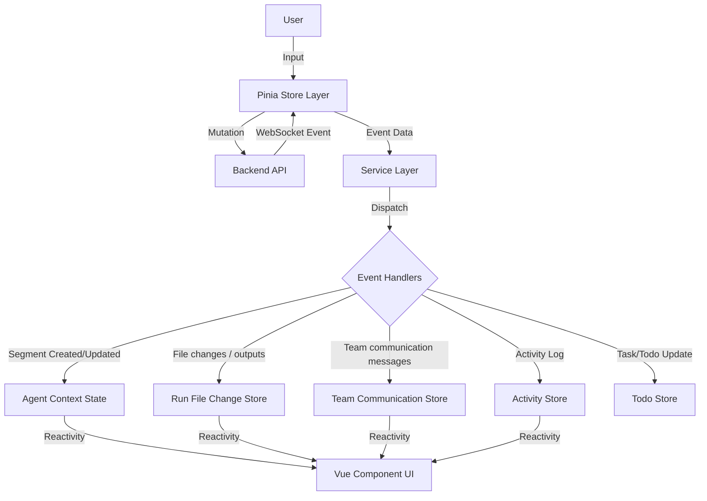

# Agent Execution Architecture

## Overview

This document outlines the end-to-end architecture of how Agent and Agent Team executions are managed in the frontend. The architecture has evolved to offload complex parsing to the backend. The frontend now acts as a **Renderer** of structured events rather than a parser of raw text.

The data flow follows a top-down approach:

1.  **Orchestration Layer (Stores)**: Manages lifecycle, user input, and WebSocket streaming connections.
2.  **Service Layer (Event Routing)**: Dispatches incoming structured WebSocket events to specific handlers.
3.  **Segment Processing (Handlers)**: Updates the reactive `AgentContext` and sidecar stores based on event payloads.

---

## Level 1: Orchestration Layer (Stores)

The Pinia stores act as the primary interface for the UI components to interact with the agent backend. They are responsible for initiating actions (Mutations) and listening for updates (WebSocket streams).

### `agentRunStore.ts` (Single Agents)

- **Role**: Manages the execution lifecycle of individual agents.
- **Key Actions**:
  - `sendUserInputAndSubscribe()`: Sends user messages via mutation and ensures an agent WebSocket stream is connected. For persisted inactive runs, it uses resume config to call `RestoreAgentRun` before finalizing attachments and sending. Before the send, it finalizes any staged browser uploads so optimistic history and runtime payloads both point at final run-scoped attachment locators.
  - `connectToAgentStream(runId)`: Listens for real-time events specific to an agent run via WebSocket. The backend WebSocket boundary is also restore-aware for connect and `SEND_MESSAGE`, so a stale/missing frontend resume cache does not have to be the only recovery path.
  - `stopGeneration()`: Sends the backend `STOP_GENERATION` control command without locally marking the run send-ready. `isSending` is cleared by backend lifecycle/status/error stream handling after the runtime has settled the active turn.
  - `postToolExecutionApproval()`: Sends user decisions (Approve/Deny) for "Awaiting Approval" tool calls.
  - `closeAgent()`: Cleans up local state and unsubscribes.

### `agentTeamRunStore.ts` (Agent Teams)

- **Role**: Manages multi-agent team sessions.
- **Key Actions**:
  - `createAndLaunchTeam()`: Orchestrates the creation of a new team run configuration and starts the session.
  - `launchExistingTeam()`: Resumes or starts a session from an existing team instance.
  - `connectToTeamStream(teamRunId)`: Listens for team-level events (e.g., task updates, status changes) via WebSocket.
  - `sendMessageToFocusedMember()`: Routes user input to a specific agent within the team context, restoring an inactive persisted team when resume config says it is inactive, then finalizing that member's staged uploaded attachments after the authoritative team/member identity is known. Backend WebSocket `SEND_MESSAGE` provides the authoritative final recovery boundary when the local resume cache is stale or absent.
  - `stopGeneration()`: Sends the team `STOP_GENERATION` control command for the active team run/member without locally clearing the focused member's `isSending` flag. The focused member becomes send-ready from backend lifecycle/status/error events, not from local stop-command dispatch.
  - `terminateTeamRun()`: Calls backend termination before local teardown for persisted teams. On success it disconnects the team stream, marks members shut down, marks run-history resume config inactive, and refreshes the history tree; on failure it leaves the active local team state intact.

### Stopped-Run Follow-Up Recovery

Single-agent and team follow-up chat share the same recovery model:

- frontend stores use cached resume config to eagerly call explicit restore mutations when they know a selected run/team is inactive;
- WebSocket connect and `SEND_MESSAGE` are restore-aware on the backend, so follow-up chat can still recover stopped-but-persisted runs when the frontend cache is stale, missing, or was updated after a local stop;
- accepted follow-up messages mark the run/team active in run history and refresh the history tree; and
- stop/tool-approval control messages are active-only and should not be used as implicit restore operations.

Stop dispatch is intentionally not a local completion event. The frontend must
keep the affected single run or focused team member in its current sending
state until `TURN_COMPLETED`, `AGENT_STATUS`, or `ERROR` stream handling clears
that state. This keeps the primary input from advertising follow-up readiness
before provider runtimes such as Claude Agent SDK have settled interrupted
query/process resources.

### Run Reopen Projection Hydration

Run-history reopen consumes a backend replay bundle with sibling
`conversation` and `activities` projections. Frontend open coordinators must
apply those siblings together when replacing from projection, or preserve both
existing live surfaces when an already-subscribed live context is kept. They
must not hydrate projected Activity rows into a context whose live conversation
is being preserved, because that can create right-pane-only tool entries after
restart. For active team reopen, projected Activity hydration is limited to
newly materialized member contexts whose projected conversation is also being
applied.

### Workspace History Archive And Delete Actions

`components/workspace/history/WorkspaceAgentRunsTreePanel.vue` owns the
workspace history tree wiring and delegates row rendering to
`WorkspaceHistoryWorkspaceSection.vue`. The row actions intentionally keep
archive, termination, draft removal, and permanent delete separate:

- active standalone runs and active team runs expose stop/terminate actions, not
  archive;
- temporary draft rows use local remove/discard behavior and are not sent to the
  archive API;
- inactive persisted standalone runs call `runHistoryStore.archiveRun(runId)`,
  which uses the backend `archiveStoredRun` mutation; and
- inactive persisted team runs call `runHistoryStore.archiveTeamRun(teamRunId)`,
  which uses the backend `archiveStoredTeamRun` mutation.

Successful archive removes the row from the current default history tree,
clears selected/open local context for the hidden run or team when applicable,
and refreshes history from the backend. Failed archive leaves the visible tree
and current selection unchanged and reports the error. The destructive delete
affordance remains separate and continues to use the existing permanent-delete
confirmation path for users who intend to remove stored memory. There is
currently no archived-history browser or unarchive UI in this frontend slice.

### Uploaded Context Attachment Orchestration

Browser-uploaded composer files now follow the same high-level orchestration pattern across single-agent, team, and application-backed conversations:

1. UI surfaces work against the shared discriminated attachment model (`workspace_path`, `uploaded`, `external_url`) instead of raw path strings.
2. `ContextFileUploadStore` owns upload, delete, and finalize transport. It stages browser uploads under an explicit draft owner and returns descriptors that keep `storedFilename` separate from the user-visible `displayName`.
3. Shared UI helpers (`useContextAttachmentComposer` and `contextAttachmentPresentation`) own attachment-list mutation, display-label rendering, preview/open behavior, and pending-upload coordination so individual components do not parse locators themselves.
4. Send stores create or restore the final run/team identity first, then call `/context-files/finalize` with `attachments[{ storedFilename, displayName }]` and replace draft uploaded descriptors with final run/member locators before optimistic append + runtime send.
5. The stable `storedFilename` remains the attachment identity key while `displayName` preserves the original uploaded filename even when the stored path has been sanitized.

This separation keeps draft attachment transport concerns out of UI components and keeps runtime consumers dependent only on finalized run-scoped attachment locators.

### Existing Run Configuration Inspection

`components/workspace/config/RunConfigPanel.vue` is the frontend boundary between
editable new-run launch configuration and inspect-only configuration for an
already selected run. When `selectionStore.selectedRunId` is present, the panel
passes read-only mode to the agent/team configuration forms instead of treating
the selected run's config as a launch buffer.

Selected existing single-agent and team run configuration is intentionally
inspect-only:

- runtime, model, workspace, auto-approve, skill-access, and team-member
  override controls render disabled;
- form update handlers and shared runtime/model normalization emissions no-op in
  read-only mode so historical context is not locally mutated;
- the launch/run button is absent while an existing run is selected;
- localized read-only notices explain that the selected run can be inspected but
  not edited; and
- advanced model/thinking controls remain visible or expandable so persisted
  values such as backend-provided `reasoning_effort: "xhigh"` can be inspected.

The frontend consumes historical model configuration exactly as provided by the
backend. If the backend-provided `llmConfig` is missing/null, the model config UI
may show a localized `Not recorded for this historical run` state, but it must
not infer a current default, recover a runtime value, or materialize metadata.
Backend/runtime/history recovery or persistence semantics belong to a separate
backend ticket, not this frontend inspection boundary.

### New Run From Existing Run

When the user clicks the workspace header add/new-run action while an existing
single-agent or team run is selected, the frontend treats that selected run as a
launch template for the new editable draft. The selected run itself remains
inspect-only, but the editable launch buffer is seeded from a deep-cloned copy of
the selected run config, including runtime kind, model identifier, workspace,
auto-approve/skill-access settings, `llmConfig`, and team member overrides.

That source-copy path must preserve backend-provided model-thinking fields such
as `reasoning_effort: "xhigh"` even when the runtime model catalog is still
loading. Schema arrival may sanitize invalid model-config keys after a real
schema is available, but an empty/loading schema must not clear the copied
`llmConfig`. Explicit user runtime/model changes remain the owner for stale
model-config cleanup.

If there is no selected same-definition source run, workspace add/new-run flows
fall back to the existing definition/default launch preferences instead of
inventing historical config.

---

## Level 2: Service Layer (Event Routing)

The service layer bridges the gap between the WebSocket transport and the application's business logic. It essentially functions as a router.

### `AgentStreamingService.ts`

- **Role**: WebSocket facade for single-agent streams.
- **Responsibilities**:
  1.  Maintains the WebSocket connection (`transport/WebSocketClient`).
  2.  Parses raw JSON messages into typed `ServerMessage` objects (`protocol/messageTypes`).
  3.  Dispatches messages to the appropriate pure-function handler.

### Dispatch Logic

Incoming events are routed based on their `type`:

| Event Type                | Handler Function                                   | Purpose                                                         |
| :------------------------ | :------------------------------------------------- | :-------------------------------------------------------------- |
| `SEGMENT_START`           | `segmentHandler.handleSegmentStart`                | Creates or merges a transcript UI segment (Text, Code, Tool) and seeds/hydrates a pending Activity row for eligible displayable tool segments. |
| `SEGMENT_CONTENT`         | `segmentHandler.handleSegmentContent`              | Appends streaming content (deltas) to an existing segment.      |
| `SEGMENT_END`             | `segmentHandler.handleSegmentEnd`                  | Finalizes transcript segment state/metadata and hydrates the matching Activity row without owning terminal execution state. |
| `TURN_STARTED`            | inline lifecycle handling                          | Marks a new turn boundary in the protocol; current clients treat it as an observable lifecycle checkpoint. |
| `TURN_COMPLETED`          | `agentStatusHandler.handleTurnCompleted`           | Marks the current AI message complete for that turn without waiting only for idle inference. |
| `AGENT_STATUS`            | `agentStatusHandler.handleAgentStatus`             | Updates run-level status such as `running`, `idle`, or `error`. |
| `COMPACTION_STATUS`       | `agentStatusHandler.handleCompactionStatus`        | Normalizes compaction lifecycle payloads into banner-ready run state (`requested`, `started`, `completed`, `failed`). |
| `ASSISTANT_COMPLETE`      | `agentStatusHandler.handleAssistantComplete`       | Legacy completion signal that still marks the current AI message complete. |
| `ERROR`                   | `agentStatusHandler.handleError`                   | Surfaces unrecoverable agent/runtime errors into the conversation. |
| `TOOL_APPROVAL_REQUESTED` | `toolLifecycleHandler.handleToolApprovalRequested` | Sets segment status to `awaiting-approval`.                     |
| `TOOL_APPROVED`           | `toolLifecycleHandler.handleToolApproved`          | Marks invocation as approved before execution starts.           |
| `TOOL_DENIED`             | `toolLifecycleHandler.handleToolDenied`            | Marks invocation as terminal denied immediately.                |
| `TOOL_EXECUTION_STARTED`  | `toolLifecycleHandler.handleToolExecutionStarted`  | Sets segment status to `executing`.                            |
| `TOOL_EXECUTION_SUCCEEDED`| `toolLifecycleHandler.handleToolExecutionSucceeded`| Sets terminal `success` + stores result payload; hydrates arguments when the terminal payload carries them. |
| `TOOL_EXECUTION_FAILED`   | `toolLifecycleHandler.handleToolExecutionFailed`   | Sets terminal `error` + stores failure details; hydrates arguments when the terminal payload carries them. |
| `TOOL_LOG`                | `toolLifecycleHandler.handleToolLog`               | Appends diagnostic execution logs only.                         |
| `ARTIFACT_PERSISTED`      | inline no-op compatibility                         | Ignored by the current client; published artifacts are not displayed in the current web UI. |
| `FILE_CHANGE`             | `fileChangeHandler.handleFileChange`        | Syncs touched files and generated outputs into the run-scoped Agent Artifact store. |
| `INTER_AGENT_MESSAGE`      | `teamHandler.handleInterAgentMessage`       | Preserves existing conversation rendering only. |
| `TEAM_COMMUNICATION_MESSAGE`| `teamHandler.handleTeamCommunicationMessage` | Upserts normalized Team Communication messages and child reference files into the Team Communication store. |
| `TODO_LIST_UPDATE`        | `todoHandler.handleTodoListUpdate`                 | Syncs the agent's internal todo list with the UI.               |

---

## Level 3: Segment Processing & State Management

Unlike the previous architecture, the frontend **does not** parse raw text/XML tags. The backend is responsible for all parsing and sends "Segments" as its primary unit of communication.

### Segment Handlers (`services/agentStreaming/handlers`)

These handlers are pure functions that take a payload and an `AgentContext`, and mutate the context.

#### `segmentHandler.ts`

- **`handleSegmentStart`**: Finds the current AI message (or creates one) and pushes/merges a new Segment object (e.g., `ToolCallSegment`, `WriteFileSegment`) for transcript structure. When that segment is an eligible displayable tool invocation with a stable invocation id and tool identity, it delegates to `toolActivityProjection.ts` to seed or hydrate the matching pending Activity row. File-change sidecar state is still not inferred here; the backend emits dedicated `FILE_CHANGE` events for the Artifacts experience.
- **`handleSegmentContent`**: Finds the segment by backend-provided `segment_type` + `id` and appends string deltas. This powers the "typewriter" effect. The frontend intentionally trusts that identity contract; provider adapters must emit different ids for distinct text blocks that belong on different sides of tool cards instead of relying on frontend runtime-specific reorder logic.
- **`handleSegmentEnd`**: Performs transcript cleanup, sets the final tool name if it was streamed lazily, preserves final metadata such as arguments, and marks the segment as "parsed" (ready for execution state changes). It also delegates segment metadata hydration to `toolActivityProjection.ts`; lifecycle events remain authoritative for execution and terminal result/error state.

#### `toolLifecycleHandler.ts`

- Routes explicit lifecycle events through dedicated parse/state modules.
- Enforces normal non-terminal progress while allowing provider order where `TOOL_EXECUTION_STARTED` can arrive before `TOOL_APPROVAL_REQUESTED`; in that case `awaiting-approval` remains the active UI state until approval/denial/terminal events arrive.
- Enforces terminal precedence: `success` / `error` / `denied` are terminal and cannot be regressed by later non-terminal events or logs.
- Hydrates arguments from lifecycle payloads. `TOOL_APPROVAL_REQUESTED` and `TOOL_EXECUTION_STARTED` are the primary sources; `TOOL_EXECUTION_SUCCEEDED` and `TOOL_EXECUTION_FAILED` may also carry arguments as a defensive result-first recovery path for runtimes whose start event is missed or arrives out of order.
- Owns lifecycle state transitions and delegates Activity projection to `toolActivityProjection.ts`. Lifecycle events create the row if no segment has seeded it yet, and otherwise update the same Activity row by invocation id/aliases.

#### `toolActivityProjection.ts`

- Owns the shared live Activity projection policy used by both segment and lifecycle handlers.
- Seeds pending/running Activity visibility from eligible tool-like `SEGMENT_START` payloads so the right-side Activity panel appears when the middle tool card appears.
- Deduplicates segment-first and lifecycle-first paths by invocation id/aliases, merges arguments and tool names, projects logs/result/error updates, and preserves terminal status precedence.
- Skips placeholder or missing generic tool names to avoid noisy blank Activity rows.

### Sidecar Store Pattern

A key architectural pattern is the **Sidecar Store Pattern** for runtime data. Instead of keeping all state in a monolithic `AgentContext` (which is optimized for Chat UI), distinct data streams are routed to dedicated stores:

1.  **Run File Changes (`RunFileChangesStore`)**:
    - Listens to `FILE_CHANGE` plus reopen hydration from `getRunFileChanges(runId)`.
    - Owns the run-scoped projection for touched files and generated outputs.
    - Tracks latest-visible discoverability so the Artifacts tab can auto-focus when a new Agent Artifact row appears.
    - Keeps transient `write_file` buffers only until committed previews are fetched from the server-backed run preview route.
2.  **Team Communication (`TeamCommunicationStore`)**:
    - Listens to accepted `INTER_AGENT_MESSAGE` live payloads plus team reopen hydration from `getTeamCommunicationMessages(teamRunId)`.
    - Owns the canonical team-level message projection and child `referenceFiles` declared by explicit `send_message_to.reference_files`.
    - Exposes focused-member sent/received message perspectives grouped by counterpart member.
    - Keeps reference files under their parent message in the Team tab instead of inserting them into `RunFileChangesStore` or the Artifacts tab.
    - Opens reference content by persisted message identity (`teamRunId + messageId + referenceId`) through `/team-runs/:teamRunId/team-communication/messages/:messageId/references/:referenceId/content`.
    - Does not parse chat text in the frontend and does not make raw paths in `InterAgentMessageSegment` clickable.
3.  **Activity (`AgentActivityStore`)**:
    - Tracks every tool call, file write, and terminal command as a linear history of "Activities".
    - Is updated through shared tool Activity projection from both eligible live transcript segment events and lifecycle events.
    - Segment events provide immediate pending visibility and metadata hydration; lifecycle events provide approval/execution/terminal status, result/error, logs, and additional argument hydration.
    - Tool display names and statuses are backend-provided canonical values. Runtime-specific transport names such as MCP-prefixed Claude browser/team tools must be normalized before streaming; frontend Activity and conversation components should render `toolName` and lifecycle state directly instead of stripping provider prefixes or inferring execution from presentation-only segments.
    - Powers the right-side Progress/Activity feed UI.
    - Feeds two intentionally different presentation surfaces:
      - `components/conversation/ToolCallIndicator.vue` renders compact inline tool cards in the conversation. These cards keep status understanding non-textual in the header (icon/spinner, tint, context, error row) and route non-awaiting cards into the matching activity item.
      - `components/progress/ActivityItem.vue` renders the right-side activity row, including the textual status chip and short invocation id.
    - Presentation-density changes for inline chat cards should stay in `ToolCallIndicator.vue`; textual activity-status changes should stay in `ActivityItem.vue`.
4.  **Todos (`AgentTodoStore`)**:
    - Maintains the agent's Todo list separately from the chat history.

### Run-Level Compaction Status

Compaction lifecycle state is stored directly on `AgentRunState` instead of a
sidecar store because it is one banner-sized run status, not a growing data set.

- Backend/runtime phases are `requested`, `started`, `completed`, and `failed`.
- `handleCompactionStatus` turns the streamed payload into a UI-facing message
  and stores it on `context.state.compactionStatus`.
- `AgentEventMonitor` renders `CompactionStatusBanner` above the conversation
  feed for:
  - single-agent runs (`AgentWorkspaceView`)
  - the focused member inside team runs (`AgentTeamEventMonitor`)
- Failure details stay visible in the banner, while detailed token-budget numbers
  remain in server/runtime logs instead of a live frontend debug panel.

---

## Error Event Nuance (Tool vs System)

The backend can emit:

- Explicit tool terminal lifecycle events (`TOOL_EXECUTION_FAILED`, `TOOL_DENIED`) for invocation-scoped failures.
- A generic `ERROR` event for unrecoverable system/agent failures.
- Explicit turn-scoped lifecycle events (`TURN_STARTED`, `TURN_COMPLETED`) for one accepted user turn.

`AGENT_STATUS` is still run-scoped state. `TURN_COMPLETED` is now the preferred signal when a client needs to know that one exact turn has finished.

`TOOL_LOG` is diagnostic-only and never the lifecycle authority for completion/failure.

## Related Documentation

- **[Agent Management](./agent_management.md)**: Defines the agents whose execution is described here.
- **[Agent Teams](./agent_teams.md)**: Describes the orchestration of multiple agents.
- **[Content Rendering](./content_rendering.md)**: Details how the parsed segments (Markdown, Mermaid, etc.) are visualized.
