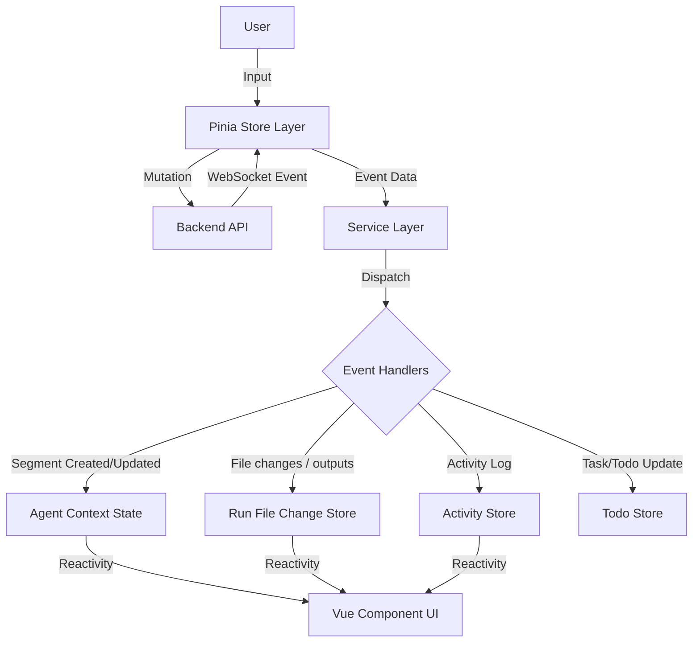

# Agent Execution Architecture

## Overview

This document outlines the end-to-end architecture of how Agent and Agent Team executions are managed in the frontend. The architecture has evolved to offload complex parsing to the backend. The frontend now acts as a **Renderer** of structured events rather than a parser of raw text.

The data flow follows a top-down approach:

1.  **Orchestration Layer (Stores)**: Manages lifecycle, user input, and WebSocket streaming connections.
2.  **Service Layer (Event Routing)**: Dispatches incoming structured WebSocket events to specific handlers.
3.  **Segment Processing (Handlers)**: Updates the reactive `AgentContext` and sidecar stores based on event payloads.

---

## Level 1: Orchestration Layer (Stores)

The Pinia stores act as the primary interface for the UI components to interact with the agent backend. They are responsible for initiating actions (Mutations) and listening for updates (WebSocket streams).

### `agentRunStore.ts` (Single Agents)

- **Role**: Manages the execution lifecycle of individual agents.
- **Key Actions**:
  - `sendUserInputAndSubscribe()`: Sends user messages via mutation and ensures an agent WebSocket stream is connected. Before the send, it finalizes any staged browser uploads so optimistic history and runtime payloads both point at final run-scoped attachment locators.
  - `connectToAgentStream(runId)`: Listens for real-time events specific to an agent run via WebSocket.
  - `postToolExecutionApproval()`: Sends user decisions (Approve/Deny) for "Awaiting Approval" tool calls.
  - `closeAgent()`: Cleans up local state and unsubscribes.

### `agentTeamRunStore.ts` (Agent Teams)

- **Role**: Manages multi-agent team sessions.
- **Key Actions**:
  - `createAndLaunchTeam()`: Orchestrates the creation of a new team run configuration and starts the session.
  - `launchExistingTeam()`: Resumes or starts a session from an existing team instance.
  - `connectToTeamStream(teamRunId)`: Listens for team-level events (e.g., task updates, status changes) via WebSocket.
  - `sendMessageToFocusedMember()`: Routes user input to a specific agent within the team context, finalizing that member's staged uploaded attachments after the authoritative team/member identity is known.

### Uploaded Context Attachment Orchestration

Browser-uploaded composer files now follow the same high-level orchestration pattern across single-agent, team, and application-backed conversations:

1. UI surfaces work against the shared discriminated attachment model (`workspace_path`, `uploaded`, `external_url`) instead of raw path strings.
2. `ContextFileUploadStore` owns upload, delete, and finalize transport. It stages browser uploads under an explicit draft owner and returns descriptors that keep `storedFilename` separate from the user-visible `displayName`.
3. Shared UI helpers (`useContextAttachmentComposer` and `contextAttachmentPresentation`) own attachment-list mutation, display-label rendering, preview/open behavior, and pending-upload coordination so individual components do not parse locators themselves.
4. Send stores create or restore the final run/team identity first, then call `/context-files/finalize` with `attachments[{ storedFilename, displayName }]` and replace draft uploaded descriptors with final run/member locators before optimistic append + runtime send.
5. The stable `storedFilename` remains the attachment identity key while `displayName` preserves the original uploaded filename even when the stored path has been sanitized.

This separation keeps draft attachment transport concerns out of UI components and keeps runtime consumers dependent only on finalized run-scoped attachment locators.

---

## Level 2: Service Layer (Event Routing)

The service layer bridges the gap between the WebSocket transport and the application's business logic. It essentially functions as a router.

### `AgentStreamingService.ts`

- **Role**: WebSocket facade for single-agent streams.
- **Responsibilities**:
  1.  Maintains the WebSocket connection (`transport/WebSocketClient`).
  2.  Parses raw JSON messages into typed `ServerMessage` objects (`protocol/messageTypes`).
  3.  Dispatches messages to the appropriate pure-function handler.

### Dispatch Logic

Incoming events are routed based on their `type`:

| Event Type                | Handler Function                                   | Purpose                                                         |
| :------------------------ | :------------------------------------------------- | :-------------------------------------------------------------- |
| `SEGMENT_START`           | `segmentHandler.handleSegmentStart`                | Creates a new UI segment (Text, Code, Tool).                    |
| `SEGMENT_CONTENT`         | `segmentHandler.handleSegmentContent`              | Appends streaming content (deltas) to an existing segment.      |
| `SEGMENT_END`             | `segmentHandler.handleSegmentEnd`                  | Finalizes a segment, setting final status or metadata.          |
| `TURN_STARTED`            | inline lifecycle handling                          | Marks a new turn boundary in the protocol; current clients treat it as an observable lifecycle checkpoint. |
| `TURN_COMPLETED`          | `agentStatusHandler.handleTurnCompleted`           | Marks the current AI message complete for that turn without waiting only for idle inference. |
| `AGENT_STATUS`            | `agentStatusHandler.handleAgentStatus`             | Updates run-level status such as `running`, `idle`, or `error`. |
| `COMPACTION_STATUS`       | `agentStatusHandler.handleCompactionStatus`        | Normalizes compaction lifecycle payloads into banner-ready run state (`requested`, `started`, `completed`, `failed`). |
| `ASSISTANT_COMPLETE`      | `agentStatusHandler.handleAssistantComplete`       | Legacy completion signal that still marks the current AI message complete. |
| `ERROR`                   | `agentStatusHandler.handleError`                   | Surfaces unrecoverable agent/runtime errors into the conversation. |
| `TOOL_APPROVAL_REQUESTED` | `toolLifecycleHandler.handleToolApprovalRequested` | Sets segment status to `awaiting-approval`.                     |
| `TOOL_APPROVED`           | `toolLifecycleHandler.handleToolApproved`          | Marks invocation as approved before execution starts.           |
| `TOOL_DENIED`             | `toolLifecycleHandler.handleToolDenied`            | Marks invocation as terminal denied immediately.                |
| `TOOL_EXECUTION_STARTED`  | `toolLifecycleHandler.handleToolExecutionStarted`  | Sets segment status to `executing`.                            |
| `TOOL_EXECUTION_SUCCEEDED`| `toolLifecycleHandler.handleToolExecutionSucceeded`| Sets terminal `success` + stores result payload.               |
| `TOOL_EXECUTION_FAILED`   | `toolLifecycleHandler.handleToolExecutionFailed`   | Sets terminal `error` + stores failure details.                |
| `TOOL_LOG`                | `toolLifecycleHandler.handleToolLog`               | Appends diagnostic execution logs only.                         |
| `ARTIFACT_PERSISTED`      | inline no-op compatibility                         | Ignored by the current client; published artifacts are not displayed in the current web UI. |
| `FILE_CHANGE_UPDATED`     | `fileChangeHandler.handleFileChangeUpdated`        | Syncs touched files and generated outputs into the unified run-scoped store. |
| `TODO_LIST_UPDATE`        | `todoHandler.handleTodoListUpdate`                 | Syncs the agent's internal todo list with the UI.               |

---

## Level 3: Segment Processing & State Management

Unlike the previous architecture, the frontend **does not** parse raw text/XML tags. The backend is responsible for all parsing and sends "Segments" as its primary unit of communication.

### Segment Handlers (`services/agentStreaming/handlers`)

These handlers are pure functions that take a payload and an `AgentContext`, and mutate the context.

#### `segmentHandler.ts`

- **`handleSegmentStart`**: Finds the current AI message (or creates one) and pushes a new Segment object (e.g., `ToolCallSegment`, `WriteFileSegment`). File-change sidecar state is no longer inferred here; the backend emits dedicated `FILE_CHANGE_UPDATED` events for the Artifacts experience.
- **`handleSegmentContent`**: Finds the segment by ID and appends string deltas. This powers the "typewriter" effect.
- **`handleSegmentEnd`**: Performs cleanup, sets the final tool name if it was streamed lazily, and marks the segment as "parsed" (ready for execution state changes).

#### `toolLifecycleHandler.ts`

- Routes explicit lifecycle events through dedicated parse/state modules.
- Enforces monotonic non-terminal transitions: `awaiting-approval` -> `approved` -> `executing`.
- Enforces terminal precedence: `success` / `error` / `denied` are terminal and cannot be regressed by later non-terminal events or logs.
- Hydrates arguments only from lifecycle payloads (`TOOL_APPROVAL_REQUESTED`, `TOOL_EXECUTION_STARTED`).

### Sidecar Store Pattern

A key architectural pattern is the **Sidecar Store Pattern** for runtime data. Instead of keeping all state in a monolithic `AgentContext` (which is optimized for Chat UI), distinct data streams are routed to dedicated stores:

1.  **Run File Changes (`RunFileChangesStore`)**:
    - Listens to `FILE_CHANGE_UPDATED` plus reopen hydration from `getRunFileChanges(runId)`.
    - Owns the run-scoped projection for touched files and generated outputs.
    - Tracks latest-visible discoverability so the Artifacts tab can auto-focus when a new row appears.
    - Keeps transient `write_file` buffers only until committed previews are fetched from the server-backed run preview route.
2.  **Activity (`AgentActivityStore`)**:
    - Tracks every tool call, file write, and terminal command as a linear history of "Activities".
    - Powers the right-side Progress/Activity feed UI.
    - Feeds two intentionally different presentation surfaces:
      - `components/conversation/ToolCallIndicator.vue` renders compact inline tool cards in the conversation. These cards keep status understanding non-textual in the header (icon/spinner, tint, context, error row) and route non-awaiting cards into the matching activity item.
      - `components/progress/ActivityItem.vue` renders the right-side activity row, including the textual status chip and short invocation id.
    - Presentation-density changes for inline chat cards should stay in `ToolCallIndicator.vue`; textual activity-status changes should stay in `ActivityItem.vue`.
3.  **Todos (`AgentTodoStore`)**:
    - Maintains the agent's Todo list separately from the chat history.

### Run-Level Compaction Status

Compaction lifecycle state is stored directly on `AgentRunState` instead of a
sidecar store because it is one banner-sized run status, not a growing data set.

- Backend/runtime phases are `requested`, `started`, `completed`, and `failed`.
- `handleCompactionStatus` turns the streamed payload into a UI-facing message
  and stores it on `context.state.compactionStatus`.
- `AgentEventMonitor` renders `CompactionStatusBanner` above the conversation
  feed for:
  - single-agent runs (`AgentWorkspaceView`)
  - the focused member inside team runs (`AgentTeamEventMonitor`)
- Failure details stay visible in the banner, while detailed token-budget numbers
  remain in server/runtime logs instead of a live frontend debug panel.

---

## Error Event Nuance (Tool vs System)

The backend can emit:

- Explicit tool terminal lifecycle events (`TOOL_EXECUTION_FAILED`, `TOOL_DENIED`) for invocation-scoped failures.
- A generic `ERROR` event for unrecoverable system/agent failures.
- Explicit turn-scoped lifecycle events (`TURN_STARTED`, `TURN_COMPLETED`) for one accepted user turn.

`AGENT_STATUS` is still run-scoped state. `TURN_COMPLETED` is now the preferred signal when a client needs to know that one exact turn has finished.

`TOOL_LOG` is diagnostic-only and never the lifecycle authority for completion/failure.

## Related Documentation

- **[Agent Management](./agent_management.md)**: Defines the agents whose execution is described here.
- **[Agent Teams](./agent_teams.md)**: Describes the orchestration of multiple agents.
- **[Content Rendering](./content_rendering.md)**: Details how the parsed segments (Markdown, Mermaid, etc.) are visualized.
