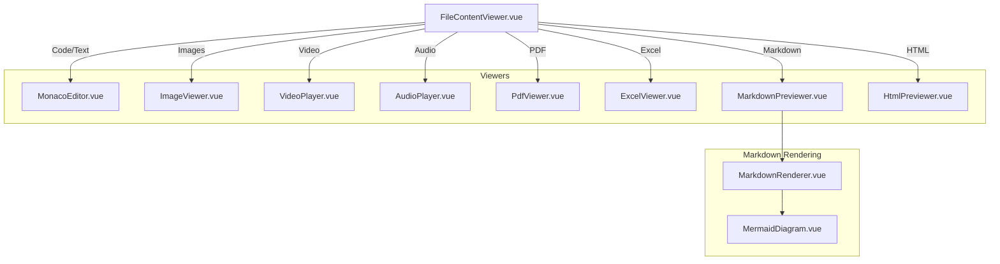
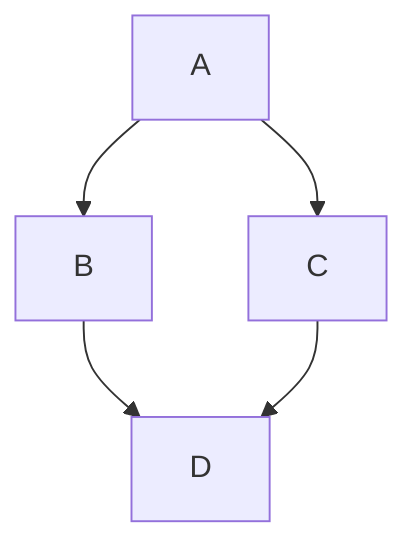

# File Content Rendering

This document describes how file content is rendered in the AutoByteus frontend, including the architecture of the content viewer and details on specific renderers like Markdown and Mermaid.

## Overview

The **FileContentViewer** component is responsible for displaying the content of files selected in the File Explorer. It provides a multi-tab interface, supports various file types, and allows for editing (for text/code files) or previewing (for rich media).

## Architecture

The rendering system follows a strategy pattern where the file extension determines the specific viewer component to use.



## Supported File Types

| Type      | Extensions                      | Viewer Component  |
| --------- | ------------------------------- | ----------------- |
| Text/Code | `.js`, `.py`, `.ts`, etc.       | MonacoEditor      |
| Image     | `.jpg`, `.png`, `.gif`, `.webp` | ImageViewer       |
| Video     | `.mp4`, `.mov`, `.webm`         | VideoPlayer       |
| Audio     | `.mp3`, `.wav`, `.m4a`          | AudioPlayer       |
| PDF       | `.pdf`                          | PdfViewer         |
| Markdown  | `.md`, `.markdown`              | MarkdownPreviewer |
| HTML      | `.html`, `.htm`                 | HtmlPreviewer     |
| Excel     | `.xlsx`, `.xls`, `.csv`         | ExcelViewer       |

## Shared Read-Only Viewer Surfaces

`FileViewer.vue` is also reused outside the desktop file-explorer tabs for
read-only surfaces:

- `components/mobile/MobileFileViewer.vue` opens workspace files from the
  `/mobile` Files tab in a full-screen phone viewer. It passes the
  `fileExplorerStore.openFilePreview(...)` state to `FileViewer` with
  `read-only=true`; text/Markdown/code, image, audio, video, PDF, CSV, and Excel
  families use the same protected workspace content routes as desktop. Mobile
  workspace HTML is shown as raw/read-only text rather than rich iframe preview.
- `components/workspace/team/TeamCommunicationReferenceViewer.vue` opens
  Team Communication `referenceFiles` through the message-owned team reference
  route. The mobile wrapper `MobileTeamReferenceViewer.vue` uses that same
  viewer in a phone full-screen shell and disables rich HTML preview while
  preserving raw/Markdown and protected binary/object-URL preview paths.
- `components/workspace/team/TeamReferenceFileViewer.vue` is the route-agnostic
  Team reference preview shell used by task-delegation references. The
  task-owned wrapper `TeamTaskReferenceViewer.vue` supplies
  `/team-runs/:teamRunId/task-delegations/:taskId/references/:referenceId/content`,
  does not own a task-specific Back-to-task control, and reuses the same
  raw/Markdown/media/PDF, CSV, and Excel `FileViewer` paths without changing
  message-owned reference UX. Returning from a task reference preview is owned
  by the Team Tasks navigator and section-local task/reference selection:
  selecting the task summary clears the selected reference and shows the task
  body again.

For Phone Access, protected REST resources must be loaded through the authorized
transport/object-URL helpers so the paired mobile bearer credential is attached.
Do not introduce unauthenticated static/iframe preview paths for protected
workspace or team-reference content without a separate security design.

## App-Wide Readability / Display Settings

File explorer and artifact viewers intentionally follow the shared **Settings -> Display -> App font size** preference instead of maintaining a separate viewer-only font control.

- Markdown/text preview surfaces inherit the root app font scaling.
- Markdown code blocks are kept on root-scale-compatible sizing so prose and code grow together.
- `MonacoEditor.vue` consumes the shared resolved editor metrics from `appFontSizeStore` because Monaco does not inherit CSS font sizing automatically.
- This keeps file explorer viewing and artifact viewing aligned with the same app-wide accessibility setting.

## Markdown Rendering

Markdown files are rendered using `MarkdownRenderer.vue`, which uses `markdown-it` for parsing. The parsing logic is encapsulated in `useMarkdownSegments.ts`.

### Features

- **Standard Markdown**: CommonMark compliant.
- **Syntax Highlighting**: Uses PrismJS for code blocks.
- **Math Support**: Uses KaTeX for explicit LaTeX equations (`$...$`, `$$...$$`, `\(...\)`, `\[...\]`, and `math` fences). The renderer does not infer inline math from ordinary prose or file paths.
- **Mermaid Diagrams**: Native support for Mermaid diagrams.

### Workspace-Relative Images

Markdown opened from the workspace file explorer carries an explicit workspace
identity and document path into `MarkdownPreviewer.vue`. That adapter resolves
relative image sources against the Markdown document's containing directory, so
forms such as `image.png`, `./assets/image.png`, and an in-workspace
`../images/image.png` use the selected workspace content route. Paths with
spaces or percent-encoded segments are decoded once and encoded once when the
route is built.

Resolution is intentionally opt-in:

- `MarkdownRenderer.vue` remains generic and never guesses the active
  workspace. Conversation, task, team-reference, and other Markdown surfaces
  without an explicit file resource context retain browser/sanitizer-owned
  behavior.
- HTTP(S), protocol-relative, root-relative, `data:`, `blob:`, `file:`, and
  other scheme-bearing image sources are not rewritten as workspace files.
- Malformed relative paths, encoded path separators, and relative paths that
  escape above the workspace root are left without a fetchable image source.
  The surrounding document and image alt text remain renderable.

Workspace image tokens are rendered without an initial `src`, sanitized, and
then bound to their managed resource URL. Desktop previews can use the protected
workspace content URL directly. With an active Phone Access credential, the
authorized-resource helper fetches the image with the captured bearer
credential and publishes an object URL. Changes to Markdown content, document
path, workspace, bound node, or credential invalidate old bindings; stale
requests cannot rebind an image, and obsolete object URLs are revoked.

The server remains authoritative for containment. Workspace content paths are
resolved lexically below the selected workspace root, and absolute or sibling
prefix traversal candidates are rejected even if a client bypasses frontend
normalization. Existing symlink semantics are unchanged.

### Mermaid Support

AutoByteus supports rendering Mermaid diagrams directly within markdown files. This is handled by a custom client-side renderer that replaces the need for backend generation (like PlantUML).

**Usage:**

````markdown

````

**Implementation Details:**

1.  **Parsing**: `useMarkdownSegments.ts` detects code fences with the language `mermaid` or `mmd`.
2.  **Rendering**: The `MermaidDiagram.vue` component receives the diagram text.
3.  **Service**: `mermaidService.ts` wraps the `mermaid` library to initialize settings (theme, security) and generate the SVG.

This architecture ensures that diagram rendering is:

- **Fast**: Client-side only, no network requests to generate images.
- **Secure**: Uses `securityLevel: 'loose'` but runs in the browser sandbox (note: 'loose' allows HTML in labels).
- **Theme-aware**: Can adapt to the application's light/dark mode.

## Related Documentation

- **[File Explorer](./file_explorer.md)**: Files selected in the explorer are rendered using the logic described here.
- **[Agent Execution Architecture](./agent_execution_architecture.md)**: Agent responses (streamed text) are parsed and rendered using these components.
