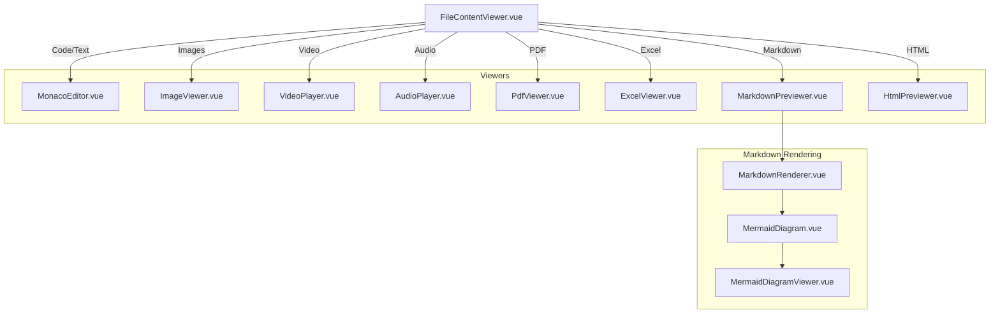
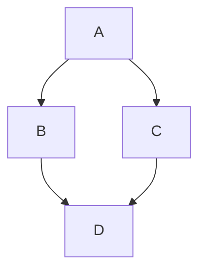

# File Content Rendering

This document describes how file content is rendered in the AutoByteus frontend, including the architecture of the content viewer and details on specific renderers like Markdown and Mermaid.

## Overview

The **FileContentViewer** component is responsible for displaying the content of files selected in the File Explorer. It provides a multi-tab interface, supports various file types, and allows for editing (for text/code files) or previewing (for rich media).

## Architecture

The rendering system follows a strategy pattern where the file extension determines the specific viewer component to use.



## Supported File Types

| Type      | Extensions                      | Viewer Component  |
| --------- | ------------------------------- | ----------------- |
| Text/Code | `.js`, `.py`, `.ts`, etc.       | MonacoEditor      |
| Image     | `.jpg`, `.jpeg`, `.png`, `.gif`, `.bmp`, `.webp`, `.svg` | ImageViewer       |
| Video     | `.mp4`, `.mov`, `.webm`         | VideoPlayer       |
| Audio     | `.mp3`, `.wav`, `.m4a`          | AudioPlayer       |
| PDF       | `.pdf`                          | PdfViewer         |
| Markdown  | `.md`, `.markdown`              | MarkdownPreviewer |
| HTML      | `.html`, `.htm`                 | HtmlPreviewer     |
| Excel     | `.xlsx`, `.xls`, `.csv`         | ExcelViewer       |

## Shared Read-Only Viewer Surfaces

`FileViewer.vue` is also reused outside the desktop file-explorer tabs for
read-only surfaces:

- `components/mobile/MobileFileViewer.vue` opens workspace files from the
  `/mobile` Files tab in a full-screen phone viewer. It passes the
  `fileExplorerStore.openFilePreview(...)` state to `FileViewer` with
  `read-only=true`; text/Markdown/code, image, audio, video, PDF, CSV, and Excel
  families use the same protected workspace content routes as desktop. Mobile
  workspace HTML is shown as raw/read-only text rather than rich iframe preview.
- `components/workspace/team/TeamCommunicationReferenceViewer.vue` opens
  Team Communication `referenceFiles` through the message-owned team reference
  route. The mobile wrapper `MobileTeamReferenceViewer.vue` uses that same
  viewer in a phone full-screen shell and disables rich HTML preview while
  preserving raw/Markdown and protected binary/object-URL preview paths.
- `components/workspace/team/TeamReferenceFileViewer.vue` is the route-agnostic
  Team reference preview shell used by task-delegation references. The
  task-owned wrapper `TeamTaskReferenceViewer.vue` supplies
  `/team-runs/:teamRunId/task-delegations/:taskId/references/:referenceId/content`,
  does not own a task-specific Back-to-task control, and reuses the same
  raw/Markdown/media/PDF, CSV, and Excel `FileViewer` paths without changing
  message-owned reference UX. Returning from a task reference preview is owned
  by the Team Tasks navigator and section-local task/reference selection:
  selecting the task summary clears the selected reference and shows the task
  body again.

For Phone Access, protected REST resources must be loaded through the authorized
transport/object-URL helpers so the paired mobile bearer credential is attached.
Do not introduce unauthenticated static/iframe preview paths for protected
workspace or team-reference content without a separate security design.

### Event Monitor Absolute-Path Previews

The central Event Monitor can opt into a scoped filesystem-path action capability
through `MarkdownRenderer.vue`. This capability is intentionally not enabled for
generic conversation, file-preview, task, team-reference, or other Markdown
consumers. The Event Monitor feed passes typed action events through the segment
chain to `useEventMonitorFilePreview`; rendering a message never opens a panel,
checks filesystem state, or fetches bytes.

The action policy recognizes POSIX and Windows drive-absolute paths in prose,
raw Markdown link destinations, inline code, and fenced code. Sentence
punctuation is excluded from prose candidates. Inline and fenced code remain
literal and copyable; any action affordance is adjacent to the code text. Raw
link destinations are retained before sanitization and resolved by a render-
scoped action ID, so browser-resolved `href` values are never treated as file
authorization. HTTP(S), relative paths, and ordinary non-Event-Monitor Markdown
behavior retain their existing handling.

The same Event Monitor-only capability recognizes valid `file:` URI tokens from
raw Markdown destinations without trusting the browser-resolved anchor URL.
Valid local URIs preserve their raw destination transiently for the activation
contract, while the rendered DOM contains only the render-scoped action ID and
display label. Empty-authority absolute URIs such as `file:///tmp/report.md`
can become actions; authorities, query strings, fragments, malformed escapes,
relative/empty paths, and unsupported file types remain inert. A valid URI may
still be unavailable in a browser/remote runtime, in which case the existing
localized host-only/unavailable state is shown before Files, mobile, workspace,
or filesystem access.

Path recognition rejects incomplete or placeholder components such as `.`, `..`,
`...`, and the Unicode ellipsis `…` before action/type classification. Complete
dotted filenames such as `release...notes.md` remain eligible. This keeps
truncated examples source-faithful and inert without rejecting legitimate
filenames.

Supported Event Monitor actions render as compact inline native links rather
than bordered buttons. Generated links show the file's display label/basename;
authored Markdown link labels remain authored. The render-scoped action ID,
delegated click/Enter/Space activation, localized accessibility metadata, focus
visibility, and fenced-code copy/source boundaries remain unchanged. Fenced-code
actions are rendered beside, not inside, the copied code text.

On explicit click, Enter, or Space, the Event Monitor launcher opens the normal
Files surface idempotently and requests the existing `FileViewer` path with an
explicit `source: 'event-monitor'` and `readOnly: true` intent. Existing file
tabs are reused by the File Explorer store, and no artifact/reference row or
persisted record is created. Desktop previews preserve the center feed and
focus the active file tab when a stable target is available. Phone-first
previews are delivered as a typed pending request to `MobileFiles`, where the
matching workspace/context request is rendered inline without Attach controls,
an overlay, or automatic full-screen presentation.

Runtime access remains environment-specific: embedded Electron may use the
trusted local boundary, while browser/remote/mobile clients must map the host
path inside the active workspace to a workspace-relative locator. Unmapped
paths remain copyable and show a localized host-only/unavailable state.

For embedded Electron binary previews, the action path uses the shared
`local-file://local/<encoded-absolute-path>` codec and trusted default-session
protocol gate described in the Electron packaging documentation. The original
`file:` URI is never used as an authorization URL, persisted locator, DOM
attribute, artifact/reference record, or API request.

Action eligibility and File Explorer type routing share the pure
`utils/fileExplorer/fileTypePolicy.ts` policy. Supported text/code/Markdown/HTML
families (including `.lua`) and the established image, audio, video, PDF, CSV,
and Excel families may produce an Event Monitor action. The image family
includes `.svg` (case-insensitively); after classification, workspace, trusted
local, and Artifacts-tab content continues through its existing authorized
content boundary into `FileViewer` and the URL-based `ImageViewer` rather than
an SVG source or inline-DOM renderer. ZIP/DMG/PKG/application
bundles, archives, generic binaries, and unknown extensions remain literal
source-faithful content with no Files affordance, filesystem read, media URL,
workspace fetch, or panel switch. A supported-looking path that is missing,
unreadable, a directory, or otherwise invalid follows the normal localized
viewer failure state instead; type ineligibility and runtime failure are
separate outcomes.

The compact left navigation strip keeps the capability-gated Nodes entry and
`/nodes` route. In strip mode it renders the existing visible nodes-network SVG
shape directly, matching the expanded navigation icon instead of relying on an
unregistered icon name.

## App-Wide Readability / Display Settings

File explorer and artifact viewers intentionally follow the shared **Settings -> Display -> App font size** preference instead of maintaining a separate viewer-only font control.

- Markdown/text preview surfaces inherit the root app font scaling.
- Markdown code blocks are kept on root-scale-compatible sizing so prose and code grow together.
- `MonacoEditor.vue` consumes the shared resolved editor metrics from `appFontSizeStore` because Monaco does not inherit CSS font sizing automatically.
- This keeps file explorer viewing and artifact viewing aligned with the same app-wide accessibility setting.

## Markdown Rendering

Markdown files are rendered using `MarkdownRenderer.vue`, which uses `markdown-it` for parsing. The parsing logic is encapsulated in `useMarkdownSegments.ts`.

### Features

- **Standard Markdown**: CommonMark compliant.
- **Syntax Highlighting**: Uses PrismJS for code blocks.
- **Math Support**: Uses KaTeX for explicit LaTeX equations (`$...$`, `$$...$$`, `\(...\)`, `\[...\]`, and `math` fences). The renderer does not infer inline math from ordinary prose or file paths.
- **Mermaid Diagrams**: Native support for Mermaid diagrams.

### Workspace-Relative Images

Markdown opened from the workspace file explorer carries an explicit workspace
identity and document path into `MarkdownPreviewer.vue`. That adapter resolves
relative image sources against the Markdown document's containing directory, so
forms such as `image.png`, `./assets/image.png`, and an in-workspace
`../images/image.png` use the selected workspace content route. Paths with
spaces or percent-encoded segments are decoded once and encoded once when the
route is built.

Resolution is intentionally opt-in:

- `MarkdownRenderer.vue` remains generic and never guesses the active
  workspace. Conversation, task, team-reference, and other Markdown surfaces
  without an explicit file resource context retain browser/sanitizer-owned
  behavior.
- HTTP(S), protocol-relative, root-relative, `data:`, `blob:`, `file:`, and
  other scheme-bearing image sources are not rewritten as workspace files.
- Malformed relative paths, encoded path separators, and relative paths that
  escape above the workspace root are left without a fetchable image source.
  The surrounding document and image alt text remain renderable.

Workspace image tokens are rendered without an initial `src`, sanitized, and
then bound to their managed resource URL. Desktop previews can use the protected
workspace content URL directly. With an active Phone Access credential, the
authorized-resource helper fetches the image with the captured bearer
credential and publishes an object URL. Changes to Markdown content, document
path, workspace, bound node, or credential invalidate old bindings; stale
requests cannot rebind an image, and obsolete object URLs are revoked.

The server remains authoritative for containment. Workspace content paths are
resolved lexically below the selected workspace root, and absolute or sibling
prefix traversal candidates are rejected even if a client bypasses frontend
normalization. Existing symlink semantics are unchanged.

### HTML Preview Source Selection

`FileViewer.vue` forwards the file's optional `relativeResourceContext` to
`HtmlPreviewer.vue`. The HTML adapter chooses its iframe source from that
explicit resource identity; it must not infer workspace authority from a
global active-workspace store or from the file path alone.

- Workspace-relative HTML with `{ kind: "workspace", workspaceId }` uses the
  bound REST static route, with each path segment encoded:
  `/rest/workspaces/<workspaceId>/static/<relative-path>`.
- Local absolute HTML and HTML without workspace resource context use the
  already-loaded content in a managed `Blob` URL. The adapter does not send
  the host absolute path to a workspace route. Blob URLs are revoked when the
  source changes or the viewer unmounts.
- The iframe remains sandboxed with `allow-scripts allow-same-origin` for both
  source strategies. Mobile workspace HTML continues to use the raw,
  read-only mobile presentation described above rather than this rich iframe
  path.

The backend static route remains the containment authority. An absolute path
or traversal candidate must not be converted into a workspace static URL or
used to bypass the workspace boundary; the server rejects such candidates
without returning the outside file payload. Relative local HTML assets loaded
from the existing Blob base may retain browser-origin limitations; changing
that behavior requires a separate trusted-resource design.

### Mermaid Support

AutoByteus supports rendering Mermaid diagrams directly within markdown files. This is handled by a custom client-side renderer that replaces the need for backend generation (like PlantUML).

**Usage:**

````markdown

````

**Implementation Details:**

1.  **Parsing**: `useMarkdownSegments.ts` detects code fences with the language `mermaid` or `mmd`.
2.  **Rendering**: The shared `MermaidDiagram.vue` component receives the diagram text. Its successful inline preview uses the available Markdown width without stretching beyond Mermaid's intrinsic maximum.
3.  **Service**: `mermaidService.ts` wraps the `mermaid` library to initialize settings (theme, security) and generate the SVG.
4.  **Inspection**: Every successful render provides one localized expand action as an absolute top-right overlay that reserves no diagram layout space. On hover-capable fine-pointer input it stays visually quiet at rest and appears when the preview is hovered or the control receives keyboard focus. On no-hover/coarse input, including a fine-primary device with any coarse secondary pointer, it stays visible with a touch-safe target. The action, or a primary click/tap on non-interactive diagram space, opens `MermaidDiagramViewer.vue` as a teleported modal. Loading and error states cannot open the viewer.

Mermaid failures are contained at the renderer boundary. `mermaidService.initialize()`
sets `suppressErrorRendering: true`, so a rejected parse/render returns to
`MermaidDiagram.vue` without Mermaid inserting its fallback error SVG into the
document body. The component renders the localized, app-owned error card inside
the Markdown segment; its `min-w-0`/`max-w-full`/horizontal containment and
wrapping rules keep long parser messages from widening the feed or workspace.
Error state cannot open the viewer, navigate, call backend/persistence paths, or
be fixed by hiding global body overflow. Repeated renders and unmounts continue
to use the existing generation invalidation, so stale failures and vendor nodes
cannot accumulate outside the component.

The viewer mounts the current live SVG only once, initially fits the complete
diagram to its canvas, and supports toolbar, keyboard, wheel/trackpad, pointer,
touch, and native-scroll interaction. Its persistent toolbar contains exactly
four uniform icon-only actions: zoom out, fit-to-view, zoom in, and close. The
fit action uses the inward-corners counterpart to the inline outward-corners
expand icon; localized names remain in `aria-label` and `title`, not visible
button text. Fine-pointer desktop uses compact square controls, while no-hover,
coarse/any-coarse, and narrow layouts retain uniform 44-pixel touch targets.
Zoom is clamped from the fitted overview through 4x; fit-to-view returns to the
overview and scroll origin. The modal traps focus, locks background scrolling,
closes through its close action, backdrop, or `Escape`, and returns focus to the
inline expand control. Controls remain reachable at narrow widths and increased
app/browser text sizes.

The viewer is also the top dialog when it is opened from Markdown inside an
already-maximized host such as an artifact or Files preview. Supported maximized
Markdown hosts use overlay tier `120`, while `MermaidDiagramViewer.vue` owns tier
`130`; changes to either side must preserve that ordering so the transferred SVG
and viewer controls remain visible and receive pointer input. Dismissal is
layer-scoped: close, backdrop, or the first `Escape` closes only the diagram,
restores its single live SVG and focus, and leaves the host's path, content,
Preview selection, and maximize state intact. The viewer consumes its handled
`Escape` before it can reach host-level listeners; a later, distinct `Escape`
may then dismiss the still-maximized host.

Mermaid links remain interactive rather than becoming expand or pan gestures.
HTTP(S) anchors, including SVG `xlink:href` forms, use the shared
`MarkdownRenderer.vue` external-link authority in both inline and expanded
views. Other link schemes retain their native/sanitized behavior. A source
change invalidates any open viewer and renders a fresh SVG, so stale diagram
content and viewport state are not retained.

The inline overlay remains in the successful-state tab order even when hidden
at fine-pointer rest. Focus reveals it immediately, reduced-motion preferences
remove decorative transition timing, and the capability fallback favors visible
usable chrome whenever a coarse pointer is available.

`MarkdownRenderer.vue` is reused by conversation, team/task, file-preview, and
other rich-text surfaces. Mermaid inspection therefore belongs at this shared
renderer boundary; consumers should not add diagram-specific modal state or
reuse the image/gallery modal, whose raster URL, copy, download, and gallery
contract is different.

This architecture ensures that diagram rendering is:

- **Fast**: Client-side only, no network requests to generate images.
- **Secure**: Uses `securityLevel: 'loose'` but runs in the browser sandbox (note: 'loose' allows HTML in labels).
- **Theme-aware**: Can adapt to the application's light/dark mode.

Focused unit/component coverage is colocated under
`components/conversation/segments/renderer/__tests__/`. The durable real-browser
probe starts its own temporary Nuxt route and Chrome session, then removes both:

```bash
pnpm test:e2e:diagram-zoom-viewer -- --output-dir test-results/diagram-zoom-viewer
```

## Related Documentation

- **[File Explorer](./file_explorer.md)**: Files selected in the explorer are rendered using the logic described here.
- **[Agent Execution Architecture](./agent_execution_architecture.md)**: Agent responses (streamed text) are parsed and rendered using these components.
