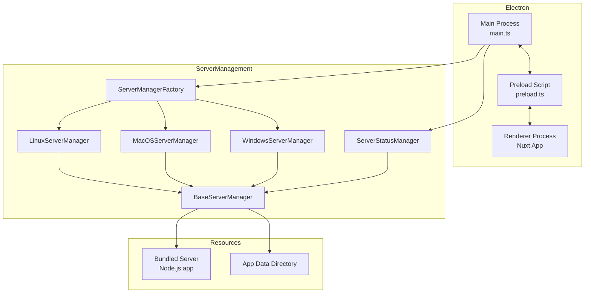
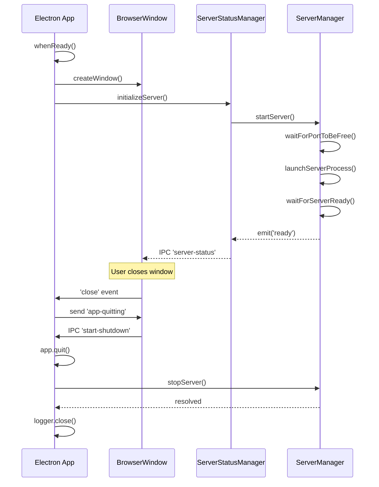

# Electron Packaging and Server Management

This document describes the design and implementation of the **Electron desktop packaging** in autobyteus-web, which bundles and manages a local Node.js backend server for a fully self-contained desktop application.

## Overview

AutoByteus is packaged as an Electron application that:

- Provides a native desktop experience across Windows, macOS, and Linux
- Bundles a prepared Node.js backend server with production dependencies and native modules
- Manages the server lifecycle automatically
- Uses IPC for secure communication between main and renderer processes

## Architecture



## Directory Structure

```
autobyteus-web/
├── electron/
│   ├── main.ts                 # Main process entry point
│   ├── preload.ts              # Secure API bridge to renderer
│   ├── logger.ts               # File and console logging
│   ├── types.d.ts              # TypeScript definitions
│   ├── shared/
│   │   └── embeddedServerConfig.ts  # Stable embedded server URL/port defaults
│   ├── server/
│   │   ├── baseServerManager.ts      # Abstract base class
│   │   ├── linuxServerManager.ts     # Linux implementation
│   │   ├── macOSServerManager.ts     # macOS implementation
│   │   ├── windowsServerManager.ts   # Windows implementation
│   │   ├── serverManagerFactory.ts   # Factory pattern
│   │   ├── serverStatusManager.ts    # Status bridge/events
│   │   ├── serverStatusEnum.ts       # Status enum
│   │   ├── services/                 # Extracted services
│   │   │   ├── AppDataService.ts     # Directory/config management
│   │   │   ├── HealthChecker.ts      # Health polling logic
│   │   │   └── index.ts              # Service exports
│   │   └── __tests__/                # Server tests
│   └── utils/
│       ├── shellEnv.ts         # PATH from login shell
│       └── __tests__/          # Utils tests
├── build/
│   ├── scripts/
│   │   ├── build.ts                # electron-builder script
│   │   ├── macSign.ts              # macOS signing adapter
│   │   ├── macSigningPolicy.ts     # macOS entitlement classifier
│   │   ├── macSigningDiscovery.ts  # macOS signing subject discovery
│   │   └── generateIcons.ts        # Icon generation
│   └── icons/                      # Platform-specific icons
└── resources/
    └── server/                 # Bundled Node.js server
```

---

## Server Manager System

### BaseServerManager

Abstract class providing platform-agnostic server lifecycle management:

| Method            | Description                             |
| ----------------- | --------------------------------------- |
| `startServer()`   | Initialize and start the backend server |
| `stopServer()`    | Gracefully stop the server process      |
| `isRunning()`     | Check if server is running and ready    |
| `getServerUrls()` | Get all API endpoint URLs               |
| `getServerPort()` | Return the fixed port (29695)           |
| `getAppDataDir()` | Application data directory              |

Key features:

- **EventEmitter-based**: Emits `ready`, `error`, and `stopped` events
- **Fixed port**: Uses port `29695` for the server
- **First-run initialization**: Copies required config files on first launch
- **Validation**: Checks for required server files before starting
- **Port waiting**: Ensures port is free before binding

### Platform-Specific Managers

| Platform | Class                  | Entrypoint              |
| -------- | ---------------------- | ----------------------- |
| Linux    | `LinuxServerManager`   | `dist/app.js` (Node)    |
| macOS    | `MacOSServerManager`   | `dist/app.js` (Node)    |
| Windows  | `WindowsServerManager` | `dist/app.js` (Node)    |

Each extends `BaseServerManager` and implements:

- `getServerRoot()` - Returns path to the bundled server root directory
- `launchServerProcess()` - Spawns the server with correct environment

### ServerStatusManager

Bridges server events to the renderer process:

```typescript
// Events emitted to renderer via IPC
interface ServerStatusEvent {
  status: "starting" | "running" | "error" | "restarting" | "shutting-down";
  urls: { graphql; rest; ws; transcription; health };
  message?: string;
  healthCheckStatus?: string;
}
```

Methods:

- `initializeServer()` - Start server on app launch
- `restartServer()` - Stop and restart the server
- `checkServerHealth()` - Ping health endpoint
- `getStatus()` - Return current status object

---

## Main Process (main.ts)

### Window Creation

- Creates a secure `BrowserWindow` with sandbox enabled
- Blocks unintended navigations and new windows for security
- Registers custom `local-file://` protocol for secure local media access

### IPC Handlers

| Handler                | Purpose                          |
| ---------------------- | -------------------------------- |
| `get-server-status`    | Return current server status     |
| `restart-server`       | Restart the backend server       |
| `check-server-health`  | Ping server health endpoint      |
| `get-log-file-path`    | Get path to app log file         |
| `open-log-file`        | Open log file in system editor   |
| `read-log-file`        | Read last 500 lines of log       |
| `read-local-text-file` | Securely read local file content |
| `open-external-link`   | Open URL in system browser       |
| `reset-server-data`    | Clear server data directory      |
| `get-platform`         | Return OS platform string        |

### App Lifecycle



---

## Preload Script (preload.ts)

Exposes a secure `electronAPI` to the renderer process via `contextBridge`:

```typescript
window.electronAPI = {
  // Server control
  getServerStatus: () => Promise<ServerStatus>,
  restartServer: () => Promise<ServerStatus>,
  checkServerHealth: () => Promise<HealthStatus>,
  onServerStatus: (callback) => () => void,

  // App updates
  getAppUpdateState: () => Promise<AppUpdateState>,
  checkForAppUpdates: () => Promise<AppUpdateState>,
  downloadAppUpdate: () => Promise<AppUpdateState>,
  installAppUpdateAndRestart: () => Promise<{ accepted: boolean }>,
  onAppUpdateState: (callback) => () => void,

  // File operations
  getLogFilePath: () => Promise<string>,
  openLogFile: (path) => Promise<Result>,
  readLogFile: (path) => Promise<Result>,
  readLocalTextFile: (path) => Promise<Result>,
  getPathForFile: (file: File) => string,

  // System
  openExternalLink: (url) => Promise<Result>,
  getPlatform: () => Promise<string>,

  // Recovery
  clearAppCache: () => Promise<Result>,
  resetServerData: () => Promise<Result>,

  // Shutdown
  onAppQuitting: (callback) => void,
  startShutdown: () => void,
}
```

---

## Build System

### electron-builder Configuration

Located in `build/scripts/build.ts`:

```typescript
const options: Configuration = {
  appId: "com.autobyteus.app",
  productName: "AutoByteus",
  directories: { output: "electron-dist" },
  files: ["dist/**/*", "package.json"],
  extraMetadata: { main: "dist/electron/main.js" },
  asar: true,
  mac: {
    hardenedRuntime: true,
    entitlements: "build/entitlements.mac.plist",
    sign: "./build/dist/macSign.js",
  },
  extraResources: [
    { from: "resources/server", to: "server" },
    { from: "build/icons", to: "icons" },
  ],
  // Platform-specific configurations...
};
```

### Platform Targets

| Platform | Target         | Artifact Pattern                        |
| -------- | -------------- | --------------------------------------- |
| Linux    | AppImage       | `AutoByteus_<flavor>_linux-x64-{version}.AppImage` / `AutoByteus_<flavor>_linux-arm64-{version}.AppImage` |
| Windows  | NSIS installer | `AutoByteus_<flavor>_windows-{version}.exe`      |
| macOS    | DMG + ZIP      | `AutoByteus_<flavor>_macos-{arch}-{version}.dmg/.zip` |

Flavor resolution:

- `personal` -> `AutoByteus_personal`
- `enterprise` -> `AutoByteus_enterprise`
- Resolution order in `build/scripts/build.ts`:
  1. `AUTOBYTEUS_BUILD_FLAVOR` env override (`personal` or `enterprise`)
  2. Git context inference (`personal` / `enterprise` branch detection)
  3. Safe fallback: `enterprise`

### Build Commands

```bash
# Build for current platform
npx ts-node build/scripts/build.ts

# Build for specific platform
npx ts-node build/scripts/build.ts --linux
npx ts-node build/scripts/build.ts --linux --x64
npx ts-node build/scripts/build.ts --linux --arm64
npx ts-node build/scripts/build.ts --windows
npx ts-node build/scripts/build.ts --mac

# Build for all platforms. The Linux target uses the native Linux host architecture
# and fails if a Linux package is requested from a non-Linux host.
npx ts-node build/scripts/build.ts
```

`scripts/prepare-server.sh` / `scripts/prepare-server.mjs` build the Node server, deploy it into `resources/server`, and rebuild native modules (e.g., `node-pty`) for the Electron runtime.
The web project only calls the server packaging boundary; any shared server-side prerequisites remain owned by `autobyteus-server-ts` rather than being prepared directly from `autobyteus-web`.

For macOS terminal packaging, every `node-pty` `spawn-helper` found under the staged server `node_modules` must be executable before the app is packed. The packaging hooks normalize all matching helper files rather than only one architecture-specific path, because `node-pty` may select `prebuilds/darwin-x64`, `prebuilds/darwin-arm64`, or a build directory depending on the packaged runtime. The runtime guard in `autobyteus-ts/src/tools/terminal/node-pty-bootstrap.ts` still repairs the selected helper at startup, but packaging should ship the selected helper already executable.

`scripts/verify-packaged-terminal-runtime.mjs` is the release-time validator for this invariant. It checks the staged `resources/server` tree and the final `.app/Contents/Resources/server` tree for the target Darwin architecture, verifies that the selected and target `node-pty` helpers are executable, checks Darwin architecture tokens when the `file` tool is available, and runs a real `node-pty` spawn probe when the build host matches the target architecture.

### macOS Signing Policy

macOS release artifacts use an explicit least-privilege signing policy instead of
letting every nested binary inherit the top-level app entitlements.
`build/scripts/macSign.ts` is the `electron-builder` signing adapter, and
`build/scripts/macSigningPolicy.ts` classifies each signing subject:

- the top-level `AutoByteus.app/Contents/MacOS/AutoByteus` executable uses the
  root app entitlement profile in `build/entitlements.mac.plist`;
- Electron helper app executables use narrow helper entitlement plists
  (`build/entitlements.mac.helper*.plist`);
- non-app nested Mach-O code is signed with the hardened runtime but without an
  entitlement payload. This includes Squirrel/ShipIt, framework executables and
  libraries, `.dylib` files, `.node` native modules, and bundled server native
  binaries.

`build/scripts/afterPack.ts` must stay limited to pre-signing resource
normalization such as `node-pty` `spawn-helper` execute bits. Do not reintroduce
server-native codesigning with `build/entitlements.mac.plist` from `afterPack`,
and do not restore `mac.entitlementsInherit` for child code; both patterns can
put app-only entitlements on updater-critical nested binaries.

`scripts/verify-macos-signing-policy.mjs` is the release-time guard for this
invariant. It verifies the signed `.app`, fails if any non-app nested signing
subject carries entitlement keys, explicitly checks Squirrel and ShipIt, and
confirms the root app executable still has the expected root app entitlement
keys. The `Desktop Release` GitHub Actions workflow runs this verifier for both
macOS ARM64 and macOS x64 before uploading artifacts.

For a local signed macOS package, compile the build scripts and run:

```bash
pnpm transpile-build
APP_BUNDLE="$(find electron-dist -path '*/AutoByteus.app' -type d -print -quit)"
node scripts/verify-macos-signing-policy.mjs --app "$APP_BUNDLE"
```

The verifier requires macOS `codesign` and a signed app bundle. Unsigned local
builds are useful for packaging iteration, but they are not release-policy proof.

On Linux packaging, the script validates that server resources match the native Linux target architecture. Linux x64 packages require the Debian OpenSSL engine targets (`debian-openssl-1.1.x` and `debian-openssl-3.0.x`); Linux ARM64 packages require `linux-arm64-openssl-3.0.x`. Unsupported Linux cross-architecture packaging fails before Electron artifacts are emitted. Validation covers:

- packaged CLI engines directory (`@prisma/engines`)
- packaged Prisma Client runtime directory (`.prisma/client`)

---

## Auto-Update Delivery

Auto-updates are powered by `electron-updater` in the main process via `electron/updater/appUpdater.ts`.

### Runtime Behavior

- Startup auto-check runs only for packaged apps (dev/unpackaged mode is skipped).
- Renderer windows receive normalized updater state via IPC channel `app-update-state`.
- Manual check entrypoint is exposed in `Settings > Updates` (canonical UI location).
- User actions from UI trigger IPC handlers:
  - `app-update:check`
  - `app-update:download`
  - `app-update:install`

### Updater Error Safety

`electron/updater/appUpdater.ts` is the only boundary that should inspect raw
`electron-updater` failures. It classifies failures before broadcasting renderer
state and keeps dependency diagnostics in the Electron main log instead of in
normal UI.

Renderer-visible update state must stay safe for display:

- `shared/appUpdateTypes.ts` carries `errorKind` and `errorOperation`.
- The renderer contract must not reintroduce a raw `error` / provider-message
  field for normal UI, Settings, or toast copy.
- `utils/appUpdateErrorDisplay.ts` maps `errorKind` to localized notice,
  Settings, and toast messages.
- `stores/appUpdateStore.ts` suppresses visible card/toast noise for startup
  `network` and `release-preparing` failures, while manual checks and
  download/install failures still show concise recovery copy.
- Raw provider details such as `net::ERR_*`, `ERR_UPDATER_*`, provider URLs,
  YAML, stack traces, or file lists belong in the Electron main log with
  classification context, not in user-facing renderer text.

Current safe error categories are:

- `network` — transient connection/server reachability failures.
- `release-preparing` — the latest GitHub release is visible but required
  desktop updater metadata/assets are not available yet.
- `metadata` — update metadata/package information is incomplete or invalid.
- `download` — an available update could not be downloaded.
- `install` — a downloaded update could not be applied/restarted.
- `unavailable` — update actions are unavailable in the current runtime.
- `unknown` — fallback safe copy for unrecognized updater failures.

### Provider Configuration

- Build-time publish metadata is generated in `build/scripts/build.ts`.
- Provider is GitHub Releases only.
- Optional override:
  - `AUTOBYTEUS_UPDATER_REPOSITORY` (`owner/repo`) when repository auto-detection is not available.

### Release Asset Requirements

For updater compatibility, published release assets must include:

- Linux:
  - x64: `*linux-x64*.AppImage`, `latest-linux.yml`
  - ARM64: `*linux-arm64*.AppImage`, `latest-linux-arm64.yml`
  - AppImage blockmaps are embedded in the AppImage and represented by numeric
    `blockMapSize` entries in `latest-linux*.yml`; standalone Linux
    `*.AppImage.blockmap` files are not release assets.
- macOS:
  - `*.dmg`, `*.dmg.blockmap`
  - `*.zip`, `*.zip.blockmap`
  - `latest-mac.yml`

The desktop release workflow (`.github/workflows/release-desktop.yml`) is aligned to upload these files.

### Release-Preparation Window

The repository uses multiple `v*` tag-triggered release workflows that publish
different asset families to the same GitHub Release. During a release, the
GitHub Release can become visible before the Desktop Release workflow has
uploaded every desktop updater asset and metadata file listed above. A packaged
app that checks for updates during that window can receive missing
`latest-mac.yml`, `latest-linux.yml`, `latest-linux-arm64.yml`, `latest.yml`, or asset-not-found provider
errors even though the final release will become complete after the desktop
workflow finishes.

App-side behavior for that condition is intentionally `release-preparing`: show
calm retry guidance such as "The latest update is still being prepared on
GitHub. Try again in a few minutes," suppress startup/background noise, and
preserve the raw provider diagnostic in Electron logs for troubleshooting.

Release workflow orchestration that prevents public/latest GitHub Releases from
appearing before desktop updater assets are ready is a separate release-process
follow-up. Do not work around the deployment window by exposing raw updater
diagnostics in renderer state or UI.

### Fixed-DMG Recovery After Broken macOS Updaters

If an already-installed macOS app has Squirrel or ShipIt signed with app-level
entitlement keys, macOS can block that installed source app before it can apply a
future update. The durable recovery path is to install a fixed DMG once, replacing
the source app with a corrected signing layout. After that manual fixed-DMG
install, future auto-updates can run from a source app whose updater helpers are
signed without entitlement keys.

Do not try to repair this class of failure in renderer UI or updater runtime code:
`electron/updater/appUpdater.ts` should continue to classify install failures and
log diagnostics, while release engineering provides a fixed signed DMG and the
manual-install recovery instruction.

---

## Server Resource Packaging

The bundled server is located at `resources/server/` and includes:

| File/Directory       | Purpose                                   |
| -------------------- | ----------------------------------------- |
| `dist/`              | Compiled Node.js server output            |
| `prisma/`            | Prisma schema + migrations                |
| `node_modules/`      | Production dependencies (incl. prisma)   |
| `package.json`       | Server package metadata                   |
| `.env`               | Default environment configuration         |
| `download/`          | Pre-packaged downloadable assets (optional) |

On macOS, the packaged server's `node_modules` includes `node-pty` native binaries and `spawn-helper` files. Keep `prepare-server`, `afterPack`, and `verify-packaged-terminal-runtime.mjs` aligned so the helper adjacent to the `node-pty` native module selected for the packaged architecture is present, executable, and architecture-compatible in both the staged resources and final `.app` resources.

At runtime, the server:

1. Runs on a fixed port (`29695`)
2. Stores data in `~/.autobyteus/server-data/`
3. Provides endpoints: `/graphql`, `/rest`, `/transcribe`

For one-time migration of an existing SQLite DB into `server-data`, use:

```bash
scripts/migrate-legacy-db.sh --from /path/to/production.db --to ~/.autobyteus/server-data
```

---

## Utilities

### Embedded Server Config (`shared/embeddedServerConfig.ts`)

- Defines the stable embedded server loopback host and port
- Provides shared HTTP/WS base URLs for Electron runtime defaults

### Shell Environment (`shellEnv.ts`)

- `getLoginShellPath()` - Inherits PATH from user's login shell
- Essential for macOS/Linux where GUI apps have minimal PATH
- Supports both bash and zsh

### Logger (`logger.ts`)

- Writes to both console and `~/.autobyteus/logs/app.log`
- Overwrites log on each app start
- Methods: `debug()`, `info()`, `warn()`, `error()`

---

## Data Directories

| Directory                          | Purpose                                |
| ---------------------------------- | -------------------------------------- |
| `~/.autobyteus/`                      | Canonical AutoByteus desktop data root |
| `~/.autobyteus/server-data/`          | Server runtime data                    |
| `~/.autobyteus/extensions/`           | Managed extension install root         |
| `~/.autobyteus/extensions/voice-input/` | Voice Input runtime, model, temp, and download assets |
| `~/.autobyteus/server-data/db/`       | SQLite databases                       |
| `~/.autobyteus/server-data/logs/`     | Server logs                            |
| `~/.autobyteus/server-data/download/` | Downloaded assets                      |

Where:

- **Linux**: `~/.autobyteus/`
- **macOS**: `~/.autobyteus/`
- **Windows**: `%USERPROFILE%\\.autobyteus\\`

### Managed Voice Input Extension

- Voice Input is delivered as a managed extension instead of being bundled into the base desktop installer.
- Release provenance is pinned to the dedicated runtime repository:
  - `AutoByteus/autobyteus-voice-runtime`
- The extension lifecycle is:
  - `Install` downloads the platform runtime bundle into `~/.autobyteus/extensions/voice-input` and then performs local backend/model bootstrap for that machine
  - `Enable` turns on the shared composer microphone without re-downloading
  - `Disable` turns off dictation while keeping the installed assets on disk
  - `Remove` deletes the managed extension assets and resets Voice Input-specific state
- The published runtime release stays lightweight:
  - release assets include platform runtime bundles plus `voice-input-runtime-manifest.json`
  - bilingual model archives are not published as release assets
- The installed runtime owns backend-specific local bootstrap:
  - macOS arm64 downloads the MLX model locally during install
  - macOS x64, Linux x64, and Windows x64 download the `faster-whisper` model locally during install
- Backend policy:
  - macOS arm64 uses the MLX worker bundle
  - macOS x64, Linux x64, and Windows x64 use the `faster-whisper` worker bundle

## Related Documentation

- **[System Architecture](../ARCHITECTURE.md)**: High-level overview of the system including the Electron integration.
- **[Settings](./settings.md)**: Server status and logs can be monitored via the Settings page.
