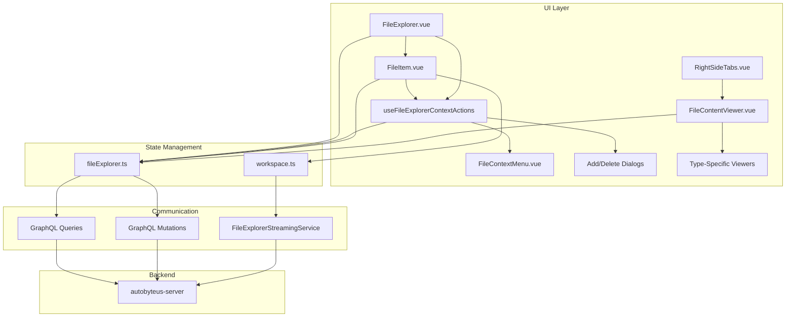
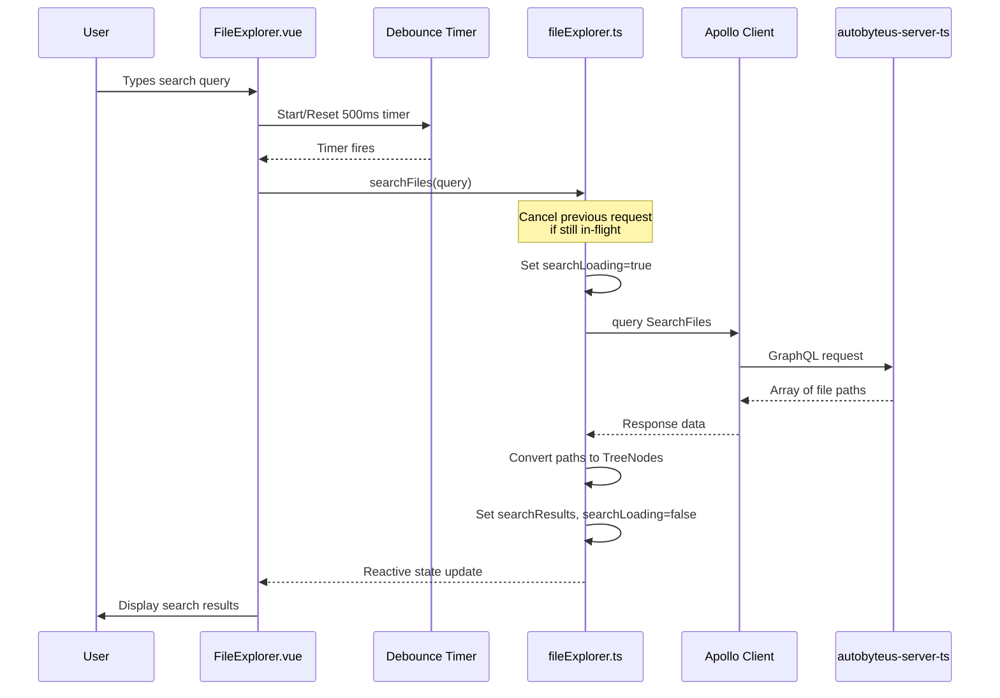

# File Explorer Module - Frontend

This document describes the design and implementation of the **File Explorer** module in the autobyteus-web frontend, which provides workspace file browsing, file content viewing, and real-time synchronization with the backend.

## Overview

The File Explorer module enables users to:

- Browse workspace directory trees with expandable folders
- View file contents with type-specific viewers (code, images, audio, video, markdown, Excel)
- Perform file operations (create, rename, delete, move via drag-and-drop)
- Search files within workspaces
- Receive real-time updates when files change on the backend
- **Lazy Load** large directories for performance
- Browse/search/open workspace files from the `/mobile` Phone Access shell using a phone-first, read-only Files surface over the same workspace and file-explorer stores

## Module Structure

```
autobyteus-web/
├── components/fileExplorer/
│   ├── FileExplorer.vue              # Main file explorer panel and context-action host
│   ├── FileItem.vue                  # Recursive file/folder row, open/rename/drag source
│   ├── FileContentViewer.vue         # Multi-tab content viewer
│   ├── FileContextMenu.vue           # Presentational right-click context menu
│   ├── AddFileOrFolderDialog.vue     # Create file/folder dialog
│   ├── ConfirmDeleteDialog.vue       # Delete confirmation dialog
│   ├── MonacoEditor.vue              # Code editing component
│   └── viewers/                      # Type-specific viewers
│       ├── AudioPlayer.vue
│       ├── ExcelViewer.vue
│       ├── HtmlPreviewer.vue
│       ├── ImageViewer.vue
│       ├── MarkdownPreviewer.vue
│       └── VideoPlayer.vue
├── components/mobile/
│   ├── MobileFiles.vue               # Phone-first workspace browser
│   └── MobileFileViewer.vue          # Read-only mobile file viewer/attach sheet
├── composables/mobile/
│   └── useMobileWorkspaceFileExplorer.ts # Mobile workspace resolution, lazy load, search, and open state coordinator
├── composables/
│   ├── useWorkspaceFileExplorer.ts       # Workspace-scoped file explorer API boundary
│   └── useFileExplorerContextActions.ts  # Desktop context-menu/create/delete lifecycle owner
├── services/
│   └── fileExplorerStreaming/        # WebSocket streaming service
│       ├── FileExplorerStreamingService.ts  # WebSocket client
│       ├── types.ts                         # Protocol types
│       └── index.ts                         # Exports
├── stores/
│   ├── workspace.ts                  # Workspace & tree state
│   └── fileExplorer.ts               # File explorer UI state
├── graphql/
│   ├── queries/file_explorer_queries.ts
│   └── mutations/file_explorer_mutations.ts
├── utils/fileExplorer/
│   ├── TreeNode.ts                   # TreeNode class
│   ├── contextMenu.ts                # Context target/action/create-path policy
│   ├── fileUtils.ts                  # Tree manipulation utilities
│   ├── openFolderRefresh.ts          # Visible-session snapshot refresh helpers
│   └── stateSync.ts                  # Mutation echo suppression and path remapping helpers
└── types/
    └── fileSystemChangeTypes.ts      # Change event types
```

## Architecture



## Core Components

### Event Monitor Preview Requests

Incidental absolute paths in the central Event Monitor use the existing Files
surface as a transient, read-only preview; they do not become Message
references, Agent artifacts, or persisted File Explorer records. The
Event-Monitor-owned `useEventMonitorFilePreview` launcher is the only
coordination point for this action. It resolves the runtime locator, calls
`fileExplorerStore.openFilePreview(...)` with an explicit read-only access
intent, opens the desktop right panel/selects Files idempotently, and leaves
the center conversation in place. Reopening a path selects the existing tab
instead of creating a duplicate, while normal user-opened tabs remain intact.

The runtime locator rules are deliberately different by environment:

| Runtime | Locator / behavior |
| --- | --- |
| Embedded Electron | The trusted Electron bridge may open an absolute local path. Text uses the main-process read IPC boundary. Binary viewers use the shared canonical `local-file://local/<encoded-absolute-path>` codec and the default-session protocol boundary; both paths recheck absolute shape, existence, readability, and regular-file status immediately before bytes are returned. |
| Browser / remote | The path must be contained by the active workspace root and converted to a workspace-relative locator before the existing authorized content route is used. Unmapped paths remain copyable and show localized host-only/unavailable status without a content request. |
| Phone-first `/mobile` | The path must map to the selected run/team/workspace context. A revisioned request carries context, workspace, relative path, read-only intent, and inline presentation; `MobileFiles` rejects stale or mismatched requests and consumes only the current one. |

Path recognition is opt-in to the Event Monitor Markdown renderer and passive
output is inert. Explicit pointer or keyboard activation is required. The
request uses the shared `FileViewer` adapters for text/Markdown/HTML, image,
audio, video, PDF, CSV, and Excel content. Failure states stay in the normal
Files/viewer status surface and do not navigate the application or rewrite the
original Event Monitor content.

#### HTML Preview Resource Contract

The shared `FileViewer` passes `relativeResourceContext` through to
`HtmlPreviewer` when a text file is opened in preview mode. HTML source
selection is explicit:

- A workspace-relative file with `{ kind: "workspace", workspaceId }` is
  rendered from the bound REST static route for that workspace. The relative
  path is encoded segment-by-segment.
- A trusted local absolute file, including an Event Monitor Electron preview,
  and any HTML file without workspace context is rendered from the content
  already loaded into a managed Blob URL. The absolute host path is never
  interpolated into a workspace static URL or sent to the server.
- Both paths use the existing sandboxed iframe. Blob URLs are revoked when
  content/source changes and when the viewer is unmounted.

The server remains authoritative for static-route containment. Absolute or
traversal candidates sent to the static route are rejected and must not expose
an outside HTML payload. Do not restore path-only or global-active-workspace
inference to select a static URL. Relative assets in local HTML retain the
existing Blob-base limitation; expanding that behavior requires an approved
follow-up resource/security design.

Event Monitor raw Markdown `file:` destinations use the same scoped capability
as absolute-path candidates. Only empty-authority absolute URIs with valid
paths and supported preview types become actions. Authorities, query/fragment
decorations, malformed or relative URIs, empty paths, and unsupported types
remain literal and inert; they do not fall through to generic browser
navigation. Raw URI provenance is transient and never enters DOM attributes,
persisted File Explorer state, references/artifacts, workspace requests, or API
payloads. A valid URI that cannot map in the active browser/remote workspace
remains an action with the localized host-only/unavailable result before any
Files/mobile/content access.

Incomplete placeholder components (`.`, `..`, `...`, and `…`) are rejected
before a preview action is created, including on POSIX and Windows paths.
Complete dotted filenames remain valid. Supported actions use compact inline
clickable links showing the generated file label/basename while preserving
authored Markdown labels, with the existing delegated click/Enter/Space behavior
and non-visible accessibility metadata; fenced code controls stay outside the
copied code text. The left navigation strip's
capability-gated Nodes item uses the existing nodes-network SVG and continues to
route to `/nodes`.

Action eligibility and `determineFileType()` use the shared
`utils/fileExplorer/fileTypePolicy.ts` allowlist so the Event Monitor cannot
offer a preview action for a type that the shared viewer cannot render.
Supported code/text families include the existing `.lua` family. Archive,
installer, application-bundle, generic-binary, and unknown extensions such as
`.zip`, `.dmg`, and `.pkg` remain visible and copyable but do not create an
action, open a tab, read text, construct `local-file://`, or request workspace
content. This pure filename decision is separate from validation of a
supported-looking path at the trusted native/server boundary.

#### Embedded Electron Local Binary Previews

For embedded Electron, File Explorer and Event Monitor binary previews build
canonical local locators through `shared/localFileUrl.ts`; viewer components do
not interpolate or parse `local-file://` themselves. The Electron default
session permits the request only from the exact current main frame of a live
registered workspace-shell window. The protocol handler then revalidates the
path and serves a MIME-correct full or single-range response with byte streaming
and deterministic file-handle cleanup. The exact privilege, main-frame gate,
status/header, and range contract is documented in
[Electron Packaging and Server Management](./electron_packaging.md#trusted-local-file-preview-boundary).

This one path intentionally serves images, audio, video, PDF.js XHR, and Excel
Fetch. PDF and Excel must not be moved to a viewer-specific filesystem or IPC
bypass, and renderer child frames must not acquire local-file bytes. Browser,
remote-node, and Phone Access previews continue to use protected
workspace-relative content routes instead of the Electron scheme.

`VideoPlayer.vue` uses the native controls and the streamed response, so a
supported file can load finite metadata, play/pause, and seek without first
buffering the whole source into renderer memory. If authorization/resource
loading or Chromium decoding fails, the player leaves the black `0:00` state
and renders a localized accessible alert with **Retry**. Retry refreshes the
resource resolver and remounts only the current media attempt; selecting a new
URL also clears stale failure state. The preview never modifies, transcodes, or
claims support for codecs outside the Chromium runtime shipped with the app.

### FileExplorer.vue

Main container component for the file browser panel:

```vue
<template>
  <div class="file-explorer">
    <!-- Search input -->
    <input v-model="searchQuery" placeholder="Search files..." />

    <!-- File tree -->
    <div v-if="hasWorkspaces">
      <FileItem v-for="file in displayedFiles" :key="file.id" :file="file" />
    </div>
  </div>
</template>
```

**Key Features:**

- Search files within active workspace
- Displays workspace tree or search results
- Collapsible panel integration
- Owns the single desktop context-action surface for the explorer, including
  root/background context menus, row context-menu requests, create/delete
  dialogs, and rename requests.
- Closes context menus/dialogs when the Files panel becomes inactive.

### FileItem.vue

Recursive component for files and folders. `FileItem.vue` renders rows and
normalizes row context-menu requests, but it does not own context-menu state,
create/delete dialogs, or mutation target policy.

| Feature           | Description                                                                           |
| ----------------- | ------------------------------------------------------------------------------------- |
| **Click**         | Open file (preview mode for `.md`/`.html`/`.csv`, edit mode for code) / toggle folder |
| **Context Menu**  | Emits row target/position requests to the explorer-owned context-action controller     |
| **Rename**        | Starts inline rename when the explorer-owned context-action controller requests it     |
| **Drag & Drop**   | Move files between folders                                                            |
| **Visual States** | Open folder indicator, drag-over highlight                                            |

**Drag & Drop Implementation:**

```typescript
// Set drag data with file path
onDragStart(event: DragEvent) {
  event.dataTransfer?.setData('text/plain', props.file.path)
  event.dataTransfer?.setData('source-is-file', String(props.file.is_file))
}

// Handle drop on valid folder targets
onDrop(event: DragEvent) {
  const sourcePath = event.dataTransfer?.getData('text/plain')
  const destinationPath = `${props.file.path}/${sourceFileName}`
  fileExplorerStore.moveFileOrFolder(sourcePath, destinationPath)
}
```

### Desktop Context Actions

Desktop create/rename/delete context actions use one explorer-owned controller
instead of per-row menus. The ownership split is:

- `FileExplorer.vue` hosts one `FileContextMenu`, one create dialog, and one
  delete confirmation dialog for the whole explorer surface.
- `useFileExplorerContextActions.ts` owns active target state, menu visibility,
  menu positioning, document click/Escape listeners, create/delete confirmation
  flow, and rename request dispatch.
- `utils/fileExplorer/contextMenu.ts` owns the pure context target/action model:
  row targets can add file, add folder, rename, and delete; root/background
  targets can only add file or add folder.
- `FileItem.vue` emits a `FileExplorerContextRequest` containing a row target
  and pointer position. It no longer dispatches a global close-all event or
  renders its own context menu/dialogs.
- `FileContextMenu.vue` is presentational: it receives visible/menu-item
  props and emits the selected action id.

Create-path policy is target-aware:

| Target | Create Parent |
| --- | --- |
| Explorer background/root | Workspace root (`""`) |
| Folder row | The folder path |
| File row | The file's containing folder |

All context actions remain scoped through `useWorkspaceFileExplorer`, so
mutations use the resolved workspace id for the visible desktop Files panel.
When the Files panel becomes inactive, `FileExplorer.vue` closes open context
menus and dialogs and suspends inactive explorer work.

### FileContentViewer.vue

Multi-tab file content viewer located in the **Right Side Panel** (Files Tab).

For detailed information on supported file types and the rendering architecture (including Markdown and Mermaid support), please refer to the [Content Rendering Documentation](./content_rendering.md).

## State Management

### WorkspaceStore (workspace.ts)

Manages metadata-only workspace lifecycle and visible file-explorer stream ownership:

```typescript
interface WorkspaceInfo {
  workspaceId: string;
  name: string;
  displayName?: string;
  workspaceRootPath?: string | null;
  workspaceConfig: any;
  absolutePath: string | null;
  kind?: "filesystem" | "skill" | "temp";
  isTemp?: boolean;
}
```

**Key Actions:**

| Action | Description |
| --- | --- |
| `createWorkspace()` | Creates/resolves metadata only. It does **not** acquire a file-explorer tree or start a persistent file watcher. |
| `fetchAllWorkspaces()` | Loads visible workspace metadata from the backend workspace registry on startup or backend-context reset. It does **not** acquire file-explorer trees or start live streams. |
| `removeWorkspace(workspaceId)` | Removes a registered filesystem workspace from the visible Workspaces registry after backend confirmation, then clears metadata, file-explorer tree/content/cache state, and live-session state for that workspace. It does not delete workspace files. |
| `fetchFolderChildren()` | **[Lazy Load]** Fetches children for a folder when expanded or when a visible explorer refreshes open folders. |
| `acquireFileExplorerLiveSession(workspaceId, consumerId)` | Registers one visible file explorer consumer. The first consumer opens one WebSocket/live watcher stream for the workspace and returns an idempotent release function. |
| `releaseFileExplorerLiveSession(workspaceId, consumerId)` | Releases a visible consumer. The last release disconnects the WebSocket and lets the backend stop the watcher lease. |
| `connectFileExplorerLiveStream()` / `disconnectFileExplorerLiveStream()` | Internal connection management used by the live-session API; components should not call these directly. |
| `refreshFileExplorerSnapshot()` | Refreshes the root and currently open folders when a file explorer becomes visible so missed changes are reconciled before live events arrive. |
| `handleFileSystemChange()` | Applies local mutation results and WebSocket tree changes, while consuming self-initiated mutation echoes from the stream. |

Workspace removal is a workspace-list operation, not a file delete. Successful removal unregisters/hides the workspace row and disconnects local file-explorer state for that workspace, but the underlying directory and saved run/team history remain on disk. Loading the same root again re-registers the workspace and allows its preserved history to be displayed again.

### FileExplorerStore (fileExplorer.ts)

Manages UI state and file content:

```typescript
interface OpenFileState {
  path: string;
  type: "Text" | "Image" | "Audio" | "Video" | "Excel" | "PDF" | "Unsupported";
  mode: "edit" | "preview";
  content: string | null;
  url: string | null;
  isLoading: boolean;
  error: string | null;
}
```

**Key Actions:**

| Action                                            | Description                  |
| ------------------------------------------------- | ---------------------------- |
| `openFile()`                                      | Opens file in full edit mode |
| `openFilePreview()`                               | Opens file in preview mode   |
| `fetchFileContent()`                              | Loads text file via GraphQL  |
| `saveFileContentFromEditor()`                     | Saves text content via mutation and suppresses self-echo modify events |
| `toggleFolder()`                                  | Expands/collapses folder     |
| `searchFiles()`                                   | Searches files via GraphQL   |
| `createFileOrFolder()`                            | Creates a workspace-relative file or folder and applies the returned tree change |
| `renameFileOrFolder()`                            | Renames a node, remaps open/path-scoped state, and applies the returned tree change |
| `deleteFileOrFolder()`                            | Deletes a node, closes open/active files in the deleted path scope, and applies the returned tree change |
| `moveFileOrFolder()`                              | Moves a node, remaps open/path-scoped state, and applies the returned tree change |
| `closePathScopedFiles()`                          | Removes open-file/active-file state for a deleted file or containing folder |
| `navigateToNextTab()` / `navigateToPreviousTab()` | Tab navigation               |

> **Important:** All actions and getters in `FileExplorerStore` require a mandatory `workspaceId` parameter. The store is **workspace-agnostic** and does not assume any "active" workspace.

### useWorkspaceFileExplorer Composable

The `useWorkspaceFileExplorer` composable provides a scoped, workspace-bound interface to the `FileExplorerStore`. It is the recommended way for components to interact with the file explorer.

**Location:** `composables/useWorkspaceFileExplorer.ts`

**Purpose:**

- Binds all file explorer operations to a specific `workspaceId`
- Falls back to `activeWorkspace` if no explicit ID is provided
- Provides a clean API for components without needing to pass `workspaceId` to every call

**Usage:**

```typescript
import { useWorkspaceFileExplorer } from "~/composables/useWorkspaceFileExplorer";

// Option 1: Explicit workspace ID (for Skills, transient workspaces)
const explorer = useWorkspaceFileExplorer(toRef(props, "workspaceId"));

// Option 2: Use the active workspace (for main agent views)
const explorer = useWorkspaceFileExplorer();

// Scoped actions - no need to pass workspaceId
explorer.openFile("/src/main.ts");
explorer.toggleFolder("/src");
explorer.searchFiles("utils");

// Scoped state
const files = explorer.openFiles; // ComputedRef<string[]>
const activeFile = explorer.activeFile; // ComputedRef<string | null>
```

**Provide/Inject Pattern:**

`FileExplorer.vue` provides the composable instance to its children:

```typescript
// FileExplorer.vue
const explorer = useWorkspaceFileExplorer(toRef(props, "workspaceId"));
provide("workspaceFileExplorer", explorer);
provide("requestFileExplorerContextMenu", openContextMenu);
provide("fileExplorerRenameRequest", renameRequest);

// FileItem.vue (child)
const explorer = inject("workspaceFileExplorer")!;
explorer.openFile(props.file.path); // Uses the correct workspace context
```

This pattern is critical for **Skill workspaces**, which are NOT the "active" workspace but need their own isolated file explorer context.

`FileExplorer.vue` also provides the desktop context-action request and rename
signals to recursive `FileItem.vue` rows. Rows use those signals to request a
menu or start inline rename, while the parent controller keeps the mutation
target, dialogs, and close behavior centralized.

### Mobile Files and `useMobileWorkspaceFileExplorer`

The `/mobile` Phone Access Files tab uses `MobileFiles.vue` and
`useMobileWorkspaceFileExplorer.ts` instead of the desktop split-pane explorer
layout. The mobile surface is read-only and delegates to the same authoritative
workspace/file-explorer owners:

- workspace resolution comes from the current `MobileWorkContext`:
  workspace contexts use their workspace id, and agent/team run contexts resolve
  by workspace root path;
- if a selected run/team-run workspace root cannot be resolved, mobile shows an
  explicit unavailable/retry state instead of falling back to another active or
  first workspace;
- folder taps call `workspaceStore.fetchFolderChildren(workspaceId, path)` for
  unloaded folders before navigating;
- full-workspace search calls `fileExplorerStore.searchFiles(query,
  workspaceId)`, so matches do not depend only on already-loaded tree nodes;
- file taps call `fileExplorerStore.openFilePreview(path, workspaceId)` and
  pass the resulting open-file state into `MobileFileViewer.vue`;
- `MobileFileViewer.vue` reuses the shared `FileViewer` in read-only mode for
  supported text/Markdown/code, image, audio, video, PDF, CSV, and Excel
  previews through protected workspace content URLs and authorized resource
  loading;
- the mobile **Attach** action is owned by
  `useMobileFileContextCoordinator.ts` and adds workspace paths to the active
  run, pending team-run, or next-run draft context without turning Files into an
  editor.

Mobile Files must not import desktop shell/split-pane owners such as
`FileExplorerLayout`, `FileExplorerTabs`, `TeamCommunicationPanel`,
`RightSideTabs`, or Electron APIs. Create/rename/delete/move/edit operations
remain desktop file-explorer responsibilities unless a separate mobile editing
design is approved.

## TreeNode Data Structure

Client-side representation of files/folders:

```typescript
class TreeNode {
  name: string; // File or folder name
  path: string; // Full relative path
  is_file: boolean; // True for files, false for folders
  children: TreeNode[]; // Child nodes (for folders)
  id: string; // Unique identifier
  childrenLoaded: boolean; // False if children need to be fetched via lazy load

  // Sorted insertion (directories first, then alphabetically)
  addChild(node: TreeNode): void;

  // Deserialize from server JSON
  static fromObject(obj: any): TreeNode;
}
```

## File Search

The File Search feature enables users to quickly find files within a workspace by typing a search query. It uses backend snapshot search strategies such as `fuzzysort` and displays results as clickable file items.

### Architecture



### State Management

Search state is maintained per-workspace within `WorkspaceFileExplorerState`:

```typescript
interface WorkspaceFileExplorerState {
  // ... other fields ...

  // State for file search
  searchResults: TreeNode[]; // Array of matching file nodes
  searchLoading: boolean; // True while request is in-flight
  searchError: string | null; // Error message if search fails
  searchAbortController: AbortController | null; // For request cancellation
}
```

**Getters (in `fileExplorer.ts`):**

| Getter | Returns | Description |
| --- | --- | --- |
| `getSearchResults(workspaceId)` | `TreeNode[]` | Array of matching file nodes for the workspace. |
| `isSearchLoading(workspaceId)` | `boolean` | True if a search request is in-flight for the workspace. |
| `getSearchError(workspaceId)` | `string \| null` | Error message if search failed for the workspace. |

### Key Features

#### 1. Debounced Input (500ms)

To avoid overwhelming the backend with requests on every keystroke, the UI debounces the search input:

```typescript
// FileExplorer.vue
let searchDebounceTimer: ReturnType<typeof setTimeout> | null = null;

watch(searchQuery, (newQuery) => {
  if (searchDebounceTimer) {
    clearTimeout(searchDebounceTimer);
  }

  searchDebounceTimer = setTimeout(() => {
    explorer.searchFiles(newQuery);
  }, 500);
});
```

#### 2. Request Cancellation (AbortController)

If a new search is triggered while a previous request is still in-flight, the previous request is cancelled to prevent stale results from overwriting newer ones:

```typescript
// fileExplorer.ts - searchFiles action
async searchFiles(query: string, workspaceId: string) {
  const wsState = this._getOrCreateWorkspaceState(workspaceId);

  // Cancel any previous in-flight search request
  if (wsState.searchAbortController) {
    wsState.searchAbortController.abort();
  }
  wsState.searchAbortController = new AbortController();

  // Pass signal to Apollo Client
  const { data } = await client.query({
    query: SearchFiles,
    variables: { workspaceId, query },
    context: {
      fetchOptions: {
        signal: wsState.searchAbortController.signal
      }
    }
  });
  // ...
}
```

#### 3. TreeNode Conversion

Search results from the backend are file paths. The frontend converts these to `TreeNode` objects so they can be rendered by the same `FileItem.vue` component used for the directory tree:

```typescript
wsState.searchResults = matchedPaths.map((filePath) => {
  // First try to find existing node in the tree (for proper metadata)
  const existingNode = findFileByPath(
    fileExplorerStore.getWorkspaceTree(workspaceId)?.children || [],
    filePath
  );
  if (existingNode) return existingNode;

  // If not in tree (due to lazy loading), create a simple TreeNode
  const fileName = filePath.split("/").pop() || filePath;
  return new TreeNode(
    fileName, // name
    filePath, // path
    true, // is_file
    [], // children
    `search-${filePath}`, // unique id for search results
    true // childrenLoaded
  );
});
```

### UI Component (FileExplorer.vue)

The search input and results display are integrated into the main file explorer panel:

```vue
<template>
  <div class="file-explorer">
    <!-- Search input -->
    <input v-model="searchQuery" type="text" placeholder="Search files..." />

    <!-- Results display -->
    <div v-if="searchLoading">Loading search results...</div>
    <div v-else-if="displayedFiles.length === 0 && searchQuery">
      No files match your search.
    </div>
    <div v-else>
      <FileItem v-for="file in displayedFiles" :key="file.id" :file="file" />
    </div>
  </div>
</template>

<script setup>
const displayedFiles = computed(() => {
  if (searchQuery.value) {
    return explorer.searchResults.value || []; // Show search results
  }
  return explorer.tree.value?.children || []; // Show tree
});
</script>
```

### Usage Example

```typescript
const fileExplorerStore = useFileExplorerStore();

// Search for files
await fileExplorerStore.searchFiles("utils", workspaceId);

// Access results
const results = fileExplorerStore.getSearchResults(workspaceId);
const isLoading = fileExplorerStore.isSearchLoading(workspaceId);
const error = fileExplorerStore.getSearchError(workspaceId);
```

### Backend Integration

The frontend sends a `SearchFiles` GraphQL query. Search is a request/response snapshot operation and must not start a live watcher. Superseded frontend searches are aborted; the backend propagates the GraphQL request abort signal into search snapshot refresh so stale full-tree traversal/index work is cancelled or detached from the caller. See [autobyteus-server-ts/docs/modules/file_explorer.md](../../autobyteus-server-ts/docs/modules/file_explorer.md) for backend implementation details including:

- Search strategy pattern (allowing different search algorithms)
- Fuzzy matching using `fuzzysort` and optional ripgrep-backed strategies
- File name index refreshes from snapshot traversal instead of persistent watcher state
- Request aborts and File Explorer close abort stale search snapshot refresh work

---

## GraphQL API

### Queries

```graphql
# Get file content
query GetFileContent($workspaceId: String!, $filePath: String!) {
  fileContent(workspaceId: $workspaceId, filePath: $filePath)
}

# Search files
query SearchFiles($workspaceId: String!, $query: String!) {
  searchFiles(workspaceId: $workspaceId, query: $query)
}

# Get folder children (Lazy Loading)
query GetFolderChildren($workspaceId: String!, $folderPath: String!) {
  folderChildren(workspaceId: $workspaceId, folderPath: $folderPath)
}
```

### Mutations

```graphql
# Write file content
mutation WriteFileContent($workspaceId: String!, $filePath: String!, $content: String!)

# Create file or folder
mutation CreateFileOrFolder($workspaceId: String!, $path: String!, $isFile: Boolean!)

# Delete file or folder
mutation DeleteFileOrFolder($workspaceId: String!, $path: String!)

# Move file or folder
mutation MoveFileOrFolder($workspaceId: String!, $sourcePath: String!, $destinationPath: String!)

# Rename file or folder
mutation RenameFileOrFolder($workspaceId: String!, $targetPath: String!, $newName: String!)
```

### Backend Path Boundary Contract

The server treats all File Explorer paths as workspace-relative and validates
them against the workspace root before reading, writing, or mutating tree
state. Frontend callers should pass relative paths returned by the tree/search
APIs and surface backend errors without trying to normalize escaped paths into
valid operations.

Backend-enforced rules include:

- ignored folders such as `.git`, `node_modules`, and `.gitignore`-matched
  paths are rejected by `folderChildren` instead of being projected into the
  tree;
- `folderChildren`, `fileContent`, and `writeFileContent` reject traversal or
  same-prefix sibling escapes that resolve outside the workspace root;
- `renameFileOrFolder.newName` must be a leaf name, not a path; path-like names
  are rejected before filesystem mutation;
- rejected snapshot/boundary operations do not acquire live watcher sessions.

### Subscriptions (Removed)

> [!NOTE]
> The GraphQL subscription `FileSystemChanged` has been removed.
> Real-time file system changes are now delivered via WebSocket (see below).

## Real-Time Synchronization (WebSocket)

Real-time file synchronization is **visibility-driven**. Snapshot APIs such as workspace create/fetch, folder lazy-load, file content reads, file mutations, and search are request/response flows and do **not** keep a backend filesystem watcher open. A live watcher exists only while at least one visible `FileExplorer.vue` consumer has acquired a live session for a workspace.

### Visible Live Session Lifecycle

`FileExplorer.vue` watches its resolved workspace (`props.workspaceId` or the active workspace), acquires a live session when the explorer is mounted for that workspace, and releases it on unmount or workspace switch:

```typescript
const liveSessionConsumerId = `file-explorer:${++fileExplorerConsumerCounter}`;
let releaseLiveSession: (() => void) | null = null;

watch(() => currentWorkspace.value?.workspaceId ?? "", (workspaceId) => {
  releaseLiveSession?.();
  releaseLiveSession = workspaceId
    ? workspaceStore.acquireFileExplorerLiveSession(workspaceId, liveSessionConsumerId)
    : null;
}, { immediate: true });

onUnmounted(() => {
  releaseLiveSession?.();
});
```

The `workspace.ts` store owns de-duplication across visible consumers:

```typescript
acquireFileExplorerLiveSession(workspaceId: string, consumerId: string): () => void {
  let consumers = this.fileExplorerLiveConsumers.get(workspaceId);
  if (!consumers) {
    consumers = new Set();
    this.fileExplorerLiveConsumers.set(workspaceId, consumers);
  }

  const alreadyRegistered = consumers.has(consumerId);
  consumers.add(consumerId);
  if (!alreadyRegistered && consumers.size === 1) {
    this.connectFileExplorerLiveStream(workspaceId);
    this.refreshFileExplorerSnapshot(workspaceId);
  }

  return () => this.releaseFileExplorerLiveSession(workspaceId, consumerId);
}
```

Important guarantees:

- Multiple visible explorer surfaces for the same workspace share one frontend `FileExplorerStreamingService` connection.
- Releasing one consumer does not disconnect the stream while other consumers remain visible.
- The final consumer release disconnects the WebSocket and clears the workspace's live-consumer set.
- The first visible consumer for a workspace refreshes the root and currently open folders through GraphQL so an explorer that was hidden catches up without needing a background watcher.
- If the live stream disconnects abnormally and reconnects, the next successful connection refreshes the root and currently open folders again before relying on subsequent stream events.
- Backend binding resets, duplicate workspace replacement, and skill workspace unregister all clear live sessions before removing workspace state.

### WebSocket Service

The `FileExplorerStreamingService` is the low-level WebSocket client. Components normally use the `workspace.ts` live-session API instead of constructing this service directly.

```typescript
import { FileExplorerStreamingService } from "~/services/fileExplorerStreaming";
import { useWindowNodeContextStore } from "~/stores/windowNodeContextStore";

const windowNodeContextStore = useWindowNodeContextStore();
const wsEndpoint = windowNodeContextStore.getBoundEndpoints().fileExplorerWs;

const service = new FileExplorerStreamingService(wsEndpoint, {
  onFileSystemChange: (event) => {
    workspaceStore.handleFileSystemChange(workspaceId, event, "stream");
  },
  onConnect: (sessionId) => {
    console.log("Connected to file explorer stream:", sessionId);
  },
  onDisconnect: (reason) => {
    console.log("Disconnected:", reason);
  },
  onError: (error) => {
    console.error("WebSocket error:", error);
  },
});

service.connect(workspaceId);
service.disconnect();
```

### Backend Watcher Lease Lifecycle

The backend WebSocket route resolves the workspace and asks its file explorer for a watcher lease before subscribing to events. `WorkspaceFileExplorer.acquireWatcherLease("file-explorer-websocket")` starts the underlying `FileSystemWatcher` only for the first active lease and returns an idempotent lease release handle. `subscribe()` is valid only after a lease has started the watcher.

Each WebSocket session owns one watcher lease through `FileExplorerSession`. Disconnecting the WebSocket, ending the async event iterator, early-closing before the `CONNECTED` message is observed, or closing the workspace releases the session and lease. When the lease count reaches zero, the backend parent process logically stops the watcher: subscribers and pending timers are closed, the current watcher generation is detached, and a stop command is sent to a child watcher runtime process.

The child watcher runtime owns native chokidar start/close and sends raw events back to the parent over IPC with `{ watcherId, generation }` identity. Physical chokidar close can block or be force-killed without blocking unrelated backend routes such as Terminal. Stale child messages from a previous generation are ignored after close/restart.

Event delivery intentionally stays simple. The backend keeps the existing lightweight batching and bounded queues for `FILE_SYSTEM_CHANGE`. If the runtime fails or an event queue overflows, the stream closes with an error; the frontend reconnect path refreshes a snapshot instead of attempting semantic event reconciliation.

Snapshot operations intentionally bypass this lifecycle:

- `createWorkspace`, `fetchAllWorkspaces`, `folderChildren`, `fileContent`, and `searchFiles` return snapshots without acquiring watcher leases.
- File mutations return concrete change events that the frontend applies immediately; the later stream echo is filtered if a live stream is open.
- Search index refresh uses snapshot traversal (`getAllFilePaths`), observes request abort signals, and does not keep watcher state alive.

### Sequence Diagram

```mermaid
sequenceDiagram
    participant ExplorerA as Visible FileExplorer A
    participant ExplorerB as Visible FileExplorer B
    participant Store as workspace.ts
    participant WebSocket as FileExplorerStreamingService
    participant Backend as FileExplorerStreamHandler
    participant Explorer as WorkspaceFileExplorer
    participant Watcher as FileSystemWatcher
    participant FS as File System

    ExplorerA->>Store: acquireFileExplorerLiveSession(workspaceId, consumerA)
    Store->>WebSocket: connect(workspaceId) because first consumer
    Store->>Store: refreshFileExplorerSnapshot(workspaceId)
    WebSocket->>Backend: /ws/file-explorer/{workspaceId}
    Backend->>Explorer: acquireWatcherLease("file-explorer-websocket")
    Explorer->>Watcher: start() if first lease
    Backend-->>WebSocket: CONNECTED(sessionId)

    ExplorerB->>Store: acquireFileExplorerLiveSession(workspaceId, consumerB)
    Store->>Store: reuse existing stream; refresh snapshot

    FS-->>Watcher: File created/modified/deleted
    Watcher->>Backend: Batched FileSystemChangeEvent
    Backend-->>WebSocket: FILE_SYSTEM_CHANGE
    WebSocket->>Store: handleFileSystemChange(workspaceId, event, "stream")
    Store->>ExplorerA: Reactive tree update
    Store->>ExplorerB: Reactive tree update

    ExplorerA->>Store: release consumerA
    Store->>Store: keep stream because consumerB remains
    ExplorerB->>Store: release consumerB
    Store->>WebSocket: disconnect()
    Backend->>Explorer: release watcher lease
    Explorer->>Watcher: logical stop when lease count is zero
    Watcher-->>Watcher: child runtime closes/kills chokidar asynchronously
```

### Key Files

Frontend:

- `components/fileExplorer/FileExplorer.vue` - visible-session acquisition/release and desktop context-action host.
- `components/fileExplorer/FileItem.vue` - recursive row rendering, file/folder open behavior, inline rename, drag/drop, and row context-menu request emission.
- `components/fileExplorer/FileContextMenu.vue` - presentational menu that renders computed action items and emits selected action ids.
- `composables/useFileExplorerContextActions.ts` - desktop context-menu target state, positioning, create/delete dialog lifecycle, rename request dispatch, and panel-inactive cleanup.
- `utils/fileExplorer/contextMenu.ts` - root/node context target model, allowed action lists, and create-path resolution policy.
- `services/fileExplorerStreaming/FileExplorerStreamingService.ts` - low-level WebSocket client, authenticated remote-access WebSocket URL handling, reconnect policy.
- `services/fileExplorerStreaming/types.ts` - protocol types.
- `stores/workspace.ts` - metadata-only workspace lifecycle and live-consumer tracking, one stream per workspace.
- `stores/fileExplorerContentActions.ts` - file open/content state management, including path-scoped cleanup when a delete removes an open file or containing folder.
- `stores/fileExplorerMutationActions.ts` - create/rename/delete/move GraphQL mutations, returned change-event application, and path-scoped state remapping/cleanup.
- `stores/workspaceFileExplorerLiveActions.ts` - visible-consumer acquisition/release, reconnect snapshot refresh, search abort/generation invalidation on final release.
- `utils/fileExplorer/openFolderRefresh.ts` - root/open-folder refresh helpers for newly visible explorers.
- `utils/fileExplorer/stateSync.ts` - structural mutation echo filtering and path remapping helpers.

Backend:

- `autobyteus-server-ts/src/api/websocket/file-explorer.ts` - Fastify WebSocket route and early-close handling.
- `autobyteus-server-ts/src/services/file-explorer-streaming/file-explorer-stream-handler.ts` - watcher lease acquisition, session setup, stream loop, disconnect cleanup.
- `autobyteus-server-ts/src/services/file-explorer-streaming/file-explorer-session.ts` - session-owned async iterator cancellation and watcher lease release.
- `autobyteus-server-ts/src/file-explorer/file-explorer.ts` - lazy tree/search/operation/watcher capability boundary and watcher lease counting.
- `autobyteus-server-ts/src/file-explorer/watcher/file-system-watcher.ts` - parent watcher lifecycle, generation identity, subscriber fan-out, and logical stop.
- `autobyteus-server-ts/src/file-explorer/watcher/runtime/` - child-process watcher runtime; `chokidar-watcher-runtime.ts` is the only production chokidar adapter.
- `autobyteus-server-ts/src/file-explorer/search-snapshot/workspace-search-snapshot-controller.ts` - abortable search snapshot refresh/indexing.

### Change Event Types

```typescript
interface FileSystemChangeEvent {
  changes: Array<
    AddChange | DeleteChange | RenameChange | MoveChange | ModifyChange
  >;
}

interface AddChange {
  type: "add";
  parent_id: string;
  node: { id: string; name: string; path: string; is_file: boolean };
}

interface DeleteChange {
  type: "delete";
  parent_id: string;
  node_id: string;
}

interface RenameChange {
  type: "rename";
  parent_id: string;
  node: { id: string; name: string; path: string };
}

interface MoveChange {
  type: "move";
  old_parent_id: string;
  new_parent_id: string;
  node: { id: string; name: string; path: string };
}

interface ModifyChange {
  type: "modify";
  node_id: string;
}
```

### Echo Prevention

The frontend handles two classes of self-initiated event echoes:

1. **Structural mutation echoes** (`add`, `delete`, `rename`, `move`): after a successful GraphQL mutation, `fileExplorer.ts` records the returned change event with `recordRecentStructuralChangeEcho()` and immediately applies it through the file-explorer tree state. If the live stream later emits the same change, `fileExplorer.ts` calls `consumeRecentStructuralChangeEchoes()` before applying stream changes so the tree is not mutated twice.
2. **Content save echoes** (`modify`): before saving text content, the store tags the path in `filesToIgnoreNextModify`. When the corresponding stream `modify` event arrives, the tag is consumed so the editor does not immediately invalidate and refetch its own saved content.

```typescript
// Structural operation result from GraphQL
const changeEvent: FileSystemChangeEvent = JSON.parse(data.moveFileOrFolder);
fileExplorerStore.recordRecentStructuralChangeEcho(workspaceId, changeEvent);
fileExplorerStore.handleFileSystemChange(workspaceId, changeEvent, "mutation");

// Incoming stream event
const effectiveEvent = fileExplorerStore.consumeRecentStructuralChangeEchoes(
  workspaceId,
  event,
);
if (effectiveEvent.changes.length > 0) {
  applyTreeChanges(wsState.tree, wsState.nodeIdToNode, effectiveEvent);
}
```

```typescript
// Before saving text content
wsFileExplorerState.filesToIgnoreNextModify.add(filePath);

// When receiving a modify event
if (wsFileExplorerState.filesToIgnoreNextModify.has(node.path)) {
  wsFileExplorerState.filesToIgnoreNextModify.delete(node.path);
} else {
  fileExplorerStore.invalidateFileContent(node.path, workspaceId);
}
```

## File Utilities

### Tree Manipulation (fileUtils.ts)

| Function                         | Description                                    |
| -------------------------------- | ---------------------------------------------- |
| `handleFileSystemChange()`       | Routes change events to handlers               |
| `handleAddChange()`              | Adds node to parent with sorted insertion      |
| `handleDeleteChange()`           | Removes node from parent                       |
| `handleRenameChange()`           | Renames node and updates descendants           |
| `handleMoveChange()`             | Moves node between parents                     |
| `updateDescendantPaths()`        | Recursively updates child paths on rename/move |
| `findFileByPath()`               | Searches tree for node by path                 |
| `createNodeIdToNodeDictionary()` | Builds id→node lookup map                      |

### File Type Detection

```typescript
function determineFileType(
  filePath: string
): "Text" | "Image" | "Audio" | "Video" | "Excel" {
  const imageExtensions = [".jpg", ".jpeg", ".png", ".gif", ".bmp", ".webp", ".svg"];
  const audioExtensions = [".mp3", ".wav", ".m4a", ".flac", ".ogg", ".aac"];
  const videoExtensions = [".mp4", ".mov", ".avi", ".mkv", ".webm"];
  const excelExtensions = [".xlsx", ".xls", ".xlsm", ".csv"];
  // ... extension matching logic
}
```

## Usage Examples

### Opening a File

Prefer the workspace-scoped composable inside components:

```typescript
const explorer = useWorkspaceFileExplorer(toRef(props, "workspaceId"));

// Open in full edit mode
explorer.openFile("/src/main.ts");

// Open in preview mode
explorer.openFilePreview("/docs/README.md");
```

If using the store directly, pass `workspaceId` explicitly:

```typescript
const fileExplorerStore = useFileExplorerStore();
await fileExplorerStore.openFile("/src/main.ts", workspaceId);
await fileExplorerStore.openFilePreview("/docs/README.md", workspaceId);
```

### Performing File Operations

Desktop context-menu actions should prefer the explorer-owned
`useFileExplorerContextActions` flow, which delegates mutations through the
workspace-scoped `useWorkspaceFileExplorer` instance. Lower-level callers can
still invoke the store directly when they already have an explicit workspace id:

```typescript
// Create a new file
await fileExplorerStore.createFileOrFolder("/src/utils/helpers.ts", true, workspaceId);

// Rename a file
await fileExplorerStore.renameFileOrFolder("/src/old-name.ts", "new-name.ts", workspaceId);

// Delete a file
await fileExplorerStore.deleteFileOrFolder("/src/deprecated.ts", workspaceId);

// Move a file
await fileExplorerStore.moveFileOrFolder("/src/utils.ts", "/src/lib/utils.ts", workspaceId);
```

### Navigating Open Files

```typescript
// Navigate between tabs with keyboard
fileExplorerStore.navigateToNextTab(workspaceId); // Arrow Right
fileExplorerStore.navigateToPreviousTab(workspaceId); // Arrow Left

// Close files
fileExplorerStore.closeFile("/src/main.ts", workspaceId);
fileExplorerStore.closeAllFiles(workspaceId);
fileExplorerStore.closeOtherFiles("/src/app.ts", workspaceId); // Keep only app.ts
```

## Related Documentation

- **[Content Rendering](./content_rendering.md)**: Details how file content (Markdown, Code, Media) is displayed.
- **[Terminal](./terminal.md)**: Terminal uses an explicit cwd/root path and is intentionally separate from File Explorer tree/search/watch state.
- **[Skills](./skills.md)**: Skills are file-based and often managed or viewed within the file system context.
