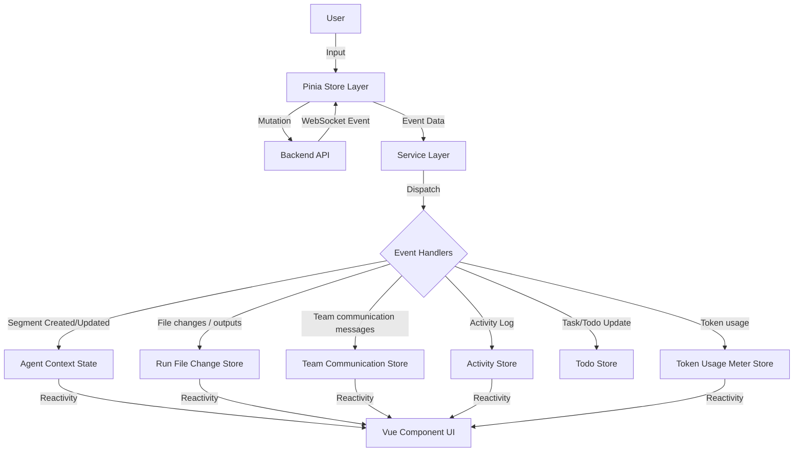

# Agent Execution Architecture

## Overview

This document outlines the end-to-end architecture of how Agent and Agent Team executions are managed in the frontend. The architecture has evolved to offload complex parsing to the backend. The frontend now acts as a **Renderer** of structured events rather than a parser of raw text.

The data flow follows a top-down approach:

1.  **Orchestration Layer (Stores)**: Manages lifecycle, user input, and WebSocket streaming connections.
2.  **Service Layer (Event Routing)**: Dispatches incoming structured WebSocket events to specific handlers.
3.  **Segment Processing (Handlers)**: Updates the reactive `AgentContext` and sidecar stores based on event payloads.

---

## Level 1: Orchestration Layer (Stores)

The Pinia stores act as the primary interface for the UI components to interact with the agent backend. They are responsible for initiating actions (Mutations) and listening for updates (WebSocket streams).

### `agentRunStore.ts` (Single Agents)

- **Role**: Manages the execution lifecycle of individual agents.
- **Key Actions**:
  - `sendUserInputAndSubscribe()`: After validation, immediately begins a local user submission by appending the user message, clearing the composer/staged context files, and setting `isSending`. For a new temporary run it calls `PrepareAgentRun` to create a durable prepared run identity without starting runtime, promotes the local context to that run id, finalizes attachments, opens the WebSocket stream, and sends `SEND_MESSAGE` with required `message_id` / `dedupe_key`. Existing inactive runs do not call `RestoreAgentRun` before send; backend `SEND_MESSAGE` owns restore/start/send lifecycle. Finalized attachment locators are reconciled onto the already-visible local message rather than appended as a duplicate. The visible lifecycle status remains backend-owned and comes from streamed `AGENT_STATUS` / `AGENT_COMMAND_ACK.status` payloads, not a frontend lifecycle placeholder.
  - `connectToAgentStream(runId)`: Listens for real-time events specific to an agent run via WebSocket. For standalone runs, connect attaches to a durable run identity and receives backend status projection without forcing runtime restore; the later `SEND_MESSAGE` command performs backend-owned activation/restore when needed.
  - `interruptGeneration()`: Sends the backend `INTERRUPT_GENERATION` control command without locally marking the run send-ready. `isSending` is cleared by backend lifecycle/status/error stream handling after the runtime has settled the active turn.
  - `terminateRun(runId)`: Sends backend `TerminateAgentRun` for persisted runs before local teardown, then disconnects the stream, marks the run inactive in history, and refreshes the history tree. Row-level terminate actions delegate here without selecting the row; follow-up chat recovery still uses the restore-aware send path rather than treating terminate as a local-only close.
  - `postToolExecutionApproval()`: Sends user decisions (Approve/Deny) for "Awaiting Approval" tool calls through the backend active-runtime approval command; it is not a restore or turn-starting operation.
  - `closeAgent()`: Cleans up local state and unsubscribes.

### `agentTeamRunStore.ts` (Agent Teams)

- **Role**: Manages multi-agent team sessions.
- **Key Actions**:
  - `createAndLaunchTeam()`: Orchestrates the creation of a new team run configuration and starts the session.
  - `launchExistingTeam()`: Resumes or starts a session from an existing team instance.
  - `connectToTeamStream(teamRunId)`: Listens for team-level events (e.g., server task-delegation lifecycle events, status changes, member events) via WebSocket.
  - `sendMessageToFocusedMember()`: Routes user input through `resolveTeamConversationTargetAddressResult(...)`, which returns a typed `ConversationTargetAddress` for backend routing and a separate local target key for composer, draft-attachment, and optimistic-message ownership. The address can target structural leaf members, structural subteams, task-agent executions, task-team roots, or members inside task-team executions by composing `member`, `task_team`, and `task_agent` segments from the focused projection. A new/all-offline team can still send its first message to a focused non-coordinator structural member, and a valid runtime projection can now receive ordinary chat without falling back to the structural template. Missing/stale focused targets or incomplete runtime identity fail validation instead of silently retargeting; the active-execution safety fallback remains reserved for task-agent-only logical-member conversations that should not receive ordinary user chat. After validation, the store immediately begins a local submission for the selected local target by appending the user message when a local leaf context exists, clearing that target's composer/staged context files, and setting `isSending`. Backend create/restore, attachment finalization, stream connection, and WebSocket send then continue; finalized attachment locators are reconciled onto the already-visible member message rather than appended as a duplicate. Frontend team chat emits `SEND_MESSAGE.conversation_target_address`; backend WebSocket `SEND_MESSAGE` provides the authoritative final recovery and target-validation boundary when the local resume cache is stale or absent, and streamed member/team status events remain the authority for visible `initializing`/`running` state.
  - `interruptGeneration()`: Sends the team `INTERRUPT_GENERATION` control command for the active team run/member selected by the same active-execution command focus as the shared composer, without locally clearing that member's `isSending` flag. The member becomes send-ready from backend lifecycle/status/error events, not from local interrupt-command dispatch.
  - `terminateTeamRun()`: Calls backend termination before local teardown for persisted teams. On success it disconnects the team stream, marks members shut down, marks run-history resume config inactive, and refreshes the history tree; on failure it leaves the active local team state intact.

### Stopped-Run Follow-Up Recovery

Single-agent and team follow-up chat share the same backend-owned recovery
principle, but the standalone runtime activation boundary is now the
`SEND_MESSAGE` command:

- frontend single-agent stores do not call `RestoreAgentRun` as a send precondition; team stores may still use the team restore/resolve path owned by the team container;
- standalone WebSocket connect can attach to an inactive durable run identity without restoring it, and standalone `SEND_MESSAGE` is the backend-owned recoverable command that publishes `initializing`, restores/activates, and forwards the message;
- team WebSocket connect and `SEND_MESSAGE` remain restore-aware through the team container, so follow-up chat can still recover stopped-but-persisted team runs when the frontend cache is stale, missing, or was updated after a local stop;
- accepted follow-up messages mark the run/team active in run history and refresh the history tree; and
- interrupt/tool-approval control messages are active-only and should not be used as implicit restore operations.

Tool approval controls use the selected active context only. Inline approval
buttons call the active context store, which routes to the single-agent or team
run store and emits `APPROVE_TOOL` / `DENY_TOOL` to the backend. The frontend
must not treat a click as local execution success, local denial finality beyond
the immediate requested command, or stopped-run recovery. Authoritative state
comes back through backend `TOOL_APPROVED`, `TOOL_DENIED`,
`TOOL_EXECUTION_*`, `ERROR`, and status/lifecycle projections; stale/no-active
or interrupted approval attempts remain backend-rejected control outcomes. A
visible tool row is not itself approval authority: approval buttons should be
shown only for `awaiting-approval` rows, and backend rejection remains
authoritative when a stale client attempts to approve an active-but-not-pending
tool invocation. For team streams, approval dispatch must use the structured
`ToolApprovalTarget` captured from the backend approval event, such as a member
route key/path. When the pending approval belongs to a delegated task-agent run,
the target must also carry the concrete `task_agent_run_id` emitted by the
backend so approval/denial routes to that task-scoped runtime rather than the
logical member template. When the pending approval belongs to a task-team scoped
child, the target must carry `task_team_run_id` plus the emitted
`task_team_relative_member_path` or `task_team_relative_member_route_key`; a
nested task-agent approval can also carry `task_agent_run_id` as the concrete
child-run guard. The frontend must not rebuild approval targets from the current
focused member, scalar aliases, or invocation-id fallbacks after focus changes.

Interrupt dispatch is intentionally not a local completion event. The frontend must
keep the affected single run or focused team member in its current sending
state until `TURN_COMPLETED`, `AGENT_STATUS`, or `ERROR` stream handling clears
that state. This keeps the primary input from advertising follow-up readiness
before provider runtimes such as Claude Agent SDK have settled interrupted
query/process resources.

### Runtime Status And Interrupt Authority

The frontend runtime status model is intentionally coarse:

- single-agent and team status enums expose `offline`, `initializing`, `idle`, `running`, and `error`;
- single-agent `AGENT_STATUS` payloads are
  `{ status: "offline" | "initializing" | "idle" | "running" | "error", can_interrupt: boolean, agent_id?, agent_name? }`;
- aggregate `TEAM_STATUS` payloads are `{ status: "offline" | "initializing" | "idle" | "running" | "error" }`;
- team member interrupt authority comes from the selected member's most recent
  `AGENT_STATUS.can_interrupt` value, not from aggregate `TEAM_STATUS`; and
- legacy transition-field names and detailed runtime
  phases such as `bootstrapping`, `awaiting_llm_response`, or `executing_tool`
  are not part of the frontend WebSocket status contract.

Runtime adapters may still use richer provider/native status internally. The
server boundary projects those details into the coarse API status and computes
`can_interrupt` from the runtime-owned active-turn/snapshot source. `isSending`
remains a local submit-flight and disabled-input signal only; it must not be
used to show the stop button or to infer that an interrupt can be accepted.
When the backend accepts a standalone `SEND_MESSAGE` command for an inactive or
prepared run identity, `AgentRunCommandCoordinator` is responsible for
publishing non-interruptible `initializing` before slow restore/start/activation
work; the frontend displays that streamed status or `AGENT_COMMAND_ACK.status`
instead of inventing a lifecycle placeholder. Restored runtime readiness or a
restored status snapshot is not a frontend-visible replacement for this
overlay; keep showing backend `initializing` until command-correlated
`TURN_STARTED`, `AGENT_STATUS`, terminal/error, or coordinator failure evidence
arrives. When the backend accepts a
focused team-member command for an `offline` or `idle` member, the team backend
publishes member-scoped non-interruptible `initializing` before slow member
startup/send work.
Startup tokens such as `bootstrapping`, `starting`, `startup`, `initializing`,
and active `uninitialized` project as active non-interruptible
`initializing`; they keep send readiness blocked without granting the red
interrupt affordance. Active processing/tool/LLM tokens project as `running`.
When the selected context is a team, text send and stop/interrupt dispatch use
separate target resolvers. Text send uses the conversation-target address
resolver so a valid roster-focused offline member, structural subteam, or
runtime task projection can receive ordinary chat through a typed
`ConversationTargetAddress`; stop/interrupt dispatch resolves the
active-execution command member at click time. That interrupt command member can
intentionally differ from roster/history visual focus: for example, an
all-offline historical team row can show `api_e2e_engineer` in the focus pane
while interrupt safety remains on the active-execution command target. The
frontend sends team
`INTERRUPT_GENERATION` with
`target_member_route_key` set to the active-execution command member route key
and `target_member_run_id` set only as an optional member run-id guard. If there
is no command-eligible focused leaf member, the focused context is stale, or no
active team streaming service exists, the frontend must not send a team
interrupt command.
Run-history refresh, active recovery, and run-open hydration must preserve an
already-live `initializing/canInterrupt=false` or `running/canInterrupt=true`
single run or focused team member while that live stream remains authoritative,
but terminal `offline` or `error` history projections must clear stale
`canInterrupt` even when a caller asks to preserve live interrupt state. A later live
`AGENT_STATUS { status: "idle", can_interrupt: false }` likewise revokes the
browser-visible stop affordance.

Active team recovery and refresh must keep aggregate and member status separate.
If a team row is `running` or `initializing` but only one member has a
member-scoped active history/snapshot/event, the other members must stay at
their own member-scoped status, or default to `offline/canInterrupt=false`
until a member `AGENT_STATUS` arrives. Frontend reconciliation must never fan
out aggregate team `running` or `initializing` state to every member row.
Delegated task executions are task-scoped transient child entities rather than
structural team topology. When team stream payloads carry explicit task-agent
identity (`execution_kind: "task_agent"`, `task_agent_instance_id`,
`task_agent_run_id`, `task_id`) plus logical member metadata (`member_path` /
`member_route_key` and `source_path` / `source_route_key`),
`TeamStreamingService` creates a temporary task-agent context/node keyed by the
task-agent run id. When payloads carry task-team identity
(`execution_kind: "task_team"`, `task_team_instance_id`, `task_team_run_id`,
`task_id`, `team_path`, and `team_route_key`), the service creates a temporary
task-team root node distinct from the structural `agent_team` member. Events
inside that task-team child run must carry `task_team_run_id` plus
`task_team_relative_member_path` or `task_team_relative_member_route_key`; the
frontend clones scoped child member nodes/contexts under the task-team root and
drops task-team scoped events that lack a task-team run id instead of guessing
from the structural route.

Delegated task visibility is intentionally split across two surfaces. The
global Workspaces/run-history tree owns live execution identity and hierarchy:
it composes stable history rows with pure renderer-only transient display rows
from `AgentTeamContext.memberTree`, keeps durable members visually solid, and
renders task-agent, task-team root, and task-team child executions inline with
explicit transient row kinds. A transient row has a light ghost background and
exactly one visible transient marker in the leading status-dot slot: an
explicit eight-dot SVG ring (`h-2.5 w-2.5`) whose eight `currentColor` circles
preserve status color semantics. It must not use the superseded CSS dotted-border
or dashed-stroke marker treatments, add a second dotted initials/avatar marker,
add a trailing marker, or show visible `Temp` / `Temporary` copy in the row body.
Selecting either a stable or transient Workspaces row uses the existing
team-member focus path and route-key identity. The right-side Team tab owns task
detail/content through its Active Tasks section; it is not the primary execution
hierarchy or status surface.

`TeamOverviewPanel` owns the local Messages/Tasks accordion state. Messages
remains the default for a selected team run with no active task entries, but the
panel opens Tasks automatically when the selected team run already has active
task entries or when a new active-task identity appears while the same run is
mounted. The auto-open signature is derived from the same
`deriveActiveTaskEntries(...)` entries consumed by `TeamActiveTasksSection`,
keyed by task kind, member route, task id, and execution run id, so unrelated
messages or refreshes do not open Tasks. A user may still collapse Tasks for the
same task set; the panel reopens only for a different active-task signature or a
selected-run change to a run that has active tasks. When the selected team run
changes and there are no active tasks, the panel opens Messages.
`TeamActiveTasksSection` derives task-agent and task-team entries from the
transient projection nodes in `AgentTeamContext`, owns the Team-tab split layout
and section-local task/reference selection, and renders a task-detail navigator
plus detail pane.

Inside that section, `TeamActiveTaskNavigator` renders task-content navigation
only: clean text task summaries without a leading status dot or visible status
label, task-owned reference rows with visible selected state and no separate
visible `References` heading, and collapsed Technical details for task type,
task id, execution run id, target metadata, and raw task arguments. Summary and
reference clicks update only the section-local task/reference detail selection;
they must not focus the center conversation/composer, replace it with a task
team card, or repeat the Workspaces execution hierarchy. It must not render
responsible actor/member hierarchy rows, `Focus agent` / `Focus team` controls,
approval controls, leading summary status dots, or visible summary status copy
such as `ACTIVE` / `RUNNING`.
`TeamActiveTaskDetailPane` is content/reference-only: it renders the selected
task body or selected task-owned reference preview and intentionally does not
duplicate the actor/team heading, status chip, waiting notice, focus controls,
actor/member roster, reference list, or Technical details in the right pane.

The global Workspaces/run-history tree remains the navigation and execution-focus
surface for workspaces, runs, teams, durable members, and live transient
execution identities. It may reuse the shared status-dot presentation for
workspace rows and stable member rows, but transient task executions must remain
display-row projections rather than ordinary durable `TeamMemberTreeRow` history
rows. Transient task-team roots with child rows are collapsed by default; their
user-controlled disclosure state is keyed by the transient execution row identity
so simultaneous task-team executions do not accidentally share expansion state.
Workspaces must not render active-task summary blocks, task reference rows, raw
task arguments, approval controls, or active-task Technical details. Tasks is not
an approval action surface: pending approval can appear only as non-actionable
task context or technical metadata there, and Activity remains the owner for
Approve/Deny controls and approval command routing. Task reference files come
from task-delegation event metadata and open in the Tasks right pane through the
task-owned reference route; Messages remains message-owned and its
content/reference UX is not routed through task identity.
The center workspace remains the focused conversation/event/composer surface and
must not render `TeamActiveTaskExecutionsBar` or any replacement center list.

Running and awaiting-acceptance task executions must remain visible as
Workspaces transient identity rows and as Team → Active Tasks detail entries
after active team reopen/hydration, even when server resume metadata only lists
stable logical coordinator/member rows. Run-open hydration therefore restores
concrete task executions from live projection/identity instead of collapsing them
into the logical member or team parent.
Stream routing is projection-first: task-team root/scoped child identity wins before
task-agent identity, then exact logical route/path identity, then compatible
run-id fallback. The frontend must not recreate the removed `isTaskAgentRunId`
generated-run-id heuristic or any other run-id-format parser as a routing
authority. After delegator acceptance and backend settlement or offline cleanup,
the frontend removes the transient task execution root, scoped children, and
nested task-agent projections while preserving the structural member/team
topology and the history that records the delegated task completion.

When a single-agent run is terminated successfully, the backend publishes
`AGENT_STATUS { status: "offline", can_interrupt: false }` to the already-open
stream before teardown. Frontend live state and history merge logic should treat
`offline` as the canonical inactive non-error terminal state instead of waiting
for a socket close or a later history reload to infer that transition.

### Compaction Lifecycle Activity And Center Feed

Native AutoByteus memory compaction status is projected as Activity lifecycle
state first. The right-side Activity panel should retain the full compaction
operation identity and phase progression, including requested/queued,
execution, terminal success/failure, timestamps, and surrounding tool-result
detail. That lifecycle row is diagnostic/runtime feedback; it must not become
LLM-facing text and must not replace the backend memory artifact contract.

The center conversation feed is narrower. Requested/queued compaction phases are
internal scheduling states and stay out of the center feed so a pending
tool-call turn is not split before tool results arrive. The first
center-eligible execution phase for a compaction operation marks the current
frontend assistant visual block complete, allowing the `Memory compacted` row to
appear after the tool-call/result block and before the post-compaction assistant
continuation. Completed/failed execution rows may be shown in the center feed;
requested/queued rows must not.

Historical run reopen uses the backend replay bundle as the display source for
actual user, assistant, reasoning, and tool trace content. Native compaction
projection cards are intentionally live-only center feedback in this slice:
reopened historical conversations should replay the real work trace from active
plus archived raw traces and should not synthesize center compaction cards from
compaction lifecycle/status entries.

### Run Reopen Projection Hydration

Run-history reopen consumes a backend replay bundle with sibling
`conversation` and `activities` projections. Frontend open coordinators must
apply those siblings together when replacing from projection, or preserve both
existing live surfaces when an already-subscribed live context is kept. They
must not hydrate projected Activity rows into a context whose live conversation
is being preserved, because that can create right-pane-only tool entries after
restart. For active team reopen, projected Activity hydration is limited to
newly materialized member contexts whose projected conversation is also being
applied.

### Workspace History Row Titles

Workspace history rows render `RunTreeRow.summary` as the visible one-line task
title. For standalone agent runs that title should represent the initial
non-empty user message, not the latest follow-up. When the history tree is
merged with live single-agent contexts, `mergeRunTreeWithLiveContexts(...)`
overlays active status and the live context's activity timestamp while using the
live conversation's first non-empty user message as the row summary when
available. Persisted standalone and team history rows arrive from GraphQL with
`createdAt` plus derived live status fields, not durable `lastActivityAt`,
`lastKnownStatus`, or delete-lifecycle fields. The frontend read model maps
`createdAt` into the shared tree sort field for stored rows and derives local
team-tree `lastActivityAt` / `lastKnownStatus` / delete readiness from V2
catalog facts plus live status. This prevents an active persisted row with a
stale latest-message summary from overriding the known initial-message title in
the sidebar while keeping backend history catalogs out of live-status storage.

If no live first-user-message summary is available, the frontend keeps the
backend-provided history summary. Team row title behavior remains owned by the
team-history path and is not reinterpreted by the standalone live-context
overlay.

### Workspace History Progressive Disclosure

The Workspaces sidebar history tree uses progressive disclosure for its
ordinary desktop render. `WorkspaceAgentRunsTreePanel.vue` wires the tree state
from `useWorkspaceHistoryTreeState(...)`, and
`WorkspaceHistoryWorkspaceSection.vue` renders only the visible level for the
current expansion state.

- Top-level workspace rows come from `workspaceStore.allWorkspaces`, which is
  loaded from the backend `workspaces()` query and its registered/visible
  workspace list. The run-history read model accepts registered filesystem
  workspaces and the fixed default temp workspace (`temp_ws_default`) as run
  workspace descriptors, ignores unrelated transient descriptors such as skill
  workspaces, and does not let history-only roots for unregistered or removed
  workspaces create desktop top-level rows.
- If multiple visible descriptors resolve to the same normalized root, the tree
  renders one workspace row for that root. The fixed temp descriptor wins over a
  same-root filesystem descriptor so the default temp workspace stays
  non-removable.
- Workspace rows default collapsed, so the initial tree shows workspace names
  only.
- Expanding a workspace calls the workspace-scoped history path for that
  workspace id and reveals the next-level standalone-agent groups and
  team-definition groups for that visible workspace. Registered filesystem ids
  resolve through the backend workspace registry; `temp_ws_default` resolves
  through the temp workspace lifecycle.
- Local standalone run rows are projected under their visible workspace
  descriptor even after a draft run is promoted from a `temp-...` id to its
  permanent run id, then deduplicated when backend history catches up. Local
  draft/live rows without a matching visible workspace descriptor are ignored
  instead of creating their own top-level workspace.
- Standalone run rows and team-run rows stay collapsed until the user expands
  the specific agent group or team-definition group.
- Team-definition group rows and individual team-run rows use the same compact
  standalone chevron size, shape, and gray color. The row button remains the
  single interaction boundary, and team-run rows expose `aria-expanded` so
  visual, keyboard, and assistive-technology state stay in sync.
- Manual workspace, agent-group, team-definition-group, team-run, and nested
  team-member/subteam expansion choices are kept in component-local tree state
  and are not reset by quiet history refreshes while the history panel remains
  mounted.
- Newly added workspaces are explicitly opened after creation so the add flow
  still lands the user in the workspace they just created.
- Quiet refreshes update already-loaded workspace history without falling back
  to a global history fetch that can mark unrelated active contexts offline.

When an existing run or team run is selected before its history ancestry is
visible, `useWorkspaceHistoryTreeState(...)` performs a one-shot selected-path
reveal. The reveal expands only the selected run/team's workspace and containing
agent or team-definition group, and for selected team runs opens the matching
team-run row. After the selected path has been revealed for the stable selection
key, later quiet refreshes must not reopen the same path if the user manually
collapses it. When a user opens/selects a team run that has a focused nested
member, or selects a nested member row directly,
`useWorkspaceHistorySelectionActions(...)` asks
`useWorkspaceHistoryTreeState(...)` to expand only the subteam ancestors
needed to keep that nested focus visible.

For team-run member rows, selection state uses roster/history visual focus, not
active-execution command focus. The Workspace history tree renders recursive
`memberTree` structure when available, with `team.members` only as the flat
fallback. Nested `agent_team` member rows appear as subteam rows with a Team
badge and their own disclosure control; they are collapsed by default, expand
children recursively with indentation, and the disclosure toggles children
without selecting the row body. Clicking a member or subteam row whose route key
exists in the team's `memberTree` should keep that route key selected in the
history tree and Focus display even when the member is offline or has no active
runtime context. Live/hydrated team-context merges must preserve the persisted
history row's workspace grouping and use this roster focus for selected-row
highlighting; the shared composer remains active-execution-owned separately.

### Workspace Removal From The Sidebar

`WorkspaceHistoryWorkspaceSection.vue` exposes a row-specific **Remove from Workspaces** action for removable filesystem workspace rows. The action is associated with the exact workspace row, is available through hover/focus/touch-visible affordances, and does not toggle row expansion when clicked. Temp workspace rows, including `temp_ws_default`, are visible run workspaces but are not removable and must not render this action.

Removal always asks for confirmation and uses non-destructive copy: workspace files, memories, artifacts, and stored run/team history are not deleted. On confirm, `workspaceStore.removeWorkspace(workspaceId)` calls the backend `removeWorkspace` mutation. Successful removal unregisters the workspace, removes the row immediately, prunes cached workspace history and expansion state, clears selected run/team rows that belonged to the removed workspace, and clears file-explorer metadata/live state for that workspace. Failed removal leaves the row and selection intact and shows the backend error. Active standalone or team runs block removal until the user stops active work.

Re-adding or loading the same root later restores the same deterministic workspace id and lets the preserved history for that root appear again when the workspace is expanded. Temporary draft rows, archive actions, permanent history delete actions, and transient skill/temp workspace cleanup remain separate flows.

### Workspace History Archive And Delete Actions

`components/workspace/history/WorkspaceAgentRunsTreePanel.vue` owns the
workspace history tree wiring and delegates row rendering to
`WorkspaceHistoryWorkspaceSection.vue`. The row actions intentionally keep
archive, termination, draft removal, and permanent delete separate:

- active standalone runs and active team runs expose stop/terminate actions, not
  archive;
- temporary draft rows use local remove/discard behavior and are not sent to the
  archive API;
- inactive persisted standalone runs call `runHistoryStore.archiveRun(runId)`,
  which uses the backend `archiveStoredRun` mutation; and
- inactive persisted team runs call `runHistoryStore.archiveTeamRun(teamRunId)`,
  which uses the backend `archiveStoredTeamRun` mutation.

Successful archive removes the row from the current default history tree,
clears selected/open local context for the hidden run or team when applicable,
and refreshes history from the backend. Failed archive leaves the visible tree
and current selection unchanged and reports the error. The destructive delete
affordance remains separate and continues to use the existing permanent-delete
confirmation path for users who intend to remove stored memory. There is
currently no archived-history browser or unarchive UI in this frontend slice.

### Uploaded Context Attachment Orchestration

Browser-uploaded composer files now follow the same high-level orchestration pattern across single-agent, team, and application-backed conversations:

1. UI surfaces work against the shared discriminated attachment model (`workspace_path`, `uploaded`, `external_url`) instead of raw path strings.
2. `ContextFileUploadStore` owns upload, delete, and finalize transport. It stages browser uploads under an explicit draft owner and returns descriptors that keep `storedFilename` separate from the user-visible `displayName`.
3. Shared UI helpers (`useContextAttachmentComposer` and `contextAttachmentPresentation`) own attachment-list mutation, display-label rendering, preview/open behavior, and pending-upload coordination so individual components do not parse locators themselves.
4. Send stores begin the local user submission immediately after validation, then create or restore the final run/team identity, call `/context-files/finalize` with `attachments[{ storedFilename, displayName }]`, and replace draft uploaded descriptors with final run/member locators on the already-visible local message before runtime send.
5. The stable `storedFilename` remains the attachment identity key while `displayName` preserves the original uploaded filename even when the stored path has been sanitized.

This separation keeps draft attachment transport concerns out of UI components and keeps runtime consumers dependent only on finalized run-scoped attachment locators.

### Editable Run Workspace Selection

For editable single-agent and team launches,
`components/workspace/config/WorkspaceSelector.vue` is continuous launch input,
not a separate workspace-loading step. Existing mode emits the selected visible
workspace id immediately. New mode keeps only a pending absolute path and emits
that pending path to `RunConfigPanel.vue`; it does not render a user-facing
**Load** button, pressing Enter in the path input does not preload the
workspace, and the helper copy must indicate that the path will be loaded when
the user runs the agent or team.

`RunConfigPanel.vue` owns the submit boundary. When the selector is in New mode
with a non-empty pending path, **Run Agent** / **Run Team** first calls the
workspace creation/registration path, updates the active launch config with the
registered workspace metadata, and only then creates the local standalone or
team run. The pending New path takes precedence over any previously selected
workspace. If registration fails or the New path is blank, no run is created and
the workspace error is shown in the config panel. While this submit-time load is
in progress, duplicate run clicks are blocked; the Run button is otherwise
allowed to be enabled before any explicit preload when the pending path and the
rest of the launch config are valid.

### Existing Run Configuration Inspection

`components/workspace/config/RunConfigPanel.vue` is the frontend boundary between
editable new-run launch configuration and inspect-only configuration for an
already selected run. When `selectionStore.selectedRunId` is present, the panel
passes read-only mode to the agent/team configuration forms instead of treating
the selected run's config as a launch buffer.

Selected existing single-agent and team run configuration is intentionally
inspect-only:

- runtime, model, workspace, auto-approve, skill-access, and team-member
  override controls render disabled;
- form update handlers and shared runtime/model normalization emissions no-op in
  read-only mode so historical context is not locally mutated;
- the launch/run button is absent while an existing run is selected;
- localized read-only notices explain that the selected run can be inspected but
  not edited; and
- advanced model/thinking controls remain visible or expandable so persisted
  values such as backend-provided `reasoning_effort: "xhigh"` can be inspected.

The frontend consumes historical model configuration exactly as provided by the
backend. If the backend-provided `llmConfig` is missing/null, the model config UI
may show a localized `Not recorded for this historical run` state, but it must
not infer a current default, recover a runtime value, or materialize metadata.
Backend/runtime/history recovery or persistence semantics belong to a separate
backend ticket, not this frontend inspection boundary.

The model-config surface is schema-driven, not thinking-only. It renders
explicit `llmConfig` values first and valid schema defaults second; showing a
default does not write that value into the launch buffer. The top-level
**Thinking** state is computed from provider schema keys such as
`reasoning_effort`, `thinking_enabled`, `thinking_type`, `thinking_level`, and
`include_thoughts`, not from model/display names. If a schema-backed model has
reasoning enabled by default but no supported off value, the UI can show
**Thinking** on in a non-disable-capable state instead of emitting an unsupported
off payload.

Editable primary/global agent and team launch config initializes **Advanced**
from effective **Thinking** state. Effective **Thinking** ON opens **Advanced**
by default so users can see defaults such as Codex `reasoning_effort: "medium"`
or DeepSeek `reasoning_effort: "high"`. Launch-edit surfaces explicitly opt in
to provider-aware Thinking defaulting: when a schema supports Thinking and no
explicit persisted thinking state exists, desktop agent launch, team defaults,
mobile launch, and member override model-config surfaces default Thinking ON.
Explicit OFF/current states remain authoritative, and read-only, disabled, or
missing historical configs do not emit default mutations. Team defaults use flat advanced display so lower fields such
as **Reasoning Effort** and **Fast mode** are visible under **Thinking** without
an **Advanced** disclosure. Toggling a supported **Thinking** control ON opens
**Advanced** automatically for non-flat callers; toggling OFF after inspection
does not force-collapse the section. Fixed or non-disable-capable Thinking states
are displayed as neutral disabled rows rather than highlighted enabled switches,
and schemas with no Thinking support render no Thinking row.

Compact member override rows may stay collapsed to avoid expanding large team
forms. Collapsed default rows show `Using team defaults` without a redundant
`No member overrides` chip, and expanded/focused styling applies to the whole
card. They still display inherited/effective defaults when expanded, but member
override model-config sections flatten simple non-thinking advanced fields under
**Thinking** instead of requiring a separate **Advanced** disclosure. Display-only
inherited or schema-default values must not create member overrides. When no
editable model-config schema is available for the effective member model, the row
renders explicit unavailable/no-options copy rather than a title-only section.
Non-thinking runtime/model parameters render through the same advanced schema
component; for Codex, a fast-capable model can therefore expose `service_tier`
with the user-facing label **Fast mode** beside reasoning settings.

### Self-Evolution Manual Composer Action

Self-evolution is current-target owned, not definition-owned and not
launch-config owned. Frontend run-config types no longer carry `selfEvolution`
overrides for standalone runs, team runs, or team agent-member launch records,
and the backend no longer snapshots `selfEvolutionEffective` into run/member
metadata for new runs. Agent/team definition forms and persisted definition
defaults must not add `selfEvolution`.

The visible launch forms do not expose self-evolution eligibility controls. The
only user-facing manual start entrypoint is the concise composer-adjacent **Self
improve** CTA for the selected active standalone run or team member. That CTA is
hidden when the global capability is disabled, hidden for Skill Self-Evolver
companion runs, and lazy-loads backend eligibility before rendering. The UI must
not show technical backend ineligibility reasons in chat and must not recompute
eligibility from current definitions or local skill lists.

`useSelfEvolutionCapabilityStore` owns the global typed capability query/mutation
for `ENABLE_SELF_EVOLUTION`. `useSelfEvolutionStore` owns backend eligibility and
manual start calls. Run-history rows do not expose self-evolution controls.
Starting self-evolution from the composer CTA calls `startAgentRunSelfEvolution`
or `startTeamMemberSelfEvolution` without run-time overrides. The backend uses
current global self-evolution settings, current target state, and current
configured writable skill roots; it first ensures work trace files are current
for the selected target, then activates or reuses a visible target-scoped
companion `AgentRun`. The returned record summary is stored only internally and
the UI may show at most a short transient toast/status after start. It must not
render a persistent composer card, evolution record id, or companion-run
navigation button.

Meaningful completion communication is helper-authored only after durable skill
package file changes: the visible companion may call `send_message_to` once with
`message_type: "skill_update"`, the exact active target run id supplied by the
backend, concise content explaining what changed, why it matters, and how the
target should use or reload the updated guidance, plus dynamic references as
absolute paths to changed or directly relevant surviving files inside editable
roots. The backend records whether that direct outcome was sent, rejected,
target-inactive, or not attempted. The skill update message is separate from any
runtime/model skill-refresh instruction, and team-member live reload remains
next-run-only in the MVP. The MVP does not expose a metrics/reporting query and
the UI must not imply companion completion proves downstream improvement.

### New Run From Existing Run

When the user clicks the workspace header add/new-run action while an existing
single-agent or team run is selected, the frontend treats that selected run as a
launch template for the new editable draft. The selected run itself remains
inspect-only, but the editable launch buffer is seeded from a deep-cloned copy of
the selected run config, including runtime kind, model identifier, workspace,
auto-approve/skill-access settings, `llmConfig`, and team member overrides.

That source-copy path must preserve backend-provided model-thinking fields such
as `reasoning_effort: "xhigh"` even when the runtime model catalog is still
loading. Schema arrival may sanitize invalid model-config keys after a real
schema is available, but an empty/loading schema must not clear the copied
`llmConfig`. Explicit user runtime/model changes remain the owner for stale
model-config cleanup.

Schema arrival is also the cleanup boundary for runtime-specific non-thinking
parameters. For example, when a copied or default Codex config contains
`service_tier: "fast"` and the user switches to a model whose active schema does
not include `service_tier`, the stale key is removed before launch.

If there is no selected same-definition source run, workspace add/new-run flows
fall back to the existing definition/default launch preferences instead of
inventing historical config.

---

## Level 2: Service Layer (Event Routing)

The service layer bridges the gap between the WebSocket transport and the application's business logic. It essentially functions as a router.

### `AgentStreamingService.ts`

- **Role**: WebSocket facade for single-agent streams.
- **Responsibilities**:
  1.  Maintains the WebSocket connection (`transport/WebSocketClient`).
  2.  Parses raw JSON messages into typed `ServerMessage` objects (`protocol/messageTypes`).
  3.  Dispatches messages to the appropriate pure-function handler.

### Dispatch Logic

Incoming events are routed based on their `type`:

| Event Type                | Handler Function                                   | Purpose                                                         |
| :------------------------ | :------------------------------------------------- | :-------------------------------------------------------------- |
| `SEGMENT_START`           | `segmentHandler.handleSegmentStart`                | Creates or merges a transcript UI segment (Text, Code, Tool) and seeds/hydrates a pending Activity row for eligible displayable tool segments. |
| `SEGMENT_CONTENT`         | `segmentHandler.handleSegmentContent`              | Appends streaming content (deltas) to an existing segment.      |
| `SEGMENT_END`             | `segmentHandler.handleSegmentEnd`                  | Finalizes transcript segment state/metadata, including interrupted/failed terminalization, and hydrates the matching Activity row without inventing execution success. |
| `TURN_STARTED`            | inline lifecycle handling                          | Marks a new turn boundary in the protocol; current clients treat it as an observable lifecycle checkpoint. |
| `TURN_COMPLETED`          | `agentStatusHandler.handleTurnCompleted`           | Marks the current AI message complete for that turn without waiting only for idle inference. |
| `AGENT_STATUS`            | `agentStatusHandler.handleAgentStatus`             | Updates run/member status (`offline`, `initializing`, `idle`, `running`, or `error`) and backend-owned `can_interrupt`; no legacy transition-field names. Team payloads with explicit task-agent or task-team identity update the transient task execution projection and remove it after terminal cleanup; projection routing must not depend on generated run-id patterns or structural team names alone. |
| `AGENT_COMMAND_ACK`       | inline command acknowledgement handling            | Confirms standalone `SEND_MESSAGE` command acceptance/duplicate/rejection/failure and applies the included backend status payload; rejected/failed commands flow to the normal error handler. |
| `TEAM_STATUS`             | team streaming aggregate handling                  | Updates aggregate team status (`offline`, `initializing`, `idle`, `running`, or `error`) only; member interrupt authority still comes from member `AGENT_STATUS`. |
| `COMPACTION_STATUS`       | `agentStatusHandler.handleCompactionStatus`        | Normalizes compaction lifecycle payloads into latest run state plus `kind: 'compaction'` activity rows (`requested`, `started`, `completed`, `failed`). |
| `ASSISTANT_COMPLETE`      | `agentStatusHandler.handleAssistantComplete`       | Legacy completion signal that still marks the current AI message complete. |
| `ERROR`                   | `agentStatusHandler.handleError`                   | Surfaces unrecoverable agent/runtime errors into the conversation and terminalizes still-open tool-like rows as errors. |
| `TOOL_APPROVAL_REQUESTED` | `toolLifecycleHandler.handleToolApprovalRequested` | Sets segment status to `awaiting-approval`; task-agent approval payloads retain concrete task-agent run id and logical member route/path, while task-team scoped approvals retain task-team run id plus relative child selector for card-level approve/deny routing. |
| `TOOL_APPROVED`           | `toolLifecycleHandler.handleToolApproved`          | Marks invocation as approved before execution starts.           |
| `TOOL_DENIED`             | `toolLifecycleHandler.handleToolDenied`            | Marks invocation as terminal denied immediately.                |
| `TOOL_EXECUTION_STARTED`  | `toolLifecycleHandler.handleToolExecutionStarted`  | Sets segment status to `executing`.                            |
| `TOOL_EXECUTION_SUCCEEDED`| `toolLifecycleHandler.handleToolExecutionSucceeded`| Sets terminal `success` + stores result payload; hydrates arguments when the terminal payload carries them. |
| `TOOL_EXECUTION_FAILED`   | `toolLifecycleHandler.handleToolExecutionFailed`   | Sets terminal `error` + stores failure details; hydrates arguments when the terminal payload carries them. |
| `TOOL_LOG`                | `toolLifecycleHandler.handleToolLog`               | Appends diagnostic execution logs only.                         |
| `ARTIFACT_PERSISTED`      | inline no-op compatibility                         | Ignored by the current client; published artifacts are not displayed in the current web UI. |
| `FILE_CHANGE`             | `fileChangeHandler.handleFileChange`        | Syncs touched files and generated outputs into the run-scoped Agent Artifact store. |
| `EXTERNAL_USER_MESSAGE`   | `externalUserMessageHandler.handleExternalUserMessage` | Inserts or updates a user/input row for true external-channel ingress by backend `message_id` / `dedupe_key`. It remains external-channel-specific; repeated rows with no identity remain separate. |
| `MEMBER_INPUT_MESSAGE`    | `memberInputMessageHandler.handleMemberInputMessage` | Inserts or updates an accepted team/member input row by backend `message_id` / `dedupe_key`, including local team sends and parent-to-subteam delivery prompts in the target leaf transcript before assistant output. Deduped local submissions preserve existing non-empty `contextFilePaths` when a lower-fidelity echo omits attachments, while incoming non-empty context-file locators update the row. |
| `INTER_AGENT_MESSAGE`      | `teamHandler.handleInterAgentMessage`       | Preserves existing conversation rendering only. |
| `TEAM_COMMUNICATION_MESSAGE`| `teamHandler.handleTeamCommunicationMessage` | Upserts normalized Team Communication messages and child reference files into the Team Communication store. |
| `TODO_LIST_UPDATE`        | `todoHandler.handleTodoListUpdate`                 | Syncs the agent's internal todo list with the UI.               |
| `TOKEN_USAGE_UPDATED`    | `tokenUsageHandler.handleTokenUsageUpdated`        | Applies server-accounted token/cost deltas to `tokenUsageMeterStore`; the frontend does not compute authoritative accounting or pricing. |

---

## Level 3: Segment Processing & State Management

Unlike the previous architecture, the frontend **does not** parse raw text/XML tags. The backend is responsible for all parsing and sends "Segments" as its primary unit of communication.

### Segment Handlers (`services/agentStreaming/handlers`)

These handlers are pure functions that take a payload and an `AgentContext`, and mutate the context.

#### `segmentHandler.ts`

- **`handleSegmentStart`**: Finds the current AI message (or creates one) and pushes/merges a new Segment object (e.g., `ToolCallSegment`, `WriteFileSegment`) for transcript structure. When that segment is an eligible displayable tool invocation with a stable invocation id and tool identity, it delegates to `toolActivityProjection.ts` to seed or hydrate the matching pending Activity row. File-change sidecar state is still not inferred here; the backend emits dedicated `FILE_CHANGE` events for the Artifacts experience.
- **`handleSegmentContent`**: Finds the segment by backend-provided `segment_type` + `id` and appends string deltas. This powers the "typewriter" effect. The frontend intentionally trusts that identity contract; provider adapters must emit different ids for distinct text blocks that belong on different sides of tool cards instead of relying on frontend runtime-specific reorder logic.
- **`handleSegmentEnd`**: Performs transcript cleanup, sets the final tool name if it was streamed lazily, preserves final metadata such as arguments, and marks the segment as "parsed" (ready for execution state changes). When the backend sends `interrupted` or `failed` terminal metadata, it marks the segment/tool row terminal (`interrupted` or `error`) and stores the reason/error instead of leaving a spinner. It also delegates segment metadata hydration to `toolActivityProjection.ts`; lifecycle events remain authoritative for successful execution and terminal result/error state.

#### `toolLifecycleHandler.ts`

- Routes explicit lifecycle events through dedicated parse/state modules.
- Enforces normal non-terminal progress while allowing provider order where `TOOL_EXECUTION_STARTED` can arrive before `TOOL_APPROVAL_REQUESTED`; in that case `awaiting-approval` remains the active UI state until approval/denial/terminal events arrive.
- Enforces terminal precedence: `success` / `error` / `denied` are terminal and cannot be regressed by later non-terminal events or logs.
- Hydrates arguments from lifecycle payloads. `TOOL_APPROVAL_REQUESTED` and `TOOL_EXECUTION_STARTED` are the primary sources; `TOOL_EXECUTION_SUCCEEDED` and `TOOL_EXECUTION_FAILED` may also carry arguments as a defensive result-first recovery path for runtimes whose start event is missed or arrives out of order.
- Owns lifecycle state transitions and delegates Activity projection to `toolActivityProjection.ts`. Lifecycle events create the row if no segment has seeded it yet, and otherwise update the same Activity row by exact invocation id only.

#### `toolActivityProjection.ts`

- Owns the shared live Activity projection policy used by both segment and lifecycle handlers.
- Seeds pending/running Activity visibility from eligible tool-like `SEGMENT_START` payloads so the right-side Activity panel appears when the middle tool card appears.
- Deduplicates segment-first and lifecycle-first paths by exact invocation id only, merges arguments and tool names, projects logs/result/error updates, and preserves terminal status precedence.
- Treats backend/provider invocation ids as opaque identity tokens for distinct tool calls. Colon suffixes are never stripped or aliased by frontend projection: provider-generated ordinals such as `run_bash:0`, `run_bash:1`, semantic-looking suffixes such as `call_1:write_file`, and approval metadata suffixes such as `call_1:approval-1` are distinct ids unless the backend emits the same canonical id on every related event. Producer adapters must keep approval ids and other provider metadata out of public `invocation_id`.
- Skips placeholder or missing generic tool names to avoid noisy blank Activity rows.

### Sidecar Store Pattern

A key architectural pattern is the **Sidecar Store Pattern** for runtime data. Instead of keeping all state in a monolithic `AgentContext` (which is optimized for Chat UI), distinct data streams are routed to dedicated stores:

1.  **Run File Changes (`RunFileChangesStore`)**:
    - Listens to `FILE_CHANGE` plus reopen hydration from `getRunFileChanges(runId)`.
    - Owns the run-scoped projection for touched files and generated outputs.
    - Tracks latest-visible discoverability so desktop and mobile Artifacts surfaces can select/refresh the newest row after the user opens them, without stealing focus from other tabs.
    - Keeps transient `write_file` buffers only until committed previews are fetched from the server-backed run preview route.
2.  **Team Communication (`TeamCommunicationStore`)**:
    - Listens to derived `TEAM_COMMUNICATION_MESSAGE` live payloads plus team reopen hydration from `getTeamCommunicationMessages(teamRunId)`.
    - Owns the canonical team-level address-first message projection and child `referenceFiles` declared by explicit `send_message_to.reference_files` on `recipient_name` deliveries.
    - Exposes focused-member sent/received message perspectives by comparing the focused `ConversationTargetAddress` with each message's `senderAddress` and `receiverAddress`, grouped by counterpart address label.
    - Keeps reference files under their parent message in the Team tab instead of inserting them into `RunFileChangesStore` or the Artifacts tab.
    - Opens reference content by persisted message identity (`teamRunId + messageId + referenceId`) through `/team-runs/:teamRunId/team-communication/messages/:messageId/references/:referenceId/content`.
    - Does not parse chat text in the frontend and does not make raw paths in `InterAgentMessageSegment` clickable.
3.  **Activity (`AgentActivityStore`)**:
    - Tracks run activities as a discriminated `RunActivity` history. Tool calls, file writes, and terminal commands are `kind: 'tool'`; compaction lifecycle/boundary rows are `kind: 'compaction'`.
    - Is updated through shared tool Activity projection from eligible live transcript segment events and lifecycle events, and through `compactionActivityProjection.ts` for live `COMPACTION_STATUS` payloads.
    - Segment events provide immediate pending tool visibility and metadata hydration; lifecycle events provide approval/execution/terminal status, result/error, logs, and additional argument hydration. Tool mutations are constrained to `kind: 'tool'` rows.
    - Tool display names and statuses are backend-provided canonical values. Runtime-specific transport names such as Agent Tools MCP-prefixed Claude/Codex tool names must be normalized before streaming; frontend Activity and conversation components should render `toolName` and lifecycle state directly instead of stripping provider prefixes or inferring execution from presentation-only segments.
    - Powers the right-side Progress/Activity feed UI and the mobile run Activity list.
    - Feeds intentionally different presentation surfaces:
      - `components/conversation/ToolCallIndicator.vue` renders compact inline tool cards in the conversation and routes non-awaiting cards into the matching tool activity item by `activityId`/invocation id.
      - `components/workspace/agent/CompactionStatusRow.vue` renders compact compaction rows inside the event monitor feed.
      - `components/progress/ToolActivityItem.vue` renders the right-side tool activity row, including the textual status chip and short invocation id.
      - `components/progress/CompactionActivityItem.vue` renders the right-side compaction activity row without pretending it is a tool invocation.
    - Presentation-density changes for inline chat cards should stay in `ToolCallIndicator.vue`; textual tool activity-status changes should stay in `ToolActivityItem.vue`; compaction row presentation should stay in the compaction row components.
4.  **Token Usage Meter (`TokenUsageMeterStore`)**:
    - Listens to live `TOKEN_USAGE_UPDATED` events through `tokenUsageHandler.ts` and hydrates reopened/focused runs through ledger-backed GraphQL summary queries.
    - Maintains separate run and team summaries keyed by server run/team ids, deduplicates events by `usage_event_id` / `idempotency_key`, and applies only server-provided token/cost/component fields.
    - Preserves gross input, standard/uncached input, cache-read/cache-write input, cache state, cache hit rates, output/reasoning/billable output, nullable component costs, `apiCostStatus` (`estimated`, `price_missing`, `partial_price_missing`, `local_no_api_bill`, or `mixed`), missing price dimensions, latest prompt/context-window fields, latest model/runtime, and `usageReportCount`.
    - Missing price data is rendered as price missing/partial rather than `$0`; local runtime rows are rendered as `Local / no API bill`; mixed-currency/provider aggregates keep token totals but no fake aggregate monetary total.
    - Powers the right-side `Token` tab (`TokenUsageMeterPanel.vue`). The internal tab id may remain `usage`; the user-visible label is token-oriented. Workspace headers intentionally do not render token/cost chips; token usage detail belongs in the Token tab rather than the agent/team top header.
    - `useTokenUsageWorkspaceScope.ts` owns the Token tab subject boundary. Single-agent workspaces resolve the selected agent run as the primary summary; team workspaces resolve the focused leaf member's agent run as the primary summary. Team aggregates must not override a focused member primary summary; if a focused route is not a leaf run, the panel shows a focused-run unavailable state instead of falling back to the aggregate.
    - `TokenUsageMeterPanel.vue` is presentation-only: it renders the approved focused-run Token Meter hierarchy (`Latest prompt`, `Gross input`, `Output`, `Total estimate`, `Input breakdown`, and `Pricing details`) and never imports provider pricing metadata or recalculates model prices.
    - `TeamTokenUsageSummary.vue` renders the subordinate team comparison as one semantic grouped-metric table for team workspaces. The table keeps `Member`, `Gross input`, `Output`, and `Total` columns available at all widths; each metric cell pairs the token count with its matching API cost subline, the Team subtitle explains once that costs are estimated and that Total cost is input plus output cost, horizontal scrolling is scoped to the Team table region when the right-side panel is too narrow, visible focused-member state is preserved, and the explicitly labeled `Team total` aggregate remains the final row when available.
    - `Gross input` is cumulative input sent to provider context and may include discounted cache-hit tokens. It is distinct from `latestPromptTokens`, which is the latest model-call prompt/context size used for the latest prompt progress bar.
    - `Input breakdown` renders server-owned uncached/full-price input, cache hits/discounted input, cache writes, input cache rate, and component costs only when meaningful; zero/unknown rows remain hidden instead of fabricated.
    - `Usage reports` in pricing details is `usageReportCount`, usually model calls or model turns. It is not user messages, chat rows, or a raw primary `events` label.
    - Reasoning output appears only inside the Output card and only when the server summary reports positive reasoning output tokens. The copy states that thinking tokens are included in output tokens and estimated output cost.
    - Unknown latest-prompt/context-window pressure is intentionally hidden; the latest prompt block renders only when both a numeric pressure percentage and effective context window are present.
    - Browser-facing proof should validate clean agent/team headers with no token chip and validate the Token tab against server/GraphQL-backed summaries, including focused member primary selection, the scoped horizontally scrollable grouped Team table at constrained widths, absence of a standalone Cost column, the `Total` grouped metric column remaining reachable and row-associated, normal estimated rows omitting repeated status copy, subordinate final-row team total, price-missing, partial-price, local/no-bill, mixed-currency, cache-positive, reasoning-token, model/runtime, usage-report, and latest-prompt display where present.
    - Live store coverage must preserve runtime-native summary fields from server events, including Codex-style cache/reasoning tokens/cost, latest runtime/ingestion/model metadata, and latest prompt/context-window fields used by the token meter.
    - Current durable regression coverage includes GraphQL E2E for cached gross input, provider-specific semantics, local/no-bill, custom missing price, mixed currency, and runtime field names, plus frontend store/component tests for live aggregation, GraphQL hydration replacement, focused team member primary selection, grouped Team table headers/rows, paired token+cost metric cells, absence of a standalone Cost column, scoped table-scroll hooks, clean header rendering, Token Meter hierarchy, cache-aware rows, price-status labels, localization catalog coverage, and latest prompt fields. Latest visual evidence for the cache-aware Token Meter is under `tickets/token-input-prompt-discrepancy-analysis/implementation-evidence/`.
5.  **Settings Token Statistics (`tokenUsageStatisticsStore`)**:
    - Owns the historical Settings > Token Statistics page state separately from the live/focused Token Meter. It fetches the ledger-backed task/team projection and the runtime/model diagnostics projection for the selected observed-usage date range.
    - The selected Settings sidebar item is the visible page identity; the main content starts with one compact filter/control card instead of repeating a visible `Token Statistics` page title. The card orders controls as grouping select (`Task` / `Model`), start/end dates, then `Fetch Statistics`.
    - The page defaults to the `Task` grouping. Top-level rows are standalone agent runs or root team runs; repeated executions remain separate by concrete run/team identity; team member agent usage is rendered only as nested member rows so team totals are not double-counted.
    - Row labels use token-usage-owned display fields (`teamName`, `agentName`, `runSummary`, `runCreatedAt`, `memberName`) captured/backfilled at the ledger boundary. Created time uses `runCreatedAt` when available; otherwise the store/table preserve `createdTimeSource` and the UI labels the timestamp as first usage observed rather than true task creation. Settings statistics does not add workspace display fields or inactive no-usage roster rows.
    - The frontend must not send a `rangeMode` variable or render `Usage during period`, `Select Date Range:`, `Group by:`, a separate `By Task` / `By Model` tab row, or a `Tasks created in period` selector until a backend-created-time filtering contract exists.
    - `Model` remains a secondary diagnostics grouping by runtime/model pair, with runtime fallbacks and the same server-owned cost/status semantics as the task table.
    - Focused coverage for this surface includes backend GraphQL E2E plus store/page/table component specs for Task default grouping, team expansion, first-usage fallback, cost breakdowns, absence of `rangeMode`, and runtime/model diagnostics.
6.  **Todos (`AgentTodoStore`)**:
    - Maintains the agent's Todo list separately from the chat history.

### Run-Level Compaction Activity

Compaction lifecycle state keeps the latest status on `AgentRunState`, but the
visible history is projected through `AgentActivityStore` as `CompactionActivity`
rows.

- Backend/runtime phases are `requested`, `started`, `completed`, and `failed`; provider-native statuses such as `compacting` and `compacted` are normalized by `compactionActivityProjection.ts`.
- `handleCompactionStatus` delegates to the compaction projection, stores the latest status on `context.state.compactionStatus`, and upserts a `kind: 'compaction'` activity row.
- AutoByteus semantic compaction uses backend-owned `compaction_operation_id` as the parent Activity identity across deferred lifecycle states. A request may be queued on one turn and executed on a later turn; `requested_turn_id` and `execution_turn_id` are lifecycle metadata, while child `compaction_run_id` and `compaction_task_id` enrich the same row instead of replacing its identity.
- Provider-native compaction boundaries remain a separate identity family from AutoByteus semantic compaction operations, so provider boundary keys/operation ids do not collide with backend-owned semantic `compaction_operation_id` rows.
- `AgentEventMonitor` receives an explicit run identity from single-agent, focused team-member, and mobile chat shells, sources compaction activities by that `state.runId`, and passes them to `AgentConversationFeed`, which renders `CompactionStatusRow` inside the scrollable event feed. This avoids using display conversation ids such as `teamRunId::routeKey` as activity-store keys.
- Frontend compaction rows animate the arrow-path/sync icon only for the active `started` phase using motion-safe animation classes; queued, completed, and failed states stay visually still.
- Historical/reopen compaction rows come from durable run projection activity entries, including available `provider_compaction_boundary` traces and AutoByteus semantic compaction events carrying stable operation identity; the frontend does not fabricate rows from latest status alone.
- Failure details stay visible in compaction rows, while detailed token-budget numbers remain in server/runtime logs instead of a live frontend debug panel.

---

## Error Event Nuance (Tool vs System)

The backend can emit:

- Explicit tool terminal lifecycle events (`TOOL_EXECUTION_FAILED`, `TOOL_DENIED`) for invocation-scoped failures.
- A generic `ERROR` event for unrecoverable system/agent failures.
- Explicit turn-scoped lifecycle events (`TURN_STARTED`, `TURN_COMPLETED`) for one accepted user turn.

`AGENT_STATUS` is still run-scoped or team-member state. `TEAM_STATUS` is only
aggregate team state. `TURN_COMPLETED` is now the preferred signal when a client
needs to know that one exact turn has finished.

`TOOL_LOG` is diagnostic-only and never the lifecycle authority for completion/failure.

## Related Documentation

- **[Server Self-Evolution](../../autobyteus-server-ts/docs/modules/self_evolution.md)**: Backend capability, work trace projection, companion lifecycle, skill-root edit, and minimal provenance contract.
- **[Agent Management](./agent_management.md)**: Defines the agents whose execution is described here.
- **[Agent Teams](./agent_teams.md)**: Describes the orchestration of multiple agents.
- **[Content Rendering](./content_rendering.md)**: Details how the parsed segments (Markdown, Mermaid, etc.) are visualized.
