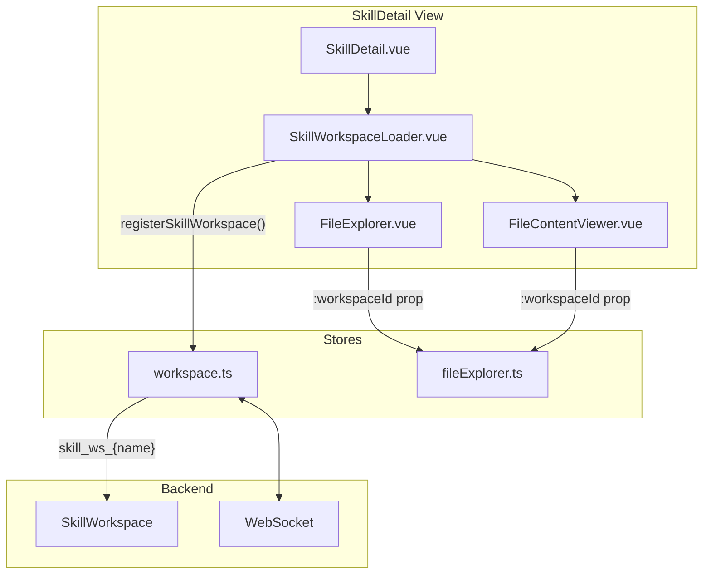

# Skills Management - Frontend

This document describes the design and implementation of the **Skills Management** module in the autobyteus-web frontend.

## Overview

The Skills module allows users to:

- View available global skills and bundled package skills (file-based
  capabilities from configured skill directories and imported agent packages).
- Reload the visible skill catalog after files in already configured skill
  source folders are changed on disk, without restarting the application.
- View the content of skill files (scripts, docs) using the **generic File Explorer**.
- Create new skills.
- Edit skill files directly in the browser with **Monaco Editor**.
- Assign catalog skills to agents during agent creation.

Package-private agent skills and owning-team shared package skills are also
listed as normal rows on the Skills page when their package roots are available.
Opening them uses the same Skill Detail and File Explorer flow as other skills;
read/write behavior is determined by the underlying filesystem permissions.

## Module Structure

```
autobyteus-web/
├── pages/
│   └── skills.vue                      # Main skills management page
├── components/skills/
│   ├── SkillsList.vue                  # Skills listing with cards
│   ├── SkillCard.vue                   # Individual skill card
│   ├── SkillDetail.vue                 # Skill explorer & file viewer
│   ├── SkillDescriptionSummary.vue     # Compact description summary + inline More/Less disclosure
│   └── SkillWorkspaceLoader.vue        # Transient workspace lifecycle manager
├── stores/
│   ├── skillStore.ts                   # Skills CRUD operations
│   └── workspace.ts                    # Workspace registration (incl. skill workspaces)
└── graphql/
    ├── queries/skillQueries.ts
    └── mutations/skillMutations.ts
```

## Navigation

Skills is a **standalone top-level module** accessible via the main sidebar (wrench/screwdriver icon). It is independent from the agent/team definition modules.

**Route:** `/skills`

## View Modes

The skills page uses component-based navigation (not URL query parameters):

| View             | Component   | Description                    |
| ---------------- | ----------- | ------------------------------ |
| `list` (default) | SkillsList  | Browse available skills        |
| `detail`         | SkillDetail | View/edit files within a skill |

The list view starts directly with the search/action toolbar (`Search skills`,
`Sources`, `Reload`, and `Create Skill`) and then renders alerts plus the skill
card grid. It intentionally does not render a duplicate page-level `Skills`
heading or explanatory subtitle in the main content because the sidebar already
communicates the active top-level module.


## Skill Detail Header

`SkillDetail.vue` uses a compact header so the file workspace remains close to
the top of the page. The header owns navigation, skill identity, and the skill
description summary. The description is one line by default with truncation and
a localized `More` control.

`SkillDescriptionSummary.vue` owns the description disclosure state. Clicking
`More` expands the full description inline in normal document flow and changes
the control to `Less`; clicking `Less` collapses back to the one-line summary.
This disclosure must not use an overlay/popover because the skill workspace
(file explorer, tabs, and document content) should never be covered by the
description panel.

## Architecture: Skill Workspaces

Skills integrate with the **workspace-agnostic File Explorer** architecture. When viewing a skill's files, a **transient SkillWorkspace** is created on-demand.



### SkillWorkspaceLoader.vue

A lifecycle component that manages transient skill workspaces:

```vue
<SkillWorkspaceLoader :skillId="skill.name">
    <template #default="{ workspaceId }">
        <FileExplorer :workspaceId="workspaceId" />
        <FileContentViewer :workspaceId="workspaceId" />
    </template>
</SkillWorkspaceLoader>
```

**Lifecycle:**

1. `onMounted`: Calls `workspaceStore.registerSkillWorkspace(skillId)` → returns `skill_ws_{skillId}`
2. Provides `workspaceId` to child components via scoped slot
3. `onBeforeUnmount`: Calls `workspaceStore.unregisterSkillWorkspace(workspaceId)` → cleans up

### Workspace ID Convention

Skill workspaces use the prefix `skill_ws_` followed by the skill name:

```typescript
const workspaceId = `skill_ws_${skillId}`; // e.g., "skill_ws_brand-guidelines"
```

This prefix allows the backend `WorkspaceManager.get_or_create_workspace()` to dynamically create `SkillWorkspace` instances on first connection.

## Data Models

### Skill

```typescript
interface Skill {
  name: string;
  description: string;
  content: string; // Content of SKILL.md
  rootPath: string;
  fileCount: number;
  createdAt: string;
  updatedAt: string;
}
```

## State Management

### skillStore.ts

Manages skill metadata (NOT file operations - those are delegated to the FileExplorer):

| Action                 | Description                              |
| :--------------------- | :--------------------------------------- |
| `fetchAllSkills()`     | Load all skills from the server.         |
| `reloadSkillCatalog()` | Explicitly rescan configured skill sources and bundled package skill roots, replace the visible skill list, and refresh cached skill-source metadata. |
| `fetchSkill(name)`     | Load a specific skill by name.           |
| `createSkill(payload)` | Create a new skill directory + SKILL.md. |
| `deleteSkill(name)`    | Delete the entire skill directory.       |

> **Note:** File operations (view, edit, save) are now handled by the generic `FileExplorerStore` via the skill's transient workspace.

The Skills list toolbar exposes a localized **Reload** action backed by the
GraphQL `reloadSkillCatalog` mutation. Reload updates card metadata such as
description, file count, added skills, removed skills, and source counts after
external file edits. The button has its own `reloading` state and success/error
feedback; duplicate concurrent reloads are ignored. If the currently selected
skill disappears during reload, `skillStore` clears `currentSkill` so the page
can return to the list state.

Reload is intentionally a catalog/UI refresh. It affects the Skills page and
future agent selections, but it does not claim to update skill content that has
already been materialized inside active agent runs.

### workspace.ts (Skill Registration)

| Action                            | Description                                  |
| :-------------------------------- | :------------------------------------------- |
| `registerSkillWorkspace(skillId)` | Creates transient workspace, returns ID.     |
| `unregisterSkillWorkspace(wsId)`  | Cleans up workspace and file explorer state. |

## Agent Integration

### Agent Creation Form

The `AgentDefinitionForm.vue` component includes a "Skills Configuration" section.
It calls `skillStore.fetchAllSkills()` to populate available skills, including
bundled package skills that are visible in the normal Skills catalog.

- **Component**: `GroupableTagInput`
- **Data Field**: `skillNames` (List of strings)

When an agent is created, the selected `skillNames` are sent to the backend
`AgentDefinition`.

The backend treats `skillNames` as logical names at runtime. For package-authored
agents, runtime resolution is context-first: those names may resolve to
package-private canonical folders such as
`agents/<agent-id>/skills/<skill-name>/SKILL.md`, team-local private folders
under `agent-teams/<team-id>/agents/<agent-id>/skills/<skill-name>/SKILL.md`, or
an owning-team shared skill under
`agent-teams/<team-id>/skills/<skill-name>/SKILL.md` before falling back to the
global skill directories. The Skills page catalog also scans package roots so
users can browse and open those bundled skill files normally. Duplicate skill
names use first-seen catalog precedence, so package authors should choose unique
logical skill names.

## Skill Improvement And Skill Files

Manual Skill Improvement is a skill-first workflow. When the backend deems a run or
team agent-member eligible, the visible improver helper may edit only the exact
configured skill root directories returned by backend eligibility. `SKILL.md`
is the package entry file; supporting files inside the same listed root may be
changed when a reusable improvement needs them. Agent/team definitions, MCP/tool
config, source code, run memory, sibling skills, and files outside the listed
roots are out of MVP scope.

The frontend does not decide whether a skill is eligible for Skill Improvement. The
composer-adjacent **Improve skills** CTA lazy-loads backend eligibility for the
selected active run or team member and stays hidden when the backend says the
current target is ineligible. Run-history rows and launch forms do not own
Skill Improvement actions. Before messaging the visible improver, the backend
projects the target's raw trace corpus into readable work trace files and sends
the improver a concise task packet with paths, editable skill roots, and a
bounded relative package tree that marks each `SKILL.md` as `[entry]`; it does
not inline the work trace body or ask the improver to read raw trace JSONL. The
backend records minimal provenance and does not compute changed paths or
policy-violation metrics in the MVP. After launch, the workspace may show only a
short transient start status. Only after meaningful durable skill package file
changes, the improver reports through one direct `send_message_to` call with
`message_type: "skill_update"` to the still-active target run. Its content should
explain what changed, why it matters, and how the target should use or reload the
updated guidance, while dynamic references are absolute paths to changed or
directly relevant surviving files inside editable roots; the backend record
distinguishes sent, rejected, target-inactive, and not-attempted outcomes. That
helper-authored message is not a runtime/model skill-refresh instruction;
next-run correctness is the MVP baseline. Users should still inspect any
Git-backed skill changes directly before treating them as accepted improvements.

Git-backed skill packages remain the recommended testing and rollback mode for
this MVP when a skill source is owned by an external repository. AutoByteus does
not expose built-in history controls in Skill Detail; direct editing is
controlled by prompt/tool contract plus manual Git inspection/revert, not by a
separate proposal/apply UI or product audit service.

## Related Documentation

- **[Server Skill Improvement](../../autobyteus-server-ts/docs/modules/skill_improvement.md)**: Backend Skill Improvement workflow, shared work-trace package consumption, improver lifecycle, skill-root edit, and minimal provenance contract.
- **[Agent Management](./agent_management.md)**: Skills are attached to agents to provide capabilities.
- **[File Explorer](./file_explorer.md)**: Skills use the generic, workspace-agnostic File Explorer.
