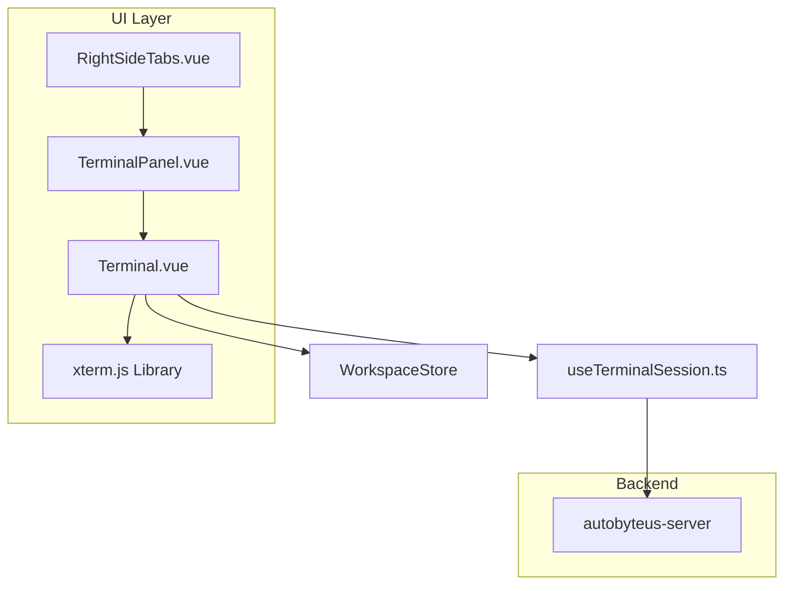
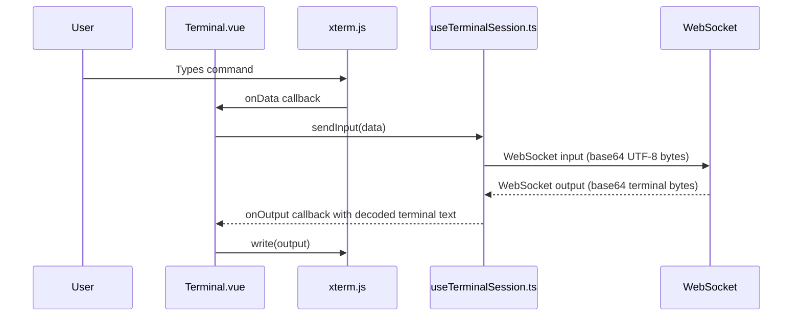

# Terminal Module - Frontend

This document describes the design and implementation of the **Terminal** module in the autobyteus-web frontend, which provides an interactive command-line interface for executing terminal commands in an explicit workspace/root path when one is active, or in the backend server user's home directory when no terminal target is selected.

## Overview

The Terminal module enables users to:

- Execute terminal commands in the active workspace/root directory when available
- Start in the backend server user's home directory when no workspace/root target is active
- View command output with syntax-highlighted results
- Navigate command history with arrow keys
- Use keyboard shortcuts (Ctrl+C for interrupt)
- Follow the app-wide **Settings -> Display -> App font size** preset for terminal text sizing
- Preserve one live terminal session per canonical backend/root-path target while the in-window terminal host is mounted

## Module Structure

```
autobyteus-web/
├── components/workspace/tools/
│   ├── TerminalPanel.vue         # Per-target in-window terminal cache/host
│   └── Terminal.vue              # xterm.js terminal component
├── components/layout/
│   ├── RightSideTabs.vue         # Tab container with Terminal tab
│   └── RightSidebarStrip.vue     # Collapsed sidebar with Terminal icon
├── composables/
│   ├── useRightSideTabs.ts       # Tab state management
│   └── useTerminalSession.ts     # Terminal WebSocket session
└── utils/
    ├── terminalTarget.ts         # Target normalization and cache key helpers
    └── terminalTransportCodec.ts # Terminal byte/base64/UTF-8 codec
```

## Architecture



## Core Components

### TerminalPanel.vue

TerminalPanel is the in-window terminal cache host. RightSideTabs lazy-mounts this panel after the Terminal tab is first activated and then hides it on ordinary tab switches instead of unmounting it.

**Key Responsibilities:**

- Computes a canonical terminal cache key from the current backend/node terminal endpoint plus either a normalized workspace/root path or explicit server-home mode
- Lazily creates a cached `Terminal.vue` child only while the Terminal tab is active for the current target
- Keeps previously opened target children mounted and hidden, preserving their xterm scrollback, WebSocket, and backend PTY while the host remains mounted
- Passes a snapshot target object or explicit `null` server-home target into each child so cached entries do not drift when active workspace metadata changes
- Clears all cached entries when the window node binding revision or normalized terminal endpoint scope changes; child unmounts close WebSockets and let the backend release PTYs

This is an in-window cache only. It does not persist terminals across page reloads, app restarts, backend restarts, host destruction, or node/backend rebinding.

### Terminal.vue

Main terminal component using xterm.js for rich terminal emulation.

**Libraries Used:**

| Library              | Version | Purpose                           |
| -------------------- | ------- | --------------------------------- |
| `@xterm/xterm`       | ^5.5.0  | Terminal emulator core            |
| `@xterm/addon-fit`   | ^0.10.0 | Auto-resize terminal to container |
| `@xterm/addon-webgl` | ^0.19.0 | GPU-accelerated rendering         |

**Key Features:**

- **Backend PTY prompt**: Uses the shell prompt from the resolved backend cwd
- **Command history**: Navigate with Up/Down arrow keys
- **Input handling**: Backspace, Enter, character input
- **Ctrl+C support**: Interrupt current input
- **Responsive sizing**: Auto-fits container with ResizeObserver
- **Display preference integration**: Uses the shared app font-size store and refits when terminal font metrics change
- **Root-path target**: Accepts a `TerminalTarget` with a workspace root path (and optional display metadata) so desktop wrappers can connect without materializing workspace/file-explorer state.
- **Visibility reactivation**: Accepts an `active` prop. Becoming active refits xterm and sends a resize if connected; becoming inactive does not disconnect.
- **Target semantics**: Omitted `target` means derive from active workspace metadata for legacy direct usage; explicit `target: null` means server-home and must not fall back to active workspace metadata.

**Terminal Configuration (Light Theme):**

```typescript
const { resolvedMetrics } = storeToRefs(useAppFontSizeStore());

terminalInstance.value = new Terminal({
  cursorBlink: true,
  cursorStyle: "bar",
  fontFamily: 'Menlo, Monaco, "Courier New", monospace',
  fontSize: resolvedMetrics.value.terminalFontPx, // Default 14, Large 16, Extra Large 18
  theme: {
    background: "#ffffff",
    foreground: "#383a42",
    cursor: "#528bff",
    green: "#50a14f",
    blue: "#4078f2",
  },
  scrollback: 5000,
});
```

The terminal watches `resolvedMetrics.terminalFontPx` from `appFontSizeStore` and runs `fitAddon.fit()` after font-size changes so larger presets stay usable without manual reopen.

**Input Handling Flow:**



### useTerminalSession.ts (Composable)

Manages the terminal WebSocket session and streaming I/O.

**Key Responsibilities:**

- Connect/disconnect WebSocket sessions for an explicit terminal root path or the backend server-home default
- Send input and resize events to the backend
- Receive output streams and forward to xterm.js

**Core API:**

| Function       | Description                         |
| -------------- | ----------------------------------- |
| `connect()`    | Opens the WebSocket session         |
| `disconnect()` | Closes the session                  |
| `sendInput()`  | Sends user input as UTF-8 bytes in base64 transport |
| `sendResize()` | Sends terminal resize events        |
| `onOutput()`   | Registers output callback for xterm |

### RightSideTabs.vue

Tab container that hosts the Terminal alongside other workspace tools.

RightSideTabs owns tab visibility. For Terminal it hosts `TerminalPanel.vue` after first activation and hides the panel with `v-show` during ordinary right-side tab switches. This keeps the TerminalPanel cache and all already-opened child terminal sessions alive until the right-side host truly unmounts or TerminalPanel clears its cache on node/backend rebinding.

**Available Tabs:**

| Tab Name      | Label      | Visibility | Component          |
| ------------- | ---------- | ---------- | ------------------ |
| `files`       | Files      | Always     | FileExplorerLayout |
| `teamMembers` | Team       | Team mode  | TeamOverviewPanel  |
| `todoList`    | To-Do      | Agent mode | TodoListPanel      |
| `terminal`    | Terminal   | Always     | TerminalPanel (hosts Terminal children) |
| `vnc`         | VNC Viewer | Always     | VncViewer          |

### Mobile Phone Access

Phase One Android pairing removes the mobile Tools/Terminal/VNC page entirely. The interactive terminal remains a desktop/workspace tool, not a standard `/mobile` Phone Access surface. Historical terminal-command tool output may still appear as read-only agent activity in the mobile Activity digest.

## WebSocket Protocol (Summary)

The terminal session connects to `/ws/terminal/{sessionId}?cwd={encodedRootPath}` for an explicit root path. When no workspace/root target is selected, it connects to `/ws/terminal/{sessionId}` without `cwd` or `rootPath`; the backend resolves that omitted cwd to the server process user's home directory after authorization.

Both modes communicate via WebSocket using JSON messages. The `data` field in input and output messages is always base64-encoded terminal bytes, not base64-encoded JavaScript text:

- **Input**: `{ "type": "input", "data": "<base64>" }` where `data` is UTF-8 bytes encoded from xterm input text
- **Resize**: `{ "type": "resize", "rows": number, "cols": number }`
- **Output**: `{ "type": "output", "data": "<base64>" }` where `data` is raw PTY output bytes from the backend
- **Error**: `{ "type": "error", "message": "..." }`

`useTerminalSession.ts` owns the frontend byte/text boundary. It UTF-8 encodes xterm input before base64 transport, and it decodes backend output by converting base64 back to bytes and feeding those bytes through one streaming `TextDecoder("utf-8")` per terminal connection before dispatching strings to xterm. Streaming decode is required because a UTF-8 code point may span separate WebSocket output messages. `Terminal.vue` receives decoded terminal text only and remains transport-agnostic.

## Styling

The Terminal uses a light theme matching the application design:

- **Background**: White (`#ffffff`)
- **Text**: Dark gray (`#383a42`)
- **Cursor**: Blue (`#528bff`)
- **Prompt Workspace**: Bright green (`#50a14f`)
- **Prompt Path**: Bright blue (`#4078f2`)
- **Scrollbar**: Gray-300 with Gray-400 hover

**Custom CSS:**

```css
.terminal-container {
  background-color: #ffffff;
  cursor: text;
  padding: 0;
}

.xterm {
  padding: 12px 0 0 12px; /* Internal padding for text */
}
```

## Usage Example

The Terminal is automatically available from the workspace page. If no agent/team/run workspace is active, it starts in the backend server user's home directory. If an active workspace root exists, it starts in that explicit workspace root.

1. Open the workspace page
2. Click the "Terminal" tab in the right panel. In constrained workspace sizes, open **Tools** from the workspace surface controls or use the right tool strip/drawer first.
3. Type commands and press Enter
4. View output directly in the terminal

The shell prompt is produced by the backend PTY and reflects the resolved cwd.

After a target has been opened, switching away from Terminal to another right-side tab and back restores the same cached xterm/WebSocket/PTY session. Switching between workspace roots creates or shows the cached session for that canonical root path; returning to a previously opened root path restores its prior terminal while the TerminalPanel host is still alive.

## Backend Runtime Notes

The frontend Terminal connects to the backend with either an explicit cwd/root path or an omitted-cwd default request. The backend owns server-home resolution and path validation. Explicit unavailable paths are rejected before PTY creation; an unavailable server home is rejected through the same terminal-unavailable path. The default-home terminal does not create workspace metadata and does not start File Explorer watchers. On macOS, the server uses the `autobyteus-ts` isolated PTY backend so a helper child process owns `node-pty`, the PTY descriptors, and the shell; closing the WebSocket releases the helper and avoids lingering PTY descriptors in the long-lived server process. TerminalPanel preserves sessions by keeping child components mounted while hidden; true host unmount, cache clearing, or node/backend rebinding still unmounts children and closes their WebSockets. Packaged macOS startup also repairs the `spawn-helper` adjacent to the `node-pty` native module selected for the running architecture, and startup failures are preserved as terminal `error` messages before the socket closes with `1011`.

See `autobyteus-server-ts/docs/modules/terminal.md` and `autobyteus-ts/docs/terminal_tools.md` for backend lifecycle details.

## Related Documentation

- **[File Explorer](./file_explorer.md)**: Terminal and File Explorer are separate workspace capabilities; Terminal uses cwd/root path while File Explorer owns tree/search/watch state.
- **[Agent Execution Architecture](./agent_execution_architecture.md)**: Agents can sometimes execute terminal commands (via tools), which is a separate but related capability.
