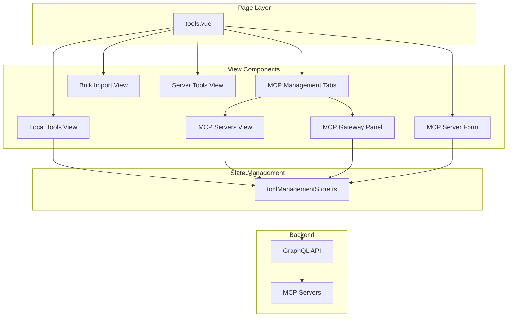
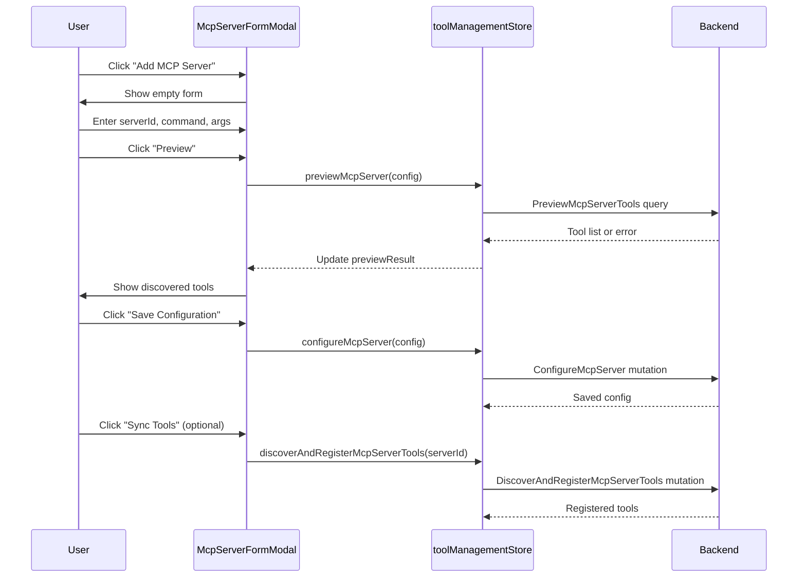

# Tools and MCP Module - Frontend

This document describes the design and implementation of the **Tools and MCP** module in the autobyteus-web frontend, which provides tool browsing, MCP server management, and tool discovery capabilities.

## Overview

The Tools and MCP module enables users to:

- Browse local tools with category grouping and search
- Add and configure MCP (Model Context Protocol) servers
- Discover and register tools from MCP servers
- Assign discovered MCP-origin tool names to agents through the normal tool
  selection flow; native AutoByteus, Codex App Server, and Claude Agent SDK
  runtimes consume the same registered names, with Codex/Claude receiving them
  through the server-hosted `autobyteus_agent_tools` runtime MCP bridge
- View the stable general `/mcp/gateway` Streamable HTTP endpoint and the
  current MCP-origin tool count/list for external MCP clients
- Preview MCP server connections before saving
- Bulk import MCP server configurations from JSON
- View tool parameters and schemas
- Reload tool schemas after changes

## Module Structure

```
autobyteus-web/
├── pages/
│   └── tools.vue                       # Main tools page with view routing
├── components/tools/
│   ├── ToolsFilter.vue                 # Search and category filter
│   ├── ToolList.vue                    # Tool listing by category
│   ├── ToolCard.vue                    # Individual tool display
│   ├── ToolDetailsModal.vue            # Tool schema modal
│   ├── toolParameterDisplayRows.ts     # Flat + nested parameter display rows
│   ├── ToolsConfirmationModal.vue      # Delete confirmation dialog
│   ├── McpManagementTabs.vue           # MCP Servers / MCP Gateway tab switcher
│   ├── McpGatewayPanel.vue             # General MCP gateway endpoint and client config
│   ├── McpServerList.vue               # MCP servers listing
│   ├── McpServerCard.vue               # Individual server display
│   ├── McpServerFormModal.vue          # Add/edit MCP server form
│   └── McpBulkImportView.vue           # JSON bulk import view
├── stores/
│   └── toolManagementStore.ts          # Tools and MCP state management
└── graphql/
    ├── queries/toolQueries.ts          # Tool fetch queries
    ├── queries/mcpServerQueries.ts     # MCP server queries
    ├── mutations/toolMutations.ts      # Tool schema reload
    └── mutations/mcpServerMutations.ts # MCP server CRUD
```

## Architecture



## View Modes

The module uses a state-driven view system with the following views:

| View              | Component                                         | Description                                                       |
| ----------------- | ------------------------------------------------- | ----------------------------------------------------------------- |
| `local-tools`     | ToolList                                          | Browse local tools by category                                    |
| `mcp-servers`     | McpManagementTabs + McpServerList / McpGatewayPanel | List configured MCP servers or show the general MCP Gateway panel |
| `mcp-form`        | McpServerFormModal                                | Add/edit MCP server config                                        |
| `mcp-bulk-import` | McpBulkImportView                                 | Import servers from JSON                                          |
| `mcp-tools-{id}`  | ToolList                                          | View tools for specific MCP server                                |

## Data Models

### Tool

```typescript
interface Tool {
  name: string;
  description: string;
  origin: "LOCAL" | "MCP";
  category: string;
  argumentSchema: {
    parameters: ToolParameter[];
  } | null;
}

interface ToolParameter {
  name: string;
  paramType: string;
  description: string;
  required: boolean;
  defaultValue: string | null;
  enumValues: string[] | null;
  jsonSchema: Record<string, unknown> | null;
}
```

`jsonSchema` contains the JSON Schema property for that specific parameter as
projected by the backend GraphQL tool-definition boundary. Object parameters can
therefore carry nested `properties` and `required` metadata without flattening
the invocation contract. For example, `generate_speech.generation_config` stays
one top-level argument, while the modal can render nested rows such as
`generation_config.voice`, `generation_config.format`, and
`generation_config.instructions` beneath it.

### MCP Server

MCP servers support two transport types:

```typescript
interface McpServer {
  __typename: "StdioMcpServerConfig" | "StreamableHttpMcpServerConfig";
  serverId: string;
  transportType: "STDIO" | "STREAMABLE_HTTP";
  enabled: boolean;
  toolNamePrefix: string;

  // STDIO-specific
  command?: string;
  args?: string[];
  env?: Record<string, string>;
  cwd?: string;

  // HTTP-specific
  url?: string;
  token?: string;
  headers?: Record<string, string>;
}
```

Discovered MCP tools are registered in the backend tool registry as MCP-origin
tools. When an agent definition selects those registered tool names, the native
AutoByteus runtime executes them through the configured MCP proxy path. Codex
App Server and Claude Agent SDK do not receive raw provider-specific copies of
the MCP server config; they see the selected registered tool names through the
run-scoped `autobyteus_agent_tools` MCP descriptor. External MCP clients
that are not tied to an AutoByteus AgentRun can instead use the backend's stable `/mcp/gateway`
Streamable HTTP endpoint. That gateway exposes only currently registered
MCP-origin tools and should be protected with `AUTOBYTEUS_MCP_GATEWAY_TOKEN` for
non-local access.

## State Management (toolManagementStore.ts)

```typescript
interface ToolManagementState {
  localTools: Tool[];
  localToolsByCategory: ToolCategoryGroup[];
  mcpServers: McpServer[];
  toolsByServerId: Record<string, Tool[]>;
  mcpGatewayTools: Tool[];
  loading: boolean;
  error: any;
  previewResult: PreviewResult | null;
}
```

**Key Actions:**

| Action                                        | Description                          |
| --------------------------------------------- | ------------------------------------ |
| `fetchLocalToolsGroupedByCategory()`          | Load local tools grouped by category |
| `fetchMcpServers()`                           | Load all configured MCP servers      |
| `fetchToolsForServer(serverId)`               | Load tools registered for a server   |
| `fetchMcpGatewayTools()`                       | Load registered MCP-origin tools for the MCP Gateway panel with `tools(origin: MCP)` |
| `previewMcpServer(input)`                     | Test connection and preview tools    |
| `configureMcpServer(input)`                   | Save MCP server configuration        |
| `deleteMcpServer(serverId)`                   | Remove MCP server                    |
| `discoverAndRegisterMcpServerTools(serverId)` | Sync tools from server               |
| `importMcpServerConfigs(json)`                | Bulk import from JSON string         |
| `reloadToolSchema(toolName)`                  | Refresh tool schema from backend     |

## Core Components

### McpManagementTabs.vue

Provides the internal tab switcher used inside the MCP Servers area:

- **MCP Servers** keeps the existing server list, add/edit/delete, bulk import,
  discovery, and per-server tools flows.
- **MCP Gateway** shows the general gateway endpoint and copy-ready client
  configuration without adding a second sidebar entry or duplicating the MCP
  Servers tool browser.

### McpGatewayPanel.vue

Shows external-client guidance for the backend general MCP gateway:

- endpoint: `${serverBaseUrl}/mcp/gateway`
- example Streamable HTTP client JSON config
- bearer-token guidance for `AUTOBYTEUS_MCP_GATEWAY_TOKEN`
- copy feedback for endpoint/config copy actions

The panel is informational only. Gateway access control is backend-owned: when
`AUTOBYTEUS_MCP_GATEWAY_TOKEN` is set, clients must send `Authorization: Bearer
<token>`; when it is unset, the backend accepts only local loopback requests.
The frontend does not display or manage the token.

### ToolList.vue

Displays tools grouped by category:

- Category headers with tool count
- Grid layout of ToolCard components
- Search filtering by name/description
- Optional back button for nested views

### ToolDetailsModal.vue

Displays each tool's parameter schema. The modal starts from
`argumentSchema.parameters` and uses `toolParameterDisplayRows.ts` to derive a
bounded display list:

- top-level parameters remain top-level rows
- object-parameter `jsonSchema.properties` are rendered as indented child rows
  with their full dotted path shown for contract clarity
- nested rows reuse JSON Schema metadata where available, including type,
  `required`, description, default, and enum values
- nested object properties are shown under their owning object parameter and are
  not promoted to top-level invocation arguments

When Reload Schema succeeds, the modal emits the returned tool to
`ToolsManagementWorkspace.vue`. The workspace owns the selected tool reference
and replaces it with the returned tool when the name matches, so an already-open
modal rerenders from the fresh schema without requiring close/reopen.

### McpServerFormModal.vue

Full-featured MCP server configuration:

**Features:**

- Form tab: Visual configuration fields
- JSON tab: Raw standard `mcpServers` JSON input for advanced users
- Transport type toggle (STDIO / HTTP)
- STDIO config: command, args, env vars, working directory
- HTTP config: URL, token, headers
- Server preview before saving
- Tool discovery after save

**Workflow:**

1. User chooses either **Form View** or **JSON View** as the active input surface
2. In **Form View**, "Preview" and "Save Configuration" build the server payload from form fields
3. In **JSON View**, "Preview" and "Save Configuration" parse the current textarea value at click time
4. Preview shows discovered tools or a recoverable validation error
5. User clicks "Save Configuration" to persist through the existing GraphQL/backend path
6. Option to discover and register tools after save

The JSON View accepts the standard top-level MCP shape:

```json
{
  "mcpServers": {
    "server-id": {
      "command": "uv",
      "args": ["run", "server.py"]
    }
  }
}
```

For the single-server add/edit modal, JSON View must contain exactly one
`mcpServers` entry. The server ID comes from the JSON map key when adding a new
server; when editing an existing server, the existing server ID remains the
identity, matching the disabled server ID field in Form View. Multiple-server
JSON belongs in **Bulk Import**.

JSON View supports both explicit and inferred transport:

- STDIO: `command` implies `STDIO` when no explicit transport is present
- Streamable HTTP: `url` implies `STREAMABLE_HTTP` when no explicit transport is present
- accepted aliases include `transportType` / `transport_type` and
  `toolNamePrefix` / `tool_name_prefix`

**Apply JSON to Form** is only a conversion helper for users who want to switch
from raw JSON into guided editing. It is not required before previewing or
saving from JSON View. Disk persistence remains the existing backend-owned
`mcps.json` format; the frontend still sends the normal `McpServerInput`
payload through the existing store and GraphQL actions.

### McpBulkImportView.vue

Import multiple MCP servers from JSON:

- Accepts JSON array of server configs
- Shows import results (success/failure counts)
- Useful for sharing configurations across environments

## GraphQL API

### Tool Queries

```graphql
# Get tools (optionally filtered by origin/server). The MCP Gateway panel uses
# variables: { origin: MCP } to show the same MCP-origin registry slice exposed
# by /mcp/gateway.
query GetTools($origin: ToolOriginEnum, $sourceServerId: String) {
  tools(origin: $origin, sourceServerId: $sourceServerId) {
    name, description, origin, category
    argumentSchema {
      parameters {
        name, paramType, description, required, defaultValue, enumValues, jsonSchema
      }
    }
  }
}

# Get local tools grouped by category
query GetToolsGroupedByCategory($origin: ToolOriginEnum!) {
  toolsGroupedByCategory(origin: $origin) {
    categoryName
    tools {
      name, description, origin, category
      argumentSchema {
        parameters {
          name, paramType, description, required, defaultValue, enumValues, jsonSchema
        }
      }
    }
  }
}
```

### MCP Server Queries

```graphql
# Get all configured MCP servers
query GetMcpServers {
  mcpServers {
    ... on StdioMcpServerConfig {
      serverId
      transportType
      enabled
      toolNamePrefix
      command
      args
      env
      cwd
    }
    ... on StreamableHttpMcpServerConfig {
      serverId
      transportType
      enabled
      toolNamePrefix
      url
      token
      headers
    }
  }
}

# Preview server tools before saving
query PreviewMcpServerTools($input: McpServerInput!) {
  previewMcpServerTools(input: $input) {
    name
    description
  }
}
```

### MCP Server Mutations

```graphql
# Save MCP server configuration
mutation ConfigureMcpServer($input: McpServerInput!) {
  configureMcpServer(input: $input) {
    savedConfig { serverId, transportType, ... }
  }
}

# Delete MCP server
mutation DeleteMcpServer($serverId: String!) {
  deleteMcpServer(serverId: $serverId) {
    success, message
  }
}

# Sync tools from MCP server
mutation DiscoverAndRegisterMcpServerTools($serverId: String!) {
  discoverAndRegisterMcpServerTools(serverId: $serverId) {
    success, message, discoveredTools { name, description, ... }
  }
}

# Bulk import servers from JSON
mutation ImportMcpServerConfigs($jsonString: String!) {
  importMcpServerConfigs(jsonString: $jsonString) {
    success, message, importedCount, failedCount
  }
}
```

## User Flows

### Add MCP Server (STDIO)



### Browse Local Tools

1. User navigates to Tools page
2. `fetchLocalToolsGroupedByCategory()` loads all local tools
3. Tools are displayed grouped by category
4. User can search by name/description
5. User can filter by category dropdown
6. Clicking a tool shows ToolDetailsModal with parameters

### Reload Tool Schema

1. User views a tool in ToolDetailsModal
2. User clicks "Reload Schema" button
3. `reloadToolSchema(toolName)` mutation is called
4. Store collections are immutably updated from the returned tool
5. ToolDetailsModal emits the returned tool to the workspace
6. The workspace replaces its selected tool reference when the name matches
7. Updated schema is displayed in-place, including nested object properties
8. Toast notification confirms success/failure

## MCP Transport Types

### STDIO Transport

For MCP servers that run as local processes:

| Field     | Description                                      |
| --------- | ------------------------------------------------ |
| `command` | Executable path (e.g., `npx`, `python`)          |
| `args`    | Command arguments (e.g., `["-m", "mcp_server"]`) |
| `env`     | Environment variables                            |
| `cwd`     | Working directory                                |

### Streamable HTTP Transport

For MCP servers accessed over HTTP:

| Field     | Description                   |
| --------- | ----------------------------- |
| `url`     | Server endpoint URL           |
| `token`   | Optional authentication token |
| `headers` | Optional custom headers       |

## Related Documentation

- **[General MCP Gateway](../../autobyteus-server-ts/docs/modules/mcp_gateway.md)**: Backend `/mcp/gateway` endpoint, token access model, and MCP-origin-only execution boundary.
- **[MCP Server Management](../../autobyteus-server-ts/docs/modules/mcp_server_management.md)**: Backend external MCP server import and registration owner.
- **[Agent Tools MCP Server](../../autobyteus-server-ts/docs/modules/agent_tools_mcp_server.md)**: Run-scoped `autobyteus_agent_tools` endpoint distinct from the general gateway.
- **[Agent Management](./agent_management.md)**: Tools are assigned to agents to extend their capabilities.
- **[Agent Execution Architecture](./agent_execution_architecture.md)**: Describes how tool calls are streamed, parsed, and executed during an agent run.
