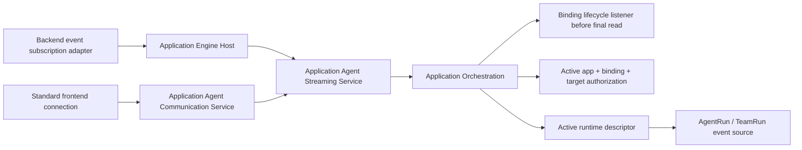
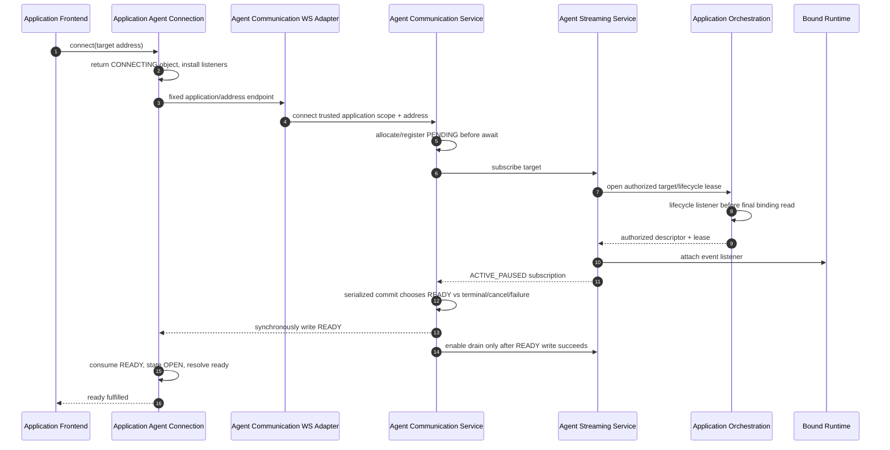

# Application Agent Communication Contract

## Status And Authority

This is a normative intended-behavior supplement to [`requirements.md`](./requirements.md) and [`design-spec.md`](./design-spec.md). It supersedes the earlier backend-proxy-only streaming contract.

Status: `User-approved revised intended-behavior basis at source HEAD 3e48c0ea2c9ccabe52c3126f0db799b3865186a3, reconciled for safe provider-message passthrough in CR-001. Binding/address/connection/input/lifecycle/builders are implemented. The remaining implementation delta is the five-variant text/turn/error stream plus projector/consumer/generated-package alignment; the public application ERROR remains message-only and provider-neutral.`

The framework subject is **application-bound agent communication**. `assistant` is only a possible application role. Framework names use `agent`, `agent team`, `binding`, `target address`, `event`, and `connection`.

## 1. Binding And Address Contract

`startAgent(...)` and `startAgentTeam(...)` return two precise binding types:

```ts
export type ApplicationAgentBindingStatus =
  | "ATTACHED"
  | "TERMINATING"
  | "TERMINATED"
  | "FAILED"
  | "ORPHANED";

type ApplicationAgentBindingFields = {
  bindingId: string;
  applicationId: string;
  launchRequestId: string;
  status: ApplicationAgentBindingStatus;
  executionResourceRef: ApplicationExecutionResourceRef;
  createdAt: string;
  updatedAt: string;
  terminatedAt: string | null;
  lastErrorMessage: string | null;
};

export type ApplicationAgentBinding = ApplicationAgentBindingFields & {
  runtime: {
    subject: "AGENT_RUN";
    runId: string;
    definitionId: string;
    members: [];
  };
};

export type ApplicationAgentTeamBindingMember = {
  memberName: string;
  memberRouteKey: string;
  displayName: string;
  teamPath: string[];
  runId: string;
  runtimeKind: "AGENT" | "AGENT_TEAM_MEMBER";
};

export type ApplicationAgentTeamBinding = ApplicationAgentBindingFields & {
  runtime: {
    subject: "TEAM_RUN";
    runId: string;
    definitionId: string;
    members: ApplicationAgentTeamBindingMember[];
  };
};

```

`ApplicationAgentBindingFields` is a private, non-exported source-composition detail. Public package exports expose only `ApplicationAgentBinding` and `ApplicationAgentTeamBinding`; generated declarations must not export a base/generic binding name. There is no third `ApplicationAgentExecutionBinding` type. Return contracts are explicit:

| Operation | Return |
| --- | --- |
| `startAgent(...)` | `Promise<ApplicationAgentBinding>` |
| `startAgentTeam(...)` | `Promise<ApplicationAgentTeamBinding>` |
| `terminate(...)`, `get(...)`, `findByLaunchRequestId(...)` | `Promise<ApplicationAgentBinding | ApplicationAgentTeamBinding | null>` |
| `list(...)` | `Promise<Array<ApplicationAgentBinding | ApplicationAgentTeamBinding>>` |
| `sendInput(...)` | `Promise<ApplicationAgentBinding | ApplicationAgentTeamBinding>` |

The runtime IDs remain server/backend diagnostic data on the binding projection; the frontend standard connection never accepts them as an address.

```ts
export type ApplicationAgentTarget =
  | { kind: "AGENT_RUN" }
  | { kind: "AGENT_TEAM_RUN" }
  | { kind: "AGENT_TEAM_MEMBER"; memberRouteKey: string };

export type ApplicationAgentTargetAddress = {
  bindingId: string;
  target: ApplicationAgentTarget;
};
```

Address invariants:

1. `bindingId` is non-empty and generated by Application Orchestration.
2. Exactly one discriminated target exists.
3. `memberRouteKey` is a trimmed stable bound-member key and exists only for `AGENT_TEAM_MEMBER`.
4. `applicationId` is not accepted in the address; client/gateway/worker scope supplies it.
5. Raw agent/team/member run IDs are not accepted.
6. The address identifies a target but never authorizes it. Every consumer passes the authorization path in section 8.
7. The address is reusable by frontend connect, backend input, and backend event observation.

### 1.1 Backend-SDK target-address builders

When application backend business code already owns a precise binding and needs a reusable/projected target address, `@autobyteus/application-backend-sdk` provides the preferred typed constructors:

```ts
export const createApplicationAgentTargetAddress = (
  binding: ApplicationAgentBinding,
): ApplicationAgentTargetAddress;

export const createApplicationAgentTeamTargetAddress = (
  binding: ApplicationAgentTeamBinding,
): ApplicationAgentTargetAddress;

export const createApplicationAgentTeamMemberTargetAddress = (
  binding: ApplicationAgentTeamBinding,
  memberRouteKey: string,
): ApplicationAgentTargetAddress;
```

Normative behavior:

1. Every call returns a new address object and does not mutate the supplied binding.
2. Every builder trims and requires a non-empty `binding.bindingId`, emits the trimmed value, and verifies the expected `binding.runtime.subject` at runtime so JavaScript/malformed boundary input fails locally.
3. The member builder trims and requires the supplied route key, matches only exact `binding.runtime.members[].memberRouteKey`, and rejects an absent key. It never falls back to member name, display name, path, or run ID.
4. The returned variants are exactly `AGENT_RUN`, `AGENT_TEAM_RUN`, and `AGENT_TEAM_MEMBER` respectively; no additional fields are emitted.
5. These are structural construction/validation helpers only. They do not inspect active application state, binding terminal state, runtime availability, or authorization. Section 8 remains authoritative when the address is connected, sent to, or observed.
6. The builders are backend-facing exports because application business chooses which binding/member to expose. The frontend SDK continues to receive and use an address; it gains no binding discovery or execution capability.

Failure behavior is ordinary synchronous `Error`; no new public error class is introduced:

| Condition | Exact message |
| --- | --- |
| missing/blank binding ID | `Application agent target address requires binding.bindingId.` |
| agent builder receives non-`AGENT_RUN` subject | `Application agent target address requires an AGENT_RUN binding.` |
| team or team-member builder receives non-`TEAM_RUN` subject | `Application agent-team target address requires a TEAM_RUN binding.` |
| blank member route key | `Application agent-team member target address requires memberRouteKey.` |
| member route key absent from the binding | `Application agent-team binding '<bindingId>' does not contain memberRouteKey '<memberRouteKey>'.` |

Validation order is binding ID, expected runtime subject, then member key/membership.

Construction policy:

- The shared `ApplicationAgentTargetAddress` DTO remains a valid public input contract; builders do not become an authorization gate or mandatory fetch boundary.
- Application backend code should use a builder when it already has the corresponding precise binding and is creating a reusable/projected address, especially a static member address that benefits from membership validation.
- A caller that owns only `bindingId` and immediately sends a one-shot address may construct the exact DTO directly. It must not fetch a binding solely to satisfy a builder; Orchestration still validates the address at use time.
- In this ticket, Socratic's projected `tutorTargetAddress` adopts the member builder. Its supported `askFollowUp` and `requestHint` paths retain their inline `AGENT_TEAM_RUN` DTOs because they own only the persisted binding ID and immediately call `sendInput`.
- Low-level codec/protocol/authorization tests may instantiate explicit valid or deliberately malformed DTOs.

## 2. Target Semantics

| Target | Required Binding | Event Source | Input Target |
| --- | --- | --- | --- |
| `AGENT_RUN` | `ApplicationAgentBinding` | Future events from the bound root agent | Bound root agent |
| `AGENT_TEAM_RUN` | `ApplicationAgentTeamBinding` | Future team-root events plus attributed member/task-agent events | Existing team-root/default input behavior |
| `AGENT_TEAM_MEMBER` | `ApplicationAgentTeamBinding` with exact static `memberRouteKey` | Future agent events whose normalized producer matches that member | Exact bound static member |

Invalid combinations are safe failures before activation. Direct dynamic task-agent addressing is not accepted. Whole-team event attribution may still identify a dynamic task agent through `producer`.

## 3. Standard Frontend API

```ts
export type ApplicationAgentConnectionState =
  | "connecting"
  | "open"
  | "closing"
  | "closed";

export type ApplicationAgentInput = {
  text: string;
  contextFiles?: ApplicationRuntimeInputContextFile[] | null;
  metadata?: Record<string, unknown> | null;
};

export type ApplicationAgentConnectionOptions = {
  signal?: AbortSignal;
};

export type ApplicationAgentConnection = {
  readonly address: ApplicationAgentTargetAddress;
  readonly state: ApplicationAgentConnectionState;
  readonly ready: Promise<void>;
  sendInput(input: ApplicationAgentInput): Promise<void>;
  onEvent(listener: (event: ApplicationAgentEvent) => void): () => void;
  onError(listener: (error: ApplicationAgentConnectionError) => void): () => void;
  onClose(listener: (close: ApplicationAgentConnectionClose) => void): () => void;
  close(): void;
};

applicationClient.agentCommunication.connect(
  address: ApplicationAgentTargetAddress,
  options?: ApplicationAgentConnectionOptions,
): ApplicationAgentConnection;
```

Rules:

1. `connect(...)` returns immediately and installs transport lifecycle handlers before remote work.
2. The SDK owns the browser WebSocket, standard URL, protocol parsing, request correlation, and state machine.
3. `ready` resolves only after the server sends and the SDK consumes `READY`.
4. `sendInput(...)` before `open` rejects locally. Once open it resolves only after matching `INPUT_ACCEPTED`.
5. Listener registration is synchronous and returns an idempotent removal function.
6. `close()` and `AbortSignal` are idempotent.
7. There is no application route callback, raw socket return, assistant/chat API, or frontend runtime-ID API.

## 4. Fixed Endpoint And Wire Contract

Bootstrap supplies:

```ts
type ApplicationHostTransport = {
  backendBaseUrl: string | null;
  backendNotificationsUrl: string | null;
  backendWebSocketBaseUrl: string | null; // optional custom backend routes
  agentCommunicationWebSocketBaseUrl: string | null; // standard agent connection
};
```

For base `/ws/applications/:applicationId/agent-communication`, one shared address codec appends:

```text
/:bindingId/targets/agent-run
/:bindingId/targets/agent-team-run
/:bindingId/targets/agent-team-member/:memberRouteKey
```

All dynamic path segments use `encodeURIComponent` semantics. The desktop host supplies the fixed base, the SDK is the only target-path composer, and the thin server adapter is the only decoder. The bootstrap, `ApplicationClient`, connection options, and connection object contain no application authentication token or credential API. Paired mobile/phone access is outside this contract.

The version-one wire protocol is JSON text:

```ts
type ApplicationAgentClientFrame = {
  protocol: "autobyteus.application-agent-communication.v1";
  type: "INPUT";
  requestId: string;
  input: ApplicationAgentInput;
};

type ApplicationAgentServerFrame =
  | {
      protocol: "autobyteus.application-agent-communication.v1";
      type: "READY";
      address: ApplicationAgentTargetAddress;
    }
  | {
      protocol: "autobyteus.application-agent-communication.v1";
      type: "INPUT_ACCEPTED";
      requestId: string;
    }
  | {
      protocol: "autobyteus.application-agent-communication.v1";
      type: "INPUT_REJECTED";
      requestId: string;
      error: ApplicationAgentConnectionErrorPayload;
    }
  | {
      protocol: "autobyteus.application-agent-communication.v1";
      type: "EVENT";
      event: ApplicationAgentEvent;
    }
  | {
      protocol: "autobyteus.application-agent-communication.v1";
      type: "ERROR";
      error: ApplicationAgentConnectionErrorPayload;
    }
  | {
      protocol: "autobyteus.application-agent-communication.v1";
      type: "CLOSED";
      close: ApplicationAgentConnectionClose;
    };
```

`READY` is the first application-agent protocol frame. The server gates event draining until it is written. Unknown protocol/type, binary input, duplicate request ID, malformed input, oversized frame, or input after closing is rejected according to section 10.

## 5. Minimal Public Application-Agent Stream Contract

The public contract is intentionally smaller than the native AutoByteus agent protocol. It supports a focused vertical-application text experience rather than a general agent-debugging/chat workspace.

```ts
export type ApplicationAgentStreamEvent =
  | { type: "TURN_STARTED" }
  | { type: "TEXT_DELTA"; delta: string }
  | { type: "TURN_COMPLETED" }
  | { type: "TURN_INTERRUPTED" }
  | { type: "ERROR"; message: string };

export type ApplicationAgentEvent = {
  sequence: number;
  observedAt: string;
  applicationId: string;
  address: ApplicationAgentTargetAddress;
  runtimeSubject: "AGENT_RUN" | "TEAM_RUN";
  producer: ApplicationExecutionProducer;
  event: ApplicationAgentStreamEvent;
};
```

Envelope invariants:

- `sequence` starts at `1` per connection or backend subscription and advances only when a projected event is accepted atomically into that consumer's bounded queue;
- `observedAt`, `applicationId`, `address`, and `runtimeSubject` come from trusted framework scope and the authorized source descriptor, never source-event payloads;
- `producer` is always non-null because every v1 public event originates from a bound standalone agent, static team member, or attributed task-agent member; a whole-team connection distinguishes member text by this envelope field;
- selected-member connections deliver only the selected member's events; standalone/whole-team semantics remain those authorized by Orchestration;
- `subscriptionId`, `connectionId`, provider session/thread/item IDs, raw physical target selection, and source payload identities never enter the envelope; and
- the application event is ephemeral/future-only. It is not replay, durable transcript, or artifact recovery.

### 5.1 Canonical source and single interpretation

The provider adapters already translate provider-native traffic into the shared internal `AgentRunEvent` boundary:

```text
Codex / Claude / AutoByteus provider event
→ existing provider adapter
→ AgentRunEvent
├─→ existing AgentRunEventMessageMapper → native AutoByteus frontend
└─→ ApplicationAgentStreamEventProjector → minimal application event
```

`AgentRunEvent` event type plus its established canonical segment fields are the shared semantic source. The target design does **not** add another provider adapter, general event normalizer, native-message dependency, or application-specific alias parser. The native mapper and native frontend remain unchanged.

The application projector has one narrow responsibility: select the five public variants from canonical internal events and construct new closed objects. For `ERROR`, it copies only the already-safe canonical `message`; it does not expose native transport `code` or provider status/code/request ID/details. It does not spread a source payload, infer provider aliases, assemble a full response, interpret thinking/tools/team coordination, or decide runtime lifecycle.

### 5.2 Exact projection table

| Canonical `AgentRunEvent` condition | Public result | Exact rule |
| --- | --- | --- |
| `TURN_STARTED` | `{ type: "TURN_STARTED" }` | source payload is ignored |
| `SEGMENT_CONTENT` with `payload.segment_type === "text"` and a nonempty string `payload.delta` within the owned text/frame bound | `{ type: "TEXT_DELTA", delta }` | preserve `delta` byte-for-byte; do not trim, normalize whitespace, concatenate, or copy segment/provider metadata |
| `TURN_COMPLETED` | `{ type: "TURN_COMPLETED" }` | sole successful response-completion signal; source payload is ignored |
| `TURN_INTERRUPTED` | `{ type: "TURN_INTERRUPTED" }` | source reason/details are not exposed in v1 |
| `ERROR` | `{ type: "ERROR", message }` | preserve the safe canonical/original message; do not replace it with `The agent response failed.`; never read/copy native transport code, provider status/code/request ID/details, raw error objects, stack, cause, or unredacted payloads |
| `SEGMENT_CONTENT` with reasoning/non-text/missing type | deliberate drop | no public event and no sequence consumed |
| empty text delta | deliberate drop | no public event and no sequence consumed |
| oversized or non-string text delta | isolated mapping failure | affected consumer receives existing `EVENT_MAPPING_FAILED` then `STREAM_FAILED`; no sequence consumed |
| every other agent or team event | deliberate drop | includes segment start/end, status, compaction, token, `ASSISTANT_COMPLETE`, tools, todo, inter-agent/team communication, delegation/member input, artifacts, files, and unknown events |

Important semantic decisions:

- `TEXT_DELTA` is a presentation-safe application transformation of canonical text `SEGMENT_CONTENT`; it intentionally hides segment IDs/kinds and all thinking/reasoning.
- `TURN_COMPLETED` is common to current AutoByteus, Codex, and Claude adapters and is already consumed as completion by the native frontend. It is therefore the only application success boundary.
- `ASSISTANT_COMPLETE` remains a native AutoByteus event where currently supported, but the application projector drops it. `AGENT_RESPONSE_COMPLETED` is removed from all application contracts, validators, generated copies, sample code, and tests.
- The framework never emits a full accumulated assistant response. Applications append `TEXT_DELTA` for ephemeral presentation; published artifacts remain the durable structured/whole-result mechanism. The application `ERROR` message is the safe display text only; native transport metadata remains outside this provider-neutral public stream.
- Whole-team subscriptions expose the same five agent-origin variants with producer attribution. Team status/delegation/communication internals are not application streaming v1 events.

### 5.3 Projector extension rule

`ApplicationAgentStreamEventProjector` is the owned extension boundary. A future application transformation is added only by:

1. establishing a reachable vertical-application need;
2. adding one explicit closed `ApplicationAgentStreamEvent` variant;
3. adding one exact canonical-source projection rule and exclusion/redaction rule;
4. updating shared contracts, frontend validation, generated/vendor packages, and parity tests; and
5. leaving connection, authorization, sequencing, queueing, WebSocket, worker, artifact, and notification owners unchanged.

Version one adds no plugin registry, strategy registry, application-supplied projector, arbitrary callback, provider switch, generic chat reducer, or full native-event pass-through.

## 6. Projection, Parity, And Exclusion Examples

### 6.1 Text parity

All current provider adapters already emit the same canonical meaning for assistant text:

```ts
// Existing internal AgentRunEvent examples after provider conversion.
{
  eventType: AgentRunEventType.SEGMENT_CONTENT,
  payload: { id: "segment-1", segment_type: "text", delta: "Hello " },
  runId: "...",
  statusHint: null,
}
```

The existing native mapper continues to preserve the native payload. The application projector returns only:

```ts
{ type: "TEXT_DELTA", delta: "Hello " }
```

`"Hello "`, `"\n"`, and `" "` remain exact if the canonical event contains them. Provider adapters retain their existing authority over whether a provider-native fragment becomes an `AgentRunEvent`; the application projector does not repair or reinterpret provider-native traffic.

### 6.2 Completion parity

```ts
// Canonical event produced by AutoByteus, Codex, and Claude adapters.
{ eventType: AgentRunEventType.TURN_COMPLETED, payload: { /* ignored */ }, ... }

// Application projection.
{ type: "TURN_COMPLETED" }
```

Socratic and other vertical applications finish the current live draft on this event. They do not wait for `ASSISTANT_COMPLETE`, an idle status, a tool completion, or artifact persistence.

### 6.3 Explicit exclusions

The application projector never exposes:

- reasoning/thinking deltas or reasoning snapshots;
- segment IDs, segment kinds, metadata, or segment start/end details;
- tool names, arguments, results, approvals, logs, or tool lifecycle;
- token usage, compaction, internal status, todo, delegation, team communication, or member-input internals;
- provider/native response objects, transport codes, provider status/codes/request IDs, model/session/thread/item IDs, runtime configuration, raw exceptions, stacks, causes, credentials, headers, full payloads, or details;
- artifacts, file changes, reference-file data, workspaces, or filesystem paths; or
- complete accumulated response content.

### 6.4 Mandatory contract tests

- real-shaped AutoByteus, Codex, and Claude canonical text fixtures each produce `TEXT_DELTA` with exact bytes;
- whitespace-only canonical deltas are preserved; empty deltas are dropped; invalid/oversized deltas fail only the affected consumer;
- real-shaped canonical `TURN_STARTED`, `TURN_COMPLETED`, `TURN_INTERRUPTED`, and `ERROR` fixtures produce the exact closed variants; ERROR preserves the safe original message and never falls back to the stale generic replacement when a message exists;
- same-input parity tests send one canonical text/completion event through the native mapper and application projector and prove identical text bytes/completion meaning while the native message shape remains unchanged;
- standalone, whole-team, selected-member, and task-agent wrapper fixtures prove non-null correct producer attribution and filtering;
- exhaustive current `AgentRunEventType` and `TeamRunEventSourceType` tables prove every non-v1 event is dropped and consumes no sequence;
- application shared-contract/frontend-validator tests reject `SEGMENT_CONTENT`, `AGENT_RESPONSE_COMPLETED`, `ASSISTANT_COMPLETE`, tool/team public events, extra keys, nullable producer, and native/provider metadata fields on `ERROR`;
- Socratic session/runtime/renderer/browser tests append only increasing-sequence `TEXT_DELTA`, complete only on `TURN_COMPLETED`, fail safely on `TURN_INTERRUPTED`/`ERROR`, ignore no longer existent tool/thinking/full-response behavior, exercise both live-first and durable-first convergence, and prove double/cross-action one-turn admission without a second GraphQL/input send;
- generated/vendor drift tests prove the contracted five-variant API propagates to the built-in application packages; and
- the real Socratic journey proves nonempty text plus completion through the standard selected-member connection while artifact publication remains separately durable.


## 7. Backend Event Subscription Adapter

The application backend may observe the same public events without becoming the frontend proxy:

```ts
export type ApplicationAgentEventStreamError = {
  code:
    | "EVENT_MAPPING_FAILED"
    | "EVENT_SERIALIZATION_FAILED"
    | "WORKER_TRANSPORT_FAILED"
    | "BACKPRESSURE_LIMIT";
  message: string;
  recoverable: boolean;
};

export type ApplicationAgentEventStreamClose = {
  reason:
    | "UNSUBSCRIBED"
    | "ABORTED"
    | "BINDING_ENDED"
    | "RUNTIME_UNAVAILABLE"
    | "STREAM_FAILED"
    | "WORKER_STOPPED";
};

export type ApplicationAgentEventStreamSubscribeErrorCode =
  | "SUBSCRIPTION_NOT_AVAILABLE"
  | "INVALID_STREAM_TARGET"
  | "RUNTIME_NOT_ACTIVE"
  | "SUBSCRIPTION_ABORTED"
  | "WORKER_TRANSPORT_FAILED";

export declare class ApplicationAgentEventStreamSubscribeError extends Error {
  readonly code: ApplicationAgentEventStreamSubscribeErrorCode;
  readonly recoverable: boolean;
}

export type ApplicationAgentEventStreamObserver = {
  onEvent: (event: ApplicationAgentEvent) => void | Promise<void>;
  onError?: (error: ApplicationAgentEventStreamError) => void | Promise<void>;
  onClosed?: (close: ApplicationAgentEventStreamClose) => void | Promise<void>;
};

export type ApplicationAgentEventStreamSubscription = {
  subscriptionId: string;
  unsubscribe: () => Promise<void>;
};

context.agentExecution.subscribeEventStream(
  address: ApplicationAgentTargetAddress,
  observer: ApplicationAgentEventStreamObserver,
  options?: { signal?: AbortSignal },
): Promise<ApplicationAgentEventStreamSubscription>;

context.agentExecution.sendInput({
  address: ApplicationAgentTargetAddress,
  input: ApplicationAgentInput,
}): Promise<ApplicationAgentBinding | ApplicationAgentTeamBinding>;
```

The worker assigns an internal `subscriptionId` and correlates host-to-worker frames, but that ID does not appear in `ApplicationAgentEvent`. Backend subscription establishment retains the atomic host `PENDING → ACTIVE` rules from the prior reviewed design: a failed establishment rejects the promise and invokes no observer callback; a successful response/public promise precedes observer delivery.

## 8. Authorization, Lifecycle Lease, And Source Resolution

Both the standard connection and backend subscription call the same host-side streaming owner, which calls Application Orchestration for one authorized target/lifecycle lease:



Rules:

1. The desktop network adapter establishes trusted application scope before activation and forwards no application-supplied identity or credential to Communication. Existing platform/network security is outside this application contract and unchanged.
2. Application Orchestration validates active application, same-application binding, nonterminal state, target kind/member, and active runtime.
3. Orchestration registers terminal lifecycle observation before its final binding read and returns a minimal immutable descriptor plus idempotent release.
4. Streaming never reads the binding store or lifecycle hub directly.
5. Communication never reads application stores, invokes a worker, or interprets application business protocols.
6. Standard frontend input calls Orchestration with trusted route application scope plus the already-authorized address.
7. Backend input and subscription use trusted worker application scope.
8. Native agent/team handlers and their raw-ID protocols are not reused.

## 9. Connection And Subscription State

Public SDK state is exactly:

```text
connecting → open → closing → closed
connecting → closing → closed
```

Server Communication session state is internal:

```text
ESTABLISHING
  → READY_COMMIT_PENDING
  → OPEN
  → DRAINING_TERMINAL | CLOSING
  → CLOSED

ESTABLISHING | READY_COMMIT_PENDING
  → PRE_READY_FAILED
  → CLOSED
```

Streaming consumer state is also internal:

```text
ESTABLISHING → ACTIVE_PAUSED → ACTIVE_DRAINING → DRAINING_TERMINAL → CLOSED
ESTABLISHING → ESTABLISHMENT_FAILED → CLOSED
ACTIVE_PAUSED → PRE_READY_TERMINAL → CLOSED
ACTIVE_PAUSED | ACTIVE_DRAINING → CLOSED
```

`READY_COMMIT_PENDING`, `ACTIVE_PAUSED`, `PRE_READY_TERMINAL`, and `DRAINING_TERMINAL` are never public SDK states. The SDK remains `connecting` until it consumes `READY`. While the server drains a post-ready terminal FIFO, the SDK remains `open`; it becomes `closing` only when it consumes `CLOSED` or initiates/faces transport close.

Establishment sequence:



### 9.1 Communication-owned readiness commit

`ApplicationAgentCommunicationSession` owns one synchronous transition serializer. All establishment completions, Streaming terminal callbacks, socket close/error, `AbortSignal`, local close, and the READY attempt enter that serializer. No second service or queue decides the winner.

1. Communication registers the session and supplies its pre-ready terminal callback before awaiting Streaming.
2. Streaming attaches the runtime listener as `ACTIVE_PAUSED`. Runtime callbacks may project/sequence/accept into its one bounded FIFO, but drain is disabled.
3. When the paused subscription is returned, Communication enters `READY_COMMIT_PENDING` and runs one synchronous commit transition.
4. If terminal/cancel/failure already won, Communication never writes `READY`; it tells Streaming to detach/release and clear the paused FIFO.
5. Otherwise Communication marks the READY attempt as the current first cause, synchronously serializes/checks/writes the `READY` frame, changes to `OPEN`, then invokes `enableDrain()` before releasing the transition.
6. The socket write and state changes contain no `await`, so a terminal/cancel callback cannot interleave inside them. A callback observed after the successful write is a post-ready outcome and therefore drains/closes after READY. If the write throws, transport failure wins, the FIFO is dropped, and the session never opens.
7. Every late subscribe result, lifecycle callback, close, and transport event is released/ignored after the first cause; cleanup remains idempotent.

Pre-ready accepted events have exactly two dispositions: a READY winner retains them with assigned sequence and drains them only after READY; every other winner clears them without public delivery. Their discarded sequence values are unobservable because the connection never opens.

### 9.2 Public settlement and callback ordering

- Success: SDK consumes `READY` → state `open` → settle `ready` fulfilled → later dispatch events.
- Non-client establishment failure: SDK/state moves to `closing` → settle `ready` rejected with `ApplicationAgentConnectionError` → dispatch `onError` once → state `closed` → dispatch `onClose` once.
- Client `close()`/abort before READY: state `closing` → settle `ready` rejected with `CONNECTION_ABORTED` → no `onError` → state `closed` → `onClose` once.
- Binding terminal after successful READY write: READY and retained events are transport-ordered first; SDK has resolved `ready`; server then sends `CLOSED(BINDING_ENDED)` after terminal drain; no `onError`.

“Settle” describes the SDK's internal Promise resolve/reject operation; user `.then`/`.catch` execution follows standard JavaScript microtask scheduling.

## 10. Error And Close Contract

```ts
export type ApplicationAgentConnectionErrorCode =
  | "APPLICATION_NOT_AVAILABLE"
  | "TARGET_NOT_AVAILABLE"
  | "INVALID_TARGET"
  | "RUNTIME_NOT_ACTIVE"
  | "CONNECTION_ABORTED"
  | "PROTOCOL_ERROR"
  | "INPUT_REJECTED"
  | "EVENT_MAPPING_FAILED"
  | "EVENT_SERIALIZATION_FAILED"
  | "BACKPRESSURE_LIMIT"
  | "TRANSPORT_FAILED";

export declare class ApplicationAgentConnectionError extends Error {
  readonly code: ApplicationAgentConnectionErrorCode;
  readonly recoverable: boolean;
}

type ApplicationAgentConnectionErrorPayload = {
  code: ApplicationAgentConnectionErrorCode;
  message: string;
  recoverable: boolean;
};

export type ApplicationAgentConnectionCloseReason =
  | "CLIENT_CLOSED"
  | "ABORTED"
  | "ESTABLISHMENT_FAILED"
  | "BINDING_ENDED"
  | "STREAM_FAILED"
  | "BACKPRESSURE_LIMIT"
  | "PROTOCOL_ERROR"
  | "TRANSPORT_FAILED";

export type ApplicationAgentConnectionClose = {
  reason: ApplicationAgentConnectionCloseReason;
};
```

Stable establishment failures:

| Code | Exact safe message | Recoverable |
| --- | --- | --- |
| `APPLICATION_NOT_AVAILABLE` | `The application is not available.` | `true` |
| `TARGET_NOT_AVAILABLE` | `The application agent target is not available.` | `true` |
| `INVALID_TARGET` | `The application agent target is invalid.` | `false` |
| `RUNTIME_NOT_ACTIVE` | `The application agent runtime is not active.` | `true` |
| `CONNECTION_ABORTED` | `Application agent connection was aborted.` | `true` |
| `PROTOCOL_ERROR` | `The application agent connection protocol was invalid.` | `false` |
| `INPUT_REJECTED` | `Application agent input was rejected.` | `true` |
| `EVENT_MAPPING_FAILED` | `An application agent event could not be projected safely.` | `false` |
| `EVENT_SERIALIZATION_FAILED` | `An application agent event could not be serialized safely.` | `false` |
| `BACKPRESSURE_LIMIT` | `The application agent connection exceeded its delivery limit.` | `true` |
| `TRANSPORT_FAILED` | `The application agent connection transport failed.` | `true` |

Failure decision table:

| Trigger | Public Outcome | Isolation / Cleanup |
| --- | --- | --- |
| Application missing/inactive | `ready` rejects `APPLICATION_NOT_AVAILABLE`; `onError` same once; `onClose(ESTABLISHMENT_FAILED)` once | no runtime listener |
| Missing/cross-app/already-terminal or terminal-before-ready binding | `ready` rejects `TARGET_NOT_AVAILABLE`; `onError` same once; `onClose(ESTABLISHMENT_FAILED)` once | remove pending state, release late acquisitions, clear paused FIFO, no event |
| Target kind/member mismatch | `ready` rejects `INVALID_TARGET`; `onError` same once; `onClose(ESTABLISHMENT_FAILED)` once | no runtime listener or release late one |
| Runtime absent | `ready` rejects `RUNTIME_NOT_ACTIVE`; `onError` same once; `onClose(ESTABLISHMENT_FAILED)` once | no restore/listener |
| Client `close()` while connecting | `ready` rejects `CONNECTION_ABORTED`; no `onError`; `onClose(CLIENT_CLOSED)` once | cancel, clear paused FIFO, release late acquisitions |
| `AbortSignal` while connecting | `ready` rejects `CONNECTION_ABORTED`; no `onError`; `onClose(ABORTED)` once | cancel, clear paused FIFO, release late acquisitions |
| Transport/READY write failure before open | `ready` rejects `TRANSPORT_FAILED`; `onError` same once; `onClose(TRANSPORT_FAILED)` once | clear paused FIFO; release connection/subscription |
| Malformed/unsupported/binary frame | `PROTOCOL_ERROR`; close | one connection only |
| Input routing failure | matching `INPUT_REJECTED`; connection may remain open when recoverable | request correlation removed |
| Unknown/excluded runtime event | no public frame, no sequence | continue |
| Mapping/serialization failure | error then `STREAM_FAILED` close | one consumer only; release listeners/queue |
| Queue/network buffered-amount overflow | `BACKPRESSURE_LIMIT` then close | one connection only |
| Binding end after successful READY commit | READY, accepted events, then `CLOSED(BINDING_ENDED)`; no `onError` | detach source, terminal drain, release lease |
| Socket/transport failure | close `TRANSPORT_FAILED` where observable | release connection and event subscription |
| Backend worker observer failure | backend subscription only closes | standard frontend connection unaffected |

## 11. Dispatch, Ordering, And Backpressure

Runtime/lifecycle callbacks are synchronous and no-throw:

```text
runtime callback
→ reject unless consumer is ACTIVE_PAUSED or ACTIVE_DRAINING
→ filter target
→ exact field-by-field public projection
→ serialization check
→ verify bounded queue capacity
→ atomically assign observedAt + sequence and enqueue
→ schedule drain
→ return without awaiting IPC/network/application code

lifecycle callback
→ detach source and record first terminal cause synchronously
→ if ESTABLISHING, fail establishment and release late acquisitions
→ if ACTIVE_PAUSED, notify Communication serializer; READY loser clears FIFO
→ if ACTIVE_DRAINING, schedule terminal drain/close
→ return without awaiting transport
```

Every frontend connection and backend subscription has exactly one Streaming-owned bounded event FIFO and sequence starting at `1`. Drains only forward already-sequenced envelopes. The Communication session does not copy events into a second application queue: it synchronously serializes the frame, checks the socket's bounded buffered amount, and writes or fails that connection. Engine/worker transport writers similarly serialize the adapter boundary without becoming a second authoritative event backlog. Excluded/malformed/serialization/overflow-rejected events consume no number. Accepted events retain their number through terminal drain. A failed IPC/network write may make an accepted value unseen, but the affected consumer closes before a later value exposes a gap.

`READY` must be written before enabling the standard connection event drain. Each `INPUT` request ID is unique while pending and is removed before resolving/rejecting its SDK promise. Slow/throwing frontend listeners cannot block WebSocket parsing because SDK listener dispatch is isolated from transport parsing; slow backend observers use their separate bounded worker FIFO.

Mandatory readiness-commit tests place each of binding terminal, client close, `AbortSignal`, socket failure, READY-write failure, and an accepted runtime event at these barriers:

1. before the Orchestration lease resolves;
2. after Streaming attaches the source but before it returns `ACTIVE_PAUSED`;
3. after Communication receives `ACTIVE_PAUSED` but before entering the commit;
4. immediately before the synchronous READY write;
5. immediately after the READY write but before `enableDrain()` returns; and
6. after drain activation.

Assertions cover the exact `ready` error/resolution, `onError`, `onClose`, close reason, SDK state sequence, pre-ready FIFO retain/drop decision, transport frame order, listener/lease release, and exactly-once cleanup. A test hook may pause between barriers but cannot create a production state that the actual synchronous transition does not expose.

Desktop-scope coverage additionally proves strict host bootstrap contains the standard base but no application authentication field, the SDK appends all target variants correctly, and no mobile/phone credential behavior is introduced.

## 12. Standard Examples

### Individual bound agent

```ts
// Application backend:
const address = createApplicationAgentTargetAddress(agentBinding);

// Address returned to application frontend:
const connection = applicationClient.agentCommunication.connect(address);
connection.onEvent(({ event }) => {
  if (event.type === "TEXT_DELTA") appendText(event.delta);
  if (event.type === "TURN_COMPLETED") markResponseComplete();
});
await connection.ready;
await connection.sendInput({ text: "Analyse this request." });
```

### Whole bound team

```ts
// Application backend:
const teamAddress = createApplicationAgentTeamTargetAddress(teamBinding);

// Address returned to application frontend:
const connection = applicationClient.agentCommunication.connect(teamAddress);
connection.onEvent(({ producer, event }) => {
  if (event.type === "TEXT_DELTA") appendMemberText(producer.memberRouteKey, event.delta);
});
```

### Selected team member

```ts
// Application backend:
const reviewerAddress = createApplicationAgentTeamMemberTargetAddress(
  teamBinding,
  "reviewer",
);

// Address returned to application frontend:
const connection = applicationClient.agentCommunication.connect(reviewerAddress);
connection.onEvent(({ event }) => {
  if (event.type === "TEXT_DELTA") appendReviewerText(event.delta);
});
await connection.ready;
await connection.sendInput({ text: "Explain the current finding." });
```

The application backend decides when to start the binding and may return the target address from an ordinary query/command/GraphQL result. It does not need to proxy the connection or map provider events. How the frontend displays the standard event remains application business/UI logic.

### Optional backend observer

```ts
const subscription = await context.agentExecution.subscribeEventStream(
  reviewerAddress,
  { onEvent: updateLiveBusinessProjection },
);
```

## 13. Plane Separation

```text
backend query/command/GraphQL/route   → application worker request/response
backend custom WebSocket             → application worker custom protocol
notifications                        → one-way transient application topics
published artifacts                  → durable store + backend handler/read
agent communication                  → standard address-based live input/events
```

The standard agent connection does not invoke the application worker, native stream handler, notification hub, or artifact relay. Artifact/file events are excluded from its public event projector. The independent custom backend WebSocket plane is governed by [`application-backend-websocket-contract.md`](./application-backend-websocket-contract.md); its reserved readiness frame and application-defined messages are not agent-communication frames.

For one application business turn, agent communication and published-artifact return are siblings rather than ordered stages. An in-turn `publish_artifacts` call may reach its application notification/refresh before or after later canonical text/completion reaches the standard connection. The framework adds no cross-plane join, correlation, queue, or replay. A vertical application that presents both owns its bounded local policy; the normative Socratic policy and deterministic order tests are in [`socratic-math-live-journey.md`](./socratic-math-live-journey.md).

The standard connection does not enforce one input at a time: distinct valid input requests retain their existing request IDs and independent settlement. Socratic's one-turn-at-a-time behavior is an application-local presentation invariant because that sample owns one live/durable baseline. Its private synchronous admission handle cannot change this protocol, block other consumers, or become a public turn identity. Concurrent-turn applications require separately proven correlation/presentation requirements rather than an implicit framework queue.

## 14. Persistence Decision

`Directly Usable — No Migration`.

Binding values and artifact schemas are unchanged. Public TypeScript naming becomes more precise, while existing serialized binding meaning remains current and directly readable. Connection/session/subscription/request/queue/sequence state is transient. This contract adds no DDL, migration, replay store, checkpoint, version-specific reader, access-grant persistence, or binding rewrite.
