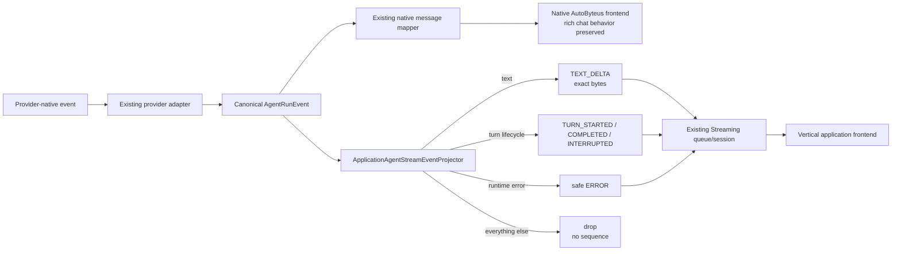

# Design Spec — Minimal Application Agent Text Streaming

## Design Status

`Architecture-review rework after round 16 against stopped source HEAD 3e48c0ea2c9ccabe52c3126f0db799b3865186a3. Framework communication, Socratic integration/fixes, and target-address builders are committed. The unimplemented delta is a clean-cut contraction of the application event contract/projector/consumers to exact text deltas plus minimal turn/error lifecycle after a real mounted Codex journey exposed semantic drift in the broad projector. Round 16 resolved the sibling-return join and requested one bounded Socratic-local sequential-turn admission correction before a fresh gate.`

Implementation remains halted. The worktree contains two implementation-owned uncommitted projector/test edits from the superseded broad model and downstream-owned reports/evidence. They are preserved as evidence, not approved source.

## Current-State Read

Current standard path:

```text
Application frontend
→ ApplicationClient.agentCommunication.connect(address)
→ standard application WebSocket adapter
→ ApplicationAgentCommunicationService
→ ApplicationAgentStreamingService
→ Application Orchestration target/lifecycle authority
→ bound AgentRun / TeamRun event source
→ broad ApplicationAgentStreamPublicEventProjector
→ ordered ApplicationAgentEvent
→ frontend listener
```

The surrounding architecture is healthy and proven:

- Application Orchestration owns binding creation, target authorization, input routing, and terminal lifecycle.
- Communication owns WebSocket readiness/input/session lifecycle and no second event FIFO.
- Streaming owns source attachment, projection, per-consumer sequencing/queueing, terminal drain, and isolation.
- Provider adapters convert AutoByteus/Codex/Claude native traffic into shared internal `AgentRunEvent` values.
- `AgentRunEventMessageMapper` and the native AutoByteus frontend already consume those events successfully.
- artifacts and notifications remain independent; custom backend WebSockets/backend observation remain optional.

The real Socratic run proved READY, one accepted input, provider execution, tools, artifact publication, notification, durable transcript, config, qualitative answer, and cleanup. Native backend observation recorded 135 assistant-text characters. The standard selected-member application stream delivered neither public text nor completion before timeout.

Source comparison found one architectural defect:

- the application projector independently interprets 23 agent and 4 team event families, including aliases, enum normalization, tool/error structures, segment metadata, and an invented `AGENT_RESPONSE_COMPLETED` mapped from AutoByteus-only `ASSISTANT_COMPLETE`;
- the working native path preserves canonical `segment_type`/delta and completes on `TURN_COMPLETED` or idle status;
- Codex and Claude emit canonical text `SEGMENT_CONTENT` plus `TURN_COMPLETED`, but not the application projector's assumed assistant-complete event; and
- the dirty partial projector repair addresses `segment_type`/whitespace symptoms but leaves the duplicate semantic owner intact.

Full evidence and exact sources are in [`investigation-notes.md`](./investigation-notes.md).

## Intended Change

Replace the broad application event surface with one deliberately small vertical-application stream:

```ts
type ApplicationAgentStreamEvent =
  | { type: "TURN_STARTED" }
  | { type: "TEXT_DELTA"; delta: string }
  | { type: "TURN_COMPLETED" }
  | { type: "TURN_INTERRUPTED" }
  | { type: "ERROR"; message: string };
```

The existing `ApplicationAgentEvent` envelope, address semantics, producer attribution, ordering, WebSocket/session protocol, backend subscription API, and lifecycle remain. `producer` tightens to non-null because all v1 public variants are agent-origin events.

Provider adapters remain the sole provider-native interpretation boundary. The application projector consumes the shared internal `AgentRunEvent` boundary and performs only safe selection:

- canonical text `SEGMENT_CONTENT` → exact `TEXT_DELTA`;
- canonical turn lifecycle → same public turn lifecycle;
- runtime error → one stable safe public error; and
- everything else → deliberate drop.

Remove `AGENT_RESPONSE_COMPLETED`, broad agent/team public data maps, tool/thinking/status/team coordination projection, and Socratic tool-state rendering. Use `TURN_COMPLETED` as the sole successful live-draft completion signal. Keep published artifacts as the durable structured/whole business result.

The projector remains an explicit internal extension boundary. Future variants require an observed vertical-application journey and an explicit closed-contract addition; no plugin registry or generic chat accumulator is introduced.

## Relevant Behavior And Production-Path Map

| Behavior ID | Requirement / AC | Existing Production Evidence | Approved Target | Spines |
| --- | --- | --- | --- | --- |
| `BEH-001` | `REQ-001`, `AC-001` | precise agent/team bindings committed | preserve | `DS-001`, `DS-017` |
| `BEH-002` | `REQ-003`–`REQ-005`, `AC-003`, `AC-005`, `AC-006` | standard connection/READY/input works live | preserve | `DS-003`, `DS-004`, `DS-017` |
| `BEH-003` | `REQ-007`, `REQ-016`, `AC-007` | native raw-ID sockets separate | preserve; no application reuse | native path outside application spine |
| `BEH-004` | `REQ-002`, `REQ-006`, `REQ-019`, `AC-002`, `AC-004`, `AC-019` | address/builders/Socratic adoption committed | preserve | `DS-002`, `DS-004`, `DS-017` |
| `BEH-005` | `REQ-008`, `AC-008` | broad projector diverged from working native semantics | five-variant projector over canonical `AgentRunEvent` | `DS-005`, `DS-012`, `DS-018` |
| `BEH-006` | `REQ-012`, `AC-012` | notification refresh succeeds | preserve separate | `DS-009`, `DS-017` |
| `BEH-007` | `REQ-012`, `AC-012` | artifact/durable transcript succeeds | preserve as complete business result | `DS-010`, `DS-017` |
| `BEH-008` | `REQ-010`, `REQ-011`, `REQ-015`, `REQ-016` | v4/Gateway/Host/custom WS implemented | preserve | `DS-008`, `DS-016` |
| `BEH-009` | `REQ-009`, `REQ-013`–`REQ-015` | lifecycle/bounds/backend observer implemented | preserve; change projected item only | `DS-003`–`DS-007`, `DS-011`–`DS-015` |
| `BEH-010` | `REQ-007`, `AC-007` | desktop-only product path | preserve; no auth/mobile work | all application spines |
| `BEH-011` | `REQ-018`, `AC-018` | real Codex text existed but application projection failed | Socratic consumes text/turn/error only and live scenario reruns | `DS-017`, `DS-018` |
| `BEH-012` | scope exclusions | rich chat/accumulator not universal | minimal standard now; future closed variants only with evidence | `DS-018`; deferred work off-spine |

## Relevant Supplemental Task Artifacts

| Artifact | Purpose | Status / Approval |
| --- | --- | --- |
| [`application-agent-communication-contract.md`](./application-agent-communication-contract.md) | exact address/connection/wire/minimal-event/backend-subscription/lifecycle contract | user-approved revised requirements basis |
| [`application-backend-websocket-contract.md`](./application-backend-websocket-contract.md) | optional custom realtime contract | implemented preserved baseline; not changed |
| [`application-communication-boundaries.md`](./application-communication-boundaries.md) | module/entity boundaries and `DS-001`–`DS-016` | user-approved revised basis for `DS-005`/`DS-012`; other spines preserved |
| [`socratic-math-live-journey.md`](./socratic-math-live-journey.md) | exact live UI/provider/artifact journey and rerun criteria | user-approved revised acceptance basis |

## Task Design Health Assessment

- Change posture: `Behavior Contraction + Refactor + Bug Fix`.
- Root-cause classifications: `Boundary Or Ownership Issue` and `Duplicated Policy Or Coordination`.
- Refactor required now: `Yes`.
- Evidence: the broad application projector independently reinterprets semantics already normalized into `AgentRunEvent` and consumed by the native path. This caused observed text/completion divergence.
- Design response: make `AgentRunEvent` the shared internal semantic boundary; reduce the application projector to five explicit selections; remove speculative event types and rich sample rendering.
- Why this is not a provider fix: current Codex/Claude/AutoByteus adapters already emit canonical text/turn events; native output and durable output succeeded; no provider-source change is needed.
- Why this is not a new generic normalizer: the provider adapters plus `AgentRunEvent` already form the shared normalization boundary. Adding a second general normalizer would preserve the same over-design under a new name.
- Intentional deferrals: thinking/tool/team/status application events, generic chat reducer, provider-specific transformation plugins, replay/reconnect, generic business correlation.

## Terminology

- **Canonical internal event**: `AgentRunEvent` after provider-adapter conversion.
- **Application agent stream event**: one of the five closed public variants.
- **Application agent stream event projector**: pure safe selector from canonical internal events to the small public stream; it owns no provider conversion, queue, lifecycle, or UI accumulation.
- **Live draft**: ephemeral frontend text built by appending `TEXT_DELTA`.
- **Durable business result**: published artifact processed/projected by application business logic.

## Legacy / Removal Policy

Policy: `Clean-cut forward-only replacement; no compatibility wrappers.`

Remove in scope:

- `ApplicationAgentRunPublicDataByType` and `ApplicationAgentTeamPublicDataByType`;
- `ApplicationAgentRunPublicEvent` and `ApplicationAgentTeamPublicEvent`;
- public safe-error/segment-kind/status/todo/participant/tool-ref types used only by the broad map;
- `AGENT_RESPONSE_COMPLETED` and its parser/generated/sample/test cases;
- public `SEGMENT_START`, `SEGMENT_CONTENT`, `SEGMENT_END`, status/compaction/token/tool/todo/inter-agent/team/delegation/member-input variants;
- `projectTeam(...)` and broad alias/error/tool/team projection helpers;
- `APPLICATION_AGENT_EVENT_ARRAY_LIMIT` and `APPLICATION_AGENT_EVENT_SUMMARY_LIMIT` if repository search confirms no remaining consumer;
- Socratic tool-status mapping/rendering and obsolete styles/tests; and
- the current uncommitted symptom-only projector/test patch by reimplementing the file from the reviewed design.

Preserve:

- internal `AgentRunEventType` variants and native mapping;
- provider adapters, including native `ASSISTANT_COMPLETE` behavior;
- server connection/subscription errors/close reasons;
- artifact/tool execution itself; only application stream visibility changes;
- target address/builders, connection/input, lifecycle, notification, artifact, custom WebSocket, and backend observer APIs.

Do not add deprecated aliases, dual validators, dual projector paths, fallback completion, or generated-only compatibility exports.

## Persisted Data / State Transition Decision

Decision: `Directly Usable — No Migration`.

| Area | Evidence / Outcome |
| --- | --- |
| bindings/application/artifact rows | unchanged readers, writers, fields, and meaning |
| application event envelopes | ephemeral in-memory/network values only |
| Socratic live draft | memory-only; never durable truth |
| durable lesson transcript | unchanged artifact projection |
| generated packages | rebuilt artifacts, not migrated user data |

No DDL, migration, replay/checkpoint store, event rewrite, compatibility reader, credential, or version-specific persisted branch is allowed.

## Data-Flow Spine Inventory

`DS-001`–`DS-016` remain defined in [`application-communication-boundaries.md`](./application-communication-boundaries.md). `DS-017` remains the full Socratic journey. This revision adds one bounded shared semantic spine, `DS-018`, and revises only the event portions of `DS-005`, `DS-012`, and `DS-017`.

| Spine ID | Scope | Start | End | Governing Owner | Why |
| --- | --- | --- | --- | --- | --- |
| `DS-001` | Primary | application start request | active binding | Orchestration | preserved creation |
| `DS-002` | Primary | business target selection | canonical address | application business + backend builder | preserved address handoff |
| `DS-003` | Primary | frontend connect | READY/open connection | Communication | preserved establishment |
| `DS-004` | Primary | frontend input | bound target accepts | Communication + Orchestration | preserved bidirectional input |
| `DS-005` | Return/Event | canonical runtime event | frontend event listener | Streaming + Communication | minimal application return |
| `DS-006` | Return/Event | binding terminal | connection close | Orchestration + Streaming | preserved lifecycle |
| `DS-007` | Primary/Return | backend subscribe | backend observer | Streaming via Engine Host | same minimal events |
| `DS-008`–`DS-016` | existing primary/return/local | as supplemental inventory | as supplemental inventory | existing owners | unchanged |
| `DS-017` | Primary composite | desktop starts Socratic lesson | durable turn + cleanup | Socratic business composing framework owners | real product validation |
| `DS-018` | Bounded shared semantic | provider-native event | native event and minimal application event | provider adapters for normalization; application projector for safe selection | prevents semantic duplication/drift |

## Primary And Return Spines

```text
DS-017 common request spine:
Desktop user
→ mounted Socratic frontend
→ GraphQL startLesson
→ Orchestration startAgentTeam(no initialInput)
→ builder-backed tutor member address
→ agentCommunication.connect
→ Socratic local turn admission reserved
→ READY
→ sendInput(problem)
→ active Codex tutor turn
```

```text
DS-017 sibling return A — live (no ordering against B):
active Codex tutor turn
→ canonical AgentRunEvent
→ minimal projector
→ TEXT_DELTA(s)
→ TURN_COMPLETED / TURN_INTERRUPTED / ERROR
→ Socratic local live phase
```

```text
DS-017 sibling return B — durable (no ordering against A):
active Codex tutor turn
→ in-turn publish_artifacts tool
→ durable artifact store/handler
→ Socratic lesson projection
→ notification + GraphQL refresh
→ Socratic local durable-observed state
```

```text
DS-017 local join/terminal:
Socratic live phase + durable-observed state
→ one focused in-progress live presentation
→ authoritative durable tutor transcript after success/terminal join
→ release local turn admission only when connection/lesson remain active
→ closeLesson/terminate
→ BINDING_ENDED
→ exact connection/listener/runtime cleanup
```

Return A and return B are causally related only by the application-owned active turn; their transports provide no cross-plane order. The existing pre-input tutor-message count is the only local baseline. A synchronous Socratic-local admission guard prevents a second follow-up/hint from replacing that baseline before the join. No public turn identifier, correlation store, second queue, framework single-flight rule, or generic accumulator is added.

## `DS-018` — Shared Internal Semantics And Consumer Projection



Ownership rule: provider adapters decide whether provider-native traffic becomes an `AgentRunEvent`; the application projector never repairs provider-native traffic. The projector selects application-safe meaning from that canonical boundary; it does not depend on native `ServerMessage` or native frontend handlers.

## Spine Narratives And Main-Line Owners

| Spine | Main subject nodes | Governing owner | Off-spine concerns |
| --- | --- | --- | --- |
| `DS-005` | runtime source → projector → bounded subscription → Communication → frontend connection | Streaming for event acceptance; Communication for network delivery | serialization, metrics, frame bounds |
| `DS-017` | Socratic UI → business backend → Orchestration → tutor → live projector + artifact platform → UI | Socratic owns business sequence; each framework boundary owns its segment | model preflight, generated propagation, evidence redaction |
| `DS-018` | provider adapter → `AgentRunEvent` → native/application consumers | adapter owns provider conversion; projector owns public selection | parity tests, contract generation |

## Ownership Map

| Owner | Owns | Must Not Own |
| --- | --- | --- |
| provider adapters | provider-native parsing and conversion into canonical `AgentRunEvent` type/fields | application public contract, vertical UI, authorization |
| `AgentRunEventMessageMapper` | unchanged native transport mapping | application public projection |
| `ApplicationAgentStreamEventProjector` | five exact projection cases, exact delta preservation, stable safe error, exhaustive deliberate drop | provider aliases, native transport mapping, queue/sequence, response accumulation, lifecycle, plugin registry |
| `ApplicationAgentEventMapper` | unwrap standalone/team-agent source, require producer, delegate agent event to projector; drop non-agent team events | team-event reinterpretation, provider parsing |
| `ApplicationAgentStreamingService` / subscription | target subscription, projector invocation, serialization, queue acceptance/sequence, terminal drain/isolation | provider semantics, WebSocket protocol, UI |
| shared application SDK contracts | five-variant public type and envelope | native/provider fields or broad optional map |
| frontend SDK validator/connection | strict parsing and listener dispatch | event transformation or chat accumulation |
| Socratic tutor session | synchronously admit one local tutor turn, own its private admission handle/baseline/live-durable join, append text, and clean listeners | provider parsing, tool/native rendering, framework projector, cross-application correlation, framework-wide single-flight policy |
| Socratic runtime handlers | validate user input, request one session admission, dispatch GraphQL only when admitted, settle that exact private handle | resetting session state directly, sending after rejected admission, treating renderer disabling as authority |
| Socratic renderer | derive follow-up/hint disabled/help state from session snapshot; keep Close lesson available | admission authority or backend dispatch |
| Artifact Platform + Socratic handler | durable artifact persistence and business transcript projection | live stream transport |
| Communication / Orchestration | existing session/input and target/lifecycle authority | projector semantics |

## Thin Entry Facades / Public Wrappers

- `ApplicationAgentConnection.onEvent(...)` remains a thin typed listener boundary over validated frames.
- `context.agentExecution.subscribeEventStream(...)` remains a backend adapter over the same Streaming owner.
- Neither becomes an event-transformer owner.
- `ApplicationAgentEventMapper` is an internal source-envelope adapter, not a second projector; it only unwraps agent events and producer attribution.

## Off-Spine Concerns

- contract/frontend validation serves the shared contract owner;
- generated/vendor propagation serves package build owners;
- metrics/debug logs record deliberate drops without exposing payloads;
- API/E2E evidence redaction serves live acceptance;
- frame/text limits serve Streaming; only `APPLICATION_AGENT_EVENT_TEXT_LIMIT` remains relevant to delta projection;
- Socratic accessibility/status labels serve application presentation.

No off-spine concern may introduce another provider switch, alias map, event queue, completion rule, or response accumulator.

## Interface Boundary Mapping

| Interface | Subject | Exact responsibility |
| --- | --- | --- |
| provider adapter output | canonical runtime event | emit `AgentRunEvent` with established text `segment_type`/`delta` and turn event types |
| `ApplicationAgentStreamEventProjector.project(event)` | one canonical agent event | return one closed stream event or `null`; throw only for invalid/oversized canonical text delta |
| `ApplicationAgentEventMapper.map(source)` | source wrapper | unwrap agent/team-member event, preserve producer, drop non-agent team source, delegate once |
| `ApplicationAgentEvent` | consumer envelope | sequence/time/scope/address/subject/non-null producer + minimal event |
| `ApplicationAgentConnection.onEvent` | frontend listener | deliver validated envelope |
| `subscribeEventStream` observer | backend listener | deliver the identical envelope |
| Socratic `tryBeginObservedTurn` | one application-local input attempt | atomically claim only `available`, capture the current durable baseline, return a private handle, or reject without mutation |
| Socratic `handleEvent` | focused UI state | append text, complete/fail turn, ignore stale sequence, participate in the current admitted join only |

Concrete projector contract:

```ts
class ApplicationAgentStreamEventProjector {
  project(event: AgentRunEvent): ApplicationAgentStreamEvent | null;
}
```

No `projectTeam(...)` exists. TeamRun agent wrappers are unwrapped by `ApplicationAgentEventMapper`; team-domain events are dropped before projection.

## Existing Capability Reuse Check

| Need | Existing capability | Decision |
| --- | --- | --- |
| provider normalization | current provider adapters + `AgentRunEvent` | reuse unchanged |
| native rich chat | native mapper/frontend | preserve unchanged |
| public safety boundary | current application projector location | contract/refactor in place |
| target/session/input/lifecycle/queue | current Communication/Streaming/Orchestration | reuse unchanged |
| durable whole result | artifact platform/application projection | preserve |
| application-specific custom transformation | backend subscription + optional custom WS | preserve escape hatch |
| future public transforms | projector boundary + closed union | extend only with evidence; no registry now |

No new subsystem, general normalizer, provider adapter, registry, queue, store, or gateway is justified.

## Subsystem / Capability Allocation

| Area | Change |
| --- | --- |
| shared application contracts | contract broad event model to five variants; producer non-null |
| frontend SDK | contract exact validator; keep connection API |
| server application streaming | rename/reimplement projector; simplify mapper; keep subscription lifecycle |
| native agent streaming/providers | no production change; parity/regression tests only |
| Socratic frontend | consume minimal events; remove tool/full-response state/rendering |
| built-in generation | regenerate affected shared/frontend SDK vendor/importable outputs |
| API/E2E | rerun minimal contract/socket/package plus real Socratic journey |

## Draft And Final File Responsibility Mapping

| Path | Change | Responsibility |
| --- | --- | --- |
| `autobyteus-application-sdk-contracts/src/application-agent-events.ts` | Modify | define only `ApplicationAgentStreamEvent` and contracted `ApplicationAgentEvent` envelope |
| `autobyteus-application-frontend-sdk/src/application-agent-event-validator.ts` | Modify | exact five-variant/non-null-producer validation |
| `autobyteus-server-ts/src/application-agent-streaming/services/application-agent-stream-public-event-projector.ts` | Rename/replace | become `application-agent-stream-event-projector.ts` / `ApplicationAgentStreamEventProjector`; five cases only |
| `autobyteus-server-ts/src/application-agent-streaming/services/application-agent-stream-event-mapper.ts` | Modify | unwrap agent/team-member sources and delegate; drop non-agent team events |
| `autobyteus-server-ts/src/application-agent-streaming/domain/application-agent-streaming-models.ts` | Modify | import contracted type; stop re-exporting removed array/summary limits |
| `autobyteus-server-ts/src/application-communication-limits.ts` | Modify if search confirms | remove application-event array/summary constants; keep text/queue/frame/socket limits |
| provider adapters and `src/services/agent-streaming/agent-run-event-message-mapper.ts` | No production change | existing canonical/native owners |
| projector/mapper/subscription/connection/contract tests | Modify/Add | exact projection/drop/sequence/producer/parity/native regression |
| `applications/socratic-math-teacher/frontend-src/socratic-tutor-session.js` | Modify | consume five variants; remove tool-state/full-response dependency; join live/durable sibling returns; add private one-turn admission state/handle and defensive rejection |
| `applications/socratic-math-teacher/frontend-src/socratic-runtime.js` | Modify | start `connectLesson(...sendInitialProblem: true)` synchronously before the first new-lesson detail render can expose actions; claim before follow-up/hint dispatch; settle only the returned handle; never call GraphQL on denial; invalidate on close/selection/disposal |
| `applications/socratic-math-teacher/frontend-src/socratic-renderer.js` + styles | Modify | remove tool status; render focused live text; defer only newly durable tutor rows until the local join; derive disabled/help state; preserve Close lesson |
| focused Socratic session/runtime/renderer/browser tests | Modify | live/durable convergence plus double-follow-up, hint/follow-up cross-action, state-specific denial, saved re-enable, request-failure uncertainty, and close invalidation |
| shared SDK/build outputs and Brief/Socratic vendor/importable copies | Regenerate | normal build-owned propagation; no hand-authored divergence |
| `application-backend-websocket-contract.md` / custom WS implementation | No change | separate optional plane |

## Reusable Owned Structures And Tightness

| Structure | Decision | Reason |
| --- | --- | --- |
| `AgentRunEvent` | reuse as shared internal semantic boundary | already produced by all providers and consumed natively |
| `ApplicationAgentStreamEvent` | new tight five-variant union replacing broad maps | every variant serves the approved vertical text journey |
| `ApplicationAgentEvent` | retain envelope; tighten producer non-null | ordering/scope/attribution still required, nullable team-only case disappears |
| application projector | one pure class | explicit safe extension point without registry |
| Socratic live/durable join state | keep application-private; remove `toolStatus`; retain text/completion/error/sequence and add orthogonal `livePhase`, `durableObservedForTurn`, baseline tutor-message count, optional non-blocking `liveWarning`, and private turn admission | handles two reachable sibling returns and prevents baseline overwrite without a generic chat model, store, public turn ID, framework queue, or second queue |

The design deliberately avoids two overlapping complete-response representations. `TEXT_DELTA` is ephemeral incremental content; artifact projection is durable business content.

### Socratic-local live/durable join

`socratic-tutor-session.js` is the only owner of this presentation join. Before each accepted initial/follow-up/hint input it records the current durable tutor-message count, resets `durableObservedForTurn`, and enters an open live phase. Artifact reconciliation sets `durableObservedForTurn` only when the current lesson's tutor-message count increases beyond that baseline. This reuses the existing application-local observation and does not create another identity or persistence mechanism.

The reducer maintains these orthogonal facts:

- `livePhase`: `idle | connecting | ready | streaming | completed | failed | closed`;
- `durableObservedForTurn`: whether a new durable tutor message was observed after the current turn baseline;
- exact accumulated `text`, `lastSequence`, `inputSent`, and the existing completion/error facts; and
- optional `liveWarning`, used only when durable success already exists but the live return interrupts, errors, or closes.

The rendered `status` is derived, never used as the sole state authority. While a live turn is open, `TEXT_DELTA` always remains visibly streamable even when the artifact refresh wins first. To prevent duplicate presentation, only new tutor transcript rows beyond the baseline are temporarily withheld by the Socratic renderer; existing transcript rows and student rows remain visible. The withheld durable data remains in application state and becomes visible atomically when the live side reaches `TURN_COMPLETED`, `TURN_INTERRUPTED`, `ERROR`, or observed close. If live completion wins first, the completed draft remains visible until durable observation, which then atomically reveals the durable row and clears the draft.

| Prior local facts | Input | Required next outcome |
| --- | --- | --- |
| open live; durable not observed | `TEXT_DELTA` | append exact delta; render streaming draft |
| open live; durable not observed | `TURN_COMPLETED` | `livePhase=completed`; retain completed draft while waiting for durable |
| open live; durable not observed | durable tutor-count increment | set `durableObservedForTurn`; retain live presentation; defer only new tutor rows |
| open live; durable observed | later `TEXT_DELTA` | append/render the live delta; remain monotonic and keep new durable row deferred |
| open live; durable observed | `TURN_COMPLETED` | atomically reveal durable row, clear draft, expose saved outcome |
| completed live; durable not observed | durable tutor-count increment | atomically reveal durable row, clear completed draft, expose saved outcome |
| any open/completed live; durable observed | `TURN_INTERRUPTED`, `ERROR`, or observed close | reveal/preserve durable row, clear draft, keep saved outcome, and show a non-blocking safe live warning; do not resend |
| failed/interrupted/closed live; durable not observed | later durable tutor-count increment | upgrade presentation to saved, reveal durable row, clear blocking error, retain only a non-blocking safe live warning |
| saved join | any later same-generation live terminal/close | saved presentation is monotonic; sequence/lifecycle cleanup may advance but cannot recreate a draft or downgrade the durable result |

Explicit lesson selection/unload/reset starts a new session generation and may move the connection presentation to `closed`; it never deletes durable lesson history. No timer, replay, inferred text equality, or content comparison joins the two planes.

### Socratic-local sequential-turn admission

The standard application connection intentionally permits separate pending input request IDs. Socratic does not change that framework behavior. Its focused tutor UX is sequential, so `socratic-tutor-session.js` is the sole application-local admission authority for the one baseline/join slot.

Private admission state:

| Admission | Meaning | Follow-up / hint |
| --- | --- | --- |
| `available` | active lesson/connection and no unresolved locally observed tutor turn | enabled; exactly one synchronous claim can win |
| `dispatching` | an initial/follow-up/hint claim owns the slot while its input request is being attempted | disabled; re-entry rejected before mutation/send |
| `awaiting_join` | the request may be accepted and live/durable sides have not reached the saved join | disabled |
| `uncertain` | a dispatched request promise failed and acceptance cannot be proven false | disabled; preserve baseline/facts and wait for a possible return or close |
| `closed` | lesson/connection/session generation is closed | disabled |

The session exposes an application-private shape equivalent to:

```ts
type SocraticTutorTurnAdmission = {
  readonly accepted: true;
  markDispatchAccepted(): void;
  markDispatchFailed(error: unknown): void;
};

tryBeginObservedTurn(lesson): SocraticTutorTurnAdmission | null;
```

The handle is an object-identity capability held only by the mounted Socratic runtime. Its settlement methods synchronously verify that it is still the current claim; late/stale settlement becomes a no-op. It is not serialized, sent to GraphQL/agent input, exposed in the SDK, compared with stream/artifact data, or used as a turn correlation identifier.

Admission rules:

1. Local input validation happens before claiming. Blank follow-up validation returns without changing `available`.
2. A new initial lesson reserves the slot synchronously before waiting for READY. `sendInput` success moves the same claim to `awaiting_join`; failure moves it to `uncertain` unless the session is already closed or the saved join has already resolved.
3. Follow-up/hint runtime handlers call `tryBeginObservedTurn(state.detail)` exactly once. `null` produces the stable local notice `Wait for the current tutor response to be saved before sending another.` and returns before GraphQL.
4. A successful claim captures the current durable tutor-message count and resets the live/durable facts exactly once. It enters `dispatching`, so a same-tick double click or cross-action loses synchronously.
5. GraphQL resolution calls `markDispatchAccepted()` on that handle only. If live/durable returns already completed the join, the stale settlement is a no-op; it cannot regress `available` or a newer claim.
6. GraphQL rejection calls `markDispatchFailed(error)` on that handle only. Because backend acceptance is not authoritatively false at this boundary, the claim becomes `uncertain`; it is not released and no automatic retry occurs. A later valid live/durable saved join may release it.
7. `streaming`, completed-waiting-durable, durable-waiting-live-terminal, and failed/interrupted-waiting-durable all remain `awaiting_join` (or `uncertain` after request failure). Neither a live terminal alone nor durable observation alone releases the slot.
8. Saved join releases to `available` only when the same lesson and agent connection remain active. Saved plus observed connection close remains `closed`.
9. Close lesson, selection replacement, and iframe disposal synchronously set `closed`, invalidate the handle, disable follow-up/hint, and preserve **Close lesson** dispatch/idempotent cleanup. Late callbacks, clicks, or submits cannot reset state or call GraphQL.

Renderer disabling is advisory/accessibility behavior (`disabled` plus explanatory text); `tryBeginObservedTurn` is the defensive authority. **Close lesson** remains enabled for `dispatching`, `awaiting_join`, `uncertain`, completed-waiting-durable, failed-waiting-durable, and durable-waiting-terminal states. Once close itself is dispatched, ordinary idempotency may prevent a duplicate close click.

## Dependency And Encapsulation Rules

Allowed:

```text
provider adapter → AgentRunEvent
native mapper → AgentRunEvent
application source mapper → ApplicationAgentStreamEventProjector → AgentRunEvent
Streaming subscription → source mapper/projector
frontend validator → shared application contracts
Socratic session → frontend SDK ApplicationAgentEvent
Socratic runtime → Socratic private turn-admission handle → GraphQL dispatch
```

Forbidden:

```text
application projector → Codex/Claude/AutoByteus provider classes
application projector → native ServerMessage / native web handlers
application projector → queue/session/lifecycle/store
Socratic frontend → AgentRunEvent / native protocol / provider payload
Socratic runtime → GraphQL follow-up/hint without successful local admission
Socratic renderer disabled state → admission authority
provider adapters → ApplicationAgentStreamEvent
application event → artifact/file/tool/thinking/full native payload
new general normalizer layered beside AgentRunEvent
```

## Design-Principle And Redundancy Validation

| Check | Result | Evidence |
| --- | --- | --- |
| approved behavior/production reality | Pass | real mounted failure and explicit user simplification drive the delta |
| spine span sufficiency | Pass | `DS-017` covers user→backend→runtime→live/durable→cleanup; `DS-018` adds bounded internal detail |
| ownership | Pass | provider conversion, public selection, queue/session, UI, and durability have separate owners |
| authoritative boundary | Pass | projector consumes canonical `AgentRunEvent`; no provider/native/internal bypass |
| reuse before creation | Pass | existing adapters, event domain, Streaming, Communication, artifacts reused |
| duplicated policy removal | Pass | broad alias/completion/tool/team interpreter removed; native semantics not reimplemented |
| sibling-plane join locality | Pass | Socratic joins two product-reachable returns with its existing tutor-message baseline; no framework store, queue, turn ID, or accumulator |
| one-slot invariant enforcement | Pass | synchronous session admission protects the only baseline at the mounted UI, runtime, and defensive session boundary while leaving the standard protocol unchanged |
| structure tightness | Pass | five variants, non-null producer, no broad optional payloads |
| product reachability | Pass | text streaming/durable artifact are observed; rich native-chat projection rejected as unsupported need |
| off-spine clarity | Pass | validation/generation/metrics/tests serve named owners |
| persisted-data proportionality | Pass | `Directly Usable — No Migration` |
| clean cutover | Pass | removed types/events have no aliases/dual parser/fallback completion |

## Concrete Shape Guidance

Good application consumer:

```ts
connection.onEvent(({ sequence, event }) => {
  if (event.type === "TEXT_DELTA") append(event.delta);
  if (event.type === "TURN_COMPLETED") markComplete();
  if (event.type === "TURN_INTERRUPTED" || event.type === "ERROR") markFailed();
});
```

Bad application consumer:

```ts
// Forbidden: native/provider interpretation and whole-response reconstruction rules.
if (payload.segment_type || payload.item?.type || payload.provider) { /* ... */ }
if (event.type === "ASSISTANT_COMPLETE" || status === "idle") { /* ... */ }
```

Good future extension:

```text
reachable application need
→ one explicit public variant
→ one projector rule
→ contract/validator/generated/parity coverage
```

Bad future extension:

```text
application-supplied arbitrary transformer registry
or pass-through Record<string, unknown>
```

## Backward-Compatibility Rejection Log

| Candidate | Decision |
| --- | --- |
| retain `AGENT_RESPONSE_COMPLETED` beside `TURN_COMPLETED` | Rejected: two completion authorities |
| retain broad maps as deprecated types | Rejected: feature is pre-release; preserves speculative surface |
| make projector accept old aliases and canonical fields | Rejected: recreates second semantic interpreter |
| change Codex adapter to emit application-specific completion | Rejected: wrong ownership and current provider/native behavior works |
| make application projector consume native `ServerMessage` | Rejected: couples application safety boundary to native transport |
| add general shared normalizer above `AgentRunEvent` | Rejected for this scope: existing provider adapters already normalize; unnecessary indirection |
| expose tool/thinking/status now for possible future use | Rejected: no approved reachable vertical-application need |

## Derived Layering

Explanatory only:

```text
Provider-native layer
→ canonical runtime event layer (`AgentRunEvent`)
→ consumer projection layers (native rich / application minimal)
→ transport/session layer
→ vertical presentation or native product presentation
```

Artifacts form a sibling durable plane, not a later stage of the live event transport.

## Change / Refactor Sequence

1. Preserve stopped HEAD and downstream evidence; remove/rewrite only the uncommitted broad-projector partial after implementation authorization.
2. Contract shared source types to `ApplicationAgentStreamEvent` plus the existing envelope with non-null producer; remove broad supporting types.
3. Contract the frontend validator and its exact negative/extra-key tests.
4. Rename/reimplement the server projector with five cases and exhaustive drop behavior; simplify the source mapper to agent-origin events only.
5. Remove unused array/summary projection limits after repository-wide use confirmation; retain text/frame/queue bounds.
6. Add provider-shaped text/completion parity tests and native mapper regression tests without modifying provider/native production source.
7. Update Streaming/connection/backend-observer tests for the contracted event and producer rules; preserve lifecycle/backpressure assertions.
8. Simplify Socratic tutor session/runtime/renderer/state/tests to text/turn/error; remove tool/full-response UI behavior; implement the application-local two-plane join, synchronous one-turn admission, and deterministic order/re-entry permutations defined above.
9. Rebuild shared/frontend SDKs and regenerate Brief/Socratic vendor/importable outputs through existing build owners; verify removed symbols are absent.
10. Run implementation-scoped builds/tests, then source review.
11. API/E2E proportionately reruns contract/socket/package checks and the exact bounded real Socratic/Codex journey; code review handles pass/failure per normal flow.

No provider adapter change, native mapper change, database migration, dual path, or compatibility stage exists.

## Key Tradeoffs

- A five-event API exposes less than the native product, intentionally. Vertical applications gain an easy standard text experience and avoid chat-engine complexity.
- Removing turn IDs/segment IDs from the public event simplifies consumers. Connection order and producer attribution are sufficient for the approved sequential focused experience; richer correlation requires a separate proven use case.
- Stable `ERROR` text sacrifices provider diagnostics at the application boundary. Server logs/native tools retain diagnostics without leaking them to application code.
- Team coordination events are excluded, but whole-team/member text remains possible through producer attribution and target filtering.
- The projector is extensible through code/contract additions, not runtime plugins. This keeps safety and versioning reviewable.
- Artifacts, not an accumulated response event, provide durable complete business output.
- Deferring only the new durable tutor row while a live turn is still open adds a small Socratic-local presentation rule, but guarantees that durable-first execution still demonstrates streaming without permanently duplicating the final answer. The durable data is already held in application state and becomes visible on either live terminal outcome.
- Sequential Socratic input disables follow-up/hint longer than the standard connection technically requires. This is intentional because the sample owns one baseline and one focused response surface; applications with proven concurrent-turn needs require their own correlation/presentation design rather than implicit framework queuing.

## Risks And Mitigations

| Risk | Mitigation / Evidence |
| --- | --- |
| canonical provider text shape differs | real-shaped AutoByteus/Codex/Claude fixtures plus live Socratic rerun; adapters remain existing owners |
| whitespace changed | exact byte-preservation test including spaces/newlines |
| duplicate completion | expose only `TURN_COMPLETED`; drop `ASSISTANT_COMPLETE`; remove old variant |
| whole-team attribution lost | non-null producer tests for static/dynamic member wrappers and selected-member filtering |
| removed event still in generated copy | repo-wide symbol search plus build-owned drift checks |
| rich UI logic remains accidentally | remove tool status/types/styles/tests and assert no removed event names in Socratic sources/outputs |
| broad projector partial contaminates implementation | explicit discard/reimplementation step and source review |
| provider/native regression | no production changes plus focused native mapper/frontend regression/parity tests |
| stream failure reclassified incorrectly | preserve existing per-consumer error/close/isolation state machine |
| live/durable delivery order changes visible state | orthogonal local state, monotonic saved join, and reducer/renderer/browser tests for both orders and terminal permutations |
| durable-first hides streaming or duplicates the final answer | temporarily withhold only new tutor transcript rows; continue rendering deltas; reveal the durable row and clear the draft atomically at the join |
| second user action overwrites the only turn baseline | synchronous session admission, disabled controls, handler guard, private handle settlement, and double/cross-action tests |
| request fails after possible backend acceptance | retain `uncertain`, do not resend/release, allow later saved join or Close lesson |
| late request callback mutates a later turn | object-identity admission handle; stale settlement is a no-op |
| live model nondeterminism masks framework result | deterministic stream assertions separate from qualitative provider assertion; existing retry policy |

## Guidance For Implementation

- Do not edit provider adapter or native mapping production code for this fix.
- Treat `AgentRunEvent` as the canonical internal semantic boundary.
- Reimplement the projector from the contracted five-case table; do not incrementally trim the broad alias/tool/team mapper.
- Preserve `delta` exactly; never `.trim()` it. Drop empty text; fail invalid/oversized text only for the affected consumer.
- Ignore source payloads for turn lifecycle and emit a stable constant message for runtime `ERROR`.
- Drop all non-agent team events. Preserve producer attribution for standalone, team member, and task-agent wrappers.
- Preserve sequence assignment at successful queue acceptance and every existing readiness/terminal/backpressure rule.
- Remove `AGENT_RESPONSE_COMPLETED`; do not replace it with another full-response event.
- Keep Socratic focused: append `TEXT_DELTA`, finish on `TURN_COMPLETED`, and join the independent artifact refresh through the explicit app-local matrix. Durable success wins final presentation; a later live interruption/error/close becomes only a non-blocking warning and never downgrades or duplicates the saved transcript.
- Enforce Socratic's sequential experience in the session, not only the renderer. Claim synchronously before GraphQL; on rejection do not reset the baseline and do not send; settle only the exact private handle; keep Close lesson available.
- Regenerate through normal build scripts; never hand-maintain vendor/importable mirrors.
- Preserve all downstream-owned reports/evidence and the exact live failure context for later API/E2E comparison.
