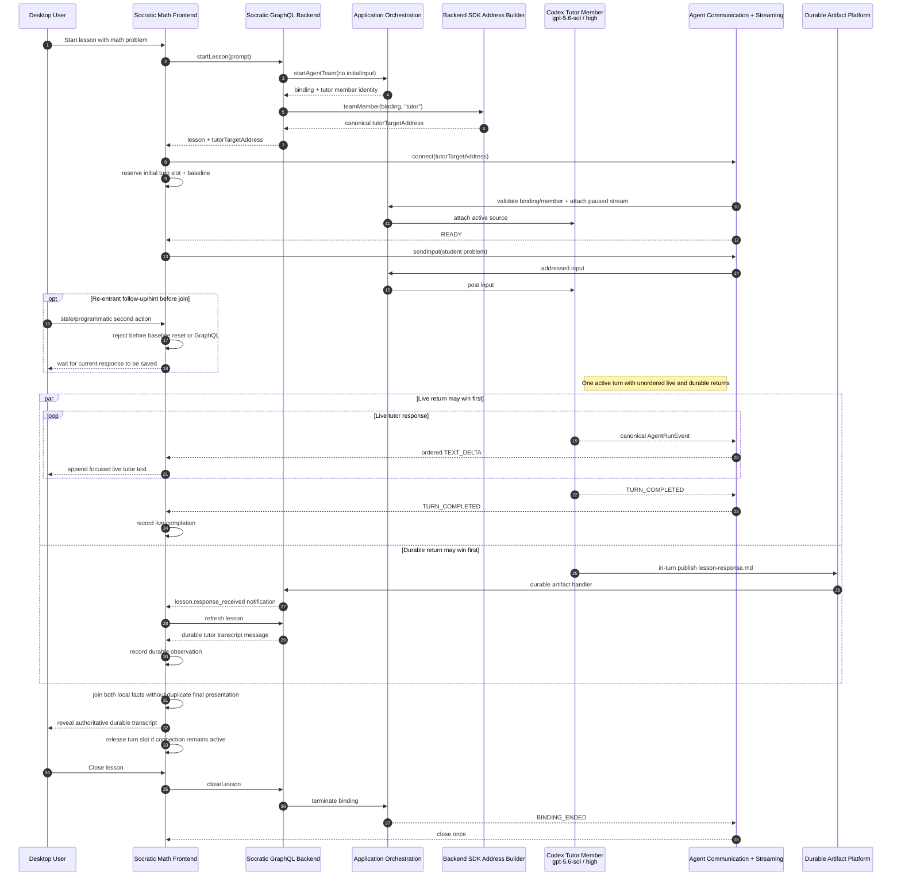

# Socratic Math Teacher Live Journey And Codex Configuration

## Status And Authority

This is a normative intended-behavior supplement to [`requirements.md`](./requirements.md), [`investigation-notes.md`](./investigation-notes.md), and [`design-spec.md`](./design-spec.md). It defines the user-expanded `BEH-011`, `UC-008`, `REQ-018`, `AC-018`, and `DS-017` scope and consumes the separately approved `REQ-019`/`AC-019` target-address builder.

Status: `Architecture round-16 rework at source HEAD 3e48c0ea2c9ccabe52c3126f0db799b3865186a3. Exact configuration, target-builder adoption, connection, lifecycle, and durable artifact behavior are committed. The first real mounted Codex attempt then proved input/provider/tool/artifact/durable paths but failed the broad application event projection. The pending design contracts Socratic to the minimal text/turn/error stream, joins live/durable sibling returns in either product-reachable order, and enforces its one-local-turn-at-a-time presentation invariant before the journey is rerun.`

The previously reported `96.7%` API/E2E confidence remains valid only for the prior deterministic framework scope. It is not the final score for this expanded live-application scope.

## 1. Exact Tutor Runtime Configuration

The phrase dictated as “codex gpt 5.6 solr high” resolves from the installed Codex App Server catalog to this exact configuration:

```json
{
  "runtimeKind": "codex_app_server",
  "llmModelIdentifier": "gpt-5.6-sol",
  "llmConfig": {
    "reasoning_effort": "high"
  }
}
```

`service_tier` is intentionally omitted. “Sol” is part of the exact model identifier; there is no `solr` model or unsuffixed `gpt-5.6` alias.

The source-of-record application-owned agent config is:

`applications/socratic-math-teacher/agent-teams/socratic-math-team/agents/socratic-math-tutor/agent-config.json`

Its `defaultLaunchConfig` currently contains the exact object above while preserving `publish_artifacts` and the current agent instructions. The event-contract delta must not alter it.

Live local evidence on 2026-07-22:

- `codex --version` returned `codex-cli 0.144.6`;
- `codex login status` returned `Logged in using ChatGPT`;
- a real Codex App Server `model/list` request returned `gpt-5.6-sol`;
- that row advertises reasoning efforts `low`, `medium`, `high`, `xhigh`, `max`, and `ultra`; and
- its current catalog default is `low`, so `high` must be passed explicitly and cannot be inferred from the model default.

Model-list visibility proves local catalog/auth readiness, not a successful live turn. `AC-018` therefore still requires an actual run.

## 2. Effective Application Launch Configuration

Socratic Math Teacher uses the required `lessonTutorTeam` execution-resource slot. The application configuration's saved team/member runtime and model values correctly take precedence over bundled agent defaults; this is intentional domain ownership, not friction or a defect. Current committed backend-SDK source accepts neutral `llmConfig` and propagates the application-required reasoning effort into either team preset or member launch. The live journey must still prove the final effective tutor run uses all three requested values rather than inspecting only one input layer.

Current/preserved rules:

1. A fresh live setup saves the tutor member/team default with `runtimeKind: "codex_app_server"` and `llmModelIdentifier: "gpt-5.6-sol"`.
2. `buildConfiguredTeamRunLaunch(...)` already accepts one optional transport-neutral `llmConfig` input and copies it into the resulting preset or each explicit member config without changing precedence for saved runtime/model selections.
3. Socratic Math Teacher passes `{ reasoning_effort: "high" }` through that helper.
4. Run metadata and/or the Codex thread-start boundary must prove the effective tutor member has runtime `codex_app_server`, model `gpt-5.6-sol`, and effort `high`.
5. No Codex-specific field is added to application manifests, persistence, GraphQL platform APIs, or the standard agent-communication protocol.

The committed helper extension is reusable because `ApplicationTeamRunPreset` and `ApplicationTeamMemberLaunchConfig` already own optional `llmConfig`. It closed the backend-SDK propagation seam without creating a Socratic-only launch type and is outside the pending event-contract delta.

## 3. Real Product Journey

The live acceptance journey uses the generated importable package and the mounted desktop application UI, not only package validation or a synthetic runtime emitter.

1. Build Socratic Math Teacher and import/provision its fresh `dist/importable-package` into isolated application data.
2. Configure the required `lessonTutorTeam` slot for the bundled team with the exact Codex runtime/model above and an isolated temporary workspace.
3. Mount the real hosted Socratic Math Teacher frontend and wait for its normal ready state.
4. Enter the bounded student problem `Solve 3x + 5 = 20` and start a lesson.
5. The application backend persists the lesson/student prompt and starts the one-member tutor team **without** launch-time `initialInput`.
6. Application business resolves/narrows the authoritative `ApplicationAgentTeamBinding`, selects static member `tutor`, and calls `createApplicationAgentTeamMemberTargetAddress(binding, "tutor")`. The returned lesson projection includes that exact shared `ApplicationAgentTargetAddress` as `tutorTargetAddress: JSON`; it is `null` when no active usable binding exists. The reusable tutor projection contains no hand-built member-target discriminant or membership fallback.
7. The frontend immediately creates `applicationClient.agentCommunication.connect(address)`, registers event/error/close listeners, and synchronously reserves the Socratic session's one local turn slot before awaiting `ready`. Follow-up and hint are already disabled; Close lesson remains available.
8. Only after READY, the frontend sends the raw stored student problem once through `connection.sendInput({ text, metadata: { lessonId, requestKind: "lesson_start" } })`; stable tutoring/tool instructions remain in the application-owned agent definition rather than a second start-message wrapper. A same-session follow-up/hint attempt cannot replace the baseline or send while this claim is unresolved.
9. The active tutor turn has two sibling return paths with no cross-plane delivery order. The live path appends only ordered application `TEXT_DELTA` values and terminates successfully only on `TURN_COMPLETED`. Independently, the tutor calls `publish_artifacts` for `socratic-math/lesson-response.md` as an in-turn tool action; the artifact path can project, notify, and refresh before later live text/completion, or after it.
10. The Socratic-local session joins those sibling returns using the pre-input durable tutor-message count already maintained for the selected lesson. Live-first keeps the completed draft until the new durable row arrives. Durable-first records the row but temporarily withholds only newly added tutor transcript rows while continuing to render later live deltas; a live terminal event then atomically reveals the durable row and clears the draft.
11. `TURN_INTERRUPTED`, `ERROR`, or an observed connection close before durable success produces the safe failed/incomplete state and never resends input. The same outcome after durable success preserves the authoritative durable transcript and becomes only a non-blocking live warning. A later durable success upgrades an earlier live failure to saved. No tool lifecycle, native/provider payload, generic accumulator, second queue, public turn ID, or correlation store participates.
12. The saved join releases the turn slot only if the lesson and connection remain active, enabling exactly one next follow-up or hint. Closing the lesson remains possible in every unresolved state, terminates the binding, invalidates the local claim, closes once, releases listeners, and cleans isolated application/runtime/workspace data and processes.



## 4. Socratic Frontend State, Two-Plane Join, And Cleanup

The session owns orthogonal application-private live/durable facts plus one local admission state rather than using one display label as authority:

| Fact | Values / Meaning |
| --- | --- |
| `livePhase` | `idle`, `connecting`, `ready`, `streaming`, `completed`, `failed`, or `closed` |
| `durableObservedForTurn` | `true` only after the current lesson's tutor-message count increases beyond the count captured before the accepted input |
| `turnAdmission` | `available`, `dispatching`, `awaiting_join`, `uncertain`, or `closed`; protects the single baseline/join slot |

It retains exact live `text`, `lastSequence`, `inputSent`, completion/error facts, and an optional non-blocking `liveWarning`. `toolStatus` is removed. The rendered status is derived from these facts:

| Local facts / event | Required UI outcome |
| --- | --- |
| idle / connecting / ready | Preserve the current connection behavior and send the initial prompt exactly once only after READY. |
| open live + `TEXT_DELTA` | Append exact ordered text and visibly render it, regardless of whether durable observation has already occurred. |
| `TURN_COMPLETED` before durable | Mark the live draft complete and keep it visible while waiting for the durable row. |
| durable before live terminal | Record durable success, retain the live panel, and temporarily withhold only tutor transcript rows added beyond the baseline. Existing transcript/student rows remain visible. |
| later `TEXT_DELTA` after durable | Continue rendering the delta in the live panel; do not recreate or expose a second final response representation. |
| both durable + `TURN_COMPLETED` | Atomically reveal the new durable tutor row, clear the ephemeral draft, and show saved. |
| durable + later `TURN_INTERRUPTED` / `ERROR` / observed close | Reveal/preserve the durable row, clear the draft, remain saved, and show a safe non-blocking live warning; never resend. |
| failure/interruption/close before durable | Show safe failed/incomplete live state and preserve any partial draft; never resend uncertain input. |
| later durable after live failure | Reveal the durable row, clear the draft/blocking error, upgrade to saved, and retain at most a non-blocking live warning. |
| saved + later same-generation terminal/close | Keep the saved presentation monotonic; cleanup may progress but cannot downgrade saved or recreate a draft. |

This is a small presentation join, not a hidden event transport. Refreshed durable data remains in the application state even while its new tutor row is temporarily presentation-deferred. No content comparison, inferred equality, timeout, replay, framework correlation record, second queue, public turn identifier, or general response accumulator is added.

### Sequential follow-up/hint admission

Socratic is deliberately one locally observed tutor turn at a time even though the standard connection supports distinct pending input requests. `socratic-tutor-session.js` owns the invariant; renderer disabling alone is not authority.

| Situation | Admission / controls | Defensive runtime/session behavior |
| --- | --- | --- |
| active connected lesson after saved join | `available`; follow-up textarea/button and Request hint enabled | exactly one synchronous `tryBeginObservedTurn(lesson)` claim wins |
| initial connection/READY/send or follow-up/hint request dispatch | `dispatching`; follow-up/hint disabled; Close lesson enabled | re-entry returns `null`, preserves baseline/facts, and performs no GraphQL/send |
| request accepted, streaming, completed-waiting-durable, durable-waiting-terminal, or failed/interrupted-waiting-durable | `awaiting_join`; follow-up/hint disabled; Close lesson enabled | no second claim until saved join |
| request promise rejects after claim | `uncertain`; follow-up/hint disabled; Close lesson enabled | acceptance may have occurred; preserve the same baseline, do not resend; later returns may still produce saved join |
| blank follow-up rejected before claim | remains `available` | show validation only; no baseline/reset/send |
| saved join with active connection | `available` | enable exactly one next claim; late settlement of the prior private handle is ignored |
| saved result plus observed connection close | `closed` | preserve durable transcript, disable follow-up/hint, keep lesson close/cleanup path |
| lesson close, selection change, or iframe disposal | `closed` | invalidate current private handle before asynchronous callbacks; no late send/state reset |

The admitted runtime call uses a private object-identity handle with `markDispatchAccepted()` / `markDispatchFailed(error)` settlement. It never leaves the Socratic frontend and is not a public or artifact-correlating turn ID. If admission is denied, the runtime reports `Wait for the current tutor response to be saved before sending another.` and returns before calling either follow-up/hint GraphQL operation.

Selecting another lesson or unloading the iframe closes the current frontend connection and starts a new session generation; durable history remains readable. Selecting an existing active lesson may open a new future-only connection; no replay is invented. Existing follow-up and hint GraphQL operations continue to persist application business input and use the same binding; they retain their direct bindingId-only `AGENT_TEAM_RUN` DTOs for immediate backend `sendInput` and do not fetch a binding solely for builder use. A successful `tryBeginObservedTurn(...)` claim captures the new durable baseline before each such dispatch, and an active frontend connection observes its future tutor events.

## 5. Deterministic And Qualitative Assertions

### Deterministic framework/application assertions

- fresh package import, required-slot configuration, application mount, and GraphQL start succeed;
- source and generated agent configs contain the exact runtime/model/effort;
- effective run metadata/thread-start uses `codex_app_server`, `gpt-5.6-sol`, and `high`;
- the business projection resolves the precise team binding and returns the tutor-member target address through the backend-SDK member builder; builder tests separately prove local binding/member validation and fresh/nonmutating output, while follow-up/hint tests preserve their direct whole-team input DTOs and no-extra-fetch behavior;
- READY is observed before input acceptance or any public event;
- at least one nonempty application `TEXT_DELTA` is rendered with strictly increasing sequence and exact delta bytes;
- `TURN_COMPLETED` is observed for the same connection and is the only successful live-draft completion signal;
- no thinking/reasoning, tool, provider/native, segment-structure, team-coordination, or full-response event is exposed or rendered;
- `publish_artifacts` starts and succeeds, only the allowed lesson-response path is projected, and a durable tutor transcript message becomes readable;
- artifact/notification/live planes remain separate and no cross-plane order is assumed;
- reducer/renderer/browser fixtures deterministically prove live-first, durable-first, partial-live-then-durable, durable-then-interruption/error/close, and failure-then-durable convergence;
- the durable-first fixture visibly renders a later nonempty live delta while withholding only the newly added tutor transcript row, then atomically reveals the durable row and removes the draft at terminal join;
- the live-first fixture keeps the completed draft until durable refresh, then performs the same single final-presentation join;
- durable success is monotonic, a later live failure is a non-blocking warning, an earlier live failure is upgraded by later durable success, and no order causes an automatic resend; and
- initial-turn reservation disables next-turn controls before READY; double follow-up and hint-plus-follow-up attempts during dispatching, streaming, completed-waiting-durable, durable-waiting-terminal, failed-waiting-durable, and uncertain request outcome produce exactly one claim/backend input, never reset the baseline, and keep Close lesson available;
- blank pre-admission validation leaves the slot available, a post-claim request rejection keeps it uncertain, saved join with an active connection enables one next action, and close/selection/disposal invalidates late handles/actions; and
- close/termination/listener/process/workspace cleanup completes exactly once.

### Qualitative live-model assertions

The retained response must be mathematically relevant and Socratic: it asks one focused guiding question or supplies one bounded next step rather than producing unrelated text or an unsolicited full walkthrough. Exact wording, punctuation, token counts, delta boundaries, latency, and the number of reasoning events are not asserted.

Qualitative evidence must include the final rendered tutor text and enough surrounding UI/event metadata to review relevance without recording hidden reasoning, secrets, raw provider payloads, or credentials.

## 6. Environment, Retry, Timing, Cost, And Classification

### Preflight

Before starting the paid/live journey, require all of:

1. `codex --version` succeeds;
2. `codex login status` confirms an authenticated Codex session;
3. live `model/list` contains exact `gpt-5.6-sol` and advertises `high`;
4. the application server/browser test environment can create an isolated data directory, application import, workspace, and loopback listener; and
5. no other test owns the same temporary application/workspace identity.

If any preflight dependency is missing, classify the expanded live scenario `Blocked` and report the exact missing binary, login, model entitlement, browser/runtime dependency, or environment capability. Do not silently substitute another model/runtime/effort or use `OPENAI_API_KEY` as a replacement for the Codex App Server ChatGPT session.

### Bounds

- Run serially: at most one live lesson/binding at a time.
- Use one short algebra problem and one tutor turn per attempt.
- Omit Fast mode/service tier.
- Allow up to 180 seconds for the live response and 30 additional seconds for durable artifact projection.
- Always close/terminate in `finally`-style cleanup.
- Do not expose repository secrets, arbitrary workspace files, or user data to the prompt; the only expected created artifact is the allowed Socratic lesson file.

### Retry and outcome classification

- No retry for deterministic framework/application failures: wrong effective config, import/mount failure, missing READY, input/address failure, invalid public event, missing path isolation, or cleanup leak. These are `Fail`.
- One clean retry is allowed after a new lesson/run only for an identified transient Codex transport/rate/service failure or a completed but qualitatively non-Socratic/provider-noncompliant turn.
- If the same external service failure persists after the one retry, report `Blocked — external Codex dependency` with both attempts.
- If the provider completes twice but does not follow the required Socratic/tool contract, report `Fail — live model/application behavior`, while keeping framework transport findings separately classified.
- Never retry an input automatically on the same connection after uncertain acknowledgement; that can duplicate accepted work.

The final confidence score must be recalculated for the expanded requirement. The prior `96.7%` remains historical evidence and cannot be copied forward as the final score.

## 7. Source And Generated Propagation

Current committed implementation covers configuration, launch propagation, target-address builders/adoption, connection/input/lifecycle, and artifact convergence. The pending implementation contracts the shared application event API/projector and the Socratic reducer, then regenerates affected package/vendor outputs:

| Authoritative change | Required propagation |
| --- | --- |
| tutor `agent-config.json` | already propagated to generated importable-package agent config; preserve |
| backend-SDK `buildConfiguredTeamRunLaunch` optional `llmConfig` | already propagated to backend-SDK build output, Socratic backend vendor copy, and importable backend vendor copy; preserve |
| backend-SDK target-address builder file/index exports | already propagated to backend-SDK output/declarations and checked-in built-in backend vendor mirrors; preserve |
| shared `ApplicationAgentStreamEvent` / `ApplicationAgentEvent` contracts | shared-contract build output, frontend/backend SDK declarations as imported, built-in frontend/backend vendor mirrors, and generated importable packages |
| server `ApplicationAgentStreamEventProjector` and source mapper | server source/tests only; no provider-adapter or native-mapper changes |
| Socratic lesson runtime/read/GraphQL source | preserve current builder-backed live-journey business behavior |
| GraphQL schema/client query source | already propagated and contract-preserved; regenerate only if the existing build emits it |
| Socratic frontend tutor session/runtime/renderer | consume only `TEXT_DELTA`, `TURN_COMPLETED`, `TURN_INTERRUPTED`, and `ERROR`; remove tool-state and `AGENT_RESPONSE_COMPLETED`; implement the local live/durable join, one-turn admission/handle, disabled/help state, and temporary new-tutor-row presentation filter; regenerate UI/importable output |
| README and tests | repo-local and importable documentation where generated by the existing build; deterministic session/runtime/renderer/browser order-permutation and re-entry coverage is mandatory |

The existing Socratic and Brief Studio builds remain the propagation owners for their own checked-in SDK vendor mirrors; Socratic additionally owns its application outputs. Do not hand-edit generated mirrors as independent sources. Build, validate, and perform byte/normalized-declaration drift checks after the event contract/projector/consumer sources stabilize.

## 8. Persistence And Compatibility

Decision: `Directly Usable — No Migration`.

The exact launch defaults, target-address builders/projection, contracted stream event union, and live frontend state add no database column or stored-format change. Existing lesson/binding/artifact records remain directly readable. Connection/delta state is memory-only and no replay, compatibility reader, schema migration, correlation store, credential, or mobile behavior is added.

Socratic's live reducer remains application-specific in this ticket, and its existing launch-to-lesson correlation remains application-owned. Neither is promoted into a framework abstraction until additional vertical-application evidence establishes a stable reusable contract.
