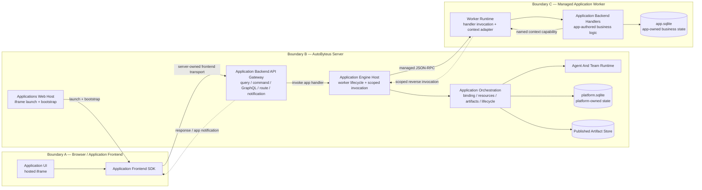
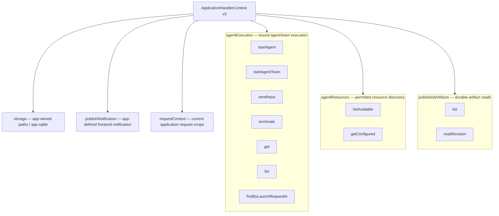
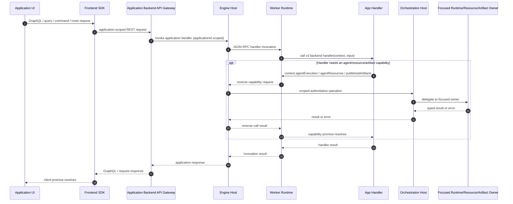
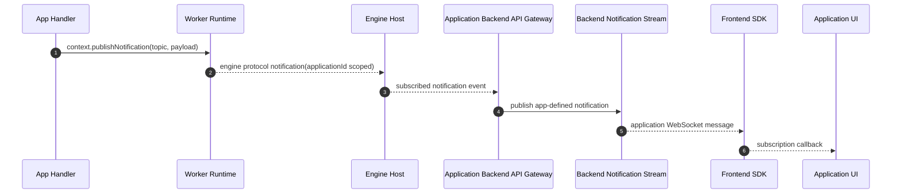
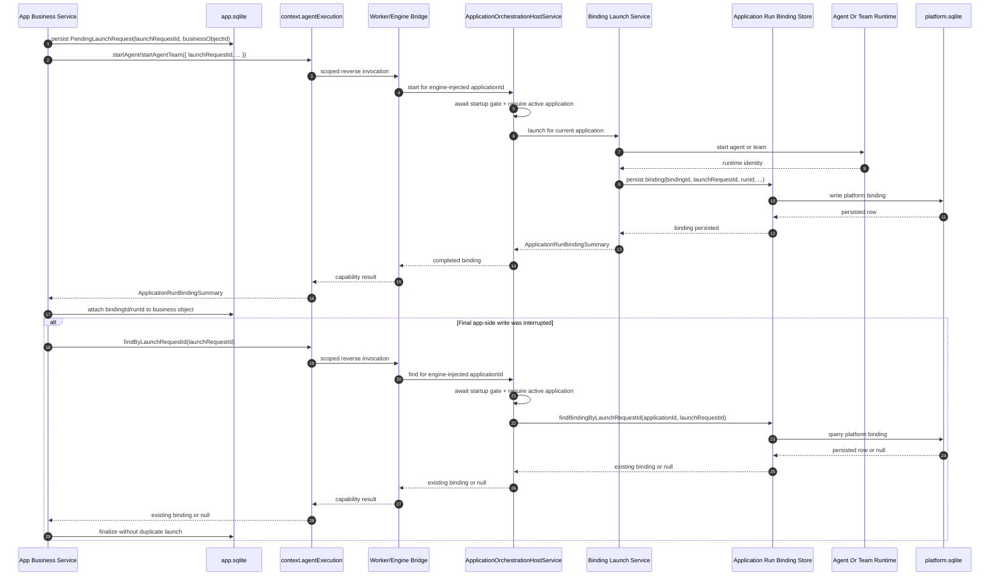
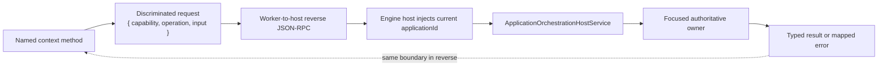
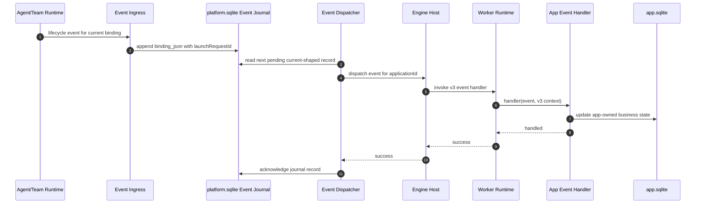
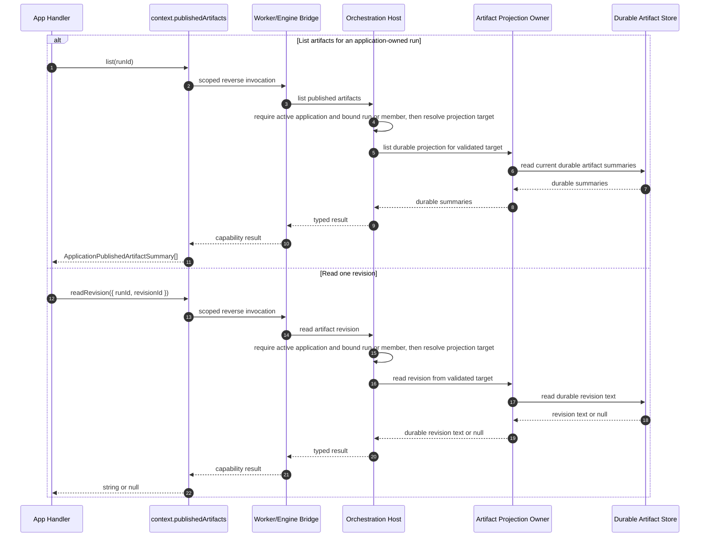
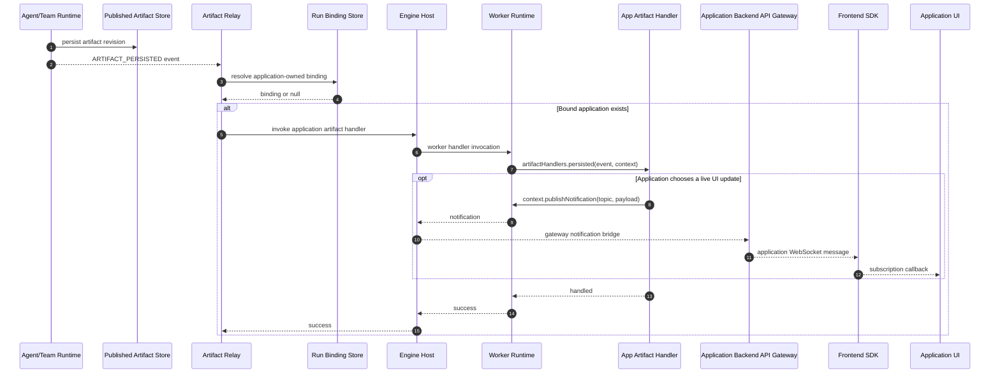
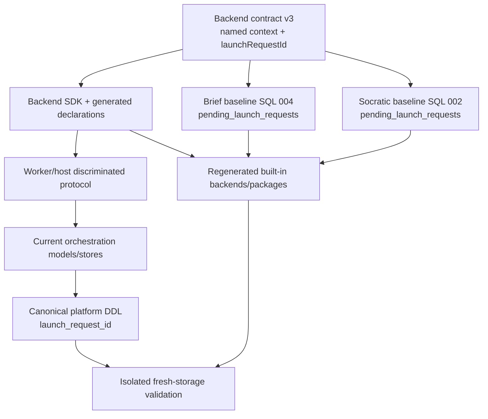

# Application Architecture Boundaries And Data-Flow Spines

**Status:** Implemented target visualization. It applies the user-approved
API-gateway name to the finalized preserved framework baseline and the completed
clean-cut source, test, and documentation rename in this ticket.

**Purpose:** Visualize the application frontend, AutoByteus server, application
worker/backend, orchestration, runtime, and storage responsibility boundaries.

**Approval applicability:** `N/A` — this is a user-requested Mermaid
visualization of the approved target name and finalized preserved framework
behavior; it adds no new behavior.

**Authoritative behavior:** [`requirements.md`](./requirements.md)

**Authoritative structure:** [`design-spec.md`](./design-spec.md)

## Reading The Architecture

There are three externally visible execution areas, with deeper server-owned
subsystems behind them:

1. **Application frontend:** an iframe UI using the frontend SDK. It talks to the
   AutoByteus server gateway; it does not call the worker, orchestration services,
   agents, teams, or databases directly.
2. **AutoByteus server:** hosts the frontend, exposes gateway transport, owns the
   worker lifecycle, validates application scope, dispatches named context
   capabilities, and owns orchestration/runtime access.
3. **Application worker/backend:** runs app-authored handlers in a separate,
   managed Node worker process. It may keep worker-local state while alive, but
   the server owns starting, stopping, invoking, and scoping it.

The worker boundary is not a second public application server. It is a managed
execution boundary behind the AutoByteus server.

## Macro Responsibility Boundaries

### Responsibility Table

| Boundary / Module | Owns | Must Not Own Or Bypass |
| --- | --- | --- |
| Application UI / frontend SDK | UI state, app request construction, response/notification consumption | Worker lifecycle, raw orchestration services, runtime authorization, direct DB access |
| Application backend API gateway | Frontend-facing request/response transport and app-defined notification delivery | App business logic, agent/team control policy, direct worker implementation details |
| Application engine host | Worker start/stop/readiness, handler invocation, application scoping, reverse-call dispatch | Agent/team business semantics or direct persistence logic |
| Worker runtime | Load v3 backend, invoke handler, construct context, map named capabilities to reverse RPC | Server orchestration policy, cross-application selection, public frontend transport |
| Application backend handler | App business logic and app-owned state | Direct server service imports, raw agent/team services, platform DB access |
| Application orchestration | Resource resolution, launches, bindings, lifecycle, input, termination, artifact access | App-specific business-object persistence or frontend rendering |
| Agent/team runtime | Execute agents and teams | Application UI transport or app business correlation |
| `platform.sqlite` owners | Binding, lifecycle, configuration, platform projections | App-authored business tables |
| `app.sqlite` owners | Application business state and launch-request/business-object correlation | Platform binding/lifecycle state |

### Concrete Module Map

| Logical Boundary | Repository Module / Principal Owner | Allowed Direction |
| --- | --- | --- |
| Application UI | `autobyteus-web` hosted iframe plus `autobyteus-application-frontend-sdk` | Calls only server REST/WebSocket gateway surfaces |
| Frontend transport | `autobyteus-server-ts/src/application-backend-api-gateway` / `ApplicationBackendApiGatewayService` | Validates app scope, invokes engine, returns responses, fans out backend notifications |
| Worker lifecycle and IPC | `autobyteus-server-ts/src/application-engine` / `ApplicationEngineHostService` | Gateway or orchestration → managed worker; scoped worker reverse calls → orchestration |
| App-authored backend | Installed application's contract-v3 backend loaded by `application-worker-runtime.ts` | Receives handler calls; uses only `ApplicationHandlerContext` and app-owned storage |
| Agent/team and artifact facade | `autobyteus-server-ts/src/application-orchestration` / `ApplicationOrchestrationHostService` | Receives app-scoped engine calls and delegates to focused owners |
| Agent/team execution | Server agent/team runtime services | Receives validated orchestration requests; emits lifecycle/artifact events |
| Platform persistence | Application orchestration/storage stores in `platform.sqlite` | Persists bindings, lifecycle journal, configuration, and projections |
| Application persistence | Per-application `app.sqlite` under the server-provided application storage root | App backend owns its business schema and correlation state |

## Target Backend Context Boundary

`runtimeControl` is absent. The three named capabilities are public façades; the
server's existing focused orchestration services remain the behavioral owners.

## Frontend Request, Handler Capability, And Return Spine

This sequence also shows how a GraphQL result returns. The original gateway
request remains pending while the handler may perform server-owned context calls.

**Invariant:** the UI talks to the gateway only. A handler context call crosses
the worker/server boundary through the engine host and cannot choose another
`applicationId`.

## Backend Notification Return Spine

This is an app-defined, live, non-durable frontend update path. It is not the
future agent/team output-stream API.

If no frontend is subscribed, the message is dropped. There is no persistence,
queue, or replay.

## Launch Request And Ambiguous-Handoff Recovery Spine

`launchRequestId` is an application-created correlation ID for one request to
launch an agent or agent team. It is not a runtime `runId`, binding ID, process
launch ID, or LLM/user intent.

**Invariant:** `findByLaunchRequestId` is recovery lookup. It does not make
repeating `startAgent` or `startAgentTeam` idempotent.

## Worker/Host Capability Dispatch Spine

Unknown capability/operation combinations fail at this boundary. The protocol is
an exhaustive union, not an untyped `action: string` bag.

## Durable Lifecycle Event Return Spine

Only the v3 `binding_json.launchRequestId` shape is written and hydrated. There
is no old-JSON transformation, dual read, or database compatibility path.

## Published Artifact Read Spine

The application frontend can receive artifact-derived data through a normal
backend response or an app-defined notification. It does not read the artifact
store directly.

## Published Artifact Relay And Optional UI Update Spine

Artifact persistence first belongs to the runtime/artifact subsystem. The live
relay then calls the application backend; the backend independently decides
whether the UI needs a notification. Missed live relay state is recovered with
the durable `publishedArtifacts` read capability shown above.

The artifact relay is best-effort live delivery; the artifact store remains the
durable source for later reads.

## Forward-Only Source And Fresh-Schema Context

The application feature is unreleased. This is a source/schema-definition
cutover, not a rollout migration.

Explicitly absent from this spine:

- a platform schema-version advance;
- an old-to-new data transform;
- appended rename SQL;
- an app-migration checkpoint redesign;
- old/new dual reads or writes;
- runtime reset, rejection, or deletion behavior for old pre-release storage.

The backend definition contract advances to v3 only because compiled backend
code and the handler context change incompatibly. It is a forward code-contract
marker, not a database migration or compatibility layer.

## Communication Boundary Summary

| Information | Producer | Boundary Crossed | Consumer / Return Path |
| --- | --- | --- | --- |
| Frontend GraphQL/query/command/route | Application UI | Frontend SDK → backend API gateway | Worker handler result returns API gateway → frontend SDK → UI |
| Named handler-context capability | App backend handler | Worker reverse RPC → engine host | Orchestration result returns host → worker → handler |
| Agent/team lifecycle | Runtime | Ingress → durable platform journal → engine worker | App event handler; acknowledgment returns to journal |
| Durable artifact list/revision | Artifact store/projection | Orchestration → engine/worker | App handler; optionally included in frontend response/notification |
| Live published-artifact event | Agent/team runtime | Artifact relay → engine/worker | App artifact handler; durable recovery uses `publishedArtifacts` |
| App-defined notification | App handler | Worker → engine/gateway | Frontend SDK → application UI |
| Live agent output for application UI | No supported producer/contract in this ticket | N/A | Deferred follow-up; must not be tunneled through artifact or notification APIs |

## Forbidden Boundary Shortcuts

- The application UI must not call the worker, orchestration service, agent/team
  runtime, or databases directly.
- App backend code must not import server orchestration/runtime services.
- The worker must not accept caller-selected cross-application scope.
- Engine-host dispatch must not bypass `ApplicationOrchestrationHostService` for
  business operations.
- Current stores and baseline SQL must not contain old-schema fallback logic.
- Streaming must not be smuggled into `publishNotification` or durable artifact
  reads as part of this naming ticket.
