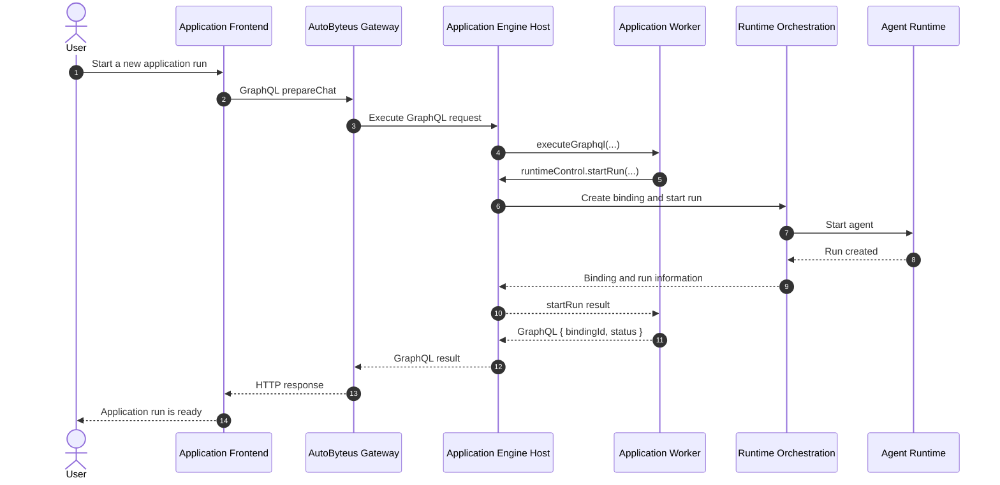

# Mermaid Diagram Viewer Demo

Open this file in **Preview** mode. Hover over the diagram to reveal the expand control, then open it to test zoom, pan, Fit, and Escape-to-close.

## Expected experience

- In Preview mode, the diagram is rendered rather than shown as source code.
- On desktop, hover over the diagram to reveal the compact expand icon.
- The expanded viewer provides zoom out, Fit, zoom in, and close controls.
- Press `Escape` to close the viewer.
