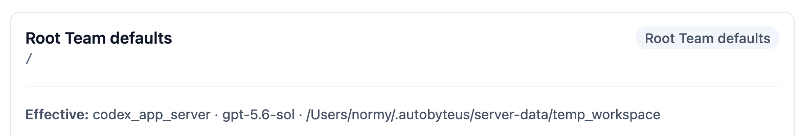
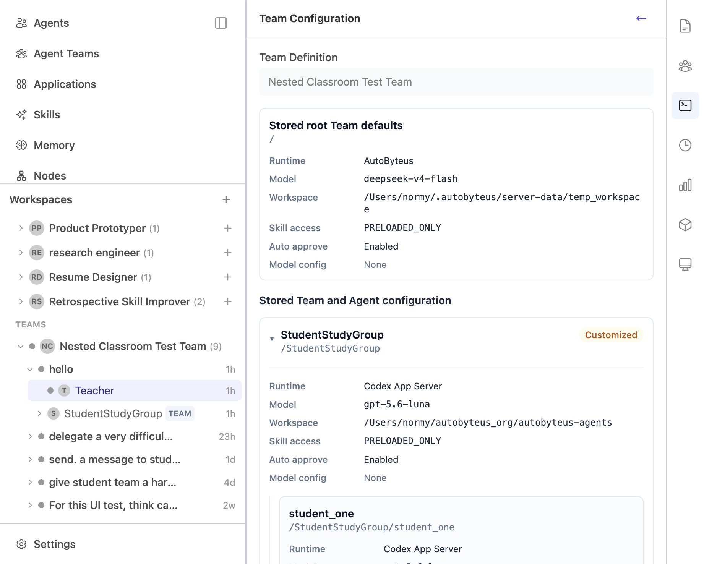

# Hierarchical TeamRun Launch Configuration — UI/UX Specification

## Status (`Draft`/`Requirements-ready`/`Refined`)

`Refined — user-approved through SR-012; production-reachability clarified in SR-014` — the user-approved rule remains **configure and inspect through one form**, with stored values shown through the same locked controls. SR-013's distinct editable/stored capabilities and producer-grounded schema-drift fallback remain. Synthetic API/E2E fields are not product UI: `ordinary_prompt`/`multiline_prompt` were invented by mutating browser catalog state and arbitrary GraphQLJSON, while the current Codex Luna catalog emits no free-text field. SR-014 removes the CR/LF-specific IR-012 complexity and forbids non-reachable fixture fields from defining appearance or blocking acceptance.

## UX Goal

Add editable global launch configuration to every nested Team **without redesigning the existing Team launch form**, and inspect an existing TeamRun through that same form in read-only mode.

The root experience remains visually equivalent to the current `origin/personal` form. The hierarchy feature is additive: when the existing member-override area is opened, each nested Team gains a compact disclosure containing the same launch controls. After launch, Settings preserves that hierarchy and those controls, populated from the immutable stored snapshot and disabled against editing. Internal configuration-model detail must not become steady-state visual noise.

### Governing UX Principles

1. **Preserve the familiar root form.** Team Definition flows directly into Runtime, model/model configuration, Workspace Directory, Auto approve tools, and the existing member-override disclosure.
2. **Add nested capability where the hierarchy already appears.** Extend the existing nested-Team group instead of introducing a second top-level design language.
3. **Progressively disclose complexity.** Root controls remain visible; the existing member section and individual nested-Team editors are collapsible.
4. **Show controls, not duplicated summaries.** An expanded editor's controls are the effective-value presentation. No separate runtime/model/workspace summary is rendered.
5. **Expose only actionable state.** Nested scopes show `Inherited` or `Customized`; `Reset` appears only when it can act. The root has no analogous badge because it cannot inherit or reset to a parent.
6. **Keep canonical identity in the model.** The root address `/` is never rendered in the ordinary form. The existing nested placement address may remain in the nested group header for hierarchy disambiguation; no new address row or root-equivalent chrome is added.
7. **Preserve behavior and accessibility.** Simplification must not remove control labels, scoped error association, keyboard disclosure, disabled state, or loading/retry feedback.
8. **Configure and inspect through one form.** A stored TeamRun is not a different product object to the user. Its Settings view uses the same form structure and controls, simply read-only and driven by stored truth.
9. **Separate data authority from visual language.** Stored snapshots must remain immutable and independent of current definitions, but that distinct data contract must not create a second card-based UI.
10. **Require a production producer.** A field or state may govern this UI only when a named supported catalog/launch path can create it for a normal user. Type-level possibility, direct JSON injection, or browser-state mutation is not a product journey.

## Baseline Evidence

### Current `origin/personal` root form — visual baseline to preserve

Rendered from the local `personal` checkout at `8d6b06b8cf15d1f355be86b02ef233a111998f07` against the live local server. Static comparison found no relevant workspace-config UI changes between that checkout and `origin/personal@87b1b584592be95b1c8ee076f1d0ab3986a13f18`.


Baseline characteristics:

- no root wrapper card;
- no “Root Team defaults” title or badge;
- no root canonical address `/`;
- no effective-configuration summary;
- controls begin immediately after Team Definition;
- one compact `Team Members Override (N)` disclosure;
- sticky Run Team action remains separate from the scrolling form.

### Current `origin/personal` nested-Team group — extension point


The existing nested group already provides hierarchy indentation, Team name, `TEAM` marker, placement address, and descendant Agent controls. The target adds the Team's own global controls inside this group; it does not replace the surrounding member-tree visual language.

### Rejected DR-003 presentation



The user rejected the root title/badge, rendered `/`, divider, and effective summary as duplicate information. None is retained in the target.

### `origin/personal` selected-TeamRun behavior — interaction baseline to restore

Source and focused-test comparison is recorded in [`solution-evidence/stored-team-settings-origin-personal-source-audit-20260825.txt`](solution-evidence/stored-team-settings-origin-personal-source-audit-20260825.txt).

In `origin/personal`:

- `RunConfigPanel` sends a selected existing TeamRun to `TeamRunConfigForm`;
- it sets `readOnly=true` rather than selecting a different visual component;
- Team Definition, root controls, `Team Members Override (N)`, and Agent controls remain the same;
- actual controls are disabled, disclosures remain operable, and mutation events are ignored;
- no `StoredTeamRunConfigForm`, `StoredTeamRunConfigTree`, or `StoredLaunchConfigurationCard` exists.

The old frontend cannot live-render a current V2 run against the user's current Electron server because its strict transport parser expects schema V1. This cross-version limitation does not affect the source/test evidence about the old presentation.

### Rejected stored-TeamRun presentation — live current evidence



This live reproduction used the user's running Electron server and the integrated frontend: Temp Workspace -> Nested Classroom Test Team -> `hello` -> Teacher -> Settings. The ticket-created surface introduces “Stored root Team defaults,” `/`, a key/value card, “Stored Team and Agent configuration,” and nested address-heavy cards. It is a separate visual language and is rejected.

## Related Requirements And Acceptance Criteria

- Behaviors: `BEH-001`, `BEH-002`, `BEH-003`, `BEH-009`, `BEH-010`
- Requirements: `R-001`–`R-010`, `R-038`–`R-044`
- Acceptance criteria: `AC-001`–`AC-008`, `AC-031`–`AC-038`
- Preserved behavior: root -> nearest containing Team -> exact Agent resolution; root-only teams require no new interaction; root/nested edits use the same draft and launch lifecycle; stored Settings remains immutable and independent of current definitions.

## Users / Personas / Contexts

- **Ordinary Team launcher:** selects a Team, chooses root runtime/model/workspace, optionally customizes a nested Team, and runs.
- **Advanced hierarchy launcher:** configures multiple nested levels and exact Agent overrides.
- **Read-only run inspector:** sees stored effective settings without editable controls.
- **Keyboard/screen-reader user:** traverses actual controls and nested disclosures without relying on color.
- **Narrow desktop/Electron user:** uses the same desktop hierarchy in a constrained configuration column; mobile retains its separate root-only setup.

## User-Journey Inventory

| Journey ID | User / Context | Starting State | User Goal | Completion State | Related Requirement / Acceptance-Criteria IDs |
| --- | --- | --- | --- | --- | --- |
| UXJ-001 | Root-only launcher | New root-only Team draft | Configure and launch as before | Root launch succeeds with no hierarchy-specific chrome or extra interaction | R-001–R-004; AC-001–AC-003 |
| UXJ-002 | Nested-Team launcher | New hierarchical draft; nested Team inherits | Find a nested Team and inspect its global settings | Nested editor opens with effective inherited values in the real controls | R-005–R-008; AC-004–AC-006 |
| UXJ-003 | Nested-Team launcher | Expanded inherited nested editor | Customize one or more Team-level fields | Header state becomes `Customized`; subtree resolves from the edited Team | R-007–R-008; AC-005–AC-006 |
| UXJ-004 | Nested-Team launcher | Customized nested Team | Return the whole Team scope to parent inheritance | Override is removed, controls recompute, state returns to `Inherited`, Reset disappears | R-009–R-010; AC-007 |
| UXJ-005 | Advanced launcher | Multi-level Team tree | Configure a deeper Team and Agent | Indentation/disclosures preserve containing-Team context and exact Agent override behavior | R-010–R-015; AC-008–AC-012 |
| UXJ-006 | Locked/read-only/error context | Draft cannot safely edit or scope dependency failed | Understand state and recover when possible | Controls remain legible, correctly disabled, and scoped retry/error feedback is available | R-038–R-041; AC-031–AC-034 |
| UXJ-007 | Existing TeamRun inspector | Existing TeamRun/member selected; event view visible | Inspect exactly how the TeamRun was configured | Same form/hierarchy opens read-only with exact stored values; no alternate card inspector | R-042–R-044; AC-035–AC-038 |

## Journey Details

### UXJ-001 — Preserve the root flow

1. User selects **Run** for a Team definition.
2. The form renders the existing sequence: Team Definition -> Runtime -> model/model configuration -> Workspace Directory -> Auto approve tools -> Team Members Override.
3. No root scope heading, state badge, address, wrapper summary, or divider is inserted.
4. Root-only Teams show no empty nested placeholder and require no additional click.
5. User launches with the existing sticky Run Team action.

### UXJ-002 — Inspect a nested Team

1. User opens the existing **Team Members Override (N)** disclosure.
2. Agent items and nested-Team groups appear in their existing hierarchy order.
3. A nested Team header uses the existing Team group identity treatment and adds one actionable state: `Inherited` or `Customized`, plus a disclosure chevron.
4. Nested Team disclosures are collapsed initially to keep the hierarchy scannable.
5. User expands a nested Team.
6. The Team's actual runtime/model/model-config/workspace/auto-approve controls render directly; there is no effective summary above or below them.
7. In inherited state, each control displays its current effective parent-derived value.

### UXJ-003 — Customize a nested Team

1. User changes any supported nested-Team control.
2. The value updates in place with no extra confirmation screen.
3. Header state changes from `Inherited` to `Customized`.
4. A compact **Reset** action appears in the header.
5. Descendant Team/Agent controls that still inherit recompute normally; no duplicate “customized fields” summary is added.

### UXJ-004 — Reset a nested Team

1. User activates **Reset**.
2. The full nested-Team override is removed.
3. Workspace authoring/loading/error state for that scope follows the approved atomic reset behavior.
4. Controls show the recomputed parent-derived values.
5. State returns to `Inherited`, and Reset disappears.
6. Expansion remains open so the result is visible.

### UXJ-007 — Inspect an existing TeamRun through the same form

1. User selects an existing TeamRun and focuses any stable member, such as Teacher.
2. User activates the existing Settings/Edit Config button.
3. The `Team Configuration` panel opens with the same structure used before launch: Team Definition -> root controls -> `Team Members Override (N)` -> nested Team/Agent controls.
4. Values come from the immutable stored `TeamRunConfigurationView`, including its stored topology; the view does not consult the current Team definition or draft store.
5. Runtime/model/model-specific/workspace/auto-approve controls are the same visual controls but disabled. The read-only explanation is visible, Run is absent, and Reset/edit actions are absent.
6. `Team Members Override (N)`, nested-Team disclosures, and model Advanced disclosures remain operable so stored values can be inspected.
7. For settings emitted by a supported catalog and persisted through the normal launch path, representability is evaluated per field/value. Current controls remain for exact representable values; a genuinely historical removed/stale setting appears once as an exact compact fallback. Invented free-text fields do not appear in this journey or define its layout.
8. Returning to the event view leaves the stored snapshot unchanged.

## Screen / Surface / Component Inventory

| Surface / Component | Purpose | Entry Conditions | Important States | Exit / Next Action |
| --- | --- | --- | --- | --- |
| `RunConfigPanel` | Selects the shared Team configuration form and optional sticky launch action | New draft or stored TeamRun selected | editable, pending, stored-read-only, repair/error | Run or return to event view |
| Root portion of `TeamRunConfigForm` | One visual owner for root controls in editable and stored modes | Editable or stored configuration view present | editable, disabled/read-only, loading/error, unavailable historical value | Continue to members, Run, or return |
| `Team Members Override (N)` disclosure | Existing entry to hierarchy detail | Team has members | collapsed/expanded | Inspect Agent/nested Team |
| Nested Team header | Identify and operate one nested Team scope | Nested Team in definition tree | inherited/customized, collapsed/expanded, reset available | Expand/collapse/reset |
| Nested Team editor | Edit global configuration for one subtree | Nested disclosure expanded | inherited values, customized values, loading/error, disabled/read-only | Edit, reset, inspect descendants |
| `MemberOverrideItem` | Exact Agent override | Agent placement visible | global/default/customized, disabled/read-only | Edit Agent override |
| Sticky Run Team footer | Launch current exact draft | Editable draft selected | enabled/disabled/pending + blocker | Launch |

There is deliberately **no standalone stored configuration form/tree/card component in the target visual architecture**. Reusable data/view adapters may differ, but the rendered form owner and field/hierarchy components are shared.

## Interaction And State-Transition Specification

| Scenario / State | User Action Or Trigger | Immediate Feedback | Resulting UI State | Data / Side Effect | Next Available Actions |
| --- | --- | --- | --- | --- | --- |
| Member hierarchy collapsed | Open `Team Members Override (N)` | Chevron rotates | Existing Agent/nested tree becomes visible | None | Inspect item or close |
| Nested Team collapsed/inherited | Expand nested header | Chevron/`aria-expanded` updates | Controls become visible with effective values; no summary row | None | Edit or collapse |
| Nested Team field edit | Change runtime/model/config/workspace/auto-approve | Control updates | Header becomes `Customized`; Reset appears | Typed exact-address Team override edit | Continue, reset, launch |
| Nested Team reset | Activate Reset | Values recompute in place | Header becomes `Inherited`; Reset disappears; stays expanded | Atomic scoped reset | Edit again or collapse |
| Parent edit | Change root/ancestor value | Affected inherited controls update | Nested scope remains `Inherited` unless it has its own override | Existing immutable draft replacement | Continue or launch |
| Loading | Runtime catalog/workspace operation starts | Scoped loading treatment | Only unsafe controls disabled; values remain visible | Existing store operation | Wait |
| Recoverable error | Scoped catalog/workspace operation fails | Inline message and Retry at affected scope | Other scopes remain usable where safe; Run blocked if needed | Existing error state | Retry/edit |
| Locked/read-only | Run starts or stored run selected | Controls disable without disappearing | Same visual hierarchy; no editable Reset | None | Inspect/navigate |
| Existing TeamRun Settings | Activate Settings from focused member | `Team Configuration` and Back appear | Shared form receives exact stored view; Run/Reset absent; controls disabled; disclosures operable | No draft/store mutation | Inspect or return |
| Stored runtime/model/workspace unavailable | Open corresponding stored scope | Exact stored identifier/value remains visible with compact unavailable note | Other shared controls remain unchanged and read-only | No substitution or normalization | Continue inspection |
| Supported model-schema drift | Open Advanced for a run written from a supported catalog before its emitted enum/schema changed | Representable values use normal disabled controls; genuinely historical removed/stale values use one compact exact fallback row | No supported product-originated field disappears or displays a different/default value | No mutation; comparison is display-only | Continue inspection |
| Stale topology repair | Launch detects stale subject | Existing localized repair notice | No workspace registration/create for rejected attempt | Existing atomic repair | Review form and retry |

## Markdown Wireframes / Visual Structure

### Root — target equals the original personal-branch form

```text
Team Definition
[ Nested Classroom Test Team                         ]

Runtime
[ AutoByteus                                      v ]
Selects the runtime backend used by this team run.

Default LLM Model (Global)
[ Select a model                                  v ]
This model will be used by all members unless overridden.

[ model-specific controls only when the model exposes them ]

Workspace Directory
[ Existing                  | New                    ]
[ Temp Workspace (Default)                          v ]
Workspace: Temp Workspace

Auto approve tools                                (off)
High-trust mode ...

Team Members Override (3)                           >
------------------------------------------------------
[ Run Team ]
[ blocker only when one exists ]
```

Explicitly absent:

```text
NO “Root Team defaults” heading
NO duplicate “Root Team defaults” badge
NO root address “/”
NO “Effective: runtime · model · workspace” summary
NO root wrapper card/divider added by the hierarchy feature
```

### Nested Team — minimal extension of the existing member group

Collapsed:

```text
┌────────────────────────────────────────────────────┐
│ StudentStudyGroup   TEAM   /StudentStudyGroup      │
│ Inherited                                         > │
└────────────────────────────────────────────────────┘
```

Expanded and inherited:

```text
┌────────────────────────────────────────────────────┐
│ StudentStudyGroup   TEAM   /StudentStudyGroup      │
│ Inherited                                         v │
│                                                    │
│ Runtime                                            │
│ [ Codex App Server                              v ] │
│                                                    │
│ Default LLM Model                                  │
│ [ GPT-5.6-Sol                                   v ] │
│                                                    │
│ [ model-specific controls when applicable ]        │
│                                                    │
│ Workspace Directory                                │
│ [ Existing               | New                   ] │
│ [ Temp Workspace                              v ] │
│                                                    │
│ Auto approve tools                          (off)   │
│                                                    │
│ ─ descendant Agents / Teams, existing style ─      │
└────────────────────────────────────────────────────┘
```

Expanded and customized:

```text
│ StudentStudyGroup   TEAM   /StudentStudyGroup      │
│ Customized                       Reset            v │
│ [ same controls; actual effective values ]          │
```

There is **no effective summary in either collapsed or expanded state**. Collapsed scan value is limited to Team identity and inheritance/customization state.

### Multi-level hierarchy

```text
Team Members Override (N) v

Teacher [Agent controls]

StudentStudyGroup [Inherited] v
  [Team global controls]

  student_one [Agent controls]
  student_two [Agent controls]

  ReviewTeam [Customized] >
```

Indentation communicates containment. The screen does not flatten nested Team controls into a separate top-level list.

### Existing TeamRun Settings — same form, read-only

```text
Team Configuration                                          <-

Team Definition
[ Nested Classroom Test Team                  ]  (read-only)

Runtime
[ AutoByteus                                  v ]  (disabled)

Default LLM Model (Global)
[ deepseek-v4-flash                           v ]  (disabled)

[ same model-specific controls, disabled ]

Workspace Directory
[ Existing | New ]                                 (disabled)
[ Temp Workspace                               v ] (disabled)

Auto approve tools                              (on, disabled)

Team Members Override (3)                         >

ⓘ Selected TeamRun configuration is read-only.

NO Run Team action
```

After opening members and the nested Team:

```text
Team Members Override (3)                         v

Teacher [same Agent controls, disabled]

StudentStudyGroup   TEAM   Customized             v
  Runtime
  [ Codex App Server                           v ] (disabled)
  Default LLM Model
  [ gpt-5.6-luna                               v ] (disabled)
  [ same model-specific/workspace/auto controls, disabled ]

  student_one [same Agent controls, disabled]
  student_two [same Agent controls, disabled]
```

Stored mode does **not** add “Stored root Team defaults,” `/`, a key/value definition list, a separate stored-member heading, raw model-config JSON cards, or per-Agent snapshot cards. The controls are the display.

## Non-Happy-Path States

### Loading

- Loading feedback appears only at the affected nested Team or root control group.
- Stored/effective values remain visible.
- Do not replace the form with a global spinner.
- Disable only controls whose safe option set or operation is unresolved.

### Empty

- Root-only definition: no member hierarchy placeholder and no nested disclosure.
- Team with Agents but no nested Teams: existing Agent override experience remains.
- Model catalog with no selectable model: retain the existing empty/required validation presentation.

### Error And Recovery

- Runtime/model error: inline at the affected scope with Retry.
- Workspace registration failure: retain selected mode/path and show the scoped error.
- Topology repair: keep the existing single repair notice above the root controls; do not restore removed root chrome to anchor it.
- Errors may name the affected canonical address when required to disambiguate recovery; normal steady-state root UI does not show `/`.

### Disabled / Unavailable

- Locked and in-flight editable states disable root, nested Team, Reset, and Agent edits consistently.
- Stored mode disables every value control and omits Reset/Run while leaving hierarchy and Advanced disclosures operable.
- Disabled controls keep labels and values legible.
- Always-on/unsupported model controls keep their existing shared component behavior; this ticket does not redesign model-schema wording.
- When a stored runtime/model/workspace value is absent from current catalogs, the normal form region shows the exact stored value plus concise unavailability text. It does not substitute a current default or render the rejected whole-screen card inspector.
- Supported model-configuration drift is field/value granular. A value accepted from a real emitted catalog retains its normal disabled control when still representable; a genuinely stale emitted value/key uses one compact exact fallback rather than `Default` or omission.
- When the entire current model/schema is absent, the same fallback-row treatment covers every persisted model-config entry. Partial and whole-schema fallbacks share one compact visual treatment; neither becomes a separate card inspector.
- Fallback order is deterministic and scan-friendly: current-schema fields remain in their normal order; historical-only residual keys follow in stable key order. A persisted key is rendered exactly once.
- No CR/LF/free-text-specific treatment is required because no current or released model catalog emits a free-text configuration field. A future producer must specify that field when it is introduced.

### Permission / Authentication

No new permission or authentication UI is introduced.

## Responsive And Platform Behavior

- Desktop/Electron is the hierarchical authoring surface.
- Root layout follows the existing personal-branch widths, spacing, and quiet control styling.
- At narrow desktop widths, nested header identity, state, Reset, and chevron may wrap onto two lines; none may overlap.
- Nested indentation may reduce progressively but must continue to communicate parent/child structure.
- Sticky Run Team footer must not cover the last reachable control; the scrolling container supplies sufficient bottom spacing.
- Mobile Team setup remains root-only and receives no hierarchical editor in this ticket.

## Accessibility And Keyboard Behavior

- All runtime/model/workspace controls retain explicit labels.
- `Team Members Override` and each nested Team disclosure are buttons with `aria-expanded` and `aria-controls`.
- Nested state (`Inherited`/`Customized`) is text, not color-only.
- Reset has an accessible name containing the Team name or placement identity.
- Error/status text is associated with the affected scope; recoverable Retry is keyboard-operable.
- Removing the root title/address/summary must not remove the actual form labels or Team Definition label.
- Focus order follows visual order: root controls -> member disclosure -> nested header -> nested controls -> descendants -> sticky action.
- In stored mode, focus skips disabled value controls according to native semantics but still reaches Back, member/nested/Advanced disclosures, and any copy/inspection affordance provided by existing shared controls.

## Content, Labels, And Validation Messages

### Preserve from `origin/personal`

- `Team Definition`
- `Runtime`
- `Default LLM Model (Global)` for root
- `Workspace Directory`
- `Auto approve tools`
- `Team Members Override (N)`
- `Run Team`
- Existing field help and blocker/error wording unless another approved ticket governs it.

### Nested Team additions

- `Inherited`
- `Customized`
- `Reset`
- `Default LLM Model` or the shared model label without `(Global)` because the value applies only to this subtree.

### Remove / do not introduce

- `Root Team defaults`
- root `/`
- `Effective:` summary
- `Customized fields:` summary
- duplicate Team-scope explanatory copy when an existing field label/help text already communicates the action.
- `Stored root Team defaults`
- `Stored Team and Agent configuration`
- a standalone read-only key/value grid or raw-JSON card presentation
- a separate address-heavy stored Team/Agent card hierarchy
- `Ordinary prompt`, `Multiline prompt`, or any label introduced only by synthetic API/E2E catalog mutation

## Data And API Dependencies

- UI reads the existing derived `TeamRunConfigurationView`; editable mode additionally reads draft-owned workspace state, while stored mode derives read-only field values and stored workspace display only from the immutable stored view.
- Editable and stored scope inputs are separate capabilities. They may share address/name/effective display values and field components, but stored scopes do not receive fabricated editable overrides, workspace-selection buffers, loading/error operations, or editable catalog state. Shared components narrow by mode rather than relying on idle/null authoring sentinels.
- Root and nested controls emit existing typed commands; no component mutates configuration directly.
- In editable mode, `Inherited` means no meaningful override exists at that exact Team address, and `Customized` means a meaningful exact-address Team override exists.
- In stored mode, the same state treatment compares complete stored Team snapshots with the stored parent; it does not claim that pre-migration explicit authoring intent is recoverable.
- Reset invokes the existing atomic Team-scope reset command.
- No API, GraphQL, backend, V2 schema, migration, or allocation change is required by this UI/UX revision.
- Stored topology must be projected into the shared hierarchy without current-definition lookup. Exact Agent effective values must be passed to shared Agent controls rather than recomputed from absent stored override intent.
- Current catalog/schema data is a read-only representability reference, never an authority that normalizes supported stored history. The retained IR-011 projection handles actual emitted scalar/enum/schema drift. IR-012's CR/LF predicate, multiline fallback styling, and synthetic prompt fixtures are removed.

## Out Of Scope

- Redesigning the root Team form.
- Redesigning editable runtime/model/model-config or workspace behavior. The bounded stored-history representability extension inside shared controls is in scope.
- Replacing the existing Agent override UI.
- Adding hierarchical editing to mobile/application/external-channel setup.
- Showing a resolved configuration inspector or debug addresses in steady-state authoring.
- Changing inheritance, readiness, workspace preparation, launch, persistence, or migration behavior.
- Converting stored snapshots into editable drafts or enabling live reconfiguration of an existing run.
- Designing or validating hypothetical future/custom provider fields, manually injected GraphQLJSON keys, page-only catalog mutations, or isolated-CR behavior for a free-text field no supported catalog emits.

## Open Decisions / Risks

- No launch/runtime/persistence decision is open.
- Architecture review must confirm SR-014's production-producer boundary and clean removal of IR-012-only CR/LF complexity without reopening SR-013's real capability owners.
- The main implementation risk is reusing `TeamScopeConfigEditor` in a way that reintroduces common root/nested chrome. Reuse must stop at field composition and event behavior.
- The main UX regression risk is hiding nested configuration too deeply. Mitigation: preserve the existing member disclosure, add a clear nested Team chevron and state, and keep one click from nested header to controls.
- The main stored-data risk is accidentally using current definitions or editable intent to achieve visual reuse. Mitigation: make the immutable stored configuration view the direct read-only data source; use distinct stored scope/node capabilities and reuse presentation only.
- The main historical-catalog risk is actual dynamic enum/schema drift: whole-schema fallback tests can pass while an emitted stale value is normalized. Mitigation: retain IR-011's per-field/value classifier and source-grounded tests; require a named producer before expanding it to new field types.

## Approval Status

Editable-form points 1–4 were approved by the user on 2026-08-25 and recorded in SR-011. Stored-settings points 5–8 were explicitly approved through the user's “same UI with controls locked” confirmation and are recorded in SR-012. SR-013 preserves that appearance while separating capabilities. SR-014 records the user's governing reachability rule: only named production/released producers can expand the UI contract; synthetic prompt fields and CR/LF behavior are not approved product scope.

Approved points:

1. Root remains visually equivalent to the current `origin/personal` screenshot.
2. No effective summary appears for root or nested Teams.
3. Nested Teams extend the existing member-group appearance and default collapsed.
4. Nested headers retain Team identity plus only actionable `Inherited`/`Customized` and conditional Reset state.

Approved SR-012 points:

5. Opening Settings for an existing TeamRun uses the same form and hierarchy as configuration, read-only.
6. The standalone stored root/team/agent card inspector and its labels/address rows are removed.
7. Stored values/topology come directly from the immutable stored view rather than current definitions or editable draft state.
8. Unavailable historical catalog/schema values use compact truthful fallbacks inside the shared form, not a separate screen.
