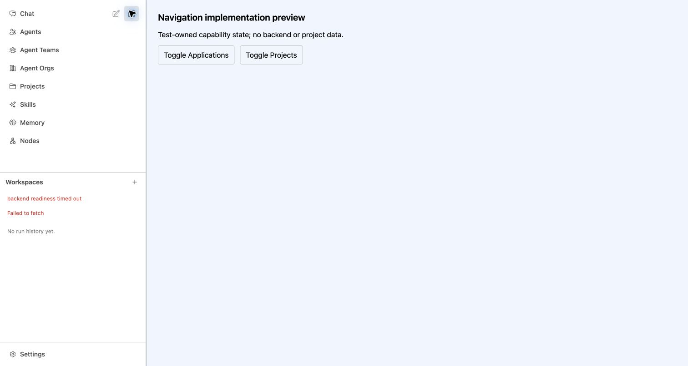

# Implementation rendered self-check — 2026-10-03

Not an API/E2E sign-off. Owned Nuxt process at http://127.0.0.1:17843 with BACKEND_NODE_BASE_URL=http://127.0.0.1:9. Temporary preview fixture mounted the real default layout and AppLeftPanel; capability state was set locally in that disposable browser origin. No backend/data/model calls succeeded or were required. Fixture source retained as preview-fixture.vue.txt; removed from pages after use.

Chrome CUA inspection at normal viewport (screenshot 1512×862): expanded nav read Chat, Agents, Agent Teams, Agent Orgs, Projects, Applications, Skills, Memory, Nodes. DOM text collection confirmed this exact sequence. Clicking Toggle Applications removed Applications; an explicit array comparison confirmed Chat|Agents|Agent Teams|Agent Orgs|Projects|Skills|Memory|Nodes. Clicking Toggle Projects removed Projects as observed in fresh accessibility state. Re-enabling Projects was observed on recovery. Folder icon, labels, alignment, row spacing and unchanged shell styling looked consistent; no in-scope defects observed.

Unrelated history area showed expected Failed to fetch/backend readiness timeout with deliberately absent backend; not hidden or counted as product validation. Later toggle/collapse interactions stalled in browser control (selector deadline and CDP command-dispatch deadline). A fresh state and screenshot confirmed expanded navigation still rendered correctly. Compact rendering, Projects click and subroute highlighting were NOT verified in browser; relevant unit tests passed but do not replace downstream browser proof. No responsive/mobile browser or packaged Electron verification claimed.

Screenshot saved as expanded-preview.png after troubleshooting (Applications disabled). Browser tab was explicitly closed successfully. Exact owned Nuxt listener PID 48789 received SIGINT; lsof subsequently showed no listener on port 17843. Temporary page removed. No unrelated app/process/data touched.

