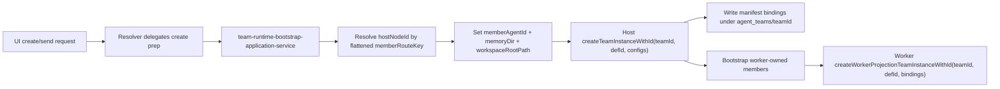
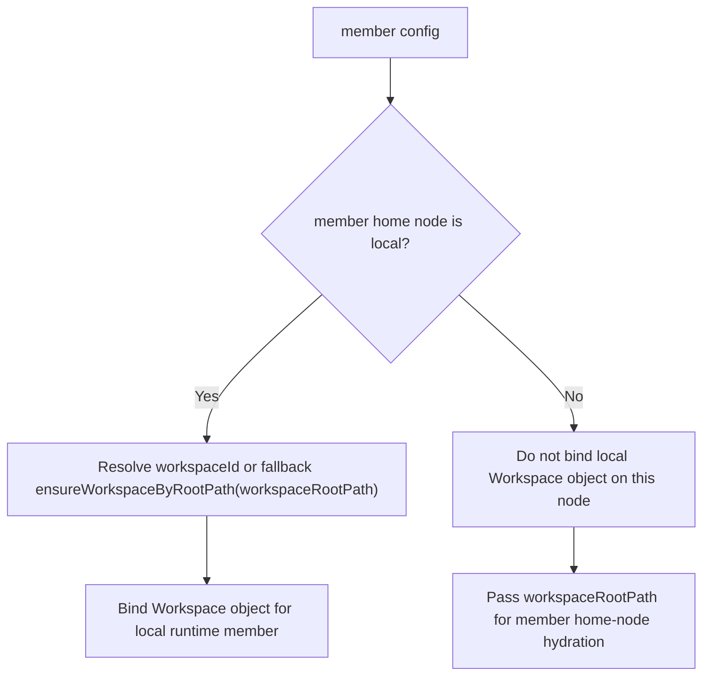
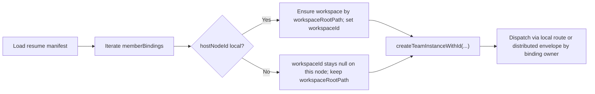
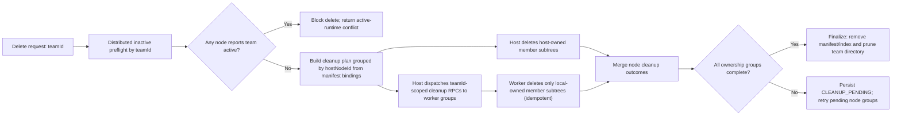

# Proposed Design

## Design Version
- Current Version: `v23`

## Revision History
| Version | Summary |
| --- | --- |
| v1 | Initial target-state proposal for team-scoped member memory. |
| v2 | Added full use-case coverage matrix, closed blocking design decisions, and aligned runtime call stack contracts with requirements. |
| v3 | Deep-review update: added missing use cases (append writes, distributed nested 3-node path, workspace-binding persistence), and corrected separation-of-concerns by removing team-member layout ownership from manifest store. |
| v4 | Deep-review update: added explicit mixed-placement distributed case (local + remote members in one team), and added core-stack feasibility constraints for `hostNodeId` persistence, nested remote resolution, and canonical `memoryDir` wiring. |
| v5 | Deep-review update: added host-manifest-only distributed case (all members remote) and explicit route-key-level placement requirements so nested distributed ownership is resolved from flattened leaf bindings rather than shallow definition scans. |
| v6 | Deep-review update: expanded delete/remove architecture with distributed cleanup matrix coverage (mixed placement, host-manifest-only, nested multi-node), retry/idempotency lifecycle rules, and explicit remote cleanup command path design. |
| v7 | Deep-review update: corrected delete transport architecture to `teamId`-scoped cleanup RPC (decoupled from runtime team envelopes), added distributed inactive-precondition guard, and closed missing use-case traceability gaps. |
| v8 | Deep-review update: added explicit host `teamId` propagation and worker run-binding identity requirements so distributed inactive-preflight/cleanup guards remain precise across reruns and shared-definition lineages. |
| v9 | Re-investigation update: added distributed member-definition identity resolution policy for cross-node local-ID mismatch (`referenceId` present on worker but missing on host), with remote-proxy-safe host hydration requirements and test coverage mapping. |
| v10 | Workspace portability update: enforce remote-member `workspaceRootPath` requirement and home-node fallback from stale `workspaceId` to `workspaceRootPath` for distributed reliability. |
| v11 | Naming clarity update: switch generated team-member IDs from opaque `member_<hash>` to readable deterministic `<route_slug>_<hash16>` and validate with unit + E2E coverage. |
| v12 | Team-folder readability update: generate `teamId` as `<team_name_slug>_<id8>` (immutable after creation), aligned with operator-visible memory layout and distributed identity safety. |
| v13 | Added explicit role semantics (`registry` vs `host` vs `member home node`) and runtime data-flow diagrams for mixed distributed create, workspace binding, continuation/restore, and nested route flattening. |
| v14 | Core-memory contract cleanup: explicit `memoryDir` is authoritative leaf memory path; removed team-identity-driven layout branching from runtime factory design. |
| v15 | Worker bootstrap correctness update: skip non-local coordinator initialization to prevent foreign-member materialization on worker nodes; add per-member `run_manifest.json` persistence for node-local bindings on host and worker paths. |
| v16 | Separation-of-concerns refactor planning update: split resolver orchestration, manager hydration, distributed runtime composition assembly, and team-run-history command/query responsibilities without changing behavior contracts. |
| v17 | Deep-review consistency update: align runtime data-flow diagrams and change-inventory ownership with strict SoC boundaries (application-service orchestration, hydration-service policy ownership, command/query ownership). |
| v18 | Continuation refactor update: decompose large application/composition services into collaborator modules (placement planning + manifest assembly; runtime core dependencies + host routing dispatcher) while keeping runtime behavior unchanged. |
| v19 | Worker-locality ownership update: binding `hostNodeId` is first-class locality source, worker bootstrap uses projection-specific creation API, and non-local bindings are prevented from writing worker member subtrees. |
| v20 | Worker rerun-bootstrap liveness hardening: stale stopped worker team instances are rebuilt before new run binding, including stale-bound-run teardown path, to preserve worker-originated inter-agent messaging after terminate/continue. |
| v21 | Worker-bootstrap SoC decomposition: split member-artifact shaping/persistence and runtime-liveness reconciliation into dedicated collaborators while preserving bootstrap behavior and contracts. |
| v22 | Worker command-dispatch SoC hardening: centralize ownership-first worker-local dispatch policy across message/inter-agent/tool-approval handlers and align node-identity naming to `selfNodeId` semantics. |
| v23 | Layer-boundary hardening: decouple distributed run-binding contracts from application DTOs, inject placement node-snapshot provider instead of singleton lookup, and carry `selfNodeId` naming end-to-end in worker command composition boundaries. |

## Summary
Align runtime persistence with canonical team-scoped memory layout:
1. Team manifest remains at `memory/agent_teams/<teamId>/team_run_manifest.json`.
2. Team-member durable artifacts live at `memory/agent_teams/<teamId>/<memberAgentId>/...`.
3. `memory/agents/<agentId>/...` remains single-agent-only.

Identity contract remains unchanged:
- `agentId` for single-agent runs,
- `teamId` for team runs,
- `memberAgentId` for team members,
- `memberRouteKey` for nested routing.

## Role Semantics
1. `registry node`: discovery-directory role only; not automatically runtime host.
2. `host node`: node that owns active team runtime orchestration for a given `teamId`.
3. `member home node`: owner/executor node for one member route; persisted as `memberBindings[].hostNodeId`.
4. `local node`: current backend process (`AUTOBYTEUS_NODE_ID`) evaluating runtime decisions.

## Runtime Data-Flow Diagrams

### Team create (mixed local + remote members)

### Workspace binding behavior

### Continuation/restore behavior

### Nested distributed ownership

### Delete/cleanup across nodes

## Current State (As-Is)
1. `TeamRunManifestStore` persists only `team_run_manifest.json` under team folder in base implementation.
2. Current workspace WIP introduces symlink layout logic inside `TeamRunManifestStore`; this mixes concerns and is not canonical target architecture.
3. Team member projection resolves `memberAgentId` then reads via `RunProjectionService` rooted at `memory/agents/<memberAgentId>`.
4. Team restore reconstructs member runtime configs from manifest but does not enforce canonical team-member subtree reads.
5. Existing tests include assumptions about team-member traces under global `memory/agents`.
6. Team manifest creation currently writes `hostNodeId: null` for all members, which is insufficient for distributed member routing guarantees.
7. Nested distributed remote-resolution path currently relies on non-recursive team-definition lookup fallback and can miss nested leaf ownership.
8. Create/restore paths do not yet consistently pass canonical per-member `memoryDir`, so append writes can drift to global `memory/agents`.
9. Current placement resolution is built from top-level definition nodes; nested leaf ownership for distributed routing requires explicit flattened leaf-route binding metadata.
10. `deleteTeamRunHistory` currently performs host-local `fs.rm(teamDir)` and index removal without distributed remote cleanup orchestration.
11. Distributed remote command gateway supports only runtime control/message kinds and has no explicit history-delete command.
12. `deleteLifecycle` is persisted in index schema but current flow does not transition through durable `CLEANUP_PENDING` retry semantics.
13. Existing distributed command transport schema is run-envelope based (`teamRunId`, `runVersion`), while history deletion API is keyed by `teamId`; coupling these paths creates identifier/ownership ambiguity for inactive runs.
14. Worker run-scoped bindings currently do not carry explicit host `teamId`; inactive-preflight keyed by `teamId` cannot be robustly implemented from existing worker binding identity set alone.
15. Distributed team definition rows can contain remote node-local `referenceId` values (for example worker `24`) that do not exist in host-local `agent_definitions`, but host create path still requires local lookup for every member.

## Target State (To-Be)
1. Team member durable artifacts are physically stored under `memory/agent_teams/<teamId>/<memberAgentId>`.
2. Team projection resolves by (`teamId`, `memberRouteKey`) and reads team-member subtree for local bindings, then remote fallback by `hostNodeId`.
3. Team continuation restore reads canonical team-member subtree for local bindings.
4. Distributed persistence is node-partitioned with shared `teamId` for 2-node and 3-node nested topologies.
5. Workspace binding metadata from manifest remains part of restore/projection integrity checks.
6. Documentation and tests explicitly validate local, distributed, and nested layouts.

## Design Principles
1. Keep identity stable and explicit.
2. Enforce strict storage boundary: team-member memory is team-scoped.
3. Preserve distributed ownership: each node writes only local bindings (`hostNodeId` partition).
4. Keep store/service responsibilities clean:
- manifest store handles manifest only,
- member-memory layout/reads live in dedicated team-member memory components.
5. No long-lived compatibility branch.

## Decisions Finalized
1. Legacy history policy: explicit cutoff for pre-canonical team-member data under `memory/agents/<memberAgentId>`.
2. Worker diagnostics policy: no worker-side manifest shard. Worker stores only node-local member subtrees under shared `teamId`.
3. Projection reader placement: dedicated run-history team-member projection reader adapter.
4. Store boundary policy: `TeamRunManifestStore` will not materialize/link member folders.
5. Distributed ownership policy: manifest `memberBindings[].hostNodeId` must be populated at create time from resolved placement, not defaulted to `null`.
6. Canonical write-path policy: create and restore must pass canonical per-member `memoryDir` so runtime writes land in `memory/agent_teams/<teamId>/<memberAgentId>`.
7. Nested routing policy: remote-node resolution must use manifest binding map first and must not depend on shallow team-definition node scans.
8. Host-manifest-only policy: host may own zero local member subtrees; this is valid when all manifest bindings target remote nodes.
9. Placement flattening policy: distributed ownership map must be resolved at leaf route-key level (`memberRouteKey`) for nested teams.
10. Delete coordination policy: host orchestrates distributed delete by manifest ownership groups and finalizes only after all node groups complete.
11. Delete lifecycle policy: `READY -> CLEANUP_PENDING -> terminal removed` is durable and retry-driven for partial failures.
12. Delete idempotency policy: per-node subtree deletion is idempotent; already-missing subtrees are treated as completion, not failure.
13. Delete transport policy: distributed history cleanup must use dedicated `teamId`-scoped cleanup RPC, not runtime team envelope dispatch.
14. Inactive precondition policy: delete requires distributed-authoritative inactive verification before cleanup execution.
15. Runtime-binding identity policy: distributed bootstrap/run-scoped binding contracts must persist host `teamId` as first-class identity on worker nodes.
16. Distributed definition identity policy: host create/hydration must treat remote-member definition lookup as node-aware and must not hard-fail on host-local absence of remote node-local `referenceId`.
17. Distributed workspace portability policy: remote members require explicit `workspaceRootPath`; `workspaceId` is node-local hint and may fall back to `workspaceRootPath` on home-node resolution miss.
18. Member-folder readability policy: generated `memberAgentId` must be deterministic and human-readable (`<route_slug>_<hash16>`), not opaque hash-only.
19. Team-folder readability policy: generated `teamId` must be human-readable (`<team_name_slug>_<id8>`) and immutable once created.
20. Runtime memory contract policy: when explicit `memoryDir` is supplied to runtime agent creation/restore, it is treated as final leaf directory; no additional `agents/<agentId>` suffixing is permitted.
21. Worker bootstrap locality policy: worker runtime must not initialize coordinator/member agents that are non-local to that worker node.
22. Member run-manifest policy: each node persists `run_manifest.json` only for member bindings local to that node.
23. Resolver boundary policy: GraphQL resolver files keep transport/schema concerns and delegate create/manifest/placement orchestration to dedicated application services.
24. Team-manager boundary policy: member-config hydration and definition/workspace resolution policies are extracted from runtime lifecycle registry concerns.
25. Distributed composition boundary policy: dependency assembly is isolated from bootstrap/definition-reconciliation/routing-bind policy helpers.
26. Run-history boundary policy: query/list APIs are separable from command paths (`upsert`, `delete`, lifecycle transitions).
27. Artifact-consistency policy: proposed design diagrams and change inventory must not assign orchestration/policy ownership back to resolver/facade layers once ownership has moved to dedicated services.
28. Worker rerun-bootstrap liveness policy: bootstrap must not reuse a stopped cached worker team runtime; stale stopped instances/bindings must be torn down and projection runtime rebuilt before binding a rerun.
29. Worker bootstrap decomposition policy: member-artifact preparation/persistence and runtime-liveness reconciliation must be implemented in dedicated collaborators; the envelope handler remains orchestration-only.
30. Worker dispatch-policy centralization policy: ownership classification and worker-local dispatch gating are implemented in one reusable routing-orchestrator module shared by worker message/control handlers.
31. Node-identity clarity policy: worker dispatch-policy boundaries use `selfNodeId` terminology (current process identity) to avoid `hostNodeId` naming ambiguity in worker command paths.
32. Distributed binding-type ownership policy: runtime-binding layer owns a dedicated member-binding contract type and must not import application-service DTO types.
33. Placement snapshot boundary policy: placement planning consumes node snapshots via injected provider contract and must not call global default distributed runtime singleton directly.
34. Worker command composition naming policy: composition-level dependency names for worker-local policy paths remain `selfNodeId` end-to-end.

## Use Case Set (Design Scope)

| use_case_id | Use Case |
| --- | --- |
| UC-001 | Single-agent persistence remains at `memory/agents/<agentId>`. |
| UC-002 | Local team create persists manifest plus local member subtrees under team folder. |
| UC-003 | Local nested-team create persists flat member folders keyed by `memberAgentId` and route mapping in manifest. |
| UC-004 | Distributed team create partitions member persistence across host and worker nodes under shared `teamId`. |
| UC-005 | Local team-member projection reads canonical team-member subtree by (`teamId`, `memberRouteKey`). |
| UC-006 | Distributed team-member projection uses local read then remote fallback by `hostNodeId`. |
| UC-007 | Team continuation restore restores local bindings from team-member subtree and coordinates remote restore for remote bindings. |
| UC-008 | Team delete removes node-local member subtrees and finalizes distributed cleanup. |
| UC-009 | Legacy non-canonical team-member data is explicitly unsupported after cutover. |
| UC-010 | Docs and tests reflect canonical layout for single/local/distributed/nested cases. |
| UC-011 | Runtime append/write path stores ongoing member traces in canonical team-member subtrees (not global `memory/agents`). |
| UC-012 | Distributed nested 3-node topology (A/B/C) preserves shared `teamId` with node-local member subtree partitioning. |
| UC-013 | Workspace binding metadata remains consistent across manifest, restore resolution, and projection targeting. |
| UC-014 | Distributed mixed placement (for example local `professor`, remote `scribe`) is supported and validated with explicit host/worker memory trees. |
| UC-015 | Distributed host-manifest-only case is supported where host has no local member subtree and all members are remote. |
| UC-016 | Nested distributed leaf ownership is resolved from flattened route-key placement map, avoiding shallow top-level member-name ambiguity. |
| UC-017 | Distributed mixed/split delete removes only node-local bindings per node and finalizes host state after remote acknowledgements. |
| UC-018 | Host-manifest-only delete succeeds when host has no local member directories and all cleanup is remote. |
| UC-019 | Distributed nested delete across three nodes resolves cleanup ownership by route-key-level bindings without leaf-name ambiguity. |
| UC-020 | Partial-failure delete enters durable retryable lifecycle and supports idempotent replay until completion. |
| UC-021 | Delete preflight enforces distributed-authoritative inactive verification and blocks cleanup on runtime-state drift. |
| UC-022 | Distributed runtime bindings preserve host `teamId` identity so preflight and cleanup guards do not cross-match unrelated runs/definitions. |
| UC-023 | Distributed mixed-node create succeeds when remote member `referenceId` is absent in host-local `agent_definitions` but present on remote node; host uses remote-proxy-safe hydration for remote members while keeping local-member strictness. |
| UC-024 | Distributed workspace binding is path-authoritative: remote members must provide `workspaceRootPath`, and home-node execution falls back to `workspaceRootPath` when `workspaceId` is stale. |
| UC-025 | Generated team-member IDs keep deterministic uniqueness while improving operator readability (`<route_slug>_<hash16>`). |
| UC-026 | Generated team IDs keep operator readability (`<team_name_slug>_<id8>`) while preserving immutable distributed/run-history identity. |
| UC-027 | Runtime explicit-memory contract is uniform: explicit `memoryDir` always maps to leaf memory files without team-identity-specific branching in core factory logic. |
| UC-028 | Worker bootstrap must skip non-local coordinator initialization so worker nodes never materialize host-owned members. |
| UC-029 | Team-member `run_manifest.json` is persisted per local member binding (host and worker) and never for foreign-node members. |
| UC-030 | Refactor keeps runtime behavior stable while separating resolver/application, manager/hydration, runtime-composition assembly, and run-history command/query concerns. |
| UC-031 | Distributed runtime composition factory remains API-stable while delegating internal dependency and routing-dispatch assembly to collaborator modules. |
| UC-032 | Team runtime bootstrap application service remains output-stable while delegating placement planning and manifest assembly to collaborator services. |
| UC-033 | Worker distributed bootstrap resolves locality from binding ownership first and uses projection-only team creation so non-local members are never materialized on worker nodes. |
| UC-034 | Worker rerun bootstrap recreates stale stopped team runtime instances before binding the new run so worker-originated `send_message_to` remains functional after terminate/continue. |
| UC-035 | Worker command handlers share one centralized ownership-first dispatch orchestrator so local-dispatch eligibility is consistent across user/inter-agent/tool-approval flows. |
| UC-036 | Layering boundaries are explicit: distributed runtime-binding contracts are decoupled from application DTOs, placement planning receives injected node snapshots, and worker command composition uses `selfNodeId` naming end-to-end. |

## Use-Case Coverage Matrix

| use_case_id | Primary | Fallback | Error | Notes |
| --- | --- | --- | --- | --- |
| UC-001 | Yes | N/A | Yes | Prevent regression for single-agent reads/writes. |
| UC-002 | Yes | N/A | Yes | Local create must fail clearly on invalid member bindings. |
| UC-003 | Yes | N/A | Yes | Nested route collisions must fail validation. |
| UC-004 | Yes | Yes | Yes | Remote-node unavailability returns explicit distributed create failure. |
| UC-005 | Yes | N/A | Yes | Missing binding or missing subtree yields explicit projection error. |
| UC-006 | Yes | Yes | Yes | Remote unavailable returns local result path with warning logging. |
| UC-007 | Yes | Yes | Yes | Partial restore failure triggers rollback. |
| UC-008 | Yes | Yes | Yes | Worker unreachable yields retryable cleanup state. |
| UC-009 | Yes | N/A | Yes | Explicit legacy cutoff error on non-canonical history path. |
| UC-010 | Yes | N/A | Yes | Test/docs mismatch is release blocker. |
| UC-011 | Yes | N/A | Yes | Stream/activity sinks must write to canonical subtree only. |
| UC-012 | Yes | Yes | Yes | 3-node nested partitioning validated in integration coverage. |
| UC-013 | Yes | N/A | Yes | Workspace-binding mismatch fails restore/projection consistency checks. |
| UC-014 | Yes | Yes | Yes | Mixed placement with one local member and one or more remote members must preserve manifest `hostNodeId` routing and canonical storage. |
| UC-015 | Yes | Yes | Yes | Host can keep manifest-only team directory; all member reads/restores/deletes route remote by manifest ownership. |
| UC-016 | Yes | Yes | Yes | Nested distributed ownership uses route-key leaf map; duplicate leaf names across subteams do not break routing. |
| UC-017 | Yes | Yes | Yes | Host groups cleanup by `hostNodeId`; remote failures keep lifecycle pending. |
| UC-018 | Yes | Yes | Yes | Host with zero local subtrees still coordinates remote cleanup and finalizes correctly. |
| UC-019 | Yes | Yes | Yes | Nested distributed cleanup uses `memberRouteKey` bindings, not shallow member-name lookups. |
| UC-020 | Yes | Yes | Yes | Repeated delete retries are idempotent and converge to final cleanup completion. |
| UC-021 | Yes | Yes | Yes | Any active-runtime signal on any node blocks delete until stop/reconciliation completes. |
| UC-022 | Yes | Yes | Yes | Worker runtime-state probe and cleanup guards resolve by explicit host `teamId` identity. |
| UC-023 | Yes | Yes | Yes | Host does not require local definition row parity for remote members; local members still fail if host-local definition is missing. |
| UC-024 | Yes | Yes | Yes | Remote member missing `workspaceRootPath` fails fast; stale `workspaceId` on home node falls back to `workspaceRootPath`. |
| UC-025 | Yes | N/A | Yes | Route slug normalization keeps IDs path-safe/readable; hash suffix preserves uniqueness and determinism. |
| UC-026 | Yes | N/A | Yes | Team-name slug normalization keeps IDs path-safe/readable; random suffix provides collision resistance while teamId stays immutable after creation. |
| UC-027 | Yes | N/A | Yes | Explicit `memoryDir` path contract is enforced for create/restore and validated by runtime/store tests. |
| UC-028 | Yes | N/A | Yes | Worker coordinator bootstrap is locality-aware and skips non-local coordinator members to prevent foreign-member memory writes. |
| UC-029 | Yes | N/A | Yes | Member `run_manifest.json` is persisted only for local bindings and excluded for remote bindings on each node. |
| UC-030 | Yes | N/A | Yes | Refactor preserves existing GraphQL/runtime behavior while reducing reasons-to-change per module and improving dependency direction clarity. |
| UC-031 | Yes | N/A | Yes | Composition entrypoint API stays stable while internal dependency/routing assembly moves to focused collaborators. |
| UC-032 | Yes | N/A | Yes | Bootstrap prep outputs remain unchanged while placement and manifest policy logic is delegated to dedicated services. |
| UC-033 | Yes | Yes | Yes | Worker locality is binding-authoritative (`hostNodeId` first), projection bootstrap uses projection API, and non-local bindings keep `memoryDir=null`. |
| UC-034 | Yes | Yes | Yes | Rerun bootstrap treats stopped runtime/binding as stale, rebuilds projection runtime, and preserves bidirectional message dispatch after terminate/continue. |
| UC-035 | Yes | Yes | Yes | Worker ownership classification + local-dispatch gating are centralized; handlers no longer duplicate locality predicates or worker-managed-run checks. |
| UC-036 | Yes | N/A | Yes | Runtime-binding contracts depend only on distributed-layer types, placement planning receives injected node snapshots, and worker command boundaries keep `selfNodeId` semantics without alias drift. |

## Change Inventory

| Change ID | Type | File(s) | Description |
| --- | --- | --- | --- |
| D-001 | Modify | `src/run-history/store/team-run-manifest-store.ts` | Keep manifest-only responsibility; remove layout materialization/link behavior from target design. |
| D-002 | Add | `src/run-history/store/team-member-memory-layout-store.ts` | Own team-member subtree path helpers and local subtree existence/materialization checks. |
| D-003 | Add | `src/run-history/services/team-member-memory-projection-reader.ts` | Read member memory from team subtree by (`teamId`, `memberAgentId`). |
| D-004 | Modify | `src/run-history/services/team-member-run-projection-service.ts` | Replace direct global `RunProjectionService` reads with team-member reader + remote fallback logic. |
| D-005 | Modify | `src/run-history/services/team-run-continuation-service.ts` | Ensure restore path uses team-member subtree contract for local bindings and workspace-binding consistency checks. |
| D-006 | Modify | `src/run-history/services/team-run-history-command-service.ts`, `src/run-history/services/team-run-history-query-service.ts`, `src/run-history/services/team-run-history-service.ts` | Enforce canonical path policy and explicit legacy cutoff handling in command/query services while keeping `team-run-history-service.ts` as a thin compatibility facade. |
| D-007 | Modify | `src/run-history/services/team-run-activity-sink-service.ts` (if needed) | Ensure runtime activity/memory append path aligns with canonical team-member subtree. |
| D-008 | Modify | `src/api/graphql/types/team-run-history.ts` | Preserve API surface; route projection errors through canonical-path semantics. |
| D-009 | Modify | `tests/e2e/run-history/team-member-projection-contract.e2e.test.ts` | Validate canonical subtree persistence/projection and append-write behavior. |
| D-010 | Modify | `tests/e2e/run-history/team-run-history-graphql.e2e.test.ts` | Add canonical layout fixtures and legacy cutoff assertions. |
| D-011 | Modify | distributed integration tests | Validate host/worker partitioning and 3-node nested topology behavior under shared `teamId`. |
| D-012 | Modify | docs memory-layout pages | Publish finalized directory trees, node partitioning, and operation rules. |
| D-013 | Modify | `src/agent-team-execution/services/team-runtime-bootstrap-application-service.ts`, `src/api/graphql/types/agent-team-instance.ts` | Persist resolved `hostNodeId` per member in manifest during create/lazy-create (including nested members) in application service, with resolver delegation only. |
| D-014 | Modify | `src/run-history/services/team-run-continuation-service.ts` and create paths | Pass canonical per-member `memoryDir` into runtime member configs for both create and restore. |
| D-015 | Modify | `src/run-history/services/team-member-run-projection-service.ts` | Prefer manifest `hostNodeId` and remove dependence on shallow team-definition lookup for nested remote members. |
| D-016 | Add/Modify | route-key placement resolver helper + create path integration | Build flattened leaf placement map (`memberRouteKey -> hostNodeId`) for nested distributed teams and use it in manifest/build/runtime bindings. |
| D-017 | Modify | distributed integration tests | Add host-manifest-only scenario and nested duplicate-leaf-name routing assertions. |
| D-018 | Add | `src/run-history/services/team-run-history-delete-coordinator-service.ts` | Coordinate distributed team-history delete by grouping bindings per `hostNodeId`, dispatching remote cleanup, and reporting completion/pending outcomes. |
| D-019 | Modify | `src/run-history/services/team-run-history-command-service.ts`, `src/run-history/services/team-run-history-service.ts` | Replace host-local-only delete with lifecycle-driven coordinator flow (`READY`/`CLEANUP_PENDING`) in command service; keep facade delegation and finalization gate behavior unchanged. |
| D-020 | Add | `src/run-history/distributed/team-history-cleanup-dispatcher.ts` | Host-side `teamId`-scoped cleanup client that dispatches worker cleanup requests by node ownership groups. |
| D-021 | Add | `src/distributed/transport/internal-http/register-worker-team-history-cleanup-routes.ts` | Worker-side authenticated cleanup route for history-delete requests keyed by `teamId` + binding subset. |
| D-022 | Add | `src/run-history/services/team-history-worker-cleanup-handler.ts` | Worker-local cleanup handler that removes only node-owned member subtrees idempotently. |
| D-023 | Modify | `tests/e2e/run-history/team-run-history-graphql.e2e.test.ts` + distributed integration tests | Add delete matrix coverage: local, mixed distributed, host-manifest-only, nested multi-node, and retry/idempotent replay behavior. |
| D-024 | Add | `src/run-history/services/team-history-runtime-state-probe-service.ts` | Distributed-authoritative inactive preflight for delete to detect runtime-state drift before cleanup execution. |
| D-025 | Modify | distributed bootstrap + runtime binding contracts (`bootstrap-payload-normalization.ts`, `remote-envelope-bootstrap-handler.ts`, `run-scoped-team-binding-registry.ts`) | Propagate and persist host `teamId` in worker run bindings for `teamId`-authoritative preflight/cleanup guards. |
| D-026 | Modify | distributed runtime wiring (`src/app.ts`, distributed runtime composition, node directory URL helpers as needed) | Register/wire dedicated cleanup + runtime-probe routes and host dispatcher endpoints under transport/auth policy. |
| D-027 | Modify | `src/agent-team-execution/services/team-member-config-hydration-service.ts`, `src/agent-team-execution/services/agent-team-instance-manager.ts` | Make agent-config hydration node-aware in hydration service: keep local-member strict definition lookup; allow remote-member proxy-safe hydration when host-local definition row is absent for remote `referenceId`; manager delegates policy. |
| D-028 | Modify | `tests/integration/agent-team-execution/agent-team-instance-manager.integration.test.ts` and distributed integration tests | Add explicit regression coverage for mixed-node create with host-missing/worker-present remote definition IDs. |
| D-029 | Modify | `src/agent-team-execution/services/team-member-config-hydration-service.ts`, `src/agent-team-execution/services/agent-team-instance-manager.ts` | Enforce remote-member `workspaceRootPath` requirement and add home-node fallback from stale `workspaceId` to `workspaceRootPath` in hydration service; manager remains orchestration layer. |
| D-030 | Modify | `tests/integration/agent-team-execution/agent-team-instance-manager.integration.test.ts` | Add regression coverage for remote `workspaceRootPath` required validation and stale `workspaceId` fallback behavior. |
| D-031 | Modify | `src/run-history/utils/team-member-agent-id.ts`, `tests/unit/run-history/team-member-agent-id.test.ts` | Generate readable deterministic team-member IDs (`<route_slug>_<hash16>`) and lock normalization/format behavior in unit tests. |
| D-032 | Modify | `src/agent-team-execution/services/team-runtime-bootstrap-application-service.ts`, `autobyteus-ts/src/agent-team/factory/agent-team-factory.ts`, `src/api/graphql/types/agent-team-instance.ts`, `tests/unit/api/graphql/types/agent-team-instance-resolver.test.ts` | Generate readable team IDs as `<team_name_slug>_<id8>` in application/factory layers and keep teamId immutable across create/restore/distributed paths, with resolver delegation-only behavior. |
| D-033 | Modify | `autobyteus-ts/src/agent/factory/agent-factory.ts`, `autobyteus-server-ts/src/agent-execution/services/agent-instance-manager.ts`, `autobyteus-ts/tests/unit/agent/factory/agent-factory.test.ts`, `autobyteus-ts/tests/integration/agent/working-context-snapshot-restore-flow.test.ts` | Enforce explicit-`memoryDir`-is-leaf contract and remove team-identity-based layout switching from core runtime factory. |
| D-034 | Modify | `autobyteus-server-ts/src/agent-team-execution/services/agent-team-instance-manager.ts`, `autobyteus-ts/src/agent-team/bootstrap-steps/coordinator-initialization-step.ts`, `autobyteus-ts/tests/unit/agent-team/bootstrap-steps/coordinator-initialization-step.test.ts` | Add member placement metadata and make coordinator bootstrap locality-aware so non-local coordinators are skipped on worker nodes. |
| D-035 | Add/Modify | `autobyteus-server-ts/src/run-history/store/team-member-run-manifest-store.ts`, `autobyteus-server-ts/src/run-history/services/team-run-history-command-service.ts`, `autobyteus-server-ts/src/run-history/services/team-run-history-service.ts`, `autobyteus-server-ts/src/distributed/bootstrap/remote-envelope-bootstrap-handler.ts`, run-history/distributed tests | Persist per-member `run_manifest.json` for local bindings on host and worker, and enforce no foreign-node member manifest materialization with command-service ownership and facade delegation. |
| D-036 | Add | `src/agent-team-execution/services/team-runtime-bootstrap-application-service.ts` | Own team create/lazy-create preparation pipeline (teamId generation, placement-aware member config shaping, manifest assembly input) and remove this orchestration from GraphQL resolver files. |
| D-037 | Add | `src/agent-team-execution/services/team-member-config-hydration-service.ts` | Own member definition resolution, processor/tool/skill/workspace hydration, and `AgentConfig` construction policy currently mixed inside `agent-team-instance-manager.ts`. |
| D-038 | Add | `src/distributed/bootstrap/distributed-runtime-composition-factory.ts` + helper modules | Split dependency/container assembly from bootstrap/definition-reconciliation/routing-binding policy helpers currently concentrated in `default-distributed-runtime-composition.ts`. |
| D-039 | Add | `src/run-history/services/team-run-history-command-service.ts` and `src/run-history/services/team-run-history-query-service.ts` | Separate command mutations (`upsert`, `delete`, lifecycle transitions) from query/read concerns (`list`, `resume-config`) to reduce mixed responsibilities in `team-run-history-service.ts`. |
| D-040 | Modify | affected unit/integration/e2e suites for resolver, distributed bootstrap, and run-history flows | Lock behavior parity for UC-001..UC-029 while applying structural SoC refactor; verify no GraphQL contract or memory-layout regression. |
| D-041 | Add | `src/distributed/bootstrap/distributed-runtime-core-dependencies.ts`, `src/distributed/bootstrap/host-runtime-routing-dispatcher.ts` | Extract core transport/auth/dependency creation and host local-routing callback assembly from composition factory internals. |
| D-042 | Modify | `src/distributed/bootstrap/distributed-runtime-composition-factory.ts`, related distributed unit tests | Keep composition API stable while delegating internal assembly to D-041 collaborators; preserve bootstrap/uplink/routing behavior. |
| D-043 | Add | `src/agent-team-execution/services/team-member-placement-planning-service.ts`, `src/agent-team-execution/services/team-run-manifest-assembly-service.ts` | Extract placement-resolution and manifest-assembly policy from bootstrap application service into focused collaborators. |
| D-044 | Modify | `src/agent-team-execution/services/team-runtime-bootstrap-application-service.ts`, related unit/integration tests | Keep bootstrap application-service contract stable while delegating placement + manifest collaborators and preserving outputs. |
| D-045 | Modify | `src/agent-team-execution/services/agent-team-instance-manager.ts`, `src/distributed/bootstrap/remote-envelope-bootstrap-handler.ts`, distributed/hydration tests | Enforce worker-locality ownership precedence (`hostNodeId` first), use projection-specific team creation on worker bootstrap, and prevent non-local bindings from receiving worker `memoryDir`. |
| D-046 | Modify | `src/distributed/bootstrap/remote-envelope-bootstrap-handler.ts`, `tests/unit/distributed/remote-envelope-bootstrap-handler.test.ts`, distributed rerun integration coverage | Rebuild stopped cached worker runtime-team instances (and stale stopped run bindings) during rerun bootstrap before binding the new run, preserving worker-originated routing liveness. |
| D-047 | Add/Modify | `src/distributed/bootstrap/worker-bootstrap-member-artifact-service.ts`, `src/distributed/bootstrap/worker-bootstrap-runtime-reconciler.ts`, `src/distributed/bootstrap/remote-envelope-bootstrap-handler.ts`, bootstrap unit/integration tests | Decompose worker bootstrap concerns into collaborator services (artifact preparation/persistence and runtime reconciliation) with no behavior drift in binding identity, liveness recovery, or routing setup contracts. |
| D-048 | Add/Modify | `src/distributed/routing/worker-owned-member-dispatch-orchestrator.ts`, `src/distributed/routing/worker-member-locality-resolver.ts`, `src/distributed/bootstrap/remote-envelope-message-command-handlers.ts`, `src/distributed/bootstrap/remote-envelope-control-command-handlers.ts`, distributed unit tests | Centralize worker ownership-first local-dispatch policy (including worker-managed-run gating) into one routing orchestrator and remove duplicated locality decision branches from message/control handlers; align worker-node identity naming to `selfNodeId`. |
| D-049 | Add/Modify | `src/distributed/runtime-binding/run-scoped-member-binding.ts` (new), `src/distributed/runtime-binding/run-scoped-team-binding-registry.ts`, `src/distributed/routing/worker-member-locality-resolver.ts`, related distributed tests | Introduce distributed-layer `RunScopedMemberBinding` contract and remove imports of `TeamMemberConfigInput` from application-service layer in runtime-binding/routing modules. |
| D-050 | Modify | `src/agent-team-execution/services/team-member-placement-planning-service.ts`, `src/agent-team-execution/services/team-runtime-bootstrap-application-service.ts`, composition wiring/tests | Inject node-snapshot provider dependency into placement planning service and remove direct `getDefaultDistributedRuntimeComposition()` singleton access from planning boundary. |
| D-051 | Modify | `src/distributed/bootstrap/distributed-runtime-composition-factory.ts`, `src/distributed/bootstrap/remote-envelope-command-handlers.ts`, related distributed tests | Keep worker command composition dependency naming as `selfNodeId` end-to-end and remove `hostNodeId -> selfNodeId` alias handoff at command-handler boundary. |

## File/Module Responsibilities (Target)

### `src/run-history/store/team-run-manifest-store.ts`
1. Own team-root path derivation and manifest I/O only.
2. No team-member directory creation/linking logic.

### `src/run-history/store/team-member-memory-layout-store.ts` (new)
1. Own canonical member path derivation: `memory/agent_teams/<teamId>/<memberAgentId>`.
2. Provide safe path checks and local subtree lifecycle helpers.
3. Keep directory-layout concerns out of manifest store.

### `src/run-history/services/team-member-memory-projection-reader.ts` (new)
1. Input: `teamId`, `memberAgentId`.
2. Read canonical team-member subtree projection payload.
3. Throw explicit canonical-path errors for missing subtree when required.

### `src/run-history/services/team-member-run-projection-service.ts`
1. Resolve binding by (`teamId`, `memberRouteKey`).
2. Read local projection via team-member reader.
3. If local empty and member host is remote, query remote fallback.

### `src/run-history/services/team-run-continuation-service.ts`
1. Load manifest and resolve member bindings.
2. Restore local members from canonical team-member subtrees.
3. Validate workspace binding consistency from manifest during restore setup.
4. Coordinate remote restore and rollback partial runtime on failure.
5. Set per-member canonical `memoryDir` for runtime restore configs.

### `src/api/graphql/types/agent-team-instance.ts`
1. Keep GraphQL transport/schema boundary for query/mutation inputs/outputs.
2. Delegate team create/lazy-create preparation to `team-runtime-bootstrap-application-service`.
3. Delegate continuation/history updates to run-history/continuation services without embedding placement/manifest construction logic.

### `src/agent-team-execution/services/team-runtime-bootstrap-application-service.ts` (new)
1. Generate immutable readable `teamId`.
2. Delegate flattened route-key placement planning to `team-member-placement-planning-service`.
3. Delegate `TeamRunManifest` binding assembly to `team-run-manifest-assembly-service`.
4. Keep create/lazy-create orchestration in one application service.

### `src/agent-team-execution/services/team-member-placement-planning-service.ts` (new)
1. Traverse team-definition leaves and produce normalized `memberRouteKey` ownership candidates.
2. Resolve effective `hostNodeId` placement map using node snapshots and default-local fallback.
3. Consume node snapshots via injected provider contract; do not read global distributed runtime singleton directly.
4. Expose deterministic placement output for runtime config shaping without touching GraphQL or runtime lifecycle state.

### `src/agent-team-execution/services/team-run-manifest-assembly-service.ts` (new)
1. Build `TeamRunManifest` from normalized runtime member configs.
2. Resolve workspace-root snapshot fields from `workspaceRootPath` and node-local `workspaceId` fallback.
3. Enforce binding-shape consistency (`memberRouteKey`, `memberAgentId`, `hostNodeId`) for create/lazy-create.

### `src/agent-team-execution/services/agent-team-instance-manager.ts`
1. Own runtime lifecycle registry/cache and team instance start/stop/list APIs.
2. Delegate member hydration policy to `team-member-config-hydration-service`.
3. Keep recursive team-config composition orchestration with minimal policy logic in-manager.

### `src/agent-team-execution/services/team-member-config-hydration-service.ts` (new)
1. Hydrate local members with strict host-local definition lookup.
2. For remote members, permit proxy-safe hydration when host-local definition row for remote node-local `referenceId` is missing.
3. Preserve runtime identity metadata (`memberRouteKey`, `memberAgentId`, `memoryDir`) across strict and proxy hydration paths.
4. Enforce distributed workspace portability (`workspaceRootPath` required for remote members).
5. On home-node workspace resolution miss by `workspaceId`, fall back to `workspaceRootPath` when provided.

### `autobyteus-ts/src/agent/factory/agent-factory.ts`
1. Resolve memory layout purely from explicit runtime memory path contract:
   - explicit `memoryDir` (config or restore override) => leaf directory mode,
   - no explicit `memoryDir` => default single-agent `memory/agents/<agentId>` mode.
2. Must not inspect team-specific custom-data fields to decide storage shape.

### `src/run-history/services/team-run-history-service.ts`
1. Keep backward-compatible facade for existing callers during refactor cutover.
2. Delegate query/read operations to `team-run-history-query-service`.
3. Delegate command/mutation operations to `team-run-history-command-service`.

### `src/run-history/services/team-run-history-query-service.ts` (new)
1. Own `listTeamRunHistory` and resume-config read paths.
2. Compose manifest/index/runtime-state read models without mutation side effects.

### `src/run-history/services/team-run-history-command-service.ts` (new)
1. Own `upsertTeamRunHistoryRow`, `onTeamEvent`, `onTeamTerminated`, and `deleteTeamRunHistory`.
2. Keep lifecycle mutation policy (`READY`/`CLEANUP_PENDING`) and delete preflight/coordinator orchestration.
3. Surface explicit errors for legacy non-canonical team-member data.

### `src/run-history/services/team-run-history-delete-coordinator-service.ts` (new)
1. Input: team manifest + local node identity + delete request context.
2. Build delete plan grouped by `hostNodeId` from manifest bindings.
3. Execute local delete via `team-member-memory-layout-store` helper.
4. Dispatch remote cleanup RPC requests for non-local node groups via dedicated dispatcher.
5. Return deterministic result (`COMPLETE` or `PENDING_RETRY`) with pending node details.

### `src/run-history/services/team-run-activity-sink-service.ts`
1. Ensure ongoing team-member trace append path targets canonical team-member subtrees.
2. Preserve index/activity updates independent of websocket subscriptions.

### `src/run-history/distributed/team-history-cleanup-dispatcher.ts` (new)
1. Resolve worker targets by `hostNodeId` groups from manifest bindings.
2. Send authenticated cleanup request payloads (`teamId`, member subset) to worker cleanup route.
3. Normalize remote outcomes for coordinator (`complete` vs `pending_retry`).

### `src/distributed/transport/internal-http/register-worker-team-history-cleanup-routes.ts` (new)
1. Register dedicated worker cleanup endpoint for team-history deletion.
2. Verify transport auth signature and payload schema.
3. Delegate cleanup execution to worker cleanup handler.

### `src/run-history/services/team-history-worker-cleanup-handler.ts` (new)
1. Validate ownership-scoped member subset for local worker.
2. Delete only local `agent_teams/<teamId>/<memberAgentId>` subtrees.
3. Return idempotent success for already-absent subtrees.

### `src/run-history/services/team-history-runtime-state-probe-service.ts` (new)
1. Provide distributed-authoritative inactive preflight for `teamId`.
2. Query host/worker runtime registries and return active drift signals.
3. Gate delete coordinator execution when active runtime remains.

### Distributed bootstrap + run-binding contracts (modified)
1. `bootstrap-payload-normalization.ts`: normalize/validate host `teamId` in bootstrap payload contract.
2. `remote-envelope-bootstrap-handler.ts`: persist host `teamId` into worker run-scoped binding record.
3. `run-scoped-team-binding-registry.ts`: store and expose `teamId` in bound runtime records for probe/cleanup guard targeting.
4. `run-scoped-member-binding.ts` (new): own distributed-layer binding contract so runtime-binding/routing modules do not import application-service DTOs.

### `src/distributed/bootstrap/remote-envelope-command-handlers.ts` (modified)
1. Keep worker command composition boundary naming aligned to `selfNodeId`.
2. Avoid `hostNodeId` aliasing in worker-local dispatch-policy wiring.

### Runtime wiring (`src/app.ts` + distributed runtime composition) (modified)
1. Register worker cleanup and runtime-probe routes during app bootstrap.
2. Wire host-side dispatcher/probe clients through shared auth + node directory policy.
3. Keep history cleanup transport separate from runtime command envelope route.

### `src/distributed/bootstrap/distributed-runtime-composition-factory.ts` (new)
1. Own runtime dependency assembly and returned composition object.
2. Delegate bootstrap payload/definition reconciliation policy to focused helper modules.
3. Delegate core transport/auth dependency construction to `distributed-runtime-core-dependencies`.
4. Delegate host local-routing callback assembly to `host-runtime-routing-dispatcher`.

### `src/distributed/bootstrap/distributed-runtime-core-dependencies.ts` (new)
1. Build core distributed dependencies (`nodeDirectoryService`, transport auth clients, bridge client) from environment/runtime policy.
2. Keep host-node identity and transport-security initialization centralized and reusable for composition.
3. Avoid embedding bootstrap or routing-dispatch policy logic.

### `src/distributed/bootstrap/host-runtime-routing-dispatcher.ts` (new)
1. Build host local-routing dispatch callbacks for user/inter-agent/tool/control-stop flows.
2. Keep callback construction independent from transport/client dependency assembly.
3. Preserve `TeamRoutingPortAdapter` runtime behavior and error semantics.

## Distributed Design Rules
1. Shared `teamId` across participating nodes.
2. Host node stores manifest and host-local member subtrees.
3. Worker nodes store only worker-local member subtrees under same `teamId`.
4. Manifest is source of truth for `memberRouteKey -> memberAgentId -> hostNodeId` and workspace binding metadata.
5. Delete/cleanup is node-partitioned and coordinated at team level.
6. Host persists delete lifecycle as durable state and does not finalize manifest/index deletion until all node groups complete.
7. Remote cleanup transport is `teamId`-scoped and decoupled from runtime `teamRunId`/`runVersion` envelopes.
8. Remote cleanup request is binding-scoped; worker must never delete bindings owned by another node.
9. Distributed inactive-precondition probe must pass before cleanup starts.
10. Distributed delete retries are idempotent and may re-run safely against already-removed subtrees.
11. Worker run-scoped binding records must retain host `teamId` identity for preflight and cleanup guard disambiguation.
12. For distributed members, workspace binding is path-authoritative and must not depend on cross-node `workspaceId` parity.

## Migration / Cutover Policy
1. New runs: canonical team-member subtree only.
2. Pre-canonical team-member histories under global `memory/agents/<memberAgentId>`: unsupported after cutover.
3. No long-lived dual-read compatibility path.
4. Any one-time migration utility is out-of-band and explicitly temporary.

## Verification Plan
1. Unit: team-member layout store path and safety checks.
2. Unit: projection reader local subtree behavior.
3. Unit: projection service local read plus remote fallback branches.
4. Unit: continuation restore rollback plus workspace-binding consistency checks.
5. E2E local: manifest + member subtrees + append writes under canonical path.
6. Integration distributed: host/worker partitioning and 3-node nested topology coverage.
7. E2E legacy cutoff: explicit non-canonical path failure assertions.
8. Docs check: published trees match requirements and observed test behavior.
9. Integration distributed mixed placement: one local member and one or more remote members (for example remote `scribe`) with manifest `hostNodeId` assertions.
10. Integration host-manifest-only: host has manifest without local member dirs; projection/restore/delete still pass.
11. Integration nested duplicate leaf names: route-key placement map disambiguates ownership and routing.
12. E2E/local delete: local team delete removes member subtrees + manifest + index row idempotently.
13. Integration distributed delete mixed placement: host/worker cleanup split follows binding ownership.
14. Integration distributed delete host-manifest-only: host finalizes only after remote worker acknowledgements.
15. Integration distributed delete partial failure: lifecycle enters `CLEANUP_PENDING`, retries converge, finalization gate holds.
16. Integration distributed inactive-precondition drift: delete blocked when any node reports active runtime for same `teamId`.
17. Integration transport contract check: history cleanup RPC works without requiring `teamRunId`/`runVersion`.
18. Integration identity disambiguation: worker preflight/cleanup guard uses explicit host `teamId` and does not cross-match unrelated team history under same definition lineage.
19. Integration distributed workspace portability: remote member with missing `workspaceRootPath` fails fast.
20. Integration workspace fallback: home-node member with stale `workspaceId` and valid `workspaceRootPath` resolves workspace via path.
21. Unit/integration parity: refactor extracts services/modules without changing GraphQL responses for create/lazy-create/terminate/send.
22. Integration parity: distributed bootstrap/remote routing behavior remains unchanged after composition-module split.
23. Integration parity: run-history list/resume/delete behavior is unchanged after command/query split.
24. Unit/integration parity: bootstrap application service outputs (`teamId`, resolved member configs, manifest bindings) remain unchanged after placement/manifest collaborator extraction.
25. Unit/integration parity: distributed composition event uplink/bootstrap/routing callbacks remain unchanged after core-dependency and routing-dispatch collaborator extraction.
26. Unit/integration rerun parity: worker rerun bootstrap with stopped cached team runtime rebuilds worker projection runtime before run binding, preserving worker-originated inter-agent messaging.
27. Unit/integration layering parity: distributed runtime-binding modules compile and execute without importing application-layer DTO files; placement planning tests run with injected node-snapshot provider stubs.
28. Unit: worker command-composition wiring passes `selfNodeId` through command-handler dependencies without `hostNodeId` aliasing at worker dispatch-policy boundary.

## Requirement Traceability

| Requirement Area | Covered In Design |
| --- | --- |
| Single-agent layout remains `memory/agents` | UC-001, D-003 boundary contract |
| Local team layout under `agent_teams/<teamId>/<memberId>` | UC-002, D-002, D-003, D-004 |
| Distributed host/worker layout with same `teamId` | UC-004, UC-012, D-005, D-011 |
| Distributed mixed local+remote member split in one team | UC-014, D-013, D-015 |
| Distributed host manifest-only (all members remote) | UC-015, D-013, D-017 |
| Nested route identity via manifest | UC-003, D-001, D-004 |
| Nested distributed leaf placement disambiguation | UC-016, D-016, D-017 |
| Delete matrix (local/mixed/manifest-only/nested) | UC-008, UC-017, UC-018, UC-019, D-018..D-023 |
| Delete retry/idempotent lifecycle semantics | UC-020, D-019, D-023 |
| Distributed inactive delete precondition | UC-021, D-024 |
| Delete transport decoupling from runtime envelopes | UC-017..UC-021, D-020..D-022 |
| Distributed teamId identity propagation in runtime bindings | UC-022, D-025 |
| Distributed workspace portability and fallback reliability | UC-024, D-029, D-030 |
| Readable deterministic member-folder naming | UC-025, D-031 |
| Readable immutable team-folder naming | UC-026, D-032 |
| Worker bootstrap locality safety for distributed members | UC-028, D-034 |
| Per-member run manifest persistence by node ownership | UC-029, D-035 |
| Separation-of-concerns hardening without behavior drift | UC-030, D-036..D-040 |
| Intra-service collaborator decomposition without behavior drift | UC-031, UC-032, D-041..D-044 |
| Worker bootstrap locality ownership + projection API boundary | UC-033, D-045 |
| Worker rerun-bootstrap runtime liveness recovery | UC-034, D-046 |
| Worker ownership-first dispatch policy centralization | UC-035, D-048 |
| Layering boundary hardening for binding contracts + placement snapshots + worker identity naming | UC-036, D-049..D-051 |
| Restore/read/write/delete operation rules | UC-005..UC-008, UC-011, UC-017..UC-022, D-004..D-007, D-018..D-026 |
| Workspace-binding metadata integrity | UC-013, D-005 |
| Docs-quality detail for promotion | UC-010, D-012 |

## Remaining Non-Blocking Notes
1. Legacy migration tooling remains out of scope for this ticket.

## Design Delta v19 (2026-02-24) - Worker Locality Ownership Correction

### Problem
1. Worker bootstrap could still initialize and persist a non-local coordinator when team-definition snapshot carried `homeNodeId=embedded-local`.
2. Root cause: worker-side locality checks consumed definition `homeNodeId` directly, while distributed ownership truth was already available in binding `hostNodeId`.

### Decision
1. Effective member locality on distributed runtime hydration is derived with precedence:
   - first: `memberConfig.hostNodeId` (binding ownership),
   - fallback: definition `homeNodeId`.
2. Worker bootstrap assigns per-member `memoryDir` only for worker-local bindings; non-local bindings receive `memoryDir=null`.
3. Keep runtime architecture unchanged otherwise (no API/schema contract change, no compatibility layer).

### File-Level Change Inventory (v19)
1. `src/agent-team-execution/services/agent-team-instance-manager.ts` (`Modify`)
   - add effective-home-node resolver (binding-first),
   - use effective ownership for locality/workspace policy gates and hydration metadata.
2. `src/distributed/bootstrap/remote-envelope-bootstrap-handler.ts` (`Modify`)
   - gate `memoryDir` assignment by worker-local binding ownership.
3. `tests/unit/distributed/remote-envelope-bootstrap-handler.test.ts` (`Modify`)
   - assert non-local bindings keep `memoryDir=null` in worker bound payload.
4. `tests/integration/agent-team-execution/agent-team-instance-manager.integration.test.ts` (`Modify`)
   - assert coordinator placement metadata uses binding `hostNodeId` when definition node is `embedded-local`.

## Design Delta v20 (2026-02-24) - Worker Rerun Bootstrap Runtime Liveness

### Problem
1. After distributed terminate/continue, worker could keep a cached team instance whose runtime worker was stopped.
2. Rerun bootstrap reused that stopped cached team when bindings matched, so host->worker dispatch still worked via local node start-on-demand, but worker-originated `send_message_to` failed because team runtime worker remained inactive.

### Decision
1. Worker rerun bootstrap treats stopped cached team runtime as stale and rebuilds projection team runtime before binding rerun.
2. If a run binding exists but points to stopped runtime, bootstrap performs stale-run teardown (`teardownRun` + unbind/finalize) and rebuilds runtime.
3. Keep routing-contract/API unchanged; enforce runtime liveness at bootstrap ownership boundary.

### File-Level Change Inventory (v20)
1. `src/distributed/bootstrap/remote-envelope-bootstrap-handler.ts` (`Modify`)
   - add runtime-liveness guard for existing cached team reuse,
   - rebuild stopped cached team runtime before binding rerun,
   - treat stale bound-run-with-stopped-runtime as teardown+rebuild path.
2. `tests/unit/distributed/remote-envelope-bootstrap-handler.test.ts` (`Modify`)
   - add rerun regression for stopped cached team recreation,
   - add stale bound run regression where existing binding points to stopped runtime.

## Design Delta v22 (2026-02-24) - Worker Ownership-First Dispatch Policy Centralization

### Problem
1. Worker command handlers (`USER_MESSAGE`, `INTER_AGENT_MESSAGE_REQUEST`, `TOOL_APPROVAL`) duplicated ownership-first routing predicates and worker-managed-run local-dispatch gating.
2. This duplication increased drift risk: one handler could change locality behavior without the others.
3. Worker identity naming at this boundary used `localNodeId`, which was semantically weaker than `selfNodeId` for current-process ownership decisions.

### Decision
1. Introduce a reusable worker routing orchestrator to own:
   - binding-based ownership classification,
   - worker-managed-run gating,
   - conditional local-routing-port dispatch.
2. Keep envelope handlers orchestration-only:
   - parse payload,
   - call centralized local-dispatch orchestrator,
   - execute existing fallback chain (`teamManager` / `team.postMessage` / `team.postToolExecutionApproval`) unchanged.
3. Rename worker command-handler dependency at this boundary from `localNodeId` to `selfNodeId`.
4. Keep runtime invariant guard unchanged in `TeamManager`: non-local startup remains rejected.

### File-Level Change Inventory (v22)
1. `src/distributed/routing/worker-owned-member-dispatch-orchestrator.ts` (`Add`)
   - new centralized worker ownership-first local-dispatch policy module.
2. `src/distributed/routing/worker-member-locality-resolver.ts` (`Modify`)
   - introduce explicit ownership outcomes (`WORKER_OWNS_TARGET_MEMBER`, `RUN_BINDING_NOT_FOUND`, etc.),
   - keep boolean helper as wrapper for compatibility.
3. `src/distributed/bootstrap/remote-envelope-message-command-handlers.ts` (`Modify`)
   - remove duplicated locality/gating logic and delegate to orchestrator.
4. `src/distributed/bootstrap/remote-envelope-control-command-handlers.ts` (`Modify`)
   - remove duplicated locality/gating logic and delegate to orchestrator.
5. `src/distributed/bootstrap/remote-envelope-command-handlers.ts` (`Modify`)
   - pass `selfNodeId` dependency into message/control handler factories.
6. `tests/unit/distributed/worker-owned-member-dispatch-orchestrator.test.ts` (`Add`)
   - add ownership/gating behavior lock tests.
7. `tests/unit/distributed/remote-envelope-message-command-handlers.test.ts`, `tests/unit/distributed/remote-envelope-control-command-handlers.test.ts`, `tests/unit/distributed/worker-member-locality-resolver.test.ts` (`Modify`)
   - align dependency naming and verify behavior parity.

## Design Delta v24 (2026-02-25) - Run-History Runtime DI Tightening + Parallel File-Explorer Stability

### Problem
1. Run-history services still had residual runtime-default fallback coupling to distributed runtime singleton access, weakening composition-root ownership.
2. Parallel full backend suite intermittently flaked in file-explorer integration timing paths under heavy load, reducing validation confidence.

### Decision
1. Introduce explicit run-history runtime dependency registry configured by app composition root.
2. Refactor run-history service default paths to consume the injected registry + env fallback only.
3. Harden file-explorer integration bounded waits and timeout diagnostics for reliable parallel suite execution.
4. Keep runtime behavior contracts unchanged (GraphQL/API/memory-layout parity).

### Use Case Addendum
- `UC-037`: run-history runtime-default dependency wiring is composition-root-owned and full parallel validation remains stable.

### File-Level Change Inventory (v24)
1. `D-052` (`Add`) `/Users/normy/autobyteus_org/autobyteus-workspace/autobyteus-server-ts/src/run-history/services/team-run-history-runtime-dependencies.ts`
   - defines run-history runtime dependency contract,
   - exports configure/get APIs for composition-root wiring.
2. `D-053` (`Modify`) `/Users/normy/autobyteus_org/autobyteus-workspace/autobyteus-server-ts/src/run-history/services/team-run-history-service.ts`
   - removes direct distributed-runtime singleton default lookup,
   - resolves runtime defaults via WS-22 registry.
3. `D-054` (`Modify`) `/Users/normy/autobyteus_org/autobyteus-workspace/autobyteus-server-ts/src/run-history/services/team-member-run-projection-service.ts`
   - removes direct distributed-runtime singleton default lookup,
   - resolves runtime defaults via WS-22 registry.
4. `D-055` (`Modify`) `/Users/normy/autobyteus_org/autobyteus-workspace/autobyteus-server-ts/src/app.ts`
   - configures run-history runtime dependencies post composition init,
   - resets run-history runtime dependencies on app close.
5. `D-056` (`Modify`) `/Users/normy/autobyteus_org/autobyteus-workspace/autobyteus-server-ts/tests/integration/file-explorer/file-name-indexer.integration.test.ts`
   - increases bounded index wait budget and timeout diagnostics.
6. `D-057` (`Modify`) `/Users/normy/autobyteus_org/autobyteus-workspace/autobyteus-server-ts/tests/integration/file-explorer/file-system-watcher.integration.test.ts`
   - increases bounded event/no-event timing windows for parallel load resilience.

### Verification Addendum
1. Backend full parallel suite:
   - `cd /Users/normy/autobyteus_org/autobyteus-workspace/autobyteus-server-ts && npx vitest run --reporter=dot`
   - result: `312` files passed, `3` skipped; `1215` tests passed, `7` skipped.
2. Core scoped integration parity:
   - `cd /Users/normy/autobyteus_org/autobyteus-workspace/autobyteus-ts && npx vitest run tests/integration/agent/agent-single-flow.test.ts tests/integration/agent-team/agent-team-single-flow.test.ts`
   - result: `2` files / `2` tests passed.

### Requirement Traceability Addendum (v24)
- Case L / UC-037 mapped by `D-052..D-057` and verified by full backend parallel run + core scoped integration run.
