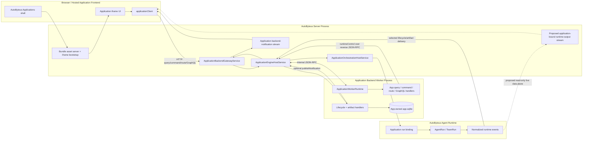
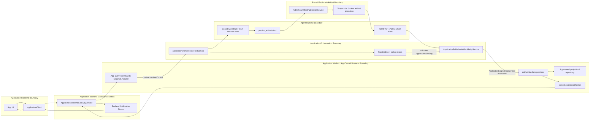

# Application Framework Understanding And Architecture Assessment

**Current code baseline:** `origin/personal` at `8c7e2c2aa591b174a3d5c90eb0d05584538bbf12` (2026-07-20 refresh)
**Purpose:** durable current-state synthesis and evidence-backed architecture judgment supporting the application backend context naming refactor; the verified application-bound output-stream gap is retained as follow-up context
**Approval applicability:** `N/A` — this is an evidence/context supplement; current-ticket intended behavior remains authoritative in `requirements.md`

## Current Ticket Scope Decision

The framework investigation originally evaluated application-scoped agent-output
streaming. After reviewing the current context API with the user, this ticket was
narrowed to a prerequisite developer-facing naming refactor:

```text
context.runtimeControl
  -> context.agentExecution
  -> context.agentResources
  -> context.publishedArtifacts

bindingIntentId
  -> launchRequestId
  -> agentExecution.findByLaunchRequestId(...)
```

The later streaming feature remains valid but is **not implemented or designed in
this ticket**. Sections below that discuss the recommended stream preserve the
completed architecture evidence for follow-up work; they do not override the
approved-scope candidate in `requirements.md`.

## Executive Assessment

The application framework has a **decent and generally strong macro-architecture** for a trusted extension/package system. Its main boundaries are real, named, and enforced in code:

1. package registry and bundle discovery own distribution/catalog;
2. the web host owns setup, engine readiness, iframe launch, and bootstrap;
3. the frontend SDK owns iframe bootstrap and app-to-backend transport;
4. the backend gateway owns frontend request/response and app-defined notification transport;
5. the engine host owns the application worker lifecycle and invocation;
6. application orchestration owns bound agent/team runs, durable binding/lifecycle state, and runtime control;
7. application storage separates app-owned data from platform-owned orchestration state.

The requested streaming capability is not evidence that the whole architecture is bad. It exposes one deliberately unimplemented boundary: the communication model currently reserves **runtime streaming/conversation** as a future API. The correct change is to add that boundary alongside existing owners, not to route agent tokens through whichever WebSocket already exists.

The framework is not a security sandbox. Imported backend code later executes in a managed Node worker and hosted frontend code runs as an iframe application. The architecture should be judged as a trusted extension framework with process/lifecycle/ownership isolation, not as hostile-code containment.

## One-Sentence Architecture

An AutoByteus application is a prebuilt bundle discovered by the server, hosted in the generic Applications shell as an iframe, backed by an app-owned worker module, and permitted to start or drive platform agents/teams only through the platform-owned `runtimeControl` orchestration boundary.

## Canonical Framework Areas

| Area | Current Owner | Main Responsibility | Assessment |
| --- | --- | --- | --- |
| `@autobyteus/application-sdk-contracts` | Shared application contracts | Manifest/backend/iframe/runtime-control/binding/event/artifact shapes | Correct shared authority, but `src/index.ts` is becoming a broad aggregation point. A stream contract should get its own focused file and be re-exported. |
| `@autobyteus/application-frontend-sdk` | Hosted frontend startup/client | Validates bootstrap, constructs backend transport, exposes app query/command/GraphQL/route/notification APIs | Healthy boundary; correct home for a typed read-only output subscription. |
| `@autobyteus/application-backend-sdk` | App backend definition helpers | `defineApplication` and configured launch-profile helpers | Healthy; should not gain frontend streaming or raw server service access. |
| `@autobyteus/application-devkit` | External app tooling | Create, pack, validate, and dev host | Healthy; must teach and validate any new public contract. |
| `application-packages` / `application-bundles` | Package/catalog services | Package roots, import/reload/remove, manifest validation, catalog/assets | Clear and unrelated to event streaming except contract validation. |
| Applications web host | `ApplicationShell` / `ApplicationSurface` / iframe host | Setup gate, ensure-ready, route-scoped iframe launch, strict bootstrap | Clear. It should provide the stream endpoint in bootstrap, not interpret runtime output. |
| `application-backend-gateway` | `ApplicationBackendGatewayService` | App frontend request/response and app-defined notifications | Clear. Runtime output must remain separate from app notification topics. |
| `application-engine` | `ApplicationEngineHostService` / worker runtime | Worker process lifecycle, backend definition load, JSON-RPC invocation, runtime-control bridge | Clear. High-frequency agent deltas should not be forced through worker handler invocation. |
| `application-orchestration` | `ApplicationOrchestrationHostService` plus focused services/stores | Resource config, run binding, runtime control, lifecycle journal/recovery, artifact access/relay | Correct authoritative owner for binding-scoped runtime access. Add a streaming concern here rather than bypassing it. |
| `application-storage` | Storage lifecycle/migration services | `app.sqlite` vs `platform.sqlite`, paths, app migration boundary | Healthy separation; live output streaming needs no schema change. |

## Current Package And Launch Shape

External app source uses the devkit layout:

```text
my-autobyteus-app/
  application.json
  autobyteus-app.config.mjs
  src/frontend/**
  src/backend/**
  src/agents/**
  src/agent-teams/**
  dist/importable-package/applications/<app-id>/
    application.json
    ui/**
    backend/**
    agents/**
    agent-teams/**
```

The current manifest is v3 and names a frontend SDK contract v3. The iframe bootstrap transport is exact and contains only:

```ts
type ApplicationHostTransport = {
  backendBaseUrl: string | null;
  backendNotificationsUrl: string | null;
};
```

The strict validator rejects extra/missing keys. Therefore a dedicated runtime stream endpoint must be an explicit contract-version change, not an undocumented extra field.

## Current End-To-End Runtime Flow

## Entity Model And Communication Topology

An installed application is one logical product split into two separately
running application-owned parts, both hosted and mediated by AutoByteus:

- the **application frontend** is static UI code loaded in an iframe;
- the **application backend** is an application definition loaded into a
  server-managed Node worker process;
- the **AutoByteus server** is the network host, launcher, worker supervisor,
  transport gateway, runtime orchestrator, and agent-runtime owner.

The worker is independent for failure/lifecycle and business-code execution,
but it is not an independent HTTP server. It owns no port. All external HTTP and
WebSocket endpoints belong to AutoByteus, and worker calls cross an internal
JSON-RPC bridge.



This produces three distinct communication planes:

| Plane | Path | Owner / Purpose |
| --- | --- | --- |
| App API plane | iframe UI -> AutoByteus HTTP gateway -> engine JSON-RPC -> app worker handler -> response back | App-defined query/command/route/GraphQL business API |
| Runtime control plane | app worker `runtimeControl` -> reverse JSON-RPC -> AutoByteus orchestration -> bound agent/team | Starting, messaging, querying, and terminating application-owned bindings |
| Return/data plane | runtime -> selected worker handlers and/or AutoByteus-owned WebSocket -> app frontend | Durable lifecycle, artifacts, app notifications, and proposed live runtime output, each with separate semantics |

For a GraphQL call, the application worker supplies the executor but AutoByteus
supplies the network endpoint:

```text
iframe
-> POST /rest/applications/:applicationId/backend/graphql
-> ApplicationBackendGatewayService
-> ApplicationEngineHostService
-> internal JSON-RPC executeGraphql
-> ApplicationWorkerRuntime
-> app-defined GraphQL executor
-> JSON-RPC result
-> HTTP response
-> iframe
```

For clean live output streaming, the recommended data plane does not put every
text delta through the worker. The worker remains the control/business plane;
AutoByteus already owns the normalized runtime event source and can expose a
binding-validated, read-only application stream directly to the frontend. An
app that needs durable/business interpretation continues to use its worker-owned
projection and the existing lifecycle/artifact mechanisms.

### App launch

```text
Applications page
  -> bundle catalog + setup configuration
  -> backend ensure-ready
  -> ApplicationEngineHostService starts/loads app worker
  -> ApplicationSurface creates iframe launch
  -> frontend SDK ready/bootstrap handshake
  -> applicationClient becomes available to app UI
```

### App frontend request to worker backend

```text
applicationClient query/command/graphql/route
  -> application backend REST mount
  -> ApplicationBackendGatewayService
  -> ApplicationEngineHostService
  -> ApplicationWorkerRuntime
  -> app-defined handler
```

### App backend starts or drives runtime work

```text
app-defined backend handler
  -> context.runtimeControl.startRun/postRunInput/terminateRunBinding
  -> worker-host JSON-RPC bridge
  -> ApplicationOrchestrationHostService
  -> ApplicationRunBindingLaunchService / binding + lookup stores
  -> AgentRunService or TeamRunService
  -> active normalized runtime event stream
```

### Existing runtime-to-application return paths

| Return Path | Subject | Delivery |
| --- | --- | --- |
| Lifecycle event handler | `RUN_STARTED`, `RUN_TERMINATED`, `RUN_FAILED`, `RUN_ORPHANED` | Durable journal, ordered, at-least-once into app worker handlers |
| Published artifact handler | Persisted artifact metadata | Best-effort live into app worker; durable artifact query/reconciliation available |
| Backend notification | App-defined topic/payload from app worker | Live, non-durable WebSocket to app frontend |
| Runtime output | Text/segment/turn/status stream | **No current application path** |

## Verified Streaming Gap

The server already normalizes runtime events into `AgentRunEvent` values including `TURN_*`, `SEGMENT_*`, `AGENT_STATUS`, tool events, artifacts, file changes, token usage, and errors. The native UI consumes mapped events through:

```text
active AgentRun
  -> AgentStreamHandler
  -> /ws/agent/:runId
  -> native web AgentStreamingService
```

Applications cannot safely use this as their framework contract:

- it is addressed by raw `runId`, not application binding identity;
- it also accepts `SEND_MESSAGE`, `INTERRUPT_GENERATION`, `APPROVE_TOOL`, and `DENY_TOOL`;
- it is owned by the native agent UI protocol;
- it does not validate `{applicationId, bindingId}` association;
- its full event union exposes much more runtime detail than a simple app output surface needs.

`ApplicationRuntimeControl` contains run start/query/input/termination and artifact reads, but no output subscription. `ApplicationBackendDefinition.eventHandlers` contains only terminal lifecycle handlers, and `artifactHandlers` contains artifact persistence. The application communication document explicitly lists runtime streaming/conversation as future and says it must not be overloaded onto notification topics.

## Design Health Judgment

### What is healthy

- **Authoritative boundaries are identifiable.** App code cannot call `AgentRunService` directly; it crosses the worker bridge into `ApplicationOrchestrationHostService`.
- **Business identity remains app-owned.** The platform persists opaque `bindingIntentId` and binding/run identity without turning a generic platform session into the app's business object.
- **Worker and transport ownership are separated.** Gateway, engine, and orchestration do not collapse into one service.
- **Persistence responsibilities are explicit.** App schema/data and platform binding/journal state use separate databases; app migrations cannot touch platform tables.
- **Communication mechanisms have distinct semantics.** Request/response, backend notifications, durable lifecycle events, and artifact relay are deliberately different.
- **Recovery is designed, not incidental.** Binding lookup rebuild, observer reattachment, dispatch resume, and startup gating have named owners.

### What deserves caution

- `ApplicationOrchestrationHostService` has a broad public surface and many dependencies. It currently behaves as a facade over focused services rather than a monolith, which is acceptable, but new streaming connection registries and hot-path fan-out should not be added directly into that file.
- The shared contract `index.ts` mixes many application subjects. New stream types should live in a focused module to avoid making the index the implementation location for every new capability.
- Exact iframe/SDK contracts and checked-in generated sample bundles create a wide upgrade blast radius. This is a maintainability cost, but clean versioning is still better than compatibility branches.
- Both teaching samples currently emphasize teams and artifact-based projection. There is no durable first-party example of a single-agent live output subscription.
- The worker is isolation/lifecycle management, not hostile-code sandboxing. Documentation should keep that trust model explicit.

### Root cause and refactor posture

- Root cause: a **missing boundary/capability** between application-bound runtime output and application frontend.
- Not the root cause: the package/gateway/worker/orchestration split.
- Refactor posture: extend current orchestration with a focused live-stream owner; do not merge notifications with runtime streaming or rewrite the framework.

## Option Assessment

| Option | Assessment | Reason |
| --- | --- | --- |
| App backend listens to every runtime delta and republishes `publishNotification` | Reject | Conflates app-defined UI notification with runtime telemetry, adds worker JSON-RPC/high-frequency handler load, and contradicts the communication contract. |
| App frontend opens `/ws/agent/:runId` directly | Reject | Bypasses application binding ownership and exposes native bidirectional control commands. |
| Add runtime events to durable application lifecycle journal | Reject for output chunks | Token/segment deltas are high-volume transient telemetry; journaling them would overload a lifecycle journal whose subject is binding lifecycle. |
| New read-only application-bound stream keyed by `{applicationId, bindingId}` | **Recommend** | Uses the existing binding as authority, keeps control in app backend, allows a narrow typed public event contract, and preserves communication separation. |
| Full raw internal event mirror | Defer/reject for first version | Couples public applications to provider/tool/team internals and makes future internal event evolution a public compatibility burden. |
| Live text + minimal lifecycle only | **Recommend for first version** | Directly solves incremental response rendering with a small stable contract. |

## Recommended First-Version Shape

```text
App backend creates single-agent binding (no initial input when no-loss matters)
  -> App frontend receives bindingId via its own API
  -> frontend SDK opens application runtime-output subscription
  -> server validates applicationId + bindingId + live AGENT_RUN
  -> stream sends connected/current status
  -> app backend posts input through runtimeControl
  -> active AgentRun emits normalized events
  -> application stream adapter filters/maps text + minimal lifecycle
  -> read-only WebSocket fans ordered events to subscribed app frontend
```

Recommended public event scope:

- connected/current status;
- turn started;
- text segment started;
- text delta;
- text segment ended;
- turn completed;
- turn interrupted;
- agent status;
- stream/runtime error.

Excluded initially: reasoning, tools, approvals, logs, tokens, todo, inter-agent/team communication, artifacts, file changes, and commands.

Delivery is live/non-durable. The stream must not restore or start a run. When an app requires output from the first token, it must subscribe and observe connected before the backend posts input. A future durable/replay requirement would need an explicit cursor/snapshot design rather than an undocumented in-memory buffer.

## Ownership Boundaries To Preserve

- The generic Applications web host launches an app shell and supplies endpoint metadata; it does not own app runtime output state.
- The app backend owns when runs start and when input is posted.
- The app frontend depends on the frontend SDK, not raw server URLs or the native agent WebSocket.
- Application orchestration validates binding/run ownership and governs the live subscription.
- The application runtime stream adapter owns narrowing internal events into the public application event contract.
- Backend notifications remain app-defined and independent.
- Worker engine invocation remains for app backend handlers, not every runtime delta.
- Native agent/team WebSocket protocols remain unchanged.

## Current Artifact Data-Flow With Responsibility Boundaries



### Artifact primary and return spines

```text
Primary/control spine:
App UI -> applicationClient -> gateway -> app backend handler
       -> runtimeControl -> orchestration -> binding store -> AgentRun

Artifact-persistence spine:
AgentRun -> publish_artifacts -> publication service
         -> durable snapshot/projection -> ARTIFACT_PERSISTED

Artifact return/event spine:
ARTIFACT_PERSISTED -> application artifact relay
                   -> binding validation -> engine host
                   -> app artifactHandlers.persisted
                   -> app-owned projection
                   -> optional publishNotification -> app frontend

Recovery spine:
App worker onStart -> listRunBindings -> getRunPublishedArtifacts
                   -> getPublishedArtifactRevisionText
                   -> idempotent app-owned projection
```

The durable artifact store is authoritative for the artifact. The live
`artifactHandlers.persisted` callback is best-effort notification of that durable
fact. The app-owned projection and optional frontend notification remain the
application's responsibility.

## Current Ticket Persistence And Compatibility

- Context naming outcome: clean backend definition contract v3 with no
  `runtimeControl` or v2 compatibility context.
- Launch-correlation outcome: `bindingIntentId` becomes `launchRequestId` in the
  public/current model and canonical stores.
- Database outcome: `Discard or Rebuild`. Directly update canonical platform DDL
  and built-in baseline SQL to launch-request names, validate from isolated fresh
  storage, and add no migration, version transition, checkpoint, compatibility,
  rejection, reset, or deletion path for old pre-release databases.
- Frontend outcome: iframe/frontend SDK contract v3 is unchanged.
- Streaming outcome: no output stream is added in this ticket. The original
  live/non-durable stream analysis remains follow-up evidence only.

## Approval State

The context naming and launch-request terminology requirements were approved by
the user on 2026-07-20. The user then clarified that the application feature is
unreleased/under development and requires one forward-only code/schema path with
no migration or backward compatibility. The original streaming assumptions are
not approved implementation scope for this ticket and require their own future
requirements basis.
