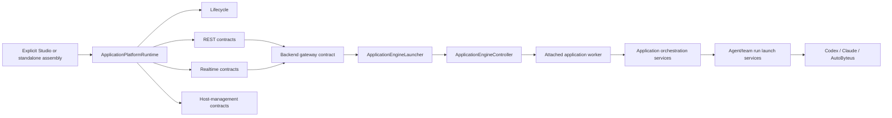
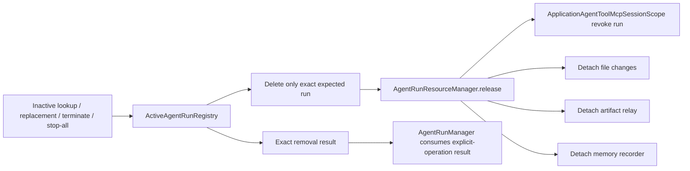
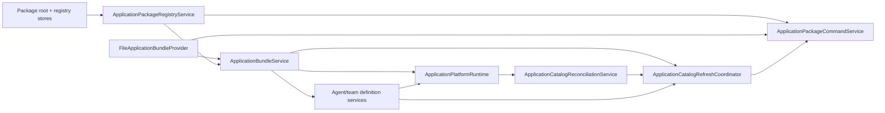
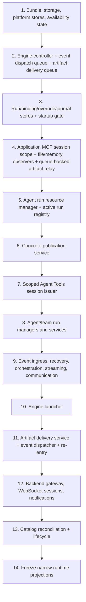

# Application Framework Architecture Simplification

## Status And Authority

- Solution revision: `SR-013`
- Trigger: `ARCH-REV-010` / `AR-008` / `AR-009`, refining `CRR-031` / `CR-019`–`CR-021`
- Status: `Proposed — architecture approval required`
- Scope: behavior-neutral internal architecture correction
- Requirements basis: `BEH-004`, `BEH-005`, `BEH-010`, `REQ-010`, `AC-019`–`AC-023`, `UC-025`–`UC-027`
- Canonical functional baseline: `CRR-029` Pass / 97, `API-REV-011` Pass / 98.9%, and `CRR-030` Pass
- Prior architecture result: `ARCH-REV-010` confirms CR-019 and CR-020 resolved in design and returns two bounded CR-021 lifecycle edges
- Persisted-data outcome: `Directly Usable — No Migration`

This supplement defines the complete internal target for the CRR-031 correction and the two ARCH-REV-010 refinements. It complements, and does not replace, the authoritative requirements and design spec. Because it defines intended architecture, it is part of the approval basis.

## Fixed Behavior Contract

The refactor must preserve all of the following:

1. the two explicit assembly roots, `buildStudioServer` and `buildStandaloneApplicationServer`;
2. all HTTP, WebSocket, GraphQL, MCP, worker-protocol, environment, package, manifest, and database contracts;
3. the same package bytes and the exact `73/73` Studio/standalone package-parity result;
4. package-owned Codex / GPT-5.6 Luna defaults, sparse Studio overrides, reset semantics, and readiness classifications;
5. the same AutoByteus, Codex, and Claude provider execution behavior;
6. the capability-scoped `/mcp/agent-tools/:sessionId` route, exact process/session identity, tool projection, authorization, and revocation;
7. application-runtime-scoped `publish_artifacts`, recipient-name `send_message_to`, team handoff, event journal, artifact projection, and business UI result;
8. Studio import/remove/reload diagnostics, identity, refresh order, and rollback;
9. startup, recovery, remount, worker-failure, restart, and shutdown behavior;
10. live artifact delivery must call the worker only after `ensureReady(applicationId)` has retained or restarted it, including when the worker exits while the provider run remains active;
11. inactive-run discovery, explicit termination, inactive replacement, stop-all, and duplicate removal must synchronously revoke that run's MCP sessions and detach file-change, artifact-relay, and memory observers exactly once;
12. runtime construction prepares infrastructure but creates no new agent/team run; only a business request or legitimate recorded-run recovery creates/restores one.

The refactor must not add `buildServer(mode)`, a service locator, a generic dependency container, a generic event bus, a generic deferred handler, an optional-field shared base runtime, a later-bound reverse callback, a compatibility alias, a dual path, or an application-path singleton/global fallback.

## Reachable Premise Record

| Premise ID | Independent Trigger / Governing Contract | Current Path And State | Material Consequence | Classification |
| --- | --- | --- | --- | --- |
| `MP-ARCH-010-001` | A maintained Studio or standalone application owns an active provider run; its application worker exits; the provider subsequently calls the supported `publish_artifacts` tool. | `PublishedArtifactPublicationService` persists the artifact and the relay calls `ApplicationEngineHostService.invokeApplicationArtifactHandler`, which first calls `ensureApplicationEngine`. | A controller-only relay would fail on the absent handle instead of restarting the worker and delivering the application artifact event. | `Reachable` |
| `MP-ARCH-010-002` | Any supported lookup, duplicate registration, explicit termination, or stop-all path encounters an inactive application-owned agent run. | `AgentRunManager.getActiveRun`/registration/termination removes the map entry, revokes run sessions, and detaches file-change, artifact-relay, and memory observers. | A registry that removes state without the exact cleanup leaks resources; a later registry-to-manager callback recreates the construction cycle. | `Reachable` |

Neither correction is speculative. Both preserve current product behavior and remove only the ownership/cycle defect.

## Current Primary And Return Spines

### Current request spine


### Current publication return spine

```mermaid
flowchart RL
    Provider[Provider run] --> Session[Scoped Agent Tools session]
    Session --> DeferredPublisher[BindOncePublishedArtifactPublisher]
    DeferredPublisher --> Publication[PublishedArtifactPublicationService]
    Publication --> RunManager[AgentRunManager active-run lookup]
    RunManager --> Relay[ApplicationPublishedArtifactRelayService]
    Relay --> Engine[ApplicationEngineHostService ensure + invoke]
    Engine --> Worker[Application worker]
    Worker --> Projection[Application business state / UI]
```



### Current active-run removal spine

```text
getActiveRun / register replacement / terminate / stop-all
  -> AgentRunManager active map
  -> unregisterActiveRun
  -> revoke run MCP sessions
  -> detach file-change observer
  -> detach artifact-relay observer
  -> detach memory observer
```

The runtime behavior is correct, but the returned runtime exposes internals, Studio package construction closes over later-assigned services, and the two bind-once objects permanently encode construction cycles.

## Target Primary And Return Spines

### Target request spine



### Target publication return spine

```mermaid
flowchart RL
    Provider[Provider run] --> Session[Scoped Agent Tools session]
    Session --> Publication[PublishedArtifactPublicationService]
    Publication --> ActiveRuns[ActiveAgentRunRegistry]
    ActiveRuns --> Relay[ApplicationPublishedArtifactRelayService]
    Relay --> DeliveryQueue[ApplicationPublishedArtifactDeliveryQueue]
    DeliveryQueue --> Delivery[ApplicationPublishedArtifactDeliveryService]
    Delivery --> Launcher[ApplicationEngineLauncher.ensureReady]
    Launcher --> Controller[ApplicationEngineController.invokeArtifactHandler]
    Controller --> Worker[Application worker]
    Worker --> Projection[Application business state / UI]

    RunEvent[Run lifecycle event] --> Journal[Durable execution-event journal]
    Journal --> EventQueue[ApplicationExecutionEventDispatchQueue]
    EventQueue --> Dispatcher[ApplicationExecutionEventDispatchService]
    Dispatcher --> Launcher
```



The two queues have different subjects and contracts:

- `ApplicationExecutionEventDispatchQueue` carries only coalesced application-ID wakeups after the durable event journal commit.
- `ApplicationPublishedArtifactDeliveryQueue` carries complete in-memory artifact-delivery commands after publication/projection and binding resolution. It preserves FIFO per run and exposes completion to the existing awaited fallback relay.

Neither queue exposes arbitrary topics, payload publication, subscriber registration, or a late handler binding. They are closed, domain-specific runtime mechanisms, not generic event buses or deferred containers.

### Target active-run removal spine



There is no `Registry -> AgentRunManager` callback. The registry receives the resource manager at construction, and the resource manager depends only on early session-revocation and observer capabilities.

## Narrow `ApplicationPlatformRuntime` Boundary

### Outward shape

`ApplicationPlatformRuntime` becomes the following four-projection boundary:

```ts
type ApplicationPlatformRuntime = Readonly<{
  lifecycle: ApplicationPlatformLifecycle;
  rest: ApplicationPlatformRestContracts;
  realtime: ApplicationPlatformRealtimeContracts;
  hostManagement: ApplicationPlatformHostManagementContracts;
}>;
```

The projections are immutable objects created once by `buildApplicationPlatformRuntime`. They contain exact subject contracts, not stores or the complete service implementations.

### Lifecycle contract

The lifecycle retains:

- `getState()`
- `getFailure()`
- `prepareBeforeListen()`
- `recoverAfterListen()`
- `awaitReady()`
- `stop()`

Route registrars receive only the `awaitReady`/state view they actually require; server entrypoints retain the complete lifecycle for prepare/recover/stop.

### REST contracts

```ts
type ApplicationPlatformRestContracts = Readonly<{
  assets: Pick<ApplicationBundleService, "resolveUiAsset">;
  backend: ApplicationBackendRestContract;
  availability: ApplicationAvailabilityRestContract;
  executionResources: ApplicationExecutionResourceRestContract;
}>;
```

- `assets` resolves only application UI assets.
- `backend` exposes the existing status/ensure/query/command/GraphQL/custom-route operations.
- `availability` exposes the existing availability reads and explicit reload/re-enter command.
- `executionResources` exposes the existing launch view, selected-resource preview, list, upsert, and reset/remove operations.

`registerRestRoutes` accepts `{ lifecycleReadiness, application: runtime.rest }`. Individual registrars receive only their one subject contract.

### Realtime contracts

```ts
type ApplicationPlatformRealtimeContracts = Readonly<{
  backend: ApplicationBackendRealtimeContract;
  notifications: ApplicationBackendNotificationContract;
  agentCommunication: ApplicationAgentCommunicationContract;
}>;
```

The three contracts preserve the existing backend custom-WebSocket, notification, and direct agent-communication behavior. `registerWebsocketRoutes` accepts `{ lifecycleReadiness, application: runtime.realtime }`; it cannot reach run stores, recovery, the engine launcher, or shutdown internals.

### Host-management contract

```ts
type ApplicationPlatformHostManagementContracts = Readonly<{
  catalogReconciliation: ApplicationCatalogReconciliationService;
}>;
```

`ApplicationCatalogReconciliationService.reconcile(snapshot)` is the sole outward host-management command. It reads known application IDs through the private platform-state store and reconciles the private availability owner. Studio package refresh never receives either store directly.

### Private runtime owners

The following remain closure-private to `buildApplicationPlatformRuntime` and lifecycle construction:

- storage/global/platform/run/binding/override/journal stores;
- availability state, recovery, event dispatch queue and dispatcher;
- active-run registry, run resource manager, run managers, run shutdown;
- application Agent Tools session scope, scoped session manager, and publisher;
- published-artifact delivery queue/service and relay;
- engine controller and launcher;
- streaming, gateway session, notifications, and cleanup owners.

No caller above the runtime boundary receives these objects merely to select one method.

## Studio Package Ownership And Refresh

### Owners

| Owner | Scope And Responsibility | Must Not Own |
| --- | --- | --- |
| `ApplicationPackageRegistryService` | Built-in/additional package-root and registry-record state; snapshots, list/details, diagnostics; package-state mutations used by commands | Bundle/definition refresh, application availability, platform-state lookup, runtime internals, global/default resolution |
| `ApplicationPackageCommandService` | Import local/GitHub, reload, remove, validation, installer cleanup, transaction rollback, and command results | Definition traversal, availability logic, hidden service lookup |
| `ApplicationCatalogRefreshCoordinator` | One ordered propagation from committed package registry state to bundle catalog, availability, agent definitions, and team definitions | Package record mutation, installation, GraphQL mapping |
| `ApplicationCatalogReconciliationService` | Runtime-private known-state lookup plus availability reconciliation for one supplied catalog snapshot | Package installation/rollback or definition cache refresh |

### Acyclic Studio construction



`buildStudioServer` contains no `let service!` declaration and no callback that closes over a later assignment.

### Validation

Package command validation uses the same explicitly constructed `FileApplicationBundleProvider.validatePackageRoot(packageRoot, packageId)` that backs the bundle service. It does not call back through the bundle service and does not construct a second parser.

### Refresh order

`ApplicationCatalogRefreshCoordinator.refresh()` always performs:

1. `bundleService.refresh()`;
2. `bundleService.getCatalogSnapshot()`;
3. `catalogReconciliation.reconcile(snapshot)`;
4. `agentDefinitionService.refreshCache()`;
5. `agentTeamDefinitionService.refreshCache()`.

No command or GraphQL resolver may reproduce this sequence.

### Command and rollback semantics

- **Local import:** validate root and package contents; add root; upsert registry record; refresh; return list. On failure, remove the added root/record, perform one best-effort refresh, and rethrow the original error.
- **GitHub import:** install; validate; add root and managed record; refresh; return list. On failure, restore registry/root state, delete only that managed installation, perform one best-effort refresh, and rethrow.
- **Remove:** capture prior root/record; remove root/record; refresh; only after successful refresh delete the managed installation. On failure, restore captured state, perform one best-effort refresh, and rethrow.
- **Reload:** materialize the built-in package when applicable; refresh through the coordinator; return list.

The GraphQL wire schema and field names remain unchanged. Its configured Studio services hold separate query and command contracts instead of one overloaded registry object.

## Acyclic Run, Publication, Session, And Cleanup Construction

### Early application MCP session scope

`ApplicationAgentToolMcpSessionScope` is created from the exact process MCP session service/registry before the application publisher exists. `AgentToolsMcpRuntime` exposes one narrow `ApplicationAgentToolsSessionFactory` with `createApplicationSessionScope(scopeIdentity)` for that early owner and `createApplicationSessionManager({ scope, executionCapabilities, assertExecutionCapabilitiesReady })` for the later concrete-publisher issuer. Both operations use the same private process registry/catalog family; neither exposes those internals. The scope owns only application-scope session ownership and revocation:

```ts
interface ApplicationAgentToolMcpSessionScope {
  recordIssuedSession(sessionId: string, owner: AgentToolMcpSessionOwnerIdentity): void;
  revokeForRun(runId: string): number;
  revokeForMemberRun(memberRunId: string): number;
  revokeForOwner(owner: Partial<AgentToolMcpSessionOwnerIdentity>): number;
  blockNewSessions(): void;
  close(): void;
}
```

Rules:

- it does not create descriptors, choose tools, carry a publisher, or know an `AgentRunManager`;
- `recordIssuedSession` fails after block/close and rejects duplicate ownership;
- if later session issuance succeeds in the process registry but scope recording fails, the scoped manager immediately revokes that exact newly created session before propagating the error;
- all revoke methods delete scope ownership before invoking process-registry revocation and are idempotent;
- `close` blocks recording, revokes every remaining owned session once, clears ownership, and is idempotent.

The later `ScopedAgentToolMcpSessionManager` combines the same scope, the exact process session service/catalog, and the concrete application publisher. It owns session issuance and descriptor redaction. Run cleanup depends only on the early scope's revocation contract, never on the later issuer or publisher.

### `AgentRunResourceManager`

`AgentRunResourceManager` is created before the active registry. It receives only:

- the early application MCP session-scope revoker;
- `RunFileChangeService`;
- the queue-backed `ApplicationPublishedArtifactRelayService`;
- `AgentRunMemoryRecorder`.

It owns the exact resource set attached to one active agent run:

```ts
type AgentRunResourceReleaseResult = Readonly<{
  state: "released" | "already_released";
  runId: string;
  revokedSessionCount: number;
  detached: Readonly<{
    fileChanges: boolean;
    artifactRelay: boolean;
    memoryRecorder: boolean;
  }>;
  errors: readonly Error[];
}>;

interface AgentRunResourceManager {
  attach(run: AgentRun): void;
  release(runId: string, expectedRun: AgentRun): AgentRunResourceReleaseResult;
}
```

`attach` creates the resource record before registering observers and records each disposer immediately after successful attachment. If any attachment fails, it releases every partial attachment and reports the original plus cleanup errors. `release` removes its resource record before revoking/detaching, attempts every cleanup action, and returns one result. Repeated or competing release is `already_released`; it never invokes a disposer or revoker twice.

### `ActiveAgentRunRegistry`

The registry owns the active map, exact-run identity transitions, inactive pruning, and the rule that removal is not complete until the resource manager has run:

```ts
type AgentRunRemovalReason =
  | "inactive_discovery"
  | "explicit_termination"
  | "inactive_replacement"
  | "stop_all"
  | "registration_rollback";

type AgentRunRemovalResult =
  | Readonly<{
      kind: "removed";
      run: AgentRun;
      reason: AgentRunRemovalReason;
      resources: AgentRunResourceReleaseResult;
    }>
  | Readonly<{ kind: "not_found"; runId: string; reason: AgentRunRemovalReason }>
  | Readonly<{
      kind: "identity_mismatch";
      runId: string;
      expectedRun: AgentRun;
      currentRun: AgentRun;
      reason: AgentRunRemovalReason;
    }>;

interface ActiveAgentRunRegistry {
  register(run: AgentRun): void;
  getActiveRun(runId: string): AgentRun | null;
  listActiveRuns(): readonly AgentRun[];
  removeIfCurrent(input: {
    runId: string;
    expectedRun: AgentRun;
    reason: AgentRunRemovalReason;
  }): AgentRunRemovalResult;
}
```

Exact transition rules:

1. **Registration:** an active duplicate is rejected. An inactive existing run is removed with `inactive_replacement` and completely cleaned before the new run is stored. The new run is then stored and resources are attached. Attachment failure deletes only that exact run, releases partial resources with `registration_rollback`, and propagates the attachment/cleanup error.
2. **Inactive discovery:** `getActiveRun` checks the current object. If inactive, it calls `removeIfCurrent` with that exact object and `inactive_discovery`; cleanup completes synchronously before `null` is returned. Cleanup errors are surfaced after all cleanup actions were attempted.
3. **Explicit termination:** `AgentRunManager` reads the exact run, awaits its termination, and only on accepted termination calls `removeIfCurrent(expectedRun, "explicit_termination")`. It consumes the result and never removes a replacement.
4. **Stop-all:** the manager snapshots `listActiveRuns()`, terminates each exact object, and calls `removeIfCurrent(expectedRun, "stop_all")`; inactive discovery during the snapshot is already pruned/cleaned. Failures are aggregated after every snapshot entry is attempted.
5. **Duplicate/late removal:** `not_found` or `identity_mismatch` is a no-op for resources. A replacement run can never be removed by a stale termination/removal completion.
6. **Cleanup failure:** map/resource ownership is already removed and all four cleanup categories are attempted. Registry/manager operations surface one aggregate error carrying the removal result; they do not return a false clean success or re-run cleanup.

`AgentRunManager` retains backend selection, create, restore, terminate, and stop-all. It no longer owns the active map or observer/session disposer maps. No registry callback references the manager.

### Construction order for this subgraph

1. create the application MCP session scope from the exact process MCP family;
2. create file-change and memory observer services plus the artifact-delivery queue and queue-backed relay;
3. create `AgentRunResourceManager` from those early capabilities;
4. create `ActiveAgentRunRegistry(resourceManager)`;
5. create the concrete `PublishedArtifactPublicationService` from the active-run reader and queue-backed relay;
6. create `ScopedAgentToolMcpSessionManager` from the exact session scope/process family and concrete publisher;
7. create explicit provider factories and `AgentRunManager`/`AgentTeamRunManager` from the registry and scoped issuer.

`BindOncePublishedArtifactPublisher` is removed. A scoped session cannot be issued without a concrete publisher, while cleanup can still revoke sessions through the earlier scope. No generic deferred value, later callback, or application default/global path is introduced.

### General-process isolation

Application-path constructors require explicit dependencies. Existing supported non-application behavior is assembled through named process factories:

- `createGeneralProcessPublishedArtifactPublisher(...)`
- `createGeneralProcessRunSupervisor(...)`

Those factories may supply the established process manager/stores/relay, but application assembly may not call them or fall back to them. This is a bounded seam correction, not a repository-wide singleton rewrite.

## Acyclic Engine, Artifact Delivery, And Event Construction

### Engine controller

`ApplicationEngineController` is created early and owns:

- worker handle and status registries;
- attach/detach of one worker handle;
- query/command/GraphQL/custom-route/event/artifact invocation on an attached handle;
- notification, WebSocket-action, and worker-close listener collections;
- stop of attached workers and cleanup of their status/listener state.

It does not discover bundles, prepare storage, create worker processes, load definitions, or handle application context capabilities.

### Engine launcher

`ApplicationEngineLauncher` is constructed after orchestration and streaming exist. It owns:

- coalesced per-application startup promises;
- bundle lookup and storage preparation/repair;
- worker process/client creation;
- definition loading;
- application context-capability and stream handler wiring;
- attachment/detachment through the exact controller;
- `ensureReady`, stop-one, and stop-all coordination.

The backend gateway, event dispatcher, and artifact delivery service use the launcher to ensure readiness and the controller to invoke. No caller that needs lazy-start/restart behavior invokes the controller directly.

### Published-artifact delivery queue

`ApplicationPublishedArtifactRelayService` continues to own binding lookup, application-event mapping, malformed/unbound diagnostics, and the distinction between fire-and-forget active-run events and awaited fallback publication. Instead of calling an engine service, it enqueues:

```ts
type ApplicationPublishedArtifactDeliveryCommand = Readonly<{
  runId: string;
  applicationId: string;
  bindingId: string;
  revisionId: string;
  event: ApplicationPublishedArtifactEvent;
}>;
```

`ApplicationPublishedArtifactDeliveryQueue` owns:

- FIFO delivery within one `runId`;
- concurrent readiness of different run lanes;
- one completion promise per accepted command;
- delivery leases that make the next command in a run ready only after the current lease completes/fails;
- `stopAccepting()` and `awaitDrained()` lifecycle, with no handler registration.

The relay awaits `enqueue(command)` internally. The active-run event subscription still invokes the relay without awaiting it and logs delivery failure; the fallback no-active-run path awaits relay completion. This preserves the existing caller-visible distinction. A delivery failure never rolls back the already persisted artifact snapshot/projection.

### Published-artifact delivery service

`ApplicationPublishedArtifactDeliveryService` is created after the launcher/controller and owns the queue-consumer loop:

1. take an artifact-delivery lease;
2. `await applicationEngineLauncher.ensureReady(command.applicationId)`;
3. `await applicationEngineController.invokeApplicationArtifactHandler(command.applicationId, { event })`;
4. complete or fail the lease;
5. continue the same run lane only after settlement.

The service starts before lifecycle readiness or recorded-run recovery. If the worker exited after the application started, step 2 coalesces/restarts it before step 3. It never treats an absent controller handle as the expected steady-state outcome.

### Event dispatch queue

`ApplicationExecutionEventDispatchQueue` is created before event ingress. After a durable journal append, ingress enqueues only the application ID. IDs are coalesced. The later dispatcher consumes the queue, checks availability, ensures the worker through `ApplicationEngineLauncher`, invokes through `ApplicationEngineController`, and preserves the current journal acknowledgment, failure, retry timestamp, exponential backoff, resume, suspend, and stop behavior.

The queue has no arbitrary payload or topic API. The journal remains the authoritative event record. This removes `BindOnceApplicationEngineEventHandler` without inventing a generic deferred dependency.

### Availability and re-entry

The stable availability state/query/reconciliation owner is constructed before orchestration and supplies the existing active/quarantined/re-entering guard. The later `ApplicationReentryService` owns only the reload/re-enter command:

1. set `REENTERING`;
2. stop the worker through launcher/controller;
3. reload the bundle;
4. reconcile the new catalog snapshot;
5. recover the application;
6. resume its pending event dispatch;
7. set `ACTIVE`, or quarantine with the existing diagnostic.

This lets orchestration depend on stable availability state without making the state owner depend on the later engine/event services.

## Complete Target Construction Order



At no point does construction create or restore a run. The artifact delivery service and event dispatcher are started before `recoverAfterListen`; recovery alone restores recorded runs, and new execution occurs only after a business launch request.

## Ownership And Forbidden-Dependency Map

| Owner | Allowed dependencies | Forbidden dependencies |
| --- | --- | --- |
| REST/realtime registrar | lifecycle readiness plus its exact REST/realtime contract | whole runtime, stores, recovery, run managers, engine internals |
| Package registry | package settings/record stores and materializer | bundle/definition/runtime/availability globals |
| Package command service | registry, installer, file provider validator, refresh coordinator | direct definition refresh or platform-state access |
| Catalog refresh coordinator | bundle, catalog reconciliation, agent/team definitions | package mutation/installer, runtime stores |
| Application MCP session scope | exact process session revoker/registry and owned session identities | publisher, catalog selection, run manager, runtime aggregate |
| Agent run resource manager | session-scope revoker and exact three observer attachments | active map, backend factories, scoped issuer/publisher, manager callback |
| Active run registry | run map plus resource manager | backend factories, scoped issuer, publisher, `AgentRunManager` callback/global |
| Application publication service | active-run reader and explicit stores/relay/workspace | `AgentRunManager.getInstance`, default publication service |
| Scoped session manager | process MCP session/catalog, application session scope, concrete application publisher | general-process publisher or global run manager |
| Artifact relay | binding store and artifact-delivery queue | engine controller, launcher, broad engine host, global relay default |
| Artifact delivery service | artifact queue, launcher, controller | run manager/registry, generic handler registry, runtime aggregate |
| Engine controller | attached worker handles/status/listeners | bundle, storage, orchestration, global engine service |
| Engine launcher | bundle, storage, controller, orchestration, streaming | application runtime aggregate or hidden global service |
| Event dispatcher | journal, event queue, availability reader, launcher, controller | bind-once handler, runtime aggregate, generic event bus |
| Lifecycle | explicit private stop/start participants | returned 19-field service collection |

## Source Inventory

### Add

- `application-platform/runtime/application-platform-runtime-contracts.ts`
- `application-platform/runtime/application-catalog-reconciliation-service.ts`
- `application-packages/services/application-package-command-service.ts`
- `application-packages/services/application-catalog-refresh-coordinator.ts`
- `agent-tools/mcp/application-agent-tool-mcp-session-scope.ts`
- `agent-execution/runtime/active-agent-run-registry.ts`
- `agent-execution/services/agent-run-resource-manager.ts`
- `application-engine/services/application-engine-controller.ts`
- `application-engine/services/application-engine-launcher.ts`
- `application-orchestration/services/application-execution-event-dispatch-queue.ts`
- `application-orchestration/services/application-published-artifact-delivery-queue.ts`
- `application-orchestration/services/application-published-artifact-delivery-service.ts`
- `application-orchestration/services/application-reentry-service.ts`
- named general-process publication/run assembly factory files only if a current process consumer still requires default construction

### Modify

- both explicit server builders and `server-runtime.ts`;
- `application-platform-runtime.ts`, its builder, lifecycle, lifecycle contracts, and current orchestration/run construction builders;
- REST, WebSocket, standalone REST/WebSocket registrars;
- package registry, bundle service, Studio GraphQL service configuration, and application-package resolver;
- `agent-tools-mcp-runtime.ts`, `scoped-agent-tool-mcp-session-manager.ts`, and their `ApplicationAgentToolsSessionFactory`/process-session contracts;
- agent run manager, publication/projection service, artifact relay, event ingress/dispatch, availability, engine gateway/WebSocket session, recovery, and streaming seams;
- focused unit/integration tests and the application/backend/orchestration/developer module documentation named in the design spec.

### Remove

- `application-platform/runtime/bind-once-published-artifact-publisher.ts`
- `application-platform/runtime/bind-once-application-engine-event-handler.ts`
- `application-engine/services/application-engine-host-service.ts` after its responsibilities move to controller/launcher
- manager-owned active-map and observer/session-unsubscriber collections superseded by registry/resource manager/scope
- application-path optional/global dependency branches made obsolete by explicit assembly
- tests that assert the removed broad runtime or bind-once contracts, replaced by target-owner tests

Old symbols/files are deleted in the same implementation. No compatibility export or alias remains.

## Refactor Sequence

1. Add characterization assertions for current ensure-before-artifact invocation, worker-exit-before-publication, inactive discovery/replacement/termination/stop-all cleanup, the 19-field consumer inventory, package refresh/rollback order, run creation trigger, event retry, recovery/remount, and stop order.
2. Introduce the narrow runtime contract types and move route/host consumers to exact projections while the underlying services remain unchanged.
3. Split package registry query/state from package commands; add the refresh coordinator; remove all late-assigned Studio callbacks and application-path defaults.
4. Introduce the early application MCP session scope, queue-backed artifact relay, `AgentRunResourceManager`, and `ActiveAgentRunRegistry`; migrate active-map and attachment/session cleanup atomically.
5. Build the concrete application publisher from the registry, build the scoped issuer from scope/process family/publisher, then migrate run managers; remove the publisher bind-once proxy.
6. Split engine controller from launcher; add the closed artifact-delivery queue/service and event-dispatch queue; migrate relay, event ingress/dispatch, and re-entry; remove the engine-handler bind-once proxy and old engine-host service.
7. Rebuild lifecycle construction and stop order from explicit private participants; freeze only the four outward runtime projections.
8. Remove old files, old manager collections, optional/default application paths, imports, and tests. Run retired-symbol and no-alias scans.
9. Run implementation review, the complete API-REV-011 dual-host characterization baseline, focused worker-loss delivery and exact-once cleanup tests, proportional durable-test review, and integrated-state checks.

Each sequence is a clean cut; no old/new runtime path runs in parallel.

## Shutdown Order

Fastify close stops accepting new HTTP/WebSocket/MCP work and drains accepted transport work before its runtime `onClose` hook. The application lifecycle then preserves current external shutdown behavior with these exact private participants:

1. block new application Agent Tools session issuance;
2. stop durable execution-event dispatch intake/timers;
3. close direct agent communication and dispose backend gateway/WebSocket/notification ingress;
4. stop accepting new artifact-delivery commands and drain every already accepted command through launcher ensure + controller invoke while workers may still run/restart;
5. dispose remaining runtime-level run observers;
6. stop engine startups and attached workers through launcher/controller;
7. stop team runs, then agent runs; each exact agent-run removal releases its observers and run sessions through registry/resource manager;
8. close the application MCP session scope/scoped issuer, revoking any remaining owned sessions;
9. stop streaming;
10. stop process-level MCP/general-run/channel/event/vault/Prisma resources in the existing server-owned order.

No accepted artifact command is abandoned because a worker handle disappeared. No artifact delivery is accepted after step 4. There is no publisher-bind close step and no later callback to detach resources.

## Validation Contract

Required structural and executable evidence:

1. runtime type exposes exactly `lifecycle`, `rest`, `realtime`, and `hostManagement`; registrars do not accept the whole runtime;
2. no production caller outside the runtime builder/lifecycle imports private stores/recovery/run/engine/session owners;
3. Studio construction has no late non-null service variables or callbacks over later assignments;
4. import/remove/reload preserve exact refresh order and rollback, including a refresh-failure case;
5. runtime construction yields zero new/restored agent/team runs;
6. application session scope exists before publication, tracks/revokes only its exact process-registry sessions, and session issuance rolls back if scope recording fails;
7. active-run identity used by publication/projection is the exact application registry, while general-process sentinels remain distinct;
8. inactive lookup cleans before null; inactive replacement cleans before attach; explicit terminate and stop-all consume exact removal results; stale/duplicate removal cannot remove a replacement; every run revokes sessions and detaches file/artifact/memory observers exactly once;
9. scoped sessions receive a concrete publisher at construction; both bind-once files and symbols are absent;
10. active-run artifact events preserve per-run order and fire-and-forget relay semantics; fallback publication awaits relay; relay failure does not roll back persisted snapshots/projection;
11. when the worker exits while an application provider run remains active, a subsequent real `publish_artifacts` command is dequeued, `ensureReady` restarts the worker, the controller invokes the artifact handler, and the business projection/UI receives the event;
12. event ingress commits before enqueue, dispatcher preserves retry/backoff/resume, and engine launcher/controller identity is exact;
13. artifact-delivery queue/service and execution-event queue are closed domain contracts with no generic topics/subscribers/handler binding;
14. worker crash, restart/recovery, remount, real publication/handoff/projection, and shutdown pass in both hosts;
15. route, schema, database, package digest, and `73/73` parity evidence matches API-REV-011.

## Data And Migration Decision

No serialized or persisted representation changes. Existing package files, manifests, application/platform databases, launch-override rows, event journals, run lookup state, projections, and migration ledgers remain directly usable. The two new queues, session-scope ownership, active-run map, resource records, and removal results are process memory only. No migration, copy, seeding, dual read/write, or compatibility code is permitted.
