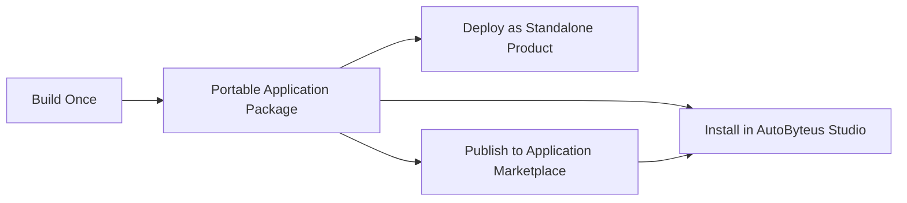
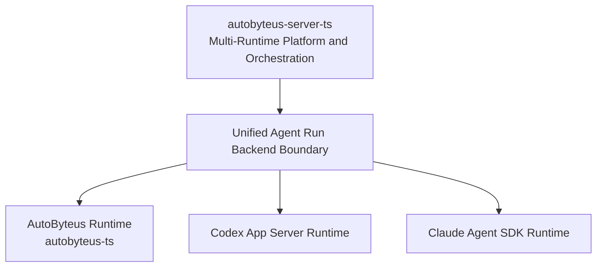
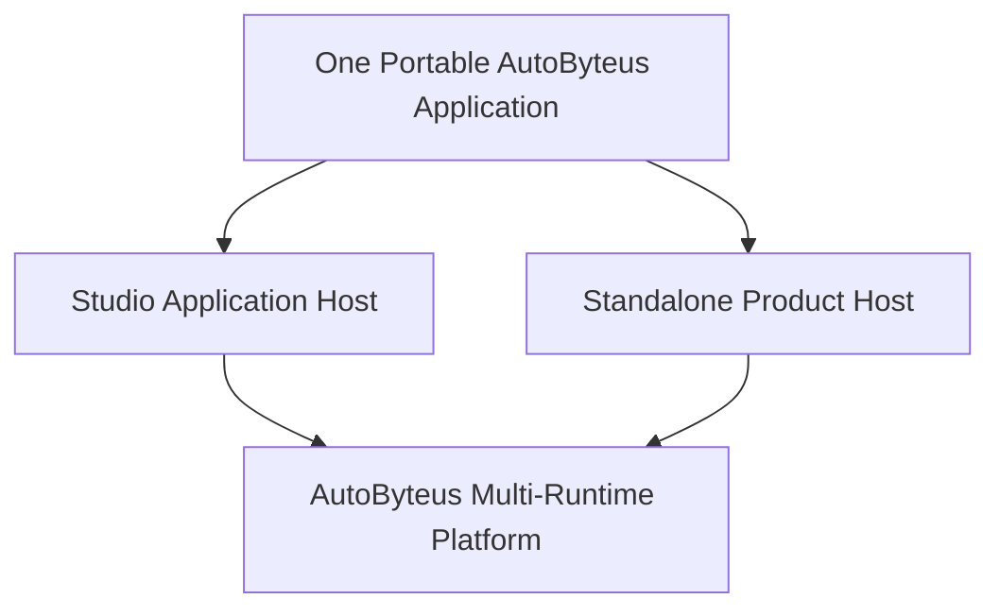
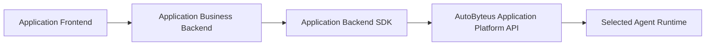
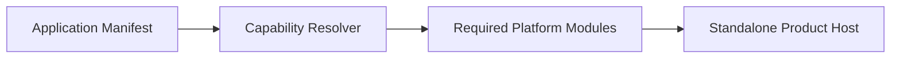
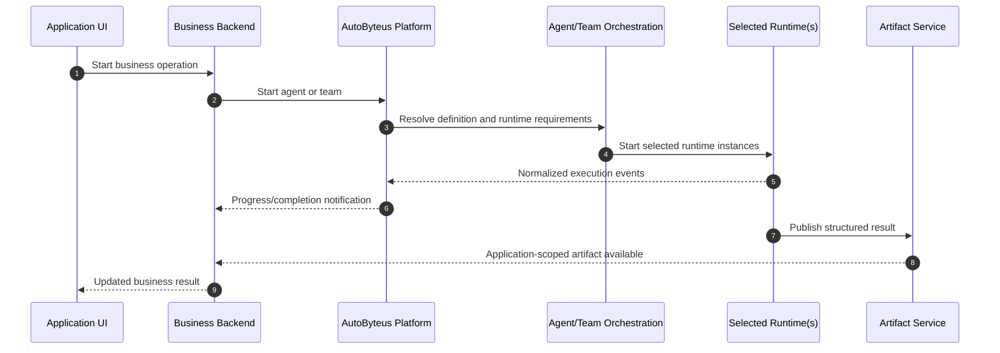
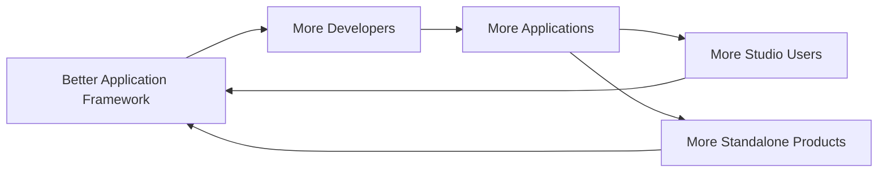
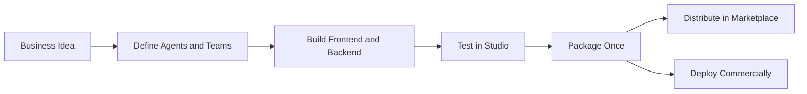

# AutoByteus Universal Application Framework

## Vision and General Architecture Proposal

**Status:** Product and architecture vision  
**Updated:** 26 July 2026  
**Audience:** AutoByteus product, framework, runtime, Studio, and application-development teams

---

## 1. Executive Vision

AutoByteus should allow a developer to build one complete agent-powered application and use that same application in two ways:

1. Install and run it as an application inside AutoByteus Studio.
2. Deploy it as an independent, branded vertical AI product.

The application must not be rewritten when moving between these modes. The frontend, business backend, database migrations, agents, agent teams, skills, tools, and tests remain the same.



This creates a continuous product path:

```text
Agent experiment
-> local application development
-> application testing inside Studio
-> packaged Studio application
-> marketplace distribution
-> independent commercial vertical AI product
```

The central promise is:

> Build the business application, not the agent infrastructure. Bring your frontend, business backend, agents, agent teams, skills, and tools. AutoByteus supplies the multi-runtime execution, orchestration, application lifecycle, communication, packaging, and hosting foundation.

---

## 2. Why This Matters

Most agent frameworks solve only part of the application-development problem. They may provide an agent loop, a chat component, workflow orchestration, or hosted execution. Developers still have to assemble the complete product themselves.

AutoByteus already has unusually broad capabilities:

- multiple agent runtimes;
- individual agent execution;
- mixed-runtime agent-team orchestration;
- task delegation and inter-agent communication;
- skills, tools, and MCP integration;
- application packages;
- application backend execution;
- application-owned storage;
- frontend/backend application SDKs;
- application-to-agent communication;
- streaming and published artifacts;
- a general-purpose Studio capable of hosting multiple applications;
- an application devkit.

The opportunity is to expose these capabilities as one coherent application framework.

### Strategic advantage

A developer should not need to choose between:

```text
Build an application for the AutoByteus ecosystem
```

and:

```text
Build an independent commercial product
```

The same application should support both.

This gives developers a low-risk path. They can begin locally, use Studio to configure and inspect agents, distribute through the AutoByteus ecosystem, and later graduate to a standalone commercial deployment without discarding their work.

---

## 3. Correct Current Architecture Model

The architecture must use precise terminology.

### 3.1 `autobyteus-ts`

`autobyteus-ts` is the AutoByteus runtime implementation. It provides the execution machinery of the AutoByteus-native agent runtime, including agent lifecycle, model interaction, tool execution, memory, context, streaming, compaction, and interruption.

It is not the universal foundation directly consumed by a vertical application.

### 3.2 `autobyteus-server-ts`

`autobyteus-server-ts` is the larger multi-runtime execution and orchestration platform. It contains runtime adapters and server-managed execution paths for multiple runtimes, including:

```text
autobyteus-server-ts/src/agent-execution/backends/
├── autobyteus/
├── codex/
└── claude/
```

The server provides a normalized execution boundary across:

- the AutoByteus runtime;
- Codex App Server;
- Claude Agent SDK;
- future runtime adapters.

It also owns:

- agent definitions and execution management;
- agent-team definitions and execution;
- mixed-runtime teams;
- task delegation;
- inter-agent communication;
- application packages and application orchestration;
- application backend workers;
- application storage;
- APIs and WebSockets;
- work traces and artifacts;
- runtime management;
- many additional Studio, remote-access, token, file, and platform APIs.

Therefore, the correct relationship is:



`autobyteus-ts` is one runtime behind the server's unified execution model; it is not the common engine underneath Codex and Claude.

### 3.3 `autobyteus-web`

`autobyteus-web` is AutoByteus Studio: the general-purpose user interface and multi-application host. It provides application discovery, configuration, agent and team management, generic execution interfaces, and platform-oriented navigation.

Studio is one product built on the server platform. It is not required to be the visible frontend of every standalone product.

### 3.4 Application framework packages

The repository already contains the beginning of the portable application layer:

```text
autobyteus-application-sdk-contracts/
autobyteus-application-backend-sdk/
autobyteus-application-frontend-sdk/
autobyteus-application-devkit/
```

These packages should become the stable boundary between a custom application and the AutoByteus platform.

---

## 4. Target Product Model

AutoByteus should have two application hosts backed by the same platform capabilities.



### 4.1 Studio-hosted mode

AutoByteus Studio remains the main product and may host many installed applications:

```text
AutoByteus Studio
└── Applications
    ├── Evidence Desk
    ├── Energy Companion
    ├── Research Workspace
    └── Other installed applications
```

Studio owns:

- application installation and discovery;
- platform navigation;
- shared runtime availability;
- application lifecycle;
- application-scoped storage and resources;
- developer and diagnostic surfaces;
- the outer hosting shell.

An iframe is a reasonable isolation boundary in this mode because Studio owns the outer document and hosts multiple independently built applications.

### 4.2 Standalone mode

The vertical application is the main product:

```text
Evidence Desk
└── Powered invisibly by AutoByteus
```

The standalone host owns:

- loading one selected application package;
- starting the required AutoByteus platform capabilities;
- starting the application's business backend;
- registering its agents, teams, skills, and tools;
- serving the product frontend directly at `/`;
- proxying business and platform APIs;
- exposing optional diagnostics.

The customer should not see Studio, a generic application launcher, or a long internal application URL.

### 4.3 The application is portable; the host is replaceable

The portable application must not claim that it globally owns `/`. Root ownership is a standalone-host deployment decision. Inside Studio, the same application can be hosted under Studio's application route.

---

## 5. The Portable Application Package

The application package is the unit of development, testing, distribution, installation, and deployment.

```text
my-application/
├── application.json
├── frontend/
│   ├── src/
│   ├── vite.config.ts
│   └── package.json
├── backend/
│   ├── api/
│   ├── domain/
│   ├── services/
│   ├── repositories/
│   ├── migrations/
│   └── tests/
├── agents/
│   └── primary-agent/
│       ├── agent-config.json
│       └── AGENT.md
├── agent-teams/
├── skills/
├── tools/
├── tests/
└── package.json
```

The built artifact can eventually use a dedicated extension such as:

```text
my-application-1.0.0.abapp
```

Conceptually, it contains:

```text
my-application-1.0.0.abapp
├── application.json
├── frontend/dist/
├── backend/bundle/
├── agents/
├── agent-teams/
├── skills/
├── tools/
├── migrations/
├── integrity.json
└── signature.json
```

The package does not contain the entire AutoByteus Studio frontend or a copied AutoByteus server.

---

## 6. Application Ownership Boundary

### 6.1 The application developer owns

- product frontend and user experience;
- business backend and APIs;
- domain model and deterministic business rules;
- business database and migrations;
- application-specific authentication, if required;
- application-specific users, organizations, roles, and permissions;
- agent and agent-team definitions;
- domain skills and tools;
- business interpretation of agent outputs;
- product tests and documentation.

### 6.2 AutoByteus owns

- runtime selection and runtime adapters;
- agent execution;
- multi-agent and mixed-runtime team orchestration;
- task delegation and agent communication;
- tool and skill discovery;
- MCP integration;
- platform-level tool approval mechanics;
- execution state and events;
- published artifacts;
- application resource registration;
- application lifecycle and backend hosting;
- application communication contracts;
- packaging, validation, and host integration.

### 6.3 Authentication does not belong to AutoByteus Studio

AutoByteus currently does not provide a general user-account, organization, role, or application-authentication system. Existing remote-access credentials, MCP bearer tokens, provider credentials, and application-agent target authorization are narrow security mechanisms, not a general application identity system.

Authentication for a standalone vertical product belongs to that product's business backend.

Examples:

```text
Evidence Desk:
- Auditor
- Audit Manager
- Organization Administrator

Energy application:
- Household User
- Installer
- Energy Advisor
```

These concepts must not be forced into Studio.

An application without authentication may run locally. A publicly deployed product can implement its preferred authentication method or operate behind an authenticated gateway.

---

## 7. Host-Neutral Application Contract

The same application code can run in two hosts only if it depends on a stable application contract rather than Studio internals.

Applications may depend on:

```text
@autobyteus/application-sdk-contracts
@autobyteus/application-frontend-sdk
@autobyteus/application-backend-sdk
```

Applications must not depend on:

- `autobyteus-web` Vue components;
- Studio Pinia stores;
- Studio-specific routes;
- internal GraphQL clients;
- internal `autobyteus-server-ts` service classes;
- globally installed but undeclared resources.

### 7.1 Logical environment contract

Both hosts supply the same logical environment:

```ts
export type ApplicationEnvironment = {
  applicationId: string;
  hostMode: "studio" | "standalone";
  businessApiBaseUrl: string;
  platformApiBaseUrl: string;
  eventStreamUrl: string;
  capabilities: string[];
};
```

No general `user`, `organization`, or `roles` field is assumed. Those belong to the application when needed.

### 7.2 Transport abstraction

The logical contract stays the same while the physical transport can differ:

```ts
export interface ApplicationTransport {
  callBackend(request: BackendRequest): Promise<BackendResponse>;
  subscribe(topic: string): ApplicationEventSubscription;
  readArtifact(artifactId: string): Promise<ApplicationArtifact>;
  close(): Promise<void>;
}
```

Implementations:

```text
StudioIframeTransport
StandaloneSameOriginTransport
```

### 7.3 Studio frontend transport

Inside Studio:

```text
Application frontend
-> iframe ready/bootstrap handshake
-> Studio Application Host
-> application gateway
```

The existing iframe contract remains useful for application isolation.

### 7.4 Standalone frontend transport

Standalone:

```text
Application frontend at /
-> same-origin application bootstrap
-> application gateway
```

The standalone product does not need a visible Studio shell. It can serve the application frontend directly and expose a bootstrap resource such as:

```text
GET /_autobyteus/bootstrap
```

The frontend SDK selects the appropriate transport without requiring business components to branch on hosting mode.

---

## 8. Business Backend Portability

The application business backend is first-class. An agent is not a replacement for deterministic domain logic and persistence.

For Evidence Desk, the business backend owns:

- companies and audit periods;
- dossier imports;
- fraud-check operations;
- validated findings;
- auditor dispositions and notes;
- report generation;
- business-level authorization if deployed publicly.

The same backend bundle must run in both modes.



Inside Studio, the Studio Application Host starts the backend through the application engine. Standalone, the Standalone Product Host starts the same bundle through the same logical lifecycle.

The backend should use an application-facing SDK:

```ts
const run = await autobyteus.agentTeams.start({
  teamId: "audit-investigation-team",
  input: {
    companyId,
    dossierPath,
  },
});
```

It must not construct runtime implementations or import internal server managers directly.

---

## 9. Application-Scoped Resources

Portability requires explicit ownership and isolation.

Agents, teams, skills, tools, storage, artifacts, and backend processes must be scoped to the application:

```text
evidence-desk/fraud-investigator
evidence-desk/audit-review-team
evidence-desk/publish-findings
```

An application must not silently depend on a resource that happens to be installed globally in one developer's Studio.

Every dependency must be either:

1. Bundled in the application package; or
2. Declared as an explicit versioned dependency.

```json
{
  "resourceDependencies": [
    {
      "type": "skill",
      "id": "document-analysis",
      "version": "^2.0.0"
    }
  ]
}
```

Packaging must fail clearly when a required resource cannot be resolved.

---

## 10. Capability-Driven Platform Composition

The entire current `autobyteus-server-ts` should not be treated as the minimal runtime of every vertical product. It includes many APIs and capabilities that a particular application may not need, such as global token statistics, file exploration, remote access, launch preferences, external channels, and Studio administration.

The correct target is not a stripped server fork. It is modular composition.

### 10.1 Platform capability categories

#### Multi-runtime agent platform capabilities

- runtime adapter contract;
- AutoByteus runtime adapter;
- Codex App Server adapter;
- Claude Agent SDK adapter;
- agent definition and execution;
- agent-team definition and execution;
- mixed-runtime team orchestration;
- task delegation;
- agent communication;
- tools, skills, and MCP;
- event normalization;
- work traces and artifacts.

#### Application runtime capabilities

- application package loading;
- application backend worker;
- application storage;
- application backend API gateway;
- application-to-agent communication;
- application agent streaming;
- package-scoped resource registration;
- minimal health and diagnostics.

#### Optional Studio/platform capabilities

- global token reporting APIs;
- generic file explorer;
- launch preferences;
- external channels;
- remote-access management;
- package administration;
- global provider-management interfaces;
- Studio-specific GraphQL and administrative APIs.

### 10.2 Module contract

Server capability areas should move toward explicit registration and lifecycle ownership:

```ts
export interface AutoByteusPlatformModule {
  readonly id: string;
  readonly dependencies?: string[];

  register(container: PlatformServiceContainer): void;
  mountRoutes?(router: PlatformRouter): void;
  start?(): Promise<void>;
  stop?(): Promise<void>;
}
```

This does not require immediately splitting every subsystem into a separate repository or package. The first step is establishing explicit ownership and composition inside the existing server.

### 10.3 Two composition roots

```text
autobyteus-server-ts/src/compositions/
├── studio-platform.ts
└── standalone-application-platform.ts
```

Studio composition enables the broad platform.

Standalone composition resolves the capabilities required by one application manifest.



### 10.4 Initial implementation can remain proportionate

The first portability proof may start the existing full server headlessly while exposing only the application-facing API. That is acceptable as an intermediate step.

The long-term target is to avoid initializing, exposing, and packaging unrelated capabilities. Physical package extraction should happen only after module boundaries are proven.

---

## 11. Application Manifest

The manifest describes a portable application, not a Studio-only plugin or standalone-only root site.

Illustrative shape:

```json
{
  "id": "com.example.evidence-desk",
  "name": "Evidence Desk",
  "version": "1.0.0",
  "publisher": "Example GmbH",
  "platformVersion": "^1.0.0",

  "frontend": {
    "framework": "vue",
    "buildOutput": "./frontend/dist"
  },

  "backend": {
    "runtime": "node",
    "entrypoint": "./backend/bundle/main.js"
  },

  "resources": {
    "agents": "./agents",
    "agentTeams": "./agent-teams",
    "skills": "./skills",
    "tools": "./tools"
  },

  "capabilities": [
    "agents",
    "agent-teams",
    "application-storage",
    "event-streaming",
    "published-artifacts"
  ],

  "runtimeRequirements": [
    "codex-app-server"
  ]
}
```

The manifest must not contain a global `rootApplication` flag. Standalone host configuration determines which application is presented at `/`.

---

## 12. Vue and React Developer Experience

Vue 3 and React should be first-class frontend choices. The application devkit owns framework-specific scaffolding, development serving, hot reload, type-checking, and production builds.

```bash
pnpm create autobyteus-app evidence-desk
```

Suggested prompt:

```text
Frontend:
  Vue 3 + TypeScript (recommended)
  React + TypeScript

Styling:
  Tailwind CSS (recommended)
  Plain CSS

Initial agent resources:
  One agent
  One agent team
  Both
```

Generated scripts:

```json
{
  "scripts": {
    "dev": "autobyteus-app dev",
    "dev:studio": "autobyteus-app dev --host studio",
    "build": "autobyteus-app pack",
    "validate": "autobyteus-app validate",
    "test": "autobyteus-app test"
  }
}
```

Default local experience:

```bash
cd evidence-desk
pnpm install
pnpm dev
```

Terminal output:

```text
Evidence Desk: http://127.0.0.1:43124/
Application backend: ready
Required runtimes: ready
Agents: 1 loaded
Agent teams: 1 loaded
```

The browser displays the vertical product directly at `/`.

---

## 13. Development, Testing, and Packaging Journey

### 13.1 Local standalone development

```text
pnpm dev
-> load manifest
-> start Vue/React Vite server
-> build or watch business backend
-> start or attach AutoByteus platform
-> load application resources
-> ensure application backend ready
-> serve standalone application at /
```

### 13.2 Studio-hosted testing

```text
pnpm dev:studio
-> package or link development application
-> install/refresh in Studio
-> start the same business backend
-> load the same resources
-> host frontend through Studio application boundary
```

Studio provides valuable development capabilities:

- direct agent testing;
- team execution inspection;
- prompt and configuration iteration;
- runtime selection;
- tool-call inspection;
- work traces;
- artifact inspection;
- application execution testing.

### 13.3 Universal packaging

```bash
pnpm build
```

Produces one validated package that can be installed in Studio or used by the standalone host.

### 13.4 Dual-host conformance

```bash
autobyteus-app test --host studio
autobyteus-app test --host standalone
```

Every marketplace-ready application should pass both.

---

## 14. Main Data-Flow Spines

### APP-001: Develop and run standalone locally

```text
Developer command
-> application devkit
-> standalone composition
-> application backend and resources
-> product frontend at /
-> meaningful business operation
```

### APP-002: Install and run inside Studio

```text
Application package
-> Studio installer
-> application-scoped registry
-> Studio Application Host
-> business backend and agent/team resources
-> hosted application UI
```

### APP-003: Execute an agent or agent team

```text
Application UI
-> business backend
-> application backend SDK
-> AutoByteus application platform boundary
-> selected runtime or mixed-runtime team
-> events/artifacts
-> business backend and UI
```



### APP-004: Publish to marketplace

```text
Validated package
-> publisher signing
-> marketplace scanning and review
-> immutable marketplace release
-> Studio download
-> signature and permission verification
-> application installation
```

### APP-005: Deploy standalone commercially

```text
Validated package
-> standalone builder
-> application-selected capabilities and runtimes
-> deployable image/bundle
-> company environment
-> branded vertical product
```

---

## 15. Future AutoByteus Application Marketplace

Once applications are portable packages, a marketplace becomes a natural extension.

### 15.1 Marketplace user journey

```text
Browse application
-> inspect publisher, runtimes, and permissions
-> purchase or install
-> Studio verifies package
-> configure required providers and secrets
-> launch application
-> receive signed updates
```

### 15.2 Developer journey

```bash
autobyteus-app validate
autobyteus-app test --host studio
autobyteus-app test --host standalone
autobyteus-app pack
autobyteus-app sign
autobyteus-app publish
```

### 15.3 Ecosystem flywheel



Studio can remain free while the ecosystem supports:

- free and open-source applications;
- paid marketplace applications;
- publisher revenue sharing;
- commercial standalone packaging;
- managed deployment;
- enterprise support;
- private organizational marketplaces;
- verified publishers.

---

## 16. Marketplace Security and Trust

An application package can contain executable backend code and powerful agent tools. It must not be treated like a passive document.

### 16.1 Declared capabilities

The package must declare sensitive access:

```json
{
  "permissions": {
    "filesystem": ["application-data", "user-selected-files"],
    "network": ["api.example.com"],
    "terminal": false,
    "browser": false,
    "backgroundExecution": true
  }
}
```

Studio should present a clear installation summary:

```text
Evidence Desk requests permission to:

✓ Run Codex agents
✓ Run agent teams
✓ Read user-selected dossier files
✓ Write to its own application data directory
✓ Publish artifacts
✗ No unrestricted filesystem access
✗ No arbitrary network access
```

### 16.2 Package integrity

Marketplace infrastructure should eventually support:

- publisher identity;
- package signing;
- file checksums;
- immutable published versions;
- malware and policy scanning;
- capability validation;
- security review for high-risk tools;
- revocation;
- explicit permission changes during upgrades.

### 16.3 Application isolation

```text
studio-data/
└── applications/
    ├── evidence-desk/
    │   ├── database/
    │   ├── files/
    │   ├── artifacts/
    │   └── resources/
    └── energy-companion/
        ├── database/
        ├── files/
        ├── artifacts/
        └── resources/
```

Applications must not automatically access another application's storage, resources, or secrets.

Application isolation and platform capability authorization are separate from business-user authentication. The former belongs to AutoByteus; the latter belongs to the vertical application.

---

## 17. Versioning and Compatibility

Every package should identify:

- application version;
- publisher identity;
- application SDK contract version;
- supported AutoByteus platform versions;
- required runtime adapters;
- required capabilities;
- resource dependency versions;
- business database migration version;
- permissions.

Studio and the standalone builder must reject incompatible packages before starting application code.

An update requesting new permissions must require explicit approval.

---

## 18. Recommended Refactoring Strategy

The target should be reached incrementally. A large immediate extraction of `autobyteus-server-ts` would be risky and unnecessary.

### Phase 1: Universal package and stable application boundary

1. Define the host-neutral application environment contract.
2. Ensure frontend and backend code depend only on application SDKs.
3. Make resources application-scoped and package-local.
4. Produce one package installable in Studio.
5. Establish dual-host conformance tests.

### Phase 2: Standalone Product Host

1. Add a standalone application composition root.
2. Load one application package.
3. Start the real application backend and resources.
4. Serve the application frontend directly at `/`.
5. Provide same-origin bootstrap, APIs, and events.
6. Initially permit the full server to run headlessly if necessary, but do not expose unrelated APIs publicly.

### Phase 3: Explicit server capability composition

1. Inventory server capability areas and dependencies.
2. Introduce lifecycle-aware platform module registration.
3. Separate application-facing APIs from Studio and administrative APIs.
4. Add capability resolution from the application manifest.
5. Stop initializing unrelated modules in standalone mode.

### Phase 4: Vue and React first-class scaffolds

1. Add Vue 3/Vite/TypeScript/Tailwind scaffold.
2. Add React/Vite/TypeScript/Tailwind scaffold.
3. Support HMR/React Refresh in standalone and Studio development.
4. Add framework-owned pack, preview, and validation flows.

### Phase 5: Marketplace foundation

1. Define package signing and integrity records.
2. Add permission declaration and installation review.
3. Add publisher and release metadata.
4. Add package validation, scanning, and version compatibility.
5. Add application discovery, download, update, and removal.

### Phase 6: Optimized standalone distribution

1. Package only required runtime adapters and platform capabilities.
2. Produce standalone Docker/image/binary distributions.
3. Add deployment configuration and external storage hooks.
4. Preserve application-owned authentication and business infrastructure.

---

## 19. Important Architectural Rules

1. **One application package:** Studio and standalone modes must consume the same package.
2. **No Studio dependencies in application code:** Applications use only public application SDKs.
3. **Same business backend:** Both hosts start the same backend bundle.
4. **Same resource definitions:** Agents, teams, skills, and tools are not duplicated per host.
5. **Explicit dependencies:** No silent dependency on globally installed Studio resources.
6. **Host owns presentation:** Studio chooses an embedded route; standalone chooses `/`.
7. **Application owns authentication:** AutoByteus does not impose a business identity system.
8. **Platform owns isolation:** Application scoping, runtime access, and package permissions remain AutoByteus responsibilities.
9. **Server is composed, not copied:** Do not create a stripped fork of `autobyteus-server-ts`.
10. **`autobyteus-ts` is one runtime:** It is not the universal application framework core.
11. **Stable public API:** Vertical backends do not import internal server classes.
12. **No mock substitution:** Development and conformance testing must exercise real application and agent paths.

---

## 20. Success Criteria

The framework vision is achieved when all of the following are true:

1. A developer can scaffold a Vue or React application with one command.
2. `pnpm dev` opens the branded product at a clean root URL.
3. The application contains a real business backend, not only a chat frontend.
4. Agents and agent teams are application resources discovered from the project.
5. A team may use AutoByteus, Codex, Claude, or mixed runtimes through server orchestration.
6. The developer can test the application and its agent resources inside Studio.
7. One build produces one portable application package.
8. The package installs into Studio without application-code changes.
9. The same package runs as a standalone application without application-code changes.
10. The standalone product displays no Studio chrome.
11. Authentication, when present, remains business-application functionality.
12. Studio and standalone conformance journeys exercise the same business backend and agent resources.
13. Marketplace installation displays declared capabilities and verifies package integrity.
14. An application can progress from local experiment to marketplace product to commercial standalone deployment.

---

## 21. Risks and Mitigations

### Risk: Studio-specific coupling leaks into applications

**Mitigation:** Enforce SDK-only dependencies and dual-host conformance tests.

### Risk: The standalone host becomes a copied second server

**Mitigation:** Add a second composition root over shared server capability owners; never fork runtime or orchestration logic.

### Risk: All of `autobyteus-server-ts` is shipped forever

**Mitigation:** Prove portability first, then modularize initialization and packaging using declared application capabilities.

### Risk: Applications work only on one developer's Studio

**Mitigation:** Bundle resources or declare versioned dependencies; validate them during packaging.

### Risk: Marketplace packages execute unsafe code

**Mitigation:** Permissions, isolation, signing, scanning, publisher verification, and explicit user review.

### Risk: Authentication scope expands into the framework

**Mitigation:** Keep business identity and authorization application-owned. AutoByteus owns only platform access and application isolation.

### Risk: Two hosts develop incompatible behavior

**Mitigation:** One logical application environment contract, one SDK surface, and mandatory Studio/standalone conformance suites.

### Risk: Frontend routing assumes one base path

**Mitigation:** Use runtime bootstrap and host-neutral routing conventions; test Studio embedded and standalone root deployments.

---

## 22. Product and Ecosystem Outcome

This architecture turns AutoByteus Studio into several things at once:

- an agent and agent-team development environment;
- a runtime inspection environment;
- a local application host;
- an application testing environment;
- a distribution channel;
- a marketplace client;
- an incubation environment for independent AI products.

It gives application developers an unusually complete journey:



The strongest product statement is:

> AutoByteus lets developers build a complete vertical AI application once, test it using a powerful multi-runtime Studio, distribute it to every AutoByteus user, and deploy the same application independently as a commercial product.

This is more than application hosting. It is a full lifecycle from agent experimentation to an independent vertical AI business.

---

## 23. Final Recommendation

Proceed with this vision using one portable application package and two host implementations:

```text
Portable AutoByteus Application
├── Studio Application Host
└── Standalone Product Host
```

Both hosts must share:

- the same application SDK contract;
- the same business backend bundle;
- the same agent and agent-team resources;
- the same runtime requirements;
- the same application-scoped storage semantics;
- the same meaningful execution and artifact behavior.

The immediate architectural priority is not extracting a new copy of the server. It is establishing:

1. A stable host-neutral application contract.
2. Application-scoped portable resources.
3. A standalone composition root over existing server capabilities.
4. A capability-driven path for gradually excluding unrelated server functionality.
5. Dual-host conformance testing.

Once those foundations are correct, Vue/React scaffolding, standalone deployment, and the application marketplace become natural extensions of the same architecture.
