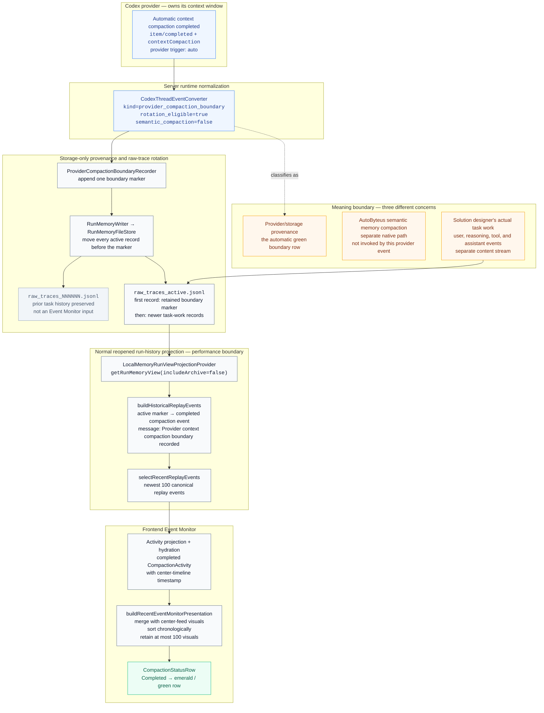
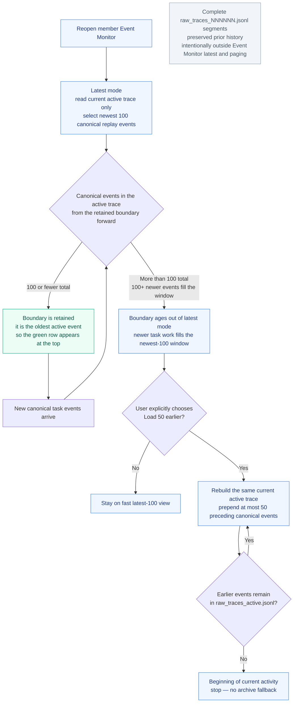

# Architecture Diagrams — Reopened Event Monitor Provider Boundary

## Visualization Context

- **Status:** Current
- **Requested view/question:** Why reopened Software Engineering Team member Event Monitors often show **Provider context compaction boundary recorded** at the top.
- **Design round or status:** Architecture review round 8 — `Pass` and latest authoritative design round; current implementation evidence inspected in the ticket worktree at `1f148ba5a0374aedaa3b83fbdec89e35623fc467` on 2026-07-21.
- **Requirements:** `/Users/normy/autobyteus_org/autobyteus-worktrees/agent-run-history-performance/tickets/in-progress/agent-run-history-performance/requirements-doc.md`
- **Investigation notes:** `/Users/normy/autobyteus_org/autobyteus-worktrees/agent-run-history-performance/tickets/in-progress/agent-run-history-performance/investigation-notes.md`
- **Design spec:** `/Users/normy/autobyteus_org/autobyteus-worktrees/agent-run-history-performance/tickets/in-progress/agent-run-history-performance/design-spec.md`
- **Relevant supplemental artifacts:** `/Users/normy/autobyteus_org/autobyteus-worktrees/agent-run-history-performance/tickets/in-progress/agent-run-history-performance/history-window-ui-ux-spec.md`; `/Users/normy/autobyteus_org/autobyteus-worktrees/agent-run-history-performance/tickets/in-progress/agent-run-history-performance/integrated-live-validation-plan.md`
- **Review evidence:** `/Users/normy/autobyteus_org/autobyteus-worktrees/agent-run-history-performance/tickets/in-progress/agent-run-history-performance/design-review-report.md`
- **Authority:** Derived visualization. The textual solution package governs if this artifact diverges from it.

### Primary Implementation Evidence

- Codex normalization and provider provenance: `/Users/normy/autobyteus_org/autobyteus-worktrees/agent-run-history-performance/autobyteus-server-ts/src/agent-execution/backends/codex/events/codex-thread-event-converter.ts`
- Marker recording and rotation: `/Users/normy/autobyteus_org/autobyteus-worktrees/agent-run-history-performance/autobyteus-server-ts/src/agent-memory/services/provider-compaction-boundary-recorder.ts`; `/Users/normy/autobyteus_org/autobyteus-worktrees/agent-run-history-performance/autobyteus-server-ts/src/agent-memory/store/run-memory-writer.ts`; `/Users/normy/autobyteus_org/autobyteus-worktrees/agent-run-history-performance/autobyteus-ts/src/memory/store/run-memory-file-store.ts`
- Active-only recent projection: `/Users/normy/autobyteus_org/autobyteus-worktrees/agent-run-history-performance/autobyteus-server-ts/src/run-history/projection/providers/local-memory-run-view-projection-provider.ts`; `/Users/normy/autobyteus_org/autobyteus-worktrees/agent-run-history-performance/autobyteus-server-ts/src/run-history/projection/recent-run-projection-policy.ts`
- Replay and completed compaction activity conversion: `/Users/normy/autobyteus_org/autobyteus-worktrees/agent-run-history-performance/autobyteus-server-ts/src/run-history/projection/transformers/raw-trace-to-historical-replay-events.ts`
- Frontend hydration, merge, limit, and row rendering: `/Users/normy/autobyteus_org/autobyteus-worktrees/agent-run-history-performance/autobyteus-web/services/runHydration/runProjectionActivityHydration.ts`; `/Users/normy/autobyteus_org/autobyteus-worktrees/agent-run-history-performance/autobyteus-web/services/eventMonitor/recentEventMonitorWindow.ts`; `/Users/normy/autobyteus_org/autobyteus-worktrees/agent-run-history-performance/autobyteus-web/components/workspace/agent/AgentConversationFeed.vue`; `/Users/normy/autobyteus_org/autobyteus-worktrees/agent-run-history-performance/autobyteus-web/components/workspace/agent/CompactionStatusRow.vue`
- Storage/provenance meaning: `/Users/normy/autobyteus_org/autobyteus-worktrees/agent-run-history-performance/autobyteus-web/docs/memory.md`

## Diagram Inventory

| Diagram | Type | Question answered | Source behavior / spine IDs |
|---|---|---|---|
| `provider-boundary-reopen-flow` | Component / data flow | How does an automatic Codex provider boundary become the first green row after reopen? | `BEH-001`, `BEH-009`, `DS-001`, `DS-002`, `DS-004` |
| `boundary-retention-decision` | Focused state / decision | When does the row remain at the top, age out, or become reachable only through active-trace paging? | `REQ-002`, `REQ-010`–`REQ-012`, `BEH-006`, `BEH-007`, `DS-006`, `DS-007` |

## `provider-boundary-reopen-flow` — Automatic Provider Boundary to Green Event Monitor Row

**Purpose:** Trace the production path that makes the provider boundary the oldest retained active event and therefore often the first row shown when a team member is reopened.

**Source anchors:** `BEH-001`, `BEH-009`, `DS-001`, `DS-002`, `DS-004`; design spec sections **Current-State Read**, **Primary Execution Spines**, and **Run-History Relationship**; implementation evidence listed above.

### Reading Notes

- Codex owns and automatically emits the completed context-compaction event. AutoByteus records it as **provider/storage provenance**; `semantic_compaction=false` means this path does not perform AutoByteus semantic-memory compaction.
- The recorder appends the marker before rotating. Rotation archives every earlier active record and rewrites the active file from the marker forward, so the boundary becomes the first active record while all earlier task history remains preserved in complete segment files.
- The solution designer's actual work is represented by the ordinary user/reasoning/tool/assistant records that follow the marker. The boundary row is not a task step authored by the solution designer and does not mean that prior work was deleted.
- Reopen deliberately reads only `raw_traces_active.jsonl`, reconstructs canonical replay events, and selects the newest 100. Archive exclusion prevents archive-scale I/O, transport, hydration, and mounting; it is the performance boundary, not a retention policy.
- The retained marker becomes a completed compaction activity. Frontend hydration supplies it to the center-timeline merge; chronological sorting places the oldest retained item first, the visual selector enforces the 100-item cap, and `CompactionStatusRow` renders completed status with the emerald/green treatment.

## `boundary-retention-decision` — Why It Is at the Top, Then Ages Out

**Purpose:** Show the small set of states governing visibility of the retained boundary in latest mode and the hard source boundary for **Load 50 earlier**.

**Source anchors:** `REQ-002`, `REQ-010`–`REQ-012`, `BEH-006`, `BEH-007`, `DS-001`, `DS-006`, `DS-007`; `selectRecentReplayEvents`; active-trace page policy; UI/UX journeys `UXJ-001`, `UXJ-007`, and `UXJ-008`.

### Reading Notes

- Immediately after a provider-boundary rotation, the marker is the first active record. If the active trace projects to at most 100 canonical events, all are retained and chronological sorting puts the completed boundary row at the top.
- Once 100 newer canonical events occupy the newest-100 window, the boundary is no longer in normal latest mode. It has aged out of that view; it has not been deleted from the active trace unless a later supported rewrite changes the active generation.
- **Load 50 earlier** may page backward to the marker while it remains in the current active trace. At that active trace's beginning, paging stops even when complete archive files exist. The archive files preserve prior history for storage/inspection purposes but are intentionally unreachable from the Event Monitor for performance.

## Source Ambiguities or Limitations

- None material for the requested explanation. The diagrams intentionally omit provider-event de-duplication internals, tool lifecycle reconstruction, browse cursor encoding, live mutation revision handling, and native semantic-compaction mechanics because they do not change why this completed provider boundary appears at the top after reopen.
- The exact row position is governed by canonical replay-event and final visual selection, not raw JSONL byte/line count. One canonical event may emit more than one visual elsewhere in the feed, so the backend newest-100 replay bound and frontend 100-visual bound are shown as separate gates.
