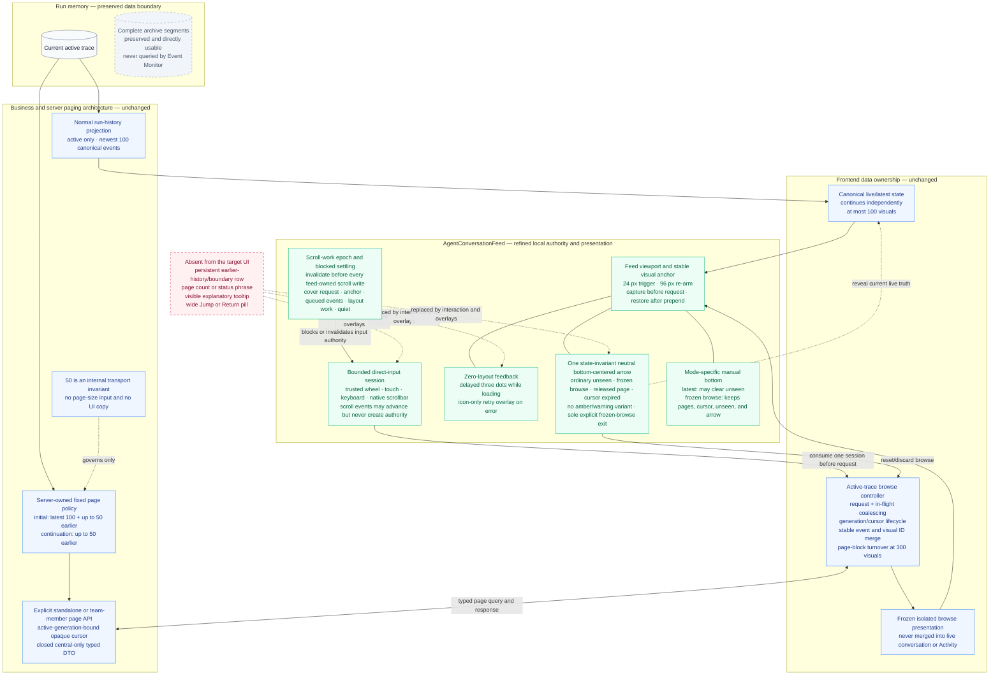
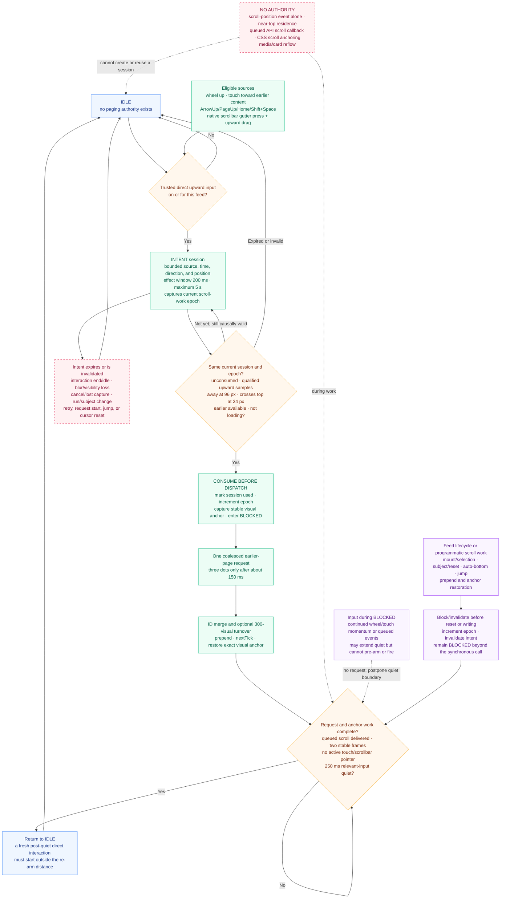
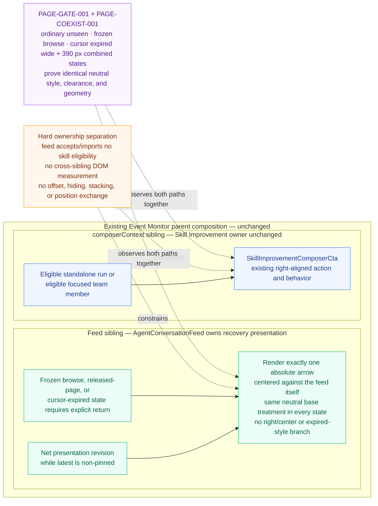

# Architecture Diagrams — Clean Event Monitor History Browsing

## Visualization Context

- **Status:** Current derived view of the architecture round-12 textual package; architecture re-review and focused implementation rework remain pending.
- **Requested view/question:** How does the design preserve the accepted bounded/direct-input and cross-feature ownership architecture while using one state-invariant neutral bottom-centered return arrow for ordinary unseen, frozen browse, released-page, and cursor-expired recovery?
- **Design round or status:** `Refined for architecture round 12` (2026-07-21). Architecture round 11 accepted centered placement and independent Skill Improvement ownership but returned `AR-011` because stale guidance allowed an expired-only amber variant. The round-12 package removes that branch and requires one exact neutral treatment across every arrow state. The primary round-12 architecture review has been requested; no round-12 decision is recorded yet. API/E2E remains stopped before browser/live/page execution, and delivery remains on hold.
- **Requirements:** `/Users/normy/autobyteus_org/autobyteus-worktrees/agent-run-history-performance/tickets/in-progress/agent-run-history-performance/requirements-doc.md`
- **Investigation notes:** `/Users/normy/autobyteus_org/autobyteus-worktrees/agent-run-history-performance/tickets/in-progress/agent-run-history-performance/investigation-notes.md`
- **Design spec:** `/Users/normy/autobyteus_org/autobyteus-worktrees/agent-run-history-performance/tickets/in-progress/agent-run-history-performance/design-spec.md`
- **Relevant supplemental artifacts:** `/Users/normy/autobyteus_org/autobyteus-worktrees/agent-run-history-performance/tickets/in-progress/agent-run-history-performance/history-window-ui-ux-spec.md`; `/Users/normy/autobyteus_org/autobyteus-worktrees/agent-run-history-performance/tickets/in-progress/agent-run-history-performance/integrated-live-validation-plan.md`
- **Review and delivery-state evidence:** `/Users/normy/autobyteus_org/autobyteus-worktrees/agent-run-history-performance/tickets/in-progress/agent-run-history-performance/design-review-report.md`; `/Users/normy/autobyteus_org/autobyteus-worktrees/agent-run-history-performance/tickets/in-progress/agent-run-history-performance/implementation-handoff.md`; `/Users/normy/autobyteus_org/autobyteus-worktrees/agent-run-history-performance/tickets/in-progress/agent-run-history-performance/code-review-report.md`; `/Users/normy/autobyteus_org/autobyteus-worktrees/agent-run-history-performance/tickets/in-progress/agent-run-history-performance/api-e2e-coverage-investigation.md`; `/Users/normy/autobyteus_org/autobyteus-worktrees/agent-run-history-performance/tickets/in-progress/agent-run-history-performance/api-e2e-execution-coverage-report.md`; `/Users/normy/autobyteus_org/autobyteus-worktrees/agent-run-history-performance/tickets/in-progress/agent-run-history-performance/api-e2e-test-review-report.md`; `/Users/normy/autobyteus_org/autobyteus-worktrees/agent-run-history-performance/tickets/in-progress/agent-run-history-performance/docs-sync-report.md`; `/Users/normy/autobyteus_org/autobyteus-worktrees/agent-run-history-performance/tickets/in-progress/agent-run-history-performance/delivery-live-validation-observation.md`; `/Users/normy/autobyteus_org/autobyteus-worktrees/agent-run-history-performance/tickets/in-progress/agent-run-history-performance/release-deployment-report.md`; `/Users/normy/autobyteus_org/autobyteus-worktrees/agent-run-history-performance/tickets/in-progress/agent-run-history-performance/handoff-summary.md`
- **Visual evidence of the rejected treatment:** `/Users/normy/.autobyteus/server-data/memory/agent_teams/software_engineering_team_8052345d87004850b782e66b7b129d55/solution_designer_cf42deda46f44bbbb6446758239df763/context_files/ctx_fc4e8615a19a__image.png`; `/Users/normy/.autobyteus/server-data/memory/agent_teams/software_engineering_team_8052345d87004850b782e66b7b129d55/solution_designer_cf42deda46f44bbbb6446758239df763/context_files/ctx_945120610f86__image.png`; `/Users/normy/.autobyteus/server-data/memory/agent_teams/software_engineering_team_8052345d87004850b782e66b7b129d55/solution_designer_cf42deda46f44bbbb6446758239df763/context_files/ctx_7268fea0d526__image.png`
- **Round-10 implementation and centered-coexistence evidence:** `/Users/normy/autobyteus_org/autobyteus-worktrees/agent-run-history-performance/tickets/in-progress/agent-run-history-performance/evidence/implementation-zero-layout-event-monitor-20260721.json`; `/Users/normy/autobyteus_org/autobyteus-worktrees/agent-run-history-performance/tickets/in-progress/agent-run-history-performance/evidence/implementation-zero-layout-loading-20260721.png`; `/Users/normy/autobyteus_org/autobyteus-worktrees/agent-run-history-performance/tickets/in-progress/agent-run-history-performance/evidence/implementation-zero-layout-browse-20260721.png`; `/Users/normy/autobyteus_org/autobyteus-worktrees/agent-run-history-performance/tickets/in-progress/agent-run-history-performance/evidence/api-e2e-round5-zero-layout/PRE-SUPERSESSION-NOTICE.md`; `/Users/normy/.autobyteus/server-data/memory/agent_teams/software_engineering_team_8052345d87004850b782e66b7b129d55/implementation_engineer_167e2a5435a14f58a1d1f41b36078436/context_files/ctx_06983d851e91__image.png`; `/Users/normy/.autobyteus/server-data/memory/agent_teams/software_engineering_team_8052345d87004850b782e66b7b129d55/implementation_engineer_167e2a5435a14f58a1d1f41b36078436/context_files/ctx_1f29624b2f2b__image.png`
- **Authority:** Derived visualization. The textual solution package governs if this artifact diverges from it.

## Diagram Inventory

| Diagram | Type | Question answered | Source behavior / spine IDs |
|---|---|---|---|
| `stable-bounds-and-feed-ownership` | Component / data flow | Which active-only, page, cursor, DTO, live, and browse boundaries remain unchanged, and what does the feed own in the clean refinement? | `BEH-001`–`BEH-003`, `BEH-006`–`BEH-010`; `DS-001`, `DS-004`, `DS-006`, `DS-007` |
| `direct-input-paging-lifecycle` | Focused state / decision | What creates one-page authority, when is it consumed, and why can mount, programmatic work, queued events, momentum, or layout anchoring never chain requests? | `REQ-005`, `REQ-010`–`REQ-012`; `AC-011`–`AC-015`; `BEH-003`, `BEH-006`; `DS-004`, `DS-006`, `DS-007` |
| `independent-arrow-and-skill-cta` | Focused component boundary | How does one neutral centered arrow cover every recovery state while coexisting with the lower-right Skill Improvement action without state, dependency, measurement, or positioning coupling? | `BEH-003`, `BEH-007`, `BEH-010`; `DS-004`, `DS-007`; `MP-CR-007`, `AR-011`; `PAGE-COEXIST-001` |

## `stable-bounds-and-feed-ownership` — Preserved Paging Architecture, Refined Feed Authority

**Purpose:** Show that storage, projection, page transport, cursor, DTO, and browse-state ownership stay intact while only the feed-local input and presentation boundary changes.

**Source anchors:** Design spec **Active-Trace Earlier-Paging Design**, **Frontend Browse State And Rendering**, **Zero-Layout Feed Control Design**, **Ownership Map**, and **Data Flow And Derived Data**; UI/UX spec **Visual Cleanliness Contract**, **Interaction States**, and **Accessibility And Keyboard Behavior**.

### Reading Notes

- The accepted source and transport boundaries do not change. Normal history reads only the active trace and selects the newest 100 canonical events. Earlier pages remain fixed internally at 50, generation-bound, active-only, and closed to result/log/Activity/generic payload data. Archives have no Event Monitor edge or fallback.
- The browse controller remains the network and data-lifecycle owner. It coalesces requests, validates cursor generation and structural IDs, performs ID-only merge, freezes browse separately from live state, releases farthest-newer page blocks at 300 resident visuals, and resets on explicit return.
- The feed remains the scroll owner: only a bounded trusted direct-input session can qualify a top crossing. Feed-owned scroll work invalidates that authority before changing position and keeps it blocked through asynchronous settling.
- Loading and error occupy one absolute top overlay slot; every return/recovery state shares the exact same neutral bottom-centered arrow treatment. There is no expired-only amber branch, persistent earlier/beginning/expiry row, count, status phrase, explanatory tooltip, reserved band, or wide text pill.
- Latest and frozen browse have different bottom semantics. Manual bottom in latest mode may clear unseen because current live truth is rendered. Manual bottom inside a frozen snapshot cannot discard it; the arrow is the sole explicit browse exit.

## `direct-input-paging-lifecycle` — Bounded Authority, Consume Before Request, Settle Before Re-arm

**Purpose:** Visualize the small feed-local lifecycle that admits one deliberate earlier-page request and denies authority to browser/programmatic position changes.

**Source anchors:** Design spec **Zero-Layout Feed Control Design**, `AR-009` / `MP-AR-009` resolution, `DS-006`, and the `AgentConversationFeed` bounded local spine; UI/UX journey `UXJ-007`; validation scenarios `PAGE-001` and `PAGE-GATE-001`.

### Reading Notes

- A scroll event is geometry evidence, not user authority. Authority begins only with one trusted wheel, touch, supported keyboard, or native-scrollbar interaction observed for this feed; its later scroll samples must stay inside the session's causal/lifetime bounds and match the captured scroll-work epoch.
- The feed consumes the session and changes the epoch before it captures the anchor or emits the request. Consequently, duplicate scroll delivery cannot spend the same interaction twice; controller in-flight coalescing remains a second defense rather than the proof of origin.
- `BLOCKED` outlives the JavaScript scroll write. It spans the request, prepend, anchor restoration, queued scroll callbacks, two stable animation frames, active touch/scrollbar lifetime, and post-work input quiet. Continued momentum can delay quiet but cannot pre-authorize another page.
- A continuation page requires an entirely fresh post-quiet direct interaction that starts outside the 96 px re-arm distance and intentionally crosses the 24 px top trigger. Mount, selection, top residence, programmatic scrolling, CSS anchoring, and dynamic layout changes remain inert even if they change `scrollTop`.
- The lifecycle governs request authority only. The browse controller still owns request/result state and the feed's separate zero-layout presentation maps loading to delayed dots, recoverable error to the retry icon, and frozen-browse/expiry recovery to the single arrow.

## `independent-arrow-and-skill-cta` — Centered Feed Recovery Beside an Unchanged Composer Action

**Purpose:** Show the bounded `CR-007` / `MP-CR-007` ownership correction and `AR-011` treatment unification as two independent presentation paths under the existing parent composition, without turning styling into a subsystem.

**Source anchors:** `BEH-007`, `BEH-010`; design spec **Zero-Layout Feed Control Design**, **Ownership Map**, and `AR-011` resolution; UI/UX spec **Visual Cleanliness Rules** and **Responsive And Platform Behavior**; validation scenarios `PAGE-GATE-001` and `PAGE-COEXIST-001`.

### Reading Notes

- The two controls do not share a state path. Presentation revision or browse/released-page/expiry lifecycle makes `AgentConversationFeed` render one centered return arrow; run/member eligibility independently makes `SkillImprovementComposerCta` render its existing right-aligned composer action.
- `AR-011` changes presentation, not recovery behavior: ordinary unseen, frozen browse, released-page, and cursor-expired states use the same quiet-white surface, neutral border/shadow, dark glyph, focus treatment, accessible name, geometry, and component path. The expired-only amber/warning branch is removed.
- Centering is relative to the feed box, not the application window and not the free space left by the CTA. The CTA remains a sibling below the feed in `composerContext`; neither component calculates the other's coordinates.
- No eligibility prop, import, DOM measurement, or responsive right/center branch enters the feed. The arrow therefore has identical placement whether Skill Improvement is absent, resolving, disabled, or visible, while the CTA's eligibility, action, and right alignment remain unchanged.
- `PAGE-GATE-001` and `PAGE-COEXIST-001` are evidence, not runtime coordinators: they compare normalized arrow style across ordinary unseen, frozen browse, and cursor-expired states, and prove wide/narrow CTA coexistence, non-overlap, no horizontal overflow, zero feed-layout impact, and stable arrow geometry/style with and without the CTA.

## Source Ambiguities or Limitations

- No material ambiguity remains in the round-12 textual package for the preserved source bounds, direct-input lifecycle, independent sibling ownership, centered-arrow rule, or state-invariant neutral treatment.
- Architecture round 11 is the latest recorded review and returned `Fail` only for bounded `AR-011`; it otherwise accepted centered placement and ownership separation. The round-12 package removes the stale expired-only warning variant and is awaiting its already-requested review. This diagram does not treat that correction as a passed gate.
- Source commit `aa9705a28` remains baseline evidence for the round-10 direct-input and zero-layout behavior but renders the arrow at lower-right and retains the expired-only amber class branch. API/E2E round 5 stopped before browser/live/page execution and changed no durable tests. Neither the source nor preserved partial evidence proves the round-12 centered, state-invariant neutral treatment is implemented or accepted.
