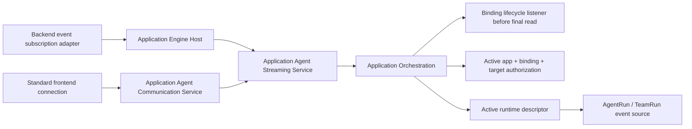
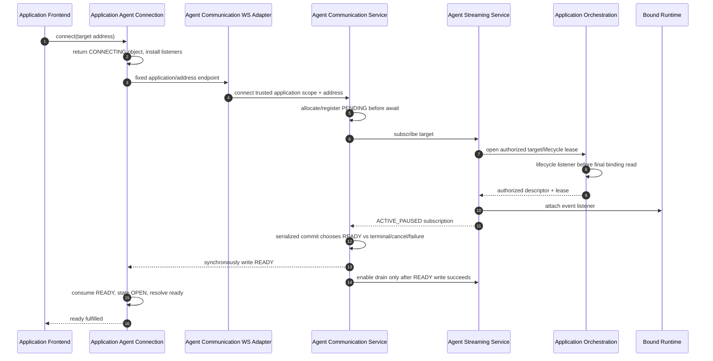

# Application Agent Communication Contract

## Status And Authority

This is a normative intended-behavior supplement to [`requirements.md`](./requirements.md) and [`design-spec.md`](./design-spec.md). It supersedes the earlier backend-proxy-only streaming contract.

Status: `Approved intended-behavior basis; desktop-only scope clarified with no application-client authentication surface.`

The framework subject is **application-bound agent communication**. `assistant` is only a possible application role. Framework names use `agent`, `agent team`, `binding`, `target address`, `event`, and `connection`.

## 1. Binding And Address Contract

`startAgent(...)` and `startAgentTeam(...)` return two precise binding types:

```ts
export type ApplicationAgentBindingStatus =
  | "ATTACHED"
  | "TERMINATING"
  | "TERMINATED"
  | "FAILED"
  | "ORPHANED";

type ApplicationAgentBindingFields = {
  bindingId: string;
  applicationId: string;
  launchRequestId: string;
  status: ApplicationAgentBindingStatus;
  executionResourceRef: ApplicationExecutionResourceRef;
  createdAt: string;
  updatedAt: string;
  terminatedAt: string | null;
  lastErrorMessage: string | null;
};

export type ApplicationAgentBinding = ApplicationAgentBindingFields & {
  runtime: {
    subject: "AGENT_RUN";
    runId: string;
    definitionId: string;
    members: [];
  };
};

export type ApplicationAgentTeamBindingMember = {
  memberName: string;
  memberRouteKey: string;
  displayName: string;
  teamPath: string[];
  runId: string;
  runtimeKind: "AGENT" | "AGENT_TEAM_MEMBER";
};

export type ApplicationAgentTeamBinding = ApplicationAgentBindingFields & {
  runtime: {
    subject: "TEAM_RUN";
    runId: string;
    definitionId: string;
    members: ApplicationAgentTeamBindingMember[];
  };
};

```

`ApplicationAgentBindingFields` is a private, non-exported source-composition detail. Public package exports expose only `ApplicationAgentBinding` and `ApplicationAgentTeamBinding`; generated declarations must not export a base/generic binding name. There is no third `ApplicationAgentExecutionBinding` type. Return contracts are explicit:

| Operation | Return |
| --- | --- |
| `startAgent(...)` | `Promise<ApplicationAgentBinding>` |
| `startAgentTeam(...)` | `Promise<ApplicationAgentTeamBinding>` |
| `terminate(...)`, `get(...)`, `findByLaunchRequestId(...)` | `Promise<ApplicationAgentBinding | ApplicationAgentTeamBinding | null>` |
| `list(...)` | `Promise<Array<ApplicationAgentBinding | ApplicationAgentTeamBinding>>` |
| `sendInput(...)` | `Promise<ApplicationAgentBinding | ApplicationAgentTeamBinding>` |

The runtime IDs remain server/backend diagnostic data on the binding projection; the frontend standard connection never accepts them as an address.

```ts
export type ApplicationAgentTarget =
  | { kind: "AGENT_RUN" }
  | { kind: "AGENT_TEAM_RUN" }
  | { kind: "AGENT_TEAM_MEMBER"; memberRouteKey: string };

export type ApplicationAgentTargetAddress = {
  bindingId: string;
  target: ApplicationAgentTarget;
};
```

Address invariants:

1. `bindingId` is non-empty and generated by Application Orchestration.
2. Exactly one discriminated target exists.
3. `memberRouteKey` is a trimmed stable bound-member key and exists only for `AGENT_TEAM_MEMBER`.
4. `applicationId` is not accepted in the address; client/gateway/worker scope supplies it.
5. Raw agent/team/member run IDs are not accepted.
6. The address identifies a target but never authorizes it. Every consumer passes the authorization path in section 8.
7. The address is reusable by frontend connect, backend input, and backend event observation.

## 2. Target Semantics

| Target | Required Binding | Event Source | Input Target |
| --- | --- | --- | --- |
| `AGENT_RUN` | `ApplicationAgentBinding` | Future events from the bound root agent | Bound root agent |
| `AGENT_TEAM_RUN` | `ApplicationAgentTeamBinding` | Future team-root events plus attributed member/task-agent events | Existing team-root/default input behavior |
| `AGENT_TEAM_MEMBER` | `ApplicationAgentTeamBinding` with exact static `memberRouteKey` | Future agent events whose normalized producer matches that member | Exact bound static member |

Invalid combinations are safe failures before activation. Direct dynamic task-agent addressing is not accepted. Whole-team event attribution may still identify a dynamic task agent through `producer`.

## 3. Standard Frontend API

```ts
export type ApplicationAgentConnectionState =
  | "connecting"
  | "open"
  | "closing"
  | "closed";

export type ApplicationAgentInput = {
  text: string;
  contextFiles?: ApplicationRuntimeInputContextFile[] | null;
  metadata?: Record<string, unknown> | null;
};

export type ApplicationAgentConnectionOptions = {
  signal?: AbortSignal;
};

export type ApplicationAgentConnection = {
  readonly address: ApplicationAgentTargetAddress;
  readonly state: ApplicationAgentConnectionState;
  readonly ready: Promise<void>;
  sendInput(input: ApplicationAgentInput): Promise<void>;
  onEvent(listener: (event: ApplicationAgentEvent) => void): () => void;
  onError(listener: (error: ApplicationAgentConnectionError) => void): () => void;
  onClose(listener: (close: ApplicationAgentConnectionClose) => void): () => void;
  close(): void;
};

applicationClient.agentCommunication.connect(
  address: ApplicationAgentTargetAddress,
  options?: ApplicationAgentConnectionOptions,
): ApplicationAgentConnection;
```

Rules:

1. `connect(...)` returns immediately and installs transport lifecycle handlers before remote work.
2. The SDK owns the browser WebSocket, standard URL, protocol parsing, request correlation, and state machine.
3. `ready` resolves only after the server sends and the SDK consumes `READY`.
4. `sendInput(...)` before `open` rejects locally. Once open it resolves only after matching `INPUT_ACCEPTED`.
5. Listener registration is synchronous and returns an idempotent removal function.
6. `close()` and `AbortSignal` are idempotent.
7. There is no application route callback, raw socket return, assistant/chat API, or frontend runtime-ID API.

## 4. Fixed Endpoint And Wire Contract

Bootstrap supplies:

```ts
type ApplicationHostTransport = {
  backendBaseUrl: string | null;
  backendNotificationsUrl: string | null;
  backendWebSocketBaseUrl: string | null; // optional custom backend routes
  agentCommunicationWebSocketBaseUrl: string | null; // standard agent connection
};
```

For base `/ws/applications/:applicationId/agent-communication`, one shared address codec appends:

```text
/:bindingId/targets/agent-run
/:bindingId/targets/agent-team-run
/:bindingId/targets/agent-team-member/:memberRouteKey
```

All dynamic path segments use `encodeURIComponent` semantics. The desktop host supplies the fixed base, the SDK is the only target-path composer, and the thin server adapter is the only decoder. The bootstrap, `ApplicationClient`, connection options, and connection object contain no application authentication token or credential API. Paired mobile/phone access is outside this contract.

The version-one wire protocol is JSON text:

```ts
type ApplicationAgentClientFrame = {
  protocol: "autobyteus.application-agent-communication.v1";
  type: "INPUT";
  requestId: string;
  input: ApplicationAgentInput;
};

type ApplicationAgentServerFrame =
  | {
      protocol: "autobyteus.application-agent-communication.v1";
      type: "READY";
      address: ApplicationAgentTargetAddress;
    }
  | {
      protocol: "autobyteus.application-agent-communication.v1";
      type: "INPUT_ACCEPTED";
      requestId: string;
    }
  | {
      protocol: "autobyteus.application-agent-communication.v1";
      type: "INPUT_REJECTED";
      requestId: string;
      error: ApplicationAgentConnectionErrorPayload;
    }
  | {
      protocol: "autobyteus.application-agent-communication.v1";
      type: "EVENT";
      event: ApplicationAgentEvent;
    }
  | {
      protocol: "autobyteus.application-agent-communication.v1";
      type: "ERROR";
      error: ApplicationAgentConnectionErrorPayload;
    }
  | {
      protocol: "autobyteus.application-agent-communication.v1";
      type: "CLOSED";
      close: ApplicationAgentConnectionClose;
    };
```

`READY` is the first application-agent protocol frame. The server gates event draining until it is written. Unknown protocol/type, binary input, duplicate request ID, malformed input, oversized frame, or input after closing is rejected according to section 10.

## 5. Shared Public Application-Agent Event Contract

The public contract is a closed discriminated union. `data` is **not** a `Record<string, unknown>` and no public payload type has an index signature.

```ts
export type ApplicationAgentEvent = {
  sequence: number;
  observedAt: string;
  applicationId: string;
  address: ApplicationAgentTargetAddress;
  runtimeSubject: "AGENT_RUN" | "TEAM_RUN";
  producer: ApplicationExecutionProducer | null;
  event: ApplicationAgentRunPublicEvent | ApplicationAgentTeamPublicEvent;
};

export type ApplicationAgentRunPublicEvent = {
  [T in keyof ApplicationAgentRunPublicDataByType]: {
    source: "AGENT";
    type: T;
    data: ApplicationAgentRunPublicDataByType[T];
  }
}[keyof ApplicationAgentRunPublicDataByType];

export type ApplicationAgentTeamPublicEvent = {
  [T in keyof ApplicationAgentTeamPublicDataByType]: {
    source: "AGENT_TEAM";
    type: T;
    data: ApplicationAgentTeamPublicDataByType[T];
  }
}[keyof ApplicationAgentTeamPublicDataByType];
```

Shared closed shapes:

```ts
export type ApplicationAgentEventSafeErrorCode =
  | "RUNTIME_ERROR"
  | "TOOL_EXECUTION_ERROR"
  | "COMPACTION_ERROR"
  | "SEGMENT_ERROR"
  | "UNKNOWN_ERROR";

export type ApplicationAgentEventSafeError = {
  code: ApplicationAgentEventSafeErrorCode;
  message: string;
};

export type ApplicationAgentEventSegmentKind =
  | "TEXT"
  | "REASONING"
  | "TOOL_CALL"
  | "COMMAND"
  | "FILE_EDIT"
  | "MEDIA"
  | "OTHER";

export type ApplicationAgentEventStatus =
  | "OFFLINE"
  | "INITIALIZING"
  | "IDLE"
  | "RUNNING"
  | "ERROR";

export type ApplicationAgentEventTodoItem = {
  id: string;
  description: string;
  status: "PENDING" | "IN_PROGRESS" | "COMPLETED" | "UNKNOWN";
};

export type ApplicationAgentEventParticipant =
  | { kind: "TEAM"; memberRouteKey: string | null }
  | { kind: "MEMBER"; memberRouteKey: string };

export type ApplicationAgentEventToolRef = {
  invocationId: string | null;
  toolName: string | null;
  turnId: string | null;
};
```

Exact agent-event data map:

```ts
export type ApplicationAgentRunPublicDataByType = {
  TURN_STARTED: { turnId: string | null };
  TURN_COMPLETED: { turnId: string | null };
  TURN_INTERRUPTED: { turnId: string | null; reason: string | null };

  SEGMENT_START: {
    segmentId: string;
    turnId: string | null;
    kind: ApplicationAgentEventSegmentKind;
    toolName: string | null;
  };
  SEGMENT_CONTENT: {
    segmentId: string;
    turnId: string | null;
    kind: ApplicationAgentEventSegmentKind;
    delta: string;
  };
  SEGMENT_END: {
    segmentId: string;
    turnId: string | null;
    kind: ApplicationAgentEventSegmentKind;
    interrupted: boolean;
    failed: boolean;
    reason: string | null;
    error: ApplicationAgentEventSafeError | null;
  };

  AGENT_STATUS: {
    status: ApplicationAgentEventStatus;
    canInterrupt: boolean;
    trigger: string | null;
    toolName: string | null;
    error: ApplicationAgentEventSafeError | null;
  };
  COMPACTION_STATUS: {
    phase: "REQUESTED" | "STARTED" | "COMPLETED" | "FAILED" | "UNKNOWN";
    turnId: string | null;
    trigger: string | null;
    selectedBlockCount: number | null;
    compactedBlockCount: number | null;
    error: ApplicationAgentEventSafeError | null;
  };
  TOKEN_USAGE_UPDATED: {
    usageEventId: string | null;
    observedAt: string | null;
    turnId: string | null;
    inputTokens: number | null;
    cachedInputTokens: number | null;
    outputTokens: number | null;
    reasoningOutputTokens: number | null;
    totalTokens: number | null;
    contextWindowUsagePercent: number | null;
  };
  AGENT_RESPONSE_COMPLETED: { content: string | null; reasoning: string | null };

  TOOL_APPROVAL_REQUESTED: ApplicationAgentEventToolRef & { argumentSummary: string | null };
  TOOL_APPROVED: ApplicationAgentEventToolRef & { reason: string | null };
  TOOL_DENIED: ApplicationAgentEventToolRef & {
    argumentSummary: string | null;
    reason: string | null;
    error: ApplicationAgentEventSafeError | null;
  };
  TOOL_EXECUTION_STARTED: ApplicationAgentEventToolRef & { argumentSummary: string | null };
  TOOL_EXECUTION_SUCCEEDED: ApplicationAgentEventToolRef & { resultSummary: string | null };
  TOOL_EXECUTION_FAILED: ApplicationAgentEventToolRef & { error: ApplicationAgentEventSafeError };
  TOOL_EXECUTION_INTERRUPTED: ApplicationAgentEventToolRef & { reason: string };
  TOOL_LOG: ApplicationAgentEventToolRef & { entry: string };

  TODO_LIST_UPDATE: { items: ApplicationAgentEventTodoItem[] };
  INTER_AGENT_MESSAGE: {
    messageId: string | null;
    senderMemberRouteKey: string | null;
    receiverMemberRouteKey: string | null;
    content: string;
    messageType: string | null;
    createdAt: string | null;
  };
  TEAM_COMMUNICATION_MESSAGE: {
    messageId: string;
    sender: ApplicationAgentEventParticipant;
    receiver: ApplicationAgentEventParticipant;
    content: string;
    messageType: string;
    createdAt: string;
  };
  SYSTEM_TASK_NOTIFICATION: { content: string };
  ERROR: { error: ApplicationAgentEventSafeError };
};
```

Exact team-event data map:

```ts
export type ApplicationAgentTeamPublicDataByType = {
  TEAM_STATUS: {
    status: ApplicationAgentEventStatus;
    error: ApplicationAgentEventSafeError | null;
  };
  TASK_DELEGATION_EVENT: {
    delegationEventType:
      | "ACTIVATED"
      | "STATUS_UPDATED"
      | "RESULT_SUBMITTED"
      | "RESULT_REVIEWED"
      | "TERMINAL_STATUS";
    taskId: string | null;
    taskIds: string[];
    taskLabel: string | null;
    description: string | null;
    status: string | null;
    previousStatus: string | null;
    target: ApplicationAgentEventParticipant | null;
    executionKind: "AGENT" | "TEAM" | null;
    terminal: boolean;
    message: string | null;
    occurredAt: string | null;
  };
  TEAM_COMMUNICATION_MESSAGE: {
    messageId: string;
    sender: ApplicationAgentEventParticipant;
    receiver: ApplicationAgentEventParticipant;
    content: string;
    messageType: string;
    createdAt: string;
  };
  MEMBER_INPUT_MESSAGE: {
    messageId: string;
    inputOrigin: "USER_MESSAGE" | "INTER_AGENT_DELIVERY";
    recipientMemberRouteKey: string;
    senderMemberRouteKey: string | null;
    content: string;
    receivedAt: string;
    parentCommunicationMessageId: string | null;
  };
};
```

Envelope invariants:

- `sequence` starts at `1` for each connection or backend subscription and increases by one only for an event successfully projected and accepted into that consumer queue.
- `observedAt` is assigned by the application streaming owner when the projected source event is accepted.
- `applicationId` comes from the trusted application connection/subscription scope, not application input.
- `address`, `runtimeSubject`, and `producer` must agree with the authorized binding.
- `producer` reuses the existing `ApplicationExecutionProducer` shape and is the only agent/member/task-agent attribution surface; source payload identities do not get spread into `data`.
- Every `source: "AGENT"` event has a non-null producer resolved from the authorized standalone binding member, static team member, or normalized task-agent instance carried by the team wrapper. For a selected-member subscription its `memberRouteKey` must equal the target.
- Every `source: "AGENT_TEAM"` event has `producer: null`; team/member participants or delegation targets are represented only by the closed participant fields in that event's `data`.
- The framework public projector constructs a new closed object for each event type, then runs the lower-level JSON-serializability check. Generic JSON serialization is defense in depth, not the public projection policy.

### 5.1 Public projection rules

| Source condition | Mapper outcome | Sequence / consumer outcome |
| --- | --- | --- |
| Allowed type with valid required fields | Copy only the documented fields; normalize enums/casing/names | Enqueue; consume the next sequence when accepted |
| Unknown extra key at any source nesting level | Ignore it; never spread the source object | No error; projected event may continue |
| Optional value is absent or malformed | Emit the documented `null`, `false`, empty-array, or `UNKNOWN` default | Projected event may continue |
| Required primary content/identity field is absent, wrong type, non-finite, or exceeds the owned frame/text limit | Return mapping failure | Emit isolated `EVENT_MAPPING_FAILED`, then `STREAM_FAILED`; no sequence consumed |
| Unknown internal event type | Deliberately drop and record a metric/debug log | No event, no error, no sequence consumed |
| `ARTIFACT_PERSISTED`, `FILE_CHANGE`, or another explicitly excluded family | Deliberately drop | No event, no error, no sequence consumed |
| Projected closed object still fails JSON serialization | Serialization failure | Emit isolated `EVENT_SERIALIZATION_FAILED`, then `STREAM_FAILED`; no sequence consumed |

Normalization rules are field-specific:

- `turnId`, `segmentId`, invocation/tool names, route keys, message IDs, and timestamps are trimmed strings or their declared `null` defaults; required IDs/content cannot default.
- source segment names map into the closed public segment-kind enum; unknown names become `OTHER`.
- public status/todo/delegation enums are normalized into the closed values shown above.
- `argumentSummary` and `resultSummary` may use only an already-normalized scalar string or a recognized `text`, `content`, `message`, or `summary` string member. The mapper never JSON-stringifies or recursively copies an arguments/result/provider object.
- safe errors contain only a family-derived closed public `code` and a bounded single-line `message`; provider error codes are not forwarded, newline/stack-shaped suffixes are removed, and absent messages use stable generic fallbacks. `stack`, `cause`, `details`, raw exception objects, and nested provider failures are never read into the public object.
- file/reference arrays, artifact/file descriptors, provider session/thread/item IDs, model-provider metadata, raw trace objects, runtime configuration, approval tokens, and physical run/member IDs from source data are not public data fields. Authorized producer attribution stays in the envelope.

Owned text/array/frame bounds are implementation constants in the streaming subsystem. Exceeding a required-field bound is a mapping failure rather than silent content truncation; optional summaries may normalize to `null`.

### 5.2 Per-event source projection matrix

The table is exhaustive. “Optional/defaulted” means the event is delivered with the exact nullable/defaulted fields declared above; it never means that the source record is forwarded.

| Public type | Source-to-public normalization | Required to deliver | Producer / metadata rule |
| --- | --- | --- | --- |
| `TURN_STARTED` | `turn_id \| turnId` → `turnId` | event type only | non-null authorized agent producer; no other metadata |
| `TURN_COMPLETED` | `turn_id \| turnId` → `turnId` | event type only | same agent producer rule |
| `TURN_INTERRUPTED` | turn alias + scalar `reason` | event type only; fields default null | same agent producer rule |
| `SEGMENT_START` | `id \| segment_id` → `segmentId`; turn alias; segment name → closed `kind`; recognized tool name | non-empty `segmentId` | same agent producer rule; source `metadata` is not copied |
| `SEGMENT_CONTENT` | segment/turn aliases; segment name → `kind`; scalar `delta` | non-empty `segmentId` and `delta` | same agent producer rule |
| `SEGMENT_END` | segment/turn/kind aliases; booleans; scalar reason; family-safe error | non-empty `segmentId` | same agent producer rule; no source metadata/result |
| `AGENT_STATUS` | canonical status → closed uppercase status; `can_interrupt`; scalar trigger/tool; safe error | recognized status | same agent producer rule; source agent/run IDs are ignored |
| `COMPACTION_STATUS` | phase/status → closed phase; turn/trigger; finite selected/compacted counts; safe error | event type only; unknown phase allowed | same agent producer rule; provider/session/boundary/raw metadata is ignored |
| `TOKEN_USAGE_UPDATED` | canonical finite token totals/context percentage + usage/turn/observation IDs | event type only; absent numbers null | same agent producer rule; provider/model/pricing/execution-address metadata is ignored |
| internal assistant/response completion | public `AGENT_RESPONSE_COMPLETED` with scalar `content` and `reasoning` only | normalized public event type; both fields may be null | same agent producer rule; usage/media/provider objects ignored |
| `TOOL_APPROVAL_REQUESTED` | invocation/tool/turn aliases + recognized scalar argument summary | event type only; reference fields may be null | same agent producer rule; arguments/approval token ignored |
| `TOOL_APPROVED` | invocation/tool/turn aliases + scalar reason | event type only | same agent producer rule |
| `TOOL_DENIED` | invocation/tool/turn aliases + scalar argument summary/reason + family-safe error | event type only | same agent producer rule; raw arguments/error object ignored |
| `TOOL_EXECUTION_STARTED` | invocation/tool/turn aliases + scalar argument summary | event type only | same agent producer rule; raw arguments ignored |
| `TOOL_EXECUTION_SUCCEEDED` | invocation/tool/turn aliases + recognized scalar result summary | event type only | same agent producer rule; raw result/provider object ignored |
| `TOOL_EXECUTION_FAILED` | invocation/tool/turn aliases + family-safe error | event type; safe error always produced | same agent producer rule; provider code/stack/details ignored |
| `TOOL_EXECUTION_INTERRUPTED` | invocation/tool/turn aliases + scalar reason | non-empty `reason` | same agent producer rule |
| `TOOL_LOG` | invocation alias + tool/turn aliases + scalar `log_entry \| entry` | non-empty `entry` | same agent producer rule; raw response item ignored |
| `TODO_LIST_UPDATE` | recognized todo array; each item maps id/description/closed status | event type; malformed optional items are dropped | same agent producer rule; unknown todo fields ignored |
| `INTER_AGENT_MESSAGE` | normalized message/sender/receiver route aliases, content/type/time | non-empty `content` | same receiving/emitting agent producer rule; addresses, run IDs, references ignored |
| agent `TEAM_COMMUNICATION_MESSAGE` | normalized message ID, public sender/receiver participant, content/type/time | all non-null declared fields and valid participants | non-null agent producer; reference files ignored |
| `SYSTEM_TASK_NOTIFICATION` | scalar `content` | non-empty `content` | same agent producer rule; sender/runtime metadata ignored |
| `ERROR` | event family → closed code; bounded first-line message | event type; stable fallback message allowed | same agent producer rule; provider code/exception internals ignored |
| `TEAM_STATUS` | canonical team status → closed status + safe error | recognized status | `producer: null`; source path/subteam aliases ignored |
| `TASK_DELEGATION_EVENT` | closed event-kind mapping; normalized task fields/participant/execution kind/terminal/time | recognized delegation event kind | `producer: null`; target is closed data, while execution/task arguments/references/run IDs are ignored |
| team `TEAM_COMMUNICATION_MESSAGE` | normalized message ID, public sender/receiver participant, content/type/time | all non-null declared fields and valid participants | `producer: null`; reference files/source aliases ignored |
| `MEMBER_INPUT_MESSAGE` | message/origin/recipient/sender/content/time/parent aliases → closed shape | message ID, known origin, recipient route, content, received time | `producer: null`; context/reference files, run IDs, task instance objects ignored |

## 6. Provider/Team Projection Examples And Exclusions

### 6.1 Equivalent provider text events

AutoByteus, Codex, and Claude source records may contain different provider-only members, but an equivalent text delta has one public shape:

```ts
// Source examples (not public)
{ id: "seg-1", turn_id: "turn-7", delta: "Hello", provider_response: { /* ... */ } }
{ item: { id: "seg-1", type: "agent_message" }, delta: "Hello", threadId: "codex-thread" }
{ id: "seg-1", delta: "Hello", session_id: "claude-session", raw: { /* ... */ } }

// Public event data for all three
{ segmentId: "seg-1", turnId: "turn-7", kind: "TEXT", delta: "Hello" }
```

`provider_response`, `item`, `threadId`, `session_id`, `raw`, and any unknown sibling/nested keys are absent.

### 6.2 Tool and error examples

```ts
// Codex/Claude source may include arguments, result objects, raw response and stack data.
{
  invocation_id: "tool-9",
  tool_name: "search_web",
  result: { text: "3 sources found", raw_response: { /* ... */ } },
  stack: "internal"
}

// Public TOOL_EXECUTION_SUCCEEDED data
{
  invocationId: "tool-9",
  toolName: "search_web",
  turnId: null,
  resultSummary: "3 sources found"
}
```

A provider error `{code: "provider_specific", message, stack, cause, details, response}` becomes a family-derived shape such as `{error: {code: "TOOL_EXECUTION_ERROR", message}}`; only the closed code and safe message cross the boundary.

### 6.3 Team and task attribution examples

A member agent event in an `AGENT_TEAM_RUN` subscription remains an agent event. Its static or task-agent identity is represented by the authorized envelope `producer`; provider/runtime identity fields are not duplicated into `data`.

A task-delegation source may contain `target`, `execution`, `taskArguments`, reference files, physical run IDs, and nested task/team instances. The public projector retains only the closed `TASK_DELEGATION_EVENT` fields above, for example:

```ts
{
  delegationEventType: "STATUS_UPDATED",
  taskId: "task-12",
  taskIds: ["task-12"],
  taskLabel: "Verify invoice",
  description: "Verify invoice",
  status: "awaiting_review",
  previousStatus: "active",
  target: { kind: "MEMBER", memberRouteKey: "reviewer" },
  executionKind: "AGENT",
  terminal: false,
  message: null,
  occurredAt: "2026-07-21T10:30:00.000Z"
}
```

No task arguments, reference/file payloads, physical run IDs, or nested execution objects cross.

### 6.4 Explicitly excluded event data

```text
ARTIFACT_PERSISTED and artifact/revision/file payloads
FILE_CHANGE and file content/diff/path payloads
raw provider events/responses/session/thread/item objects
provider-only metadata and unknown extra keys
unserialized exceptions, stack, cause, details, or response objects
runtime objects or mutable runtime configuration references
approval tokens and physical source identities duplicated inside data
```

Artifacts remain durable and application-readable through `artifactHandlers.persisted` and `context.publishedArtifacts`. File changes remain an internal/native concern.

### 6.5 Mandatory public-projection contract tests

- one table-driven fixture for every key of both public data maps asserts exact deep equality and exact key sets;
- equivalent AutoByteus, Codex, and Claude text/turn/tool fixtures produce the same public shapes;
- unknown fields at the root and in nested source objects never appear in the result;
- error fixtures prove provider-specific codes normalize to the closed family code and that `stack`, `cause`, `details`, provider response, and exception objects are absent;
- artifact/file/reference fixtures prove excluded events are dropped and sequence is unchanged;
- whole-team/member/task-agent fixtures prove envelope producer attribution is correct without duplicating run/member identity in `data`;
- task-delegation/member-input/communication fixtures prove task arguments, nested execution objects, and reference-file records are absent;
- malformed required-field fixtures produce only that consumer's `EVENT_MAPPING_FAILED`/`STREAM_FAILED`, while malformed optional fields use documented defaults;
- a source object with cycles, class instances, functions, symbols, bigint values, and unknown nested keys cannot escape through the closed projector;
- binding end at each pre-commit await point rejects with the exact `SUBSCRIPTION_NOT_AVAILABLE` code/message/recoverability, removes worker observer/request and host pending state, releases late acquisitions, and invokes no callback;
- when host `ACTIVE` wins, the correlated success/public promise continuation precedes a queued event or `BINDING_ENDED` callback;
- queue-acceptance tests prove only accepted envelopes consume sequence, terminal drain retains assigned values, and excluded/malformed/serialization/overflow cases do not advance the counter; and
- injected IPC failure after acceptance may leave that assigned value unseen but closes before any later sequence can be delivered.


## 7. Backend Event Subscription Adapter

The application backend may observe the same public events without becoming the frontend proxy:

```ts
export type ApplicationAgentEventStreamError = {
  code:
    | "EVENT_MAPPING_FAILED"
    | "EVENT_SERIALIZATION_FAILED"
    | "WORKER_TRANSPORT_FAILED"
    | "BACKPRESSURE_LIMIT";
  message: string;
  recoverable: boolean;
};

export type ApplicationAgentEventStreamClose = {
  reason:
    | "UNSUBSCRIBED"
    | "ABORTED"
    | "BINDING_ENDED"
    | "RUNTIME_UNAVAILABLE"
    | "STREAM_FAILED"
    | "WORKER_STOPPED";
};

export type ApplicationAgentEventStreamSubscribeErrorCode =
  | "SUBSCRIPTION_NOT_AVAILABLE"
  | "INVALID_STREAM_TARGET"
  | "RUNTIME_NOT_ACTIVE"
  | "SUBSCRIPTION_ABORTED"
  | "WORKER_TRANSPORT_FAILED";

export declare class ApplicationAgentEventStreamSubscribeError extends Error {
  readonly code: ApplicationAgentEventStreamSubscribeErrorCode;
  readonly recoverable: boolean;
}

export type ApplicationAgentEventStreamObserver = {
  onEvent: (event: ApplicationAgentEvent) => void | Promise<void>;
  onError?: (error: ApplicationAgentEventStreamError) => void | Promise<void>;
  onClosed?: (close: ApplicationAgentEventStreamClose) => void | Promise<void>;
};

export type ApplicationAgentEventStreamSubscription = {
  subscriptionId: string;
  unsubscribe: () => Promise<void>;
};

context.agentExecution.subscribeEventStream(
  address: ApplicationAgentTargetAddress,
  observer: ApplicationAgentEventStreamObserver,
  options?: { signal?: AbortSignal },
): Promise<ApplicationAgentEventStreamSubscription>;

context.agentExecution.sendInput({
  address: ApplicationAgentTargetAddress,
  input: ApplicationAgentInput,
}): Promise<ApplicationAgentBinding | ApplicationAgentTeamBinding>;
```

The worker assigns an internal `subscriptionId` and correlates host-to-worker frames, but that ID does not appear in `ApplicationAgentEvent`. Backend subscription establishment retains the atomic host `PENDING → ACTIVE` rules from the prior reviewed design: a failed establishment rejects the promise and invokes no observer callback; a successful response/public promise precedes observer delivery.

## 8. Authorization, Lifecycle Lease, And Source Resolution

Both the standard connection and backend subscription call the same host-side streaming owner, which calls Application Orchestration for one authorized target/lifecycle lease:



Rules:

1. The desktop network adapter establishes trusted application scope before activation and forwards no application-supplied identity or credential to Communication. Existing platform/network security is outside this application contract and unchanged.
2. Application Orchestration validates active application, same-application binding, nonterminal state, target kind/member, and active runtime.
3. Orchestration registers terminal lifecycle observation before its final binding read and returns a minimal immutable descriptor plus idempotent release.
4. Streaming never reads the binding store or lifecycle hub directly.
5. Communication never reads application stores, invokes a worker, or interprets application business protocols.
6. Standard frontend input calls Orchestration with trusted route application scope plus the already-authorized address.
7. Backend input and subscription use trusted worker application scope.
8. Native agent/team handlers and their raw-ID protocols are not reused.

## 9. Connection And Subscription State

Public SDK state is exactly:

```text
connecting → open → closing → closed
connecting → closing → closed
```

Server Communication session state is internal:

```text
ESTABLISHING
  → READY_COMMIT_PENDING
  → OPEN
  → DRAINING_TERMINAL | CLOSING
  → CLOSED

ESTABLISHING | READY_COMMIT_PENDING
  → PRE_READY_FAILED
  → CLOSED
```

Streaming consumer state is also internal:

```text
ESTABLISHING → ACTIVE_PAUSED → ACTIVE_DRAINING → DRAINING_TERMINAL → CLOSED
ESTABLISHING → ESTABLISHMENT_FAILED → CLOSED
ACTIVE_PAUSED → PRE_READY_TERMINAL → CLOSED
ACTIVE_PAUSED | ACTIVE_DRAINING → CLOSED
```

`READY_COMMIT_PENDING`, `ACTIVE_PAUSED`, `PRE_READY_TERMINAL`, and `DRAINING_TERMINAL` are never public SDK states. The SDK remains `connecting` until it consumes `READY`. While the server drains a post-ready terminal FIFO, the SDK remains `open`; it becomes `closing` only when it consumes `CLOSED` or initiates/faces transport close.

Establishment sequence:



### 9.1 Communication-owned readiness commit

`ApplicationAgentCommunicationSession` owns one synchronous transition serializer. All establishment completions, Streaming terminal callbacks, socket close/error, `AbortSignal`, local close, and the READY attempt enter that serializer. No second service or queue decides the winner.

1. Communication registers the session and supplies its pre-ready terminal callback before awaiting Streaming.
2. Streaming attaches the runtime listener as `ACTIVE_PAUSED`. Runtime callbacks may project/sequence/accept into its one bounded FIFO, but drain is disabled.
3. When the paused subscription is returned, Communication enters `READY_COMMIT_PENDING` and runs one synchronous commit transition.
4. If terminal/cancel/failure already won, Communication never writes `READY`; it tells Streaming to detach/release and clear the paused FIFO.
5. Otherwise Communication marks the READY attempt as the current first cause, synchronously serializes/checks/writes the `READY` frame, changes to `OPEN`, then invokes `enableDrain()` before releasing the transition.
6. The socket write and state changes contain no `await`, so a terminal/cancel callback cannot interleave inside them. A callback observed after the successful write is a post-ready outcome and therefore drains/closes after READY. If the write throws, transport failure wins, the FIFO is dropped, and the session never opens.
7. Every late subscribe result, lifecycle callback, close, and transport event is released/ignored after the first cause; cleanup remains idempotent.

Pre-ready accepted events have exactly two dispositions: a READY winner retains them with assigned sequence and drains them only after READY; every other winner clears them without public delivery. Their discarded sequence values are unobservable because the connection never opens.

### 9.2 Public settlement and callback ordering

- Success: SDK consumes `READY` → state `open` → settle `ready` fulfilled → later dispatch events.
- Non-client establishment failure: SDK/state moves to `closing` → settle `ready` rejected with `ApplicationAgentConnectionError` → dispatch `onError` once → state `closed` → dispatch `onClose` once.
- Client `close()`/abort before READY: state `closing` → settle `ready` rejected with `CONNECTION_ABORTED` → no `onError` → state `closed` → `onClose` once.
- Binding terminal after successful READY write: READY and retained events are transport-ordered first; SDK has resolved `ready`; server then sends `CLOSED(BINDING_ENDED)` after terminal drain; no `onError`.

“Settle” describes the SDK's internal Promise resolve/reject operation; user `.then`/`.catch` execution follows standard JavaScript microtask scheduling.

## 10. Error And Close Contract

```ts
export type ApplicationAgentConnectionErrorCode =
  | "APPLICATION_NOT_AVAILABLE"
  | "TARGET_NOT_AVAILABLE"
  | "INVALID_TARGET"
  | "RUNTIME_NOT_ACTIVE"
  | "CONNECTION_ABORTED"
  | "PROTOCOL_ERROR"
  | "INPUT_REJECTED"
  | "EVENT_MAPPING_FAILED"
  | "EVENT_SERIALIZATION_FAILED"
  | "BACKPRESSURE_LIMIT"
  | "TRANSPORT_FAILED";

export declare class ApplicationAgentConnectionError extends Error {
  readonly code: ApplicationAgentConnectionErrorCode;
  readonly recoverable: boolean;
}

type ApplicationAgentConnectionErrorPayload = {
  code: ApplicationAgentConnectionErrorCode;
  message: string;
  recoverable: boolean;
};

export type ApplicationAgentConnectionCloseReason =
  | "CLIENT_CLOSED"
  | "ABORTED"
  | "ESTABLISHMENT_FAILED"
  | "BINDING_ENDED"
  | "STREAM_FAILED"
  | "BACKPRESSURE_LIMIT"
  | "PROTOCOL_ERROR"
  | "TRANSPORT_FAILED";

export type ApplicationAgentConnectionClose = {
  reason: ApplicationAgentConnectionCloseReason;
};
```

Stable establishment failures:

| Code | Exact safe message | Recoverable |
| --- | --- | --- |
| `APPLICATION_NOT_AVAILABLE` | `The application is not available.` | `true` |
| `TARGET_NOT_AVAILABLE` | `The application agent target is not available.` | `true` |
| `INVALID_TARGET` | `The application agent target is invalid.` | `false` |
| `RUNTIME_NOT_ACTIVE` | `The application agent runtime is not active.` | `true` |
| `CONNECTION_ABORTED` | `Application agent connection was aborted.` | `true` |
| `PROTOCOL_ERROR` | `The application agent connection protocol was invalid.` | `false` |
| `INPUT_REJECTED` | `Application agent input was rejected.` | `true` |
| `EVENT_MAPPING_FAILED` | `An application agent event could not be projected safely.` | `false` |
| `EVENT_SERIALIZATION_FAILED` | `An application agent event could not be serialized safely.` | `false` |
| `BACKPRESSURE_LIMIT` | `The application agent connection exceeded its delivery limit.` | `true` |
| `TRANSPORT_FAILED` | `The application agent connection transport failed.` | `true` |

Failure decision table:

| Trigger | Public Outcome | Isolation / Cleanup |
| --- | --- | --- |
| Application missing/inactive | `ready` rejects `APPLICATION_NOT_AVAILABLE`; `onError` same once; `onClose(ESTABLISHMENT_FAILED)` once | no runtime listener |
| Missing/cross-app/already-terminal or terminal-before-ready binding | `ready` rejects `TARGET_NOT_AVAILABLE`; `onError` same once; `onClose(ESTABLISHMENT_FAILED)` once | remove pending state, release late acquisitions, clear paused FIFO, no event |
| Target kind/member mismatch | `ready` rejects `INVALID_TARGET`; `onError` same once; `onClose(ESTABLISHMENT_FAILED)` once | no runtime listener or release late one |
| Runtime absent | `ready` rejects `RUNTIME_NOT_ACTIVE`; `onError` same once; `onClose(ESTABLISHMENT_FAILED)` once | no restore/listener |
| Client `close()` while connecting | `ready` rejects `CONNECTION_ABORTED`; no `onError`; `onClose(CLIENT_CLOSED)` once | cancel, clear paused FIFO, release late acquisitions |
| `AbortSignal` while connecting | `ready` rejects `CONNECTION_ABORTED`; no `onError`; `onClose(ABORTED)` once | cancel, clear paused FIFO, release late acquisitions |
| Transport/READY write failure before open | `ready` rejects `TRANSPORT_FAILED`; `onError` same once; `onClose(TRANSPORT_FAILED)` once | clear paused FIFO; release connection/subscription |
| Malformed/unsupported/binary frame | `PROTOCOL_ERROR`; close | one connection only |
| Input routing failure | matching `INPUT_REJECTED`; connection may remain open when recoverable | request correlation removed |
| Unknown/excluded runtime event | no public frame, no sequence | continue |
| Mapping/serialization failure | error then `STREAM_FAILED` close | one consumer only; release listeners/queue |
| Queue/network buffered-amount overflow | `BACKPRESSURE_LIMIT` then close | one connection only |
| Binding end after successful READY commit | READY, accepted events, then `CLOSED(BINDING_ENDED)`; no `onError` | detach source, terminal drain, release lease |
| Socket/transport failure | close `TRANSPORT_FAILED` where observable | release connection and event subscription |
| Backend worker observer failure | backend subscription only closes | standard frontend connection unaffected |

## 11. Dispatch, Ordering, And Backpressure

Runtime/lifecycle callbacks are synchronous and no-throw:

```text
runtime callback
→ reject unless consumer is ACTIVE_PAUSED or ACTIVE_DRAINING
→ filter target
→ exact field-by-field public projection
→ serialization check
→ verify bounded queue capacity
→ atomically assign observedAt + sequence and enqueue
→ schedule drain
→ return without awaiting IPC/network/application code

lifecycle callback
→ detach source and record first terminal cause synchronously
→ if ESTABLISHING, fail establishment and release late acquisitions
→ if ACTIVE_PAUSED, notify Communication serializer; READY loser clears FIFO
→ if ACTIVE_DRAINING, schedule terminal drain/close
→ return without awaiting transport
```

Every frontend connection and backend subscription has exactly one Streaming-owned bounded event FIFO and sequence starting at `1`. Drains only forward already-sequenced envelopes. The Communication session does not copy events into a second application queue: it synchronously serializes the frame, checks the socket's bounded buffered amount, and writes or fails that connection. Engine/worker transport writers similarly serialize the adapter boundary without becoming a second authoritative event backlog. Excluded/malformed/serialization/overflow-rejected events consume no number. Accepted events retain their number through terminal drain. A failed IPC/network write may make an accepted value unseen, but the affected consumer closes before a later value exposes a gap.

`READY` must be written before enabling the standard connection event drain. Each `INPUT` request ID is unique while pending and is removed before resolving/rejecting its SDK promise. Slow/throwing frontend listeners cannot block WebSocket parsing because SDK listener dispatch is isolated from transport parsing; slow backend observers use their separate bounded worker FIFO.

Mandatory readiness-commit tests place each of binding terminal, client close, `AbortSignal`, socket failure, READY-write failure, and an accepted runtime event at these barriers:

1. before the Orchestration lease resolves;
2. after Streaming attaches the source but before it returns `ACTIVE_PAUSED`;
3. after Communication receives `ACTIVE_PAUSED` but before entering the commit;
4. immediately before the synchronous READY write;
5. immediately after the READY write but before `enableDrain()` returns; and
6. after drain activation.

Assertions cover the exact `ready` error/resolution, `onError`, `onClose`, close reason, SDK state sequence, pre-ready FIFO retain/drop decision, transport frame order, listener/lease release, and exactly-once cleanup. A test hook may pause between barriers but cannot create a production state that the actual synchronous transition does not expose.

Desktop-scope coverage additionally proves strict host bootstrap contains the standard base but no application authentication field, the SDK appends all target variants correctly, and no mobile/phone credential behavior is introduced.

## 12. Standard Examples

### Individual bound agent

```ts
const address: ApplicationAgentTargetAddress = {
  bindingId: agentBinding.bindingId,
  target: { kind: "AGENT_RUN" },
};

const connection = applicationClient.agentCommunication.connect(address);
connection.onEvent(renderAgentActivity);
await connection.ready;
await connection.sendInput({ text: "Analyse this request." });
```

### Whole bound team

```ts
const connection = applicationClient.agentCommunication.connect({
  bindingId: teamBinding.bindingId,
  target: { kind: "AGENT_TEAM_RUN" },
});
connection.onEvent(renderTeamTimeline);
```

### Selected team member

```ts
const reviewerAddress: ApplicationAgentTargetAddress = {
  bindingId: teamBinding.bindingId,
  target: {
    kind: "AGENT_TEAM_MEMBER",
    memberRouteKey: "reviewer",
  },
};

const connection = applicationClient.agentCommunication.connect(reviewerAddress);
connection.onEvent(renderReviewerEvents);
await connection.ready;
await connection.sendInput({ text: "Explain the current finding." });
```

The application backend decides when to start the binding and may return the target address from an ordinary query/command/GraphQL result. It does not need to proxy the connection or map provider events. How the frontend displays the standard event remains application business/UI logic.

### Optional backend observer

```ts
const subscription = await context.agentExecution.subscribeEventStream(
  reviewerAddress,
  { onEvent: updateLiveBusinessProjection },
);
```

## 13. Plane Separation

```text
backend query/command/GraphQL/route   → application worker request/response
backend custom WebSocket             → application worker custom protocol
notifications                        → one-way transient application topics
published artifacts                  → durable store + backend handler/read
agent communication                  → standard address-based live input/events
```

The standard agent connection does not invoke the application worker, native stream handler, notification hub, or artifact relay. Artifact/file events are excluded from its public event projector. The independent custom backend WebSocket plane is governed by [`application-backend-websocket-contract.md`](./application-backend-websocket-contract.md); its reserved readiness frame and application-defined messages are not agent-communication frames.

## 14. Persistence Decision

`Directly Usable — No Migration`.

Binding values and artifact schemas are unchanged. Public TypeScript naming becomes more precise, while existing serialized binding meaning remains current and directly readable. Connection/session/subscription/request/queue/sequence state is transient. This contract adds no DDL, migration, replay store, checkpoint, version-specific reader, access-grant persistence, or binding rewrite.
