# Application Communication Boundaries And Data-Flow Spines

## Status And Authority

This is a normative intended-behavior supplement to [`requirements.md`](./requirements.md) and [`design-spec.md`](./design-spec.md). Exact standard-agent protocol/state semantics are in [`application-agent-communication-contract.md`](./application-agent-communication-contract.md); exact optional custom-backend WebSocket semantics are in [`application-backend-websocket-contract.md`](./application-backend-websocket-contract.md).

Status: `Approved intended-behavior basis; corrected manifest/exposure boundary and desktop-only application scope are ready for fresh architecture review.`

It supersedes the diagram set in which a custom application backend WebSocket handler was mandatory for agent input/output. Custom backend WebSockets remain an optional separate plane.

## 1. Capability Map

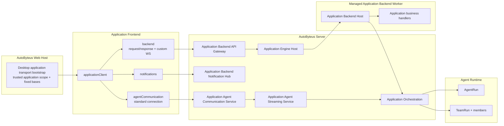

The standard agent path does **not** traverse the application worker. Application business still decides when to create a binding and which target address to return to its frontend. After that decision, the framework owns connection, input routing, event projection, and lifecycle.

## 2. Responsibility Boundaries

| Boundary | Owns | Must Not Own |
| --- | --- | --- |
| AutoByteus desktop web host transport builder | fixed application transport bases and trusted application scope | application business query/path, authentication/credential APIs, target authorization |
| Application frontend | business UI, target address received from its backend, event rendering, connection use | runtime IDs, binding authorization, provider parsing, server queues |
| Frontend SDK direct WebSocket transports | standard target-path encoding or custom path/business-query construction, connection protocol/state | application authentication, application-scope selection, server authorization |
| Frontend SDK `agentCommunication` | target-to-path codec, connection state, standard protocol, input correlation, listener dispatch | application business paths, native agent protocol, binding store reads |
| Standard agent WebSocket adapter | fixed desktop route decoding, socket adaptation, trusted application-scope entry | application worker handlers, target authorization, event mapping |
| `ApplicationAgentCommunicationService` | one standard network session, readiness, input request correlation, immediate serialized frame writes, socket buffered-amount enforcement, close | second agent-event FIFO, binding store, runtime source, application business protocol |
| `ApplicationAgentStreamingService` | reusable target event subscription, exact public projection, per-consumer sequence/queue, terminal drain | frontend socket protocol, application database, binding store/hub bypass |
| Application Orchestration | application/binding/target authorization, binding lifecycle lease, runtime descriptor, input routing, creation/control | network sockets, provider mapping, frontend listener state |
| Custom WebSocket adapter / Application Backend API Gateway | active application/exposure validation, normalized custom request, HTTP/custom-WebSocket entry and session lifecycle into the managed backend | application authentication, standard agent connection/session |
| Application Engine Host | application worker lifecycle and IPC | standard frontend agent network path |
| Application Backend Host | application definitions, handlers, contexts, custom WebSocket handlers, advanced backend observer callbacks | direct frontend network socket, runtime/store authority |
| Notification Hub | notification socket registration and one-way fan-out | agent events, artifacts, custom sessions |
| Artifact platform | durable revision persistence/read and backend handler delivery | live agent input/event transport |

## 3. Canonical Address And Fixed Endpoint

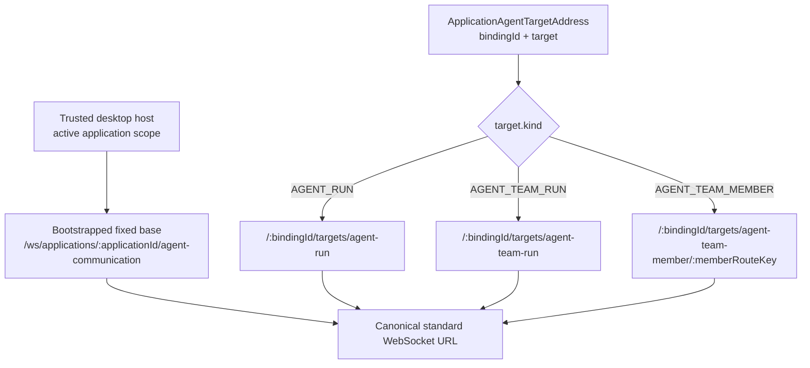

The address is application-scoped by the hosted client and route. It omits `applicationId` and raw runtime IDs. The desktop host owns fixed-base creation; the SDK encodes every target path segment. Application code never constructs the host URL or selects application scope.

### Desktop-only application access boundary

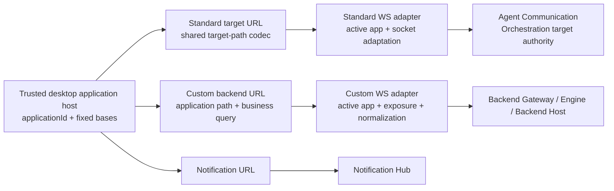

Application features are desktop-only. The bootstrap, `ApplicationClient`, and both connection option types expose no login, token, or credential. Existing platform/network security remains unchanged outside this application contract.

### Manifest and exposure authority boundary

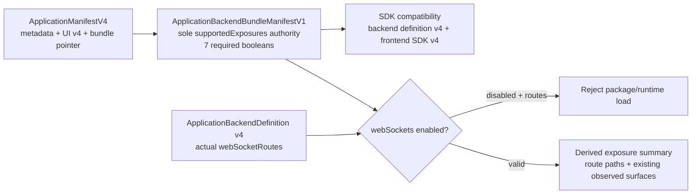

`ApplicationManifestV4` contains no `supportedExposures`. The bundle record is the only declared allowlist; definition routes are actual handlers, and the summary is read-only derived observation. Missing `webSockets`, stale v3 compatibility, or a disabled capability with routes is rejected rather than defaulted.

## 4. DS-001 — Application-Controlled Binding Creation

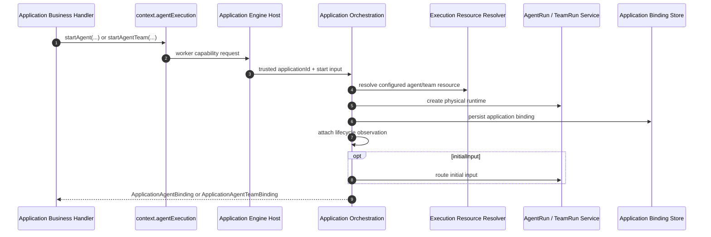

The application decides when and why to start the execution. Streaming/communication never creates a runtime implicitly.

## 5. DS-002 — Business Selection, Standard Address Handoff

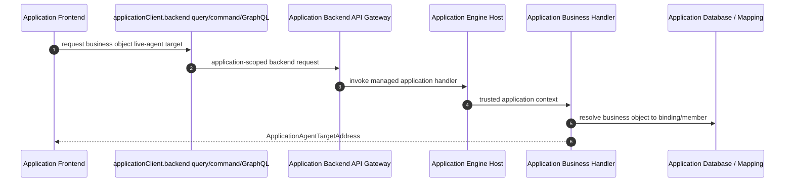

This is the only application-specific mapping required. It selects a business-owned bound target; it does not proxy the WebSocket or transform runtime events.

## 6. DS-003 — Standard Connection Establishment

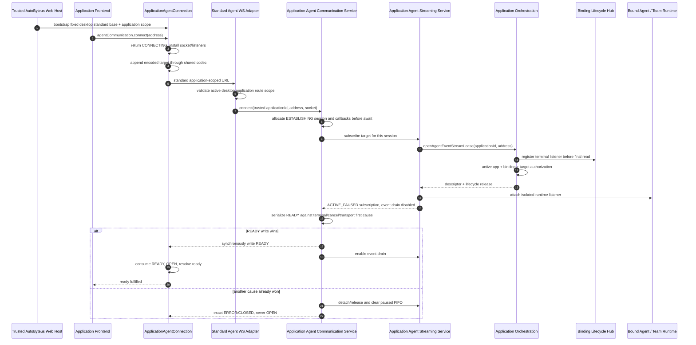

The desktop web host owns the fixed standard base and application scope; the SDK owns target-path encoding; the adapter owns route decoding and active-application validation. The Communication session's synchronous transition serializer is the only READY/terminal/cancel/failure commit owner. If READY succeeds, retained pre-ready events drain afterward. If another cause wins, the session never opens, paused events are dropped, and all late acquisitions are released.

## 7. DS-004 — Standard Input Spine

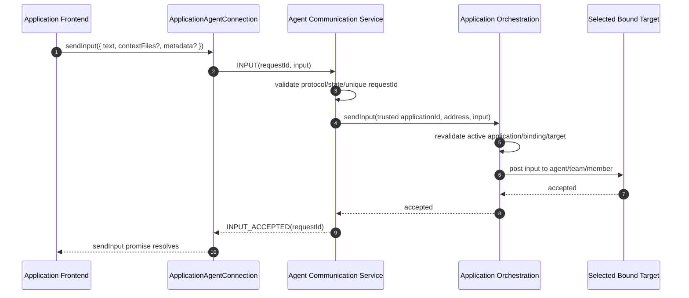

The standard connection supports input, not native command passthrough. Tool approvals, interrupts, arbitrary messages, and binary frames are excluded from v1.

## 8. DS-005 — Standard Event Return Spine

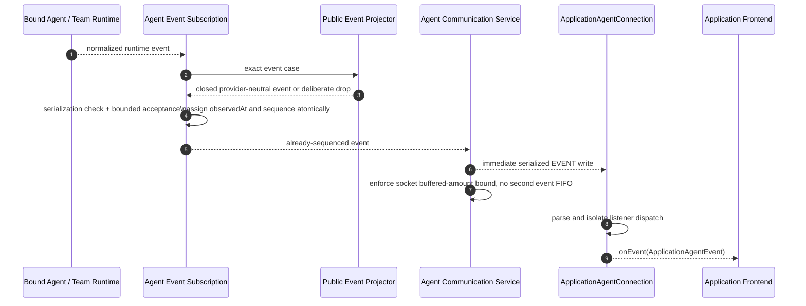

No application backend mapper is required. The frontend still decides how to render the standard event.

## 9. DS-006 — Binding-Terminal Connection Close

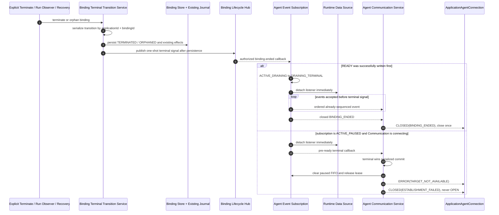

Terminal persistence is authority. The hub is same-process ephemeral observation only. The streaming service receives lifecycle only through the Orchestration lease.

## 10. DS-007 — Advanced Backend Subscription

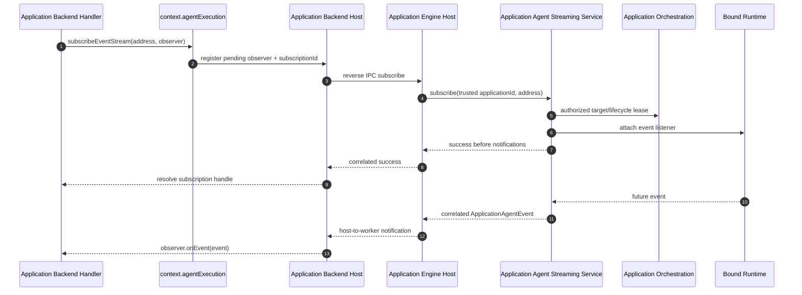

This adapter is available for advanced backend logic. It is not on DS-003 through DS-005 and is not mandatory frontend proxy glue.

## 11. DS-008 — Optional Custom Backend WebSocket

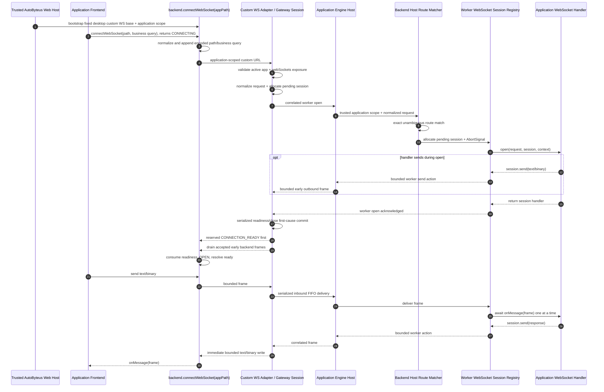

This is the escape hatch for collaborative, binary, or non-agent realtime behavior. Its exact frontend, route, frame, readiness, queue, error, manifest, path/query, and cleanup rules are authoritative in [`application-backend-websocket-contract.md`](./application-backend-websocket-contract.md). `ApplicationWebSocketRequest.query` contains application business query. It is neither called by nor interpreted by the standard agent communication service.

## 12. DS-009 — Notifications Remain Separate

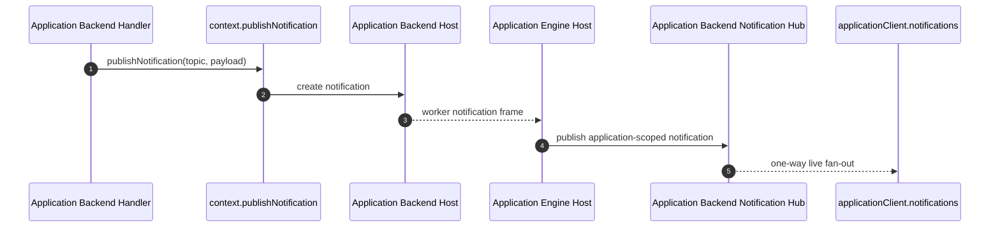

Notifications have no input channel, binding target, event projection, or durability.

## 13. DS-010 — Published Artifacts Remain Durable

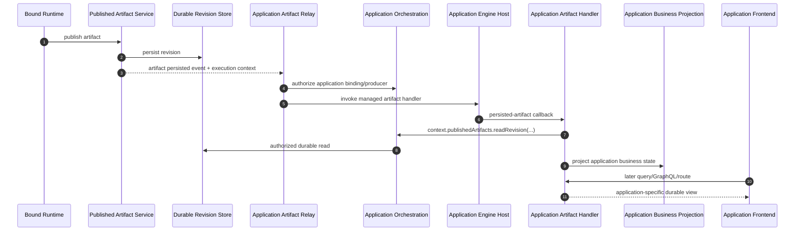

The live public projector drops artifact/file events. A standard agent connection is not artifact recovery or a replacement for application business projection.

## 14. Bounded State And Queue Spines

### DS-011 — Frontend connection state

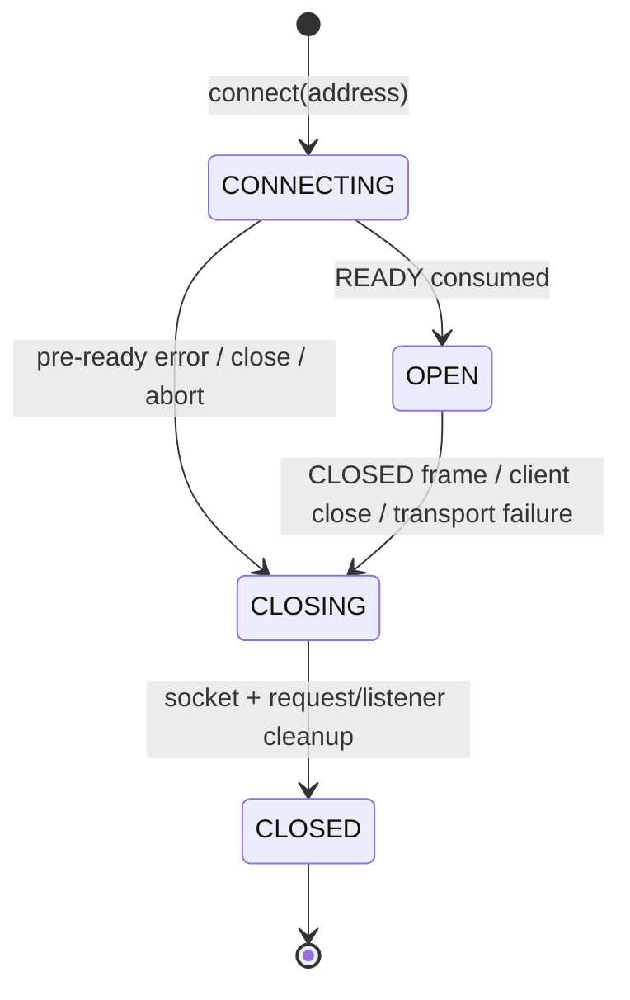

Only these four states are public. Server draining remains internal; the SDK stays `open` until it consumes `CLOSED`.

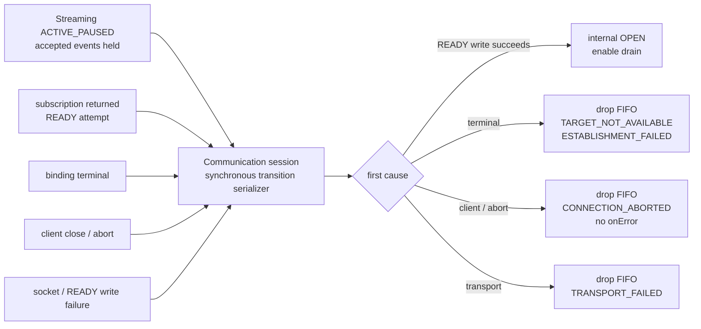

### DS-012 — Per-consumer event loop

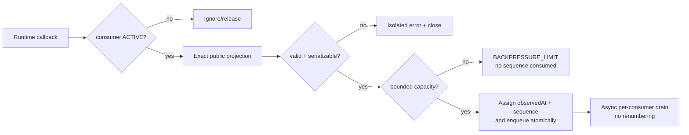

The Streaming subscription owns the only server-side event FIFO for that consumer. A frontend Communication session performs immediate serialized socket writes and a buffered-amount check; it does not copy accepted events into another queue.

### DS-013 — Standard input request correlation

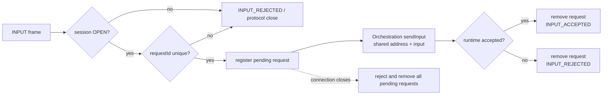

### DS-014 — Backend observer activation and dispatch

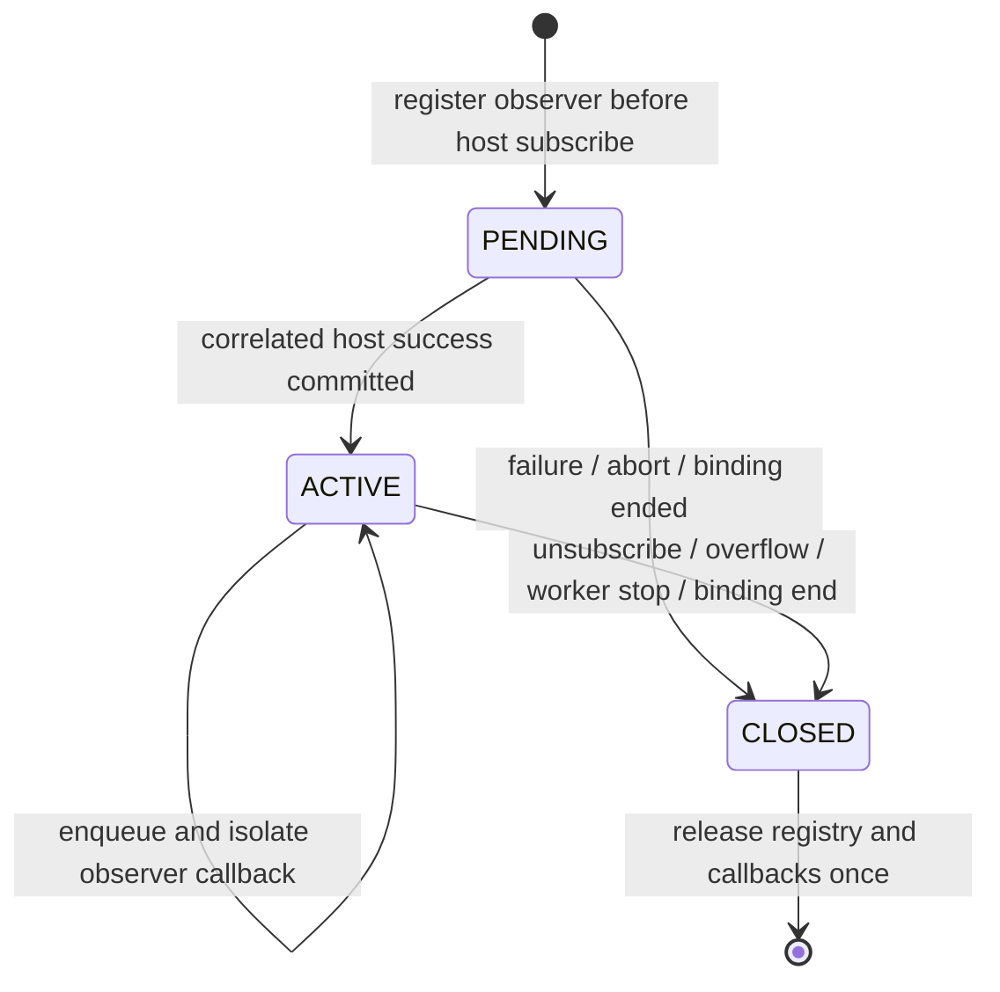

### DS-015 — Binding terminal transition serialization

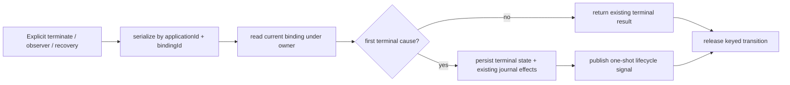

### DS-016 — Optional custom backend WebSocket session

```mermaid
stateDiagram-v2
    [*] --> PENDING_APPLICATION: gateway allocates + installs listeners
    PENDING_APPLICATION --> PENDING_WORKER: active application + exposure accepted
    PENDING_WORKER --> READY_COMMIT: route open acknowledged
    READY_COMMIT --> ACTIVE: reserved readiness write succeeds
    PENDING_APPLICATION --> CLOSING: reject / client close / transport failure
    PENDING_WORKER --> CLOSING: client close / open failure / backend close
    READY_COMMIT --> CLOSING: close wins / readiness write fails
    ACTIVE --> ACTIVE: ordered bounded message relay
    ACTIVE --> CLOSING: either side closes / fails / overflows
    CLOSING --> CLOSED: idempotent gateway + worker cleanup
    CLOSED --> [*]
```

`PENDING_APPLICATION`, `PENDING_WORKER`, and `READY_COMMIT` map to frontend `connecting`; `ACTIVE` maps to `open`; the remaining states map to `closing/closed`. Raw client frames before `ACTIVE` are rejected rather than queued. Backend sends during `open(...)` use one bounded early FIFO and are released only after the reserved readiness frame.

```mermaid
flowchart LR
    CLIENT["Frontend frame"] --> GIN["Gateway bounded inbound FIFO"]
    GIN --> EIPC["serialized Engine IPC"] --> WH["Worker registry"] --> HANDLER["one-at-a-time onMessage"]
    HANDLER --> WOUT["Worker bounded outbound FIFO"] --> ACTION["Engine host action"] --> BUFFER{"socket bufferedAmount within limit?"}
    BUFFER -->|yes| CLIENTOUT["Frontend onMessage"]
    BUFFER -->|no| CLOSE["1013 close this session"]
```

## 15. Complete Communication Matrix

| Caller | Public Boundary | Destination | Purpose |
| --- | --- | --- | --- |
| AutoByteus desktop web host | `buildApplicationHostTransport(...)` | strict iframe transport bootstrap | trusted application scope plus fixed standard/custom/notification bases; no application auth surface |
| Application frontend | `applicationClient.backend.query/command/graphql/route` | managed application handler | application business request/response |
| Application frontend | `applicationClient.backend.connectWebSocket(path, options?)` | typed custom connection → Gateway/worker route | optional text/binary realtime protocol |
| Application frontend | `applicationClient.notifications.subscribe` | Notification Hub | application-defined one-way topics |
| Application frontend | `applicationClient.agentCommunication.connect(address)` | standard Agent Communication Service | application-bound agent/team/member input and events |
| Application backend | `context.agentExecution.startAgent/startAgentTeam` | Application Orchestration | create application binding |
| Application backend | `context.agentExecution.sendInput(address)` | Application Orchestration | backend input to bound target |
| Application backend | `context.agentExecution.subscribeEventStream(address)` | Agent Streaming Service via Engine Host | optional backend live observation |
| Runtime | published artifact service | durable store + application handler | durable application result |
| Application backend WebSocket route | `open(request, session, context)` + returned handler | correlated frontend custom connection | application-defined realtime protocol over normalized business path/query |

## 16. Allowed And Forbidden Dependencies

Allowed:

```text
desktop web host → strict application WS bases
standard frontend transport → shared target-path codec
custom frontend transport → custom path/business-query construction
standard WS adapter → Agent Communication Service → Agent Streaming Service → Application Orchestration
Agent Communication Service → Application Orchestration (input only)
backend observer registry → Engine Host → Agent Streaming Service
custom backend WS adapter → Backend API Gateway → Engine Host → Backend Host
artifact relay → Application Orchestration → Engine Host → artifact handler
```

Forbidden:

```text
standard agent connection → Application Backend API Gateway / Engine Host / application worker
standard agent connection → native agent/team stream handler
Agent Communication Service → binding store / lifecycle hub / runtime service directly
Agent Streaming Service → binding store / lifecycle hub directly
frontend → raw runId native socket
notification hub → agent event source
artifact relay/revision store → standard agent connection
custom backend WebSocket handler as mandatory standard-agent proxy
ApplicationClient → authentication / credential API
paired-mobile or phone remote-access behavior → application framework contract
ApplicationManifestV4 → supportedExposures copy
```

## 17. Use-Case Coverage

| Use Case | Spine Coverage |
| --- | --- |
| `UC-001` Individual bound agent | DS-001 through DS-006, DS-011 through DS-013, DS-015 with `AGENT_RUN` |
| `UC-002` Whole bound team | DS-001 through DS-006, DS-011 through DS-013, DS-015 with `AGENT_TEAM_RUN` |
| `UC-003` Selected team member | DS-001 through DS-006, DS-011 through DS-013, DS-015 with `AGENT_TEAM_MEMBER` |
| `UC-004` Backend live observation | DS-001, DS-006, DS-007, DS-012, DS-014, DS-015 |
| `UC-005` Custom realtime backend protocol | DS-008, DS-016 |
| `UC-006` Artifact plus live communication | DS-001 through DS-006 composed with DS-010, DS-011 through DS-013, DS-015; planes remain separate |
| `UC-007` Multiple independent consumers | DS-003, DS-005 through DS-007, plus independent DS-011 through DS-015 state |

## 18. Persisted Data Decision

`Directly Usable — No Migration`.

Existing bindings and artifacts retain their current stored meaning. The new target address, network connection, subscription, request, queue, and sequence are transient. No DDL, migration, replay/checkpoint store, compatibility reader, connection-grant storage, or data rewrite is part of this ticket.
