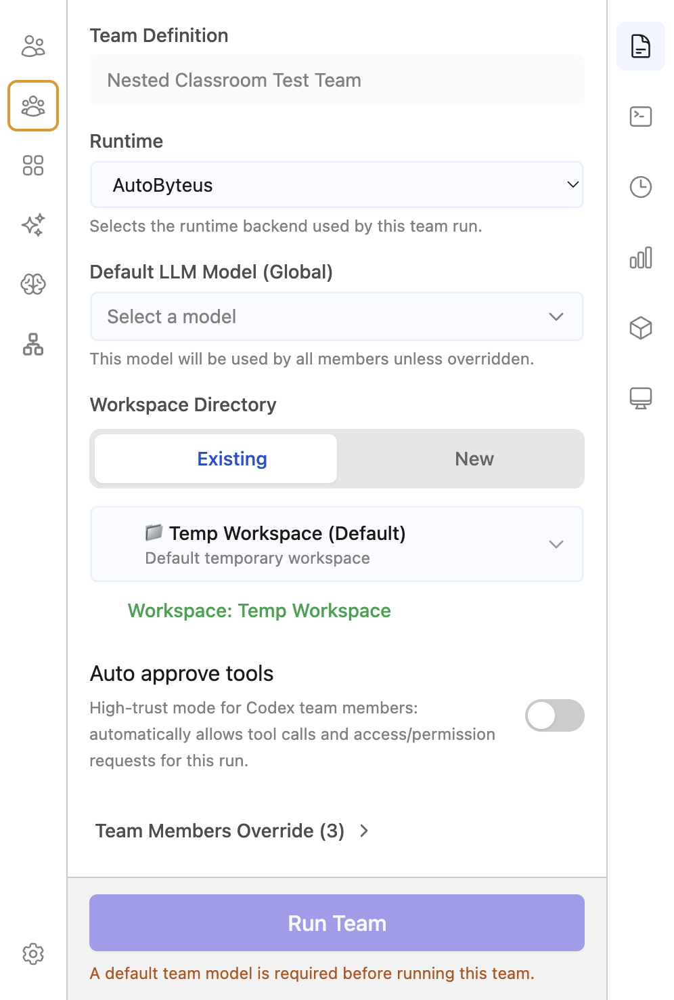
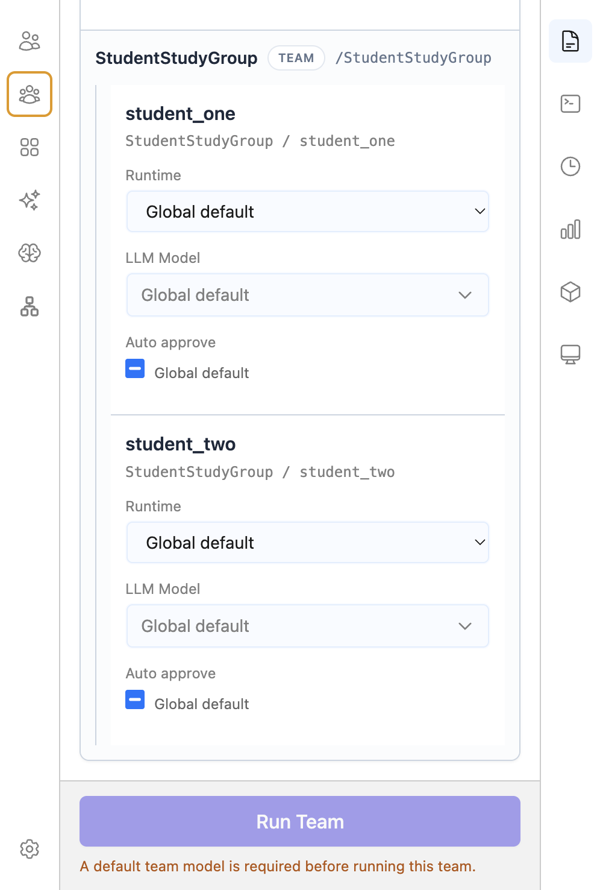

# Hierarchical TeamRun Launch Configuration — UI/UX Specification

## Status (`Draft`/`Requirements-ready`/`Refined`)

`Refined — user-approved` — prepared from the current `origin/personal` visual baseline and the user's 2026-08-25 Electron feedback. The user approved the minimal-addition direction on 2026-08-25: preserve the original form, add only nested-Team global configuration, and omit canonical-root and effective-summary noise. Ready for architecture re-review; implementation remains gated on that review.

## UX Goal

Add editable global launch configuration to every nested Team **without redesigning the existing Team launch form**.

The root experience remains visually equivalent to the current `origin/personal` form. The hierarchy feature is additive: when the existing member-override area is opened, each nested Team gains a compact disclosure containing the same launch controls. Internal configuration-model detail must not become steady-state visual noise.

### Governing UX Principles

1. **Preserve the familiar root form.** Team Definition flows directly into Runtime, model/model configuration, Workspace Directory, Auto approve tools, and the existing member-override disclosure.
2. **Add nested capability where the hierarchy already appears.** Extend the existing nested-Team group instead of introducing a second top-level design language.
3. **Progressively disclose complexity.** Root controls remain visible; the existing member section and individual nested-Team editors are collapsible.
4. **Show controls, not duplicated summaries.** An expanded editor's controls are the effective-value presentation. No separate runtime/model/workspace summary is rendered.
5. **Expose only actionable state.** Nested scopes show `Inherited` or `Customized`; `Reset` appears only when it can act. The root has no analogous badge because it cannot inherit or reset to a parent.
6. **Keep canonical identity in the model.** The root address `/` is never rendered in the ordinary form. The existing nested placement address may remain in the nested group header for hierarchy disambiguation; no new address row or root-equivalent chrome is added.
7. **Preserve behavior and accessibility.** Simplification must not remove control labels, scoped error association, keyboard disclosure, disabled state, or loading/retry feedback.

## Baseline Evidence

### Current `origin/personal` root form — visual baseline to preserve

Rendered from the local `personal` checkout at `8d6b06b8cf15d1f355be86b02ef233a111998f07` against the live local server. Static comparison found no relevant workspace-config UI changes between that checkout and `origin/personal@87b1b584592be95b1c8ee076f1d0ab3986a13f18`.



Baseline characteristics:

- no root wrapper card;
- no “Root Team defaults” title or badge;
- no root canonical address `/`;
- no effective-configuration summary;
- controls begin immediately after Team Definition;
- one compact `Team Members Override (N)` disclosure;
- sticky Run Team action remains separate from the scrolling form.

### Current `origin/personal` nested-Team group — extension point



The existing nested group already provides hierarchy indentation, Team name, `TEAM` marker, placement address, and descendant Agent controls. The target adds the Team's own global controls inside this group; it does not replace the surrounding member-tree visual language.

### Rejected DR-003 presentation


The user rejected the root title/badge, rendered `/`, divider, and effective summary as duplicate information. None is retained in the target.

## Related Requirements And Acceptance Criteria

- Behaviors: `BEH-001`, `BEH-002`, `BEH-003`, `BEH-009`
- Requirements: `R-001`–`R-010`, `R-038`–`R-041`
- Acceptance criteria: `AC-001`–`AC-008`, `AC-031`–`AC-034`
- Preserved behavior: root -> nearest containing Team -> exact Agent resolution; root-only teams require no new interaction; root/nested edits use the same draft and launch lifecycle.

## Users / Personas / Contexts

- **Ordinary Team launcher:** selects a Team, chooses root runtime/model/workspace, optionally customizes a nested Team, and runs.
- **Advanced hierarchy launcher:** configures multiple nested levels and exact Agent overrides.
- **Read-only run inspector:** sees stored effective settings without editable controls.
- **Keyboard/screen-reader user:** traverses actual controls and nested disclosures without relying on color.
- **Narrow desktop/Electron user:** uses the same desktop hierarchy in a constrained configuration column; mobile retains its separate root-only setup.

## User-Journey Inventory

| Journey ID | User / Context | Starting State | User Goal | Completion State | Related Requirement / Acceptance-Criteria IDs |
| --- | --- | --- | --- | --- | --- |
| UXJ-001 | Root-only launcher | New root-only Team draft | Configure and launch as before | Root launch succeeds with no hierarchy-specific chrome or extra interaction | R-001–R-004; AC-001–AC-003 |
| UXJ-002 | Nested-Team launcher | New hierarchical draft; nested Team inherits | Find a nested Team and inspect its global settings | Nested editor opens with effective inherited values in the real controls | R-005–R-008; AC-004–AC-006 |
| UXJ-003 | Nested-Team launcher | Expanded inherited nested editor | Customize one or more Team-level fields | Header state becomes `Customized`; subtree resolves from the edited Team | R-007–R-008; AC-005–AC-006 |
| UXJ-004 | Nested-Team launcher | Customized nested Team | Return the whole Team scope to parent inheritance | Override is removed, controls recompute, state returns to `Inherited`, Reset disappears | R-009–R-010; AC-007 |
| UXJ-005 | Advanced launcher | Multi-level Team tree | Configure a deeper Team and Agent | Indentation/disclosures preserve containing-Team context and exact Agent override behavior | R-010–R-015; AC-008–AC-012 |
| UXJ-006 | Locked/read-only/error context | Draft cannot safely edit or scope dependency failed | Understand state and recover when possible | Controls remain legible, correctly disabled, and scoped retry/error feedback is available | R-038–R-041; AC-031–AC-034 |

## Journey Details

### UXJ-001 — Preserve the root flow

1. User selects **Run** for a Team definition.
2. The form renders the existing sequence: Team Definition -> Runtime -> model/model configuration -> Workspace Directory -> Auto approve tools -> Team Members Override.
3. No root scope heading, state badge, address, wrapper summary, or divider is inserted.
4. Root-only Teams show no empty nested placeholder and require no additional click.
5. User launches with the existing sticky Run Team action.

### UXJ-002 — Inspect a nested Team

1. User opens the existing **Team Members Override (N)** disclosure.
2. Agent items and nested-Team groups appear in their existing hierarchy order.
3. A nested Team header uses the existing Team group identity treatment and adds one actionable state: `Inherited` or `Customized`, plus a disclosure chevron.
4. Nested Team disclosures are collapsed initially to keep the hierarchy scannable.
5. User expands a nested Team.
6. The Team's actual runtime/model/model-config/workspace/auto-approve controls render directly; there is no effective summary above or below them.
7. In inherited state, each control displays its current effective parent-derived value.

### UXJ-003 — Customize a nested Team

1. User changes any supported nested-Team control.
2. The value updates in place with no extra confirmation screen.
3. Header state changes from `Inherited` to `Customized`.
4. A compact **Reset** action appears in the header.
5. Descendant Team/Agent controls that still inherit recompute normally; no duplicate “customized fields” summary is added.

### UXJ-004 — Reset a nested Team

1. User activates **Reset**.
2. The full nested-Team override is removed.
3. Workspace authoring/loading/error state for that scope follows the approved atomic reset behavior.
4. Controls show the recomputed parent-derived values.
5. State returns to `Inherited`, and Reset disappears.
6. Expansion remains open so the result is visible.

## Screen / Surface / Component Inventory

| Surface / Component | Purpose | Entry Conditions | Important States | Exit / Next Action |
| --- | --- | --- | --- | --- |
| `RunConfigPanel` | Scrolling configuration plus sticky launch action | Agent/Team selected | editable, pending, read-only, repair/error | Run or return to event view |
| Root portion of `TeamRunConfigForm` | Existing global Team controls | New/read-only Team config present | editable, disabled, loading/error | Continue to members or Run |
| `Team Members Override (N)` disclosure | Existing entry to hierarchy detail | Team has members | collapsed/expanded | Inspect Agent/nested Team |
| Nested Team header | Identify and operate one nested Team scope | Nested Team in definition tree | inherited/customized, collapsed/expanded, reset available | Expand/collapse/reset |
| Nested Team editor | Edit global configuration for one subtree | Nested disclosure expanded | inherited values, customized values, loading/error, disabled/read-only | Edit, reset, inspect descendants |
| `MemberOverrideItem` | Exact Agent override | Agent placement visible | global/default/customized, disabled/read-only | Edit Agent override |
| Sticky Run Team footer | Launch current exact draft | Editable draft selected | enabled/disabled/pending + blocker | Launch |

## Interaction And State-Transition Specification

| Scenario / State | User Action Or Trigger | Immediate Feedback | Resulting UI State | Data / Side Effect | Next Available Actions |
| --- | --- | --- | --- | --- | --- |
| Member hierarchy collapsed | Open `Team Members Override (N)` | Chevron rotates | Existing Agent/nested tree becomes visible | None | Inspect item or close |
| Nested Team collapsed/inherited | Expand nested header | Chevron/`aria-expanded` updates | Controls become visible with effective values; no summary row | None | Edit or collapse |
| Nested Team field edit | Change runtime/model/config/workspace/auto-approve | Control updates | Header becomes `Customized`; Reset appears | Typed exact-address Team override edit | Continue, reset, launch |
| Nested Team reset | Activate Reset | Values recompute in place | Header becomes `Inherited`; Reset disappears; stays expanded | Atomic scoped reset | Edit again or collapse |
| Parent edit | Change root/ancestor value | Affected inherited controls update | Nested scope remains `Inherited` unless it has its own override | Existing immutable draft replacement | Continue or launch |
| Loading | Runtime catalog/workspace operation starts | Scoped loading treatment | Only unsafe controls disabled; values remain visible | Existing store operation | Wait |
| Recoverable error | Scoped catalog/workspace operation fails | Inline message and Retry at affected scope | Other scopes remain usable where safe; Run blocked if needed | Existing error state | Retry/edit |
| Locked/read-only | Run starts or stored run selected | Controls disable without disappearing | Same visual hierarchy; no editable Reset | None | Inspect/navigate |
| Stale topology repair | Launch detects stale subject | Existing localized repair notice | No workspace registration/create for rejected attempt | Existing atomic repair | Review form and retry |

## Markdown Wireframes / Visual Structure

### Root — target equals the original personal-branch form

```text
Team Definition
[ Nested Classroom Test Team                         ]

Runtime
[ AutoByteus                                      v ]
Selects the runtime backend used by this team run.

Default LLM Model (Global)
[ Select a model                                  v ]
This model will be used by all members unless overridden.

[ model-specific controls only when the model exposes them ]

Workspace Directory
[ Existing                  | New                    ]
[ Temp Workspace (Default)                          v ]
Workspace: Temp Workspace

Auto approve tools                                (off)
High-trust mode ...

Team Members Override (3)                           >
------------------------------------------------------
[ Run Team ]
[ blocker only when one exists ]
```

Explicitly absent:

```text
NO “Root Team defaults” heading
NO duplicate “Root Team defaults” badge
NO root address “/”
NO “Effective: runtime · model · workspace” summary
NO root wrapper card/divider added by the hierarchy feature
```

### Nested Team — minimal extension of the existing member group

Collapsed:

```text
┌────────────────────────────────────────────────────┐
│ StudentStudyGroup   TEAM   /StudentStudyGroup      │
│ Inherited                                         > │
└────────────────────────────────────────────────────┘
```

Expanded and inherited:

```text
┌────────────────────────────────────────────────────┐
│ StudentStudyGroup   TEAM   /StudentStudyGroup      │
│ Inherited                                         v │
│                                                    │
│ Runtime                                            │
│ [ Codex App Server                              v ] │
│                                                    │
│ Default LLM Model                                  │
│ [ GPT-5.6-Sol                                   v ] │
│                                                    │
│ [ model-specific controls when applicable ]        │
│                                                    │
│ Workspace Directory                                │
│ [ Existing               | New                   ] │
│ [ Temp Workspace                              v ] │
│                                                    │
│ Auto approve tools                          (off)   │
│                                                    │
│ ─ descendant Agents / Teams, existing style ─      │
└────────────────────────────────────────────────────┘
```

Expanded and customized:

```text
│ StudentStudyGroup   TEAM   /StudentStudyGroup      │
│ Customized                       Reset            v │
│ [ same controls; actual effective values ]          │
```

There is **no effective summary in either collapsed or expanded state**. Collapsed scan value is limited to Team identity and inheritance/customization state.

### Multi-level hierarchy

```text
Team Members Override (N) v

Teacher [Agent controls]

StudentStudyGroup [Inherited] v
  [Team global controls]

  student_one [Agent controls]
  student_two [Agent controls]

  ReviewTeam [Customized] >
```

Indentation communicates containment. The screen does not flatten nested Team controls into a separate top-level list.

## Non-Happy-Path States

### Loading

- Loading feedback appears only at the affected nested Team or root control group.
- Stored/effective values remain visible.
- Do not replace the form with a global spinner.
- Disable only controls whose safe option set or operation is unresolved.

### Empty

- Root-only definition: no member hierarchy placeholder and no nested disclosure.
- Team with Agents but no nested Teams: existing Agent override experience remains.
- Model catalog with no selectable model: retain the existing empty/required validation presentation.

### Error And Recovery

- Runtime/model error: inline at the affected scope with Retry.
- Workspace registration failure: retain selected mode/path and show the scoped error.
- Topology repair: keep the existing single repair notice above the root controls; do not restore removed root chrome to anchor it.
- Errors may name the affected canonical address when required to disambiguate recovery; normal steady-state root UI does not show `/`.

### Disabled / Unavailable

- Locked, read-only, and in-flight states disable root, nested Team, Reset, and Agent edits consistently.
- Disabled controls keep labels and values legible.
- Always-on/unsupported model controls keep their existing shared component behavior; this ticket does not redesign model-schema wording.

### Permission / Authentication

No new permission or authentication UI is introduced.

## Responsive And Platform Behavior

- Desktop/Electron is the hierarchical authoring surface.
- Root layout follows the existing personal-branch widths, spacing, and quiet control styling.
- At narrow desktop widths, nested header identity, state, Reset, and chevron may wrap onto two lines; none may overlap.
- Nested indentation may reduce progressively but must continue to communicate parent/child structure.
- Sticky Run Team footer must not cover the last reachable control; the scrolling container supplies sufficient bottom spacing.
- Mobile Team setup remains root-only and receives no hierarchical editor in this ticket.

## Accessibility And Keyboard Behavior

- All runtime/model/workspace controls retain explicit labels.
- `Team Members Override` and each nested Team disclosure are buttons with `aria-expanded` and `aria-controls`.
- Nested state (`Inherited`/`Customized`) is text, not color-only.
- Reset has an accessible name containing the Team name or placement identity.
- Error/status text is associated with the affected scope; recoverable Retry is keyboard-operable.
- Removing the root title/address/summary must not remove the actual form labels or Team Definition label.
- Focus order follows visual order: root controls -> member disclosure -> nested header -> nested controls -> descendants -> sticky action.

## Content, Labels, And Validation Messages

### Preserve from `origin/personal`

- `Team Definition`
- `Runtime`
- `Default LLM Model (Global)` for root
- `Workspace Directory`
- `Auto approve tools`
- `Team Members Override (N)`
- `Run Team`
- Existing field help and blocker/error wording unless another approved ticket governs it.

### Nested Team additions

- `Inherited`
- `Customized`
- `Reset`
- `Default LLM Model` or the shared model label without `(Global)` because the value applies only to this subtree.

### Remove / do not introduce

- `Root Team defaults`
- root `/`
- `Effective:` summary
- `Customized fields:` summary
- duplicate Team-scope explanatory copy when an existing field label/help text already communicates the action.

## Data And API Dependencies

- UI reads the existing derived `TeamRunConfigurationView` and draft-owned workspace state.
- Root and nested controls emit existing typed commands; no component mutates configuration directly.
- `Inherited` means no meaningful override exists at that exact Team address.
- `Customized` means a meaningful exact-address Team override exists.
- Reset invokes the existing atomic Team-scope reset command.
- No API, GraphQL, backend, V2 schema, migration, or allocation change is required by this UI/UX revision.

## Out Of Scope

- Redesigning the root Team form.
- Redesigning shared runtime/model/model-config or workspace controls.
- Replacing the existing Agent override UI.
- Adding hierarchical editing to mobile/application/external-channel setup.
- Showing a resolved configuration inspector or debug addresses in steady-state authoring.
- Changing inheritance, readiness, workspace preparation, launch, persistence, or migration behavior.

## Open Decisions / Risks

- No functional decision is open.
- Architecture review must confirm that implementation can preserve this exact visual baseline and default-collapsed nested disclosure without reopening approved functional owners.
- The main implementation risk is reusing `TeamScopeConfigEditor` in a way that reintroduces common root/nested chrome. Reuse must stop at field composition and event behavior.
- The main UX regression risk is hiding nested configuration too deeply. Mitigation: preserve the existing member disclosure, add a clear nested Team chevron and state, and keep one click from nested header to controls.

## Approval Status

Approved by the user on 2026-08-25 and recorded in SR-011.

Approved points:

1. Root remains visually equivalent to the current `origin/personal` screenshot.
2. No effective summary appears for root or nested Teams.
3. Nested Teams extend the existing member-group appearance and default collapsed.
4. Nested headers retain Team identity plus only actionable `Inherited`/`Customized` and conditional Reset state.
