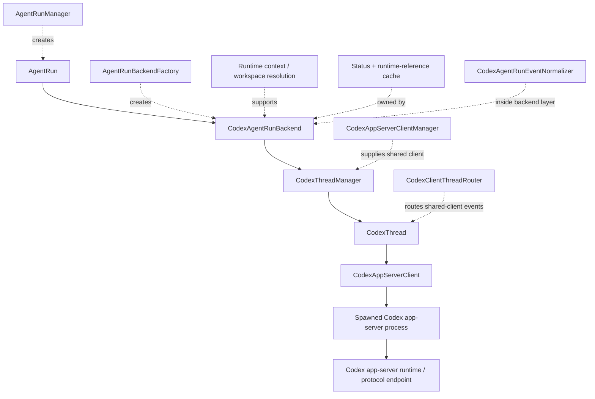
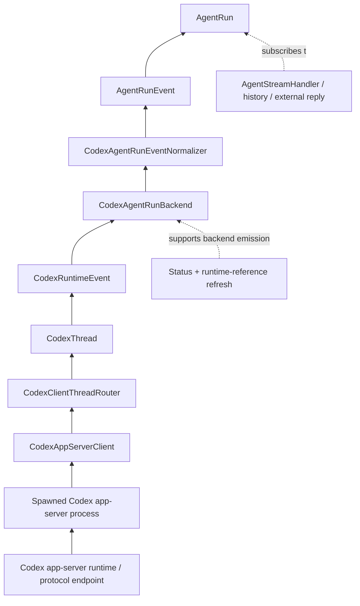
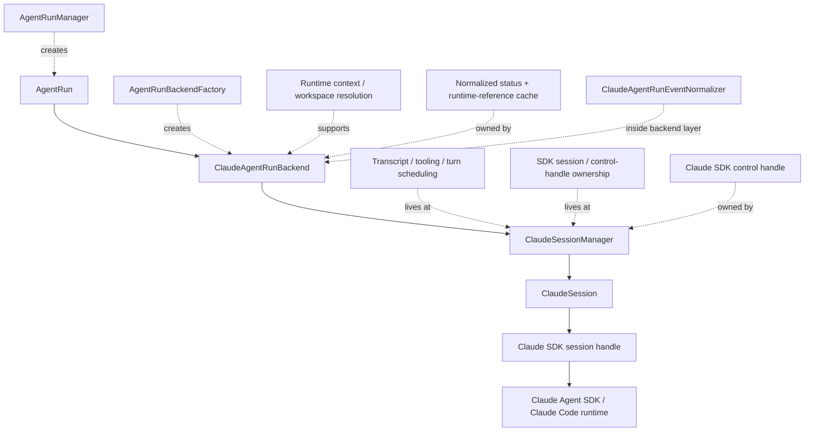
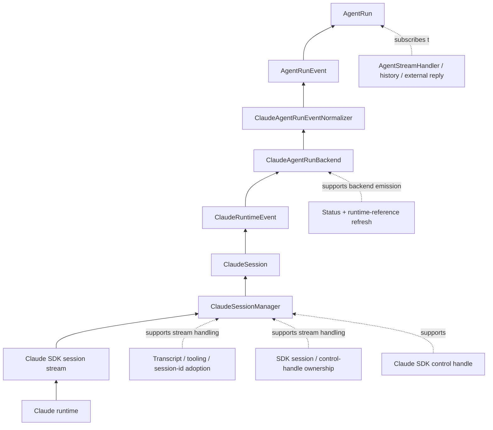
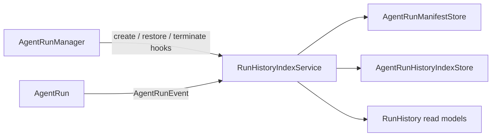
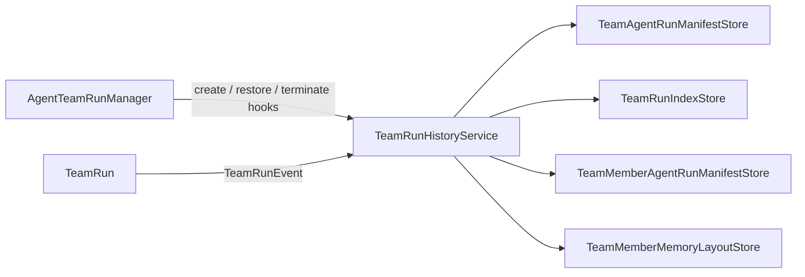
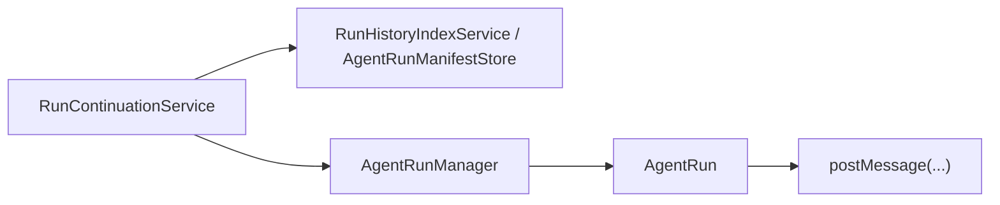
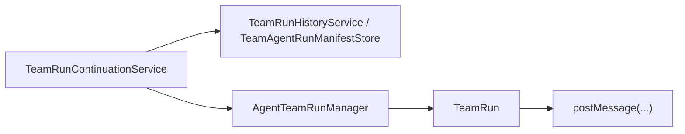

# Proposed Design

## Status

- Version: `v10`
- State: `Draft`
- Last Updated: `2026-03-16`

## Summary

The current architecture has a clean runtime-extension layer but lacks a first-class runtime domain subject for Codex and Claude. Native AutoByteus already has one in practice through `Agent`, `AgentTeam`, and their run/event/status model. The proposed design restores that same application-facing shape across all runtimes by introducing runtime-neutral `AgentRun` and `TeamRun` subjects, while moving runtime-specific details behind backend implementations.

This design keeps the frontend and websocket protocol stable in the first refactor slice.

The first future-state team runtime call-stack slice is now recorded in:

- `tickets/in-progress/runtime-domain-subject-refactor/future-state-runtime-call-stack.md`
- `tickets/in-progress/runtime-domain-subject-refactor/future-state-runtime-call-stack-review.md`

## Design Goals

1. Make `AgentRun` and `TeamRun` the first-class runtime subjects across native, Codex, and Claude.
2. Make `AgentRunManager` and `AgentTeamRunManager` runtime-neutral managers of those subjects.
3. Push runtime-specific creation, session control, raw event handling, and status updates behind backend implementations.
4. Preserve the current normalized frontend websocket contract and runtime-unaware UI behavior.
5. Keep one outward stream per agent run and one outward stream per team run.
6. Make status and event ownership explicit at the run boundary.

## Refactoring Principle

This refactor is not only about adding new abstractions.

It must also remove or internalize current top-level concepts that exist only because Codex and Claude do not yet have first-class run subjects.

That means the success condition is not:

- new `AgentRun` / `TeamRun` classes added on top of the current architecture

It is:

- `AgentRun` / `TeamRun` become the public runtime model
- several current application-facing services either disappear, move below the run boundary, or become thin compatibility shims
- top-level creation and streaming concepts should use names that match the domain directly

## Current Problem

### Native runtime

Native runtime is centered on explicit domain subjects:

- `AgentConfig`
- `Agent`
- `AgentTeam`
- native event streams

Processors and status/event handling are subordinate to those subjects.

### Codex and Claude runtimes

Codex and Claude behavior is distributed across:

- runtime composition
- runtime adapter registry
- runtime session store
- runtime command ingress
- runtime service
- runtime event mapping
- stream handlers
- team bridges/orchestrators for member-runtime teams

The system works, but the “run” concept is implicit instead of embodied.

## Target Architecture

### 1. Static definition layer

Static definition subjects remain unchanged in principle:

- `AgentDefinition`
- `TeamDefinition`

These remain the persisted input model for creating runtime runs.

### 2. Runtime domain-subject layer

Introduce two runtime-neutral subjects:

- `AgentRun`
- `TeamRun`

These become the application-facing objects for all runtimes.

#### `AgentRun` responsibilities

- own `runId`
- own normalized `currentStatus`
- accept normalized commands:
  - `postMessage(...)`
  - `approveTool(...)`
  - `interrupt()`
- expose normalized event subscription
- own external-source binding / reply publication scope
- own normalized runtime reference metadata as needed
- represent the live runtime session directly

#### `TeamRun` responsibilities

- own `teamRunId`
- own normalized team status
- own normalized member-visible status
- accept normalized commands:
  - `postMessage(...)`
  - `approveTool(...)`
  - `interrupt()`
- expose one team-scoped normalized event subscription
- own member routing and member approval routing
- own team-level external-source binding / reply publication scope
- own member-runtime aggregation internally when the runtime uses member sessions
- represent the live team execution directly

## Identity Model

### Application identity

Application-facing identity should be:

- `runId` for `AgentRun`
- `teamRunId` for `TeamRun`

These are the stable ids used by:

- websocket routes
- GraphQL/API calls
- external-channel binding
- run-history references
- manager lookup

### Backend/provider identity

Backend-specific identities remain internal, for example:

- Codex `threadId`
- Codex provider/session process references
- Claude SDK `sessionId`
- any provider-specific execution handle or runtime reference metadata

These should not become first-class architecture concepts above the run subject boundary.

They should live:

- inside the backend implementation attached to the run, and/or
- inside persisted history/runtime-reference metadata as backend-owned details

### Design rule

- `AgentRun` is the outward session.
- provider `sessionId` / `threadId` are internal references used by the backend that powers that run.
- the same rule applies to teams:
  - `TeamRun` is the outward execution subject
  - internal member runtime references remain team-backend-owned implementation details

### Conceptual interfaces

The exact TypeScript signatures can change, but the design should be close to this shape:

```ts
type AgentRunStatus = string;
type TeamRunStatus = string;

type AgentRunEvent = {
  type: string;
  payload: Record<string, unknown>;
};

type TeamRunEvent = {
  type: string;
  payload: Record<string, unknown>;
};

interface AgentRun {
  readonly runId: string;
  readonly runtimeKind: string;
  getCurrentStatus(): AgentRunStatus | null;
  postMessage(input: AgentInputUserMessage): Promise<RunCommandResult>;
  approveTool(input: ApproveToolInput): Promise<RunCommandResult>;
  interrupt(): Promise<RunCommandResult>;
  subscribe(listener: (event: AgentRunEvent) => void): () => void;
}

interface TeamRun {
  readonly teamRunId: string;
  readonly runtimeKind: string;
  getCurrentStatus(): TeamRunStatus | null;
  getMemberStatuses(): TeamMemberStatusSnapshot[];
  postMessage(input: TeamRunMessageInput): Promise<RunCommandResult>;
  approveTool(input: TeamRunApproveToolInput): Promise<RunCommandResult>;
  interrupt(): Promise<RunCommandResult>;
  subscribe(listener: (event: TeamRunEvent) => void): () => void;
}
```

The important point is not the exact method list. The important point is that the run object itself owns:

- the live session
- the live status
- the normalized event stream
- command ingress

### 3. Runtime-neutral manager layer

Refactor:

- `AgentRunManager`
- `AgentTeamRunManager`

into runtime-neutral managers that create, restore, register, and resolve `AgentRun` / `TeamRun`.

These managers should stop being native-only builders.

Design rule:

- `AgentRunManager.createAgentRun(...)` should be the natural server-side creation entrypoint for single runs
- `AgentTeamRunManager.createTeamRun(...)` should be the natural server-side creation entrypoint for team runs
- we should not preserve a public `RuntimeCompositionService` if its name no longer matches the domain model

### Manager internals

The manager should receive a runtime-neutral create/restore request from the server boundary, for example:

- `agentDefinitionId`
- `teamDefinitionId`
- `runtimeKind`
- `llmModelIdentifier`
- `workspaceId`
- `autoExecuteTools`
- optional runtime config

Internally, the manager should:

1. validate the runtime-neutral request
2. resolve the backend factory for the requested runtime kind
3. ask that factory to create the backend for the run
4. construct `AgentRun` or `TeamRun` around that backend
5. register the live run object by outward id
6. return the run object

So the manager should not need to know:

- whether native is backed by a live agent object
- whether Codex is backed by a thread
- whether Claude is backed by a session

Those are backend concerns.

What the manager should know is only:

- which backend kind to use
- which outward run id / team run id to register
- which runtime-neutral request parameters are needed

Additional ownership note:

- `AgentRunManager` / `AgentTeamRunManager` should remain lifecycle/lookup managers
- live execution verbs belong to `AgentRun` / `TeamRun`
- if a manager starts directly owning send/approve/interrupt/terminate semantics, that is a design smell
- a smaller residual smell can still exist if the manager assembles those verbs internally while constructing runs; that should also move downward over time into backend-factory or runtime-specific run-wrapper code

### Recommended internal dependency

Instead of a public `RuntimeCompositionService`, the cleaner target dependency is something closer to:

- `AgentRunBackendFactory`
- `TeamRunBackendFactory`

Any runtime-kind registry that survives should sit behind those factories as an internal implementation detail.

Pragmatic migration note:

- the current `RuntimeAdapterRegistry` is thin enough to survive temporarily under the factory layer
- the important change is not the registry name first
- the important change is that managers depend on factories, not on runtime adapter/session services
- public server-side creation should move to:
  - `AgentRunManager.createAgentRun(...)`
  - `AgentTeamRunManager.createTeamRun(...)`

So the practical first slice can be:

1. introduce backend factories as manager dependencies
2. remove `RuntimeCompositionService` from the public architecture
3. remove `RuntimeCommandIngressService` from the public architecture
4. let factories handle runtime/backend selection internally
5. keep or remove the old registry only as a private factory detail during migration

### 4. Backend implementation layer

Introduce runtime-specific backends beneath the run subjects:

- `AutoByteusAgentRunBackend`
- `CodexAgentRunBackend`
- `ClaudeAgentRunBackend`
- `AutoByteusTeamRunBackend`
- `CodexTeamRunBackend`
- `ClaudeTeamRunBackend`

Backend responsibilities:

- runtime-specific session/thread lifecycle
- runtime-specific working-directory/runtime-reference setup
- runtime-specific internal event subscription
- runtime-specific tool approval/interruption plumbing
- runtime-specific inter-agent relay hooks where needed
- runtime-specific conversion of internal/native/provider events and status into normalized run-domain form

### Backend identity examples

The internal backend object may be powered by different runtime-specific handles:

- native AutoByteus backend:
  - live native agent object for single run
  - live native team object for team run
- Codex backend:
  - live run mapped to a Codex thread and related session/process state
- Claude backend:
  - live run mapped to a Claude SDK session and related scheduler/tooling state

So the outward subject is always:

- one `AgentRun` for a single execution
- one `TeamRun` for a team execution

while the internal backing handle may be:

- an agent object
- a thread
- a session

depending on runtime.

### Conceptual backend interfaces

```ts
interface AgentRunBackend {
  createOrRestore(): Promise<void>;
  getCurrentStatus(): string | null;
  postMessage(input: AgentInputUserMessage): Promise<RunCommandResult>;
  approveTool(input: ApproveToolInput): Promise<RunCommandResult>;
  interrupt(): Promise<RunCommandResult>;
  subscribe(listener: (event: AgentRunEvent) => void): () => void;
  getRuntimeReference(): RuntimeReference | null;
}

interface TeamRunBackend {
  createOrRestore(): Promise<void>;
  getCurrentStatus(): string | null;
  getMemberStatuses(): TeamMemberStatusSnapshot[];
  postMessage(input: TeamRunMessageInput): Promise<RunCommandResult>;
  approveTool(input: TeamRunApproveToolInput): Promise<RunCommandResult>;
  interrupt(): Promise<RunCommandResult>;
  subscribe(listener: (event: TeamRunEvent) => void): () => void;
}
```

`AgentRun` / `TeamRun` then sit on top of these backends and normalize:

- backend-emitted normalized run events -> outward run-owned event stream
- backend-emitted normalized status -> outward status cache/snapshots
- provider-specific command handling -> runtime-neutral methods
- provider-specific ids -> backend-owned runtime references instead of top-level session-store rows

## Event Stream Design

### Design decision

The server-side architecture should follow the native mental model more directly:

- one outward agent event stream per single run
- one outward team event stream per team run

For native runtime this already exists in practice.

For Codex and Claude, equivalent event-stream objects should be introduced so that by the time the server-side transport consumes them, their events already conform to the common contract.

### Recommended shape

Possible shapes include:

- a run-owned normalized `subscribe(...)` interface
- a run-owned `allEvents()` async stream
- dedicated event-stream objects owned by the run

Possible naming:

- `AgentRunEventStream`
- `TeamRunEventStream`
- `CodexAgentEventStream`
- `ClaudeAgentEventStream`
- `CodexTeamEventStream`
- `ClaudeTeamEventStream`

The important rule is:

- `AgentStreamHandler` and `AgentTeamStreamHandler` should not need raw-runtime-specific logic
- runtime-specific normalization should happen before the stream reaches those handlers

### Practical future-state flow

Single-agent:

1. `AgentRunManager.createAgentRun(...)` creates `AgentRun`
2. `AgentRun` creates its backend
3. backend creates any provider session/thread internally
4. backend raw events are normalized into the run’s outward event stream
5. `AgentStreamHandler` subscribes only to that outward stream

Team:

1. `AgentTeamRunManager.createTeamRun(...)` creates `TeamRun`
2. `TeamRun` creates its backend
3. backend manages any internal member runtime identities internally
4. backend normalizes member/team activity into one outward team stream
5. `AgentTeamStreamHandler` subscribes only to that one team stream

### 5. Transport/integration layer

These remain above the run subjects:

- websocket handlers
- websocket protocol mapping
- external-channel adapters
- run-history persistence/projection consumers

They should depend on `AgentRun` / `TeamRun`, not on raw runtime adapters directly.

## Public Server Boundary

### Design decision

The GraphQL/API boundary should remain runtime-unaware.

That part of the architecture is already close to correct today: callers provide runtime-neutral creation input plus an optional `runtimeKind`.

### Recommended server-side flow

Single-agent:

1. GraphQL receives runtime-neutral create/send input
2. GraphQL calls `AgentRunManager.createAgentRun(...)` if a run does not already exist
3. GraphQL resolves the live `AgentRun` by `runId`
4. GraphQL calls `AgentRun.postMessage(...)`

Team:

1. GraphQL receives runtime-neutral create/send team input
2. GraphQL calls `AgentTeamRunManager.createTeamRun(...)` if a team run does not already exist
3. GraphQL resolves the live `TeamRun` by `teamRunId`
4. GraphQL calls `TeamRun.postMessage(...)`

### Consequence

This means the following service names no longer fit as public architecture concepts:

- `RuntimeCompositionService`
- `RuntimeCommandIngressService`
- `RuntimeSessionStore`

They may survive temporarily as implementation helpers during migration, but they should not remain the public runtime model once `AgentRun` / `TeamRun` exist.

## Event Model

### Design decision

Keep one normalized outward event language across all runtimes.

The refactor does not require the frontend to understand runtime-specific events.

### Recommended boundary

- backends receive native/Codex/Claude internal events
- backends normalize those into `AgentRun` / `TeamRun` events
- websocket layer converts those normalized run events into the existing `ServerMessage` protocol

### Why this is better

- the current normalized event language is already effectively native-first
- Codex and Claude are already being converted into that language
- the current weakness is not the language itself; it is where the conversion happens
- moving conversion below the run boundary makes the architecture coherent without changing the outward contract

### Team events

`TeamRun` should preserve the current native team pattern:

- one outward team-scoped stream per `teamRunId`
- internal member-originated activity appears within that team stream
- no frontend requirement to subscribe to each member runtime directly

## Status Model

### Design decision

Status belongs to the run subjects.

- `AgentRun.currentStatus`
- `TeamRun.currentStatus`
- `TeamRun.memberStatuses`

Backends update normalized status while normalizing internal events.

### Why this is better

- native runtime already behaves close to this model
- Codex/Claude single-run status becomes explicit instead of session-state plus mapper behavior
- team status aggregation moves inside `TeamRun` instead of staying in helper bridges/snapshot services

## Existing Components After Refactor

### Keep, but demote below the run subject boundary

- runtime adapter registry
- runtime services

These become backend support infrastructure.

Design note:

- if `RuntimeAdapterRegistry` survives in the first slice, it should be treated as an internal backend-selection mechanism, not as a public architectural center
- once backend contracts stabilize, renaming it to a backend-factory registry is likely a cleaner end state

### Keep, but retarget above the run subject boundary

- websocket stream handlers
- external-channel runtime facade / reply publication
- run-history ingestion/projection hooks

These should subscribe to `AgentRun` / `TeamRun`.

### Absorb or simplify

- `RuntimeCommandIngressService`
  - much of its role should move into `AgentRun` / `TeamRun` command methods
- `RuntimeCompositionService`
  - creation should move into `AgentRunManager` / `AgentTeamRunManager`
  - if shared create/restore helper logic survives, it should live below the manager layer and use backend-oriented naming
- `RuntimeSessionStore`
  - should stop existing as an application-facing architecture concept
  - the manager layer should own active `AgentRun` / `TeamRun` instances directly
  - if a backend still needs provider-specific `sessionId` / `threadId` persistence, that should live inside the run/backend implementation, not as a separate top-level store
- `TeamRuntimeEventBridge`
- team event multiplexing should become internal `TeamRun` behavior
- team runtime status snapshot helpers
  - status ownership should move into `TeamRun`

## Natural Runtime Flow

### Single-agent create or restore

Target future state:

1. GraphQL or another runtime-unaware caller asks `AgentRunManager` for a run
2. `AgentRunManager` resolves the runtime kind and chooses the backend implementation through the internal registry/factory layer
3. `AgentRunManager` creates `AgentRun`
4. `AgentRun` creates or restores its backend session internally
5. `AgentRunManager` stores the live `AgentRun` instance by `runId`
6. callers receive `AgentRun`, not a `RuntimeSessionRecord`

Identity consequence:

- outward id stays `runId`
- any provider `sessionId` / `threadId` stays inside the backend attached to that run

### Single-agent websocket stream

Target future state:

1. websocket handler resolves `AgentRun` by `runId`
2. websocket handler subscribes to `AgentRun.subscribe(...)`
3. `AgentRun` emits normalized events
4. websocket handler converts those events into websocket `ServerMessage`
5. frontend remains unchanged

This preserves the native mental model:

1. one run object
2. one outward event stream
3. websocket consumes that stream

### Single-agent command path

Target future state:

1. websocket/GraphQL/external channel resolves `AgentRun`
2. caller invokes `AgentRun.postMessage(...)` or related methods
3. `AgentRun` delegates to its backend
4. backend talks to the native agent object, Codex thread/session, or Claude session as appropriate
5. any resulting internal events/status changes are normalized back through the run subject
3. `AgentRun` forwards to its backend
4. backend performs runtime-specific action
5. resulting runtime events come back through backend raw subscription
6. `AgentRun` normalizes and republishes them

### Team create or restore

Target future state:

1. caller asks `AgentTeamRunManager` for a team run
2. manager chooses the runtime-specific team backend
3. manager creates `TeamRun`
4. `TeamRun` creates/restores its backend execution internally
5. for Codex/Claude team backends, internal member runs remain internal implementation details of the team run

Identity consequence:

- outward id stays `teamRunId`
- any member `runId`, provider `sessionId`, or provider `threadId` remains internal backend state unless deliberately exposed as member metadata for UI display

### Team websocket stream

Target future state:

1. websocket handler resolves `TeamRun` by `teamRunId`
2. websocket handler subscribes to one outward `TeamRun` event stream
3. `TeamRun` emits normalized team/member events
4. websocket handler converts those to websocket `ServerMessage`
5. frontend still uses one websocket per team run

This preserves the native team mental model:

1. one team run object
2. one outward team stream
3. internal member activity appears inside that team stream

## Current-To-Target Component Mapping

### `RuntimeCompositionService`

Current role:

- choose runtime adapter
- create/restore runtime runs
- write `RuntimeSessionRecord` into `RuntimeSessionStore`

Target role:

- removed from the public server-side architecture

Recommended direction:

- move its public responsibility into `AgentRunManager` / `AgentTeamRunManager`
- keep adapter/backend selection internal there
- return `AgentRun` / `TeamRun` instead of `RuntimeSessionRecord`
- after migration, the standalone public service should be removed

Design judgment:

- it should not survive as a first-class application service in the target architecture
- if any shared create/restore helper remains, it should be extracted under a backend/factory name that fits the new architecture rather than preserved as `RuntimeCompositionService`

### `RuntimeSessionStore`

Why it exists today:

- Codex and Claude do not currently have first-class run objects
- the system therefore needs a central map from `runId` to:
  - `runtimeKind`
  - mode
  - runtime reference

Target role:

- no longer needed as a top-level application concept once `AgentRun` itself represents the live runtime session

Recommended direction:

- `AgentRunManager` should own active `AgentRun` instances directly
- `AgentTeamRunManager` should own active `TeamRun` instances directly
- any provider-specific session/thread/reference bookkeeping should move inside the backend attached to the run object

Conclusion:

- yes, the separate session store should probably disappear from the top-level architecture
- if some storage remains, it should be an internal implementation detail, not part of the public runtime model
- the refactor should treat this as a removal, not just a rename

Design judgment:

- native runtime already proves that a separate top-level runtime session store is not required
- once `AgentRun` / `TeamRun` exist, the active-run registry should simply be the manager-owned map of live run objects
- for Codex/Claude, provider-specific `sessionId` / `threadId` can still exist, but only as backend-owned metadata attached to the run object or persisted history, not as a standalone architectural center

### `RuntimeCommandIngressService`

Current role:

- look up session by `runId`
- resolve runtime adapter
- forward `sendTurn`, `approveTool`, `interruptRun`, `terminateRun`, relay commands

Target role:

- mostly replaced by:
  - `AgentRun.postMessage(...)`
  - `AgentRun.approveTool(...)`
  - `AgentRun.interrupt()`
  - `TeamRun.postMessage(...)`
  - `TeamRun.approveTool(...)`
  - `TeamRun.interrupt()`

Recommended direction:

- keep temporarily as a compatibility shim if needed
- remove it from the long-term application-facing architecture
- the primary command entrypoint should become the run objects themselves

### `RuntimeAdapterRegistry` / Backend-Factorized Replacement

Current role:

- runtime selection and raw runtime command/event port

Target role:

- optional legacy infrastructure hidden beneath backend factories

Recommended direction:

- stop using it as a direct dependency of managers and higher layers
- if retained during migration, keep it private to backend factories
- retarget adapters as backend/provider ports only if that reduces migration churn
- once factories fully own runtime selection, the separate registry concept may disappear entirely

### `AgentStreamHandler` and `AgentTeamStreamHandler`

Current role:

- websocket connection/session management
- direct runtime/native stream wiring
- command forwarding from websocket messages

Target role:

- transport-only websocket handlers

Recommended direction:

- resolve `AgentRun` / `TeamRun`
- subscribe to normalized run/team events
- convert those to websocket `ServerMessage`
- forward incoming websocket commands to run/team methods
- remove direct awareness of raw runtime sessions/adapters from these handlers
- in the ideal end state, these handlers become thin websocket transport bridges only

### `RuntimeEventMessageMapper`

Current role:

- one major place where Codex and Claude become outwardly domain-shaped

Target role:

- transport mapper only

Recommended direction:

- backends normalize internal events first
- mapper translates normalized run/team events to websocket protocol
- if the normalized run event payload ends up identical to websocket payloads, this mapper can become very thin
- long term, this mapper should no longer be the place where Codex/Claude first become domain-shaped

### `TeamMemberRuntimeOrchestrator`

Current role:

- major application-level team runtime concept for member-runtime teams

Target role:

- decomposed and moved below `TeamRun`

Recommended direction:

- member runtime lifecycle -> team backend
- member routing -> `TeamRun`
- inter-agent relay plumbing -> team backend
- external-source propagation -> `TeamRun` / team backend
- the standalone orchestrator should no longer be the application-facing center of member-runtime teams

Team-specific identity consequence:

- team backends may still manage many internal member runtime identities
- but the application-facing subject remains one `TeamRun`
- member runtime ids become subordinate metadata, not peer top-level execution subjects for the team UI flow

### `TeamRuntimeEventBridge`

Current role:

- subscribe to member runtimes
- map their events
- add member identity
- publish team-facing websocket messages

Target role:

- internal implementation detail of `TeamRun`

### `RuntimeExternalChannelTurnBridge`

Current role:

- subscribe to runtime events after accepted external turns
- reconstruct assistant reply publication from raw runtime events

Target role:

- replaced by run-subject-scoped reply binding and normalized event subscription

Recommended direction:

- external-channel layer should bind to `AgentRun` / `TeamRun`
- reply publication should listen to normalized run/team events rather than raw runtime events

## Add / Keep / Remove Matrix

| Component | Action | Reason |
| --- | --- | --- |
| `AgentRun` | Add | Missing first-class single-run subject |
| `TeamRun` | Add | Missing first-class team-run subject |
| `AgentRunManager` | Refactor | Must become runtime-neutral manager |
| `AgentTeamRunManager` | Refactor | Must become runtime-neutral manager |
| `AutoByteus*Backend` classes | Add/Extract | Native-specific logic must move below manager layer |
| `*EventStream` classes or run-owned event streams | Add/Extract | Each run/team should expose one normalized outward stream regardless of runtime |
| `Codex*Backend` classes | Add/Refactor | External runtime logic must live below run subject |
| `Claude*Backend` classes | Add/Refactor | External runtime logic must live below run subject |
| `RuntimeCompositionService` | Remove | Creation should move into managers under natural domain names |
| `RuntimeSessionStore` | Remove as top-level concept | Run object itself represents the live session |
| `RuntimeCommandIngressService` | Remove or temporary shim | Commands should go through run objects |
| `RuntimeAdapterRegistry` | Internalize or remove | If retained, keep it as a private factory helper during migration only |
| `RuntimeEventMessageMapper` | Retarget | Should stop being the first domain-normalization boundary |
| `TeamMemberRuntimeOrchestrator` | Internalize/refactor | Team run should own this behavior |
| `TeamRuntimeEventBridge` | Internalize/remove | Team run should own outward team stream |
| `RuntimeExternalChannelTurnBridge` | Replace | Run objects should own reply-binding/event subscription |

## Removal-Focused Success Criteria

This design is only successful if, after implementation:

- the application-facing runtime model is centered on `AgentRun` / `TeamRun`
- the natural creation entrypoints are `AgentRunManager` / `AgentTeamRunManager`
- new callers do not need `RuntimeSessionStore`
- new callers do not need `RuntimeCommandIngressService`
- websocket handlers do not deal with raw runtime events
- websocket handlers consume one normalized outward stream per run or team run
- team runtime logic no longer requires a separate top-level event bridge/orchestrator to explain how a team behaves

## Suggested Naming

### Domain subjects

- `AgentRun`
- `TeamRun`

### Managers

- `AgentRunManager`
- `AgentTeamRunManager`

### Backends

- `AutoByteusAgentRunBackend`
- `CodexAgentRunBackend`
- `ClaudeAgentRunBackend`
- `AutoByteusTeamRunBackend`
- `CodexTeamRunBackend`
- `ClaudeTeamRunBackend`

## Migration Strategy

### Phase 1

- introduce `AgentRun` / `TeamRun` interfaces and managers
- wrap native runtime first with backend implementations
- keep websocket/frontend protocol unchanged
- keep current run ids and team run ids unchanged

### Phase 2

- move Codex and Claude single-run creation/command/status/event flow behind `AgentRun` backends
- remove raw runtime event handling from the application boundary

### Phase 3

- move member-runtime team orchestration behind `TeamRun`
- absorb team event bridge and team status aggregation into the team subject

### Phase 4

- simplify or retire now-redundant ingress/bridge services
- leave runtime adapters only as backend/infrastructure ports if still needed

## Open Design Question

The remaining design choice is whether `AgentRun` / `TeamRun` should emit:

1. a new domain-event type that is closely aligned with the current websocket `ServerMessageType`, or
2. the exact current normalized message vocabulary directly

Current recommendation:

- use a domain-event type one layer below websocket transport
- keep it intentionally close to the current outward message vocabulary
- avoid frontend changes in the first refactor slice

## Detailed Design (`v3`)

This section makes the target architecture concrete enough to guide later runtime modeling. It is still a design artifact, not an implementation plan.

### 1. Layered Architecture

The detailed target architecture should have four clear layers.

#### A. Static definition layer

These remain the persisted authoring/configuration inputs:

- `AgentDefinition`
- `TeamDefinition`

These are not live runtime objects.

#### B. Live runtime domain layer

These are the live execution subjects:

- `AgentRun`
- `TeamRun`
- `AgentRunManager`
- `AgentTeamRunManager`

This layer owns:

- active execution identity
- active status
- normalized domain events
- command ingress
- external-channel binding state
- active-run registration

#### C. Persisted history and projection layer

These remain persisted read-model and resume artifacts:

- `RunManifest`
- `TeamRunManifest`
- run/team index rows
- run/team history services
- projection services and projection providers

This layer owns:

- persisted run metadata
- resume configuration
- run/team listing and deletion rules
- projection/read-model generation from persisted runtime references

This layer must not become the owner of live execution.

#### D. Transport and integration layer

These remain above the live runtime subjects:

- GraphQL resolvers/mutation services
- websocket stream handlers
- external-channel runtime facades
- reply callback publishers

This layer should depend on `AgentRun` / `TeamRun`, not on raw runtime adapters, session stores, or orchestrators.

### 2. Live Runtime Domain Model

### `AgentRun`

`AgentRun` is the live application-facing object for one single-agent execution.

It should own:

- `runId`
- `runtimeKind`
- `currentStatus`
- normalized runtime reference metadata
- one normalized event stream/subscription surface
- command methods
- external-channel binding state for this run
- history integration hooks for this run

Recommended conceptual shape:

```ts
interface AgentRun {
  readonly runId: string;
  readonly runtimeKind: RuntimeKind;
  readonly runtimeReference: RuntimeRunReference | null;

  getCurrentStatus(): AgentRunStatus | null;
  getManifestView(): RunManifestView;
  getSnapshot(): ActiveAgentRunSnapshot;

  postMessage(input: AgentInputUserMessage): Promise<RunCommandResult>;
  approveTool(input: ApproveToolInput): Promise<RunCommandResult>;
  interrupt(): Promise<RunCommandResult>;
  terminate(): Promise<RunCommandResult>;

  bindExternalSource(binding: ExternalSourceBinding): void;
  clearExternalSource(bindingId: string): void;

  subscribe(listener: (event: AgentRunEvent) => void): () => void;
}
```

Design rules:

- `AgentRun` is the active session boundary.
- A provider `sessionId` or `threadId` is not a peer concept; it is metadata owned by the run/backend.
- `AgentRun` should not expose raw runtime/provider events.
- `AgentRun` should not require callers to know whether the backend is native, Codex, or Claude.

Internal state owned by `AgentRun`:

- backend instance
- normalized status cache
- normalized runtime reference cache
- normalized event emitter/stream
- external-source bindings and turn-scoped callback state
- manifest view needed for persistence/resume updates

### `TeamRun`

`TeamRun` is the live application-facing object for one team execution.

It should own:

- `teamRunId`
- `runtimeKind`
- `executionMode`
  - `native_team`
  - `member_runtime`
- normalized team status
- normalized member status map
- one normalized team-scoped event stream/subscription surface
- team command methods
- member routing state
- external-channel binding state for the whole team run
- team manifest view

Recommended conceptual shape:

```ts
interface TeamRun {
  readonly teamRunId: string;
  readonly runtimeKind: RuntimeKind;
  readonly executionMode: "native_team" | "member_runtime";

  getCurrentStatus(): TeamRunStatus | null;
  getMemberStatuses(): TeamMemberStatusSnapshot[];
  getManifestView(): TeamRunManifestView;
  getSnapshot(): ActiveTeamRunSnapshot;

  postMessage(input: TeamRunMessageInput): Promise<RunCommandResult>;
  approveTool(input: TeamRunApproveToolInput): Promise<RunCommandResult>;
  interrupt(): Promise<RunCommandResult>;
  terminate(): Promise<RunCommandResult>;

  bindExternalSource(binding: ExternalSourceBinding): void;
  clearExternalSource(bindingId: string): void;

  subscribe(listener: (event: TeamRunEvent) => void): () => void;
}
```

Design rules:

- `TeamRun` is the only outward runtime subject for a team execution.
- Internal member runtimes are subordinate implementation details of `TeamRun`.
- Internal member runtimes must not be treated as peer top-level active agent runs in the public runtime model.
- Member activity must be rebroadcast through the one team-scoped outward event stream.

This is one of the major simplifications of the new design:

- `AgentRunManager.listActiveRuns()` should list only standalone top-level agent runs.
- `AgentTeamRunManager.listActiveRuns()` should list all live team runs.
- Team-owned member runtimes should be visible through `TeamRun.getMemberStatuses()` and team events, not through global standalone-agent discovery.

### 3. Manager Design

### `AgentRunManager`

`AgentRunManager` becomes the single public entrypoint for active single-run lifecycle on the server side.

It should own:

- `Map<string, AgentRun>` of active standalone runs
- backend-factory/adapter registry dependency
- manifest persistence coordination for create/restore/terminate
- default run-level observer wiring such as history sinks

Recommended public responsibilities:

- `createAgentRun(request): Promise<AgentRun>`
- `restoreAgentRun(request): Promise<AgentRun>`
- `getAgentRun(runId): AgentRun | null`
- `listActiveRuns(): string[]`
- `terminateAgentRun(runId): Promise<boolean>`

`createAgentRun(...)` detailed behavior:

1. validate runtime-neutral request
2. resolve workspace/runtime-neutral config
3. resolve backend factory from runtime kind
4. allocate or accept `runId`
5. create backend
6. construct `AgentRun`
7. initialize backend and normalized event/status pipeline
8. persist initial `RunManifest`
9. register manager-owned always-on observers for persistence/callback integration
10. store `AgentRun` in active registry
11. return the `AgentRun`

`restoreAgentRun(...)` detailed behavior:

1. load persisted `RunManifest`
2. validate requested overrides against manifest rules
3. resolve backend factory from persisted/runtime-neutral config
4. create backend in restore mode with persisted runtime reference
5. construct `AgentRun`
6. initialize normalized event/status pipeline
7. update persisted manifest if runtime references changed during restore
8. register always-on observers
9. store `AgentRun` in active registry
10. return the `AgentRun`

Manager design rules:

- creation/restore names must match the domain
- callers receive `AgentRun`, not `RuntimeSessionRecord`
- the manager owns active standalone runs directly
- the manager is runtime-unaware at its public boundary, but runtime-aware internally through backend selection

### `AgentTeamRunManager`

`AgentTeamRunManager` becomes the single public entrypoint for active team-run lifecycle on the server side.

It should own:

- `Map<string, TeamRun>` of active team runs
- team backend-factory selection
- team manifest persistence coordination
- default team-run observer wiring

Recommended public responsibilities:

- `createTeamRun(request): Promise<TeamRun>`
- `restoreTeamRun(request): Promise<TeamRun>`
- `getTeamRun(teamRunId): TeamRun | null`
- `listActiveRuns(): string[]`
- `terminateTeamRun(teamRunId): Promise<boolean>`

`createTeamRun(...)` detailed behavior:

1. validate runtime-neutral team request
2. normalize member configs and workspace information
3. resolve team execution mode from runtime kind
4. resolve team backend factory
5. allocate or accept `teamRunId`
6. create backend
7. construct `TeamRun`
8. initialize normalized team/member event and status pipeline
9. persist initial `TeamRunManifest`
10. register always-on observers
11. store `TeamRun` in active registry
12. return the `TeamRun`

Important design change:

- team execution-mode resolution should move below the public API layer and become a manager/backend concern
- current helpers like `resolveTeamRuntimeMode(...)` can survive temporarily, but they should no longer be the conceptual center of team creation

### 4. Backend SPI Design

The current `RuntimeAdapter` contract is too session-centric and too raw-event-oriented to remain the top boundary.

The target backend SPI should be subordinate to the run subjects.

### 4A. Manager Integration With Backend Selection

This is the concrete recommendation for how `AgentRunManager` and `AgentTeamRunManager` should be implemented internally.

#### Recommendation

- managers should own active run objects directly
- managers should not expose adapters
- managers should depend on a backend-selection interface internally
- managers should receive that dependency via constructor injection, not by hard-coding a global singleton into their own logic

So the shape should be:

- public boundary:
  - `AgentRunManager`
  - `AgentTeamRunManager`
- internal dependency:
  - backend factories
- internal products:
  - `AgentRunBackend`
  - `TeamRunBackend`

#### Recommended internal interface

The cleanest target is to have manager-facing factory interfaces that return backends already configured for either `new` or `restore` launch mode, but not yet started:

```ts
interface AgentRunBackendFactory {
  createForNew(input: AgentRunCreateRequest): Promise<AgentRunBackend>;
  createForRestore(input: AgentRunRestoreRequest): Promise<AgentRunBackend>;
}

interface TeamRunBackendFactory {
  createForNew(input: TeamRunCreateRequest): Promise<TeamRunBackend>;
  createForRestore(input: TeamRunRestoreRequest): Promise<TeamRunBackend>;
}
```

Design rule:

- `runtimeKind` stays in the create/restore request
- the factory decides which runtime-specific backend implementation to instantiate
- if the factory uses an internal runtime-kind map or registry, that is a private detail of the factory, not a first-class architecture concept above it

#### Migration-friendly recommendation

We do not need to fully replace everything immediately.

The current `RuntimeAdapterRegistry` can be reused temporarily inside the factories if we reinterpret its role:

- today:
  - resolve `RuntimeAdapter`
  - create sessions
  - send commands
  - expose provider/native event plumbing
- target:
  - help a factory choose the runtime-specific backend implementation
  - do not sit above the factory or manager layer

So the migration can be:

1. introduce `AgentRunBackendFactory` and `TeamRunBackendFactory` as injected dependencies of the managers
2. stop using `RuntimeAdapterRegistry` directly from GraphQL, websocket handlers, history services, and external-channel flows
3. let the factories temporarily use `RuntimeAdapterRegistry` internally if needed
4. progressively reshape or replace `RuntimeAdapter` methods behind the factory boundary

#### Design judgment: do not put hidden global runtime selection inside manager logic

Using `getRuntimeAdapterRegistry()` directly inside manager methods would work mechanically, but it weakens the design.

Better:

- managers accept factory dependencies in the constructor
- the default singleton construction path may still create default factories that internally use current runtime infrastructure during migration
- tests and later refactors can swap in narrow fake factories cleanly

So the intended pattern is:

```ts
class AgentRunManager {
  constructor(
    private readonly backendFactory: AgentRunBackendFactory = getDefaultAgentRunBackendFactory(),
  ) {}
}
```

not:

```ts
class AgentRunManager {
  async createAgentRun(...) {
    const registry = getRuntimeAdapterRegistry();
    const adapter = registry.resolveAdapter(runtimeKind);
    ...
  }
}
```

The first keeps the dependency explicit and replaceable and keeps runtime-selection mechanics out of the manager.

#### Runtime-awareness boundary

The managers are runtime-unaware at the public API boundary, but runtime-aware internally at the dependency boundary.

That is the correct split.

Meaning:

- callers do not choose backend classes directly
- callers pass runtime-neutral requests plus `runtimeKind`
- the manager delegates to its injected factory
- the factory resolves the correct runtime-specific backend implementation internally
- after backend creation, the manager still works only with `AgentRunBackend` / `TeamRunBackend`

#### Backend lifecycle rule

The backend itself should have one start/open lifecycle, not separate public `initialize()` and `restore()` entrypoints.

Reason:

- the factory already decided whether this backend is a new-run backend or a restore backend
- exposing both `initialize()` and `restore()` on the backend itself creates ambiguity about who owns launch mode

Recommended shape:

```ts
type BackendLaunchMode = "new" | "restore";

interface AgentRunBackend {
  readonly runtimeKind: RuntimeKind;
  readonly launchMode: BackendLaunchMode;

  start(): Promise<BackendInitializationResult>;

  getCurrentStatus(): AgentRunStatus | null;
  getRuntimeReference(): RuntimeRunReference | null;

  postMessage(input: AgentInputUserMessage): Promise<RunCommandResult>;
  approveTool(input: ApproveToolInput): Promise<RunCommandResult>;
  interrupt(): Promise<RunCommandResult>;
  terminate(): Promise<RunCommandResult>;

  subscribe(listener: (event: AgentRunEvent) => void): () => void;
}
```

The same rule applies to `TeamRunBackend`.

That means:

- factory owns launch-mode choice
- backend owns one start/open lifecycle
- run object owns the public outward subscription surface

#### Single-run manager flow with internal factory

`AgentRunManager.createAgentRun(...)` should conceptually do:

1. normalize request
2. `backend = await backendFactory.createForNew(request)`
3. `run = new AgentRun(backend, ...)`
4. wire manager-owned observers before startup
5. `await run.start()`
6. persist manifest using runtime reference now known from the started backend
7. register run in active map
8. return run

`AgentRunManager.restoreAgentRun(...)` should conceptually do:

1. load manifest
2. merge/validate restore overrides
3. `backend = await backendFactory.createForRestore(request)`
4. `run = new AgentRun(backend, ...)`
5. wire manager-owned observers before startup
6. `await run.start()`
7. update persisted runtime reference if the started backend refreshed it
8. register run in active map
9. return run

#### Team-run manager flow with internal factory

`AgentTeamRunManager.createTeamRun(...)` should conceptually do:

1. normalize team request
2. `backend = await backendFactory.createForNew(request)`
3. `teamRun = new TeamRun(backend, ...)`
4. wire team observers before startup
5. `await teamRun.start()`
6. persist team manifest
7. register run in active map
8. return team run

The same shape applies to restore.

#### Should the runtime adapter layer survive?

My recommendation:

- yes, temporarily, but only as an internal compatibility layer under the factories
- no, not as the architecture the rest of the system talks to

Short-term:

- keep the runtime adapter layer
- have factories use it internally if needed
- stop everyone else from using it directly

Long-term:

- either absorb it into the backend factories
- or keep only the backend SPI and remove the separate adapter concept entirely if that ends up cleaner

#### Final recommendation

So my answer is:

- do not put runtime branching logic everywhere
- do not keep the adapter registry as a public runtime center
- do let managers depend on explicit backend factories
- do keep runtime-kind dispatch inside those factories
- do reuse `RuntimeAdapterRegistry` temporarily only as a private factory detail if it reduces migration churn
- do evolve the adapter layer toward backend-factory semantics or remove it entirely over time

Recommended shape:

```ts
interface AgentRunBackend {
  readonly runtimeKind: RuntimeKind;
  readonly launchMode: "new" | "restore";
  start(): Promise<BackendInitializationResult>;

  getCurrentStatus(): AgentRunStatus | null;
  getRuntimeReference(): RuntimeRunReference | null;

  postMessage(input: AgentInputUserMessage): Promise<RunCommandResult>;
  approveTool(input: ApproveToolInput): Promise<RunCommandResult>;
  interrupt(): Promise<RunCommandResult>;
  terminate(): Promise<RunCommandResult>;

  subscribe(listener: (event: AgentRunEvent) => void): () => void;
}

interface TeamRunBackend {
  readonly runtimeKind: RuntimeKind;
  readonly executionMode: "native_team" | "member_runtime";
  readonly launchMode: "new" | "restore";
  start(): Promise<BackendInitializationResult>;

  getCurrentStatus(): TeamRunStatus | null;
  getMemberStatuses(): TeamMemberStatusSnapshot[];
  getRuntimeReference(): TeamRuntimeReferenceView | null;

  postMessage(input: TeamRunMessageInput): Promise<RunCommandResult>;
  approveTool(input: TeamRunApproveToolInput): Promise<RunCommandResult>;
  interrupt(): Promise<RunCommandResult>;
  terminate(): Promise<RunCommandResult>;

  subscribe(listener: (event: TeamRunEvent) => void): () => void;
}
```

Runtime-specific implementations:

- `AutoByteusAgentRunBackend`
- `CodexAgentRunBackend`
- `ClaudeAgentRunBackend`
- `AutoByteusTeamRunBackend`
- `CodexTeamRunBackend`
- `ClaudeTeamRunBackend`

Design rules:

- native backends wrap live native agent/team objects
- Codex backends wrap thread plus session/process state
- Claude backends wrap SDK session plus scheduler/tool state
- internal provider/native events must be normalized inside the backend before they reach the `AgentRun` / `TeamRun` boundary

### 4B. Concrete Backend Families

The detailed design should distinguish between:

- runtime-specific single-run backends
- runtime-specific team backends

That keeps the top-level backend names aligned with the business/domain language.

#### Single-run backends

These should remain runtime-specific because the underlying session/thread/tooling mechanics are truly different:

- `AutoByteusAgentRunBackend`
- `CodexAgentRunBackend`
- `ClaudeAgentRunBackend`

#### Team-run backends

These should stay team-oriented at the top level:

- `AutoByteusTeamRunBackend`
- `CodexTeamRunBackend`
- `ClaudeTeamRunBackend`

Why this is cleaner:

- the business/domain concept is still “team run backend”
- execution mode such as member-runtime is an internal implementation detail of some team backends
- top-level backend naming should not leak that internal strategy unless it is truly the main domain concept

Design consequence:

- `CodexTeamRunBackend` and `ClaudeTeamRunBackend` can still share internal machinery for member-runtime teams
- but that shared machinery should sit behind those team backend classes, not replace them as the primary team-backend concept

### 4C. `AutoByteusAgentRunBackend`

This backend should wrap one native `Agent` and be the only place that still understands native `AgentConfig` assembly.

Core collaborators:

- `AgentDefinitionService`
- `SkillService`
- `WorkspaceManager`
- processor registries
- native `defaultAgentFactory`
- native `LLMFactory`
- native wait-for-idle helper

Owned internal state:

- native `Agent` instance
- native `AgentEventStream`
- current normalized status cache
- minimal runtime-reference view
  - usually just `runtimeKind=autobyteus`
  - no provider-specific `sessionId`/`threadId`
- local event-emitter/subscription set that emits normalized `AgentRunEvent`

Create flow:

1. load fresh `AgentDefinition`
2. resolve workspace and skills
3. build native `AgentConfig`
4. create native `Agent`
5. start and wait for idle bootstrap
6. create native `AgentEventStream`
7. subscribe internally and normalize native stream events into `AgentRunEvent`

Restore flow:

1. load persisted manifest/runtime-neutral restore request
2. rebuild `AgentConfig`
3. restore native `Agent` by `runId`
4. wait for idle bootstrap
5. recreate native `AgentEventStream`
6. resume normalized event emission

Event adaptation responsibility:

- input:
  - native `StreamEvent` from `AgentEventStream`
- output:
  - normalized `AgentRunEvent`
- first-slice recommendation:
  - keep the event vocabulary intentionally close to current `ServerMessageType`
  - treat websocket mapping as a thin transport conversion above this backend

Command responsibility:

- `postMessage(...)` delegates to native agent message ingress
- `approveTool(...)`, `interrupt()`, and `terminate()` delegate to the native runtime object

Status/runtime-reference responsibility:

- current status comes from the native agent/runtime context
- status-change native events update the backend cache
- runtime reference remains minimal because native runtime does not need a separate provider session/thread identity

Current code absorbed below this backend:

- native agent creation/restore in `AgentRunManager`
- native `AgentConfig` building
- processor-chain assembly
- direct native event-stream exposure from `AgentRunManager`

Design rule:

- `AgentRunManager` must stop knowing how native `AgentConfig` is assembled
- all native-runtime-specific construction belongs in this backend or helpers owned by it

### 4D. `CodexAgentRunBackend`

This backend should wrap one Codex thread-backed run.

Naming recommendation:

- target internal manager name:
  - `CodexThreadManager`
- target shared-client routing boundary:
  - `CodexClientThreadRouter`
- target internal execution subject:
  - `CodexThread`
- naming rationale:
  - `AgentRunManager` remains the public manager
  - `CodexThreadManager` is the runtime-specific creator/controller below that
  - `CodexClientThreadRouter` owns shared-client event demultiplexing and should not be folded into the manager

Core collaborators:

- `CodexThreadManager`
- `CodexClientThreadRouter`
- `CodexAppServerClientManager`
- `CodexAppServerClient`
- Codex thread lifecycle helpers
- Codex runtime event-router helpers
- `resolveSingleAgentRuntimeContext(...)`
- `WorkspaceManager`
- skill materialization/runtime-context helpers
- a `CodexAgentRunEventNormalizer`
  - initially extracted from the current Codex `MethodRuntimeEventAdapter` path and `normalizeCodexRuntimeMethod(...)`

#### Spine + Trunks View

The Codex architecture becomes easier to reason about if it is drawn as one runtime spine with attached trunks.

Spine rule:

- the spine contains only the nodes that every command/event must pass through
- trunks attach to the spine at the joint where they shape execution or event handling
- helpers such as caches or registries stay off the spine unless the data itself must pass through them

Codex execution spine with trunks:



Codex event spine with trunks:



Reading note:

- command flow is top-down on the execution spine
- event flow is bottom-up on the event spine
- `CodexAgentRunEventNormalizer` belongs in the backend layer, so by the time the event reaches `AgentRun` it is already normalized

Owned internal state:

- `runId`
- `launchMode`
- current Codex `threadId`
- runtime metadata returned from Codex session bootstrap
- current normalized status cache
- current runtime-reference cache
- listener registration to Codex runtime events
- local event-emitter/subscription set that emits normalized `AgentRunEvent`
- create/restore launch request data
  - `agentDefinitionId`
  - `workspaceId`
  - `llmModelIdentifier`
  - `autoExecuteTools`
  - `llmConfig`
  - restore-time persisted runtime reference when present

Recommended ownership split:

`CodexThreadManager` should be responsible for:

- creating or restoring one `CodexThread`
- active-thread registry by `runId`
- thread lookup (`getThread`, `hasThread`)
- disposing a live thread

`CodexThreadBootstrapper` should be responsible for:

- obtaining or releasing `CodexAppServerClient` through `CodexAppServerClientManager`
- creating or restoring one `CodexThread`
- registering that thread with the live client-side router
- coordinating startup-ready state before the thread is exposed upward

`CodexClientThreadRouter` should be responsible for:

- attaching client notification/request/close listeners for one shared `CodexAppServerClient`
- receiving raw client messages from the shared client
- routing raw messages to the correct live `CodexThread`
- using thread id, active turn id, and single-thread fallback rules when routing
- forwarding close events to all affected live threads on that client

`CodexThread` should be responsible for:

- thread identity
- low-level status
- active turn id
- approval records for that thread
- thread-scoped raw-event emission
- handling routed runtime notifications and routed runtime server requests
- live thread verbs
  - `sendTurn(...)`
  - `injectInterAgentEnvelope(...)`
  - `interrupt(...)`
  - `approveTool(...)`
  - `terminate()`
  - `subscribeRuntimeEvents(...)`

`CodexAppServerClientManager` should be responsible for:

- acquiring and releasing `CodexAppServerClient`
- sharing one app-server client/process per normalized working directory
- owning client startup/initialization and shutdown policy

`CodexAppServerClient` should be responsible for:

- spawning the Codex app-server child process
- owning the JSON-RPC transport to that child process
- exposing notification, server-request, request/response, and close hooks upward

From a separation-of-concerns perspective, `CodexAppServerClient` should also be the lowest Codex-owned boundary with these rules:

- it should own:
  - child-process lifecycle for one app-server process
  - stdout/stderr wiring
  - JSON-RPC frame encode/decode
  - pending request correlation and timeout handling
  - notification/server-request listener registration
  - initialize/initialized handshake support when asked by the client manager
- it should not own:
  - thread identity
  - thread scoping
  - run status derivation
  - runtime-reference construction
  - approval semantics
  - workspace-level pooling/reuse policy
  - normalized `AgentRunEvent` emission

That means:

- `CodexAppServerClient` is transport/process infrastructure
- `CodexAppServerClientManager` is pooling/lifecycle infrastructure
- `CodexThreadService` is the first Codex runtime-aware creator/controller
- `CodexThread` is the first Codex runtime-specific execution subject
- `CodexAgentRunBackend` is the first place Codex becomes runtime-neutral domain behavior

`CodexAgentRunBackend` becomes responsible for:

- translating runtime-neutral launch input into Codex session-start input
- translating Codex session results into runtime references
- subscribing to raw thread events for one run
- normalizing those events into `AgentRunEvent`
- refreshing cached status/runtime reference from `CodexThread`
- exposing the one run-scoped normalized event stream upward

Current source-aligned step:

- `CodexAgentRunBackend` now exists as the run-facing Codex subject above `CodexThreadManager`
- it owns stable run-facing raw-event subscription continuity across thread replacement
- `CodexAppServerRuntimeAdapter` is now primarily a registry/factory for `CodexAgentRunBackend` instances by `runId`
- normalized `AgentRunEvent` emission remains the next step above this backend
- `CodexAppServerRuntimeAdapter` is therefore a removal target, not a target architecture object
- the next structural cut should move single-agent create/send/approve/interrupt/terminate entrypoints onto the future runtime-unaware `AgentRunManager` boundary instead of preserving the old `RuntimeAdapter` path

Client ownership clarification:

- one `CodexThread` has one active `CodexAppServerClient` reference while it is alive
- but that does not mean one dedicated client per thread
- the current implementation shares one app-server client/process per working directory, so multiple threads in the same workspace may be multiplexed through the same client
- naming recommendation: keep only one manager here and center it on client ownership, not raw process ownership
- the spawned child process belongs to `CodexAppServerClient`, not to `CodexThread`

Create flow:

1. backend factory creates a `CodexAgentRunBackend` with `launchMode="new"`
2. `AgentRun.start()` calls `backend.start()`
3. backend resolves workspace root path through `WorkspaceManager`
4. backend resolves runtime context from `AgentDefinition` through `resolveSingleAgentRuntimeContext(...)`
5. backend factory delegates create to `CodexThreadManager.createThread(...)`
6. manager acquires or reuses a `CodexAppServerClient`, creates the `CodexThread`, and returns the live thread
7. backend builds initial runtime reference:
   - `runtimeKind="codex_app_server"`
   - `sessionId=runId`
   - `threadId=<returned thread id>`
   - `metadata=<runtime context metadata + returned metadata>`
8. backend reads initial status/runtime reference from the live thread
9. backend attaches to that thread
10. backend normalizes those events into run-facing backend events
11. backend updates cached status/runtime reference as normalized events arrive

Restore flow:

1. backend factory creates a `CodexAgentRunBackend` with `launchMode="restore"`
2. `AgentRun.start()` calls `backend.start()`
3. backend resolves workspace root path again
4. backend resolves runtime context from `AgentDefinition` again
5. backend merges persisted runtime-reference metadata with fresh runtime-context metadata
6. backend factory delegates restore to `CodexThreadManager.restoreThread(...)`
7. manager acquires or reuses a `CodexAppServerClient`, resumes or recreates the `CodexThread`, and returns the live thread
8. backend rebuilds runtime reference cache
9. backend reads initial status/runtime reference from the live thread
10. backend attaches to that thread
11. backend resumes normalized event emission

Event adaptation responsibility:

- input:
  - raw Codex thread events from `CodexThreadManager` / attached `CodexThread`
- output:
  - normalized `AgentRunEvent`
- practical recommendation:
  - move the current Codex runtime-event normalization logic that now feeds `RuntimeEventMessageMapper` behind this backend
  - extract it into a dedicated `CodexAgentRunEventNormalizer`
  - the backend should become the place where Codex first becomes run-domain-shaped

Recommended normalization flow per event:

1. receive raw `CodexRuntimeEvent` scoped to one `CodexThread`
2. normalize its method through `normalizeCodexRuntimeMethod(...)`
3. map normalized method + params into one `AgentRunEvent`
4. refresh cached low-level status from `CodexThread`
5. refresh cached runtime reference from `CodexThread`
6. if runtime reference changed, include refreshed reference on the emitted event or emit a dedicated runtime-reference-updated event

Raw-event entry point clarification:

- low-level Codex events do not start at the backend
- they start at `CodexAppServerClient.onNotification(...)` and `CodexAppServerClient.onServerRequest(...)`
- the thread service/router layer filters them by `threadId` and only then emits thread-scoped raw events upward

This is important because Codex may mutate thread identity/state during runtime events such as:

- `thread/started`
- `thread/tokenUsage/updated`
- `thread/status/changed`
- `turn/started`
- `turn/completed`

Command responsibility:

- `postMessage(...)`
  - backend resolves the current live thread through `CodexThreadManager.getThread(...)`
  - delegates to `CodexThread.sendTurn(...)`
  - returns `RunCommandResult` with `turnId` and refreshed runtime reference
- `approveTool(...)`
  - backend resolves the current live thread
  - delegates to `CodexThread.approveTool(...)`
- `interrupt()`
  - backend resolves the current live thread
  - delegates to `CodexThread.interrupt(...)`
- `terminate()`
  - backend resolves the current live thread
  - delegates to `CodexThread.terminate()` or manager disposal as needed

Design rule:

- command methods should not themselves fabricate transport messages
- they return command results and let subsequent runtime events drive the outward run stream
- the manager should not remain the owner of thread-scoped verbs long-term

Status/runtime-reference responsibility:

- current status is sourced from Codex session state
- the backend should treat `CodexThread` as the source of truth for low-level status/thread state
- the backend’s job is to mirror that source of truth into normalized run-domain state
- runtime reference is `{ runtimeKind, threadId, metadata }`
- any runtime-reference changes discovered during later turns should update the backend cache and be exposed to `AgentRun`

Current code absorbed below this backend:

- Codex runtime adapter session/create/restore/send logic
- single-agent runtime-context resolution for Codex runs
- Codex-specific runtime-event interpretation previously split across adapter + mapper + history helper paths
- any Codex-specific deferred-listener or low-level listener rebinding remains in the thread-service layer, not in the backend

Design rule:

- `CodexThreadManager` is the correct internal creator/controller name
- `CodexAppServerRuntimeService` is not a target-architecture name and should not return
- `CodexAgentRunBackend` becomes the domain-facing wrapper that owns normalized status/events/runtime-reference behavior

### 4D1. Generic `AgentRunBackend` Design Implication From Codex

The Codex path makes the intended generic `AgentRunBackend` contract clearer.

`AgentRunBackend` should not try to hide all runtime differences by pretending every runtime has the same low-level state.

What it should standardize is only:

- one `start()` lifecycle
- one normalized status surface
- one normalized runtime-reference surface
- one normalized event stream
- one runtime-neutral command surface

So for native:

- low-level state = native `Agent`

For Codex:

- low-level state = `CodexThread` + attached `CodexAppServerClient`

For Claude:

- low-level state = `ClaudeSession` + SDK session/control handles

The generic contract should unify the outward behavior, not erase the internal engine differences.

### 4E. `ClaudeAgentRunBackend`

This backend should wrap one Claude session-backed run.

Naming recommendation:

- target internal manager name:
  - `ClaudeSessionManager`
- target internal execution subject:
  - `ClaudeSession`
- migration note:
  - the current `ClaudeAgentSdkRuntimeService` can temporarily play the role of `ClaudeSessionManager`
  - but the long-term architecture should stop centering the broader runtime-service name once `AgentRun` is the public run subject

Core collaborators:

- `ClaudeSessionManager`
- `resolveSingleAgentRuntimeContext(...)`
- `WorkspaceManager`
- Claude runtime session/bootstrap helpers
- Claude transcript/scheduler/tooling helpers
- Claude V2 session/control handle interop helpers
- a `ClaudeAgentRunEventNormalizer`
  - initially extracted from the current Claude `MethodRuntimeEventAdapter` path

#### Spine + Trunks View

The Claude architecture should be read the same way: one runtime spine with attached trunks.

Spine rule:

- the spine contains only the nodes that every command/event must pass through
- trunks attach at the joint where they shape execution, status, or event handling
- helper machinery stays off the spine unless the data itself must cross it

Claude execution spine with trunks:



Claude event spine with trunks:



Reading note:

- command flow is top-down on the execution spine
- event flow is bottom-up on the event spine
- `ClaudeAgentRunEventNormalizer` belongs in the backend layer, so by the time the event reaches `AgentRun` it is already normalized

Owned internal state:

- `runId`
- `launchMode`
- current Claude `sessionId`
- runtime metadata
- current normalized status cache
- current runtime-reference cache
- listener registration to Claude runtime events
- local event-emitter/subscription set that emits normalized `AgentRunEvent`
- create/restore launch request data
  - `agentDefinitionId`
  - `workspaceId`
  - `llmModelIdentifier`
  - `autoExecuteTools`
  - `llmConfig`
  - restore-time persisted runtime reference when present

Recommended ownership split:

`ClaudeSessionManager` should be responsible for:

- creating or resuming one `ClaudeSession`
- owning the Claude SDK session/control handles beneath that session
- coordinating transcript-store interaction
- coordinating turn scheduling
- coordinating tooling approval handling
- emitting raw `ClaudeRuntimeEvent` for that session

`ClaudeSession` should be responsible for:

- session identity
- active turn id
- current low-level turn/session lifecycle
- session-scoped raw-event emission
- representing the one run-scoped Claude execution subject on the main data flow

`Claude SDK session/control handles` should be responsible for:

- owning the direct SDK session lifecycle
- exposing `send(...)`, `stream()`, `close()`, interrupt/control operations, and session-id discovery
- acting as the low Claude execution/transport boundary beneath `ClaudeSessionManager`
- remaining interop handles rather than first-class domain subjects

`ClaudeAgentRunBackend` becomes responsible for:

- translating runtime-neutral launch input into Claude session-start input
- translating Claude session results into runtime references
- subscribing to raw session events for one run
- normalizing those events into `AgentRunEvent`
- owning the mirrored normalized status cache for one run
  - important difference from Codex: this normalized status cache likely becomes the primary run-status source, because the Claude runtime engine does not currently expose a direct `getRunStatus(runId)` surface
- refreshing cached runtime reference when the session id changes during runtime

Session ownership clarification:

- each run should own one long-lived Claude V2 session object and optional control handle
- unlike Codex, this is not naturally a shared client-per-workspace model
- the current implementation already caches the SDK session object per `runId`, which matches the target architecture more closely than Codex does
- there is no separate Claude client-manager layer analogous to Codex client pooling; the session manager owns these SDK handles directly
- the low Claude stack should therefore be read as:
  - `ClaudeSession -> Claude SDK session/control handles -> Claude runtime`
- `ClaudeSessionManager` is the creator/controller above that low stack, not a pool manager
- `ClaudeSession` is the runtime-specific domain subject on the main data flow; the SDK handles are implementation detail beneath it

Create flow:

1. backend factory creates a `ClaudeAgentRunBackend` with `launchMode="new"`
2. `AgentRun.start()` calls `backend.start()`
3. backend resolves workspace root path through `WorkspaceManager`
4. backend resolves runtime context from `AgentDefinition` through `resolveSingleAgentRuntimeContext(...)`
5. backend calls `ClaudeSessionManager.createSession(...)`
6. service creates the `ClaudeSession`, seeds transcript/session state, and returns `sessionId` plus runtime metadata
7. backend builds initial runtime reference:
   - `runtimeKind="claude_agent_sdk"`
   - `sessionId=<returned session id>`
   - `threadId=<same session id for compatibility with current persisted shape>`
   - `metadata=<runtime context metadata + returned metadata>`
8. backend seeds normalized status cache to a startup-safe value such as `BOOTSTRAPPING` or `UNINITIALIZED`
9. backend subscribes to runtime events for `runId`
10. backend normalizes those events into `AgentRunEvent`
11. backend updates cached status/runtime reference as normalized events arrive

Restore flow:

1. backend factory creates a `ClaudeAgentRunBackend` with `launchMode="restore"`
2. `AgentRun.start()` calls `backend.start()`
3. backend resolves workspace root path again
4. backend resolves runtime context from `AgentDefinition` again
5. backend merges persisted runtime-reference metadata with fresh runtime-context metadata
6. backend calls `ClaudeSessionManager.restoreSession(...)`
7. service restores or recreates the `ClaudeSession`, refreshes runtime metadata, and returns `sessionId`
8. backend rebuilds runtime reference cache
9. backend seeds normalized status cache from restore context
10. backend subscribes to runtime events for `runId`
11. backend resumes normalized event emission

Event adaptation responsibility:

- input:
  - raw Claude runtime events from `ClaudeSessionManager`
- output:
  - normalized `AgentRunEvent`
- practical recommendation:
  - absorb the current Claude runtime-event normalization logic below this backend
  - extract it into a dedicated `ClaudeAgentRunEventNormalizer`
  - keep websocket `ServerMessage` mapping above the run boundary only

Recommended normalization flow per event:

1. receive raw `ClaudeRuntimeEvent` scoped to one `ClaudeSession`
2. normalize its method and payload into one `AgentRunEvent`
3. update normalized status cache from method-level transitions such as:
   - `turn/started` -> running/active state
   - `turn/completed` -> idle state
   - `error` -> error state
4. refresh runtime reference from `ClaudeSession`
5. if the session id changed during streaming or resume, include refreshed runtime reference on the emitted event or emit a dedicated runtime-reference-updated event

Important Claude-specific note:

- Claude session identity may be adopted/refreshed during streaming
- the backend therefore needs to treat runtime-reference refresh as a normal part of event handling rather than only a create/restore concern

Raw-event entry point clarification:

- low-level Claude events do not come from a shared client router
- they are produced while iterating `session.stream()` for one run-owned SDK session
- each chunk is first processed by tooling/transcript helpers, then normalized, then emitted as raw session events upward
- this is why the Claude side should be modeled around `ClaudeSessionManager -> ClaudeSession`, not around a client-pool abstraction

Command responsibility:

- `postMessage(...)`
  - delegates to `ClaudeSessionManager.sendTurn(...)`
  - returns `RunCommandResult` with `turnId` and refreshed runtime reference
- `approveTool(...)`
  - delegates to `ClaudeSessionManager.approveTool(...)`
- `interrupt()`
  - delegates to `ClaudeSessionManager.interruptTurn(...)`
- `terminate()`
  - delegates to `ClaudeSessionManager.terminateSession(...)`

Design rule:

- command methods should not fabricate transport messages
- they return command results and let subsequent runtime events drive the outward run stream

Status/runtime-reference responsibility:

- normalized status is primarily backend-owned and event-derived
- the backend should treat `ClaudeSession` as the source of truth for session identity and turn lifecycle, but not assume the engine exposes a fully normalized status surface
- runtime reference is `{ runtimeKind, sessionId, metadata }`
- for compatibility with current persisted/reference shape, the first slice may still mirror `threadId=sessionId`
- any later session/runtime metadata refresh should update the backend cache and be exposed to `AgentRun`

Current code absorbed below this backend:

- Claude runtime adapter session/create/restore/send logic
- single-agent runtime-context resolution for Claude runs
- Claude-specific runtime-event interpretation currently spread across adapter + mapper + history helper paths
- Claude runtime-reference refresh behavior currently implied by adapter/runtime-service support helpers

Design rule:

- `ClaudeSessionManager` is the correct internal creator/controller name
- `ClaudeAgentSdkRuntimeService` is acceptable only as a migration implementation name behind that role
- `ClaudeSession` is the correct runtime-specific domain subject name
- `ClaudeAgentRunBackend` becomes the domain-facing wrapper that owns normalized status/events/runtime-reference behavior

### 4E1. Generic `AgentRunBackend` Design Implication From Claude

The Claude path reinforces one important generic rule:

- `AgentRunBackend.getCurrentStatus()` must return the run-domain normalized status cache
- it must not assume every underlying engine exposes a directly usable status field

So the generic backend contract should support both cases:

- native/Codex style:
  - backend can mirror low-level engine status more directly
- Claude style:
  - backend may need to derive normalized status mainly from runtime events and command lifecycle

That still fits the same outward contract because callers only see:

- `getCurrentStatus()`
- `subscribe(...)`
- runtime-neutral command methods

### 4F. `AutoByteusTeamRunBackend`

This backend should wrap one native `AgentTeam` and be the only place that still understands native team-config assembly and native team-stream semantics.

Core collaborators:

- `AgentTeamDefinitionService`
- `AgentDefinitionService`
- `SkillService`
- `WorkspaceManager`
- native `defaultAgentTeamFactory`
- native wait-for-idle helper
- native `AgentTeamEventStream`

Owned internal state:

- native `AgentTeam` instance
- native `AgentTeamEventStream`
- normalized team status cache
- normalized member-status cache keyed by member name/run id
- manifest-view cache for persistence/resume
- local event-emitter/subscription set that emits normalized `TeamRunEvent`

Create flow:

1. load team definition and member definitions
2. build native `AgentTeamConfig` and member `AgentConfig`s
3. create native `AgentTeam`
4. start and wait for idle bootstrap
5. build initial manifest/runtime-reference view from the created team and configured members
6. create native `AgentTeamEventStream`
7. subscribe to the native stream and update caches as events arrive

Restore flow:

1. load `TeamRunManifest`
2. rebuild native member configs using persisted `memberRunId`, workspace, model, and tool settings
3. create native `AgentTeam` with the preferred `teamRunId`
4. start and wait for idle bootstrap
5. rebuild manifest/runtime-reference view from the restored native team
6. recreate the native stream subscription and continue emitting normalized `TeamRunEvent`

Event adaptation responsibility:

- input:
  - native `AgentTeamEventStream`
- output:
  - normalized `TeamRunEvent`
- rule:
  - preserve one outward team-scoped stream
  - preserve native team source semantics internally:
    - `TEAM`
    - `AGENT`
    - `SUB_TEAM`
    - `TASK_PLAN`

Detailed native event mapping:

- native `TEAM` source:
  - update cached team status
  - emit `TeamRunEvent { type: "TEAM_STATUS", sourceType: "TEAM", ... }`
- native `AGENT` rebroadcast:
  - normalize the inner agent event using the same single-run normalizer used by `AutoByteusAgentRunBackend`
  - attach member metadata from the rebroadcast payload
  - update cached member status when the inner event changes status
  - emit `TeamRunEvent` with `sourceType: "AGENT"`
- native `TASK_PLAN` source:
  - emit `TeamRunEvent { type: "TASK_PLAN_EVENT", sourceType: "TASK_PLAN", ... }`
- native `SUB_TEAM` rebroadcast:
  - recursively normalize the nested child-team event to the current outward event vocabulary
  - keep `sourceType: "SUB_TEAM"` and preserve `subTeamNodeName` in payload
  - do not expose a second outward stream

Command responsibility:

- `postMessage(...)`
  - delegate to native team message ingress
  - support target-member routing when the native team runtime supports it
- `approveTool(...)`
  - delegate to the native team runtime or member agent exposed through the native team boundary
- `interrupt()` / `terminate()`
  - delegate to the native team runtime object

Status/runtime-reference responsibility:

- team status mirrors the native team object and native `TEAM` events
- member statuses mirror native rebroadcast member events and initial native team context
- manifest view remains team-scoped and is built from native member configs plus native run ids, not from a session store

Current code absorbed below this backend:

- current `AgentTeamRunManager` native team-create/restore logic
- native team-config building
- direct native team-event-stream exposure from the manager
- native team snapshot logic currently duplicated in `TeamRuntimeStatusSnapshotService`

### 4G. `CodexTeamRunBackend`

This backend should own one Codex-backed team run. It may still use member-runtime execution internally, but that strategy must remain inside the backend rather than in the backend name or public contract.

Core collaborators:

- team-definition and member-definition resolution
- `AgentRunBackendFactory` configured for Codex single runs
- private member-binding/state core
- private relay/callback helper for `send_message_to`
- manifest/history sink for member runtime-reference refresh

Owned internal state:

- `teamRunId`
- `runtimeKind = "codex_app_server"`
- `executionMode = "member_runtime"`
- coordinator-member route key
- member binding state:
  - by member route key
  - by member name
  - by member run id
- active internal member `AgentRun` handles
- invocation-owner index for tool approval routing
- normalized team status cache
- normalized member-status cache
- manifest-view cache including latest member runtime references
- local event-emitter/subscription set that emits one team-scoped `TeamRunEvent` stream

Create flow:

1. resolve team definition and flatten leaf agent members
2. choose coordinator member from team definition, or fall back to the first member
3. build one internal member-run request per member:
  - `agentDefinitionId`
  - `llmModelIdentifier`
  - `workspaceId` / `workspaceRootPath`
  - `autoExecuteTools`
  - deterministic `memberRunId`
4. create one internal Codex-backed member `AgentRun` per member through the single-run factory
5. subscribe to each member run before startup completes so no member events are missed
6. store the initial member bindings and latest member runtime references in the manifest-view cache
7. derive initial team/member statuses from member run snapshots

Restore flow:

1. load `TeamRunManifest`
2. rebuild the member binding state directly from persisted `memberBindings`
3. restore each internal Codex-backed member run from:
  - `memberRunId`
  - `runtimeKind`
  - persisted runtime reference
  - persisted workspace/model/tool config
4. resubscribe to each member run
5. refresh manifest-view cache with any changed member runtime references returned during restore/start
6. resume one outward team-scoped status/event surface

Event multiplexing responsibility:

- inputs:
  - normalized `AgentRunEvent` streams from internal Codex-backed member runs
  - internal relay/callback results when team-level events need to be synthesized
- output:
  - one normalized `TeamRunEvent` stream

Detailed multiplexing rules:

- member status events:
  - update cached member status
  - recompute team status using the same rule currently used in `TeamRuntimeEventBridge`
  - emit member-scoped `AGENT_STATUS`
  - emit team-scoped `TEAM_STATUS` when the aggregate changes
- ordinary assistant/tool/artifact events:
  - rebroadcast as team events with `sourceType: "AGENT"`
  - attach `{ memberName, memberRouteKey, memberRunId }`
- task-plan events:
  - rebroadcast as `TASK_PLAN_EVENT`
  - keep the event team-scoped and attach member metadata
- inter-agent relay events:
  - synthesize `INTER_AGENT_MESSAGE` team events when useful for observability/history
  - keep routing details inside payload, not as a second public stream
- runtime-reference refresh:
  - when a member event or command result changes `threadId` or metadata, update the cached manifest view immediately

Command responsibility:

- `postMessage(...)`
  - if caller specifies a target member, route to that member
  - otherwise route to the coordinator member
  - if no explicit coordinator exists, fall back to the first bound member
- `approveTool(...)`
  - resolve target member from explicit member identity when provided
  - otherwise resolve from invocation-owner index
  - reject ambiguous approvals instead of broadcasting them blindly
- `interrupt()`
  - propagate interrupt to every active member run
- `terminate()`
  - terminate every member run, update manifest/runtime-reference caches, and drop internal subscriptions
- inter-agent relay
  - own `send_message_to` routing between members
  - keep coordinator-only external callback propagation as internal team-backend policy

Status/runtime-reference responsibility:

- member statuses come from internal member run events/status caches
- team status is derived inside the backend from member states
- member runtime references remain team-backend-owned metadata and flow into `TeamRunManifest`, not into a global active-run store
- invocation-owner state is team-backend-owned so approval routing no longer depends on transport/session helpers

Current code absorbed below this backend:

- `TeamRunLaunchService` member-runtime branch
- `TeamMemberManager`
- `TeamRuntimeBindingRegistry`
- `TeamMemberRuntimeRelayService`
- `TeamRuntimeEventBridge`
- `TeamRuntimeStatusSnapshotService`
- team-runtime-mode resolution previously done above the team-run boundary

Design rule:

- `CodexTeamRunBackend` must not expose each member runtime as a public peer run
- the public subject remains one `TeamRun`

### 4H. `ClaudeTeamRunBackend`

This backend should mirror the same public contract as `CodexTeamRunBackend`, but back it with Claude member runtimes internally.

Core collaborators:

- `AgentRunBackendFactory` configured for Claude single runs
- the same private member-binding/state core pattern used by the Codex team backend
- team-definition/member-definition resolution
- manifest/history sink for member runtime-reference refresh

Owned internal state:

- the same team/member binding and routing state as `CodexTeamRunBackend`
- internal Claude-backed member `AgentRun` handles
- invocation-owner index
- normalized team status cache
- normalized member-status cache
- manifest-view cache including latest Claude session metadata
- local event-emitter/subscription set that emits one team-scoped `TeamRunEvent` stream

Create flow:

1. resolve team definition and flatten leaf agent members
2. choose coordinator member from team definition, or fall back to the first member
3. build one internal member-run request per member using Claude runtime kind plus persisted workspace/model/tool settings
4. create one internal Claude-backed member `AgentRun` per member through the single-run factory
5. subscribe to each member run before startup completes
6. store the initial member bindings and latest member runtime references in the manifest-view cache
7. derive initial team/member statuses from member run snapshots

Restore flow:

1. load `TeamRunManifest`
2. rebuild the member binding state directly from persisted `memberBindings`
3. restore each internal Claude-backed member run from:
  - `memberRunId`
  - `runtimeKind`
  - persisted runtime reference
  - persisted workspace/model/tool config
4. resubscribe to each member run
5. refresh manifest-view cache with any changed Claude runtime references returned during restore/start
6. resume one outward team-scoped status/event surface

Provider-specific differences from Codex should remain in:

- member runtime create/restore calls
- member event interpretation
- runtime-reference refresh behavior

Claude-specific backend rules:

- member normalized status should be treated as member-backend-owned and event-derived
  - do not assume a simple engine getter exists for each Claude member run
- member `sessionId` may refresh during runtime
  - every changed Claude runtime reference must refresh the cached manifest view
- team aggregate status should therefore derive from member run status caches, not from a global runtime registry query

Event adaptation responsibility:

- inputs:
  - normalized `AgentRunEvent` streams from internal Claude-backed member runs
- output:
  - one normalized `TeamRunEvent` stream

Detailed multiplexing rules:

- same outward shape as `CodexTeamRunBackend`
- member status, task-plan, artifact, and assistant/tool events are rebroadcast with member metadata attached
- when Claude member runtime references refresh, the backend must update the manifest-view cache immediately even if no explicit command result triggered the change

Command responsibility:

- same public behavior as `CodexTeamRunBackend`
- provider-specific differences remain inside internal Claude member-runtime calls

Current code absorbed below this backend:

- `TeamRunLaunchService` member-runtime branch when runtime kind is Claude
- `TeamMemberManager`
- `TeamRuntimeBindingRegistry`
- `TeamMemberRuntimeRelayService`
- `TeamRuntimeEventBridge`
- `TeamRuntimeStatusSnapshotService`
- team-runtime-mode resolution previously done above the team-run boundary

Design rule:

- `ClaudeTeamRunBackend` should keep the same public shape as `CodexTeamRunBackend`
- provider-specific differences should stay in internal runtime calls, restore mechanics, and event interpretation

### 4I. Shared Internal Member-Runtime Team Core

Codex and Claude team backends may share one private internal helper/core for the member-runtime execution strategy.

Possible internal naming:

- `MemberRuntimeTeamBackendCore`
- `MemberRuntimeTeamExecutionCore`
- `MemberRuntimeTeamCoordinator`

This shared internal core can own:

- member binding ownership
- coordinator-member route resolution
- member run creation and restore
- routing to members
- inter-agent relay
- event multiplexing
- invocation-owner tracking for approval routing
- team/member status aggregation
- coordinator-only callback propagation policy
- manifest/runtime-reference refresh for member backends

Recommended internal state:

- `memberBindingByRouteKey`
- `memberBindingByName`
- `memberBindingByRunId`
- `memberRunByRunId`
- `invocationOwnerById`
- `memberStatusByRunId`
- `coordinatorMemberRouteKey`

Recommended internal operations:

- `registerMemberRun(binding, run)`
- `restoreMemberRun(binding, manifestEntry)`
- `handleMemberEvent(binding, event)`
- `routeTeamMessage(input)`
- `routeApproval(input)`
- `relayInterAgentMessage(input)`
- `recomputeTeamStatus()`
- `buildManifestView()`

Factory usage rule:

- this internal core may call runtime-specific single-run backend factories
  - Codex path: `CodexAgentRunBackendFactory`
  - Claude path: `ClaudeAgentRunBackendFactory`
- it should not go through the public `AgentRunManager`
- reason:
  - `AgentRunManager` is the outward active-run registry for public single runs
  - internal team member runs must stay team-backend-owned implementation detail

Important rule:

- this shared member-runtime core is an internal helper, not the primary team-backend concept
- the public backend classes should still be `CodexTeamRunBackend` and `ClaudeTeamRunBackend`

### 4J. Team Backend Restore Model

`AutoByteusTeamRunBackend.restore(...)` should restore one native team object from persisted manifest/member configuration.

`CodexTeamRunBackend.restore(...)` and `ClaudeTeamRunBackend.restore(...)` should:

1. load team manifest
2. recreate member-runtime bindings
3. restore each member runtime from member runtime references in the team manifest
4. rebuild coordinator/member routing state
5. resume one team-scoped event/status surface outward

This is the clean replacement for the current continuation/orchestrator split.

### 4K. Backend-Factory Responsibility Split

`AgentRunBackendFactory` should:

- inspect `runtimeKind`
- create:
  - `AutoByteusAgentRunBackend`
  - `CodexAgentRunBackend`
  - `ClaudeAgentRunBackend`

`TeamRunBackendFactory` should:

- inspect team runtime kind
- create:
  - `AutoByteusTeamRunBackend`
  - `CodexTeamRunBackend`
  - `ClaudeTeamRunBackend`

If the factory needs a small private runtime-kind map or to reuse current adapter infrastructure, that remains a private factory detail and not a public architecture concept.

### 4L. Runtime Data Flow By Runtime Kind

The earlier generic wording:

- `AgentRunManager -> AgentRun -> AgentRunBackend -> Runtime Engine / Client -> Provider Runtime`

is directionally useful, but still too vague for implementation.

From this section onward, `data flow` is the preferred term instead of `spine`.

The better model is to separate:

- create/restore data flow
- live runtime data flow

#### Single-run create / restore data flow

The only shared create/restore prefix worth keeping is:

```text
GraphQL / WS / External Input
-> AgentRunManager
-> AgentRun
-> AgentRunBackendFactory
```

That is the common entry path.

After `AgentRunBackendFactory`, the flow should stop being generic and become case-specific.

The generic architecture is only about the shared outer nodes:

- `AgentRunManager`
- `AgentRun`
- `AgentRunBackendFactory`

Everything after that belongs to the selected backend's own internal data flow and must be described runtime-by-runtime.

Reading rule:

- the main data flow should foreground the key runtime domain subjects first
- below those domain subjects, the flow may continue into an execution tail of runtime-specific interop/transport handles
- supporting concerns that shape one joint on the line belong as trunks, not as extra main-line nodes
- if a node has stable runtime identity, lifecycle, and event/status ownership, it probably belongs on the main data flow
- if a node mainly provides low-level transport/control methods, it usually belongs in the execution tail beneath the domain subject

For this reason, the real design should be read from the runtime cases below, not from a placeholder generic tail.

#### Single-run live runtime data flow

The live runtime flow should also be described case-by-case.

The important runtime-native subjects are:

- AutoByteus:
  - native `Agent`
- Codex:
  - `CodexThread`
- Claude:
  - `ClaudeSession`

And the corresponding creator/controller nodes are:

- AutoByteus:
  - native `Agent` factory
- Codex:
  - `CodexThreadService`
- Claude:
  - `ClaudeSessionService`

#### AutoByteus native single-run data flow

```text
GraphQL / WS / External Input
-> AgentRunManager
-> AgentRun
-> AgentRunBackendFactory
-> AutoByteusAgentRunBackend
-> AgentFactory
-> Agent facade
-> AgentRuntime
-> AgentWorker
-> WorkerEventDispatcher
-> event handlers + processor chains
-> BaseLLM / tool executors
```

Live runtime data flow:

```text
AgentRun
-> AutoByteusAgentRunBackend
-> Agent facade
-> AgentRuntime
-> AgentWorker
-> WorkerEventDispatcher
-> event handlers + processor chains
-> BaseLLM / tool executors
```

How to read the native nodes:

- `AgentFactory`
  - wires the native runtime together
  - creates the `Agent`, `AgentRuntime`, default `EventHandlerRegistry`, memory stores, tool instances, and default memory processors
- `Agent facade`
  - the runtime-facing object created by the native factory
  - accepts `postUserMessage(...)`, approvals, start/stop
- `AgentRuntime`
  - owns the status manager, external notifier, input queues, event store, and worker lifecycle
  - is the bridge between the `Agent` facade and the worker loop
- `AgentWorker`
  - the real native async event loop
  - performs bootstrap, drains the input queues, and drives shutdown orchestration
- `WorkerEventDispatcher`
  - routes each queued event to the registered handler for that event type
- `event handlers + processor chains`
  - this is the main native customization layer
  - the handlers are stable runtime nodes; the processors are pluggable behavior behind them
  - important handler/processor paths:
    - bootstrap handler -> bootstrap steps -> `systemPromptProcessors`
    - user input handler -> `inputProcessors` -> `LLMUserMessageReadyEvent`
    - LLM user-message-ready handler -> request assembly, streaming parser, tool-intent extraction
    - LLM complete-response handler -> `llmResponseProcessors`
    - tool invocation execution handler -> `toolInvocationPreprocessors`
    - tool result handler -> `toolExecutionResultProcessors`
    - status manager -> `lifecycleProcessors`
- `BaseLLM / tool executors`
  - the actual provider-facing execution layer used by the native runtime
  - examples:
    - OpenAI / Anthropic / Gemini / other `BaseLLM` implementations
    - tool executors
    - MCP / terminal / filesystem integrations

Important clarification:

- native AutoByteus does not really have a separate "client" node in the Codex sense
- its tail is an event-loop runtime with handler/processor composition, not runtime service plus RPC client
- this is why the native runtime is easier to customize and easier to reason about architecturally

#### Codex single-run data flow

```text
GraphQL / WS / External Input
-> AgentRunManager
-> AgentRun
-> AgentRunBackendFactory
-> CodexAgentRunBackend
-> CodexThreadManager
-> CodexThread
-> CodexAppServerClient
-> Codex app-server process / thread runtime
```

Live runtime data flow:

```text
AgentRun
-> CodexAgentRunBackend
-> CodexThreadManager
-> CodexThread
-> CodexAppServerClient
-> Codex app-server process / thread runtime
```

How to read the last nodes:

- `CodexThread`
  - the execution subject for one Codex-backed run
  - owns thread identity, current status, active turn, approvals, and event flow for that run
- `CodexAppServerClient`
  - the low-level JSON-RPC client to the spawned Codex app-server process
- `Codex app-server process / thread runtime`
  - the provider runtime itself
  - this is where the actual Codex thread/session executes and emits low-level runtime notifications

How to read the middle nodes:

- `CodexThreadManager`
  - the creator/controller that creates or restores `CodexThread`
  - owns live-thread registry and lifecycle
- `CodexClientThreadRouter`
  - routes shared-client notifications and server requests into the correct `CodexThread`
- `CodexThread`
  - the execution subject for one Codex-backed run
  - owns thread identity, current status, active turn, approvals, and event flow for that run

#### Claude single-run data flow

```text
GraphQL / WS / External Input
-> AgentRunManager
-> AgentRun
-> AgentRunBackendFactory
-> ClaudeAgentRunBackend
-> ClaudeSessionService
-> ClaudeSession
-> Claude V2 session / control handles
-> Claude Agent SDK / Claude Code runtime
```

Live runtime data flow:

```text
AgentRun
-> ClaudeAgentRunBackend
-> ClaudeSessionService
-> ClaudeSession
-> Claude V2 session / control handles
-> Claude Agent SDK / Claude Code runtime
```

How to read the last nodes:

- `ClaudeSession`
  - the execution subject for one Claude-backed run
  - owns session identity, current turn lifecycle, approval state, transcript continuity, and event flow for that run
- `Claude V2 session / control handles`
  - the low-level SDK-facing runtime handles
  - concretely:
    - `ClaudeV2SessionLike`
    - `ClaudeV2SessionControlLike`
- `Claude Agent SDK / Claude Code runtime`
  - the provider runtime itself
  - the actual long-lived Claude session resumed/created through the SDK and backed by the Claude Code executable/runtime

Important clarification:

- Claude also does not have the same "client" shape as Codex
- its tail is better understood as:
  - Claude session subject
  - SDK session handles
  - SDK/provider runtime

How to read the middle nodes:

- `ClaudeSessionService`
  - the creator/controller that creates or restores `ClaudeSession`
  - coordinates transcript store, turn scheduler, tooling coordinator, and state refresh around that session
- `ClaudeSession`
  - the execution subject for one Claude-backed run
  - owns session identity, current turn lifecycle, approval state, transcript continuity, and event flow for that run

#### Design rule from the three cases

Do not force one identical tail shape after `AgentRunBackendFactory`.

The correct generic rule is:

- create/restore data flow:
  - `GraphQL / WS / External Input -> AgentRunManager -> AgentRun -> AgentRunBackendFactory`
- live runtime data flow:
  - describe it per runtime kind with real node names

Then define the actual data flow concretely per runtime:

- AutoByteus:
  - `AutoByteusAgentRunBackend -> AgentFactory -> Agent -> AgentRuntime -> AgentWorker -> WorkerEventDispatcher -> handlers/processors -> providers`
- Codex:
  - `CodexAgentRunBackend -> CodexThreadService -> CodexThread -> CodexAppServerClient -> Codex app-server runtime`
- Claude:
  - `ClaudeAgentRunBackend -> ClaudeSessionService -> ClaudeSession -> Claude SDK session/control handles -> Claude SDK runtime`

That is more accurate and easier to reason about than one forced generic placeholder chain.

### 4M. Team Runtime Data Flow By Runtime Kind

For team runs, the same rule applies more strongly:

- the main live runtime data flow starts at `TeamRun`
- `AgentTeamRunManager` and `TeamRunBackendFactory` belong to team create/restore data flow
- the main data flow should foreground the key team runtime domain subjects first
- member runs, low-level clients, SDK handles, and runtime bridges belong either deeper in the execution tail or on side trunks, not above the team boundary

So the team data flow should be described as:

- `TeamRun -> TeamRunBackend -> runtime-specific team execution tail`

Then define the tail concretely per runtime kind.

#### Team create / restore data flow

The shared team create / restore prefix should be:

```text
GraphQL / WS / External Input
-> AgentTeamRunManager
-> TeamRun
-> TeamRunBackendFactory
```

After `TeamRunBackendFactory`, the team flow must become runtime-specific.

#### Current team split that should be removed

The current server-side team creation path is still split above the future `TeamRun` boundary:

```text
GraphQL / resolver
-> TeamRunLaunchService
-> runtime-mode branch
  -> native_team -> AgentTeamRunManager
  -> member_runtime -> TeamMemberRuntimeOrchestrator
```

For member-runtime teams, that branch then fans out into:

```text
TeamMemberRuntimeOrchestrator
-> TeamMemberManager
-> RuntimeCompositionService
-> runtime adapters / session records per member
-> TeamRuntimeBindingRegistry / TeamMemberRuntimeRelayService / TeamRuntimeEventBridge
```

That is exactly the current fragmentation this refactor should collapse under `TeamRun`.

#### AutoByteus native team data flow

```text
TeamRun
-> AutoByteusTeamRunBackend
-> AgentTeam
-> AgentTeamRuntime
-> TeamManager / AgentEventMultiplexer / team handlers
-> native member Agents / AgentRuntime
-> concrete LLM + tool providers
```

How to read the last nodes:

- `AgentTeam`
  - the runtime-facing team object created by the native team factory
  - accepts team message ingress and owns the native team run id
- `AgentTeamRuntime`
  - the main native team runtime subject beneath `AgentTeam`
  - owns the worker, notifier, status manager, and event multiplexer
- `TeamManager / AgentEventMultiplexer / team handlers`
  - the real team execution core inside `autobyteus-ts`
  - owns routing, rebroadcasting, task-plan updates, and team/member status behavior
- `native member Agents / AgentRuntime`
  - the native team runtime ultimately executes through native member agents
  - each member still uses the same native event-loop plus handler/processor architecture described in the single-run case
- `concrete LLM + tool providers`
  - the same provider-facing layer used by native single-agent runs

Event return path:

```text
native AgentTeam events
-> AutoByteusTeamRunBackend
-> TeamRun
-> websocket / history / external callback consumers
```

#### Codex team data flow

```text
TeamRun
-> CodexTeamRunBackend
-> CodexTeamMemberManager
-> internal member AgentRuns
-> member CodexAgentRunBackend
-> member CodexThreadManager
-> member CodexThread
-> CodexAppServerClient
-> Codex app-server process / thread runtime
```

How to read the middle nodes:

- `CodexTeamRunBackend`
  - owns team identity, coordinator routing, member binding state, relay policy, multiplexing, and aggregate status
- `CodexTeamMemberManager`
  - private internal coordinator of the member-run set under one Codex team run
- `internal member AgentRuns`
  - these are internal implementation nodes of the team backend
  - they are not peer public runs in the architecture
- `member CodexAgentRunBackend`
  - the single-run backend powering each member
- `member CodexThreadManager -> member CodexThread`
  - the runtime-specific execution subject chain beneath each internal member run
  - thread scoping still matters even though clients may be shared per workspace root

Recommended internal structure:

- yes, `CodexTeamRunBackend` should likely have an internal `CodexTeamMemberManager`
- that manager should be private to the backend, not a public top-level architecture concept
- conceptually, this is the external-runtime analogue of the native `TeamManager`
- preferred name:
  - `CodexTeamMemberManager`
- that internal component should own:
  - member `AgentRun` creation/restore
  - member-run registration/lookup
  - coordinator/default-target resolution
  - member binding refresh
  - inter-member relay support
  - member accepted-turn tracking support
- preferred construction rule:
  - it should reuse the Codex single-run backend factory path underneath
  - concretely, it should build internal member runs through `CodexAgentRunBackendFactory` plus private `AgentRun` wrapping
  - it should not create member runs through the public `AgentRunManager`, because those member runs are internal to one `TeamRun`, not outward/public active runs
- recommended internal contract:
  - `createMembers(...)`
  - `restoreMembers(...)`
  - `getMemberRun(...)`
  - `listMemberRuns(...)`
  - `subscribeToMemberEvents(...)`
  - `terminateAll(...)`
- explicit ownership rule:
  - `CodexTeamMemberManager` should not own team/member execution verbs like `postMessage`, `approveToolInvocation`, `interrupt`, or `terminate`
  - those verbs belong to the internal member `AgentRun` selected by the backend
  - command flow should be:
    - `TeamRun`
    - `CodexTeamRunBackend`
    - `CodexTeamMemberManager.getMemberRun(...)`
    - internal member `AgentRun`
  - during migration, a supporting `TeamMemberCommandRouter` is acceptable under the backend
  - that router is a side concern, not a spine node
  - its job is only to route backend-owned commands to the selected member run while the private member `AgentRun` registry is still being completed
- decomposition rule:
  - if `CodexTeamMemberManager` grows too broad, split helper concerns beneath it
  - examples:
    - member-binding store
    - routing policy helper
    - accepted-turn tracker
    - member-event intake helper
  - keep the manager as the main internal domain node on the team-execution spine
- this is effectively where the current `TeamMemberRuntimeOrchestrator` logic should move for Codex, but narrowed to Codex team-backend ownership

Important rule:

- the Codex team data flow is not:
  - `TeamRun -> orchestrator -> binding registry -> bridge -> adapter`
- those are precisely the things being absorbed under `CodexTeamRunBackend`

Naming rule:

- `member_runtime` is an implementation mode label from the old architecture, not the final backend naming model
- the public backend names should stay runtime-specific:
  - `CodexTeamRunBackend`
  - `ClaudeTeamRunBackend`
- helper/backend names like `MemberRuntimeTeamRunBackend` are acceptable only as short-lived migration seams, not as the stable target design

Event return path:

```text
member Codex runtime events
-> member CodexAgentRunBackend normalizes to AgentRunEvent
-> CodexTeamRunBackend multiplexes to TeamRunEvent
-> TeamRun
-> websocket / history / external callback consumers
```

#### Claude team data flow

```text
TeamRun
-> ClaudeTeamRunBackend
-> ClaudeTeamMemberManager
-> internal member AgentRuns
-> member ClaudeAgentRunBackend
-> member ClaudeSessionManager
-> member ClaudeSession
-> Claude SDK session / control handles
-> Claude Agent SDK / Claude Code runtime
```

How to read the middle nodes:

- `ClaudeTeamRunBackend`
  - owns team identity, coordinator routing, member binding state, relay policy, multiplexing, aggregate status, and runtime-reference refresh
- `ClaudeTeamMemberManager`
  - private internal coordinator of the member-run set under one Claude team run
- `internal member AgentRuns`
  - again, internal implementation nodes of the team backend
  - not peer public runs
- `member ClaudeAgentRunBackend`
  - the single-run backend powering each Claude member
- `member ClaudeSessionManager -> member ClaudeSession`
  - the runtime-specific domain subject chain beneath each internal member run
  - the member session is the key run-specific subject; SDK handles are execution-tail detail below it

Recommended internal structure:

- same pattern as Codex:
  - `ClaudeTeamRunBackend` should likely own a private `ClaudeTeamMemberManager`
- conceptually, this is the external-runtime analogue of the native `TeamManager`
- preferred name:
  - `ClaudeTeamMemberManager`
- it should own:
  - member `AgentRun` creation/restore
  - member-run registration/lookup
  - coordinator/default-target resolution
  - member binding refresh
  - inter-member relay support
  - accepted-turn tracking support
- preferred construction rule:
  - it should reuse the Claude single-run backend factory path underneath
  - concretely, it should build internal member runs through `ClaudeAgentRunBackendFactory` plus private `AgentRun` wrapping
  - it should not create member runs through the public `AgentRunManager`, because those member runs are internal team state, not outward/public active runs
- recommended internal contract:
  - `createMembers(...)`
  - `restoreMembers(...)`
  - `getMemberRun(...)`
  - `listMemberRuns(...)`
  - `subscribeToMemberEvents(...)`
  - `terminateAll(...)`
- explicit ownership rule:
  - `ClaudeTeamMemberManager` should not own team/member execution verbs like `postMessage`, `approveToolInvocation`, `interrupt`, or `terminate`
  - those verbs belong to the internal member `AgentRun` selected by the backend
  - command flow should be:
    - `TeamRun`
    - `ClaudeTeamRunBackend`
    - `ClaudeTeamMemberManager.getMemberRun(...)`
    - internal member `AgentRun`
- decomposition rule:
  - if `ClaudeTeamMemberManager` grows too broad, split helper concerns beneath it
  - examples:
    - member-binding store
    - routing policy helper
    - accepted-turn tracker
    - member-event intake helper
  - keep the manager as the main internal domain node on the team-execution spine

Important rule:

- the Claude team data flow should not be described using Codex-specific terms like RPC client/process unless the actual node exists
- after the member single-run boundary, the Claude tail stays:
  - `ClaudeSessionManager`
  - `ClaudeSession`
  - Claude SDK session/control handles
  - Claude SDK runtime

Event return path:

```text
member Claude runtime events
-> member ClaudeAgentRunBackend normalizes to AgentRunEvent
-> ClaudeTeamRunBackend multiplexes to TeamRunEvent
-> TeamRun
-> websocket / history / external callback consumers
```

#### Design rule from the three team cases

For team runs, the clean mental model is:

- public team data flow:
  - `TeamRun -> TeamRunBackend -> runtime-specific team execution tail`
- side creators:
  - `AgentTeamRunManager`
  - `TeamRunBackendFactory`
  - team-definition/member-definition/workspace resolution helpers
- side consumers:
  - websocket mapping
  - team history persistence
  - continuation services
  - external callback publishers

And for Codex/Claude specifically:

- internal member runs are on the execution tail of the team backend
- they are not separate public data-flow roots
- their events must come back through the team data flow before reaching transports or history

This is the team equivalent of the single-run architecture rule: one readable data flow, with creators and consumers on the sides.

### 4N. Frontend Event Data Flow

The event data flow to the frontend should follow the same rule as the runtime data flow:

- the runtime/event source stays on the main data flow
- transport serialization stays on the side as a consumer

So the runtime event data flow should be:

```text
provider/runtime event source
-> runtime-specific execution tail
-> RunBackend normalizes
-> AgentRun / TeamRun
-> websocket mapper/handler
-> websocket transport
-> frontend
```

#### AutoByteus single-run frontend event data flow

```text
native AgentRuntime / notifier
-> native AgentEventStream
-> AutoByteusAgentRunBackend
-> AgentRun
-> AgentStreamHandler
-> ServerMessage
-> websocket
-> frontend
```

#### Codex single-run frontend event data flow

```text
Codex app-server runtime notifications
-> CodexAppServerClient
-> CodexThreadService
-> CodexAgentRunBackend
-> AgentRun
-> AgentStreamHandler
-> ServerMessage
-> websocket
-> frontend
```

#### Claude single-run frontend event data flow

```text
Claude SDK runtime stream
-> Claude V2 session / control handles
-> ClaudeSessionService
-> ClaudeAgentRunBackend
-> AgentRun
-> AgentStreamHandler
-> ServerMessage
-> websocket
-> frontend
```

#### AutoByteus team frontend event data flow

```text
native team/member/task-plan events
-> native AgentTeamEventStream
-> AutoByteusTeamRunBackend
-> TeamRun
-> AgentTeamStreamHandler
-> ServerMessage
-> websocket
-> frontend
```

#### Codex team frontend event data flow

```text
member Codex runtime notifications
-> member CodexAppServerClient
-> member CodexThreadService
-> member CodexThread
-> member CodexAgentRunBackend
-> CodexTeamRunBackend multiplexes
-> TeamRun
-> AgentTeamStreamHandler
-> ServerMessage
-> websocket
-> frontend
```

#### Claude team frontend event data flow

```text
member Claude runtime stream
-> member Claude session / control handles
-> member ClaudeSessionService
-> member ClaudeSession
-> member ClaudeAgentRunBackend
-> ClaudeTeamRunBackend multiplexes
-> TeamRun
-> AgentTeamStreamHandler
-> ServerMessage
-> websocket
-> frontend
```

Design rule:

- `AgentStreamHandler` and `AgentTeamStreamHandler` are not main data-flow nodes
- they are right-side consumers that translate normalized run-domain events into transport messages
- the normalized event boundary must already exist at `AgentRun` / `TeamRun`

### 4O. External-Channel Reply Data Flow

External-channel reply replay should also be described as a data flow, not as an afterthought.

The desired future-state rule is:

```text
provider/runtime event source
-> runtime-specific execution tail
-> RunBackend normalizes
-> AgentRun / TeamRun
-> external-reply publisher subscriber
-> ReplyCallbackService
-> callback outbox / gateway delivery
-> external channel
```

The important ownership rule is:

- `AgentRun` / `TeamRun` own the external-source binding context for accepted turns
- reply replay should consume normalized run-domain events plus run-owned turn/source state
- raw runtime adapters should no longer be the place where external-channel replay is first reconstructed

#### AutoByteus single-run external reply data flow

Native runtime already approximates the correct shape, but today it uses native processors.

Current native shape:

```text
external inbound message
-> AgentRun.postMessage(...)
-> native input processor binds external receipt to accepted turn

native final assistant response
-> native response processor
-> ReplyCallbackService
-> callback outbox / gateway delivery
-> external channel
```

Future-state interpretation:

```text
native runtime events / final response
-> AutoByteusAgentRunBackend
-> AgentRun
-> external-reply publisher subscriber
-> ReplyCallbackService
-> callback outbox / gateway delivery
-> external channel
```

Design note:

- the native processors can survive internally for a while
- but architecturally the reply replay should be thought of as a right-side consumer of `AgentRun`, not as a separate top-level architecture

#### Codex single-run external reply data flow

Current external-runtime shape today is approximately:

```text
external inbound message
-> ChannelIngressService
-> ChannelRunFacade
-> ChannelAgentRunFacade
-> AgentRun.postMessage(...)
-> accepted turn id
-> RuntimeExternalChannelTurnBridge binds source to turn

Codex runtime notifications
-> runtime adapter subscription
-> RuntimeExternalChannelTurnBridge accumulates assistant text
-> ReplyCallbackService
-> callback outbox / gateway delivery
-> external channel
```

Target shape:

```text
external inbound message
-> AgentRun.postMessage(...)
-> AgentRun records accepted-turn external source binding

Codex runtime notifications
-> CodexAppServerClient
-> CodexThread
-> CodexAgentRunBackend
-> AgentRun
-> external-reply publisher subscriber
-> ReplyCallbackService
-> callback outbox / gateway delivery
-> external channel
```

#### Claude single-run external reply data flow

Target shape:

```text
external inbound message
-> AgentRun.postMessage(...)
-> AgentRun records accepted-turn external source binding

Claude runtime stream
-> Claude session handles
-> ClaudeSession
-> ClaudeAgentRunBackend
-> AgentRun
-> external-reply publisher subscriber
-> ReplyCallbackService
-> callback outbox / gateway delivery
-> external channel
```

#### Team external reply data flow

For teams, the reply data flow must still return through `TeamRun`, even when the actual accepted turn belongs to one internal member run.

Target team rule:

```text
external inbound message
-> TeamRun.postMessage(...)
-> TeamRunBackend routes to target/coordinator member
-> TeamRun records accepted member-turn external source binding

member runtime reply events
-> member RunBackend
-> TeamRunBackend multiplexes / propagates callback ownership when needed
-> TeamRun
-> external-reply publisher subscriber
-> ReplyCallbackService
-> callback outbox / gateway delivery
-> external channel
```

Important team-specific policy:

- for external runtimes, coordinator-only callback propagation remains an internal team-backend policy
- internal member relay may move the callback binding from one accepted member turn to another
- that propagation belongs under `CodexTeamRunBackend` / `ClaudeTeamRunBackend`, not in a separate peer bridge service

### 4P. History Event Data Flow

History should be another right-side consumer of the same normalized run-domain event boundary.

Single-run:

```text
provider/runtime event source
-> runtime-specific execution tail
-> RunBackend normalizes
-> AgentRun
-> RunHistoryIndexService
```

Team-run:

```text
member/team runtime event source
-> runtime-specific execution tail
-> TeamRunBackend normalizes / multiplexes
-> TeamRun
-> TeamRunHistoryService
```

Design rule:

- history, websocket transport, and external-channel replay should all consume from the same `AgentRun` / `TeamRun` event boundary
- none of them should need raw runtime event subscriptions in the target architecture

### 4Q. Runtime-Centric Case Split

The previous sections are organized by concern:

- execution data flow
- team data flow
- frontend event data flow
- external reply data flow
- history data flow

That is useful for design analysis, but implementation review is easier when the cases are split by runtime kind. The runtime-first view below is the preferred review format.

#### Case 1: `autobyteus`

Single-run create / restore data flow:

```text
GraphQL / WS / External Input
-> AgentRunManager
-> AgentRun
-> AgentRunBackendFactory
-> AutoByteusAgentRunBackend
-> AgentFactory
-> Agent facade
-> AgentRuntime
-> AgentWorker
-> WorkerEventDispatcher
-> event handlers + processor chains
-> BaseLLM / tool executors
```

Single-run live runtime data flow:

```text
AgentRun
-> AutoByteusAgentRunBackend
-> Agent facade
-> AgentRuntime
-> AgentWorker
-> WorkerEventDispatcher
-> event handlers + processor chains
-> BaseLLM / tool executors
```

Team-run execution data flow:

```text
TeamRun
-> AutoByteusTeamRunBackend
-> native AgentTeam facade
-> native team runtime / team handlers
-> native member Agents / AgentRuntime
-> concrete LLM + tool providers
```

Frontend event data flow:

```text
native handler/status outputs
-> AgentExternalEventNotifier / AgentTeam notifier
-> native AgentEventStream / AgentTeamEventStream
-> AutoByteusAgentRunBackend / AutoByteusTeamRunBackend
-> AgentRun / TeamRun
-> AgentStreamHandler / AgentTeamStreamHandler
-> ServerMessage
-> websocket
-> frontend
```

External-channel reply data flow:

```text
external inbound message
-> AgentRun.postMessage(...) or TeamRun.postMessage(...)
-> native input-side binding logic

native final assistant response
-> AutoByteusAgentRunBackend / AutoByteusTeamRunBackend
-> AgentRun / TeamRun
-> external-reply publisher subscriber
-> ReplyCallbackService
-> callback outbox / gateway delivery
-> external channel
```

History data flow:

```text
native handler/status outputs
-> AgentExternalEventNotifier / AgentTeam notifier
-> native AgentEventStream / AgentTeamEventStream
-> AutoByteusAgentRunBackend / AutoByteusTeamRunBackend
-> AgentRun / TeamRun
-> RunHistoryIndexService / TeamRunHistoryService
```

Important runtime-specific note:

- `autobyteus` does not really have a Codex-style client/process node
- its runtime tail is an event-loop runtime with registered handlers and pluggable processors

Single-run service placement:

`AgentRun` create / restore

- main data-flow nodes:
  - `GraphQL / WS / External Input -> AgentRunManager -> AgentRun -> AgentRunBackendFactory -> AutoByteusAgentRunBackend -> AgentFactory -> Agent -> AgentRuntime -> AgentWorker -> WorkerEventDispatcher -> event handlers + processor chains -> BaseLLM / tool executors`
- left-side creators/supporters:
  - `AgentDefinitionService`
  - `SkillService`
  - `WorkspaceManager`
  - `LLMFactory`
- right-side consumers:
  - initial manifest/history persistence hooks

`RunHistory`

- main data-flow nodes:
  - `native handler/status outputs -> AgentExternalEventNotifier -> native AgentEventStream -> AutoByteusAgentRunBackend -> AgentRun`
- left-side creators/supporters:
  - manifest/index stores
  - runtime-reference/manifest view builder inside `AgentRun`
- right-side consumers:
  - `RunHistoryIndexService`
  - `RunProjectionService`

`RunRestore`

- main data-flow nodes:
  - `GraphQL / continuation / external resume -> RunHistoryIndexService / AgentRunManifestStore -> AgentRunManager.restoreAgentRun(...) -> AgentRun -> AutoByteusAgentRunBackend -> AgentFactory -> Agent -> AgentRuntime -> AgentWorker -> WorkerEventDispatcher`
- left-side creators/supporters:
  - persisted `RunManifest`
  - workspace resolution
  - definition/config compilation
- right-side consumers:
  - active `AgentRun` registry
  - post-restore continue/send flow

`RunContinuation`

- main data-flow nodes:
  - `RunContinuationService -> AgentRunManager.getActiveRun(...) -> AgentRun.postMessage(...) -> AutoByteusAgentRunBackend -> Agent -> AgentRuntime -> AgentWorker -> WorkerEventDispatcher`
- left-side creators/supporters:
  - `RunContinuationService`
  - `RunHistoryIndexService` for resume config / manifest lookup
  - `RunRestore` when the run is inactive
- right-side consumers:
  - live run execution
  - history update hooks

`EventStream`

- main data-flow nodes:
  - `native handler/status outputs -> AgentExternalEventNotifier -> native AgentEventStream -> AutoByteusAgentRunBackend -> AgentRun`
- left-side creators/supporters:
  - backend event normalizer
  - run-owned status/runtime-reference cache
  - registered handler/processor composition inside the native runtime
- right-side consumers:
  - `AgentStreamHandler`
  - `RunHistoryIndexService`
  - external-reply publisher subscriber

#### Case 2: `codex_app_server`

Single-run create / restore data flow:

```text
GraphQL / WS / External Input
-> AgentRunManager
-> AgentRun
-> AgentRunBackendFactory
-> CodexAgentRunBackend
-> CodexThreadManager
-> CodexThread
-> CodexAppServerClient
-> Codex app-server process / thread runtime
```

Single-run live runtime data flow:

```text
AgentRun
-> CodexAgentRunBackend
-> CodexThreadManager
-> CodexThread
-> CodexAppServerClient
-> Codex app-server process / thread runtime
```

Team-run execution data flow:

```text
TeamRun
-> CodexTeamRunBackend
-> internal member AgentRuns
-> member CodexAgentRunBackend
-> member CodexThreadManager
-> member CodexThread
-> member CodexAppServerClient
-> Codex app-server process / thread runtime
```

Frontend event data flow:

```text
Codex runtime notifications
-> CodexAppServerClient
-> CodexClientThreadRouter
-> CodexThread
-> CodexAgentRunBackend
-> AgentRun
-> AgentStreamHandler
-> ServerMessage
-> websocket
-> frontend
```

Team frontend event data flow:

```text
member Codex runtime notifications
-> member CodexAppServerClient
-> member CodexClientThreadRouter
-> member CodexThread
-> member CodexAgentRunBackend
-> CodexTeamRunBackend multiplexes
-> TeamRun
-> AgentTeamStreamHandler
-> ServerMessage
-> websocket
-> frontend
```

External-channel reply data flow:

```text
external inbound message
-> AgentRun.postMessage(...) or TeamRun.postMessage(...)
-> AgentRun / TeamRun records accepted-turn external source binding

Codex runtime notifications
-> CodexAppServerClient
-> CodexClientThreadRouter
-> CodexThread
-> CodexAgentRunBackend
-> AgentRun
-> CodexTeamRunBackend -> TeamRun (for team case)
-> external-reply publisher subscriber
-> ReplyCallbackService
-> callback outbox / gateway delivery
-> external channel
```

History data flow:

```text
Codex runtime notifications
-> CodexAppServerClient
-> CodexClientThreadRouter
-> CodexThread
-> CodexAgentRunBackend
-> AgentRun
-> CodexTeamRunBackend -> TeamRun (for team case)
-> RunHistoryIndexService / TeamRunHistoryService
```

Important runtime-specific note:

- this is the clearest runtime where the tail is explicitly:
  - Codex thread subject
  - client
  - provider runtime
- for normal filesystem workspaces, the client layer is effectively one client per workspace root because filesystem `workspaceId` is canonicalized from root path
- implementation-wise, that sharing is keyed by normalized `workingDirectory`, not by thread
- the thread layer is where raw Codex notifications/requests become thread-scoped runtime events

Single-run service placement:

`AgentRun` create / restore

- main data-flow nodes:
  - `GraphQL / WS / External Input -> AgentRunManager -> AgentRun -> AgentRunBackendFactory -> CodexAgentRunBackend -> CodexThreadManager -> CodexThread -> CodexAppServerClient -> Codex app-server runtime`
- left-side creators/supporters:
  - single-agent runtime-context resolution
  - `WorkspaceManager`
  - Codex workspace skill materialization
  - `CodexThreadManager` as the creator/controller of `CodexThread`
- right-side consumers:
  - initial manifest/history persistence hooks

`RunHistory`

- main data-flow nodes:
  - `Codex runtime notifications -> CodexAppServerClient -> CodexClientThreadRouter -> CodexThread -> CodexAgentRunBackend -> AgentRun`
- left-side creators/supporters:
  - backend runtime-reference cache
  - backend status cache
  - `CodexThreadManager` as create / restore owner
  - `CodexClientThreadRouter` as shared-client routing boundary
  - manifest/index stores
- right-side consumers:
  - `RunHistoryIndexService`
  - `RunProjectionService`

`RunRestore`

- main data-flow nodes:
  - `GraphQL / continuation / external resume -> RunHistoryIndexService / AgentRunManifestStore -> AgentRunManager.restoreAgentRun(...) -> AgentRun -> CodexAgentRunBackend -> CodexThreadManager.restoreThread(...) -> CodexThread -> CodexAppServerClient -> Codex app-server runtime`
- left-side creators/supporters:
  - persisted `RunManifest`
  - runtime reference from history/manifest
  - workspace resolution
  - Codex thread bootstrap/client acquisition
- right-side consumers:
  - active `AgentRun` registry
  - post-restore continue/send flow

`RunContinuation`

- main data-flow nodes:
  - `RunContinuationService -> AgentRunManager.getActiveRun(...) -> AgentRun.postMessage(...) -> CodexAgentRunBackend -> CodexThread -> CodexAppServerClient -> Codex runtime`
- left-side creators/supporters:
  - `RunContinuationService`
  - `RunHistoryIndexService` for resume config / manifest lookup
  - `RunRestore` when the run is inactive
- right-side consumers:
  - live run execution
  - history update hooks

`EventStream`

- main data-flow nodes:
  - `Codex runtime notifications -> CodexAppServerClient -> CodexClientThreadRouter -> CodexThread -> CodexAgentRunBackend -> AgentRun`
- left-side creators/supporters:
  - Codex event normalizer
  - run-owned status/runtime-reference cache
  - `CodexClientThreadRouter` as the event-routing supporter of `CodexThread`
- right-side consumers:
  - `AgentStreamHandler`
  - `RunHistoryIndexService`
  - external-reply publisher subscriber

#### Case 3: `claude_agent_sdk`

Single-run create / restore data flow:

```text
GraphQL / WS / External Input
-> AgentRunManager
-> AgentRun
-> AgentRunBackendFactory
-> ClaudeAgentRunBackend
-> ClaudeSessionService
-> ClaudeSession
-> Claude V2 session / control handles
-> Claude Agent SDK / Claude Code runtime
```

Single-run live runtime data flow:

```text
AgentRun
-> ClaudeAgentRunBackend
-> ClaudeSessionService
-> ClaudeSession
-> Claude V2 session / control handles
-> Claude Agent SDK / Claude Code runtime
```

Team-run execution data flow:

```text
TeamRun
-> ClaudeTeamRunBackend
-> internal member AgentRuns
-> member ClaudeAgentRunBackend
-> member ClaudeSessionService
-> member ClaudeSession
-> member Claude V2 session / control handles
-> Claude Agent SDK / Claude Code runtime
```

Frontend event data flow:

```text
Claude runtime stream
-> Claude V2 session / control handles
-> ClaudeSessionService
-> ClaudeAgentRunBackend
-> AgentRun
-> AgentStreamHandler
-> ServerMessage
-> websocket
-> frontend
```

Team frontend event data flow:

```text
member Claude runtime stream
-> member Claude session / control handles
-> member ClaudeSessionService
-> member ClaudeSession
-> member ClaudeAgentRunBackend
-> ClaudeTeamRunBackend multiplexes
-> TeamRun
-> AgentTeamStreamHandler
-> ServerMessage
-> websocket
-> frontend
```

External-channel reply data flow:

```text
external inbound message
-> AgentRun.postMessage(...) or TeamRun.postMessage(...)
-> AgentRun / TeamRun records accepted-turn external source binding

Claude runtime stream
-> Claude session / control handles
-> ClaudeSessionService
-> ClaudeAgentRunBackend
-> AgentRun
-> ClaudeTeamRunBackend -> TeamRun (for team case)
-> external-reply publisher subscriber
-> ReplyCallbackService
-> callback outbox / gateway delivery
-> external channel
```

History data flow:

```text
Claude runtime stream
-> Claude session / control handles
-> ClaudeSessionService
-> ClaudeAgentRunBackend
-> AgentRun
-> ClaudeTeamRunBackend -> TeamRun (for team case)
-> RunHistoryIndexService / TeamRunHistoryService
```

Important runtime-specific note:

- Claude does not have the same client/process shape as Codex
- its explicit tail is:
  - Claude session subject
  - SDK session/control handles
  - SDK/provider runtime

Single-run service placement:

`AgentRun` create / restore

- main data-flow nodes:
  - `GraphQL / WS / External Input -> AgentRunManager -> AgentRun -> AgentRunBackendFactory -> ClaudeAgentRunBackend -> ClaudeSessionService -> ClaudeSession -> Claude V2 session / control handles -> Claude runtime`
- left-side creators/supporters:
  - single-agent runtime-context resolution
  - `WorkspaceManager`
  - Claude runtime session/support helpers
  - `ClaudeSessionService` as the creator/controller of `ClaudeSession`
- right-side consumers:
  - initial manifest/history persistence hooks

`RunHistory`

- main data-flow nodes:
  - `Claude runtime stream -> Claude session/control handles -> ClaudeSession -> ClaudeAgentRunBackend -> AgentRun`
- left-side creators/supporters:
  - backend runtime-reference cache
  - backend event-derived status cache
  - manifest/index stores
- right-side consumers:
  - `RunHistoryIndexService`
  - `RunProjectionService`

`RunRestore`

- main data-flow nodes:
  - `GraphQL / continuation / external resume -> RunHistoryIndexService / AgentRunManifestStore -> AgentRunManager.restoreAgentRun(...) -> AgentRun -> ClaudeAgentRunBackend -> ClaudeSessionManager.restoreRunSession(...) -> ClaudeSession -> Claude session/control handles -> Claude runtime`
- left-side creators/supporters:
  - persisted `RunManifest`
  - runtime reference from history/manifest
  - workspace resolution
  - Claude session bootstrap/support helpers
- right-side consumers:
  - active `AgentRun` registry
  - post-restore continue/send flow

`RunContinuation`

- main data-flow nodes:
  - `RunContinuationService -> AgentRunManager.getActiveRun(...) -> AgentRun.postMessage(...) -> ClaudeAgentRunBackend -> ClaudeSession -> Claude session/control handles -> Claude runtime`
- left-side creators/supporters:
  - `RunContinuationService`
  - `RunHistoryIndexService` for resume config / manifest lookup
  - `RunRestore` when the run is inactive
- right-side consumers:
  - live run execution
  - history update hooks

`EventStream`

- main data-flow nodes:
  - `Claude runtime stream -> Claude session/control handles -> ClaudeSession -> ClaudeAgentRunBackend -> AgentRun`
- left-side creators/supporters:
  - Claude event normalizer
  - run-owned event-derived status/runtime-reference cache
  - `ClaudeSessionManager` as the session/event supporter of `ClaudeSession`
- right-side consumers:
  - `AgentStreamHandler`
  - `RunHistoryIndexService`
  - external-reply publisher subscriber

### 5. Event Model

The run subjects should emit normalized domain events, not transport messages and not raw runtime events.

### 5A. Event Exposure Boundary

This is the precise event boundary the design should use.

#### Current native shape

Today, native single-run flow is effectively:

1. native runtime exposes `AgentEventStream`
2. server-side `AgentStreamHandler` reads that stream
3. handler converts native events into websocket `ServerMessage`
4. websocket sends those messages to the frontend

That shape is good structurally because there is one run-scoped stream, but the event vocabulary is still native-specific until the transport mapping step.

#### Current Codex/Claude shape

Today, Codex and Claude flow is effectively:

1. runtime service emits raw runtime events
2. `AgentStreamHandler` subscribes through the runtime adapter
3. `RuntimeEventMessageMapper` converts raw runtime events into websocket `ServerMessage`
4. websocket sends those messages to the frontend

That is why the architecture feels fragmented: Codex/Claude only become domain-shaped very late.

#### Target shape

The target should be:

1. backend receives raw runtime/native events internally
2. backend adapts those raw events into one normalized run-domain event stream
3. `AgentRun` / `TeamRun` expose that normalized stream outward
4. websocket handler converts normalized run-domain events into websocket `ServerMessage`
5. frontend remains unchanged

So yes, in the target design it is reasonable to say:

- each backend exposes an event stream
- that event stream is already unified/normalized at the backend boundary

But one clarification matters:

- it should be unified as run-domain events
- not unified directly as websocket transport messages

In other words:

- backend outward stream: `AgentRunEvent` / `TeamRunEvent`
- transport outward stream: `ServerMessage`

That keeps the transport layer thin without making websocket protocol objects into the runtime domain model.

#### Single-run backend event pipeline

`AutoByteusAgentRunBackend`

- input:
  - native `AgentEventStream`
- output:
  - normalized `AgentRunEvent` stream

`CodexAgentRunBackend`

- input:
  - raw Codex runtime events from `CodexThreadService`
- output:
  - normalized `AgentRunEvent` stream

`ClaudeAgentRunBackend`

- input:
  - raw Claude runtime events from `ClaudeSessionService`
- output:
  - normalized `AgentRunEvent` stream

#### Team-run backend event pipeline

`AutoByteusTeamRunBackend`

- input:
  - native `AgentTeamEventStream`
- output:
  - normalized `TeamRunEvent` stream

`CodexTeamRunBackend`

- input:
  - normalized member events from internal Codex-backed member runs
- output:
  - one team-scoped normalized `TeamRunEvent` stream with member identity attached

`ClaudeTeamRunBackend`

- input:
  - normalized member events from internal Claude-backed member runs
- output:
  - one team-scoped normalized `TeamRunEvent` stream with member identity attached

#### Where `AgentRun` and `TeamRun` sit in this pipeline

Recommended implementation shape:

1. backend owns the runtime-specific adaptation
2. backend emits normalized `AgentRunEvent` or `TeamRunEvent`
3. `AgentRun` / `TeamRun` own the public outward subscription surface and re-expose that backend stream

The public outward boundary seen by websocket/history/external-channel layers should therefore always be:

- `AgentRun.subscribe(...)`
- `TeamRun.subscribe(...)`

That gives the clean rule:

- every backend internally adapts its own runtime events
- every `AgentRun` / `TeamRun` outwardly exposes one normalized event stream
- every server-side transport/integration consumer talks only to that normalized stream

#### Runtime-specific event execution flows

These are the detailed event-side execution flows that sit underneath the generic event model.

`autobyteus` single-run event execution flow

```text
AgentRuntime
-> AgentWorker event loop
-> WorkerEventDispatcher
-> native event handlers / processor chains
-> AgentExternalEventNotifier
-> AgentEventStream
-> AutoByteusAgentRunBackend
-> AgentRun
-> AgentStreamHandler
-> ServerMessage
-> websocket / history / external-reply consumers
```

Notes:

- raw native events are already close to the run boundary
- processors and handlers remain internal native customization machinery
- `AutoByteusAgentRunBackend` mainly wraps and aligns native events to `AgentRunEvent`

`codex_app_server` single-run event execution flow

```text
Codex app-server runtime
-> CodexAppServerClient.onNotification(...) / onServerRequest(...)
-> CodexClientThreadRouter
-> CodexThread
-> CodexRuntimeEvent
-> CodexAgentRunBackend
-> CodexAgentRunEventNormalizer
-> AgentRunEvent
-> AgentRun
-> AgentStreamHandler
-> ServerMessage
-> websocket / history / external-reply consumers
```

Notes:

- raw events originate at the shared app-server client
- `CodexClientThreadRouter` is where workspace-shared client traffic becomes one-thread-scoped runtime traffic
- `CodexThreadManager` should not sit on this live event path
- `CodexAgentRunEventNormalizer` lives inside the backend layer, not above it
- `CodexAgentRunBackend` is the first place Codex becomes `AgentRunEvent`
- thread-scoped status/runtime-reference refresh should happen before emitting outward normalized events

`claude_agent_sdk` single-run event execution flow

```text
Claude Agent SDK / Claude Code runtime
-> Claude V2 session.stream()
-> ClaudeSessionService
-> ClaudeSession raw-event emitter
-> ClaudeRuntimeEvent
-> ClaudeAgentRunBackend
-> ClaudeAgentRunEventNormalizer
-> AgentRunEvent
-> AgentRun
-> AgentStreamHandler
-> ServerMessage
-> websocket / history / external-reply consumers
```

Notes:

- raw events originate from one run-owned SDK session stream
- `ClaudeSessionService` is responsible for stream driving, turn scheduling, transcript/tooling coordination, and session-id adoption
- `ClaudeAgentRunEventNormalizer` lives inside the backend layer, not above it
- `ClaudeAgentRunBackend` is the first place Claude becomes `AgentRunEvent`
- session-id refresh may happen during streaming and should update runtime-reference cache before outward emission

`autobyteus` team event execution flow

```text
AgentTeam runtime
-> AgentTeamEventStream
-> AutoByteusTeamRunBackend
-> TeamRun
-> AgentTeamStreamHandler
-> ServerMessage
-> websocket / history / external-reply consumers
```

Notes:

- native team events already preserve source semantics such as `TEAM`, `AGENT`, `SUB_TEAM`, and `TASK_PLAN`
- `AutoByteusTeamRunBackend` mainly aligns that native stream to `TeamRunEvent`

`codex_app_server` team event execution flow

```text
member Codex app-server runtime
-> member CodexAppServerClient notifications / requests
-> member CodexThreadService
-> member CodexThread
-> member CodexRuntimeEvent
-> member CodexAgentRunBackend
-> member CodexAgentRunEventNormalizer
-> member AgentRunEvent
-> CodexTeamRunBackend multiplexing / team-state aggregation
-> TeamRunEvent
-> TeamRun
-> AgentTeamStreamHandler
-> ServerMessage
-> websocket / history / external-reply consumers
```

Notes:

- current `TeamRuntimeEventBridge` behavior should move into `CodexTeamRunBackend`
- the team backend should own member identity attachment, team-status aggregation, and coordinator-only external callback policy
- member `AgentRun`s remain internal execution subjects, not public websocket roots

`claude_agent_sdk` team event execution flow

```text
member Claude runtime stream
-> member ClaudeSessionService
-> member ClaudeSession
-> member ClaudeRuntimeEvent
-> member ClaudeAgentRunBackend
-> member ClaudeAgentRunEventNormalizer
-> member AgentRunEvent
-> ClaudeTeamRunBackend multiplexing / team-state aggregation
-> TeamRunEvent
-> TeamRun
-> AgentTeamStreamHandler
-> ServerMessage
-> websocket / history / external-reply consumers
```

Notes:

- current member-runtime bridge/snapshot behavior should move into `ClaudeTeamRunBackend`
- the team backend should own member status derivation, member event rebroadcast, and coordinator routing policy
- member `AgentRun`s remain internal execution subjects, not public websocket roots

#### How to read the event data flow

Main event-flow nodes should include only the nodes that the event actually travels through:

- raw runtime event source
- runtime-specific routing/scoping subject
- raw runtime event type
- backend
- event normalizer
- normalized `AgentRunEvent` or `TeamRunEvent`
- `AgentRun` or `TeamRun`
- outward consumer such as websocket/history/external reply

Supporting trunks sit off that main flow and should not replace the main nodes:

- status/runtime-reference cache
- listener hub / deferred-listener rebinding
- transcript store
- tooling approval coordinator
- team-status aggregation helpers
- websocket `ServerMessage` mapper

Design rule:

- if a component mainly creates, caches, subscribes, or assists another node, it belongs on the side
- if the event itself must pass through it to change shape or scope, it belongs on the main event data flow

#### `AgentRunEvent`

The initial vocabulary should stay intentionally close to the current websocket protocol so migration stays low-risk.

Recommended first-slice shape:

```ts
type AgentRunEventType =
  | "SEGMENT_START"
  | "SEGMENT_CONTENT"
  | "SEGMENT_END"
  | "AGENT_STATUS"
  | "TOOL_APPROVAL_REQUESTED"
  | "TOOL_APPROVED"
  | "TOOL_DENIED"
  | "TOOL_EXECUTION_STARTED"
  | "TOOL_EXECUTION_SUCCEEDED"
  | "TOOL_EXECUTION_FAILED"
  | "TOOL_LOG"
  | "ASSISTANT_COMPLETE"
  | "TODO_LIST_UPDATE"
  | "INTER_AGENT_MESSAGE"
  | "SYSTEM_TASK_NOTIFICATION"
  | "ARTIFACT_PERSISTED"
  | "ARTIFACT_UPDATED"
  | "ERROR";

type AgentRunEvent = {
  type: AgentRunEventType;
  payload: Record<string, unknown>;
  runId: string;
  runtimeKind: RuntimeKind;
  statusHint?: AgentRunStatus | null;
  runtimeReference?: RuntimeRunReference | null;
};
```

Important boundary rule:

- `CONNECTED` remains websocket transport-only
- external ingress echo such as `EXTERNAL_USER_MESSAGE` remains integration/transport behavior, not the core run-domain event contract
- the run-domain contract should describe runtime behavior, not connection lifecycle

#### `TeamRunEvent`

This follows the exact same boundary rule as `AgentRunEvent`:

- team backends adapt their internal runtime/member events internally
- `TeamRun` exposes only normalized `TeamRunEvent` outward
- websocket/history/external-channel consumers should never need raw team-runtime or member-runtime events directly

Representative event families:

- team status changed
- member status changed
- member assistant segment start/delta/end
- inter-agent relay message
- tool invocation requested for member
- task-plan updates
- sub-team or coordinator-level rebroadcasts where needed
- error emitted

Required event metadata:

- outward run/team id
- runtime-unaware normalized event type
- current status hint when relevant
- native-style team source semantics when relevant
- member identity for team events when relevant
- enough payload to continue producing the current websocket `ServerMessage` contract

Recommended first-slice shape:

```ts
type TeamRunEvent = {
  type:
    | "TEAM_STATUS"
    | "AGENT_STATUS"
    | "SEGMENT_START"
    | "SEGMENT_CONTENT"
    | "SEGMENT_END"
    | "TOOL_APPROVAL_REQUESTED"
    | "TOOL_APPROVED"
    | "TOOL_DENIED"
    | "TOOL_EXECUTION_STARTED"
    | "TOOL_EXECUTION_SUCCEEDED"
    | "TOOL_EXECUTION_FAILED"
    | "TOOL_LOG"
    | "ASSISTANT_COMPLETE"
    | "TODO_LIST_UPDATE"
    | "INTER_AGENT_MESSAGE"
    | "SYSTEM_TASK_NOTIFICATION"
    | "TASK_PLAN_EVENT"
    | "ARTIFACT_PERSISTED"
    | "ARTIFACT_UPDATED"
    | "ERROR";
  payload: Record<string, unknown>;
  teamRunId: string;
  runtimeKind: RuntimeKind;
  statusHint?: TeamRunStatus | null;
  sourceType?: "TEAM" | "AGENT" | "SUB_TEAM" | "TASK_PLAN" | null;
  member?: {
    memberName: string;
    memberRouteKey: string;
    memberRunId: string;
  } | null;
};
```

This keeps the vocabulary very close to the current websocket contract while still leaving websocket connection lifecycle and transport serialization above the run boundary.

### 6. Status Model

Status should be owned and cached by the run subjects, not reconstructed in higher layers.

Design rule:

- live status is derived from normalized run/team events
- live status is cached on `AgentRun` / `TeamRun`
- persisted history status remains a coarser read-model projection
- status derivation belongs below the transport layer

Recommended live single-run status model:

```ts
type AgentRunStatus =
  | "UNINITIALIZED"
  | "BOOTSTRAPPING"
  | "IDLE"
  | "RUNNING"
  | "AWAITING_TOOL_APPROVAL"
  | "EXECUTING_TOOL"
  | "SHUTTING_DOWN"
  | "SHUTDOWN_COMPLETE"
  | "ERROR";

type AgentRunStatusDetail =
  | "PROCESSING_USER_INPUT"
  | "AWAITING_LLM_RESPONSE"
  | "ANALYZING_LLM_RESPONSE"
  | "PROCESSING_TOOL_RESULT"
  | "TOOL_DENIED"
  | null;
```

Why two levels:

- native runtime already has richer internal status detail than Codex/Claude
- Codex/Claude can reliably derive a smaller common status set from events
- a coarse `AgentRunStatus` plus optional `statusDetail` preserves one runtime-unaware contract without losing native richness

Recommended live team status model:

```ts
type TeamRunStatus =
  | "UNINITIALIZED"
  | "BOOTSTRAPPING"
  | "IDLE"
  | "PROCESSING"
  | "SHUTTING_DOWN"
  | "SHUTDOWN_COMPLETE"
  | "ERROR";
```

Recommended persisted history status model:

```ts
type PersistedRunKnownStatus = "ACTIVE" | "IDLE" | "ERROR";
type PersistedTeamRunKnownStatus = "ACTIVE" | "IDLE" | "ERROR";
```

History collapse rule:

- `ERROR` -> `ERROR`
- `IDLE` or `SHUTDOWN_COMPLETE` -> `IDLE`
- everything else live and non-terminal -> `ACTIVE`

#### Single run

- backend-emitted normalized status transitions update `AgentRun.currentStatus`
- backend may also update `AgentRun.statusDetail`
- `AgentRun` emits status-changed events
- `AgentRun.getCurrentStatus()` becomes the one authoritative active-status source for live runs

Single-run derivation rule:

- the backend normalizer derives status from the normalized event stream, not from websocket mapping
- if the underlying runtime already has a trustworthy detailed status source, the backend may mirror it
- otherwise, the backend derives status directly from event sequences

Recommended single-run derivation table:

- create before bootstrap starts -> `UNINITIALIZED`
- bootstrap start / startup in progress -> `BOOTSTRAPPING`
- user/inter-agent input accepted or turn started -> `RUNNING`
- tool approval requested -> `AWAITING_TOOL_APPROVAL`
- tool execution started -> `EXECUTING_TOOL`
- assistant completion / turn completed with no active work -> `IDLE`
- shutdown requested -> `SHUTTING_DOWN`
- stopped/terminated cleanly -> `SHUTDOWN_COMPLETE`
- error event -> `ERROR`

Recommended `statusDetail` mapping:

- native `PROCESSING_USER_INPUT` -> `RUNNING` + detail `PROCESSING_USER_INPUT`
- native `AWAITING_LLM_RESPONSE` -> `RUNNING` + detail `AWAITING_LLM_RESPONSE`
- native `ANALYZING_LLM_RESPONSE` -> `RUNNING` + detail `ANALYZING_LLM_RESPONSE`
- native `PROCESSING_TOOL_RESULT` -> `RUNNING` + detail `PROCESSING_TOOL_RESULT`
- native `TOOL_DENIED` -> `RUNNING` + detail `TOOL_DENIED`
- Codex/Claude may omit `statusDetail` when they cannot derive an equally precise phase

Runtime-specific note:

- native backend can populate both `currentStatus` and `statusDetail` richly
- Codex currently exposes a lower-level `RUNNING` / `IDLE` / `ERROR` model plus tool-approval/tool-execution events
- Claude currently derives status mainly from turn lifecycle and tool lifecycle events
- the backend layer is where these differences collapse into one normalized status model

#### Team run

- backend updates `TeamRun.currentStatus`
- backend also updates `TeamRun.memberStatuses`
- team aggregate status derivation belongs inside `TeamRun`
- higher layers should stop deriving team status from bridge snapshots

Team-run derivation rule:

- `TeamRun.currentStatus` is derived from team events and member statuses inside the team backend
- native team backends may mirror explicit native team status events directly
- Codex/Claude team backends should aggregate from member `AgentRunStatus`

Recommended team aggregation table:

- any member `ERROR` or explicit team error -> `ERROR`
- explicit team shutdown request or shutdown-in-progress state -> `SHUTTING_DOWN`
- all members `SHUTDOWN_COMPLETE` after shutdown -> `SHUTDOWN_COMPLETE`
- explicit team bootstrap or members still starting with no active processing -> `BOOTSTRAPPING`
- any member in `RUNNING`, `AWAITING_TOOL_APPROVAL`, or `EXECUTING_TOOL` -> `PROCESSING`
- all live members `IDLE` -> `IDLE`
- no live members yet and not bootstrapped -> `UNINITIALIZED`

Team-member status rule:

- `TeamRun.memberStatuses` should store the same normalized `AgentRunStatus` plus optional `statusDetail`
- `TeamRunEvent` should carry member status updates explicitly when relevant

### 7. Active Snapshot Model

The default target is to remove `ActiveRuntimeSnapshotService` as a core runtime service.

Target behavior:

- active standalone agent snapshots come only from `AgentRunManager`
- active team snapshots come only from `AgentTeamRunManager`
- each run object should expose a snapshot view directly

Recommended target responsibilities:

- GraphQL active-run queries read directly from `AgentRunManager`
- GraphQL active-team queries read directly from `AgentTeamRunManager`
- each resolver or thin query service converts `run.getSnapshot()` / `teamRun.getSnapshot()`

Consequences:

- no need for `TeamMemberRuntimeOrchestrator` just to list active teams
- no need for `TeamRuntimeStatusSnapshotService` as a separate top-level architectural center
- no need for a generic ownership-resolution helper if single-agent paths stop accepting ambiguous ids and active snapshots ask the team-member boundary directly

Optional exception:

- if one later screen genuinely needs one combined active-runtime payload, introduce one thin read-only aggregator above the managers
- do not keep a heavyweight active-runtime snapshot service in the runtime core just because it exists today

### 8. Persisted History Model

The persisted history layer should remain separate from live execution, but it needs a cleaner contract with the new run subjects.

#### Single-run persisted state

Keep:

- `RunManifest`
- `RunHistoryIndexRow`
- run-history index/manifests on disk

Recommended role of `RunManifest`:

- persisted resume configuration
- persisted runtime kind
- persisted provider/runtime reference metadata
- persisted workspace/model/tool configuration

Recommended role of `RunHistoryIndexRow`:

- history listing summary cache
- last activity timestamp
- last known persisted status

#### Team-run persisted state

Keep:

- `TeamRunManifest`
- `TeamRunIndexRow`
- member bindings and member runtime references
- team member run manifests where still useful for restore/debugging

Recommended role of `TeamRunManifest`:

- persisted team-definition binding
- persisted coordinator/member routing metadata
- persisted member runtime references
- persisted workspace grouping metadata

Design rule:

- persisted manifests are the source for restore/resume
- live `AgentRun` / `TeamRun` are the source for active execution
- do not mix those responsibilities back together

### 9. History Update Model

History is not part of the live runtime spine. It is a persisted-state trunk attached to the live run subjects and their managers.

Reading rule:

- the runtime spine remains `AgentRun -> backend -> runtime tail`
- history attaches on the right side as a persistence trunk
- history should consume normalized run-domain events plus manager lifecycle hooks
- history should not need to reconstruct runtime meaning from transport or raw adapter state

#### Single-run history trunk



Attached trunks / supporters:

- manifest persistence trunk
  - `AgentRunManifestStore`
- history index trunk
  - `AgentRunHistoryIndexStore`
- summary extraction / status derivation helper trunk
  - current helper logic should survive only as persisted-history helper logic

Design rule:

- `RunHistoryIndexService` should ingest only `AgentRunEvent` plus manager lifecycle events
- `RunHistoryIndexService` should not depend on websocket streaming
- `RunHistoryIndexService` should not depend on `RuntimeSessionStore`
- `RunHistoryIndexService` should not depend on `RuntimeAdapterRegistry` to reinterpret raw runtime events

#### Team-run history trunk



Attached trunks / supporters:

- team manifest persistence trunk
  - `TeamAgentRunManifestStore`
- team history index trunk
  - `TeamRunIndexStore`
- member manifest/layout trunk
  - `TeamMemberAgentRunManifestStore`
  - `TeamMemberMemoryLayoutStore`

Design rule:

- `TeamRunHistoryService` should ingest only `TeamRunEvent` plus manager lifecycle events
- active team ownership should come from `AgentTeamRunManager`, not from reconstructed orchestrator-centric ownership at the history boundary
- member binding/runtime-reference refresh should arrive from the live `TeamRun` / backend boundary, not by asking raw runtime layers to reinterpret state

History updates should no longer depend on websocket subscriptions to observe events.

Current weakness:

- `AgentStreamHandler` currently records single-run history while streaming websocket events
- this means history persistence is too tightly coupled to transport observation

Target model:

- manager or run construction should attach always-on history subscribers when a run/team run becomes active
- `RunHistoryIndexService` should subscribe to normalized `AgentRunEvent`
- `TeamRunHistoryService` should subscribe to normalized `TeamRunEvent`

Current single-run split to remove:

- native path:
  - `RunHistoryIndexService.onAgentEvent(runId, StreamEvent)`
- external-runtime path:
  - `RunHistoryIndexService.onRuntimeEvent(runId, rawEvent)`
  - plus runtime-kind lookup through `RuntimeSessionStore`
  - plus adapter interpretation through `RuntimeAdapterRegistry`

Target single-run shape:

- one `RunHistoryIndexService.onAgentRunEvent(runId, AgentRunEvent)` path
- one manager-owned lifecycle hook for:
  - initial manifest persistence
  - runtime-reference refresh
  - last-known-status updates
  - last-activity timestamp updates

Current team-run split to remove:

- loose `onTeamEvent(teamRunId, { status, summary })`
- active-team ownership inferred partly from native team manager and partly from member-runtime orchestrator state

Target team-run shape:

- one `TeamRunHistoryService.onTeamRunEvent(teamRunId, TeamRunEvent)` path
- one manager-owned lifecycle hook for:
  - initial `TeamRunManifest` persistence
  - member-binding/runtime-reference refresh
  - team/member last-known-status updates
  - last-activity timestamp updates

Recommended responsibilities after refactor:

- `RunHistoryIndexService`
  - persist/update single-run manifest and index data
  - consume normalized `AgentRunEvent`
  - provide resume config and delete/list behavior
- `TeamRunHistoryService`
  - persist/update team manifest and index data
  - consume normalized `TeamRunEvent`
  - provide resume config and delete/list behavior

History design rule:

- history services should not need `RuntimeSessionStore`
- history services should not need `RuntimeAdapterRegistry`
- if a runtime reference changes during execution, the live run/backend should surface that change directly so the manager/history sink can persist it without reinterpreting raw provider events

### 10. Resume and Continuation Model

Continuation is not part of the live runtime spine either. It is a left-side business trunk that uses persisted manifests plus the managers to reach a live run subject.

Reading rule:

- continuation should attach to the left side of `AgentRunManager` / `AgentTeamRunManager`
- it may consult history/manifests, but it should not become its own runtime orchestration stack
- runtime-specific restore logic belongs behind managers/backends, not in continuation services

#### Single-run continuation trunk



Attached trunks / supporters:

- resume-config trunk
  - `AgentRunResumeConfigService.getAgentRunResumeConfig(...)`
- active-run policy trunk
  - ignored-field / override policy
- manifest merge/update trunk
  - runtime-reference refresh after create/restore/send

Design rule:

- if the run is active, continuation should go directly to `AgentRun.postMessage(...)`
- if the run is inactive, continuation should restore through `AgentRunManager.restoreAgentRun(...)` and then call `AgentRun.postMessage(...)`
- no `RuntimeCompositionService` at the continuation boundary
- no `RuntimeCommandIngressService` at the continuation boundary
- no runtime-adapter/session-store driven active check at the continuation boundary

#### Team-run continuation trunk



Attached trunks / supporters:

- resume-config trunk
  - `TeamRunHistoryService.getTeamRunResumeConfig(...)`
- target-member resolution trunk
  - coordinator/member route selection
- team activity persistence trunk
  - summary/status update after dispatch

Design rule:

- if the team run is active, continuation should go directly to `TeamRun.postMessage(...)`
- if the team run is inactive, continuation should restore through `AgentTeamRunManager.restoreTeamRun(...)` and then call `TeamRun.postMessage(...)`
- no branch above the team boundary between native-team and member-runtime restore
- member-runtime restore belongs inside the team backend / manager path, not inside `TeamRunContinuationService`

Continuation should become a thin application service over the managers, not a second runtime architecture.

#### Single-run continuation

Current `RunContinuationService` should evolve toward:

- resolve whether run is active in `AgentRunManager`
- if active:
  - send message directly through `AgentRun.postMessage(...)`
- if inactive:
  - load `RunManifest`
  - ask `AgentRunManager.restoreAgentRun(...)`
  - then call `AgentRun.postMessage(...)`

That means:

- `RuntimeCompositionService`
- `RuntimeCommandIngressService`
- session-centric active checks

should disappear from the continuation service boundary.

#### Team-run continuation

Current `TeamRunContinuationService` should evolve toward:

- resolve whether team is active in `AgentTeamRunManager`
- if active:
  - send message through `TeamRun.postMessage(...)`
- if inactive:
  - load `TeamRunManifest`
  - ask `AgentTeamRunManager.restoreTeamRun(...)`
  - then call `TeamRun.postMessage(...)`

This removes the need for continuation logic to branch on:

- native team manager path
- member-runtime orchestrator path

above the team-run boundary.

Important consequence:

- `RunContinuationService` can survive as a business-facing capability, but only as a thin manager facade
- `TeamRunContinuationService` can also survive, but it must stop restoring member runtimes directly
- member-runtime restore belongs inside `CodexTeamRunBackend` / `ClaudeTeamRunBackend`, not inside continuation services

### 11. Projection and Read Model Design

`RunProjectionService` already has a cleaner separation than the live runtime path and should mostly stay in the persisted/read-model layer.

Keep:

- projection provider registry
- runtime-specific projection providers
- manifest/runtime-reference-driven projection building

Design rule:

- projection services read persisted manifests and runtime references
- they do not own live execution
- they do not need `AgentRun` / `TeamRun` except possibly for optional optimization if a run is currently active

This means:

- native, Codex, and Claude projection providers can stay runtime-specific
- the projection boundary is already a good place for runtime-specific history readers such as Codex thread readers

### 12. GraphQL and Mutation-Service Design

The GraphQL schema can stay stable while service dependencies change.

#### Single run mutations

Target shape:

- `sendAgentUserInput(...)`
  - create or restore via `AgentRunManager`
  - then call `AgentRun.postMessage(...)`
- `approveToolInvocation(...)`
  - resolve `AgentRun`
  - call `AgentRun.approveTool(...)`
- `terminateAgentRun(...)`
  - ask `AgentRunManager.terminateAgentRun(...)`

#### Team mutations

Target shape:

- `createAgentTeamRun(...)`
  - ask `AgentTeamRunManager.createTeamRun(...)`
- `sendMessageToTeam(...)`
  - create or restore via `AgentTeamRunManager` when needed
  - then call `TeamRun.postMessage(...)`
- `terminateAgentTeamRun(...)`
  - ask `AgentTeamRunManager.terminateTeamRun(...)`

`TeamRunMutationService` should therefore shrink from an orchestration-heavy service into a thin API adapter over the team manager.

### 12A. Query Aggregation Principle

The investigation now suggests three different query/read concerns, and they should not be collapsed into one core runtime service by default.

#### A. Active runtime reads

These should come from the live runtime layer:

- `AgentRunManager`
- `AgentTeamRunManager`
- `AgentRun.getSnapshot()`
- `TeamRun.getSnapshot()`

Examples:

- `agentRuns`
- `agentTeamRuns`
- `activeAgentRunSnapshot`
- `activeAgentTeamRunSnapshot`

#### B. Persisted history reads

These should come from the persisted history/projection layer:

- `RunHistoryIndexService`
- `TeamRunHistoryService`
- `RunProjectionService`
- team-member projection services

Examples:

- `listRunHistory`
- `listTeamRunHistory`
- `getAgentRunResumeConfig`
- `getTeamRunResumeConfig`
- `getRunProjection`

#### C. Optional UI-specific aggregate reads

If the frontend needs one combined payload for a particular screen, it is acceptable to add one thin read-model aggregator service above A and B.

But that service should be:

- optional
- query/read-only
- screen-oriented
- thin

It should not become a new core runtime architecture center.

Good examples of when such an aggregator is justified:

- one workspace sidebar payload that combines active and historical runs
- one dashboard payload that combines active counts and history summaries

Bad use:

- recreating live runtime ownership in a query service
- making active execution depend on a read aggregation layer

Current design judgment:

- `ActiveRuntimeSnapshotService` is not needed as a core runtime service once managers expose good snapshot views
- GraphQL can likely call managers directly for active queries
- if a combined active-plus-history view is wanted later, introduce a dedicated read-model aggregator with a name that matches that UI capability rather than keeping `ActiveRuntimeSnapshotService` as a runtime architecture center

### 13. Websocket Transport Design

#### Single run websocket

Target shape:

1. websocket handler resolves `AgentRun`
2. sends current `CONNECTED` and status snapshot
3. subscribes to `AgentRun.subscribe(...)`
4. maps normalized run events into `ServerMessage`
5. forwards inbound websocket commands to `AgentRun`

#### Team websocket

Target shape:

1. websocket handler resolves `TeamRun`
2. sends current `CONNECTED` and team/member status snapshot
3. subscribes to `TeamRun.subscribe(...)`
4. maps normalized team events into `ServerMessage`
5. forwards inbound websocket commands to `TeamRun`

Required transport simplification:

- websocket handlers must stop owning raw runtime subscriptions
- websocket handlers must stop knowing about `TeamRuntimeEventBridge`
- websocket handlers must stop branching between native-team stream vs member-runtime bridge at the top level

### 14. External-Channel Design

External-channel integrations should bind to run subjects directly.

Current inbound single-run shape is already close to that target:

```text
gateway / channel ingress route
-> ChannelIngressService
-> ChannelRunFacade
-> ChannelAgentRunFacade
-> ChannelBindingRunLauncher ensures AgentRun
-> AgentRun.postMessage(...)
```

Current inbound team shape is also mostly aligned:

```text
gateway / channel ingress route
-> ChannelIngressService
-> ChannelRunFacade
-> ChannelTeamRunFacade
-> ChannelBindingRunLauncher ensures TeamRun
-> TeamRunContinuationService
-> TeamRun.postMessage(...)
```

Current side contributors around that spine are:

- `ChannelMessageReceiptService` for ingress receipt persistence
- `ChannelRunHistoryBootstrapper` for new-run manifest/history bootstrap
- live websocket echo publishers for external user messages

Current fragmentation is now mostly on the outbound reply side, where `RuntimeExternalChannelTurnBridge` still subscribes to runtime-specific events outside the `AgentRun` / `TeamRun` boundary.

Target single-run behavior:

1. external channel ensures or restores `AgentRun`
2. external layer binds external-source metadata to that run
3. inbound external message is posted through `AgentRun.postMessage(...)`
4. outbound normalized events from the same run drive reply callback publication

Target team behavior:

1. external channel ensures or restores `TeamRun`
2. external layer binds external-source metadata to that team run
3. inbound external message is posted through `TeamRun.postMessage(...)`
4. outbound team/member events drive reply callback publication

This should replace runtime-raw-event reconstruction bridges such as `RuntimeExternalChannelTurnBridge`.

### 15. Detailed Current-To-Target Mapping For History and Snapshot Services

#### `ActiveRuntimeSnapshotService`

Target direction:

- remove from the core runtime architecture
- only reintroduce as a thin read adapter if a concrete query surface truly benefits from it

Detailed judgment:

- the underlying user-facing need is valid, but it does not justify a separate runtime-core service
- the frontend already knows how to ask for active and history data separately
- the clean default is:
  - GraphQL active queries talk directly to `AgentRunManager`
  - GraphQL active team queries talk directly to `AgentTeamRunManager`
- only add a thin read-only adapter later if one concrete query really needs combined projection logic

#### `RunHistoryIndexService`

Target direction:

- keep as persisted history service
- replace native-vs-external dual ingestion with one normalized `AgentRunEvent` ingestion path
- stop depending on runtime session store as an architectural center
- stop depending on adapter-level runtime-event interpretation as an architectural center

#### `TeamRunHistoryService`

Target direction:

- keep as persisted history service
- consume normalized `TeamRunEvent` lifecycle and event updates instead
- stop relying on orchestrator state as the conceptual owner of active teams

#### `RunContinuationService`

Target direction:

- keep temporarily
- shrink into a thin resume-or-create facade over `AgentRunManager`

Design judgment:

- unlike `RuntimeCompositionService`, this service name still matches a real business capability
- so it can survive if it stays thin and runtime-unaware at the top boundary
- runtime-specific restore behavior should move behind managers/backends

#### `TeamRunContinuationService`

Target direction:

- keep temporarily
- shrink into a thin resume-or-create facade over `AgentTeamRunManager`

Design judgment:

- this is also a business-facing capability and can survive as a thin service
- it should stop branching above the `TeamRun` boundary between native-team and member-runtime orchestration

#### `RunProjectionService`

Target direction:

- keep in the persisted projection layer
- keep as the readable transcript / conversation layer
- make the design explicitly separate:
  - history index/status
  - transcript projection
  - restore/continuation
- runtime-specific projection providers can remain below this boundary
- do not pretend that normalized run events already provide a complete conversation ledger for every runtime

Refined runtime-specific understanding:

- `autobyteus`
  - projection should come from persisted local memory / raw traces
  - no live session is required to read the conversation
- `codex_app_server`
  - projection currently comes from persisted manifest/runtime reference plus a thread-history reader
  - thread-based projection can remain for now, but it should be understood as a runtime-specific projection tail, not the main history boundary
- `claude_agent_sdk`
  - projection currently comes from persisted manifest/runtime reference plus session-message retrieval merged with cached transcript state
  - session-based projection can remain for now, but it should also be understood as a runtime-specific projection tail, not the main history boundary

Design judgment:

- `RunHistoryIndexService` should answer:
  - does this run exist
  - what is its summary
  - when was the last activity
  - what is the last known status
- `RunProjectionService` should answer:
  - what readable conversation/transcript should the UI display
- `RunContinuationService` should answer:
  - should we use the active run, restore it first, or create a new one

Recommended additional split:

- `AgentRunResumeConfigService` should answer:
  - what manifest config should the UI use for resume/edit-before-resume
  - is the run currently active
  - which fields are editable before resume

That means `getAgentRunResumeConfig(...)` should move off the history-index spine and onto a separate resume-config/read-for-restore spine.

Implementation status:

- single-run `AgentRunResumeConfigService` now exists in code as the explicit standalone resume-config boundary
- `RunHistoryIndexService` no longer owns `getAgentRunResumeConfig(...)`

That separation is more faithful to the current code than the earlier coarse “run history path” description.

Incremental naming direction:

- keep `RunHistoryIndexService` as the single-run list/index boundary
- keep `RunHistoryProjectionService` or `RunProjectionService` as the separate detail/projection boundary
- do not let the index service name imply that it owns the detailed displayed history

### 16B. Corrected Single-Run Persisted-State Spines

The previous runtime-by-runtime `RunHistory` wording was too coarse. The truthful split is:

- `RunHistoryIndex`
- `RunHistoryProjection`
- `RunResumeConfig`
- `RunRestore`
- `RunContinuation`

These are four different paths.

#### `RunHistoryIndex`

Purpose:

- answer the list/index questions:
  - what runs exist
  - summary
  - last activity
  - status
  - resume metadata

Main domain nodes:

- `RunHistoryIndexService`
- `AgentRunManifestStore`
- `AgentRunHistoryIndexStore`

Runtime paths:

- `autobyteus`
  - manager/create/continue/bootstrap hooks + native `AgentRun` events
  - `-> RunHistoryIndexService`
  - `-> AgentRunHistoryIndexStore`
- `codex_app_server`
  - manager/create/continue/bootstrap hooks + normalized `CodexAgentRunBackend` events
  - `-> RunHistoryIndexService`
  - `-> AgentRunHistoryIndexStore`
- `claude_agent_sdk`
  - manager/create/continue/bootstrap hooks + normalized `ClaudeAgentRunBackend` events
  - `-> RunHistoryIndexService`
  - `-> AgentRunHistoryIndexStore`

Important clarification:

- this is a shared persisted index/read-model
- live event streams update it, but do not solely define it
- rebuild-from-disk and direct upserts are also part of this path

#### `RunHistoryProjection`

Purpose:

- answer the detail question:
  - what ordered displayed history should the UI show for one run

Main domain nodes:

- `RunHistoryProjectionService`
- `RunHistoryProjectionProvider`

Runtime paths:

- `autobyteus`
  - `GraphQL getRunProjection`
  - `-> RunHistoryProjectionService`
  - `-> LocalMemoryRunProjectionProvider`
  - `-> AgentMemoryViewService`
  - `-> persisted raw traces / archive`
- `codex_app_server`
  - `GraphQL getRunProjection`
  - `-> RunHistoryProjectionService`
  - `-> CodexThreadRunProjectionProvider`
  - `-> CodexThreadHistoryReader`
  - `-> Codex thread/read(threadId)`
- `claude_agent_sdk`
  - `GraphQL getRunProjection`
  - `-> RunHistoryProjectionService`
  - `-> ClaudeSessionRunProjectionProvider`
  - `-> ClaudeSessionManager.getSessionMessages(sessionId)`
  - `-> SDK messages + transcript cache`

Important clarification:

- this path is still runtime-specific at the tail
- normalized run events are not yet a full enough ledger to replace these projection tails

#### `RunResumeConfig`

Purpose:

- answer the pre-resume UI/config question:
  - what persisted manifest should we resume from
  - is the run currently active
  - what is editable before resume

Main domain nodes:

- `AgentRunResumeConfigService`
- `AgentRunManifestStore`

Supporting live-state dependency:

- `AgentRunManager`

Target path:

- `GraphQL getAgentRunResumeConfig`
- `-> AgentRunResumeConfigService`
- `-> AgentRunManifestStore`
- `-> AgentRunManager` for active-state overlay
- `-> RunResumeConfig payload`

Important clarification:

- this is not the history-index list path
- this is also not the transcript/detail path
- it is a separate read-for-restore path

#### `RunRestore`

Purpose:

- recreate the live `AgentRun` from persisted manifest/runtime-reference state

Main domain nodes:

- `AgentRunRestoreService`
- `AgentRunManifestStore`
- `AgentRunRestoreState`
- `AgentRunManager`
- `AgentRun`
- runtime-specific backend factory

Input shape:

- explicit standalone restore should be keyed by standalone `runId`
- restore reads persisted manifest state first; it should not guess whether a bare id belongs to a team-member run

Restore spine:

- restore caller
  - GraphQL resume flow
  - `RunContinuationService` inactive branch
  - external-channel launcher when rebinding a previously created standalone run
- `-> AgentRunRestoreService`
- `-> AgentRunManifestStore`
- `-> AgentRunRestoreState`
- `-> AgentRunManager.restoreAgentRun(...)`
- `-> AgentRun`
- `-> runtime-specific backend restore tail`

Important clarification:

- `RunRestore` is a separate technical spine from:
  - `RunHistoryIndex`
  - `RunHistoryProjection`
  - `RunResumeConfig`
  - `RunContinuation`
- `RunContinuation` may call `RunRestore`, but `RunRestore` should stay explicit in the design
- persisted `runtimeReference` is not a main domain subject on this spine
- it is backend restore state / restore-tail locator data used by the runtime-specific backend to resume the underlying session/thread/process
- helper code such as `run-runtime-reference-support.ts` is support structure only; it is not a backbone node in the architecture

Naming direction:

- the current name `runtimeReference` is misleading
- the core concept is really the corresponding run id on the specific backend/platform
- target naming should move toward:
  - `runtimeKind`
  - `platformRunId`
- if extra backend-specific persisted data is still needed, it should be split out explicitly instead of being hidden inside a vague `runtimeReference` object

Ownership clarification:

- `AgentRunRestoreService` does not perform the actual runtime restore itself
- it reads persisted restore state from `AgentRunManifestStore`, resolves workspace/config overlays, and calls `AgentRunManager.restoreAgentRun(...)`
- `AgentRunManager` should be a restore dispatcher / active-run registrar
- the actual runtime restore should happen in the runtime-specific backend factory
- that rule should hold for all runtimes, including native `autobyteus`
- the current asymmetry where native restore is still inlined inside `AgentRunManager` is a transitional implementation smell, not the target design
- `AgentRunRestoreState` should stay pure; any legacy translation from old request shapes should live at the request/adapter boundary, not inside the restore-state domain object

Boundary clarification:

- the persisted manifest already contains both:
  - run configuration
  - backend restore identity (`platformRunId`, currently still stored under `runtimeReference`)
- so the odd-looking current request shape:
  - `restoreAgentRun({ runId, config, runtimeReference })`
  is really a decomposition of one persisted restore record
- the target boundary should make that relationship more explicit, for example:
  - `restoreAgentRun({ runId, restoreState })`
  - or `restoreAgentRunFromManifest(runId, manifest)`
- this is why backend restore identity is not truly "extra" information after manifest read
- the smell is the request shape, not the existence of backend restore state for Codex/Claude

Runtime paths:

- `autobyteus`
  - `RunManifest`
  - `-> AgentRunRestoreService`
  - `-> AgentRunManifestStore`
  - `-> AgentRunManager.restoreAgentRun(...)`
  - `-> AgentRun`
  - `-> AutoByteusAgentRunBackend`
- `codex_app_server`
  - `RunManifest + runtimeReference.threadId`
  - `-> AgentRunRestoreService`
  - `-> AgentRunManifestStore`
  - `-> AgentRunManager.restoreAgentRun(...)`
  - `-> AgentRun`
  - `-> CodexAgentRunBackend`
  - `-> CodexThreadManager.restoreThread(...)`
- `claude_agent_sdk`
  - `RunManifest + runtimeReference.sessionId`
  - `-> AgentRunRestoreService`
  - `-> AgentRunManifestStore`
  - `-> AgentRunManager.restoreAgentRun(...)`
  - `-> AgentRun`
  - `-> ClaudeAgentRunBackend`
  - `-> ClaudeSessionManager.restoreRunSession(...)`

#### `RunContinuation`

Purpose:

- business workflow:
  - active run: send directly
  - inactive run: restore first, then send
  - missing run: create first, then send

Main domain nodes:

- `RunContinuationService`
- `AgentRunRestoreService`
- `AgentRunManager`
- `AgentRun`

Input shape:

- explicit single-run continuation should stay on the standalone run path:
  - existing standalone run: `runId`
  - brand-new standalone run: agent/workspace/runtime creation inputs
- continuation should not guess whether an id belongs to a team-member run

Continuation spine:

- `GraphQL continueRun`
- `-> RunContinuationService`
- branch `A`: active standalone run exists
  - `-> AgentRunManager.getActiveRun(runId)`
  - `-> AgentRun.postUserMessage(...)`
- branch `B`: standalone run exists but is inactive
  - `-> AgentRunManifestStore`
  - `-> AgentRunRestoreService`
  - `-> AgentRunManager.restoreAgentRun(...)`
  - `-> AgentRun.postUserMessage(...)`
- branch `C`: no standalone run yet
  - `-> AgentRunManager.createAgentRun(...)`
  - `-> AgentRun.postUserMessage(...)`
- after all accepted branches:
  - `-> AgentRunManifestStore`
  - `-> RunHistoryIndexService`

Ownership clarification:

- `RunContinuationService` is a business-flow trunk, not a restore engine and not a command-ingress shell
- it should decide which branch applies:
  - active
  - restore
  - create
- `AgentRunRestoreService` owns restore orchestration for the inactive branch only
- `AgentRunManager` owns active-run lookup and create/restore dispatch
- `AgentRun` owns the actual `postUserMessage(...)` behavior
- manifest persistence and history-index upsert are side effects after the command is accepted, not the main behavioral owner

Runtime tails:

- the continuation layer stays runtime-neutral
- branch `A` active path:
  - `RunContinuationService -> AgentRun.postUserMessage(...)`
  - then the concrete backend handles the runtime tail
- branch `B` inactive path:
  - continuation first enters the explicit `RunRestore` spine
  - then posts the user message to the restored `AgentRun`
- branch `C` create path:
  - continuation enters the create tail under `AgentRunManager`
  - then posts the first user message to the created `AgentRun`

This is the corrected single-run persisted-state spine and should replace the earlier looser “RunHistory” reading.

### 16A. Service Naming Principle

One useful design rule from this investigation is:

- keep services whose names reflect real business capabilities
- remove or demote services whose names mainly reflect current technical workaround structure

Services that still fit well conceptually:

- `AgentRunManager`
- `AgentTeamRunManager`
- `RunHistoryIndexService`
- `TeamRunHistoryService`
- `RunContinuationService`
- `TeamRunContinuationService`

Services that do not fit as public architecture concepts:

- `RuntimeCompositionService`
- `RuntimeCommandIngressService`
- `RuntimeSessionStore`
- `ActiveRuntimeSnapshotService` by default
- `TeamRuntimeEventBridge`
- top-level orchestrator/relay services that only exist because `TeamRun` is not yet the aggregate root

### 17. Design Decisions Locked By This Revision

This revision should be treated as locking the following architectural decisions unless later investigation proves them wrong:

1. `AgentRun` and `TeamRun` are the public runtime domain subjects.
2. `AgentRunManager` and `AgentTeamRunManager` are the public server-side lifecycle managers.
3. `RuntimeCompositionService`, `RuntimeCommandIngressService`, and `RuntimeSessionStore` should disappear from the public architecture.
4. The current registry/adapter idea may survive internally for backend selection, but only below the manager boundary.
5. Team-owned member runtimes should not remain peer top-level active agent runs.
6. History/projection remains a persisted read-model layer, not the owner of live execution.
7. Websocket and external-channel layers should subscribe to normalized run/team events, not raw runtime events.

### 18. Remaining Detailed Design Items Before Implementation

At this point, the major domain coverage is mostly complete. What remains is detailed contract design, not missing top-level architecture subjects.

Still to lock down:

- status derivation model
  - exact `AgentRunStatus` and `TeamRunStatus` vocabulary
  - exact mapping from `AgentRunEvent` / `TeamRunEvent` into status transitions
  - team/member status aggregation rules
- core interfaces
  - exact `AgentRun`, `TeamRun`, backend, and manager method signatures
  - subscription API shape
  - command result payloads
- event contract detail
  - final `AgentRunEvent` / `TeamRunEvent` payload schemas
  - runtime-reference-updated semantics
  - artifact/task-plan/inter-agent event shapes
- manager lifecycle hooks
  - where history/external-channel subscribers are attached
  - when active runs are registered/unregistered
  - terminate/cleanup responsibilities
- read-side replacement details
  - exact GraphQL active-query contract after removing `ActiveRuntimeSnapshotService`
  - whether any thin read adapter is still needed
- migration/cutover plan
  - exact service-by-service replacement order
  - temporary compatibility shims during the refactor
  - removal checkpoints for old services

Design judgment:

- no major runtime-domain subject appears to be missing now
- the remaining work is to make the contracts explicit enough that implementation can start without ambiguity

### 19. Implemented Bottom-Up Codex Slice

Current implementation progress already matches part of the target design:

- `CodexAppServerProcessManager` has been renamed to `CodexAppServerClientManager`
- a real `CodexThread` class now exists under the Codex runtime layer
- `CodexThread` now owns:
  - listener set and raw-event emission
  - deferred-listener rebind / close-time deferral
  - startup ready/failure control
  - approval-record ownership
  - runtime-reference construction
  - low-level status / active-turn updates
- live execution verbs
  - `sendTurn`
  - `injectInterAgentEnvelope`
  - `interrupt`
  - `approveTool`
- the old broad runtime service has been replaced by `CodexThreadManager`
- the Codex adapter now resolves the live thread from the manager and calls thread methods directly

Design implication:

- the next Codex refactor step should no longer start from a plain session-state bag
- it should start from the already extracted `CodexThread`
- the remaining job is to keep the manager thin and move stable subscription continuity above the thread layer

### 20. Implemented `CodexThreadConfig` Split

The Codex runtime layer is now structured more like the native runtime:

- `CodexThreadConfig`
  - immutable launch/runtime-option data
- `CodexThread`
  - live thread state + runtime attachments

`CodexThreadConfig` currently holds:

- `model`
- `workingDirectory`
- `reasoningEffort`
- `runtimeMetadata`
- `teamRunId`
- `memberName`
- `sendMessageToEnabled`
- `configuredSkills`
- `skillAccessMode`

`CodexThread` now keeps:

- `runId`
- `threadId`
- `client`
- `startup`
- `currentStatus`
- `activeTurnId`
- `approvalRecords`
- `listeners`
- `unbindHandlers`
- `materializedConfiguredSkills`

Design implication:

- the next Codex refactor should treat `CodexThreadConfig` as the immutable configuration input to thread creation
- thread-manager/service logic should build `CodexThreadConfig`, then create or restore a `CodexThread`
- later Codex backend and team-backend logic should depend on `CodexThread` as the live execution subject, not on a flat state bag

### 21. Future `CodexThreadManager` Boundary

The broad Codex runtime service has now been replaced by `CodexThreadManager`, and the remaining design goal is to keep that manager boundary small and truthful.

`CodexThreadManager` should own:

- thread create / restore
- active-thread registry by `runId`
- thread lookup
- thread disposal

`CodexThreadManager` should not remain the owner of these long-term:

- workspace resolution
- model listing
- mutable relay-handler wiring as a public API
- thread-scoped command verbs
- stable run-facing event subscription continuity

Those should move to side trunks:

- workspace/runtime-context resolver
- model-catalog support
- server-request relay collaborator
- `CodexThreadBootstrapper`
- `CodexAgentRunBackend`

Transitional judgment:

- `CodexThreadManager` now owns the live-thread registry and lifecycle boundary

### 22. Future Typed `CodexThread` Data Structures

The next Codex cleanup should not stop at "config vs live thread".
`CodexThreadConfig` live input is now typed.
The remaining metadata bag is persistence/output data, not launch/config input.

That emitted persistence metadata currently includes:

- execution hints
  - `model`
  - `cwd`
  - `reasoning_effort`
- single-agent instruction input
  - `agentInstruction`
- team-member instruction input
  - `memberInstructionSources`
- team-member routing context
  - `teamRunId`
  - `memberName`
  - `sendMessageToEnabled`
  - `teamMemberManifest`
- skill context
  - `skillAccessMode`
  - `configuredSkillNames`

That shape is not a good long-term runtime boundary.

The cleaner target is:

- `AgentRunConfig`
  - public run config
- `CodexThreadLaunchConfig`
  - typed Codex launch/bootstrap input
- `CodexThreadConfig`
  - immutable typed thread config held by the live `CodexThread`

Future-state typed structures should be:

- `CodexInstructionContext`
  - `teamInstruction`
  - `agentInstruction`
- `CodexTeamContext`
  - `teamRunId`
  - `memberName`
  - `sendMessageToEnabled`
  - `teammates`
- `CodexExecutionConfig`
  - `model`
  - `workingDirectory`
  - `reasoningEffort`
  - `autoExecuteTools`
- `CodexThreadConfig`
  - `model`
  - `workingDirectory`
  - `reasoningEffort`
  - `instructionContext`
  - `teamContext`
  - `configuredSkills`
  - `skillAccessMode`

Design rule:

- typed launch/config structures replace broad runtime metadata on the live thread path
- persisted runtime-reference metadata may still exist as emitted persistence data, but not as launch/config input
- conversion from persistence data into typed launch/config structures should happen at the bootstrap/factory boundary, not inside `CodexThread`

Naming rule:

- singular names for singular rendered strings
  - `agentInstruction`
  - `teamInstruction`
- do not keep plural names once the value is one normalized string

Implementation order:

1. add typed Codex instruction/team context objects
2. make `CodexThreadConfig` depend on typed fields instead of `runtimeMetadata`
3. add a Codex launch/config converter at the backend/bootstrap boundary
4. keep persistence metadata isolated to runtime-reference/history edges until later rename/removal work
- side concerns have been split into dedicated collaborators:
  - `CodexWorkspaceResolver`
  - `CodexModelCatalog`
  - `CodexInterAgentRelayBinding`
  - `CodexAppServerClientManager`
  - `CodexThreadBootstrapper`
  - `CodexClientThreadRouter`
- live thread behavior has been pushed down into `CodexThread`
- stable raw run-facing subscription continuity now lives in `CodexAgentRunBackend`, not in `CodexThreadManager`
- normalized run-event continuity still needs the future `AgentRunEvent` layer above that backend

Listener ownership rule:

- low-level client listeners (`onNotification`, `onServerRequest`, `onClose`) belong to `CodexClientThreadRouter`
- raw thread-runtime listeners belong to `CodexThread`
- stable normalized run-event subscriptions belong to `CodexAgentRunBackend`
- `CodexThreadManager` should not be the long-term stable event hub

### 22. First Bottom-Up Claude Extraction

Claude should follow the same bottom-up extraction pattern as Codex, but with Claude-specific runtime nodes.

The first safe Claude source cut is not an immediate broad rename. It is:

- introduce a real `ClaudeSession` runtime subject
- move live session ownership into that subject
- leave the current broad runtime service temporarily acting as the manager/orchestrator above it

`ClaudeSession` should own:

- session identity
  - `runId`
  - `sessionId`
- immutable launch/runtime configuration already attached to the live session
  - `model`
  - `workingDirectory`
  - `autoExecuteTools`
  - `permissionMode`
  - runtime/team/member metadata
  - configured skills / skill-access mode
- live session state
  - `hasCompletedTurn`
  - `activeTurnId`
  - `activeAbortController`
- raw runtime listener ownership
  - active raw listener set
  - raw runtime event emission
  - deferred-listener rebind / close-time deferral helpers
- runtime-reference ownership
  - current `sessionId`
  - session-id adoption / transcript migration when the SDK resolves a new session id

For this first Claude slice, the broad service should temporarily keep:

- session registry by `runId`
- create / restore / close lifecycle
- Claude V2 session/control-handle ownership
- transcript-store coordination
- turn scheduler coordination
- tooling coordinator integration
- v2 turn execution / streaming loop

Design implication:

- the first Claude extraction should replace the plain state bag with `ClaudeSession`
- it should not yet force the full backend/adapter removal in the same slice
- this mirrors the earlier Codex step where `CodexThread` was extracted before the final higher-layer cleanup

### 23. Future `ClaudeSessionManager` Boundary

After `ClaudeSession` exists as the live runtime subject, the current broad Claude runtime service should shrink toward `ClaudeSessionManager`.

`ClaudeSessionManager` should own:

- `createSession(...)`
- `restoreSession(...)`
- `hasSession(runId)`
- `getSession(runId)`
- `closeSession(runId)`
- live-session registry by `runId`
- Claude SDK session/control-handle acquisition and disposal beneath the session

`ClaudeSessionManager` should not remain the long-term owner of:

- stable run-facing event subscription continuity
- normalized run-event emission
- runtime-neutral command/result contract shaping
- adapter-facing legacy lifecycle entrypoints as an architectural center

Those belong above it:

- `ClaudeAgentRunBackend`
- later `AgentRun`

Claude listener ownership rule:

- SDK stream driving and low-level session/control-handle ownership stay under `ClaudeSessionManager`
- raw run-scoped runtime listeners belong to `ClaudeSession`
- stable run-facing subscription continuity belongs to `ClaudeAgentRunBackend`
- normalized `AgentRunEvent` emission belongs to `ClaudeAgentRunBackend`

Key architectural difference from Codex:

- Claude has no shared client/process manager layer beneath the runtime subject
- the Claude main line is:
  - `ClaudeSessionManager -> ClaudeSession -> Claude SDK session/control handles -> Claude runtime`
- so the Claude manager should be smaller than the old broad runtime service, but it does not need a Codex-style client-manager tier

### 24. Implemented First Claude Bottom-Up Slice

### 25. Codex Event-Layer Completion Rule

The next Codex step should finish the event boundary at the backend layer without forcing the entire transport stack to move at once.

Rule:

- `CodexThread` continues to emit raw `CodexRuntimeEvent`
- `CodexAgentRunBackend` becomes the first place Codex events are normalized
- the backend should emit a Codex run-event shape that is:
  - run-domain aware
  - status/runtime-reference aware
  - still transport-compatible with the current method-based websocket mapper

Recommended transitional Codex run-event shape:

- keep:
  - `method`
  - `params`
- add:
  - `eventKind`
  - `runId`
  - `rawMethod`
  - `statusHint`
  - `runtimeReference`
  - `runtimeReferenceHint`

### 26. Codex Remaining Structural Gaps

After the event-layer cleanup, the remaining Codex mismatches are:

- create / restore still enter through the old runtime-adapter path
- continuation still depends on `RuntimeCompositionService` and `RuntimeCommandIngressService`
- history still interprets Codex events through the adapter layer instead of a final run-domain event contract
- the runtime adapter is still acting as a legacy top boundary

The next Codex cut should therefore be `CodexAgentRunBackendFactory`.

That factory should:

- resolve workspace root
- resolve single-agent runtime context
- call `CodexThreadManager.createThread(...)` / `restoreThread(...)`
- create and attach `CodexAgentRunBackend`
- return the created backend to the caller

That moves Codex create / restore toward the target line:

`AgentRunManager -> AgentRunBackendFactory -> CodexAgentRunBackend -> CodexThreadManager -> CodexThread`

For the event path above the backend, the next integration rule should be:

- `RunHistoryIndexService` should consume the backend-normalized Codex event directly
- it should stop depending on adapter-side Codex method interpretation as the primary path
- adapter interpretation may remain as a temporary fallback while the rest of the stack is migrated

The next transitional Codex cut should be narrower and more truthful than introducing another permanent run-service layer:

- `AgentRunManager`
  - becomes the top create / restore owner for standalone Codex runs
  - accepts the runtime-aware create / restore request
  - delegates Codex assembly to `CodexAgentRunBackendFactory`
- `CodexAgentRunBackendFactory`
  - resolves workspace root and single-agent runtime context
  - creates / restores and attaches `CodexAgentRunBackend`
- `CodexThreadManager`
  - creates / restores `CodexThread`

That means the immediate transitional line should be:

`AgentRunManager -> CodexAgentRunBackendFactory -> CodexAgentRunBackend -> CodexThreadManager -> CodexThread`

Under this cut:

- `AgentRunManager` stays runtime-neutral at its public boundary
- any runtime-kind routing stays internal to manager-owned factory/delegate collaborators
- `CodexAgentRunService` may remain temporarily only for live run-facing command delegation
  - send
  - approve
  - interrupt
  - terminate
  - event subscription / runtime-reference lookup
- but create / restore should move up to `AgentRunManager`
- the runtime adapter becomes a thin compatibility wrapper around manager/service boundaries instead of the real Codex lifecycle owner

This lets the current server continue to:

- map websocket messages through the existing method-runtime adapter
- persist history through the current `interpretRuntimeEvent(...)` path

while still moving the top lifecycle ownership to the manager where it belongs.

Design implication:

- the first Codex event slice should not yet rewrite websocket/history to `AgentRunEvent`
- it should make `CodexAgentRunBackend` the owner of method normalization and event hints
- later, that normalized Codex run-event shape can be replaced by the final `AgentRunEvent` contract with less risk

Current implementation progress now matches the first Claude source step:

- a real `ClaudeSession` class now exists under the Claude runtime layer
- the old plain state-bag constructor file has been removed
- `ClaudeSession` now owns:
  - raw listener set
  - raw runtime event emission
  - deferred-listener rebind / close-time deferral helpers
  - runtime-reference construction
  - session-id adoption / transcript migration
  - active turn / abort-controller state helpers
- `ClaudeSessionManager` now holds `Map<string, ClaudeSession>`
- the broad manager/orchestrator boundary now delegates session-local listener/runtime-reference/session-id behavior down into `ClaudeSession`

Transitional judgment:

- this is the Claude equivalent of the earlier `CodexThread` extraction
- the broad Claude manager/orchestrator boundary still remains temporarily above the session
- the next Claude step is not another state-bag change
- the next Claude step is to add the run-facing layer above it:
  - `ClaudeAgentRunBackend`
  - `ClaudeAgentRunBackendFactory`
- after that, `AgentRunManager` should own Claude create / restore through an internal runtime-specific delegate while keeping its public boundary runtime-neutral
- then stable run-facing subscription continuity and normalized `AgentRunEvent` emission can move into `ClaudeAgentRunBackend`

Current state after the latest Claude slice:

- `ClaudeAgentRunBackend` and `ClaudeAgentRunBackendFactory` now exist
- `AgentRunManager` now owns Claude create / restore through an internal runtime-managed delegate
- `ClaudeAgentSdkRuntimeAdapter` create / restore now routes through `AgentRunManager`
- `RunHistoryIndexService` can now consume backend-normalized Claude events directly as a transitional direct path, just like Codex
- single-agent GraphQL create/send/approve no longer needs `RuntimeCompositionService` as its owner; it now enters through `AgentRunManager` plus compatibility session binding
- websocket/external-channel/command-ingress still remain on older adapter-oriented paths above that

Current state after the latest native manager cleanup:

- `AutoByteusAgentRunBackendFactory` now exists and owns native `AgentDefinition -> AgentConfig -> Agent -> AutoByteusAgentRunBackend` creation / restore below the manager boundary
- `AgentRunManager` now owns create / restore for all three runtimes through backend factories and stores one unified `Map<string, AgentRun>` active-run registry
- `AgentRunManager.getActiveRun(...)` now returns a stored `AgentRun` for native, Codex, and Claude instead of recreating native wrappers on lookup
- `AgentStreamHandler` now subscribes through `AgentRun.subscribeToEvents(...)` for all runtimes; the old manager-level native event-stream escape hatch is gone from the active websocket path
- `ActiveRuntimeSnapshotService` now reads live run state from `AgentRun` plus team-member binding lookup instead of reaching behind the manager into raw native agent state
- single-agent persisted run metadata now sits behind `AgentRunMetadataService`, which coordinates manifest and index writes and exposes manifest reads for continuation / restore
- remaining single-agent impurity is no longer manager ownership or raw store coordination; it is business-flow mixing in `RunContinuationService`, which still combines active lookup, restore-or-create branching, and first-message dispatch while depending on GraphQL-shaped input

Current single-agent create spine:

- GraphQL lazy create:
  - `agent-run.ts sendAgentUserInput(...)`
  - `-> AgentRunManager.createAgentRun(...)`
  - `-> runtime-specific backend factory`
  - `-> runtime-specific backend`
  - `-> AgentRun`

Current single-agent restore spine:

- inactive continue / restore:
  - `RunContinuationService.continueRun(...)`
  - `-> AgentRunMetadataService.readManifest(...)`
  - `-> AgentRunRestoreService.restoreAgentRun(...)`
  - `-> AgentRunMetadataService.readManifest(...)`
  - `-> AgentRunManager.restoreAgentRun(...)`
  - `-> runtime-specific backend factory`
  - `-> runtime-specific backend`
  - `-> AgentRun`
  - `-> AgentRunMetadataService.recordRunRestored(...)`
  - `-> RunContinuationService` resumes business flow and sends the first user message

### 85. The missing middle subject should be implemented as `AgentRun`, not as a generic handle

- The design already says the main single-run line should be:
  - `AgentRunManager -> AgentRun -> runtime-specific backend`
- so a generic `handle` abstraction is the wrong long-term shape
- the real live subject should just be `AgentRun`

Implementation rule:

- `AgentRunManager` owns:
  - create
  - restore
  - active-run registry
  - lookup
- `AgentRun` owns:
  - `postUserMessage(...)`
  - `approveToolInvocation(...)`
  - `interrupt(...)`
  - `terminate(...)`
  - `getStatus()`
  - `getRuntimeReference()`

The same rule should apply on the team side:

- `AgentTeamRunManager -> TeamRun`

First implementation slice:

- native `Agent` is wrapped by `AgentRun`
- Codex `CodexAgentRunBackend` is wrapped by `AgentRun`
- Claude `ClaudeAgentRunBackend` is wrapped by `AgentRun`
- native `AgentTeam` is wrapped by `TeamRun`

This is the cleaner ownership boundary:

- manager manages runs
- run owns live behavior

### 85a. Team-side backend-factory refactor is practical and should become the next spine cleanup

The current team side is not yet at the same level of encapsulation as the single-agent side.

Today, the main leaks are:

- `TeamRunLaunchService` still decides execution shape through `resolveTeamRuntimeMode(...)`
- `TeamRunLaunchService` still calls `TeamMemberManager.createMemberRuntimeSessions(...)` directly
- `TeamRunLaunchService` still constructs member-backed `TeamRun` objects directly
- `TeamRunContinuationService` still branches above the `TeamRun` boundary between AutoByteus team restore and member-runtime restore

Those are the exact symptoms that previously existed on the single-agent side before `AgentRunManager -> backend factory -> AgentRun` was completed.

This refactor is practical because the team backend seam already exists:

- `TeamRun` already delegates live behavior to `TeamRunBackend`
- AutoByteus team execution already sits behind `AutoByteusTeamRunBackend`
- member-backed team execution already sits behind `MemberBackedTeamRunBackend`
- runtime-specific member-backed variants already exist as `CodexTeamRunBackend` and `ClaudeTeamRunBackend`

So the missing piece is not a new abstraction. The missing piece is moving create/restore ownership down to the manager/backend-factory boundary.

Future-state design rule:

- `TeamRunLaunchService` should only normalize boundary input and call `AgentTeamRunManager`
- `AgentTeamRunManager` should own create / restore / register / lookup of live `TeamRun`
- `TeamRunBackendFactory` should choose the internal team execution strategy
- backend internals should own whether the team is:
  - AutoByteus team runtime
  - or team composed from member runtimes
- `TeamRun` should remain the runtime-neutral live subject that exposes:
  - `postMessage(...)`
  - `approveToolInvocation(...)`
  - `interrupt()`
  - `terminate()`
  - normalized status and runtime reference

Important ownership clarification:

- `TeamRun` itself should not directly manage member sessions
- runtime-specific member-run team logic should sit under the runtime-specific team backend layer
- `CodexTeamRunBackendFactory` / `ClaudeTeamRunBackendFactory` should create the runtime-specific backend
- `CodexTeamRunBackend` / `ClaudeTeamRunBackend` should own the runtime-specific team member manager
- the runtime-specific team member manager should manage member bootstrap / restore and member-run support internally through:
  - `CodexTeamMemberManager` or `ClaudeTeamMemberManager`
  - supporting routing helpers such as `TeamMemberCommandRouter` during migration
  - team binding registry
  - any shared runtime-reference utilities still worth keeping shared

Future-state team create spine:

- `GraphQL / external-channel`
- `-> TeamRunLaunchService`
- `-> AgentTeamRunManager.createTeamRun(...)`
- `-> TeamRunBackendFactory`
- `-> AutoByteusTeamRunBackendFactory`, `CodexTeamRunBackendFactory`, or `ClaudeTeamRunBackendFactory`
- `-> runtime-specific TeamRunBackend`
- `-> TeamRunBackend`
- `-> TeamRun`
- `-> TeamRunHistoryService`

Future-state team continue spine:

- `GraphQL / external-channel`
- `-> TeamRunContinuationService`
- `-> AgentTeamRunManager.getTeamRun(...)` or `AgentTeamRunManager.restoreTeamRun(...)`
- `-> TeamRun.postMessage(...)`
- `-> TeamRunBackend`
- `-> TeamRunHistoryService`

Future-state member-runtime internal spine:

- `CodexTeamRunBackendFactory` or `ClaudeTeamRunBackendFactory`
- `-> CodexTeamRunBackend` or `ClaudeTeamRunBackend`
- `-> CodexTeamMemberManager` or `ClaudeTeamMemberManager`
- `-> internal member AgentRuns`
- `-> team binding registry`
- `-> TeamRun`

This is the next recommended cleanup order on the team side:

1. remove execution-shape branching from `TeamRunLaunchService`
2. move member-runtime team creation into `AgentTeamRunManager` plus a real backend-factory path
3. add `AgentTeamRunManager.restoreTeamRun(...)` so `TeamRunContinuationService` can stop restoring member runtimes itself
4. make `TeamRunContinuationService` a thin business orchestrator over `AgentTeamRunManager` and `TeamRun`

### 86. `AgentRunConfig` and `TeamRunConfig` should sit above backend-specific configs

- `AgentRunConfig` should be the runtime-neutral immutable run input
- `TeamRunConfig` should be the runtime-neutral immutable team-run input
- backend-specific config should be derived under the backend factory, not passed around at the top boundary

The intended line is:

- `AgentRunConfig -> AgentRunBackendFactory -> backend-specific config -> backend/runtime subject`
- `TeamRunConfig -> TeamRunBackendFactory -> backend-specific config -> backend/runtime subject`

Examples:

- `AgentRunConfig`
  - `agentDefinitionId`
  - `llmModelIdentifier`
  - `autoExecuteTools`
  - `workspaceId`
  - `llmConfig`
  - `skillAccessMode`
  - `runtimeKind`

- derived backend config
  - native: `AgentConfig`
  - Codex: `CodexThreadConfig`
  - Claude: session creation config

Restore should keep run identity separate from config:

- `runId`
- `runtimeReference`
- `AgentRunConfig`

That keeps the config honest:

- config = immutable desired run setup
- runtime reference = persisted resume hint
- live state = owned by `AgentRun` / backend

### 87. Remaining `RuntimeAdapterRegistry` / `RuntimeCommandIngressService` usage should be classified by spine, not treated as one bucket

- `RuntimeCompositionService` is no longer part of the live production architecture and should be removed.
- The remaining runtime-shell pieces are not equally justified.

Current remaining `RuntimeAdapterRegistry` usages fall into three buckets:

- transitional single-run read/update support
  - `RunHistoryIndexService`
  - `AgentRunResumeConfigService`
  - reason:
    - active-state overlay for external runtime sessions
    - adapter-side interpretation of raw runtime events
- streaming bridge compatibility
  - `AgentStreamHandler`
  - `TeamRuntimeEventBridge`
  - reason:
    - subscribe to raw external-runtime event streams
    - derive status snapshots before all paths are lifted to `AgentRun` / `TeamRunEvent`
- team external-runtime lifecycle compatibility
  - `TeamMemberManager`
  - `TeamMemberManager`
  - `TeamRunLaunchService`
  - `TeamRunMutationService`
  - reason:
    - determine `teamExecutionMode`
    - refresh member runtime references
    - bind runtime relay handlers

Current remaining `RuntimeCommandIngressService` usage is much narrower:

- real remaining use:
  - `TeamRuntimeInterAgentMessageRelay`
  - reason:
    - deliver runtime-to-runtime inter-agent relay envelopes by active member run id
- no longer justified:
  - websocket team stream handling should not depend on command ingress once team command flow already goes through `TeamMemberCommandRouter`

Cleanup rule from here:

- remove dead shell services immediately
- keep temporary bridge usages only where there is still no run/backend-owned subject at that exact seam
- each remaining usage should migrate to one of:
  - `AgentRun`
  - `TeamRun`
  - runtime-specific backend
  - backend-owned member manager
