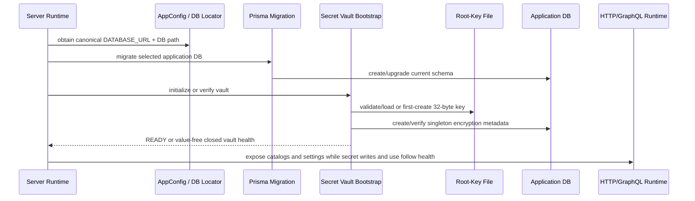

# Encrypted Secret Vault Contract — One Application Database

## Status

`Requirements-ready — user-approved for architecture review. The one-database vault remains approved, and this revision adds the internal create-only batch/compensation contract required by fixed-path custom-provider-v1 migration. Implementation remains unauthorized until a passing architecture gate.`

## Purpose

Define the smallest durable contract needed to store provider/integration credentials securely inside the same SQLite application database selected by `DATABASE_URL`, while keeping the decrypting root key outside that database.

This contract replaces the superseded separate Local Store database, Store configuration file, backend kind selector, access mode, Store target resolver, Store reset API, and default-versus-E2E Store model.

## Scope

The vault stores bounded opaque scalar secrets such as:

- API keys;
- access tokens;
- passwords;
- signing secrets.

It is not an arbitrary file/blob store, certificate manager, user account system, remote secret backend, or model configuration database.

Related requirements: `REQ-001`–`REQ-006`, `REQ-009`–`REQ-013`, `REQ-015`, `REQ-018`. The fixed historical transition is governed by [custom-provider-v1-migration-contract.md](./custom-provider-v1-migration-contract.md).

## Terminology

| Term | Meaning |
|---|---|
| Application database | The one SQLite file selected by canonical `DATABASE_URL` for a running environment. |
| `SecretId` | Stable logical credential-slot identity, e.g. `provider.openai.api-key`. It is not a model ID. |
| Root key | Random 32-byte key stored only in the database-adjacent sidecar file. |
| `encryption_domain_id` | Random non-secret 16-byte identifier stored once in the DB; binds the DB encryption domain and key derivation/AAD. |
| Secret entry | One encrypted value keyed by `secret_id`. |
| Trusted consumer boundary | The exact SDK/client constructor/request boundary where `SecretValue` may be revealed. |

## Physical Selection Contract

### One selector

A canonical SQLite database URL is the only physical database selector. Running applications obtain it from `DATABASE_URL`; the standalone importer requires the same URL shape explicitly as `--database-url`.

Examples after canonicalization:

```text
file:/Users/alice/.autobyteus/server-data/db/production.db
file:/repo/.local/e2e/autobyteus-e2e.db
```

A configured relative value such as:

```text
file:./db/test.db
```

is resolved once against `AppConfig.getAppRootDir()` and rewritten internally as an absolute canonical file URL before migrations, Prisma clients, vault bootstrap, tests, or diagnostics use it. It is never resolved against `process.cwd()`, the caller file, the `.env` file location, or the server-data directory by a downstream consumer. Production/Electron may still supply an absolute URL to locate the database anywhere appropriate. The importer deliberately rejects relative values and accepts only an explicit absolute file URL, so it has no hidden base directory. Both entrypoints use `ApplicationDatabaseLocation`; no consumer independently resolves either string.

### Derived key path

For canonical database path:

```text
/absolute/path/application.db
```

the root-key path is exactly:

```text
/absolute/path/application.db.secret.key
```

There is no `SECRET_STORE_DATABASE_URL`, `SECRET_STORE_KEY_PATH`, Store JSON, Store target name, or access-mode variable.

### File ownership

- database, key, WAL/journal, and test runtime files are never committed;
- the root key is created with owner-only mode (`0600`) where supported;
- an AutoByteus-created containing directory is private (`0700`) where supported;
- symlink/non-regular/wrong-owner/unsafe-permission key paths fail closed;
- Docker/Pod deployments persist the DB and derived key in the same existing server-data volume;
- backup/restore treats DB + key as one inseparable pair.

## Database Schema Contract

### Prisma model shape

```prisma
model SecretEntry {
  secretId           String @id @map("secret_id")
  nonce              Bytes
  ciphertext         Bytes
  authenticationTag Bytes  @map("authentication_tag")

  @@map("secret_entries")
}

model SecretEncryptionMetadata {
  singletonId              Int   @id @map("singleton_id")
  encryptionDomainId       Bytes @unique @map("encryption_domain_id")
  encryptionFormatVersion  Int   @map("encryption_format_version")
  verifierNonce            Bytes @map("verifier_nonce")
  verifierCiphertext       Bytes @map("verifier_ciphertext")
  verifierAuthenticationTag Bytes @map("verifier_authentication_tag")

  @@map("secret_encryption_metadata")
}
```

The migration adds database constraints equivalent to:

```sql
CHECK (singleton_id = 1)
CHECK (length(encryption_domain_id) = 16)
CHECK (encryption_format_version > 0)
CHECK (length(nonce) = 12)
CHECK (length(authentication_tag) = 16)
CHECK (length(verifier_nonce) = 12)
CHECK (length(verifier_authentication_tag) = 16)
```

### Why two tables

`secret_entries` is repeated credential data. `secret_encryption_metadata` is singleton encryption-domain/key-pair state. Keeping them separate provides clear ownership and constraints without creating a second database. Combining singleton and repeated rows would mix different identities and invariants.

### Deliberately absent columns

The target does not store:

- provider/model display metadata;
- environment alias names;
- plaintext or hashes of plaintext;
- credential validity/provider-response state;
- Store/backend/access-mode identity;
- model IDs;
- user-facing descriptions;
- created-by principal;
- raw provider errors.

Provider/slot mapping belongs to the credential catalog/adapter. Provider validation state belongs to its provider service. The encrypted table is a vault, not a configuration registry.

The provider-centric API-key Settings read asks the vault only whether an exact provider credential slot is configured. `LlmProviderService` maps that value-free result to the established `LlmProviderObject.apiKeyConfigured` Boolean exactly once per provider and groups existing model lists separately. For ordinary key-backed providers, `true` means the exact vault slot is confirmed `CONFIGURED`; otherwise it is `false`. Gemini preserves its established aggregate provider meaning: true when AI Studio or Vertex Express is configured, or when Vertex Project has complete non-secret project/location configuration. That aggregate never selects the active Gemini mode. It must not expose vault health, storage state, instruction codes, secret IDs, or values. Ordinary provider Save/Remove returns Boolean command completion and the web refetches `providerSettings`; custom and Gemini transport-specific shapes remain owned by their provider/configuration services and do not expose vault internals. Catalog membership never depends on this configured fact. This grouping does not change vault persistence or authorization ownership.

## Secret Identity Contract

Examples:

| Provider / purpose | `secret_id` |
|---|---|
| OpenAI shared LLM/audio/image | `provider.openai.api-key` |
| Anthropic native LLM + managed Claude runtime | `provider.anthropic.api-key` |
| Google AI Studio | `provider.google.ai-studio.api-key` |
| Google Vertex Express | `provider.google.vertex-express.api-key` |
| AutoByteus remote LLM/audio/image | `provider.autobyteus.api-key` |
| Qwen/DashScope | `provider.qwen.api-key` |
| Serper search | `search.serper.api-key` |
| Future GitHub integration | `integration.github.access-token` |

Rules:

1. identity describes provider/integration credential ownership, never a model;
2. one shared provider key has one row regardless of how many capabilities/models use it;
3. separate legitimate credential options have separate IDs;
4. IDs are lowercase dot-delimited stable identifiers;
5. `SecretDefinitionId` is renamed to `SecretId`;
6. old `provider.gemini.ai-studio-api-key` is removed, not aliased;
7. custom providers receive a deterministic sanitized ID owned by the custom-provider mapping contract;
8. importer aliases are input-only mapping names, never runtime fallback names.

## Root-Key And Encryption-Domain Lifecycle

### Startup order



### First initialization

Under one process-local/bootstrap filesystem lock for the canonical DB/key pair:

1. verify the selected DB path and derived key path are regular/non-symlink and ownership/permissions are acceptable;
2. query only metadata existence and secret-entry count;
3. when metadata is absent and entry count is zero:
   - if the final key file is absent, create exactly 32 random bytes with exclusive creation and owner-only permissions, fsync, and close;
   - if a valid 32-byte owner-only key file already exists, treat it only as recovery from an interrupted empty-domain first initialization;
   - generate a random 16-byte `encryption_domain_id`;
   - create a verifier payload using the root key/domain/version;
   - insert exactly the singleton metadata row transactionally;
4. immediately verify the committed metadata with the key;
5. report `READY` without exposing key/domain/verifier bytes.

The key-only recovery rule is permitted only when metadata is absent and the secret-entry count is zero. It cannot recover or replace an established encrypted domain.

### Established startup

When metadata exists:

1. key file must exist and pass identity/permission/length checks;
2. metadata row must be exactly one supported row;
3. verifier decryption and fixed-time comparison must succeed;
4. no key or metadata field is rewritten merely because startup succeeds.

### Closed states

| Observed state | Outcome |
|---|---|
| No metadata, zero entries, no key | First initialization |
| No metadata, zero entries, valid key | Complete interrupted first initialization |
| No metadata, any entries | `CORRUPT` |
| Metadata exists, key absent | `LOCKED` |
| Metadata exists, wrong key/verifier failure | `CORRUPT` |
| Invalid key type/owner/permissions/length | `LOCKED` or `CORRUPT` by stable classifier |
| Unsupported encryption format | `INCOMPATIBLE` |
| DB unavailable | Application database startup failure or `UNAVAILABLE` at an established runtime boundary |
| Duplicate/malformed metadata | `CORRUPT` |

No closed state falls back to environment aliases or regenerates the key.

## Cryptographic Contract

### Constants

- root key: 32 bytes;
- domain ID: 16 bytes;
- cipher: AES-256-GCM;
- nonce: independent random 12 bytes per encryption;
- tag: 16 bytes;
- KDF: HKDF-SHA-256;
- format version: positive integer, initial value `1`.

### Verifier

```text
verifierKey = HKDF-SHA-256(
  ikm  = rootKey,
  salt = encryptionDomainId,
  info = "autobyteus/secret-vault/verifier/v1",
  len  = 32
)

verifierAAD = encode(
  "autobyteus/secret-vault/verifier-aad/v1",
  encryptionFormatVersion,
  encryptionDomainId
)

verifierPlaintext = "autobyteus-secret-vault-verifier-v1"
```

The verifier proves that the external key matches this database encryption domain. It does not validate any provider credential.

### Per-entry encryption

```text
entryKey = HKDF-SHA-256(
  ikm  = rootKey,
  salt = encryptionDomainId,
  info = encode("autobyteus/secret-vault/entry/v1", secretId),
  len  = 32
)

entryAAD = encode(
  "autobyteus/secret-vault/entry-aad/v1",
  encryptionFormatVersion,
  encryptionDomainId,
  secretId
)

(nonce, ciphertext, authenticationTag) = AES-256-GCM.encrypt(
  key = entryKey,
  nonce = randomBytes(12),
  plaintext = secretBytes,
  aad = entryAAD
)
```

Consequences:

- ciphertext cannot be moved to another secret ID without authentication failure;
- ciphertext cannot be moved to another database domain without authentication failure;
- every replacement produces a fresh nonce/tag;
- root key is not used directly as the AES entry key;
- derived keys and temporary byte buffers are minimized and best-effort cleared;
- no claim is made that JavaScript can erase every runtime/string copy.

## Service And Repository Contract

### Authoritative service

```ts
interface SecretManagementService {
  getHealth(): Promise<SecretVaultHealth>;
  getStatusForConsumer(consumer: SecretConsumerIdentity): Promise<'MISSING' | 'CONFIGURED'>;
  saveForConsumer(consumer: SecretConsumerIdentity, input: SecretInput): Promise<void>;
  removeForConsumer(consumer: SecretConsumerIdentity): Promise<void>;
  saveBatch(entries: ReadonlyArray<{secretId: SecretId; input: SecretInput}>, overwrite: boolean): Promise<ImportBatchResult>;
  createMissingBatchForCustomProviderMigration(entries: ReadonlyArray<{secretId: SecretId; input: SecretInput}>): Promise<CustomProviderMigrationBatchReceipt>;
  compensateUnpublishedCustomProviderBatch(receipt: CustomProviderMigrationBatchReceipt): Promise<void>;
  resolveForUse(consumer: SecretConsumerIdentity): Promise<SecretValue>;
}
```

Rules:

- `saveForConsumer` is atomic create-or-replace after authorization;
- `removeForConsumer` is idempotent;
- `getStatusForConsumer` never decrypts and never validates with the provider;
- `saveBatch` accepts only the exact importer-registry plan and performs one transaction;
- `createMissingBatchForCustomProviderMigration` is internal to the fixed custom-provider migration: it requires every target ID to be `MISSING`, encrypts/inserts every entry in one transaction, has no overwrite/use/compare mode, and returns an opaque memory-only receipt identifying the exact inserted encrypted rows;
- `compensateUnpublishedCustomProviderBatch` accepts only that same-process receipt and conditionally deletes only rows that remain byte-identical to the migration-created records; a missing/changed/pre-existing row is never deleted;
- neither migration method is exported through GraphQL, the core resolver, the importer registry, or a generic public secret API;
- `resolveForUse` first authorizes consumer -> `SecretId`, then decrypts;
- a generic API/GraphQL read-secret endpoint does not exist;
- only the trusted in-process server-adapter/provider-client path receives `SecretValue`;
- errors use stable value-free codes and omit raw database/crypto/provider causes from user output.

### Prisma repository

One secret-owned repository uses the configured application Prisma client contract for:

- metadata row read/create;
- entry existence;
- entry insert/upsert/delete;
- atomic record batches for importer writes;
- create-only migration batches and exact conditional same-process compensation under one transaction boundary.

It does not own provider mapping, UI, runtime selection, importer parsing, root-key file policy, or SDK construction.

A small in-memory repository may exist only as an injected deterministic test double. It is not a runtime-selectable backend kind and has no operator configuration.

### Authoritative non-mutating import inspection service

Importer preview does not instantiate the normal bootstrapped runtime and does not call the Prisma migration runner. It uses one internal secret-management-owned service:

```ts
type ImportTargetState =
  | 'INITIALIZATION_REQUIRED'
  | 'READY'
  | 'LOCKED'
  | 'CORRUPT'
  | 'INCOMPATIBLE'
  | 'UNAVAILABLE';

type ImportObservedStatus = 'MISSING' | 'CONFIGURED' | 'UNAVAILABLE';
type ImportPlannedAction = 'CREATE' | 'SKIP_CONFIGURED' | 'REPLACE' | 'BLOCKED';

type ImportTargetInspection = {
  targetIdentity: string; // canonical value-free DB path or stable fingerprint
  targetState: ImportTargetState;
  entries: ReadonlyArray<{
    secretId: SecretId;
    observedStatus: ImportObservedStatus;
    plannedAction: ImportPlannedAction;
  }>;
  counts: {
    create: number;
    skipConfigured: number;
    replace: number;
    blocked: number;
  };
};

interface SecretVaultInspectionService {
  inspectImportTarget(
    secretIds: ReadonlyArray<SecretId>,
    overwrite: boolean,
  ): Promise<ImportTargetInspection>;
}
```

This is not a Store access mode or alternate backend. The service is available only to the import service and has no create, migrate, bootstrap, save, remove, resolve, repair, or permission-change method.

Its exact lifecycle is:

| Existing target state | Allowed reads | Result |
|---|---|---|
| DB absent and key absent | Non-following filesystem existence/security checks only | `INITIALIZATION_REQUIRED`; every ID is `MISSING/CREATE` |
| Existing application DB predates the secret tables, or has both complete migrated secret tables with zero metadata/entries; key absent or one valid secure 32-byte interrupted-initialization key present | SQLite read-only/query-only schema/zero-row inspection plus key safety/length check when present | `INITIALIZATION_REQUIRED`; every ID is `MISSING/CREATE` |
| Complete current tables/metadata plus secure key and valid verifier | Read-only schema/metadata/entry queries; secure key read only for verifier; no entry decrypt | `READY`; each ID is `MISSING/CREATE`, `CONFIGURED/SKIP_CONFIGURED`, or `CONFIGURED/REPLACE` |
| Metadata without key, entries without metadata, incomplete current schema, unsafe/symlink/invalid key, verifier mismatch, unsupported version, or read failure | Only the reads required to classify the failure; no repair/fallback | Exact closed target state; every ID is `UNAVAILABLE/BLOCKED` |

An existing DB is opened with read-only/query-only SQLite semantics. A nonexistent DB is never opened. Inspection never creates a DB, WAL/journal, table, row, key, setting, directory, or permission change. Existing key bytes used for verifier confirmation remain internal and are cleared best-effort.

`LocalEnvironmentSecretImportService.preview()` is the sole public caller. It returns the inspection result plus source-derived ordered IDs and no values. A closed result exits nonzero and never reaches confirmation.

The execution path is intentionally different: it rechecks target health, may run normal migration/bootstrap, then re-queries entry existence inside the write transaction. Conditional create/skip enforces no-overwrite under races; replacement occurs only with explicit overwrite. Actual transaction counts, not preview counts, are authoritative.

## Custom-Provider Migration Batch Contract

The vault does not parse historical custom-provider data. It accepts only an already validated complete mapping from the migration owner:

```text
provider ID -> deterministic current custom-provider SecretId -> transient SecretInput
```

The batch boundary enforces:

1. all IDs are unique and authorized as custom-provider IDs;
2. every ID is `MISSING` at transaction time;
3. all records are encrypted and inserted atomically;
4. any collision or write error rolls back every insertion;
5. no read/compare/replace/delete of an existing credential is permitted;
6. the receipt exists only in memory until the staged v2 file publishes;
7. same-process publication failure may compensate only exact unchanged batch rows;
8. power loss after DB commit is not guessed/cleaned on restart: configured IDs collide, the legacy v1 file is deleted, and user reconfiguration uses new provider IDs.

This narrow API solves one cross-resource migration. It is not a generic transaction coordinator, runtime compatibility layer, or automatic `.env` migration mechanism.

## Provider Resolver Contract

Core port:

```ts
interface ProviderApiKeyResolver {
  resolve(providerId: string, slot?: ProviderApiKeySlot): Promise<SecretValue>;
}
```

Server adapter:

```text
(providerId, optional slot, authorized subject)
  -> credential mapping
  -> SecretConsumerIdentity / SecretId
  -> SecretManagementService.resolveForUse(...)
```

Provider client:

```text
factory(model, effective config, resolver)
  -> concrete provider object
  -> lazy SDK initialization
  -> resolver.resolve(provider, optional slot)
  -> SecretValue.revealToTrustedConsumer()
  -> exact SDK constructor
```

Forbidden:

- model authentication fields;
- model -> secret ID mapping;
- provider client importing server secret management/Prisma/filesystem;
- global service locator;
- environment fallback;
- alternate secret retry;
- decrypted value in config/model/GraphQL/log/artifact state.

## Gemini Contract

`GEMINI_SETUP_MODE` is a normal non-secret application setting with exactly these values:

```text
AI_STUDIO | VERTEX_EXPRESS | VERTEX_PROJECT
```

It is the sole runtime authority. Settings saves configure one option but do not implicitly activate it. The concise UI exposes a separate `Use this mode` action and may expose an explicit first-time compound `Save and use this mode` action. Saving never clears another option. `GeminiConfigurationService` owns each compound command: save-and-activate saves first and activates second; active removal clears mode first and removes second. The query and every command return the same actual setup state, so cross-owner partial completion is visible without claiming atomicity or adding staged-outcome/instruction fields. An absent, invalid, or incomplete selected mode is a visible closed state; no priority or alternate-mode fallback runs.

Core Gemini clients receive a second narrow, non-secret function dependency:

```ts
type GeminiRuntimeResolver = () => Promise<GeminiRuntimeSelection>;
```

Ordinary providers retain `factory(model, effectiveConfig, apiKeyResolver)`. Gemini alone receives the optional fourth resolver, which is required for a Gemini model and rejected for non-Gemini models. The function returns the exact mode union and no secret, status, or model data.

After explicit selection:

```text
VERTEX_EXPRESS -> resolve Google/vertexExpress -> GoogleGenAI({vertexai:true, apiKey})
VERTEX_PROJECT -> no secret resolve             -> GoogleGenAI({vertexai:true, project, location})
AI_STUDIO      -> resolve Google/aiStudio       -> GoogleGenAI({apiKey})
```

Catalogs remain independent. Metadata follows the active mode without changing it:

- AI Studio: optional live Developer API enrichment, `LIVE` or `CURATED_FALLBACK`;
- Vertex Express/Project: `CURATED_ONLY` under the current official contract;
- no active mode: `CURATED_ONLY`.

The normative surface and interaction details are in [gemini-setup-ui-ux-spec.md](./gemini-setup-ui-ux-spec.md).

## Importer Contract Under One Database

The committed importer:

1. receives an explicit absolute source assignment-file path;
2. requires exactly one explicit `--database-url <absolute-sqlite-file-url>`;
3. treats that argument as its sole target authority and canonicalizes it through `ApplicationDatabaseLocation.fromAbsoluteFileUrl()`; it never initializes AppConfig or reads target selection from `.env`, `.env.test`, parent `process.env`, the assignment source, or the current working directory;
4. displays only the canonical target DB path or a value-free fingerprint, target state, recognized `secret_id` values, observed statuses, planned actions, and counts;
5. dry-runs only through `SecretVaultInspectionService`, without creating/opening-for-write/migrating the DB or creating/modifying the root key, metadata, settings, or permissions;
6. requires a direct TTY and exact `IMPORT` confirmation after showing the value-free canonical target identity and plan;
7. on execution, revalidates the confirmed canonical target, rechecks lifecycle and entry existence, runs normal migration/bootstrap only if required, and writes one atomic batch through `SecretManagementService`/repository;
8. never modifies/deletes the source;
9. never reads another database or environment credential source;
10. accepts no key-path, Store target, backend, profile, access-mode, or special test-target argument; the adjacent root-key path remains derived from the explicit DB location.

Canonical shape:

```bash
pnpm secrets:import -- \
  --source /absolute/path/to/assignments \
  --database-url file:/absolute/path/to/application.db \
  --dry-run
```

The database URL must be an absolute supported SQLite `file:` URL. Missing, duplicate, relative, malformed, or non-SQLite URLs fail before target access. Because only local SQLite file URLs are supported, the argument is target configuration rather than a credential-bearing network connection string.

Recognize-first rules remain:

- parse only exact current supported aliases;
- normalized-empty recognized values are absent;
- unrecognized/legacy assignments are irrelevant and non-blocking;
- `DASHSCOPE_API_KEY` is the sole Qwen alias;
- `QWEN_API_KEY` and `ZHIPU_API_KEY` remain unmapped;
- populated selected values receive strict syntax/duplicate/conflict validation;
- default is skip configured entries; replacement requires explicit overwrite.

Preview action meanings:

- `CREATE`: observed missing or initialization-required;
- `SKIP_CONFIGURED`: observed configured and overwrite was not requested;
- `REPLACE`: observed configured and overwrite was explicitly requested;
- `BLOCKED`: target is closed, so execution is not offered.

These are planned observations. Execution repeats the status decision in its write transaction, guarantees no replacement without explicit overwrite, and reports actual counts.

## Test Configuration Contract

The conventional tracked server test environment is exactly:

```text
autobyteus-server-ts/.env.test
```

It contains only fixed non-secret launch values:

```dotenv
APP_ENV=test
DB_TYPE=sqlite
DATABASE_URL=file:./db/test.db
AUTOBYTEUS_SERVER_HOST=http://127.0.0.1:8000
```

It must not contain:

- credential values;
- root-key bytes/path override;
- Store database/access mode;
- mutable Gemini mode/project/location settings;
- provider/model scenario plans;
- required-secret lists;
- expected capability declarations.

The tracked file is immutable backend-test input, not an actual-server configuration file. One test-only bootstrap validates it, resolves its relative DB URL against the server root, and materializes/reconciles only its fixed launch keys into an ignored app-data root's ordinary writable `.env`. The unchanged actual built server then reads only that runtime `.env` through its normal `--data-dir` contract. Persistent test roots preserve unrelated mutable Settings keys; deterministic backend E2E uses fresh roots. The normal frontend and real-provider E2E runner use the selected application DB and derived key through the normal server/API lifecycle. The standalone importer does not read `.env.test`; an operator reaches the same DB only by passing its canonical absolute SQLite URL explicitly. Mutable Gemini settings are configured through the normal Settings/API surface and persist only in the ignored runtime `.env`. The tracked file is admitted through an explicit `.gitignore` exception; runtime `.env`, DB/key/WAL/journal/log artifacts remain ignored. No additional committed live-E2E env/config file, special test-import command, or harness-only Store exists. Scenario definitions belong in test code/internal fixtures. Direct, Electron, Docker/Pod, and packaged-server processes never read `.env.test`.

## Deployment Contract

### Desktop/direct server

- canonical production `DATABASE_URL` selects the application DB;
- first initialization creates the adjacent key;
- Settings/API and invocation share the same vault service;
- ordinary app-data reset/delete must explicitly state whether it deletes both DB and key; it must never leave one while pretending the pair is usable.

### Docker/single Pod

- existing topology remains;
- selected application DB and derived key live in the same persisted server-data volume;
- no new Store service, Store mount, or secret-specific replica mode;
- root key is not baked into image or committed;
- multi-replica shared-SQLite support is not introduced.

### Backup/restore

- backup: capture DB and key as a coordinated pair while writes are quiesced/consistent;
- restore: restore both to matching canonical location/permissions;
- DB-only or key-only restore fails closed;
- no automatic new key is generated for an established DB.

## Clean-Cut Removal Contract

Implementation must remove, not wrap:

- second secret DB and its schema owner;
- Store config file/backend kind/access mode;
- default/E2E Store target resolver;
- Store-specific reset/provisioning service surfaces that duplicate application DB lifecycle;
- separate Store health/path capability DTOs exposed as product configuration;
- live-E2E JSON scenario manifest;
- model authentication requirements/credential-provider IDs;
- LLM/media construction targets/contexts/resolved-auth unions;
- implicit Gemini priority/fallback and any model-level mode selector;
- old Google AI Studio secret ID;
- environment credential fallback;
- runtime custom-provider-v1 parser/error branch and any backup/recovery-file machinery;
- compatibility re-exports for removed files/types.

## Approval

`The one-database vault and custom-provider migration batch/compensation extension are user-approved for architecture review.`

Architecture review is authorized. No implementation is authorized until a passing gate.
