# Secret Storage Architecture

## Artifact Metadata

- Canonical path: `/Users/normy/autobyteus_org/autobyteus-worktrees/secure-centralized-secret-provisioning/tickets/in-progress/secure-centralized-secret-provisioning/secret-storage-architecture.md`
- Purpose: provide the reviewable target architecture and data-flow spines for the in-process Local backend, authenticated Store/key pairing, separate host Stores, untouched/non-authoritative legacy sources, explicit environment-secret import, unchanged Docker persistence, exact LLM/media construction, preserved dual-key Gemini live metadata, external Codex preservation, host E2E, Claude modes, and future extension boundary.
- Scope: intended behavior and architecture for REQ-001 through REQ-021 and AC-001 through AC-021.
- Status: `Original Gemini Metadata Preservation Reconciliation; Architecture Re-review Required`.
- Approval applicability: required; the existing importer/no-automatic-update/`repository_prisma@1.0.8`/Codex/Claude decisions remain approved. Corrected CR-021 records the user-confirmed original dual-key metadata behavior and authorizes no source redesign.
- Core artifacts supported: [requirements.md](./requirements.md), [investigation-notes.md](./investigation-notes.md), [design-spec.md](./design-spec.md).
- Related supplements: [use-case-spine-validation.md](./use-case-spine-validation.md), [secret-storage-backend-contract.md](./secret-storage-backend-contract.md), [credential-consumer-mapping.md](./credential-consumer-mapping.md), [live-test-secret-provisioning.md](./live-test-secret-provisioning.md), [threat-model-and-option-analysis.md](./threat-model-and-option-analysis.md).

## Architectural Decisions Represented

1. `SecretManagementService` is above and uses `SecretStorageBackend`.
2. Backend selection/configuration is separate from provider-credential lifecycle.
3. No AutoByteus user, role, administrator principal, or administration guard is introduced.
4. `LocalSecretStorageBackend` runs inside Agent Server; there is no Local Store daemon, IPC protocol, or Electron-owned custody.
5. Host normal credentials and host real-E2E credentials use physically separate SQLite databases and independent key files; each normal server deployment owns its own default Store below its configured data directory.
6. The repository tracks Store/scenario configuration only; actual values, encrypted databases, and encryption keys stay outside worktrees. Runtime requests cannot select a path or another Store.
7. The real-E2E Store never reads, copies, inherits, or falls back to the default Store. Hidden-input setup accepts dedicated test credentials directly and is constructed with only the E2E target.
8. First delivery registers Local in product bootstrap and InMemory/test fixtures in tests. No concrete Vault/AWS/Kubernetes/company adapter ships; the typed lifecycle/registration seam remains a future extension point and unknown kinds fail closed.
9. Raw credentials do not enter `LLMConfig`; `LLMFactory` creates an ephemeral `LLMConstructionContext` from effective config plus resolved authentication. Exact AI Studio, Vertex Express, and Vertex Project variants remain in the LLM/media construction contract. Metadata deliberately keeps its separate selected-key Generative Language request contract.
10. Storage relocation is paired with built-in file-tool denial, empty-base child environments/descriptors for governed launchers, and honest `LOCAL_HARDENED` assurance. Codex App Server preserves its pre-ticket external `codex login` environment/home and is explicitly excluded from that child-environment claim. Strong same-user/process isolation is deferred.
11. Normal custody is under `${serverDataDir}/secret-store/`: Electron resolves to `~/.autobyteus/server-data/secret-store/`, and normal Docker resolves inside its existing `/home/autobyteus/data` volume. The separate host real-E2E pair remains under the host AutoByteus server-data secret-store directory. Each database contains only Store metadata and exact encrypted records. Existing Docker Compose/launcher configuration is unchanged.
12. Complete per-use-case primary/return/bounded spines are defined in [use-case-spine-validation.md](./use-case-spine-validation.md); generic product scope/address/version attributes found unsupported by those spines are absent.
13. Local backend initialization authenticates a database/key pair verifier before `READY`, even for an empty Store. Wrong/swapped keys, partial pairs, or verifier failures are `CORRUPT`; unsupported formats are `INCOMPATIBLE`; neither is repaired silently.
14. A local Docker container or single Kubernetes server Pod is one independent Local Store node with its own persistent-volume domain. Multiple server replicas cannot share one Local SQLite Store and require a future installed centralized adapter.
15. Claude Agent SDK supports exactly default external `cli` and explicit `managed-secret`. Managed mode is one precise catalog consumer of the existing Anthropic definition, resolved just in time and delivered only through the exact Claude Code child environment. Legacy `auto`/ambient `api-key` modes and fallback are removed.
16. Existing AutoByteus remote LLM/audio/image discovery and construction remain supported. One `AutobyteusRemoteModelDiscoveryService` resolves `provider.autobyteus.api-key` just in time, while non-secret hosts stay endpoint configuration.
17. AutoByteus-discovered targets carry non-secret `credentialProviderId = AUTOBYTEUS`; displayed provider/model semantics remain independent. Successful catalog replacement is scoped by model kind plus AutoByteus runtime ownership, so native same-provider models remain.
18. One explicit local product/operator CLI accepts zero/one leading PNPM separator, a required absolute source with any filename/extension, and required `default|e2e` target. Those roles select only the canonical host default or host real-E2E pair; they do not select custom-data-directory, Docker, Kubernetes, remote, or enterprise custody. A recognize-first source boundary verifies file safety, selects only exact current aliases through one positive registry, parses valid recognized assignments, treats normalized-empty values as absent/non-selected, validates only populated selected values, maps Qwen only from `DASHSCOPE_API_KEY`, and ignores every unrecognized line without right-hand-side interpretation or ignored-line metadata. Empty placeholders likewise produce no plan/output metadata, warning, or failure. `QWEN_API_KEY` and legacy ZHIPU remain unmapped. The import owner previews value-free, requires target-specific direct-TTY confirmation, and commits one selected Local Store atomically. It is not reachable from runtime, UI/API, tests, Electron startup, or Docker startup.
19. Existing legacy sources remain operator-owned and untouched. Startup performs no credential import, copy, scrub, delete, rewrite, parent-alias deletion, or custom-provider conversion. `AppConfig` projects only approved non-secret settings without retaining sensitive assignments; startup is read-only, and a later explicit supported non-secret Settings write targets only that non-secret entry without dropping or changing excluded credential lines; the current custom-provider store accepts v2 only and returns stable value-free guidance for untouched v1. Users provision through UI/Settings, hidden input, or the explicit importer. The general app-data migration runner remains unchanged.
20. Codex authentication remains Codex-owned. Restore/preserve only the pre-ticket `CodexAppServerClient` `options.env ?? process.env` path with real HOME/CODEX_HOME; add no Store consumer, account RPC, login UI, status/rotation owner, mode selector, synthetic home, or fallback.
21. LLM/media provisioning reads explicit `GEMINI_SETUP_MODE` and produces `geminiAiStudio`, `geminiVertexExpress`, or `geminiVertexProject`; `gemini-helper.ts` exhaustively creates `{apiKey}`, `{vertexai:true,apiKey}`, or `{vertexai:true,project,location}`. Metadata remains a different established branch: AI Studio/Vertex Express resolve only their exact metadata consumer and call the same Generative Language provider; Vertex Project performs zero metadata secret lookup and uses curated data. No branch reads ambient aliases or retries another definition.

## 1. System And Deployment Architecture

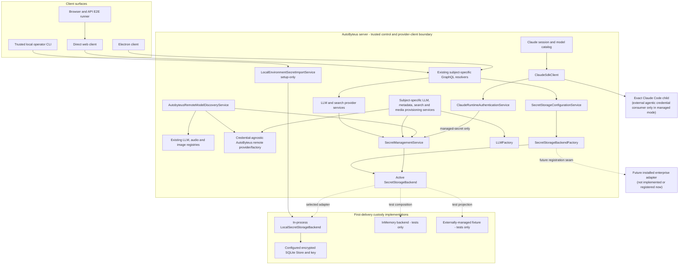

The frontend is a configuration/provisioning client of the selected AutoByteus server. It never connects directly to external custody or Local Store files. First delivery accepts Local product configuration only; the selected adapter and database handle live inside Agent Server. An unregistered enterprise kind returns `SECRET_BACKEND_KIND_NOT_INSTALLED` and never falls back.

The AutoByteus remote gateway is a normal server consumer, not another custody backend. It uses the same service-over-backend boundary as all other consumers. Its host list is non-secret endpoint configuration; its API key is one centrally managed definition.

## 2. Authoritative Dependency Direction

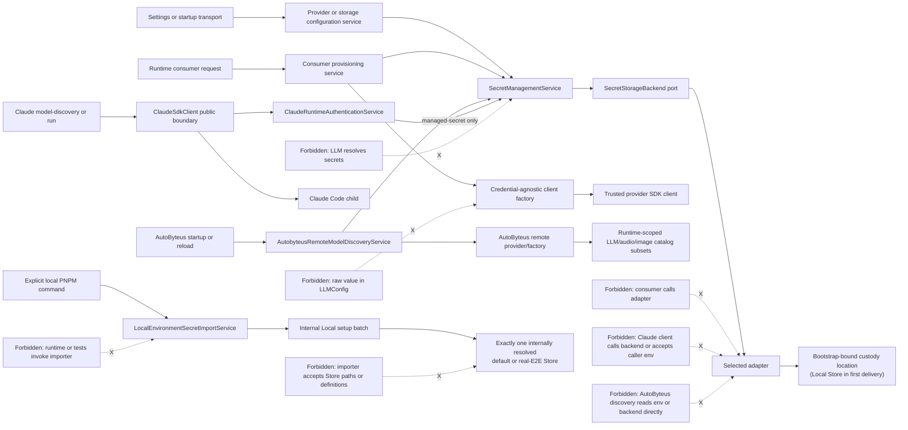

## 3. Backend Configuration Plane

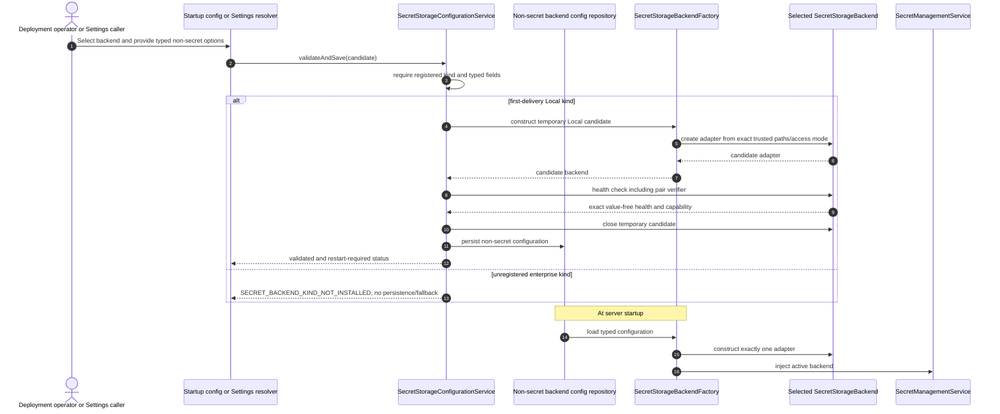

Backend bootstrap credentials are not frontend configuration. First delivery reads only the Local Store key file from server-owned state outside the checkout. Local database/key paths are non-secret startup configuration; key contents are not. A future adapter owns its own deployment identity when that adapter is actually implemented.

### 3A. Outward Health And Degraded Control Plane

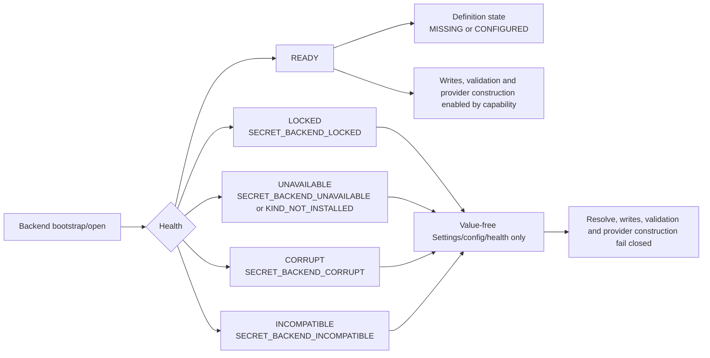

Definition status exists only for `READY`. `CORRUPT` and `INCOMPATIBLE` are first-class outward states, not hidden log details. The server does not create a substitute backend for an unknown kind and does not fall back to Local or environment values.

## 4. In-Process Local Backend And Separate Stores

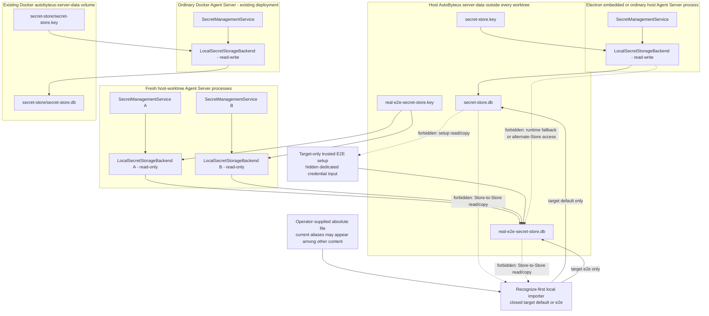

Each Agent Server constructs its Local backend directly and binds it to one database/key pair at startup. There is no Store process, connection, socket, protocol, or per-request Store selector. The ordinary Electron UI does not need a backend/Store control: its embedded server derives the default files from its data directory. Normal Docker derives the same relative files inside its existing persistent server-data volume, without Compose or launcher changes. Tracked host test/bootstrap configuration chooses the host E2E files before a worktree server starts; Docker is not part of that sharing flow.

Each database has the same minimal independent schema:

```text
store_metadata(
  singleton_id,
  schema_version,
  encryption_format_version,
  pair_verifier_format_version,
  store_id,
  pair_verifier_nonce,
  pair_verifier_ciphertext,
  pair_verifier_tag
)
secret_records(definition_id PRIMARY KEY, nonce, ciphertext)
```

There is no profile, product owner, parent, inheritance, value hash, timestamp, or caller-visible storage revision. `store_id` is a random public physical-pair binding, not a product/profile identity. Each Store has an independently generated root key. Hidden-input setup writes a dedicated test credential directly to the E2E target and has no source/default Store dependency. The explicit importer is a separate operator transition: it reads only the supplied plaintext file and opens exactly the selected target for status/write; it never uses either Store as a source.

## 5. Local Backend Initialization And Store Lifecycle

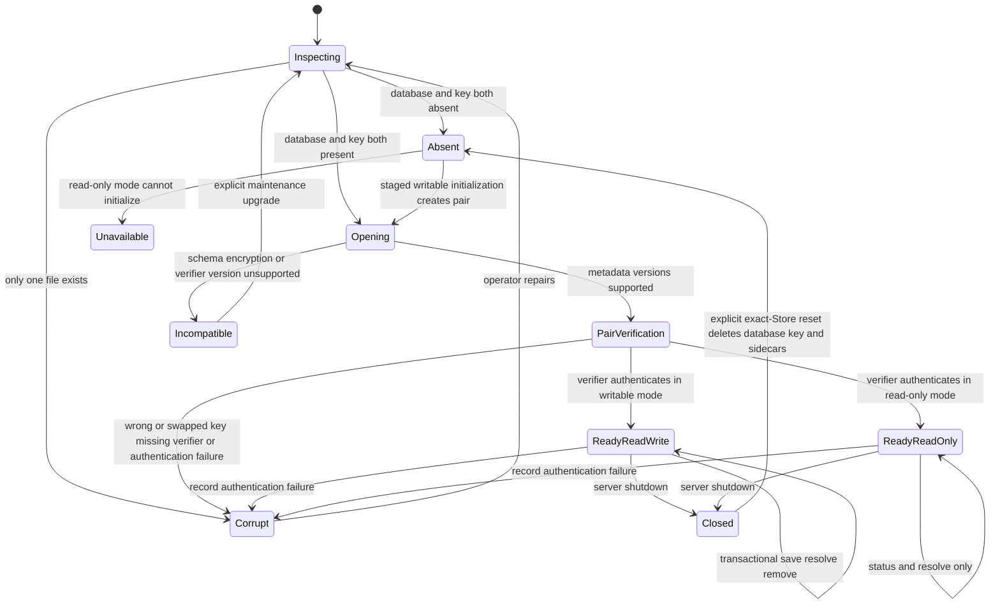

Every open authenticates the pair verifier before `READY`, including when `secret_records` is empty. The verifier and records use distinct HKDF key domains. Staged initial creation uses restrictive temporary files, fsync, and ordered renames; a partial crash result is `CORRUPT`, not silently completed. One-time setup/rotation may require a person because AutoByteus cannot create an upstream API key. Worktree creation and routine execution do not. An incompatible Store fails value-free and is never silently rewritten, downgraded, or replaced.

## 6. Provider Credential Provisioning Spine

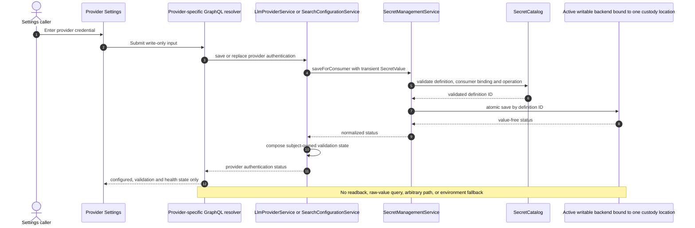

For an externally managed/read-only backend, Settings disables lifecycle writes and displays value-free status plus deployment-owned provisioning instructions.

## 7. LLM Runtime Construction Spine

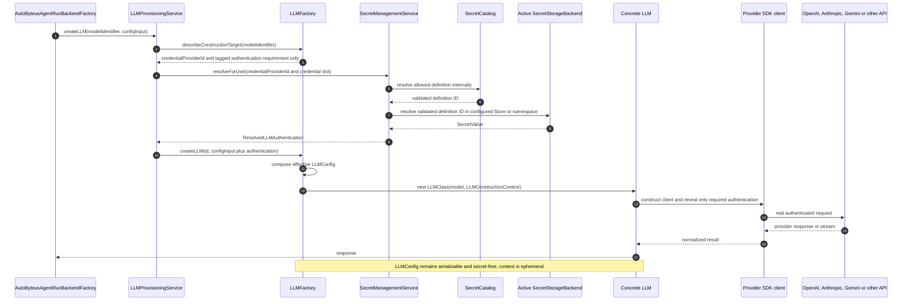

Proposed core shapes:

```ts
type ResolvedLLMAuthentication =
  | { kind: "none" }
  | { kind: "apiKey"; apiKey: SecretValue }
  | { kind: "geminiAiStudio"; apiKey: SecretValue }
  | { kind: "geminiVertexExpress"; apiKey: SecretValue }
  | { kind: "geminiVertexProject"; project: string; location: string };

// Multimedia reuses ResolvedLLMAuthentication.
// Metadata intentionally accepts only the one selected key at its existing request boundary.

type LLMFactoryCreationInput = {
  configInput?: LLMFactoryConfigInput;
  authentication: ResolvedLLMAuthentication;
};

type LLMConstructionTarget = {
  credentialProviderId: string;
  authenticationRequirement: LLMAuthenticationRequirement;
};

type LLMConstructionContext = {
  config: LLMConfig;
  authentication: ResolvedLLMAuthentication;
};
```

The construction target deliberately omits displayed/creator `providerId`. Native registration materializes the required `credentialProviderId` once from its known credential owner. AutoByteus-discovered models set it explicitly to `AUTOBYTEUS`, even if their displayed/provider semantics are OpenAI, Gemini, or another provider. Provisioning may read only this field for consumer construction; the credential slot stays inside the tagged authentication requirement. For Gemini LLM/media, `gemini-helper.ts` exhaustively maps AI Studio to `GoogleGenAI({apiKey})`, Vertex Express to `GoogleGenAI({vertexai:true,apiKey})`, and Vertex Project to `GoogleGenAI({vertexai:true,project,location})`. Metadata does not consume this construction target/union; its server owner selects the exact metadata consumer and passes one resolved key to the established Generative Language provider. No runtime fallback to displayed provider, ambient credential presence, or another definition exists, and no value, definition ID, backend, path, or host is embedded in a model target.

## 7A. Gemini Live Metadata Construction Spine

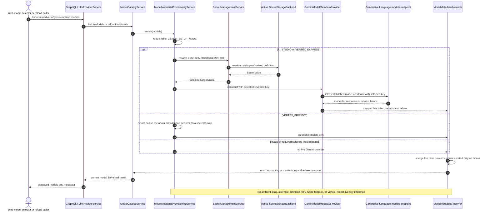

`ModelMetadataProvisioningService` remains the server owner for explicit mode/consumer selection, provider caching, and invalidation. `GeminiModelMetadataProvider` remains the storage-neutral core owner for the established dual-key Generative Language request and model-field mapping. `ModelMetadataResolver` preserves curated availability when the selected live provider is absent, fails, or times out. This spine intentionally remains distinct from LLM/media SDK construction and authorizes no metadata source rework.

## 7B. AutoByteus Remote Gateway Preservation

### Settings lifecycle and typed catalog refresh

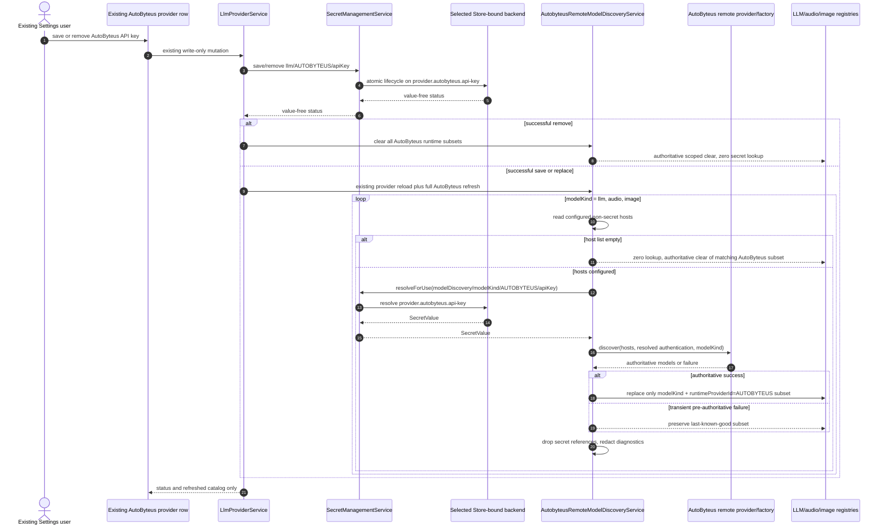

An authoritative empty success clears only the matching AutoByteus runtime subset. Explicit successful credential removal clears all AutoByteus runtime subsets without discovery lookup. Native models with the same displayed provider are outside that ownership and remain. Missing/non-ready custody and remote failures never consult `AUTOBYTEUS_API_KEY` or another backend.

### Discovered-model construction and use

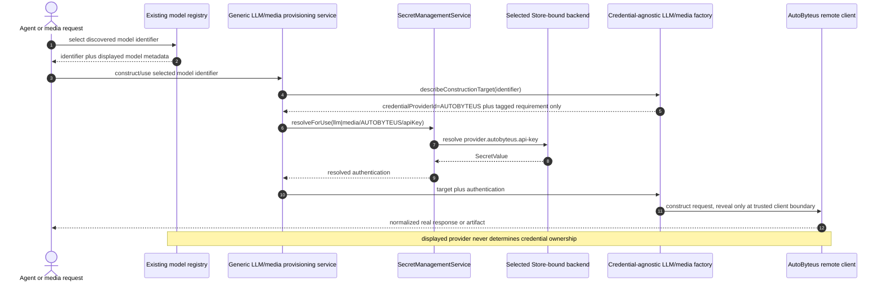

## 8. Zero-Touch Real E2E Spine

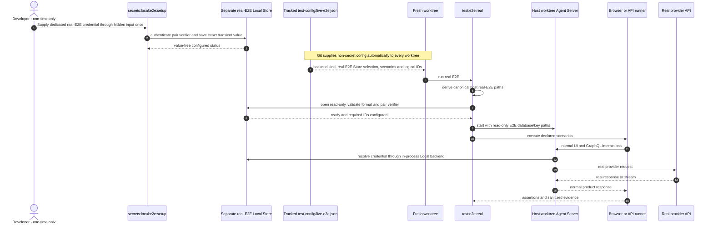

A first machine, missing provider, expired/revoked key, or unavailable Store is a legitimate one-time/repair dependency. A new host worktree is not. Hidden-input setup has no default-Store input, read, copy, or fallback. As an alternative one-time operator action, Section 8B may populate the selected E2E Store from one explicit trusted plaintext source; the test runner never invokes it. Host provider execution opens the shared E2E Store read-only; secret CRUD tests receive a separate disposable writable Store. Existing Docker deployments use their own persistent node-local Store and are not changed by this E2E flow.

## 8A. Legacy Sources Remain Untouched And Non-Authoritative

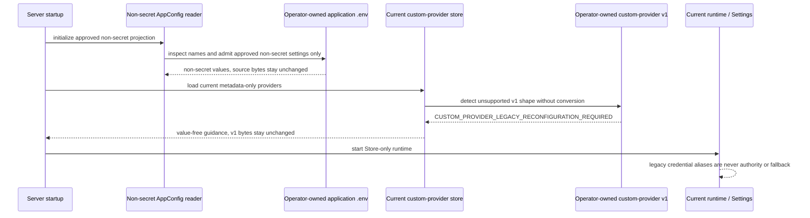

There is no automatic source mutation or Store transaction, no migration record/ledger, no parent-environment deletion, and no extension of the ordinary `AppDataMigrationRunner`. The accepted cost is explicit reconfiguration: users provision through UI/Settings, hidden input, or Section 8B, and perform any legacy cleanup themselves. Current runtime never retains, reads, or falls back to a legacy credential value.
## 8B. Explicit Local Environment-Secret Import Spine

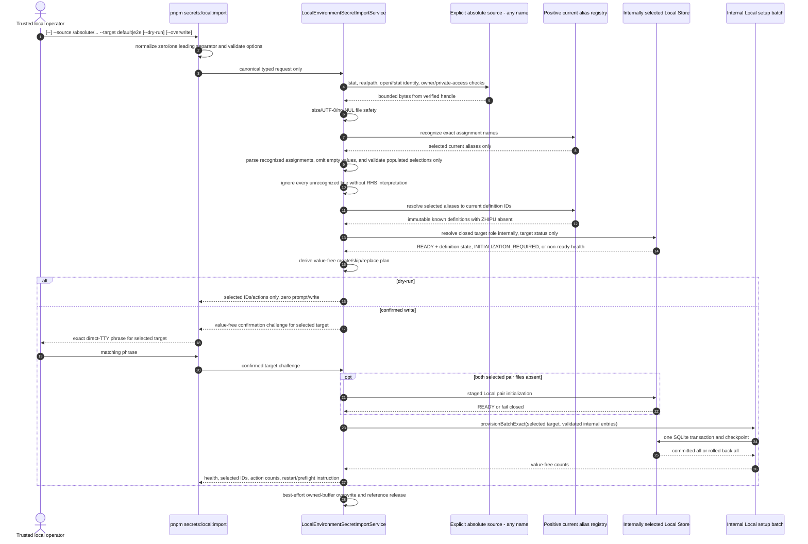

The PNPM entrypoint owns only optional-sentinel normalization, option translation, TTY, and output adaptation; it does not own recognition, mapping, Store paths, transaction, or redaction policy. The source basename/extension is deliberately not a security selector. After file identity/size/encoding safety, only exact current alias names activate static assignment parsing. A recognized assignment must be syntactically valid; after unquoting and outer-horizontal-whitespace normalization, empty values are absent/non-selected. Empty occurrences create no credential or duplicate state, plan/output metadata, warning, or failure; one populated occurrence selects normally, while two populated occurrences reject. Every unrecognized line—including unrelated settings, unknown secret-like names, malformed unrelated text, Claude delivery aliases, and legacy ZHIPU—is ignored without right-hand-side interpretation. Only `DASHSCOPE_API_KEY` maps to the current Qwen definition; `QWEN_API_KEY` and ZHIPU are ignored as unrecognized, and no compatibility mapping is added. Output contains no ignored-line or empty-placeholder metadata. The request contains no value, definition ID, target path, backend configuration, environment map, or removal selector. Target omission is failure; the two target roles resolve only the canonical host pairs, not a custom node/deployment Store. A source with no populated selected credential returns `IMPORT_NO_MAPPED_CREDENTIALS` before target access. Configured records skip unless `--overwrite`; all non-dry writes require `IMPORT DEFAULT STORE` or `IMPORT REAL-E2E STORE` on a direct TTY, with no `--yes` bypass. A both-absent selected pair is `INITIALIZATION_REQUIRED`: dry-run creates nothing, while confirmed execution invokes the existing staged initializer before the atomic record batch. A partial pair is `CORRUPT` and is never repaired silently. The source is never searched, inferred, mutated, deleted, or copied to a plaintext intermediate. Selected populated values necessarily exist transiently in trusted JavaScript/library memory; the design prohibits outward exposure and minimizes lifetime but does not claim deterministic zeroization.

## 9. Test Configuration Boundary

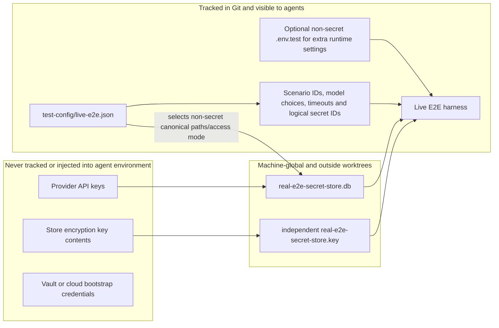

`.env.test` may be committed after credential fields are removed and an explicit ignore exception is added. Typed JSON remains the canonical host live-Store/scenario contract and must not be replaced by global dotenv credential loading. It does not configure Docker mounts or volumes.

## 10. Docker, Single-Pod Kubernetes, And Future Enterprise Boundary

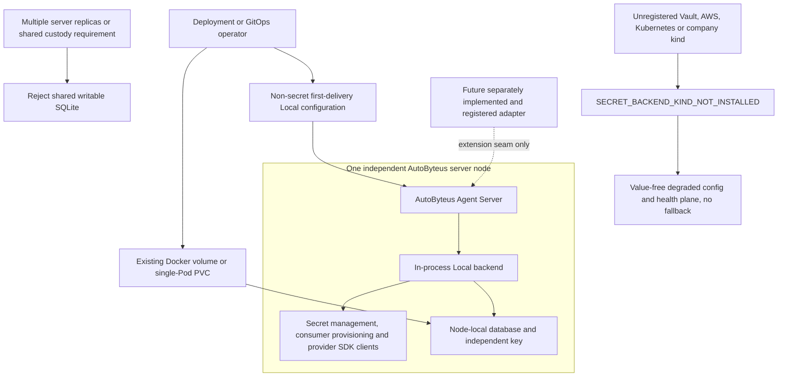

First delivery is container-friendly without inventing a production adapter: an unchanged Docker node uses its existing server-data volume, and one Kubernetes server Pod may use its own PVC. A writable Local SQLite Store is never shared across replicas. Multi-node centralized custody is unavailable until an operator installs a future adapter that implements the typed contract and owns its deployment identity. Vault/AWS/Kubernetes names here describe future extension categories, not delivered classes or configuration discriminants.

## 11. Backend Capability Model

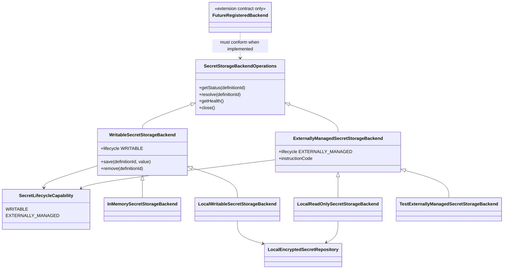

The configured instance reports one tagged lifecycle capability; the product never assumes a read-only Local Store is mutable through Settings. The test-only externally-managed fixture proves projection/conformance without pretending a production adapter exists. A future registered adapter must choose one capability and implement the same base health/status/resolve contract. Cross-Store copy does not exist in runtime, hidden-input setup, or the explicit source importer; the importer writes only its selected Local Store from the supplied plaintext source.

## 12. Agent Isolation Boundary

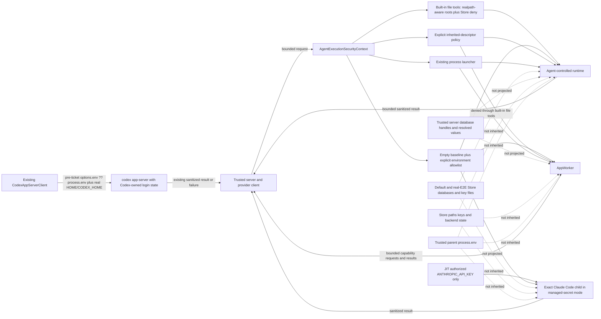

This diagram proves the first-delivery `LOCAL_HARDENED` boundary only. Built-in file tools cannot traverse, symlink, or directly address Store files, and all listed **governed** children receive empty-base environments/descriptors. The exact managed Claude child is the sole Store-resolved provider-key exception: it receives only its catalog-authorized Anthropic key, while its parent, siblings, other governed runtime children, and AutoByteus tool children do not. Managed-mode setting/tool controls remove supported process/environment-inspection descendants. Codex is deliberately drawn outside `AgentExecutionSecurityContext`: it preserves the pre-ticket external-login environment/home, performs no Store resolution or AutoByteus account lifecycle, and is outside the tier's child-environment claim. Because the server and an agent child may still run as the same OS user or in the same container—and Codex inherited state and the authorized Claude executable are observable by their respective runtimes—the design does **not** claim arbitrary native/shell/process secrecy. `STRONG_AGENT_ISOLATION` remains future work and is never reported by first-delivery code.

## 12A. External Codex Authentication Preservation

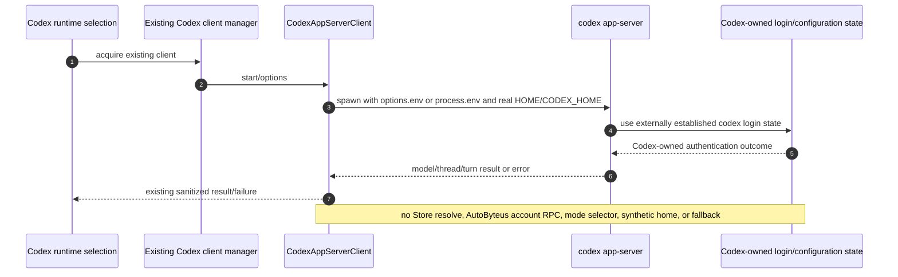

This is preservation, not a new authentication design. Remove the ticket-added `buildAgentChildEnvironment` use from `CodexAppServerClient` and retain one launch path. The operator environment inherited by Codex is outside `LOCAL_HARDENED`; no real Codex auth file is inspected or migrated by this ticket.

## 13. Claude Runtime Authentication Cutover

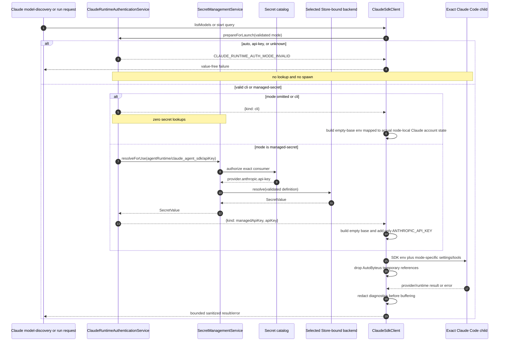

The exact Claude consumer and native `AnthropicLLM`/metadata consumers are independently authorized to the same stored definition. CLI mode never resolves it and maps the actual external node-local login state; it does not create or default to a new empty account directory. An explicit account-state override, if supported, must be an existing absolute path. Managed mode loads no user/project/local settings, hooks, plugins, API-key helper, or external MCP configuration; passes `tools: []`; uses strict explicitly materialized AutoByteus in-process MCP tools only; and does not accept caller `env`. Parent, siblings, unrelated children, and AutoByteus-owned tool children remain key-free. Stdio MCP launches compose a sanitized operational base plus the exact explicitly authorized server `config.env` map; they never spread the broad parent environment and never discard the explicit map. Missing/non-ready custody, invalid binding, spawn, or provider-auth failure returns an exact value-free code without fallback. The authorized Claude process/SDK can observe and retain its own key; this is the explicit recipient trust limit.

## External Platform Contracts

- [Kubernetes Secrets](https://kubernetes.io/docs/concepts/configuration/secret/) — Secret values can be exposed to containers through volumes or environment variables; image-pull credentials are a separate kubelet concern.
- [Kubernetes Secrets good practices](https://kubernetes.io/docs/concepts/security/secrets-good-practices/) — Secret data requires encryption-at-rest/RBAC care and applications remain responsible after reading it.
- [Kubernetes service-account configuration](https://kubernetes.io/docs/tasks/configure-pod-container/configure-service-account/) — service-account token automount can be disabled for worker Pods.
- [HashiCorp Vault KV v2](https://developer.hashicorp.com/vault/docs/secrets/kv/kv-v2) — versioned static-secret storage and lifecycle semantics.
- [HashiCorp Vault Agent](https://developer.hashicorp.com/vault/docs/agent-and-proxy/agent) — a client daemon is an established enterprise integration pattern but is not needed for the in-process AutoByteus Local backend.
- [Electron safeStorage](https://www.electronjs.org/docs/latest/api/safe-storage) — evaluated and intentionally not made the Local Store architecture because the agreed implementation is cross-platform and Electron-independent.
- [Google Vertex Express Node sample](https://docs.cloud.google.com/vertex-ai/generative-ai/docs/samples/googlegenaisdk-vertexai-express-mode) — exact Vertex Express client construction uses `vertexai:true` plus the API key.

## Review Checklist

- [ ] Service-over-backend dependency direction is accepted.
- [ ] No AutoByteus administrator/user subsystem is present.
- [ ] In-process Local backend ownership with no daemon/IPC is accepted.
- [ ] Server-data-derived normal Stores plus physically separate host default/real-E2E databases and independent keys are accepted.
- [ ] Empty-Store pair-verifier binding, full health mapping, and no silent repair/rewrite are accepted.
- [ ] The real-E2E Store is provisioned once and selected by tracked non-secret configuration.
- [ ] No cross-Store inheritance/fallback or runtime Store selector is accepted.
- [ ] Hidden-input direct E2E provisioning remains target-only, and no Store-to-Store source/read/copy contract exists.
- [ ] The explicit importer accepts zero/one leading PNPM separator, requires an absolute source with any filename/extension and closed `default|e2e` target, is unreachable from runtime/tests, performs value-free dry-run/no-overwrite by default, requires target-specific direct-TTY confirmation, and commits one selected Store atomically.
- [ ] Import source trust/file safety, recognize-first parsing, empty-as-absent normalization, populated-only validation/duplicate checks, one positive current registry with DASHSCOPE-only Qwen mapping and no QWEN/ZHIPU compatibility, no ignored/empty-placeholder output, source immutability, no outward values/content, and the honest JavaScript zeroization limit are accepted.
- [ ] Application `.env`, parent aliases, and custom-provider-v1 remain unchanged; startup performs no automatic import, copy, scrub, delete, rewrite, or conversion.
- [ ] Approved non-secret settings remain usable through name-first projection; sensitive assignments are excluded before retention; source-preserving writes do not drop them; v1 produces only stable value-free guidance.
- [ ] Users provision through UI/Settings, hidden input, or the explicit importer and own legacy cleanup; startup never invokes the importer or performs a source-to-Store transfer.
- [ ] The general Prisma-backed app-data migration runner remains unchanged and is not extended for credential movement.
- [ ] Read-only host live-test opening and disposable writable CRUD Stores are accepted.
- [ ] Existing Docker Compose, launcher, and persistent volumes remain unchanged; Docker E2E Store mounting is not prescribed.
- [ ] Writable versus externally managed backend behavior is accepted.
- [ ] First delivery registers Local/InMemory/test fixture only; concrete enterprise adapters are deferred and unknown kinds fail closed.
- [ ] Trusted startup path selection, no connection alias, and no caller-visible path API are accepted.
- [ ] Management-owned storage status and subject-owned provider validation are accepted as separate shapes.
- [ ] Semantic consumer identity is the only management resolution input; catalog lookup remains internal.
- [ ] `LLMConstructionContext` remains ephemeral and `LLMConfig` remains secret-free.
- [ ] First delivery reports `LOCAL_HARDENED` only and does not claim strong same-user/process isolation.
- [ ] Codex preserves the single pre-ticket external-login environment/home path, performs no Store/account-lifecycle operation, and is explicitly excluded from the child-environment assurance.
- [ ] LLM/media use exact `geminiAiStudio|geminiVertexExpress|geminiVertexProject` Google SDK construction; metadata separately preserves exact AI Studio/Vertex Express consumer selection plus the established dual-key Generative Language provider, Vertex Project zero lookup, and curated fallback without ambient/alternate-definition resolution.
- [ ] Claude exact `cli|managed-secret` modes, runtime consumer binding, JIT exact-child delivery, failure mapping, managed tool/settings restrictions, and authorized-child trust limit are accepted.
- [ ] Claude CLI maps the actual external node-local account state; managed-only tool/settings restrictions are not applied to CLI.
- [ ] Stdio MCP child environments use sanitized operational entries plus exact explicit server variables, never broad parent inheritance.
- [ ] Existing AutoByteus remote LLM/audio/image discovery, Settings reload, and construction remain supported with `provider.autobyteus.api-key` as the sole managed definition.
- [ ] AutoByteus discovery is host-gated, runtime/model-kind scoped, last-known-good on transient configured-host pre-authoritative failure, and zero-lookup/scoped-clear when hosts are absent.
- [ ] Explicit successful AutoByteus credential removal idempotently clears all gateway runtime subsets without lookup and preserves native models.
- [ ] Discovered models carry explicit `credentialProviderId = AUTOBYTEUS`; displayed provider does not select custody.
- [ ] Construction targets expose only credential owner plus tagged authentication requirement; displayed provider and duplicate top-level slot are absent.
- [ ] UC-001–UC-020 and all 34 spines, including governed/Codex UC-014 branches, are accepted; unsupported generic scope/address/version/import attributes remain removed.
