# Secret Vault Architecture — One Database, Provider-Owned Resolution

## Artifact Metadata

| Field | Value |
|---|---|
| Status | `Design-ready for architecture review — custom-provider-v1 migration/delete-and-reconfigure reset included` |
| Purpose | Visualize the clean target boundaries, fixed custom-provider-v1 transition, and data-flow spines |
| Related requirements | `REQ-001`–`REQ-018` |
| Related acceptance criteria | `AC-001`–`AC-015` |
| Approval applicability | `N/A` for additional user behavior; diagrams express the current user-review basis including non-blocking custom-provider reset |

The normative behavior lives in [requirements.md](./requirements.md), the detailed design in [design-spec.md](./design-spec.md), and the persistence/crypto rules in [encrypted-secret-vault-contract.md](./encrypted-secret-vault-contract.md). The only historical credential-bearing app-data transition is defined by [custom-provider-v1-migration-contract.md](./custom-provider-v1-migration-contract.md).

## 1. System Boundary

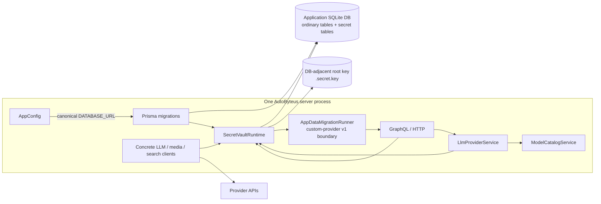

There is no second Store database, Store configuration file, backend selector, access mode, or default/E2E Store target.

## 2. Startup And Pair State

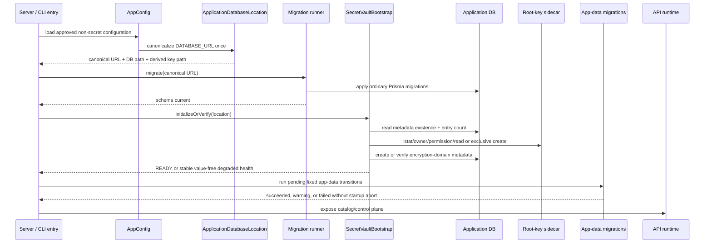

Startup ordering is mandatory: migrate the application schema, bootstrap/verify the vault, run the registered custom-provider-v1 app-data migration, then expose normal provider consumers. An established DB/key mismatch is closed; bootstrap never generates a replacement over established encrypted state. App-data migration failure does not abort startup or built-in Settings.

## 3. Database And Root-Key Ownership

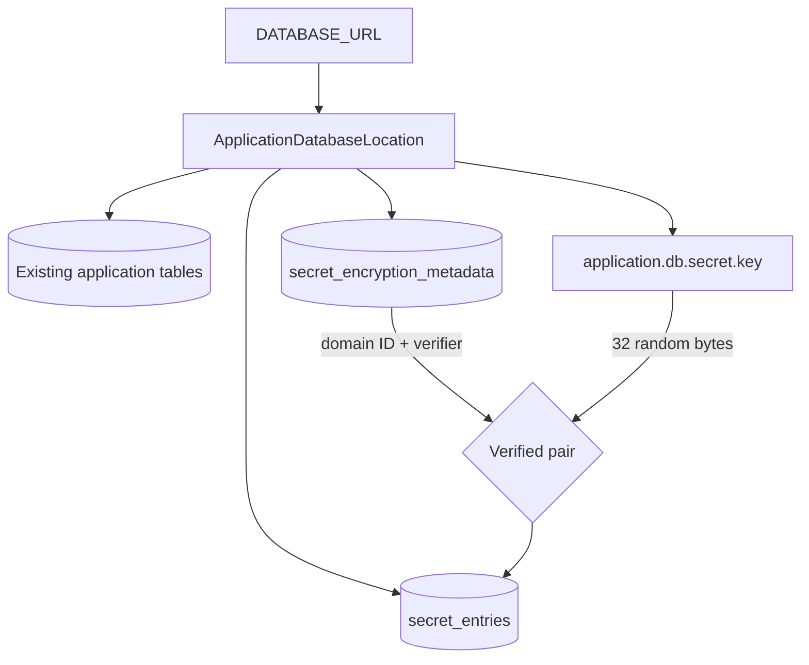

- `secret_entries` owns repeated encrypted values.
- `secret_encryption_metadata` owns singleton encryption-domain/key verification state.
- DB and key are backed up/restored together.
- Key bytes are not committed, put in the DB, or passed through `DATABASE_URL`.

## 4. Provider-Owned Point-Of-Use Resolution

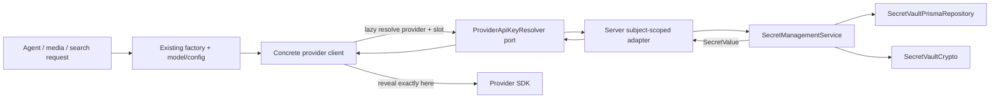

Models do not contain authentication requirements, credential provider IDs, secret IDs, status, or resolved values. Ordinary factory construction remains `model, config, apiKeyResolver`.

## 5. Provider-Centric API-Key Settings Read

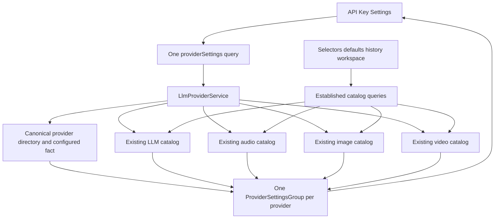

The read emits `ProviderSettingsGroup { provider, llmModels, audioModels, imageModels, videoModels }`. `provider` reuses `LlmProviderObject`; each list reuses `ModelDetail`. The service joins only exact canonical provider IDs and computes one provider-owned `apiKeyConfigured` fact per provider (exact vault slot for ordinary providers; established any-complete-option aggregate for Gemini). Model rows cannot create providers or contribute configured state. A capability with no models is `[]`, and missing credentials never remove models.

The API-key GraphQL selection requests only provider/model fields the page renders. Existing richer type fields remain available to established catalog consumers through their current queries. No reduced provider/model DTO family, capability availability wrapper, `CredentialStatusObject`, instruction protocol, four-array client merge, or parallel credential map exists.

## 6. Explicit Gemini Configuration

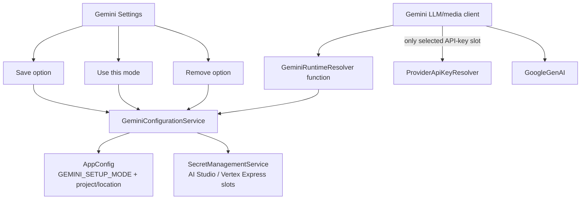

### Exact selected-mode branches

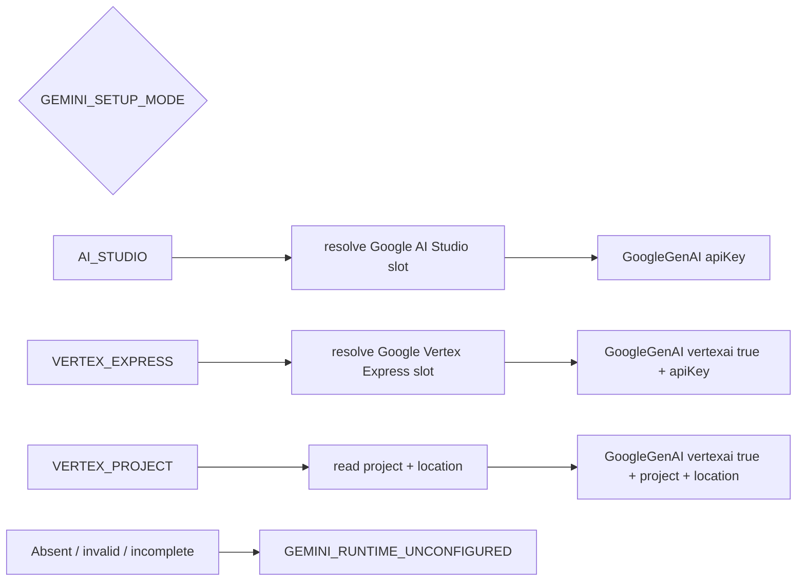

No key-presence priority, save-order selection, alternate-key retry, or implicit fallback exists. `Save only` does not activate. Removal of the active option clears mode and never selects another.

## 7. Gemini Metadata

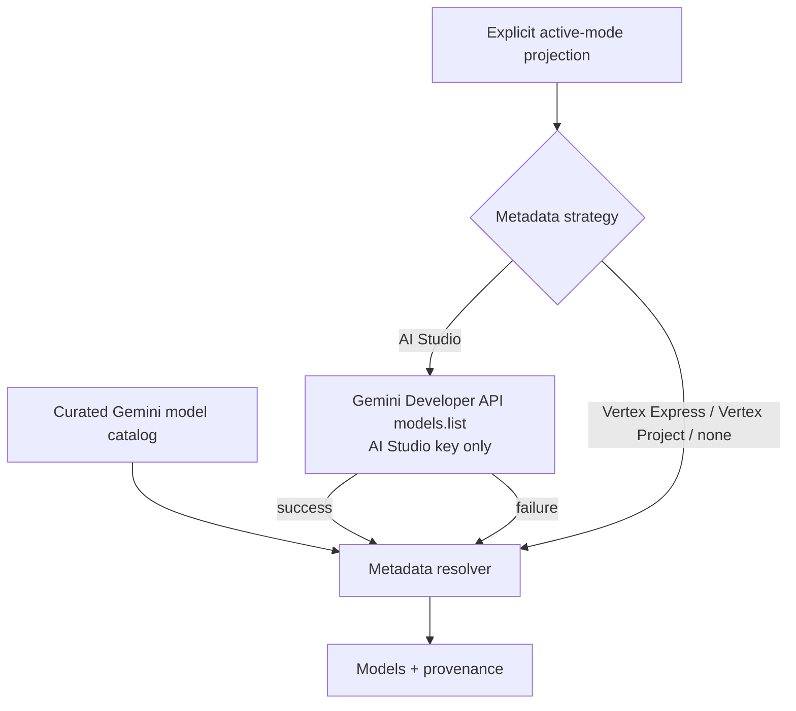

- AI Studio success: `LIVE`.
- AI Studio provider failure: `CURATED_FALLBACK`.
- Vertex Express/Project/no selection: `CURATED_ONLY` and no live metadata credential use.

## 8. Provider Settings Lifecycle

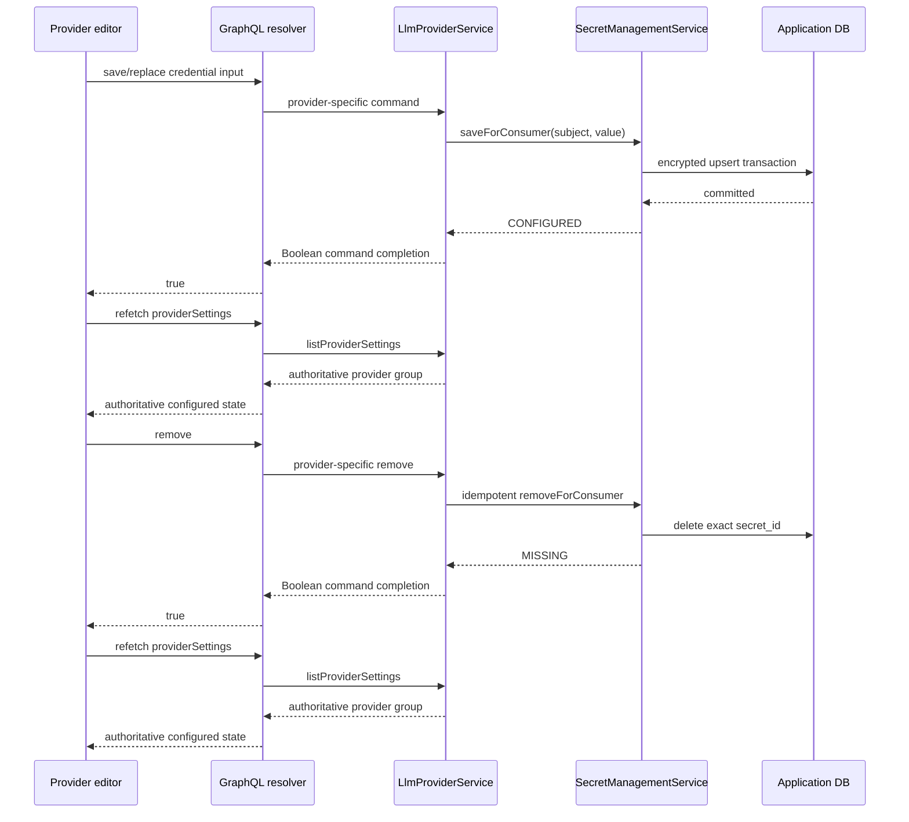

Provider-specific APIs never provide a readback mutation/query. The only plaintext input is write-only and short-lived.

The caller already owns the provider ID, so Save/Remove does not echo it. Its Boolean means command completion; canonical configured state comes from the subsequent provider-row refetch. Custom Probe/Create accepts exactly name, base URL, and transient key; it carries no constant provider type/runtime. Probe returns only discovered `{id,name}` models, Create only the assigned ID, and Delete only success. Gemini Query/Save/Use/Save-and-use/Remove all return one authoritative setup state rather than a parallel operation/outcome protocol.

## 9. Custom Provider V1 Migration And Reset

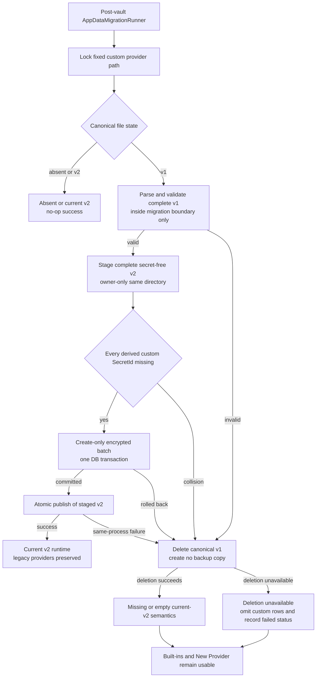

The migration is all-or-nothing for preservation. It never overwrites, compares, uses, or deletes a current vault credential, and it never publishes a subset of v1 providers. Same-process file-publication failure may compensate only the exact unchanged encrypted rows inserted by the just-completed batch. After a power loss between DB commit and file publish, the next run treats configured target IDs as a collision, deletes the legacy file, and returns to frontend reconfiguration rather than guessing ownership.

The normal `CustomLlmProviderStore` reads/writes only v2; a missing current file means empty. No backup/recovery copy is created. `providerSettings` contains custom listing failure as an empty custom-provider contribution, so built-in providers/catalogs and **New Provider** remain visible in every migration outcome. When deletion succeeds, New Provider can immediately create a fresh v2 configuration; when deletion itself is unavailable, custom creation waits for filesystem repair and restart while the rest of Settings remains usable.

## 10. Explicit Importer

```mermaid
flowchart LR
  Command[pnpm secrets:import\nabsolute source + absolute DB URL]
  Location[ApplicationDatabaseLocation\nexplicit URL only]
  Reader[Trusted assignment-file reader]
  Registry[Positive alias registry]
  Inspect[SecretVaultInspectionService\nread-only target classification]
  Plan[Target state + observed status\nplanned action + counts]
  DryRun[Dry-run result\nno mutation]
  Confirm[Direct TTY confirmation]
  Bootstrap[Execution-only\nmigration + vault bootstrap]
  Batch[SecretManagementService.saveBatch]
  Tx[Recheck existence + one Prisma transaction]
  Result[Actual counts + SecretIds only]

  Command --> Location
  Command --> Reader
  Reader --> Registry
  Location --> Inspect
  Registry -->|populated recognized only| Inspect
  Inspect --> Plan
  Plan -->|dry-run| DryRun
  Plan -->|execute| Confirm
  Confirm --> Bootstrap
  Bootstrap --> Batch
  Batch --> Tx
  Tx --> Result
```

- empty recognized assignments are absent;
- unrecognized assignments are outside scope and do not block;
- the source remains byte-identical;
- target derives only from required `--database-url`; AppConfig, `.env`, `.env.test`, parent variables, current working directory, and source-file `DATABASE_URL` have no importer target authority;
- missing, duplicate, relative, malformed, or non-SQLite database URLs fail before target access;
- dry-run never creates or opens-for-write the DB, never migrates/bootstraps, and never creates/modifies the key, metadata, settings, or permissions;
- absent/pre-feature targets are `INITIALIZATION_REQUIRED`; complete verifier-confirmed targets are `READY`; partial/unsafe/incompatible/unverifiable targets are closed and `BLOCKED`;
- preview reports target identity/state, each `SecretId`, observed status, planned action, and counts;
- execution alone performs migration/bootstrap and rechecks status in the write transaction, so no-overwrite remains safe if state changes after preview;
- default is no replacement; overwrite is explicit.

`SecretVaultInspectionService` is an internal import-preview boundary, not an access-mode/profile:

| Target observed without mutation | Preview |
|---|---|
| DB/key absent, pre-feature DB with no secret artifacts, or complete migrated secret tables with zero metadata/entries and either no key or one valid secure interrupted-initialization key | `INITIALIZATION_REQUIRED`, every ID `MISSING/CREATE` |
| Complete current tables/metadata plus secure key and valid verifier | `READY`, exact `MISSING\|CONFIGURED` and `CREATE\|SKIP_CONFIGURED\|REPLACE` |
| Partial pair, incomplete/unsupported schema, unsafe key, verifier failure, or read failure | Exact closed state, every ID `UNAVAILABLE/BLOCKED`, no confirmation |

The normal execution owner, not the inspector, is allowed to migrate/bootstrap and write.

## 11. Test Configuration And Real E2E

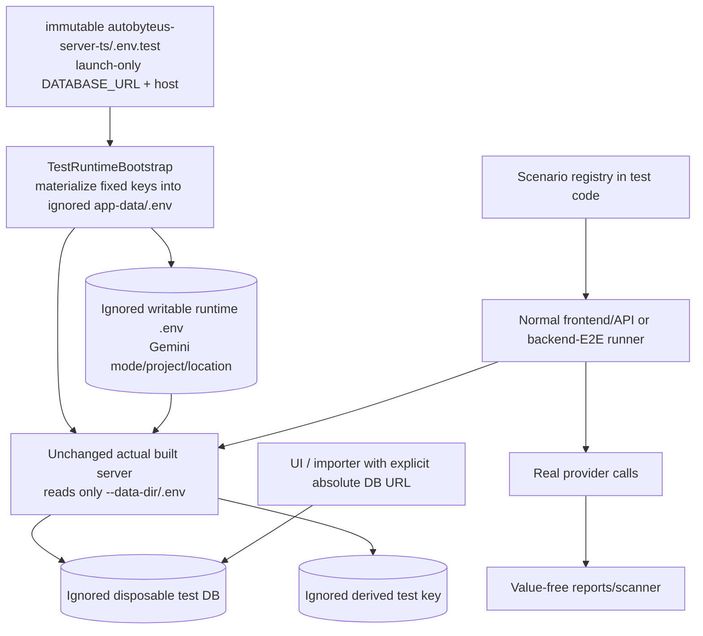

Models, expected capabilities, required-definition assertions, and scenario modes are test code, not launch configuration. The tracked `.env.test` remains byte-identical and is read only by backend-test tooling. The bootstrap canonicalizes the DB URL, materializes/reconciles fixed keys into the ordinary ignored writable runtime `.env`, and starts the unchanged actual built server rather than a harness-only Store. The server remains unaware of `.env.test`. The importer also remains unaware of it: importing into the test DB requires passing that DB’s canonical absolute URL explicitly. Mutable Gemini settings are applied through normal Settings/API commands. Deterministic backend E2E uses fresh roots/DBs; manual and real-provider E2E use the explicit persistent isolated test root. Direct, Electron, Docker/Pod, and packaged-server paths retain their normal `.env`/deployment configuration.

## 12. Runtime Exceptions And Child Boundary

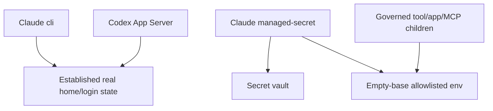

- Claude CLI and Codex retain their approved external local account behavior.
- Claude managed mode resolves only Anthropic and delivers it only to the exact child.
- Governed children receive no credential aliases, `DATABASE_URL`, DB/key paths, or root key.
- Assurance is `LOCAL_HARDENED`; strong agent isolation remains deferred.

## 13. Electron / Direct / Docker Lifecycle

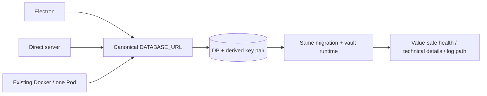

No new service, volume, Store mount, or secret replica topology is added. Packaged validation must launch the actual candidate with an isolated app root and ports and clean only that root.

## Boundary Review Checklist

- [x] One physical database identity: canonical SQLite URL; running apps receive it as `DATABASE_URL`, importer receives it as required `--database-url`.
- [x] Two purpose-specific vault tables in that database.
- [x] One derived external key file.
- [x] Application-schema migration precedes vault bootstrap; the custom-provider app-data migration runs after vault bootstrap and before provider consumers.
- [x] Fixed custom-provider-v1 migration is all-or-nothing, collision-safe, current-v2-only at runtime, and non-blocking for built-ins/New Provider.
- [x] Catalog path has no mandatory vault edge.
- [x] API-key configured/write decisions are minimal screen fields; catalog DTOs carry no credential state.
- [x] Providers resolve at point of use through a core-owned port.
- [x] Gemini non-secret selection has its own narrow resolver function.
- [x] Model definitions carry no credential concern.
- [x] Importer targets only the explicitly supplied canonical database.
- [x] Tests use the normal lifecycle with scenarios in code.
- [x] Claude/Codex exceptions remain explicit.
- [x] Docker topology remains unchanged.
