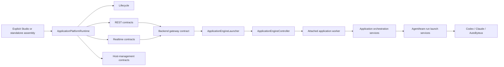
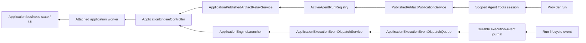
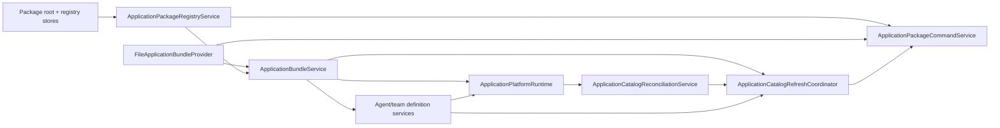
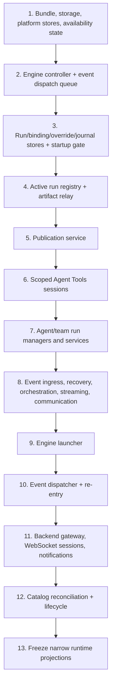

# Application Framework Architecture Simplification

## Status And Authority

- Solution revision: `SR-012`
- Trigger: `CRR-031` / `CR-019`–`CR-021`
- Status: `Proposed — architecture approval required`
- Scope: behavior-neutral internal architecture correction
- Requirements basis: `BEH-010`, `REQ-010`, `AC-019`–`AC-021`, `UC-025`
- Canonical functional baseline: `CRR-029` Pass / 97, `API-REV-011` Pass / 98.9%, and `CRR-030` Pass
- Persisted-data outcome: `Directly Usable — No Migration`

This supplement defines the complete internal target for the CRR-031 correction. It complements, and does not replace, the authoritative requirements and design spec. Because it defines intended architecture, it is part of the approval basis.

## Fixed Behavior Contract

The refactor must preserve all of the following:

1. the two explicit assembly roots, `buildStudioServer` and `buildStandaloneApplicationServer`;
2. all HTTP, WebSocket, GraphQL, MCP, worker-protocol, environment, package, manifest, and database contracts;
3. the same package bytes and the exact `73/73` Studio/standalone package parity result;
4. package-owned Codex / GPT-5.6 Luna defaults, sparse Studio overrides, reset semantics, and readiness classifications;
5. the same AutoByteus, Codex, and Claude provider execution behavior;
6. the capability-scoped `/mcp/agent-tools/:sessionId` route, exact process/session identity, tool projection, authorization, and revocation;
7. application-runtime-scoped `publish_artifacts`, recipient-name `send_message_to`, team handoff, event journal, artifact projection, and business UI result;
8. Studio import/remove/reload diagnostics, identity, refresh order, and rollback;
9. startup, recovery, remount, worker-failure, restart, and shutdown behavior;
10. the invariant that runtime construction prepares infrastructure but creates no new agent/team run; only a business request or legitimate recorded-run recovery creates/restores one.

The refactor must not add `buildServer(mode)`, a service locator, a generic dependency container, a generic event bus, an optional-field shared base runtime, a compatibility alias, a dual path, or an application-path singleton/global fallback.

## Current Primary And Return Spines

### Current request spine


### Current publication and event return spine

```mermaid
flowchart RL
    Provider[Provider run] --> Session[Scoped Agent Tools session]
    Session --> DeferredPublisher[BindOncePublishedArtifactPublisher]
    DeferredPublisher --> Publication[PublishedArtifactPublicationService]
    Publication --> RunManager[AgentRunManager active-run lookup]
    RunManager --> Relay[ApplicationPublishedArtifactRelayService]
    Relay --> DeferredEngine[BindOnceApplicationEngineEventHandler]
    DeferredEngine --> Engine[ApplicationEngineHostService]
    Engine --> Worker[Application worker]
    Worker --> Projection[Application business state / UI]
```



The runtime behavior is correct, but the returned runtime exposes internals, Studio package construction closes over later-assigned services, and the two bind-once objects permanently encode construction cycles.

## Target Primary And Return Spines

### Target request spine



### Target publication and event return spine



The dispatch queue carries only coalesced application IDs after the authoritative event is committed to the existing journal. It is a closed, domain-specific wake-up queue with no arbitrary topics, payload publication, or subscriber API. It is not a generic event bus.

## Narrow `ApplicationPlatformRuntime` Boundary

### Outward shape

`ApplicationPlatformRuntime` becomes the following four-projection boundary:

```ts
type ApplicationPlatformRuntime = Readonly<{
  lifecycle: ApplicationPlatformLifecycle;
  rest: ApplicationPlatformRestContracts;
  realtime: ApplicationPlatformRealtimeContracts;
  hostManagement: ApplicationPlatformHostManagementContracts;
}>;
```

The projections are immutable objects created once by `buildApplicationPlatformRuntime`. They contain exact subject contracts, not stores or the complete service implementations.

### Lifecycle contract

The lifecycle retains:

- `getState()`
- `getFailure()`
- `prepareBeforeListen()`
- `recoverAfterListen()`
- `awaitReady()`
- `stop()`

Route registrars receive only the `awaitReady`/state view they actually require; server entrypoints retain the complete lifecycle for prepare/recover/stop.

### REST contracts

```ts
type ApplicationPlatformRestContracts = Readonly<{
  assets: Pick<ApplicationBundleService, "resolveUiAsset">;
  backend: ApplicationBackendRestContract;
  availability: ApplicationAvailabilityRestContract;
  executionResources: ApplicationExecutionResourceRestContract;
}>;
```

- `assets` resolves only application UI assets.
- `backend` exposes the existing status/ensure/query/command/GraphQL/custom-route operations.
- `availability` exposes the existing availability reads and explicit reload/re-enter command.
- `executionResources` exposes the existing launch view, selected-resource preview, list, upsert, and reset/remove operations.

`registerRestRoutes` accepts `{ lifecycleReadiness, application: runtime.rest }`. Individual registrars receive only their one subject contract.

### Realtime contracts

```ts
type ApplicationPlatformRealtimeContracts = Readonly<{
  backend: ApplicationBackendRealtimeContract;
  notifications: ApplicationBackendNotificationContract;
  agentCommunication: ApplicationAgentCommunicationContract;
}>;
```

The three contracts preserve the existing backend custom-WebSocket, notification, and direct agent-communication behavior. `registerWebsocketRoutes` accepts `{ lifecycleReadiness, application: runtime.realtime }`; it cannot reach run stores, recovery, the engine launcher, or shutdown internals.

### Host-management contract

```ts
type ApplicationPlatformHostManagementContracts = Readonly<{
  catalogReconciliation: ApplicationCatalogReconciliationService;
}>;
```

`ApplicationCatalogReconciliationService.reconcile(snapshot)` is the sole outward host-management command. It reads known application IDs through the private platform-state store and reconciles the private availability owner. Studio package refresh never receives either store directly.

### Private runtime owners

The following remain closure-private to `buildApplicationPlatformRuntime` and lifecycle construction:

- storage/global/platform/run/binding/override/journal stores;
- availability state, recovery, event dispatch queue and dispatcher;
- active-run registry, run managers, run observers, run shutdown;
- application-scoped Agent Tools session manager and publisher;
- engine controller and launcher;
- streaming, gateway session, notifications, and cleanup owners.

No caller above the runtime boundary receives these objects merely to select one method.

## Studio Package Ownership And Refresh

### Owners

| Owner | Scope And Responsibility | Must Not Own |
| --- | --- | --- |
| `ApplicationPackageRegistryService` | Built-in/additional package-root and registry-record state; snapshots, list/details, diagnostics; package-state mutations used by commands | Bundle/definition refresh, application availability, platform-state lookup, runtime internals, global/default resolution |
| `ApplicationPackageCommandService` | Import local/GitHub, reload, remove, validation, installer cleanup, transaction rollback, and command results | Definition traversal, availability logic, hidden service lookup |
| `ApplicationCatalogRefreshCoordinator` | One ordered propagation from committed package registry state to bundle catalog, availability, agent definitions, and team definitions | Package record mutation, installation, GraphQL mapping |
| `ApplicationCatalogReconciliationService` | Runtime-private known-state lookup plus availability reconciliation for one supplied catalog snapshot | Package installation/rollback or definition cache refresh |

### Acyclic Studio construction



`buildStudioServer` contains no `let service!` declaration and no callback that closes over a later assignment.

### Validation

Package command validation uses the same explicitly constructed `FileApplicationBundleProvider.validatePackageRoot(packageRoot, packageId)` that backs the bundle service. It does not call back through the bundle service and does not construct a second parser.

### Refresh order

`ApplicationCatalogRefreshCoordinator.refresh()` always performs:

1. `bundleService.refresh()`;
2. `bundleService.getCatalogSnapshot()`;
3. `catalogReconciliation.reconcile(snapshot)`;
4. `agentDefinitionService.refreshCache()`;
5. `agentTeamDefinitionService.refreshCache()`.

No command or GraphQL resolver may reproduce this sequence.

### Command and rollback semantics

- **Local import:** validate root and package contents; add root; upsert registry record; refresh; return list. On failure, remove the added root/record, perform one best-effort refresh, and rethrow the original error.
- **GitHub import:** install; validate; add root and managed record; refresh; return list. On failure, restore registry/root state, delete only that managed installation, perform one best-effort refresh, and rethrow.
- **Remove:** capture prior root/record; remove root/record; refresh; only after successful refresh delete the managed installation. On failure, restore captured state, perform one best-effort refresh, and rethrow.
- **Reload:** materialize the built-in package when applicable; refresh through the coordinator; return list.

The GraphQL wire schema and field names remain unchanged. Its configured Studio services hold separate query and command contracts instead of one overloaded registry object.

## Acyclic Run, Publication, And Session Construction

### `ActiveAgentRunRegistry`

`ActiveAgentRunRegistry` is created before publication and owns only:

- `register(run)`
- `getActiveRun(runId)`
- `hasActiveRun(runId)`
- `listActiveRunIds()`
- `remove(runId, reason)`

It owns the active-run map and the rule that an inactive run is removed before being returned. It does not create backends, allocate identities, launch/restore/terminate runs, persist metadata, issue Agent Tools sessions, or resolve process globals.

`AgentRunManager` receives the registry and explicit backend/attachment/session dependencies. It remains the owner of create, restore, terminate, and stop-all operations. Run removal triggers the same file-change, artifact-relay, memory-recorder, and session-revocation cleanup exactly once through a run-lifecycle callback owned by the manager. The callback is registered during construction before runtime readiness; it is not a general event bus.

### Construction order

1. create the application engine controller and application stores;
2. create `ActiveAgentRunRegistry`;
3. create the application artifact relay with the exact binding store and engine controller;
4. create `PublishedArtifactPublicationService` with the exact active-run reader, workspace manager, projection/snapshot stores, and relay;
5. create the scoped Agent Tools session manager with that concrete publisher;
6. create explicit provider factories and `AgentRunManager`/`AgentTeamRunManager` with the registry and scoped session manager;
7. create run services, projection services, observers, recovery, and shutdown coordination.

`BindOncePublishedArtifactPublisher` is removed. A scoped session cannot exist without a concrete publisher, so readiness no longer checks a later binding.

### General-process isolation

Application-path constructors require explicit dependencies. Existing supported non-application behavior is assembled through named process factories:

- `createGeneralProcessPublishedArtifactPublisher(...)`
- `createGeneralProcessRunSupervisor(...)`

Those factories may supply the established process manager/stores/relay, but application assembly may not call them or fall back to them. This is a bounded seam correction, not a repository-wide singleton rewrite.

## Acyclic Engine And Event Construction

### Engine controller

`ApplicationEngineController` is created early and owns:

- worker handle and status registries;
- attach/detach of one worker handle;
- query/command/GraphQL/custom-route/event/artifact invocation on an attached handle;
- notification, WebSocket-action, and worker-close listener collections;
- stop of attached workers and cleanup of their status/listener state.

It does not discover bundles, prepare storage, create worker processes, load definitions, or handle application context capabilities.

### Engine launcher

`ApplicationEngineLauncher` is constructed after orchestration and streaming exist. It owns:

- coalesced per-application startup promises;
- bundle lookup and storage preparation/repair;
- worker process/client creation;
- definition loading;
- application context-capability and stream handler wiring;
- attachment/detachment through the exact controller;
- `ensureReady`, stop-one, and stop-all coordination.

The backend gateway and event dispatcher use the launcher to ensure readiness and the controller to invoke. The publication relay uses the controller for the already-attached worker that originated a live application-bound run. Missing/closed handles retain the current best-effort relay failure and durable projection behavior; restart/recovery/remount characterization must prove no user-visible regression.

### Event dispatch queue

`ApplicationExecutionEventDispatchQueue` is created before event ingress. After a durable journal append, ingress enqueues only the application ID. IDs are coalesced. The later dispatcher consumes the queue, checks availability, ensures the worker through `ApplicationEngineLauncher`, invokes through `ApplicationEngineController`, and preserves the current journal acknowledgment, failure, retry timestamp, exponential backoff, resume, suspend, and stop behavior.

The queue has no arbitrary payload or topic API. The journal remains the authoritative event record. This removes `BindOnceApplicationEngineEventHandler` without inventing a generic deferred dependency.

### Availability and re-entry

The stable availability state/query/reconciliation owner is constructed before orchestration and supplies the existing active/quarantined/re-entering guard. The later `ApplicationReentryService` owns only the reload/re-enter command:

1. set `REENTERING`;
2. stop the worker through launcher/controller;
3. reload the bundle;
4. reconcile the new catalog snapshot;
5. recover the application;
6. resume its pending event dispatch;
7. set `ACTIVE`, or quarantine with the existing diagnostic.

This lets orchestration depend on stable availability state without making the state owner depend on the later engine/event services.

## Complete Target Construction Order



At no point does construction create or restore a run. Recovery occurs only in `recoverAfterListen`; new execution occurs only after a business launch request.

## Ownership And Forbidden-Dependency Map

| Owner | Allowed dependencies | Forbidden dependencies |
| --- | --- | --- |
| REST/realtime registrar | lifecycle readiness plus its exact REST/realtime contract | whole runtime, stores, recovery, run managers, engine internals |
| Package registry | package settings/record stores and materializer | bundle/definition/runtime/availability globals |
| Package command service | registry, installer, file provider validator, refresh coordinator | direct definition refresh or platform-state access |
| Catalog refresh coordinator | bundle, catalog reconciliation, agent/team definitions | package mutation/installer, runtime stores |
| Active run registry | active `AgentRun` values only | backend factories, session manager, global manager |
| Application publication service | active-run reader and explicit stores/relay/workspace | `AgentRunManager.getInstance`, default publication service |
| Scoped session manager | process MCP registry/catalog plus concrete application publisher | general-process publisher or global run manager |
| Engine controller | attached worker handles/status/listeners | bundle, storage, orchestration, global engine service |
| Engine launcher | bundle, storage, controller, orchestration, streaming | application runtime aggregate or hidden global service |
| Event dispatcher | journal, dispatch queue, availability reader, launcher, controller | bind-once handler, runtime aggregate, generic event bus |
| Lifecycle | explicit private stop/start participants | returned 19-field service collection |

## Source Inventory

### Add

- `application-platform/runtime/application-platform-runtime-contracts.ts`
- `application-platform/runtime/application-catalog-reconciliation-service.ts`
- `application-packages/services/application-package-command-service.ts`
- `application-packages/services/application-catalog-refresh-coordinator.ts`
- `agent-execution/runtime/active-agent-run-registry.ts`
- `application-engine/services/application-engine-controller.ts`
- `application-engine/services/application-engine-launcher.ts`
- `application-orchestration/services/application-execution-event-dispatch-queue.ts`
- `application-orchestration/services/application-reentry-service.ts`
- named general-process publication/run assembly factory files if a current process consumer still requires default construction

### Modify

- both explicit server builders and `server-runtime.ts`;
- `application-platform-runtime.ts`, its builder, lifecycle, lifecycle contracts, and the current orchestration/run construction builders;
- REST, WebSocket, standalone REST/WebSocket registrars;
- package registry, bundle service, Studio GraphQL service configuration, and application-package resolver;
- agent run manager, publication/projection service, artifact relay, event ingress/dispatch, availability, engine gateway/WebSocket session, recovery, and streaming seams;
- focused unit/integration tests and the application/backend/orchestration/developer module documentation named in the design spec.

### Remove

- `application-platform/runtime/bind-once-published-artifact-publisher.ts`
- `application-platform/runtime/bind-once-application-engine-event-handler.ts`
- `application-engine/services/application-engine-host-service.ts` after its responsibilities move to controller/launcher
- application-path optional/global dependency branches made obsolete by the explicit assembly
- tests that assert the removed broad runtime or bind-once contracts, replaced by target-owner tests

Old symbols/files are deleted in the same implementation. No compatibility export or alias remains.

## Refactor Sequence

1. Add characterization assertions for the 19-field consumer inventory, package refresh/rollback order, run creation trigger, event retry, artifact relay, recovery/remount, and stop order.
2. Introduce the narrow runtime contract types and move route/host consumers to exact projections while the underlying services remain unchanged.
3. Split package registry query/state from package commands; add the refresh coordinator; remove all late-assigned Studio callbacks and application-path defaults.
4. Introduce `ActiveAgentRunRegistry`; migrate publication/projection and the run manager to it; construct the concrete application publisher before scoped sessions; remove the publisher bind-once proxy.
5. Split engine controller from launcher; add the closed dispatch queue; migrate event ingress/dispatch and re-entry; remove the engine-handler bind-once proxy and old engine-host service.
6. Rebuild lifecycle construction and stop order from explicit private participants; freeze only the four outward runtime projections.
7. Remove old files, optional/default application-path branches, imports, and tests. Run retired-symbol and no-alias scans.
8. Run implementation review, the complete API-REV-011 dual-host characterization baseline, proportional durable-test review, and integrated-state checks.

Each sequence is a clean cut; no old/new runtime path runs in parallel.

## Shutdown Order

The externally observed order remains:

1. block new application Agent Tools sessions;
2. stop event-dispatch intake/timers;
3. close direct agent communication;
4. dispose backend gateway/WebSocket sessions/notifications;
5. dispose run observers;
6. stop engine startups and attached workers through launcher/controller;
7. stop team runs, then agent runs;
8. close scoped Agent Tools sessions;
9. stop streaming;
10. stop process-level MCP/general-run/channel/vault/Prisma resources in the existing server-owned order.

There is no publisher-bind close step because the concrete publisher is owned directly and becomes unreachable after scoped sessions/runs stop.

## Validation Contract

Required structural and executable evidence:

1. runtime type exposes exactly `lifecycle`, `rest`, `realtime`, and `hostManagement`; registrars do not accept the whole runtime;
2. no production caller outside the runtime builder/lifecycle imports private stores/recovery/run/engine/session owners;
3. Studio construction has no late non-null service variables or callbacks over later assignments;
4. import/remove/reload preserve exact refresh order and rollback, including a refresh-failure case;
5. runtime construction yields zero new/restored agent/team runs;
6. active-run identity used by publication/projection is the exact application registry, while general-process sentinels remain distinct;
7. scoped sessions receive a concrete publisher at construction; both bind-once files and symbols are absent;
8. event ingress commits before enqueue, dispatcher preserves retry/backoff/resume, and engine launcher/controller identity is exact;
9. worker crash, restart/recovery, remount, real publication/handoff/projection, and shutdown pass in both hosts;
10. route, schema, database, package digest, and `73/73` parity evidence matches API-REV-011.

## Data And Migration Decision

No serialized or persisted representation changes. Existing package files, manifests, application/platform databases, launch-override rows, event journals, run lookup state, projections, and migration ledgers remain directly usable. No migration, copy, seeding, dual read/write, or compatibility code is permitted.
