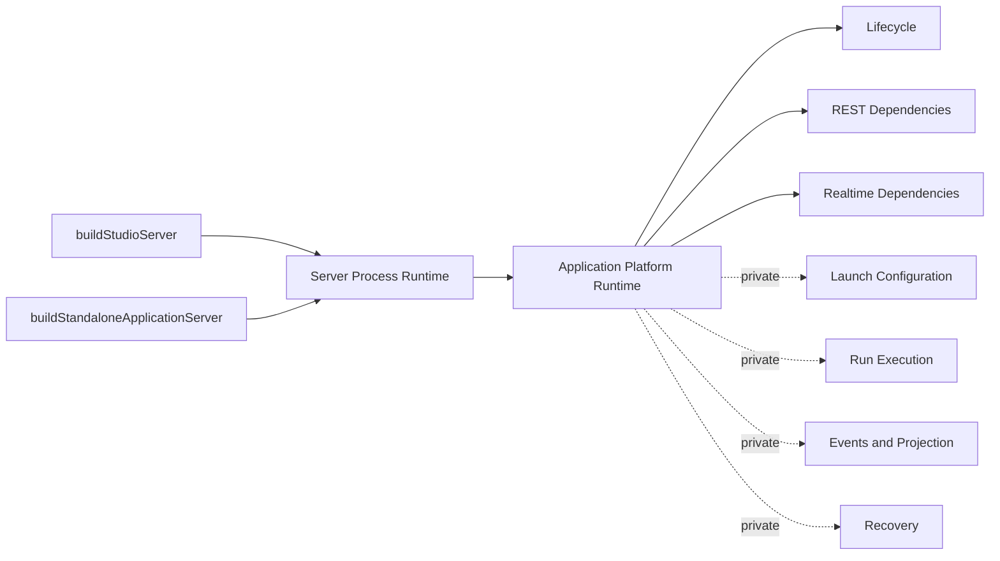
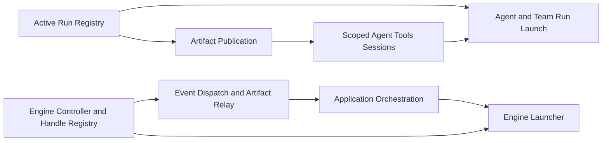

# Code Review Report

## Review Round Meta

- Review Entry Point: `Implementation Review` — fresh behavior-neutral architecture simplification audit
- Requirements Doc Reviewed As Context: `/Users/normy/autobyteus_org/autobyteus-worktrees/universal-application-framework-proposal-analysis/tickets/in-progress/universal-application-framework-proposal-analysis/requirements.md`
- Investigation Notes Reviewed As Context: `/Users/normy/autobyteus_org/autobyteus-worktrees/universal-application-framework-proposal-analysis/tickets/in-progress/universal-application-framework-proposal-analysis/investigation-notes.md`
- Design Spec Reviewed As Context: `/Users/normy/autobyteus_org/autobyteus-worktrees/universal-application-framework-proposal-analysis/tickets/in-progress/universal-application-framework-proposal-analysis/design-spec.md`
- Supplemental Task Artifacts Reviewed As Context: `proposal-critical-analysis.md`, `design-self-validation.md`, and `sources/autobyteus-vertical-application-developer-experience-proposal.md` in the same ticket directory
- Solution Revision Record Reviewed As Context: `/Users/normy/autobyteus_org/autobyteus-worktrees/universal-application-framework-proposal-analysis/tickets/in-progress/universal-application-framework-proposal-analysis/solution-revision-record.md`
- Relevant Solution Revision IDs: `SR-011`; retained functional basis `SR-010`, `SR-006`
- Design Review Report Reviewed As Context: `/Users/normy/autobyteus_org/autobyteus-worktrees/universal-application-framework-proposal-analysis/tickets/in-progress/universal-application-framework-proposal-analysis/design-review-report.md`
- Architecture Review Revision Record Reviewed As Context: `/Users/normy/autobyteus_org/autobyteus-worktrees/universal-application-framework-proposal-analysis/tickets/in-progress/universal-application-framework-proposal-analysis/architecture-review-revision-record.md`
- Relevant Architecture Review Revision IDs: `ARCH-REV-009`; retained functional basis `ARCH-REV-008`, `ARCH-REV-006`
- Implementation Handoff Reviewed As Context: `/Users/normy/autobyteus_org/autobyteus-worktrees/universal-application-framework-proposal-analysis/tickets/in-progress/universal-application-framework-proposal-analysis/implementation-handoff.md`
- Implementation Revision Record Reviewed As Context: `/Users/normy/autobyteus_org/autobyteus-worktrees/universal-application-framework-proposal-analysis/tickets/in-progress/universal-application-framework-proposal-analysis/implementation-revision-record.md`
- Relevant Implementation Revision IDs: `IR-016`; cumulative functional implementation through `IR-015`
- Code Review Revision Record: `/Users/normy/autobyteus_org/autobyteus-worktrees/universal-application-framework-proposal-analysis/tickets/in-progress/universal-application-framework-proposal-analysis/code-review-revision-record.md`
- Current Code Review Revision ID: `CRR-031`
- Current Review Round: `31`
- Trigger: user-requested design-principles audit to remove accidental architecture complexity while preserving every passed product behavior after `API-REV-011` / `CRR-030`
- Prior Review Round Reviewed: `CRR-029` source Pass; `API-REV-011` Pass / `98.9%`; `CRR-030` proportional test-code Pass
- Latest Authoritative Round: `31`
- Coverage Investigation Reviewed: `/Users/normy/autobyteus_org/autobyteus-worktrees/universal-application-framework-proposal-analysis/tickets/in-progress/universal-application-framework-proposal-analysis/api-e2e-coverage-investigation.md`
- Execution Coverage Report Reviewed: `/Users/normy/autobyteus_org/autobyteus-worktrees/universal-application-framework-proposal-analysis/tickets/in-progress/universal-application-framework-proposal-analysis/api-e2e-execution-coverage-report.md`
- API/E2E Revision Record Reviewed: `/Users/normy/autobyteus_org/autobyteus-worktrees/universal-application-framework-proposal-analysis/tickets/in-progress/universal-application-framework-proposal-analysis/api-e2e-revision-record.md`
- Relevant API/E2E Revision IDs: `API-REV-011`; retained `API-REV-010`, `API-REV-008`
- Delivery Revision Record Reviewed: `/Users/normy/autobyteus_org/autobyteus-worktrees/universal-application-framework-proposal-analysis/tickets/in-progress/universal-application-framework-proposal-analysis/delivery-revision-record.md`
- Relevant Delivery Revision IDs: `DR-001`
- Failing Scenario IDs: `N/A` — this is a structural design-impact audit, not a runtime failure
- Exact Review Commands / Execution Mode:
  - Static source trace of both server assembly roots, `ApplicationPlatformRuntime`, REST/WebSocket registrars, Studio package construction, application runtime/orchestration/run construction, Agent Tools MCP runtime/session management, publication, engine-event dispatch, and shutdown.
  - Production-use inventory for every `applicationRuntime.*` access.
  - Effective-line/responsibility inventory for the affected construction and service files.
  - Existing executable basis retained: `API-REV-011` Pass / `98.9%`, including real Studio and standalone publication/handoff/projection, restart/recovery, remount, route separation, cleanup, and `73/73` package parity.
- Failure Evidence Paths: `N/A`

## Review Scope

- Changed implementation and behavior reviewed: no product behavior change is proposed or accepted by this review. The current passed architecture was freshly assessed against the shared design principles to identify accidental complexity that can be removed while retaining the exact user/product contract.
- Files / areas reviewed:
  - `src/application-platform/runtime/application-platform-runtime.ts`
  - `src/application-platform/runtime/build-application-platform-runtime.ts`
  - `src/application-platform/runtime/create-application-orchestration-services.ts`
  - `src/application-platform/runtime/create-application-run-services.ts`
  - both `BindOnce*` construction-cycle seams and `ApplicationRunShutdownCoordinator`
  - `src/compositions/build-studio-server.ts` and `build-standalone-application-server.ts`
  - `src/api/rest/index.ts`, `src/api/websocket/index.ts`, and standalone route registrars
  - `ApplicationPackageRegistryService`, bundle/definition refresh construction, and Studio GraphQL package commands
  - `AgentToolsMcpRuntime`, scoped session management, `PublishedArtifactPublicationService`, agent/team run managers, application engine host, event dispatch, publication relay, and their current global/default factories
- Explicit exclusions:
  - no route, wire contract, schema, package, persisted-data, model/provider, Agent Tools capability, worker protocol, Studio iframe, standalone command, recovery, or shutdown behavior may be removed or weakened;
  - do not merge Studio and standalone into a mode-switched `buildServer({ mode })`;
  - do not introduce a service locator, generic dependency container, compatibility wrapper, dual path, or optional-field “shared” base;
  - historical `APIE2E-REPO-005` remains separate and unattributed.

## Upstream Behavior And Production-Path Basis Confirmation

- Approved requirements basis understood: Yes. The user explicitly requires a behavior-neutral architecture cleanup. `BEH-001`–`BEH-009`, `REQ-001`–`REQ-009`, and `AC-001`–`AC-018` remain the fixed functional contract; `UC-024` specifically requires contributors to navigate the framework by concrete responsibility.
- Design-spec behavior map verified against the implementation: Yes for current behavior. The audit does not contradict the passed functional spines; it finds that the remaining construction and exposure shape is more coupled than necessary.
- Design review report and round confirmed: `ARCH-REV-009 Pass` over the naming correction. That review did not redesign the broad runtime result, Studio package refresh cycle, or bind-once construction cycles now explicitly challenged by the user.
- Behavior-basis status: `Confirmed`
- Changed or newly discovered behavior, if any: None.
- Remaining material ambiguity, if any: None. The required posture is an internal clean-cut refactor with exact behavioral equivalence.

| Behavior ID | Current Status | Current Implementation Path And Lifecycle Evidence | Contradicting Or Newly Discovered Supported Behavior Evidence |
| --- | --- | --- | --- |
| `BEH-001`–`BEH-003` | Confirmed | Both hosts use the same validated package and current bootstrap contracts; package bytes and manifest/storage formats are unaffected by the proposed cleanup. | None. |
| `BEH-004`, `BEH-005`, `BEH-008` | Confirmed | `Server -> ApplicationPlatformRuntime -> orchestration/run services -> provider -> scoped Agent Tools -> publication/handoff/projection` is real and passes in both hosts. The design response must preserve this full forward and return spine. | None. |
| `BEH-006`, `BEH-007` | Confirmed | Maintained commands, package defaults/overrides, storage, recovery, process restart, and shutdown order pass. They are fixed acceptance invariants for the refactor. | None. |
| `BEH-009` | Confirmed, but structurally incomplete | Role names are now clear, but the public runtime shape, temporal package-construction callbacks, and cycle-breaking proxies still require a contributor to reconstruct mixed-level dependencies and construction order. | No new product behavior; this is the design-impact basis for `CR-019`–`CR-021`. |

## Structural / Design Checks

| Check | Result | Evidence | Required Action |
| --- | --- | --- | --- |
| Task design health assessment is present, evidence-backed, and preserved by the implementation | Fail | `SR-011` correctly solved vocabulary but intentionally retained the existing broad runtime and dependency cycles. The user now explicitly broadens the behavior-neutral refactor goal to structural simplicity. | Reassess the target architecture around runtime exposure, package refresh ownership, and acyclic construction. |
| Implementation matches approved behavior-defining supplemental artifacts | Pass | Current behavior and execution remain aligned; no functional redesign is requested. | Preserve all approved behavior and update supplements only with the new internal target. |
| Data-flow spine inventory clarity and preservation under shared principles | Fail | The business spines are valid, but route registration receives a 19-field runtime collection, and construction paths cross package registry, bundles, definitions, availability, run/session/publication, and engine/event cycles. | Keep the same spines while reducing each boundary to its true main-line ports and explicit return/event owners. |
| Ownership boundary preservation and clarity | Fail | `ApplicationPlatformRuntime` exposes internal stores and lifecycle services; `ApplicationPackageRegistryService` owns records, roots, installation, diagnostics, validation, rollback, catalog refresh, definition refresh, availability reconciliation, and default lookup modes. | Narrow the runtime boundary and split package registry state/commands from ordered catalog refresh coordination. |
| Off-spine concern clarity | Fail | Bind-once proxies are correct local mechanisms but exist because active-run lookup/publication/session creation and engine invocation/launch ownership form cycles. | Split the underlying state/controller owners so the proxies can be removed rather than promoted into permanent architecture. |
| Existing capability/subsystem reuse check | Pass | The target can reuse existing package, bundle, definition, execution, event, worker, Agent Tools, publication, and recovery capabilities. | Do not create duplicate replacement subsystems. |
| Reusable owned structures check | Pass | Existing route, lifecycle, publisher, session, and run contracts are reusable once ownership is narrowed. | Derive narrow route/runtime contracts from actual consumers; do not copy DTOs. |
| Shared-structure/data-model tightness check | Fail | `ApplicationPlatformRuntime` is a broad 19-field read-only service collection even though production consumers use only a subset; accepting the whole runtime permits mixed-level access. | Expose only lifecycle and subject-specific REST/realtime/host-management dependency views; keep stores and internal services private. |
| Repeated coordination ownership check | Fail | Package refresh order is embedded in `ApplicationPackageRegistryService` while Studio assembly injects callbacks to bundle, definition, availability, and state owners. | Give ordered package-to-catalog refresh/reconciliation one explicit coordinator constructed after its dependencies. |
| Empty indirection check | Pass | The two `BindOnce*` types enforce real bind/rebind/closed invariants and are not empty pass-through wrappers. | Remove them only after eliminating their cycles; do not replace them with a generic deferred container. |
| Scope-appropriate separation of concerns and file responsibility clarity | Fail | `createApplicationOrchestrationServices` constructs stores, bindings, events, recovery, availability, launch configuration, run execution, streaming, and communication. `ApplicationPackageRegistryService` is 478 effective lines with several owners. | After boundary redesign, group construction by real capability ownership rather than adding empty factories. |
| Ownership-driven dependency check | Fail | Studio package construction uses `let bundleService!`, `let applicationRuntime!`, and `let definitionServices!`; application publication and engine callbacks require bind-then-use seams. | Establish an acyclic construction order with explicit state registries/controllers and a last-constructed package refresh coordinator. |
| Authoritative Boundary Rule check | Fail | `registerRestRoutes` and `registerWebsocketRoutes` accept the outer `ApplicationPlatformRuntime` and directly select its internal services; Studio assembly also reaches runtime availability and platform-state internals. | Make registrars depend on exact subject-owned contracts, and prevent callers above the runtime boundary from receiving its internal service set. |
| File placement check | Pass | The affected files sit in the correct high-level capability areas. | Revisit subfolder/file placement only after target responsibilities are finalized. |
| Flat-vs-over-split layout judgment | Pass | Current layout is navigable after IR-016. | Split only where a new owner is real; avoid one-file-per-constructor fragmentation. |
| Interface/API/query/command/service-method boundary clarity | Fail | The runtime type is broader than its consumers, and core services such as publication/package registry support both explicit injection and hidden global/default resolution. | Require explicit dependencies in application-runtime services; isolate general-process defaults in assembly factories. |
| Naming quality and naming-to-responsibility alignment check | Pass | `CR-018` remains resolved; current role nouns are clear. | Preserve the vocabulary while changing structure. |
| No unjustified duplication of code / repeated structures in changed scope | Pass | No duplicate architecture exists today. | Keep one runtime, one package refresh owner, one run registry, and one engine controller. |
| Patch-on-patch complexity control | Fail | The bind-once seams and late-bound Studio callbacks are individually safe patches over dependency cycles, but the user now requests removal of the underlying accidental complexity. | Redesign the cycles directly; do not add another adapter/fallback layer. |
| Dead/obsolete code cleanup completeness in changed scope | Pass | No obsolete IR-016 naming path remains. | The final design must explicitly remove superseded broad contracts/proxies/default branches. |
| Relevant test scenarios and assertions are clear and requirement-aligned | Pass | `API-REV-011` and CRR-030 provide strong behavior-preservation coverage. | Reuse the complete dual-host suite as characterization evidence and add narrow boundary/construction tests for the new design. |
| Test fixtures/helpers are reasonably reusable and test structure remains coherent | Pass | Existing runtime-isolation, route, lifecycle, run-service, MCP, package, and live-browser coverage is reusable. | Avoid duplicating host-specific suites for shared behavior. |
| No stale, duplicated, or compatibility-only tests are retained in changed scope | Pass | Current suite passed after clean naming replacement. | Remove tests for deleted proxies/old broad contracts and replace them with target-owner tests. |
| API/E2E readiness for the next workflow stage | Fail | Current behavior is highly validated, but the new cross-cutting target has not been solution-designed or architecture-reviewed. | Return through solution design and architecture review before implementation; then rerun source review and dual-host API/E2E. |

## Source File Size And Structure Audit

No implementation delta exists in CRR-031, so changed-source hard/delta thresholds are `N/A`. Current effective sizes and structural pressure are recorded as design evidence, not line-count violations.

| Source File | Effective Non-Empty Lines | `>500` Hard-Limit Check | `>220` Delta Check | SoC / Ownership Check | Placement Check | Preliminary Classification | Required Action |
| --- | ---: | --- | --- | --- | --- | --- | --- |
| `application-platform-runtime.ts` | 44 | `N/A` | `N/A` | Broad 19-field runtime/service collection | Correct area | Design Impact | Replace with narrow outward contracts; hide internal services. |
| `build-application-platform-runtime.ts` | 153 | `N/A` | `N/A` | Owns runtime construction but also binds two cycle breakers | Correct area | Design Impact | Adopt an acyclic construction sequence. |
| `create-application-orchestration-services.ts` | 198 | `N/A` | `N/A` | Constructs several distinct capability areas | Correct area | Design Impact | Decompose only along real launch/event/run/recovery/communication owners. |
| `create-application-run-services.ts` | 153 | `N/A` | `N/A` | Run construction is coherent but couples active-run state, sessions, publication, providers, and shutdown | Correct area | Design Impact | Split active-run registry/state from launch orchestration to remove the publication cycle. |
| `bind-once-application-engine-event-handler.ts` | 46 | `N/A` | `N/A` | Correct fail-before-bind proxy over an engine/orchestration cycle | Correct area | Design Impact | Replace through an early engine controller/registry plus later launcher. |
| `bind-once-published-artifact-publisher.ts` | 45 | `N/A` | `N/A` | Correct fail-closed proxy over run/session/publication cycle | Correct area | Design Impact | Replace through an early active-run registry and explicitly constructed publisher. |
| `build-studio-server.ts` | 225 | `N/A` | `N/A` | Server assembly plus late-bound package/bundle/definition/runtime callbacks and process shutdown | Correct area | Design Impact | Remove temporal non-null construction and keep host assembly explicit. |
| `application-package-registry-service.ts` | 478 | `N/A` | `N/A` | Registry, roots, install, diagnostics, validation, rollback, refresh, reconciliation, and singleton/default modes | Correct subsystem, overloaded file | Design Impact | Split registry/commands from catalog refresh coordination and explicit default assembly. |
| `published-artifact-publication-service.ts` | 241 | `N/A` | `N/A` | Publication behavior is coherent; dependency mode is hybrid injected/global | Correct subsystem | Design Impact | Require explicit core dependencies; general-process defaults belong in a separate factory. |
| `api/rest/index.ts` and `api/websocket/index.ts` | 49 / 28 | `N/A` | `N/A` | Registrars accept the whole runtime and reach into internals | Correct transport area | Design Impact | Accept exact REST/realtime dependency contracts. |

## Legacy / Backward-Compatibility Verdict

| Check | Result | Notes |
| --- | --- | --- |
| No backward-compatibility mechanisms in current scope | Pass | No compatibility mechanism is needed for an internal clean-cut refactor. |
| No legacy old-behavior retention in current scope | Pass | Preserve behavior, not obsolete internal structure. |
| Dead/obsolete code cleanup completeness in current scope | Pass | IR-016 old names are already removed; the new design must explicitly remove superseded proxies/contracts/default branches. |
| Approved persisted-data transition decision is followed without unnecessary migration work | Pass | `Not Affected`; no database/package/wire schema change is required. |
| No version-specific dual reads/writes or request-time old-shape fallback exists | Pass | The target must stay current-shape-only. |
| Approved transition mechanics match the reviewed design, including migration safety only when required | Pass | No migration applies. |

## Dead / Obsolete / Legacy Items Requiring Removal

No item is dead before the redesign. The solution design must determine and explicitly remove the pieces made unnecessary by the target, expected to include the broad runtime exposure, late-bound package callbacks, and both `BindOnce*` cycle breakers if the proposed acyclic ownership split is accepted.

## Docs-Impact Verdict

- Docs impact: `Yes`
- Why: the developer-facing architecture diagrams and lifecycle descriptions must reflect the narrower runtime boundary, explicit package refresh owner, acyclic run/publication and engine/event construction, and unchanged dual-host behavior.
- Files or areas likely affected: `autobyteus-server-ts/docs/modules/application_backend_api_gateway.md`, `application_orchestration.md`, `applications.md`, `autobyteus-web/docs/applications.md`, `docs/custom-application-development.md`, and the current solution supplements/diagrams.

## Material Premise Validation

### Upstream Design-Review Material-Premise Decisions

| Premise ID | Current Status | Changed Evidence / Reason |
| --- | --- | --- |
| `MP-ARCH-009-001` | Confirmed | The server package remains private; a clean internal replacement still requires no compatibility alias. |

### `MP-CRR-031-001` — contributor follows a supported server-to-runtime route path

- Origin: `New`
- Related approved requirement or established contract: `REQ-009`, `AC-018`, `UC-024`
- Relevant behavior ID(s): `BEH-009`
- Initiating basis kind: `User`
- Independent product-supported initiating trigger or applicable governing contract: a repository contributor uses the documented Studio or standalone server entrypoint to understand or change application REST/realtime behavior.
- Support evidence: the exposed developer surface is the current server/application-framework source and module documentation; `UC-024` explicitly supports following construction into startup, sessions, execution, publication, and shutdown.
- Forward current path: `buildStudioServer` or `buildStandaloneApplicationServer` -> `ApplicationPlatformRuntime` -> `registerRestRoutes` / `registerWebsocketRoutes` -> selected runtime internals.
- Lifecycle preconditions and material consequence: during normal contribution/maintenance, the caller receives a 19-field runtime while each registrar needs a narrow subset; the authoritative boundary and dependency direction must be reconstructed manually.
- Reachability: `Reachable`
- Review consequence / proportionate response: `CR-019`; narrow the runtime's outward contracts without changing transport behavior.

### `MP-CRR-031-002` — Studio package import/remove/reload exercises temporal refresh wiring

- Origin: `New`
- Related approved requirement or established contract: `REQ-001`, `REQ-003`, `REQ-004`, `AC-001`, `AC-003`, `AC-011`, `UC-001`, `UC-002`, `UC-015`
- Relevant behavior ID(s): `BEH-001`, `BEH-003`, `BEH-006`
- Initiating basis kind: `User`
- Independent product-supported initiating trigger or applicable governing contract: a Studio user imports, removes, or reloads an application package through the maintained package-management surface.
- Support evidence: Studio GraphQL package commands call `ApplicationPackageRegistryService`; real `dev:studio` registration/reload is part of the maintained developer journey.
- Forward current path: Studio package command -> `ApplicationPackageRegistryService` mutation/rollback -> `refreshCatalogCaches` -> bundle refresh -> availability reconciliation against platform state -> agent refresh -> team refresh.
- Lifecycle preconditions and material consequence: Studio server assembly creates the registry before bundle/definition/runtime services and supplies callbacks closing over later-assigned non-null variables; package state and refresh coordination are mixed in one service.
- Reachability: `Reachable`
- Review consequence / proportionate response: `CR-020`; split stable registry ownership from ordered refresh coordination and construct the coordinator after explicit dependencies exist.

### `MP-CRR-031-003` — real application execution traverses both construction cycles

- Origin: `New`
- Related approved requirement or established contract: `REQ-004`, `REQ-005`, `REQ-008`, `AC-005`, `AC-006`, `AC-010`, `AC-014`–`AC-018`, `UC-009`, `UC-014`
- Relevant behavior ID(s): `BEH-004`, `BEH-005`, `BEH-008`
- Initiating basis kind: `User`
- Independent product-supported initiating trigger or applicable governing contract: a Brief/Socratic user starts an application run; the agents use authenticated Agent Tools publication/handoff, and application events return through the worker engine.
- Support evidence: `API-REV-011` proves both Studio and standalone real Codex/Luna publication, recipient handoff, projection, restart, and cleanup.
- Forward current path: application UI -> backend gateway -> orchestration/run services -> run manager -> scoped Agent Tools session -> bind-once publisher -> publication service -> active run/event relay -> engine handler; the engine host is bound after orchestration construction.
- Lifecycle preconditions and material consequence: before runtime readiness, publication/session/run state and event/orchestration/engine ownership form two construction cycles resolved by bind-once proxies. Runtime behavior is correct, but construction order and ownership are harder to reason about than necessary.
- Reachability: `Reachable`
- Review consequence / proportionate response: `CR-021`; split active-run registry from launch orchestration and engine controller/registry from engine launching, then remove the cycle breakers without changing runtime semantics.

## Review Scorecard

- Overall score (`/10`): `9.1`
- Overall score (`/100`): `91`
- Score calculation note: simple average rounded for trend visibility. Functional correctness is excellent, but four structural categories are below the clean-pass target; those gaps control the `Fail — Design Impact` result.

| Priority | Category | Score | Why This Score | What Is Weak / Holding It Down | What Should Improve |
| --- | --- | ---: | --- | --- | --- |
| `1` | Data-Flow Spine Inventory and Clarity | 8.7 | Startup, execution, publication, recovery, and shutdown are known and proven. | Broad runtime exposure and two construction cycles obscure the internal main/return spines. | Show the same spines through narrow ports and acyclic owners. |
| `2` | Ownership Clarity and Boundary Encapsulation | 8.2 | Major lifetimes are correctly separated. | Runtime internals are publicly exposed; package registry and refresh coordination are mixed; active-run/engine state is not split from launch orchestration. | Establish narrow runtime, package refresh, active-run registry, and engine-controller owners. |
| `3` | API / Interface / Query / Command Clarity | 8.4 | Names are strong and wire APIs are stable. | REST/WS registrars accept the whole runtime; core services support both explicit and global/default dependency modes. | Use exact dependency contracts and explicit assembly factories. |
| `4` | Separation of Concerns and File Placement | 8.3 | High-level folders are appropriate. | Package registry and orchestration construction carry several capability responsibilities; Studio assembly contains temporal cycle wiring. | Split by real capability ownership after the target spine is designed. |
| `5` | Shared-Structure / Data-Model Tightness and Reusable Owned Structures | 8.6 | Session/run/package domain shapes remain precise. | The 19-field runtime is an overly broad shared service shape. | Replace it with tight lifecycle and transport-facing contracts. |
| `6` | Naming Quality and Local Readability | 9.8 | CR-018 remains resolved with familiar role vocabulary. | Structural coupling still requires implementation tracing despite good names. | Preserve names while simplifying dependency direction. |
| `7` | API/E2E Readiness | 9.9 | `API-REV-011` provides an exceptional behavior-preservation baseline. | The new architecture target is not yet designed. | Reuse the baseline after implementation rather than weakening coverage. |
| `8` | Runtime Correctness And Behavioral Fidelity | 9.9 | Real dual-host execution, publication, handoff, recovery, and parity pass. | No current runtime defect. | Preserve exact behavior throughout the refactor. |
| `9` | No Backward-Compatibility / No Legacy Retention | 10.0 | Clean internal replacement is possible. | None. | Remove superseded internals without aliases or dual paths. |
| `10` | Cleanup Completeness | 9.6 | Prior naming and functional cleanup is complete. | The new target will make some current proxies/contracts unnecessary. | Inventory and remove them explicitly in the reviewed design. |

## Findings

### `CR-019` — `ApplicationPlatformRuntime` is a broad service collection rather than a narrow authoritative boundary

- Evidence: the runtime exposes 19 services/stores. `registerRestRoutes` and `registerWebsocketRoutes` accept the whole runtime and reach into selected internals; Studio package assembly also reaches `availabilityService` and `platformStateStore`.
- Affected approved behavior/contract: `BEH-004`, `BEH-005`, `BEH-009`; `REQ-004`, `REQ-005`, `REQ-009`; `AC-018`; `UC-024`.
- Reachability: `MP-CRR-031-001`.
- Required action: design the runtime's outward surface around lifecycle plus narrow subject-specific REST, realtime, and host-management contracts. Keep stores, recovery, event dispatch, run state, and shutdown internals private. Registrars must accept exact contracts rather than the whole runtime.
- Behavior preservation: routes, request/response shapes, WebSockets, Agent Tools transport, lifecycle states, and host behavior remain identical.
- Classification / owner: `Design Impact` / `solution_designer`.

### `CR-020` — Studio package registry state and catalog refresh coordination have mixed ownership and temporal construction

- Evidence: `createStudioApplicationServices` closes callbacks over `let bundleService!`, `let applicationRuntime!`, and `let definitionServices!`. `ApplicationPackageRegistryService` owns package roots/records, installation, diagnostics, validation, rollback, ordered bundle/availability/agent/team refresh, platform-state reads, and optional global/default resolution.
- Affected approved behavior/contract: `BEH-001`, `BEH-003`, `BEH-006`, `REQ-001`, `REQ-003`, `REQ-004`, `AC-001`, `AC-003`, `AC-011`.
- Reachability: `MP-CRR-031-002`.
- Required action: keep package registry/storage/import/remove concerns under a package owner; move ordered bundle -> availability -> agent -> team reconciliation to one explicit refresh coordinator constructed after all dependencies. Replace application-path singleton/default fallbacks with explicit dependencies; if the general process needs defaults, provide a separately named assembly factory.
- Behavior preservation: import/remove/reload behavior, rollback, diagnostics, registered package identity, bundle/definition refresh order, and Studio UI behavior remain identical.
- Classification / owner: `Design Impact` / `solution_designer`.

### `CR-021` — run/publication/session and engine/event/orchestration construction cycles create avoidable permanent machinery

- Evidence: `buildApplicationPlatformRuntime` constructs and later binds `BindOncePublishedArtifactPublisher` and `BindOnceApplicationEngineEventHandler`. Publication depends on the full `AgentRunManager`, while the run manager needs scoped sessions that carry publication. Event dispatch/relay need engine invocation, while engine construction needs orchestration/streaming.
- Affected approved behavior/contract: `BEH-004`, `BEH-005`, `BEH-008`, `REQ-004`, `REQ-005`, `REQ-008`, `AC-005`, `AC-006`, `AC-010`, `AC-014`–`AC-018`.
- Reachability: `MP-CRR-031-003`.
- Required action:
  1. split active-run lookup/state from run launching so construction can be `ActiveAgentRunRegistry -> publication service -> scoped session manager -> run launch services`;
  2. split engine handle/controller ownership from engine launching so event dispatch/relay depend on an early stable controller while the launcher attaches workers later;
  3. remove both bind-once proxies if the cycles are eliminated; do not replace them with a generic deferred container;
  4. require explicit application-runtime dependencies and isolate any supported general-process defaults in assembly factories;
  5. only then decompose the orchestration builder into meaningful launch, event, run, recovery, and communication construction owners.
- Behavior preservation: session auth, eligible tools, run identity, publication, relay/projection, worker invocation, readiness, stop order, and failure semantics remain identical.
- Classification / owner: `Design Impact` / `solution_designer`.

## Required Behavior-Preserving Target Direction

The design should preserve the two explicit host assembly roots and one shared application runtime:

The internal construction target should be acyclic:

Runtime launchers still register handles and emit results through these owners, but dependency construction is acyclic because the stable state/controller owners are created before the services that mutate or invoke them.

Mandatory fixed acceptance contract:

1. same Studio and standalone commands and server surfaces;
2. same manifest/package bytes and database schemas;
3. same package defaults, sparse Studio overrides, validation, and reset;
4. same worker protocol and backend gateway;
5. same Codex/Claude/AutoByteus execution;
6. same authenticated Agent Tools route, capability projection, `publish_artifacts`, and `send_message_to`;
7. same artifact journal/relay/projection and business UI state;
8. same readiness, recovery, remount, shutdown, and restart ordering;
9. no host-mode switch builder, service locator, compatibility alias, global fallback in application paths, or duplicated architecture;
10. rerun the full dual-host parity and lifecycle evidence after implementation.

## Classification

`Fail — Design Impact`

## Recommended Recipient

`solution_designer`

## Residual Risks

- The current implementation remains functionally passed. These findings must not be interpreted as permission to remove or weaken product behavior.
- Avoid overcorrecting with a single large façade, generic event bus, generic dependency container, `buildServer(mode)`, or many pass-through-only factories.
- Split only real state, policy, lifecycle, or sequencing owners; otherwise retain the existing service.
- Preserve exact object/scope identity across server process, application runtime, worker, team run, agent run, and Agent Tools session lifetimes.
- Historical `APIE2E-REPO-005` remains separate, unattributed `Unclear` repository-suite debt and is not part of this design impact.

## Latest Authoritative Result

- Review Decision: `Fail — Design Impact`
- Review Entry Point: `Implementation Review` — fresh behavior-neutral architecture simplification audit
- Material-Premise Gate: `Pass`
- Score Summary: `9.1/10` (`91/100`); functional categories remain excellent, while ownership/boundary/interface/separation categories are below the clean-pass target
- Failure Origin: remaining accidental architecture complexity in the previously approved construction and exposure design, not a current runtime defect
- Recommended Recipient: `solution_designer`
- Notes: preserve all `API-REV-011` behavior. Redesign the runtime boundary, Studio package refresh ownership, and the two construction cycles through the normal solution-design and architecture-review loop before implementation resumes.
